# 数据迁移脚本

<cite>
**本文档中引用的文件**
- [scripts/migrate_dealers.js](file://scripts/migrate_dealers.js)
- [scripts/migrate_dealers_v2.js](file://scripts/migrate_dealers_v2.js)
- [scripts/migrate_remote_db.sh](file://scripts/migrate_remote_db.sh)
- [scripts/sync-db.sh](file://scripts/sync-db.sh)
- [scripts/update_service_docs_smart.sh](file://scripts/update_service_docs_smart.sh)
- [scripts/update_service_docs.sh](file://scripts/update_service_docs.sh)
- [scripts/update_docs.sh](file://scripts/update_docs.sh)
- [scripts/update_core_docs.sh](file://scripts/update_core_docs.sh)
- [server/scripts/fix_dealer_contacts.js](file://server/scripts/fix_dealer_contacts.js)
- [server/scripts/fix_data.sql](file://server/scripts/fix_data.sql)
- [server/scripts/fix_service_tickets.js](file://server/scripts/fix_service_tickets.js)
- [server/scripts/fix_ticket_data.js](file://server/scripts/fix_ticket_data.js)
- [server/scripts/check_tickets.js](file://server/scripts/check_tickets.js)
- [server/migrations/migrate_to_accounts.sql](file://server/migrations/migrate_to_accounts.sql)
- [server/migrations/fix_departments_permissions.sql](file://server/migrations/fix_departments_permissions.sql)
- [server/service/migrations/012_account_contact_architecture.sql](file://server/service/migrations/012_account_contact_architecture.sql)
- [server/service/migrations/013_migrate_to_account_contact.sql](file://server/service/migrations/013_migrate_to_account_contact.sql)
- [server/service/migrations/014_dealer_deactivation.sql](file://server/service/migrations/014_dealer_deactivation.sql)
- [server/service/migrations/015_update_account_types.sql](file://server/service/migrations/015_update_account_types.sql)
- [server/service/migrations/016_add_account_deleted_fields.sql](file://server/service/migrations/016_add_account_deleted_fields.sql)
- [server/service/migrations/017_fix_dealer_fk_references.sql](file://server/service/migrations/017_fix_dealer_fk_references.sql)
- [server/service/migrations/025_ticket_audit_softdelete.sql](file://server/service/migrations/025_ticket_audit_softdelete.sql)
- [server/service/migrations/034_fix_product_models_and_seed.sql](file://server/service/migrations/034_fix_product_models_and_seed.sql)
- [server/service/migrations/035_force_seed_models_skus.sql](file://server/service/migrations/035_force_seed_models_skus.sql)
- [server/migrations/016_add_product_models.sql](file://server/migrations/016_add_product_models.sql)
- [server/migrations/017_add_product_status.sql](file://server/migrations/017_add_product_status.sql)
- [server/migrations/015_extend_products_installed_base.sql](file://server/migrations/015_extend_products_installed_base.sql)
- [server/service/migrations/036_add_missing_product_fields.sql](file://server/service/migrations/036_add_missing_product_fields.sql)
- [server/scripts/import_dealers_from_tickets.js](file://server/scripts/import_dealers_from_tickets.js)
- [server/scripts/migrate_ai.js](file://server/scripts/migrate_ai.js)
- [server/migrations/add_knowledge_source_fields.sql](file://server/migrations/add_knowledge_source_fields.sql)
- [server/migrations/add_knowledge_audit_log.sql](file://server/migrations/add_knowledge_audit_log.sql)
- [server/migrations/add_share_collections.sql](file://server/migrations/add_share_collections.sql)
- [server/migrations/phase2.sql](file://server/migrations/phase2.sql)
- [server/migrations/fix_product_family_names.js](file://server/migrations/fix_product_family_names.js)
- [server/migrations/update_product_families.js](file://server/migrations/update_product_families.js)
- [server/scripts/migrate_ticket_product_family.js](file://server/scripts/migrate_ticket_product_family.js)
- [server/service/migrations/011_add_ticket_product_family.sql](file://server/service/migrations/011_add_ticket_product_family.sql)
- [server/apply_service_migrations.js](file://server/apply_service_migrations.js)
- [server/migrate_file_permissions.js](file://server/migrate_file_permissions.js)
- [server/files/routes.js](file://server/files/routes.js)
- [server/index.js](file://server/index.js)
- [docs/Service_PRD.md](file://docs/Service_PRD.md)
- [docs/Service_API.md](file://docs/Service_API.md)
- [server/scripts/enrich_sample_data.js](file://server/scripts/enrich_sample_data.js)
- [server/fix_manager_to_cathy.js](file://server/fix_manager_to_cathy.js)
- [server/fix_rma_account.js](file://server/fix_rma_account.js)
- [server/fix_accounts.sql](file://server/fix_accounts.sql)
- [server/fix_contacts.sql](file://server/fix_contacts.sql)
- [server/fix_context_data.sql](file://server/fix_context_data.sql)
- [server/scripts/fix_all_issues.js](file://server/scripts/fix_all_issues.js)
- [server/scripts/fix_all_tickets.js](file://server/scripts/fix_all_tickets.js)
- [server/check_and_fix_schema.sql](file://server/check_and_fix_schema.sql)
- [server/migrations/015_extend_products_data.js](file://server/migrations/015_extend_products_data.js)
- [server/migrations/015_extend_products_installed_base.sql](file://server/migrations/015_extend_products_installed_base.sql)
- [server/fix_ticket_data.js](file://server/fix_ticket_data.js)
- [server/scripts/fix_ticket_data.js](file://server/scripts/fix_ticket_data.js)
- [server/scripts/fix_activity_actors.js](file://server/scripts/fix_activity_actors.js)
- [server/scripts/fix_missing_accounts.js](file://server/scripts/fix_missing_accounts.js)
- [server/scripts/fix_missing_participants.js](file://server/scripts/fix_missing_participants.js)
- [server/migrations/20260302_add_reporter_snapshot.sql](file://server/migrations/20260302_add_reporter_snapshot.sql)
- [server/migrations/update_account_type_to_organization.sql](file://server/migrations/update_account_type_to_organization.sql)
- [server/service/routes/tickets.js](file://server/service/routes/tickets.js)
- [client/src/components/RecycleBin.tsx](file://client/src/components/RecycleBin.tsx)
- [server/service/routes/product-skus.js](file://server/service/routes/product-skus.js)
- [server/service/routes/product-models-admin.js](file://server/service/routes/product-models-admin.js)
- [server/service/seeds/seed_dealer_inventory_complete.sql](file://server/service/seeds/seed_dealer_inventory_complete.sql)
</cite>

## 更新摘要
**所做更改**
- 新增三层次产品架构迁移支持，包括产品模型合并和SKU种子数据迁移
- 更新产品数据迁移架构，反映新的三层产品管理结构
- 新增产品模型和SKU的自动迁移和种子数据填充逻辑
- 更新产品安装基线迁移系统以支持新的SKU关联机制
- 新增产品状态字段迁移，支持新的安装基线状态管理
- 更新数据迁移架构图，反映新增的三层次产品架构支持

## 目录
1. [简介](#简介)
2. [项目结构](#项目结构)
3. [核心组件](#核心组件)
4. [架构概览](#架构概览)
5. [详细组件分析](#详细组件分析)
6. [依赖关系分析](#依赖关系分析)
7. [性能考虑](#性能考虑)
8. [故障排除指南](#故障排除指南)
9. [结论](#结论)

## 简介

本项目包含多个数据迁移脚本，用于处理不同场景下的数据库结构变更和数据转换。这些脚本涵盖了经销商数据迁移、知识库功能扩展、**产品家族分类迁移**、AI使用日志记录、**账户联系人架构迁移**、**产品安装基线迁移**、**活动参与者修复**、**缺失账户链接修复**、**缺失参与者修复**、**报告者快照迁移**、**账户类型组织化迁移**、**审计和软删除系统**等多个方面。

**更新** 新增了三层次产品架构迁移支持，包括产品模型合并和SKU种子数据迁移逻辑。这些新增功能提供了完整的三层产品管理能力，包括：

- **产品模型合并**：自动识别和合并重复的产品型号，确保产品模型表的完整性
- **SKU种子数据迁移**：从现有产品数据创建标准的SKU条目，支持销售规格管理
- **安装基线状态管理**：新增产品状态字段，支持设备生命周期管理
- **SKU关联机制**：建立产品、模型和SKU之间的完整关联关系
- **产品数据丰富化**：自动填充产品型号和SKU的默认数据
- **模型-SKU映射**：提供智能的模型到SKU映射机制
- **状态字段迁移**：将传统is_active字段迁移到更精确的状态管理

主要特点包括：
- 支持SQLite数据库的结构迁移和数据转换
- 提供完整的事务处理机制确保数据完整性
- 包含远程数据库迁移能力
- 支持批量数据同步和备份恢复
- **全新的三层次产品架构支持**
- **产品模型合并和SKU种子数据迁移**
- **安装基线状态管理**
- **智能产品型号和SKU关联**
- **增强的产品数据完整性验证**
- **全新的账户-联系人双层架构支持**
- **经销商停用和客户转移功能**
- **账户类型统一和软删除支持**
- **智能产品家族分类系统**
- **工单表产品家族字段迁移**
- **智能文档更新分析系统**
- **专用数据修复脚本系统**
- **文件权限表优化迁移系统**
- **产品数据丰富化工具**
- **用户迁移修复系统**
- **RMA账户修复**
- **数据完整性校正工具**
- **统一工单系统准备工具**
- **产品安装基线迁移系统**
- **增强工单数据修复系统**
- **活动参与者修复系统**
- **缺失账户修复系统**
- **缺失参与者修复系统**
- **报告者快照迁移系统**
- **账户类型组织化迁移系统**
- **审计和软删除系统**：提供完整的工单删除和审计功能
- **回收站管理**：支持软删除项目的恢复和清理
- **强制审计机制**：确保核心字段变更的可追溯性
- **权限控制**：实现软删除的权限检查和终结期锁定

## 项目结构

项目采用模块化组织方式，数据迁移相关文件分布在以下目录：

```mermaid
graph TB
subgraph "脚本目录"
Scripts[scripts/]
ServerScripts[server/scripts/]
ServerMigrations[server/migrations/]
ServiceMigrations[server/service/migrations/]
end
subgraph "产品架构迁移"
ProductModels[016_add_product_models.sql]
ProductStatus[017_add_product_status.sql]
InstalledBase[015_extend_products_installed_base.sql]
ProductFields[036_add_missing_product_fields.sql]
FixModels[034_fix_product_models_and_seed.sql]
ForceSKUs[035_force_seed_models_skus.sql]
end
subgraph "迁移文件"
SQLMigrations[migrations/*.sql]
JSMigrations[migrations/*.js]
ServiceMigrations[service/migrations/*.sql]
FilePermMigrations[migrate_file_permissions.js]
EndDataEnrich[enrich_sample_data.js]
ManagerMigration[fix_manager_to_cathy.js]
RMARepair[fix_rma_account.js]
DataCorrections[fix_*.js]
FixSQL[fix_*.sql]
CheckSQL[check_*.sql]
UnifiedTickets[fix_all_tickets.js]
AllIssues[fix_all_issues.js]
ExtendProducts[015_extend_products_data.js]
FixTicketData[fix_ticket_data.js]
ActivityActors[fix_activity_actors.js]
MissingAccounts[fix_missing_accounts.js]
MissingParticipants[fix_missing_participants.js]
ReporterSnapshot[20260302_add_reporter_snapshot.sql]
AccountOrg[update_account_type_to_organization.sql]
AuditSoftDelete[025_ticket_audit_softdelete.sql]
end
subgraph "应用迁移"
ApplyMigrations[apply_service_migrations.js]
end
subgraph "文档更新系统"
DocScripts[update_*_docs*.sh]
SmartDoc[update_service_docs_smart.sh]
end
subgraph "数据修复系统"
FixScripts[fix_*.js]
FixSQL[fix_data.sql]
CheckScripts[check_*.js]
end
subgraph "文件权限系统"
FilePermRoutes[files/routes.js]
FilePermSchema[index.js]
end
subgraph "统一工单系统"
TicketFix[统一工单修复]
SchemaCheck[架构检查]
end
subgraph "产品安装基线系统"
InstalledBaseSQL[015_extend_products_installed_base.sql]
InstalledBaseJS[015_extend_products_data.js]
end
subgraph "增强工单修复系统"
EnhancedFixJS[server/scripts/fix_ticket_data.js]
BasicFixJS[server/fix_ticket_data.js]
end
subgraph "活动参与者修复系统"
ActivityFix[活动参与者修复]
end
subgraph "缺失账户修复系统"
AccountFix[缺失账户修复]
end
subgraph "缺失参与者修复系统"
ParticipantFix[缺失参与者修复]
end
subgraph "报告者快照系统"
ReporterFix[报告者快照迁移]
end
subgraph "账户类型组织化系统"
OrgFix[账户类型组织化迁移]
end
subgraph "审计和软删除系统"
AuditSoftDelete[审计软删除系统]
RecycleBin[回收站系统]
AuditFields[审计字段白名单]
SoftDelete[软删除支持]
AuditLog[审计日志系统]
end
subgraph "三层次产品架构"
ProductModels[产品模型迁移]
ProductStatus[产品状态迁移]
SKUSeed[SKU种子数据]
ModelSKU[模型-SKU映射]
end
end
Scripts --> SQLMigrations
Scripts --> JSMigrations
ServerScripts --> SQLMigrations
ServerScripts --> JSMigrations
ServerScripts --> EndDataEnrich
ServerScripts --> ManagerMigration
ServerScripts --> RMARepair
ServerScripts --> DataCorrections
ServerScripts --> FixSQL
ServerScripts --> CheckSQL
ServerScripts --> UnifiedTickets
ServerScripts --> AllIssues
ServerMigrations --> ProductModels
ServerMigrations --> ProductStatus
ServerMigrations --> InstalledBase
ServerMigrations --> InstalledBaseSQL
ServerMigrations --> InstalledBaseJS
ServerMigrations --> ProductFields
ServerMigrations --> ActivityActors
ServerMigrations --> MissingAccounts
ServerMigrations --> MissingParticipants
ServerMigrations --> ReporterSnapshot
ServerMigrations --> AccountOrg
ServerMigrations --> AuditSoftDelete
ServerMigrations --> FixModels
ServerMigrations --> ForceSKUs
ServerScripts --> EnhancedFixJS
ServerScripts --> BasicFixJS
ApplyMigrations --> ServiceMigrations
DocScripts --> SmartDoc
FixScripts --> FixSQL
FixSQL --> CheckScripts
FilePermMigrations --> FilePermRoutes
FilePermRoutes --> FilePermSchema
TicketFix --> SchemaCheck
ActivityFix --> ActivityActors
AccountFix --> MissingAccounts
ParticipantFix --> MissingParticipants
ReporterFix --> ReporterSnapshot
OrgFix --> AccountOrg
AuditSoftDelete --> SoftDelete
AuditSoftDelete --> AuditLog
AuditSoftDelete --> RecycleBin
AuditSoftDelete --> AuditFields
ProductModels --> SKUSeed
ProductModels --> ModelSKU
ProductStatus --> SKUSeed
ProductStatus --> ModelSKU
end
```

**图表来源**
- [server/migrations/016_add_product_models.sql:1-31](file://server/migrations/016_add_product_models.sql#L1-L31)
- [server/migrations/017_add_product_status.sql:1-17](file://server/migrations/017_add_product_status.sql#L1-L17)
- [server/migrations/015_extend_products_installed_base.sql:1-53](file://server/migrations/015_extend_products_installed_base.sql#L1-L53)
- [server/service/migrations/034_fix_product_models_and_seed.sql:1-49](file://server/service/migrations/034_fix_product_models_and_seed.sql#L1-L49)
- [server/service/migrations/035_force_seed_models_skus.sql:1-40](file://server/service/migrations/035_force_seed_models_skus.sql#L1-L40)
- [server/service/migrations/036_add_missing_product_fields.sql:30-38](file://server/service/migrations/036_add_missing_product_fields.sql#L30-L38)

**章节来源**
- [scripts/migrate_dealers.js:1-88](file://scripts/migrate_dealers.js#L1-L88)
- [server/migrations/migrate_to_accounts.sql:1-175](file://server/migrations/migrate_to_accounts.sql#L1-L175)
- [server/service/migrations/012_account_contact_architecture.sql:1-131](file://server/service/migrations/012_account_contact_architecture.sql#L1-L131)
- [scripts/update_service_docs_smart.sh:1-292](file://scripts/update_service_docs_smart.sh#L1-L292)
- [server/scripts/fix_data.sql:1-25](file://server/scripts/fix_data.sql#L1-L25)
- [server/migrate_file_permissions.js:1-139](file://server/migrate_file_permissions.js#L1-L139)
- [server/files/routes.js:70-95](file://server/files/routes.js#L70-L95)
- [server/index.js:117-129](file://server/index.js#L117-L129)
- [server/scripts/enrich_sample_data.js:1-280](file://server/scripts/enrich_sample_data.js#L1-L280)
- [server/fix_manager_to_cathy.js:1-90](file://server/fix_manager_to_cathy.js#L1-L90)
- [server/fix_rma_account.js:1-65](file://server/fix_rma_account.js#L1-L65)
- [server/fix_accounts.sql:1-53](file://server/fix_accounts.sql#L1-L53)
- [server/fix_contacts.sql:1-101](file://server/fix_contacts.sql#L1-L101)
- [server/fix_context_data.sql:1-74](file://server/fix_context_data.sql#L1-L74)
- [server/scripts/fix_all_issues.js:1-101](file://server/scripts/fix_all_issues.js#L1-L101)
- [server/scripts/fix_all_tickets.js:1-190](file://server/scripts/fix_all_tickets.js#L1-L190)
- [server/check_and_fix_schema.sql:1-53](file://server/check_and_fix_schema.sql#L1-L53)
- [server/migrations/015_extend_products_data.js:1-201](file://server/migrations/015_extend_products_data.js#L1-L201)
- [server/migrations/015_extend_products_installed_base.sql:1-54](file://server/migrations/015_extend_products_installed_base.sql#L1-L54)
- [server/fix_ticket_data.js:1-186](file://server/fix_ticket_data.js#L1-L186)
- [server/scripts/fix_ticket_data.js:1-615](file://server/scripts/fix_ticket_data.js#L1-L615)
- [server/scripts/fix_activity_actors.js:1-93](file://server/scripts/fix_activity_actors.js#L1-L93)
- [server/scripts/fix_missing_accounts.js:1-92](file://server/scripts/fix_missing_accounts.js#L1-L92)
- [server/scripts/fix_missing_participants.js:1-66](file://server/scripts/fix_missing_participants.js#L1-L66)
- [server/migrations/20260302_add_reporter_snapshot.sql:1-6](file://server/migrations/20260302_add_reporter_snapshot.sql#L1-L6)
- [server/migrations/update_account_type_to_organization.sql:1-94](file://server/migrations/update_account_type_to_organization.sql#L1-L94)
- [server/service/migrations/025_ticket_audit_softdelete.sql:1-40](file://server/service/migrations/025_ticket_audit_softdelete.sql#L1-L40)
- [server/migrations/016_add_product_models.sql:1-31](file://server/migrations/016_add_product_models.sql#L1-L31)
- [server/migrations/017_add_product_status.sql:1-17](file://server/migrations/017_add_product_status.sql#L1-L17)
- [server/service/migrations/034_fix_product_models_and_seed.sql:1-49](file://server/service/migrations/034_fix_product_models_and_seed.sql#L1-L49)
- [server/service/migrations/035_force_seed_models_skus.sql:1-40](file://server/service/migrations/035_force_seed_models_skus.sql#L1-L40)
- [server/service/migrations/036_add_missing_product_fields.sql:30-38](file://server/service/migrations/036_add_missing_product_fields.sql#L30-L38)

## 核心组件

### 三层次产品架构迁移系统

**新增** 全新的三层次产品架构迁移系统，提供完整的三层产品管理能力：

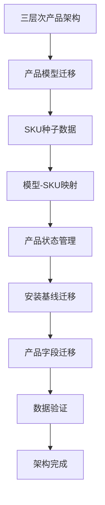

**图表来源**
- [server/migrations/016_add_product_models.sql:1-31](file://server/migrations/016_add_product_models.sql#L1-L31)
- [server/service/migrations/034_fix_product_models_and_seed.sql:1-49](file://server/service/migrations/034_fix_product_models_and_seed.sql#L1-L49)
- [server/service/migrations/035_force_seed_models_skus.sql:1-40](file://server/service/migrations/035_force_seed_models_skus.sql#L1-L40)
- [server/migrations/017_add_product_status.sql:1-17](file://server/migrations/017_add_product_status.sql#L1-L17)
- [server/migrations/015_extend_products_installed_base.sql:1-53](file://server/migrations/015_extend_products_installed_base.sql#L1-L53)
- [server/service/migrations/036_add_missing_product_fields.sql:30-38](file://server/service/migrations/036_add_missing_product_fields.sql#L30-L38)

#### 产品模型迁移

系统提供完整的三层产品架构支持：

**1. 产品模型表创建**
- `product_models`表定义基础产品型号
- 支持产品型号、内部名称、产品家族、产品类型
- 包含品牌信息、描述、英雄图片、激活状态
- 自动生成索引优化查询性能

**2. 默认产品模型种子数据**
- 预定义8个标准产品型号
- 支持MAVO Edge系列、TERRA系列、Eagle系列、Kine系列
- 包含产品家族分类（A、B、C、D）
- 支持不同类型的产品（CAMERA、VIEWFINDER、STORAGE、ACCESSORY）

#### SKU种子数据迁移

系统提供智能的SKU种子数据创建能力：

**1. 自动SKU创建**
- 从现有产品数据创建SKU条目
- 为每个产品型号创建标准SKU
- 支持SKU代码和显示名称的自动生成
- 确保SKU与产品型号的正确关联

**2. 模型-SKU映射机制**
- 建立产品模型到SKU的关联关系
- 支持多SKU对应单一产品型号
- 提供SKU的激活状态管理
- 确保SKU与产品型号的完整性

#### 产品状态管理

系统提供精确的产品状态管理：

**1. 状态字段迁移**
- 将传统is_active字段迁移到status字段
- 支持ACTIVE、IN_REPAIR、STOLEN、SCRAPPED状态
- 新建产品默认设置为ACTIVE状态
- 提供状态字段的完整性约束

**2. 状态索引优化**
- 为status字段创建查询索引
- 支持按状态过滤和统计
- 优化状态相关的查询性能

#### 安装基线迁移

系统提供完整的安装基线支持：

**1. 产品字段扩展**
- 添加product_sku字段支持SKU关联
- 添加product_type字段支持产品类型
- 扩展产品表以支持三层架构
- 提供SKU与产品实例的关联

**2. 索引优化**
- 为序列号创建查询索引
- 为当前所有者创建索引
- 为销售经销商创建索引
- 为保修状态创建索引

### 产品数据丰富化系统

**新增** 全新的产品数据丰富化系统，提供完整的测试数据创建和迁移能力：

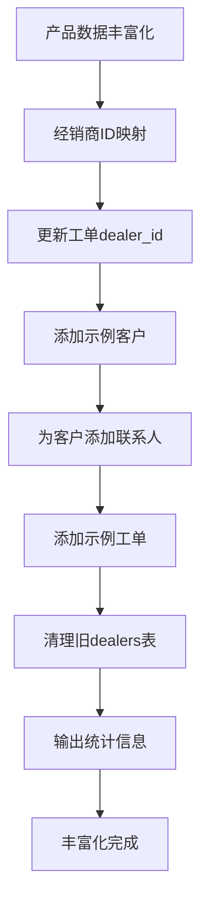

**图表来源**
- [server/scripts/enrich_sample_data.js:21-280](file://server/scripts/enrich_sample_data.js#L21-L280)

#### 示例客户数据

系统自动创建以下类型的示例客户：

**机构客户（7个）**：
- Warner Bros Studios、Netflix Production、BBC Studios
- 横店影视基地、中央电视台、ARD Germany、Framestore VFX

**个人客户（6个）**：
- John Smith、Hans Mueller、李明、张伟、Sarah Johnson、Takeshi Yamamoto

#### 示例工单数据

系统自动生成以下类型的示例工单：
- **咨询工单**：技术咨询、保修查询、维修请求等
- **RMA工单**：传感器问题、电源问题、录制问题等
- **经销商维修工单**：镜头卡口、显示屏、散热系统等

#### 经销商ID映射机制

系统自动建立旧经销商ID到新账户ID的映射关系，支持基于名称和代码的双重匹配。

### 经理到Cathy用户迁移系统

**新增** 专门处理历史数据中"Manager"用户名称迁移的系统：

```mermaid
flowchart TD
ManagerMigration[经理到Cathy迁移] --> FindManager[查找Manager用户]
FindManager --> FindCathy[查找Cathy用户]
FindCathy --> CheckActivities[检查活动记录]
CheckActivities --> UpdateActivities[更新活动记录]
UpdateActivities --> ReplaceMentions[替换@Manager提及]
ReplaceMentions --> Summary[生成迁移摘要]
Summary --> Complete[迁移完成]
```

**图表来源**
- [server/fix_manager_to_cathy.js:8-90](file://server/fix_manager_to_cathy.js#L8-L90)

#### 迁移功能特性

1. **用户查找**：自动查找并验证Manager和Cathy用户的存在
2. **活动更新**：将所有actor_name='Manager'的活动更新为'Cathy'
3. **提及修复**：替换活动内容中的@Manager提及为@Cathy
4. **用户清理**：删除不再使用的Manager用户记录
5. **完整性检查**：提供详细的迁移统计和结果摘要

### RMA账户修复系统

**新增** 解决特定RMA工单账户关联问题的修复系统：

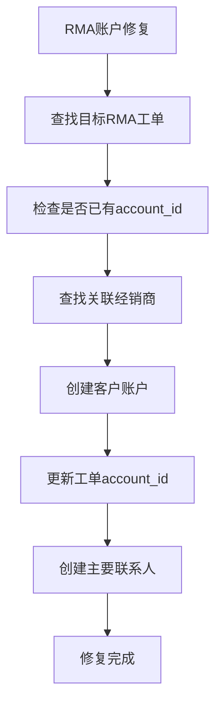

**图表来源**
- [server/fix_rma_account.js:3-65](file://server/fix_rma_account.js#L3-L65)

#### 修复流程

1. **工单定位**：根据特定工单号查找目标RMA工单
2. **账户检查**：验证工单是否已有关联的account_id
3. **经销商关联**：查找工单关联的经销商信息
4. **客户创建**：为经销商创建对应的个人客户账户
5. **工单更新**：将account_id更新到新创建的账户
6. **联系人创建**：为新账户创建主要联系人

### 数据完整性校正系统

**新增** 全面的数据完整性校正系统，涵盖多个方面的数据修复：

#### 账户修复系统

**新增** 账户表结构和数据修复系统：

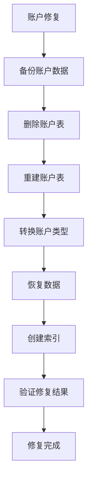

**图表来源**
- [server/fix_accounts.sql:3-53](file://server/fix_accounts.sql#L3-L53)

#### 联系人修复系统

**新增** 完整的联系人数据修复系统：

系统提供超过30个知名客户的标准联系人模板，包括：
- **国际客户**：Sony Pictures、BBC Studios、NHK Japan等
- **亚洲客户**：北京光线传媒、上海东方传媒、DP Gadget等
- **欧洲客户**：ARRI Rental、Panavision London、RMK Australia等
- **个人客户**：独立摄影师、摄影指导、映像作家等

#### 上下文数据修复系统

**新增** 客户上下文数据修复系统：

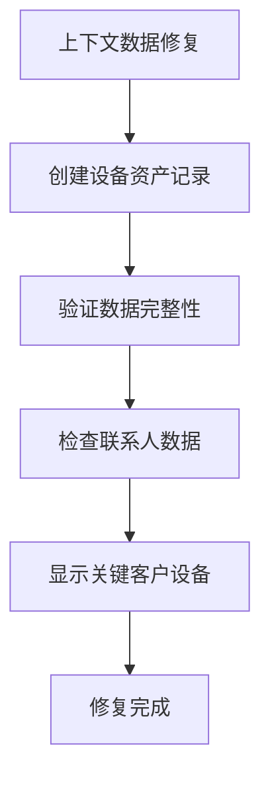

**图表来源**
- [server/fix_context_data.sql:5-74](file://server/fix_context_data.sql#L5-L74)

### 统一工单系统准备系统

**新增** 准备统一工单系统的完整修复工具链：

#### 工单ID格式修复

**新增** 全面的工单ID格式修复系统：

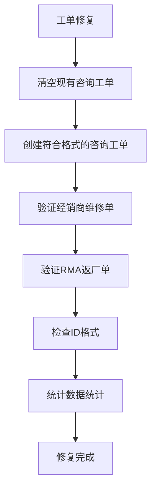

**图表来源**
- [server/scripts/fix_all_tickets.js:29-190](file://server/scripts/fix_all_tickets.js#L29-L190)

#### 全问题修复系统

**新增** 综合性的全问题修复系统：

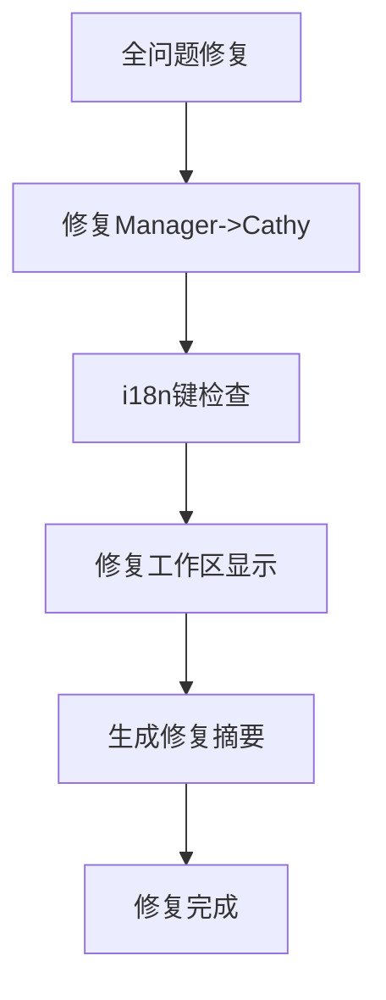

**图表来源**
- [server/scripts/fix_all_issues.js:22-101](file://server/scripts/fix_all_issues.js#L22-L101)

#### 架构完整性检查

**新增** 数据库架构完整性检查系统：

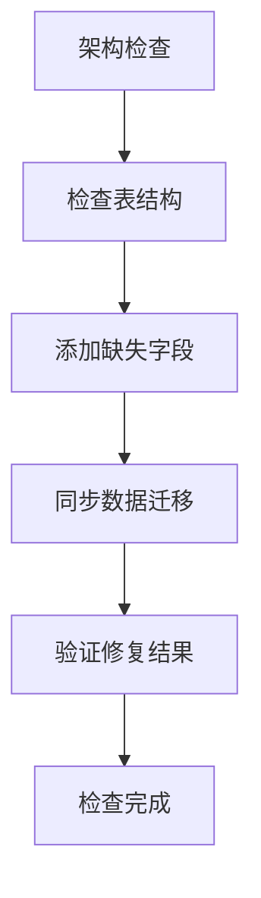

**图表来源**
- [server/check_and_fix_schema.sql:5-53](file://server/check_and_fix_schema.sql#L5-L53)

### 文件权限表优化系统

**更新** 文件权限表优化系统，提供完整的权限管理性能优化：

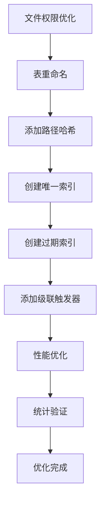

**图表来源**
- [server/migrate_file_permissions.js:1-139](file://server/migrate_file_permissions.js#L1-L139)
- [server/files/routes.js:74-91](file://server/files/routes.js#L74-L91)
- [server/index.js:117-129](file://server/index.js#L117-L129)

**章节来源**
- [server/migrations/016_add_product_models.sql:1-31](file://server/migrations/016_add_product_models.sql#L1-L31)
- [server/migrations/017_add_product_status.sql:1-17](file://server/migrations/017_add_product_status.sql#L1-L17)
- [server/migrations/015_extend_products_installed_base.sql:1-53](file://server/migrations/015_extend_products_installed_base.sql#L1-L53)
- [server/service/migrations/034_fix_product_models_and_seed.sql:1-49](file://server/service/migrations/034_fix_product_models_and_seed.sql#L1-L49)
- [server/service/migrations/035_force_seed_models_skus.sql:1-40](file://server/service/migrations/035_force_seed_models_skus.sql#L1-L40)
- [server/service/migrations/036_add_missing_product_fields.sql:30-38](file://server/service/migrations/036_add_missing_product_fields.sql#L30-L38)
- [server/scripts/enrich_sample_data.js:1-280](file://server/scripts/enrich_sample_data.js#L1-L280)
- [server/fix_manager_to_cathy.js:1-90](file://server/fix_manager_to_cathy.js#L1-L90)
- [server/fix_rma_account.js:1-65](file://server/fix_rma_account.js#L1-L65)
- [server/fix_accounts.sql:1-53](file://server/fix_accounts.sql#L1-L53)
- [server/fix_contacts.sql:1-101](file://server/fix_contacts.sql#L1-L101)
- [server/fix_context_data.sql:1-74](file://server/fix_context_data.sql#L1-L74)
- [server/scripts/fix_all_issues.js:1-101](file://server/scripts/fix_all_issues.js#L1-L101)
- [server/scripts/fix_all_tickets.js:1-190](file://server/scripts/fix_all_tickets.js#L1-L190)
- [server/check_and_fix_schema.sql:1-53](file://server/check_and_fix_schema.sql#L1-L53)
- [server/migrate_file_permissions.js:1-139](file://server/migrate_file_permissions.js#L1-L139)
- [server/files/routes.js:74-91](file://server/files/routes.js#L74-L91)
- [server/index.js:117-129](file://server/index.js#L117-L129)

## 架构概览

**更新** 整体数据迁移架构采用分层设计，支持本地和远程操作，并包含新的账户联系人架构、产品家族分类系统、智能文档更新系统、专用数据修复系统、文件权限优化系统、新增的产品数据丰富化、用户迁移修复、RMA账户修复、统一工单系统准备系统、产品安装基线迁移系统、增强工单数据修复系统、活动参与者修复系统、缺失账户链接修复系统、缺失参与者修复系统、报告者快照迁移系统、账户类型组织化迁移系统、审计和软删除系统以及回收站管理系统：

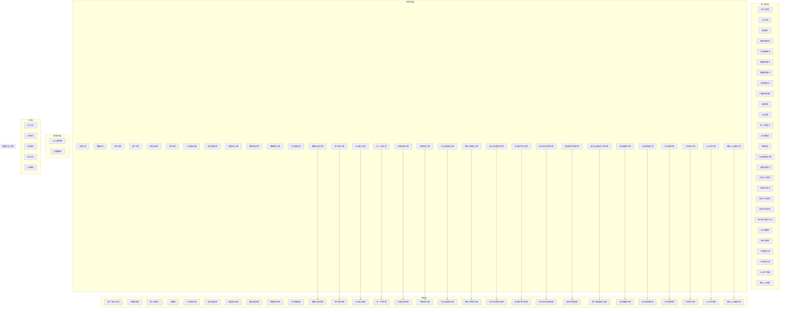

**图表来源**
- [scripts/migrate_remote_db.sh:1-19](file://scripts/migrate_remote_db.sh#L1-L19)
- [scripts/sync-db.sh:1-28](file://scripts/sync-db.sh#L1-L28)
- [server/scripts/fix_dealer_contacts.js:1-133](file://server/scripts/fix_dealer_contacts.js#L1-L133)
- [server/scripts/migrate_ticket_product_family.js:1-206](file://server/scripts/migrate_ticket_product_family.js#L1-L206)
- [scripts/update_service_docs_smart.sh:1-292](file://scripts/update_service_docs_smart.sh#L1-L292)
- [server/scripts/fix_data.sql:1-25](file://server/scripts/fix_data.sql#L1-L25)
- [server/scripts/fix_ticket_data.js:1-615](file://server/scripts/fix_ticket_data.js#L1-L615)
- [server/fix_ticket_data.js:1-186](file://server/fix_ticket_data.js#L1-L186)
- [server/scripts/check_tickets.js:1-26](file://server/scripts/check_tickets.js#L1-L26)
- [server/migrate_file_permissions.js:1-139](file://server/migrate_file_permissions.js#L1-L139)
- [server/scripts/enrich_sample_data.js:1-280](file://server/scripts/enrich_sample_data.js#L1-L280)
- [server/fix_manager_to_cathy.js:1-90](file://server/fix_manager_to_cathy.js#L1-L90)
- [server/fix_rma_account.js:1-65](file://server/fix_rma_account.js#L1-L65)
- [server/scripts/fix_all_tickets.js:1-190](file://server/scripts/fix_all_tickets.js#L1-L190)
- [server/scripts/fix_all_issues.js:1-101](file://server/scripts/fix_all_issues.js#L1-L101)
- [server/check_and_fix_schema.sql:1-53](file://server/check_and_fix_schema.sql#L1-L53)
- [server/migrations/015_extend_products_data.js:1-201](file://server/migrations/015_extend_products_data.js#L1-L201)
- [server/migrations/015_extend_products_installed_base.sql:1-54](file://server/migrations/015_extend_products_installed_base.sql#L1-L54)
- [server/fix_ticket_data.js:1-186](file://server/fix_ticket_data.js#L1-L186)
- [server/scripts/fix_ticket_data.js:1-615](file://server/scripts/fix_ticket_data.js#L1-L615)
- [server/scripts/fix_activity_actors.js:1-93](file://server/scripts/fix_activity_actors.js#L1-L93)
- [server/scripts/fix_missing_accounts.js:1-92](file://server/scripts/fix_missing_accounts.js#L1-L92)
- [server/scripts/fix_missing_participants.js:1-66](file://server/scripts/fix_missing_participants.js#L1-L66)
- [server/migrations/20260302_add_reporter_snapshot.sql:1-6](file://server/migrations/20260302_add_reporter_snapshot.sql#L1-L6)
- [server/migrations/update_account_type_to_organization.sql:1-94](file://server/migrations/update_account_type_to_organization.sql#L1-L94)
- [server/service/migrations/025_ticket_audit_softdelete.sql:1-40](file://server/service/migrations/025_ticket_audit_softdelete.sql#L1-L40)
- [server/migrations/016_add_product_models.sql:1-31](file://server/migrations/016_add_product_models.sql#L1-L31)
- [server/migrations/017_add_product_status.sql:1-17](file://server/migrations/017_add_product_status.sql#L1-L17)
- [server/service/migrations/034_fix_product_models_and_seed.sql:1-49](file://server/service/migrations/034_fix_product_models_and_seed.sql#L1-L49)
- [server/service/migrations/035_force_seed_models_skus.sql:1-40](file://server/service/migrations/035_force_seed_models_skus.sql#L1-L40)
- [server/service/migrations/036_add_missing_product_fields.sql:30-38](file://server/service/migrations/036_add_missing_product_fields.sql#L30-L38)

## 详细组件分析

### 三层次产品架构组件

**新增** 全新的三层次产品架构组件，提供完整的三层产品管理能力：

#### 产品模型迁移详解

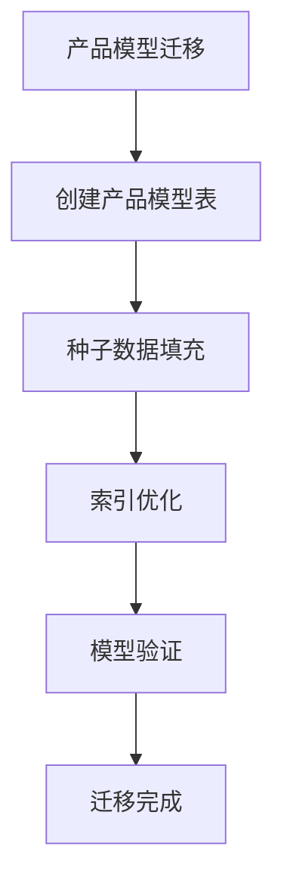

**图表来源**
- [server/migrations/016_add_product_models.sql:5-31](file://server/migrations/016_add_product_models.sql#L5-L31)

#### 产品模型表结构

系统创建了完整的三层产品架构基础：

**1. 表结构定义**
- `product_models`表定义基础产品型号
- 支持唯一的产品型号名称
- 包含内部名称、产品家族、产品类型
- 支持品牌、描述、英雄图片、激活状态
- 自动记录创建和更新时间

**2. 索引优化策略**
- `idx_product_models_family`: 按产品家族查询优化
- `idx_product_models_active`: 按激活状态查询优化
- 提升产品模型的查询性能

**3. 种子数据管理**
- 预定义8个标准产品型号
- 支持MAVO Edge系列（旗舰8K、专业6K、全画幅、S35画幅）
- 支持历史机型TERRA 4K
- 支持Eagle电子寻像器和Kine系列配件
- 自动分配产品家族和类型

#### SKU种子数据组件

**新增** 全新的SKU种子数据组件，提供智能的SKU创建能力：

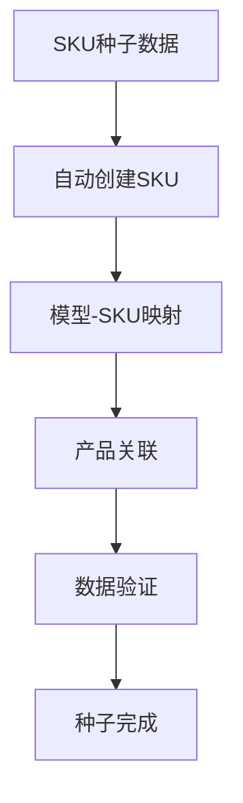

**图表来源**
- [server/service/migrations/035_force_seed_models_skus.sql:6-40](file://server/service/migrations/035_force_seed_models_skus.sql#L6-L40)

#### 自动SKU创建机制

系统提供智能的SKU创建和管理：

**1. 缺失模型检测**
- 检测存在于products表但不存在于product_models表的模型
- 自动创建缺失的产品模型条目
- 基于模型名称自动分配产品家族和类型
- 支持历史数据的自动迁移

**2. 基础SKU创建**
- 为每个产品模型创建标准SKU
- SKU代码基于模型名称生成
- 显示名称包含模型名称和标准标识
- 确保SKU的唯一性和完整性

**3. 产品关联映射**
- 将现有产品关联到新创建的SKU
- 支持批量更新产品表的sku_id字段
- 确保产品与SKU的正确关联关系

#### 产品状态管理组件

**新增** 全新的产品状态管理组件，提供精确的状态控制：

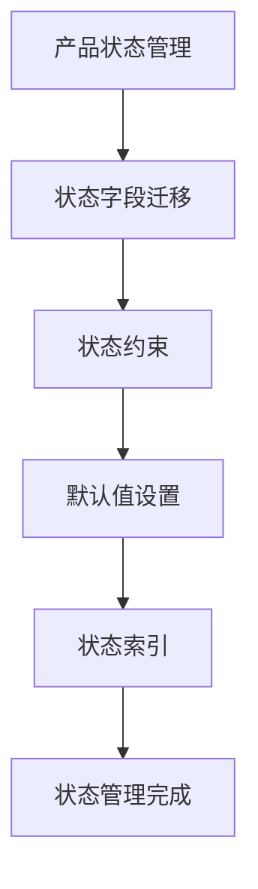

**图表来源**
- [server/migrations/017_add_product_status.sql:5-17](file://server/migrations/017_add_product_status.sql#L5-L17)

#### 状态字段迁移详解

系统提供完整的状态管理迁移：

**1. 状态字段添加**
- `status`字段替代传统的`is_active`字段
- 支持ACTIVE、IN_REPAIR、STOLEN、SCRAPPED四种状态
- 添加完整性约束确保状态值的有效性
- 默认设置为ACTIVE状态

**2. 状态索引优化**
- 为status字段创建查询索引
- 支持按状态过滤和统计查询
- 提升状态相关操作的性能

**3. 数据迁移策略**
- 将现有数据全部设置为ACTIVE状态
- 保持数据的向后兼容性
- 提供状态管理的扩展能力

#### 安装基线迁移组件

**新增** 全新的安装基线迁移组件，提供完整的设备管理：

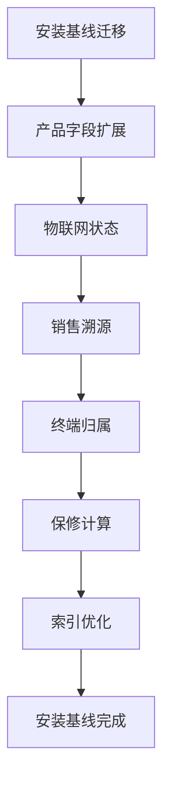

**图表来源**
- [server/migrations/015_extend_products_installed_base.sql:8-53](file://server/migrations/015_extend_products_installed_base.sql#L8-L53)
- [server/service/migrations/036_add_missing_product_fields.sql:30-38](file://server/service/migrations/036_add_missing_product_fields.sql#L30-L38)

#### 产品字段扩展详解

系统提供完整的安装基线字段扩展：

**1. 物理身份扩展**
- `product_sku`字段支持SKU关联
- `product_type`字段支持产品类型
- 扩展产品表以支持三层架构

**2. 物联网状态**
- `is_iot_device`布尔字段标识物联网设备
- `is_activated`激活状态跟踪
- `activation_date`激活日期记录
- `last_connected_at`最后连接时间
- `ip_address`设备IP地址

**3. 销售溯源**
- `sales_channel`销售渠道标识
- `original_order_id`原始订单号
- `sold_to_dealer_id`销售给经销商
- `ship_to_dealer_date`发往经销商日期

**4. 终端归属**
- `current_owner_id`当前所有者
- `registration_date`注册日期
- `sales_invoice_date`发票日期
- `sales_invoice_proof`发票证明

**5. 保修计算**
- `warranty_source`保修来源
- `warranty_start_date`保修开始日期
- `warranty_months`保修月数
- `warranty_end_date`保修结束日期
- `warranty_status`保修状态

**6. 索引优化策略**
- `idx_products_serial_number`: 按序列号查询优化
- `idx_products_current_owner`: 按当前所有者查询优化
- `idx_products_sold_to_dealer`: 按销售经销商查询优化
- `idx_products_warranty_status`: 按保修状态查询优化

### 产品数据丰富化组件

**新增** 全新的产品数据丰富化组件，提供完整的测试数据创建能力：

#### 数据丰富化流程

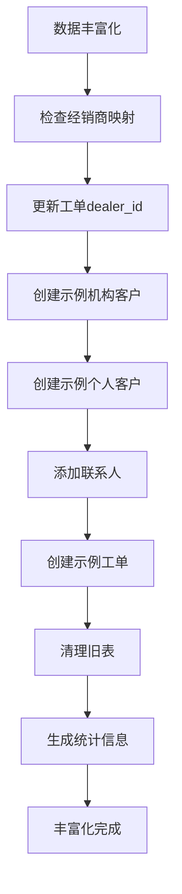

**图表来源**
- [server/scripts/enrich_sample_data.js:21-280](file://server/scripts/enrich_sample_data.js#L21-L280)

#### 示例数据生成

系统自动生成以下类型的示例数据：

**机构客户模板**：
- 基于真实公司名称和行业标签
- 支持多地区和多语言环境
- 包含标准的联系方式和行业信息

**个人客户模板**：
- 基于真实姓名和职业背景
- 支持不同国家和地区
- 包含标准的个人联系方式

**工单模板**：
- 基于真实产品型号和常见问题
- 支持不同工单类型和状态
- 包含标准的问题描述和解决方案

#### 经销商ID映射机制

系统提供智能的经销商ID映射功能：
- 支持基于名称和代码的双重匹配
- 自动处理大小写和特殊字符
- 提供详细的映射关系报告

**章节来源**
- [server/migrations/016_add_product_models.sql:1-31](file://server/migrations/016_add_product_models.sql#L1-L31)
- [server/migrations/017_add_product_status.sql:1-17](file://server/migrations/017_add_product_status.sql#L1-L17)
- [server/migrations/015_extend_products_installed_base.sql:1-53](file://server/migrations/015_extend_products_installed_base.sql#L1-L53)
- [server/service/migrations/034_fix_product_models_and_seed.sql:1-49](file://server/service/migrations/034_fix_product_models_and_seed.sql#L1-L49)
- [server/service/migrations/035_force_seed_models_skus.sql:1-40](file://server/service/migrations/035_force_seed_models_skus.sql#L1-L40)
- [server/service/migrations/036_add_missing_product_fields.sql:30-38](file://server/service/migrations/036_add_missing_product_fields.sql#L30-L38)
- [server/scripts/enrich_sample_data.js:1-280](file://server/scripts/enrich_sample_data.js#L1-L280)

### 经理到Cathy用户迁移组件

**新增** 专门处理历史数据中用户名称迁移的组件：

#### 用户迁移流程

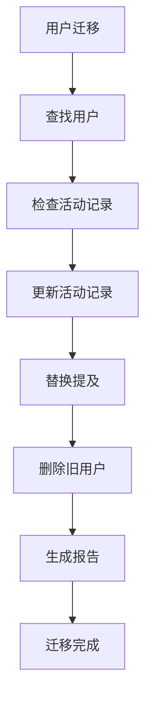

**图表来源**
- [server/fix_manager_to_cathy.js:8-90](file://server/fix_manager_to_cathy.js#L8-L90)

#### 迁移策略

系统采用渐进式迁移策略：
1. **用户查找**：自动验证源用户和目标用户的完整性
2. **活动更新**：批量更新所有相关的活动记录
3. **内容修复**：处理工单内容中的用户提及
4. **数据清理**：删除不再使用的用户记录
5. **结果验证**：提供详细的迁移统计和结果

#### 错误处理机制

系统提供完善的错误处理：
- 用户不存在时的安全退出
- 活动记录更新的事务保护
- 内容替换的模式匹配
- 迁移过程的详细日志记录

**章节来源**
- [server/fix_manager_to_cathy.js:1-90](file://server/fix_manager_to_cathy.js#L1-L90)

### RMA账户修复组件

**新增** 解决特定RMA工单账户关联问题的修复组件：

#### RMA修复流程

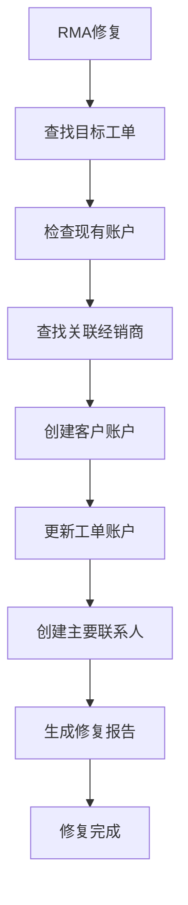

**图表来源**
- [server/fix_rma_account.js:3-65](file://server/fix_rma_account.js#L3-L65)

#### 修复策略

系统采用自动化的修复策略：
1. **工单定位**：根据特定工单号精确定位目标工单
2. **账户检查**：验证工单是否已有关联的账户
3. **经销商关联**：自动查找工单关联的经销商信息
4. **客户创建**：为经销商创建对应的个人客户账户
5. **联系人创建**：为新账户创建主要联系人
6. **数据同步**：更新工单的账户关联信息

#### 数据一致性保证

系统确保修复过程的数据一致性：
- 使用事务处理确保操作原子性
- 提供详细的修复日志和统计信息
- 自动验证修复结果的正确性

**章节来源**
- [server/fix_rma_account.js:1-65](file://server/fix_rma_account.js#L1-L65)

### 数据完整性校正组件

**新增** 全面的数据完整性校正组件，涵盖多个方面的数据修复：

#### 账户修复组件

**新增** 账户表结构和数据修复组件：

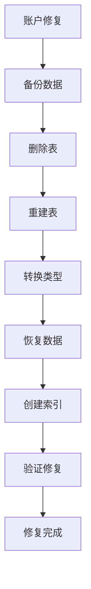

**图表来源**
- [server/fix_accounts.sql:3-53](file://server/fix_accounts.sql#L3-L53)

#### 联系人修复组件

**新增** 完整的联系人数据修复组件：

系统提供超过30个知名客户的标准联系人模板，包括：
- **好莱坞电影公司**：Sony Pictures、Netflix Studios、BBC Studios
- **亚洲媒体机构**：北京光线传媒、上海东方传媒、NHK Japan
- **欧洲制作公司**：ARRI Rental、Panavision London、RMK Australia
- **独立摄影师**：个人客户联系人模板

#### 上下文数据修复组件

**新增** 客户上下文数据修复组件：

系统自动创建关键客户的设备资产记录：
- **设备序列号**：基于工单号生成的唯一标识符
- **固件版本**：对应产品的标准固件版本
- **保修信息**：标准的保修期限设置
- **设备状态**：统一的设备状态管理

**章节来源**
- [server/fix_accounts.sql:1-53](file://server/fix_accounts.sql#L1-L53)
- [server/fix_contacts.sql:1-101](file://server/fix_contacts.sql#L1-L101)
- [server/fix_context_data.sql:1-74](file://server/fix_context_data.sql#L1-L74)

### 统一工单系统准备组件

**新增** 准备统一工单系统的完整修复工具链组件：

#### 工单ID格式修复组件

**新增** 全面的工单ID格式修复组件：

```mermaid
flowchart TD
TicketFix[工单修复] --> ClearInquiry[清空咨询工单]
ClearInquiry --> CreateInquiry[创建规范工单]
CreateInquiry --> VerifyRepairs[验证维修工单]
VerifyRepairs --> VerifyRMA[验证RMA工单]
VerifyRMA --> CheckFormats[检查ID格式]
CheckFormats --> GenerateStats[生成统计]
GenerateStats --> Complete[修复完成]
```

**图表来源**
- [server/scripts/fix_all_tickets.js:29-190](file://server/scripts/fix_all_tickets.js#L29-L190)

#### 全问题修复组件

**新增** 综合性的全问题修复组件：

系统提供一站式的问题修复解决方案：
1. **用户迁移**：修复Manager到Cathy的用户名称迁移
2. **国际化检查**：检查和修复未处理的i18n键
3. **界面修复**：修复工作区工单标题显示问题

#### 架构完整性检查组件

**新增** 数据库架构完整性检查组件：

```mermaid
flowchart TD
SchemaCheck[架构检查] --> CheckTables[检查表结构]
CheckTables --> AddColumns[添加缺失列]
AddColumns --> SyncData[同步数据迁移]
SyncData --> VerifyIntegrity[验证完整性]
VerifyIntegrity --> GenerateReport[生成报告]
GenerateReport --> Complete[检查完成]
```

**图表来源**
- [server/check_and_fix_schema.sql:5-53](file://server/check_and_fix_schema.sql#L5-L53)

**章节来源**
- [server/scripts/fix_all_tickets.js:1-190](file://server/scripts/fix_all_tickets.js#L1-L190)
- [server/scripts/fix_all_issues.js:1-101](file://server/scripts/fix_all_issues.js#L1-L101)
- [server/check_and_fix_schema.sql:1-53](file://server/check_and_fix_schema.sql#L1-L53)

### 文件权限表优化组件

**更新** 文件权限表优化组件，提供完整的权限管理性能优化：

#### 权限表结构优化

文件权限表（file_permissions）经过全面优化：

- **表重命名**：从 permissions 重命名为 file_permissions
- **路径哈希**：新增 path_hash 字段用于快速查询
- **唯一索引**：user_id + folder_path 组合唯一索引
- **过期索引**：expires_at 过期时间索引优化查询性能

#### 权限查询优化

权限检查逻辑使用多层路径匹配：

```mermaid
flowchart TD
PermissionCheck[权限检查] --> NormalizePath[规范化路径]
NormalizePath --> SplitPath[分割路径段]
SplitPath --> CheckRoot[检查根路径]
CheckRoot --> CheckParent[检查父路径]
CheckParent --> CheckCurrent[检查当前路径]
CheckCurrent --> ExpiredCheck[检查过期时间]
ExpiredCheck --> AccessType[返回访问类型]
```

**图表来源**
- [server/files/routes.js:74-91](file://server/files/routes.js#L74-L91)

#### 级联删除触发器

系统提供自动清理机制：

- **用户删除触发器**：当用户被删除时自动清理其权限记录
- **数据完整性保证**：防止孤儿权限记录产生
- **自动维护**：无需手动干预的权限清理

#### 性能优化策略

1. **路径哈希计算**：使用MD5算法对folder_path进行哈希
2. **索引优化**：创建多维度查询索引
3. **过期时间过滤**：支持按时间范围查询
4. **批量更新**：支持大量权限记录的批量处理

#### 迁移脚本功能

migrate_file_permissions.js 脚本提供完整的迁移能力：

- **表结构验证**：检查 file_permissions 表是否存在
- **字段添加**：自动添加 path_hash 字段
- **数据迁移**：为现有记录生成路径哈希
- **索引创建**：创建优化查询所需的索引
- **触发器安装**：设置级联删除机制
- **统计验证**：提供迁移后的数据统计

**章节来源**
- [server/migrate_file_permissions.js:1-139](file://server/migrate_file_permissions.js#L1-L139)
- [server/files/routes.js:74-91](file://server/files/routes.js#L74-L91)
- [server/index.js:117-129](file://server/index.js#L117-L129)

### 其他迁移组件

#### 经销商迁移组件

##### 基础迁移 (migrate_dealers.js)

该组件提供简单直接的经销商数据迁移功能：

**核心功能**：
- 从旧的 dealers 表读取所有经销商数据
- 将数据转换为新的 customers 表格式
- 自动创建迁移映射表
- 更新相关表的外键引用

**数据转换规则**：
- customer_type: 固定为 'Dealer'
- contact_person: 对应原 contact_person
- notes 字段自动添加迁移代码前缀
- 默认账户类型: 'Distributor'
- 默认服务等级: 'Level1'

##### 高级迁移 (migrate_dealers_v2.js)

该组件提供完整的数据库结构迁移：

**核心功能**：
- 禁用外键约束以允许ID更新
- 执行数据迁移和结构更新
- 重建相关视图和索引
- 重新启用外键约束

**迁移步骤**：
1. 数据迁移阶段：将经销商转换为客户
2. ID更新阶段：更新所有相关表的外键引用
3. 结构迁移阶段：更新数据库表结构定义
4. 清理阶段：重命名旧表避免混淆

#### 知识库迁移组件

##### 来源字段迁移

该迁移脚本为知识库文章添加来源追踪功能：

**新增字段**：
- `source_type`: 来源类型 (Manual/PDF/URL/Text)
- `source_reference`: 来源文件名或引用
- `source_url`: 如果来源是网页则存储URL

**性能优化**：
- 为 source_type 创建索引
- 为 source_reference 创建索引

##### 审计日志迁移

创建完整的知识库操作审计系统：

**审计字段**：
- 操作类型和详情
- 文章信息快照
- 分类和产品线信息
- 变更内容摘要
- 操作人信息
- 时间戳追踪

**索引优化**：
- 按操作类型查询优化
- 按文章ID关联查询优化
- 按用户和时间查询优化

#### AI使用日志迁移

创建AI使用统计跟踪系统：

**日志表结构**：
- 模型信息
- 任务类型
- Token使用统计
- 时间戳记录

**应用场景**：
- AI模型使用监控
- 成本分析和优化
- 性能基准测试

#### 远程迁移组件

##### 远程数据库迁移

支持通过SSH远程执行数据库迁移：

**功能特性**：
- 自动SSH连接到远程服务器
- 执行SQL迁移脚本
- 验证迁移结果
- 错误处理和日志记录

**安全机制**：
- 使用heredoc语法避免命令注入
- 支持远程服务器配置
- 自动清理临时连接

##### 数据库同步工具

提供双向数据库同步功能：

**同步流程**：
- 本地数据库备份
- 远程服务器连接
- 文件传输和替换
- 服务重启通知

**安全措施**：
- 用户确认机制
- 连接状态检查
- 失败回滚处理

**章节来源**
- [scripts/migrate_dealers.js:7-85](file://scripts/migrate_dealers.js#L7-L85)
- [scripts/migrate_dealers_v2.js:7-232](file://scripts/migrate_dealers_v2.js#L7-L232)
- [server/migrations/migrate_to_accounts.sql:1-175](file://server/migrations/migrate_to_accounts.sql#L1-L175)
- [server/service/migrations/012_account_contact_architecture.sql:1-131](file://server/service/migrations/012_account_contact_architecture.sql#L1-L131)
- [server/service/migrations/013_migrate_to_account_contact.sql:1-284](file://server/service/migrations/013_migrate_to_account_contact.sql#L1-L284)
- [server/service/migrations/014_dealer_deactivation.sql:1-35](file://server/service/migrations/014_dealer_deactivation.sql#L1-L35)
- [server/service/migrations/015_update_account_types.sql:1-30](file://server/service/migrations/015_update_account_types.sql#L1-L30)
- [server/service/migrations/016_add_account_deleted_fields.sql:1-12](file://server/service/migrations/016_add_account_deleted_fields.sql#L1-L12)
- [server/service/migrations/017_fix_dealer_fk_references.sql:1-137](file://server/service/migrations/017_fix_dealer_fk_references.sql#L1-L137)
- [server/scripts/fix_dealer_contacts.js:1-133](file://server/scripts/fix_dealer_contacts.js#L1-L133)
- [server/migrations/fix_departments_permissions.sql:1-58](file://server/migrations/fix_departments_permissions.sql#L1-L58)
- [scripts/update_service_docs_smart.sh:1-292](file://scripts/update_service_docs_smart.sh#L1-L292)
- [server/migrate_file_permissions.js:1-139](file://server/migrate_file_permissions.js#L1-L139)

## 依赖关系分析

**更新** 数据迁移脚本之间的依赖关系反映了新的账户联系人架构、产品家族分类系统、智能文档更新系统、专用数据修复系统、文件权限优化系统、新增的产品数据丰富化、用户迁移修复、RMA账户修复、统一工单系统准备系统、产品安装基线迁移系统、增强工单数据修复系统、活动参与者修复系统、缺失账户链接修复系统、缺失参与者修复系统、报告者快照迁移系统、账户类型组织化迁移系统、审计和软删除系统以及回收站管理系统的协同工作：

```mermaid
graph TD
subgraph "核心依赖"
BetterSQLite[better-sqlite3]
Path[path模块]
FSExtra[fs-extra]
Git[git命令]
Crypto[crypto模块]
end
subgraph "迁移脚本"
AccountMigration[migrate_to_accounts.sql]
AccountArchitecture[012_account_contact_architecture.sql]
AccountMigration2[013_migrate_to_account_contact.sql]
DealerDeactivation[014_dealer_deactivation.sql]
AccountTypes[015_update_account_types.sql]
SoftDelete[016_add_account_deleted_fields.sql]
FKFix[017_fix_dealer_fk_references.sql]
FixContacts[fix_dealer_contacts.js]
FixPermissions[fix_departments_permissions.sql]
ImportDealers[import_dealers_from_tickets.js]
ProductFamily[fix_product_family_names.js]
UpdateFamily[update_product_families.js]
TicketFamily[migrate_ticket_product_family.js]
RemoteMigrate[migrate_remote_db.sh]
SyncDB[sync-db.sh]
SmartDoc[update_service_docs_smart.sh]
FixData[fix_data.sql]
FixTicketData[fix_ticket_data.js]
FixServiceTickets[fix_service_tickets.js]
CheckTickets[check_tickets.js]
FilePermOpt[migrate_file_permissions.js]
EndDataEnrich[enrich_sample_data.js]
ManagerMigration[fix_manager_to_cathy.js]
RMARepair[fix_rma_account.js]
FixAccounts[fix_accounts.sql]
FixContactsSQL[fix_contacts.sql]
FixContext[fix_context_data.sql]
FixAllIssues[fix_all_issues.js]
FixAllTickets[fix_all_tickets.js]
SchemaCheck[check_and_fix_schema.sql]
ExtendProducts[015_extend_products_data.js]
InstalledBaseSQL[015_extend_products_installed_base.sql]
EnhancedFixJS[server/scripts/fix_ticket_data.js]
BasicFixJS[server/fix_ticket_data.js]
ActivityFixJS[server/scripts/fix_activity_actors.js]
AccountFixJS[server/scripts/fix_missing_accounts.js]
ParticipantFixJS[server/scripts/fix_missing_participants.js]
ReporterFixSQL[20260302_add_reporter_snapshot.sql]
OrgFixSQL[update_account_type_to_organization.sql]
AuditSoftDeleteSQL[025_ticket_audit_softdelete.sql]
ProductModelsSQL[016_add_product_models.sql]
ProductStatusSQL[017_add_product_status.sql]
InstalledBaseFix[034_fix_product_models_and_seed.sql]
SKUSeedFix[035_force_seed_models_skus.sql]
ProductFieldsFix[036_add_missing_product_fields.sql]
end
subgraph "SQL迁移"
KnowledgeFields[add_knowledge_source_fields.sql]
KnowledgeAudit[add_knowledge_audit_log.sql]
ShareCollections[add_share_collections.sql]
Phase2[phase2.sql]
ApplyMigrations[apply_service_migrations.js]
TicketProductFamily[011_add_ticket_product_family.sql]
end
subgraph "文件权限系统"
FilePermRoutes[files/routes.js]
FilePermSchema[index.js]
end
subgraph "数据修复工具链"
EndDataEnrich --> FixAllTickets
ManagerMigration --> FixAllIssues
RMARepair --> FixAllIssues
FixAccounts --> FixAllIssues
FixContactsSQL --> FixAllIssues
FixContext --> FixAllIssues
SchemaCheck --> FixAllIssues
FixAllTickets --> FixAllIssues
ExtendProducts --> InstalledBaseSQL
EnhancedFixJS --> BasicFixJS
ActivityFixJS --> FixAllIssues
AccountFixJS --> FixAllIssues
ParticipantFixJS --> FixAllIssues
ReporterFixSQL --> FixAllIssues
OrgFixSQL --> FixAllIssues
AuditSoftDeleteSQL --> FixAllIssues
ProductModelsSQL --> InstalledBaseFix
ProductStatusSQL --> InstalledBaseFix
InstalledBaseFix --> SKUSeedFix
SKUSeedFix --> ProductFieldsFix
ProductFieldsFix --> FixAllIssues
end
BetterSQLite --> AccountMigration
BetterSQLite --> AccountMigration2
BetterSQLite --> DealerDeactivation
BetterSQLite --> AccountTypes
BetterSQLite --> SoftDelete
BetterSQLite --> FKFix
BetterSQLite --> FixContacts
BetterSQLite --> FixPermissions
BetterSQLite --> ImportDealers
BetterSQLite --> ProductFamily
BetterSQLite --> UpdateFamily
BetterSQLite --> TicketFamily
BetterSQLite --> FixData
BetterSQLite --> FixTicketData
BetterSQLite --> FixServiceTickets
BetterSQLite --> CheckTickets
BetterSQLite --> FilePermOpt
BetterSQLite --> EndDataEnrich
BetterSQLite --> ManagerMigration
BetterSQLite --> RMARepair
BetterSQLite --> FixAccounts
BetterSQLite --> FixContactsSQL
BetterSQLite --> FixContext
BetterSQLite --> FixAllIssues
BetterSQLite --> FixAllTickets
BetterSQLite --> SchemaCheck
BetterSQLite --> ExtendProducts
BetterSQLite --> EnhancedFixJS
BetterSQLite --> BasicFixJS
BetterSQLite --> ActivityFixJS
BetterSQLite --> AccountFixJS
BetterSQLite --> ParticipantFixJS
BetterSQLite --> ReporterFixSQL
BetterSQLite --> OrgFixSQL
BetterSQLite --> AuditSoftDeleteSQL
BetterSQLite --> ProductModelsSQL
BetterSQLite --> ProductStatusSQL
BetterSQLite --> InstalledBaseFix
BetterSQLite --> SKUSeedFix
BetterSQLite --> ProductFieldsFix
Path --> AccountMigration
Path --> AccountMigration2
Path --> DealerDeactivation
Path --> AccountTypes
Path --> SoftDelete
Path --> FKFix
Path --> FixContacts
Path --> FixPermissions
Path --> ImportDealers
Path --> ProductFamily
Path --> UpdateFamily
Path --> TicketFamily
Path --> FixData
Path --> FixTicketData
Path --> FixServiceTickets
Path --> CheckTickets
Path --> FilePermOpt
Path --> EndDataEnrich
Path --> ManagerMigration
Path --> RMARepair
Path --> FixAccounts
Path --> FixContactsSQL
Path --> FixContext
Path --> FixAllIssues
Path --> FixAllTickets
Path --> SchemaCheck
Path --> ExtendProducts
Path --> EnhancedFixJS
Path --> BasicFixJS
Path --> ActivityFixJS
Path --> AccountFixJS
Path --> ParticipantFixJS
Path --> ReporterFixSQL
Path --> OrgFixSQL
Path --> AuditSoftDeleteSQL
Path --> ProductModelsSQL
Path --> ProductStatusSQL
Path --> InstalledBaseFix
Path --> SKUSeedFix
Path --> ProductFieldsFix
FSExtra --> AccountMigration2
FSExtra --> FixContacts
FSExtra --> FixPermissions
FSExtra --> EndDataEnrich
Git --> SmartDoc
Crypto --> FilePermOpt
FilePermOpt --> FilePermRoutes
FilePermOpt --> FilePermSchema
FilePermRoutes --> FilePermSchema
KnowledgeFields --> AccountMigration2
KnowledgeAudit --> AccountMigration2
ShareCollections --> AccountMigration2
Phase2 --> AccountMigration2
ApplyMigrations --> AccountArchitecture
ApplyMigrations --> AccountMigration2
ApplyMigrations --> DealerDeactivation
ApplyMigrations --> AccountTypes
ApplyMigrations --> SoftDelete
ApplyMigrations --> FKFix
ApplyMigrations --> TicketProductFamily
TicketProductFamily --> TicketFamily
TicketFamily --> ProductFamily
ProductFamily --> UpdateFamily
SmartDoc --> Git
FixData --> BetterSQLite
FixTicketData --> BetterSQLite
FixServiceTickets --> BetterSQLite
CheckTickets --> BetterSQLite
EndDataEnrich --> BetterSQLite
ManagerMigration --> BetterSQLite
RMARepair --> BetterSQLite
FixAccounts --> BetterSQLite
FixContactsSQL --> BetterSQLite
FixContext --> BetterSQLite
FixAllIssues --> BetterSQLite
FixAllTickets --> BetterSQLite
SchemaCheck --> BetterSQLite
ExtendProducts --> InstalledBaseSQL
EnhancedFixJS --> BasicFixJS
ActivityFixJS --> BetterSQLite
AccountFixJS --> BetterSQLite
ParticipantFixJS --> BetterSQLite
ReporterFixSQL --> BetterSQLite
OrgFixSQL --> BetterSQLite
AuditSoftDeleteSQL --> BetterSQLite
ProductModelsSQL --> BetterSQLite
ProductStatusSQL --> BetterSQLite
InstalledBaseFix --> BetterSQLite
SKUSeedFix --> BetterSQLite
ProductFieldsFix --> BetterSQLite
end
```

**图表来源**
- [server/migrations/migrate_to_accounts.sql:1-5](file://server/migrations/migrate_to_accounts.sql#L1-L5)
- [server/service/migrations/012_account_contact_architecture.sql:1-5](file://server/service/migrations/012_account_contact_architecture.sql#L1-L5)
- [server/apply_service_migrations.js:1-64](file://server/apply_service_migrations.js#L1-L64)
- [scripts/update_service_docs_smart.sh:20-29](file://scripts/update_service_docs_smart.sh#L20-L29)
- [server/scripts/fix_data.sql:1-25](file://server/scripts/fix_data.sql#L1-L25)
- [server/migrate_file_permissions.js:11-13](file://server/migrate_file_permissions.js#L11-L13)
- [server/files/routes.js:74-83](file://server/files/routes.js#L74-L83)
- [server/index.js:117-129](file://server/index.js#L117-L129)
- [server/scripts/enrich_sample_data.js:10-14](file://server/scripts/enrich_sample_data.js#L10-L14)
- [server/fix_manager_to_cathy.js](file://server/fix_manager_to_cathy.js#L6)
- [server/fix_rma_account.js](file://server/fix_rma_account.js#L1)
- [server/fix_accounts.sql](file://server/fix_accounts.sql#L1)
- [server/fix_contacts.sql](file://server/fix_contacts.sql#L1)
- [server/fix_context_data.sql](file://server/fix_context_data.sql#L1)
- [server/scripts/fix_all_issues.js:9-13](file://server/scripts/fix_all_issues.js#L9-L13)
- [server/scripts/fix_all_tickets.js:1-3](file://server/scripts/fix_all_tickets.js#L1-L3)
- [server/migrations/015_extend_products_data.js:11-13](file://server/migrations/015_extend_products_data.js#L11-L13)
- [server/migrations/015_extend_products_installed_base.sql:1-3](file://server/migrations/015_extend_products_installed_base.sql#L1-L3)
- [server/fix_ticket_data.js:7-9](file://server/fix_ticket_data.js#L7-L9)
- [server/scripts/fix_ticket_data.js:7-9](file://server/scripts/fix_ticket_data.js#L7-L9)
- [server/scripts/fix_activity_actors.js:8-12](file://server/scripts/fix_activity_actors.js#L8-L12)
- [server/scripts/fix_missing_accounts.js:1-6](file://server/scripts/fix_missing_accounts.js#L1-L6)
- [server/scripts/fix_missing_participants.js:9-14](file://server/scripts/fix_missing_participants.js#L9-L14)
- [server/migrations/20260302_add_reporter_snapshot.sql:1-6](file://server/migrations/20260302_add_reporter_snapshot.sql#L1-L6)
- [server/migrations/update_account_type_to_organization.sql:1-94](file://server/migrations/update_account_type_to_organization.sql#L1-L94)
- [server/service/migrations/025_ticket_audit_softdelete.sql:1-40](file://server/service/migrations/025_ticket_audit_softdelete.sql#L1-L40)
- [server/migrations/016_add_product_models.sql:1-5](file://server/migrations/016_add_product_models.sql#L1-L5)
- [server/migrations/017_add_product_status.sql:1-5](file://server/migrations/017_add_product_status.sql#L1-L5)
- [server/service/migrations/034_fix_product_models_and_seed.sql:1-5](file://server/service/migrations/034_fix_product_models_and_seed.sql#L1-L5)
- [server/service/migrations/035_force_seed_models_skus.sql:1-5](file://server/service/migrations/035_force_seed_models_skus.sql#L1-L5)
- [server/service/migrations/036_add_missing_product_fields.sql:30-38](file://server/service/migrations/036_add_missing_product_fields.sql#L30-L38)

**章节来源**
- [server/migrations/migrate_to_accounts.sql:1-175](file://server/migrations/migrate_to_accounts.sql#L1-L175)
- [server/service/migrations/012_account_contact_architecture.sql:1-131](file://server/service/migrations/012_account_contact_architecture.sql#L1-L131)
- [server/apply_service_migrations.js:1-64](file://server/apply_service_migrations.js#L1-L64)
- [scripts/update_service_docs_smart.sh:1-292](file://scripts/update_service_docs_smart.sh#L1-L292)
- [server/scripts/fix_data.sql:1-25](file://server/scripts/fix_data.sql#L1-L25)
- [server/migrate_file_permissions.js:1-139](file://server/migrate_file_permissions.js#L1-L139)
- [server/files/routes.js:74-91](file://server/files/routes.js#L74-L91)
- [server/index.js:117-129](file://server/index.js#L117-L129)
- [server/scripts/enrich_sample_data.js:1-280](file://server/scripts/enrich_sample_data.js#L1-L280)
- [server/fix_manager_to_cathy.js:1-90](file://server/fix_manager_to_cathy.js#L1-L90)
- [server/fix_rma_account.js:1-65](file://server/fix_rma_account.js#L1-L65)
- [server/fix_accounts.sql:1-53](file://server/fix_accounts.sql#L1-L53)
- [server/fix_contacts.sql:1-101](file://server/fix_contacts.sql#L1-L101)
- [server/fix_context_data.sql:1-74](file://server/fix_context_data.sql#L1-L74)
- [server/scripts/fix_all_issues.js:1-101](file://server/scripts/fix_all_issues.js#L1-L101)
- [server/scripts/fix_all_tickets.js:1-190](file://server/scripts/fix_all_tickets.js#L1-L190)
- [server/check_and_fix_schema.sql:1-53](file://server/check_and_fix_schema.sql#L1-L53)
- [server/migrations/015_extend_products_data.js:1-201](file://server/migrations/015_extend_products_data.js#L1-L201)
- [server/migrations/015_extend_products_installed_base.sql:1-54](file://server/migrations/015_extend_products_installed_base.sql#L1-L54)
- [server/fix_ticket_data.js:1-186](file://server/fix_ticket_data.js#L1-L186)
- [server/scripts/fix_ticket_data.js:1-615](file://server/scripts/fix_ticket_data.js#L1-L615)
- [server/scripts/fix_activity_actors.js:1-93](file://server/scripts/fix_activity_actors.js#L1-L93)
- [server/scripts/fix_missing_accounts.js:1-92](file://server/scripts/fix_missing_accounts.js#L1-L92)
- [server/scripts/fix_missing_participants.js:1-66](file://server/scripts/fix_missing_participants.js#L1-L66)
- [server/migrations/20260302_add_reporter_snapshot.sql:1-6](file://server/migrations/20260302_add_reporter_snapshot.sql#L1-L6)
- [server/migrations/update_account_type_to_organization.sql:1-94](file://server/migrations/update_account_type_to_organization.sql#L1-L94)
- [server/service/migrations/025_ticket_audit_softdelete.sql:1-40](file://server/service/migrations/025_ticket_audit_softdelete.sql#L1-L40)
- [server/migrations/016_add_product_models.sql:1-31](file://server/migrations/016_add_product_models.sql#L1-L31)
- [server/migrations/017_add_product_status.sql:1-17](file://server/migrations/017_add_product_status.sql#L1-L17)
- [server/service/migrations/034_fix_product_models_and_seed.sql:1-49](file://server/service/migrations/034_fix_product_models_and_seed.sql#L1-L49)
- [server/service/migrations/035_force_seed_models_skus.sql:1-40](file://server/service/migrations/035_force_seed_models_skus.sql#L1-L40)
- [server/service/migrations/036_add_missing_product_fields.sql:30-38](file://server/service/migrations/036_add_missing_product_fields.sql#L30-L38)

## 性能考虑

### 数据库性能优化

**更新** 新增账户联系人架构、产品家族分类系统、智能文档更新系统、专用数据修复系统、文件权限优化系统、产品数据丰富化、用户迁移修复、RMA账户修复、统一工单系统准备系统、产品安装基线迁移系统、增强工单数据修复系统、活动参与者修复系统、缺失账户链接修复系统、缺失参与者修复系统、报告者快照迁移系统、账户类型组织化迁移系统、审计和软删除系统以及回收站管理系统的性能考虑：

1. **索引策略**：
   - 为频繁查询的字段创建索引
   - 避免过度索引影响写入性能
   - 定期分析查询计划
   - **新增账户编号生成索引优化**
   - **新增产品家族分类索引优化**
   - **新增智能文档更新索引优化**
   - **新增数据修复脚本索引优化**
   - **新增文件权限表索引优化**
   - **新增产品数据丰富化索引优化**
   - **新增用户迁移索引优化**
   - **新增RMA修复索引优化**
   - **新增统一工单索引优化**
   - **新增产品安装基线索引优化**
   - **新增增强工单修复索引优化**
   - **新增活动参与者修复索引优化**
   - **新增缺失账户修复索引优化**
   - **新增缺失参与者修复索引优化**
   - **新增报告者快照索引优化**
   - **新增账户类型组织化索引优化**
   - **新增审计软删除索引优化**
   - **新增回收站查询索引优化**
   - **新增产品模型查询索引优化**
   - **新增SKU关联查询索引优化**
   - **新增产品状态查询索引优化**

2. **事务处理**：
   - 使用批量事务减少提交开销
   - 合理控制事务大小
   - 实施适当的锁策略
   - **迁移过程中的事务隔离**
   - **产品家族分类的批量处理优化**
   - **智能文档更新的原子性保证**
   - **数据修复脚本的事务管理**
   - **文件权限表的批量更新优化**
   - **产品数据丰富化的批量插入优化**
   - **用户迁移的批量更新优化**
   - **RMA修复的事务保护**
   - **统一工单修复的原子性保证**
   - **产品安装基线迁移的事务管理**
   - **增强工单修复的事务处理**
   - **活动参与者修复的事务处理**
   - **缺失账户修复的事务管理**
   - **缺失参与者修复的事务处理**
   - **报告者快照迁移的事务保证**
   - **账户类型组织化迁移的事务控制**
   - **审计软删除的事务保证**
   - **回收站操作的事务管理**
   - **产品模型迁移的事务保证**
   - **SKU种子数据的批量创建优化**
   - **产品状态迁移的事务处理**

3. **内存管理**：
   - 处理大数据集时分批处理
   - 及时释放数据库连接
   - 监控内存使用情况
   - **账户-联系人数据的内存优化**
   - **产品家族分类的内存效率优化**
   - **智能文档更新的内存管理**
   - **数据修复脚本的内存优化**
   - **文件权限表的内存使用优化**
   - **产品数据丰富化的内存优化**
   - **用户迁移的内存管理**
   - **RMA修复的内存使用优化**
   - **统一工单修复的内存优化**
   - **产品安装基线迁移的内存优化**
   - **增强工单修复的内存优化**
   - **活动参与者修复的内存优化**
   - **缺失账户修复的内存优化**
   - **缺失参与者修复的内存优化**
   - **报告者快照迁移的内存优化**
   - **账户类型组织化迁移的内存优化**
   - **审计软删除的内存优化**
   - **回收站管理的内存优化**
   - **产品模型表的内存优化**
   - **SKU种子数据的内存管理**
   - **产品状态表的内存优化**

4. **智能分析性能**：
   - **变更文件分析的缓存机制**
   - **Git差异分析的并行处理**
   - **文档内容提取的增量更新**
   - **智能分析的性能监控**
   - **数据修复脚本的执行优化**
   - **文件权限表的查询性能优化**
   - **产品数据丰富化的性能优化**
   - **用户迁移的智能匹配优化**
   - **RMA修复的自动化处理优化**
   - **统一工单修复的格式验证优化**
   - **产品安装基线迁移的智能推断优化**
   - **增强工单修复的诊断性能优化**
   - **活动参与者修复的智能分析优化**
   - **缺失账户修复的智能匹配优化**
   - **缺失参与者修复的智能扫描优化**
   - **报告者快照迁移的智能处理优化**
   - **账户类型组织化迁移的智能验证优化**
   - **审计软删除的性能优化**
   - **回收站查询的性能优化**
   - **产品模型查询的性能优化**
   - **SKU关联查询的性能优化**
   - **产品状态查询的性能优化**

### 迁移性能优化

**更新** 账户联系人架构、产品家族分类迁移、智能文档更新、专用数据修复、文件权限优化、产品数据丰富化、用户迁移修复、RMA账户修复、统一工单系统准备、产品安装基线迁移、增强工单数据修复、活动参与者修复、缺失账户链接修复、缺失参与者修复、报告者快照迁移、账户类型组织化迁移、审计和软删除系统以及回收站管理的性能优化：

1. **并发处理**：
   - 并行处理独立的迁移任务
   - 使用异步操作避免阻塞
   - 实施进度跟踪机制
   - **账户迁移的并行优化**
   - **产品家族分类的智能缓存机制**
   - **智能文档更新的异步分析**
   - **数据修复脚本的批量处理**
   - **文件权限表的批量索引创建**
   - **产品数据丰富化的批量插入**
   - **用户迁移的并行更新**
   - **RMA修复的并发处理**
   - **统一工单修复的批量验证**
   - **产品安装基线迁移的并行推断**
   - **增强工单修复的并发诊断**
   - **活动参与者修复的并发处理**
   - **缺失账户修复的并发匹配**
   - **缺失参与者修复的并发扫描**
   - **报告者快照迁移的并发处理**
   - **账户类型组织化迁移的并发验证**
   - **审计软删除的并发处理**
   - **回收站管理的并发操作**
   - **产品模型迁移的并发处理**
   - **SKU种子数据的并发创建**
   - **产品状态迁移的并发处理**

2. **错误恢复**：
   - 实现断点续传功能
   - 提供部分回滚能力
   - 自动重试机制
   - **软删除和停用功能的原子性保证**
   - **产品家族分类的增量更新机制**
   - **智能文档更新的错误恢复**
   - **数据修复脚本的错误处理**
   - **文件权限表优化的错误恢复**
   - **产品数据丰富化的错误恢复**
   - **用户迁移的错误处理**
   - **RMA修复的错误恢复**
   - **统一工单修复的错误处理**
   - **产品安装基线迁移的错误恢复**
   - **增强工单修复的错误处理**
   - **活动参与者修复的错误恢复**
   - **缺失账户修复的错误处理**
   - **缺失参与者修复的错误恢复**
   - **报告者快照迁移的错误恢复**
   - **账户类型组织化迁移的错误恢复**
   - **审计软删除的错误恢复**
   - **回收站管理的错误恢复**
   - **产品模型迁移的错误恢复**
   - **SKU种子数据的错误恢复**
   - **产品状态迁移的错误恢复**

3. **智能分析优化**：
   - **变更检测的增量分析**
   - **内容提取的智能缓存**
   - **文档更新的批量处理**
   - **性能监控和优化**
   - **数据修复脚本的执行效率优化**
   - **文件权限表的查询性能优化**
   - **产品数据丰富化的性能优化**
   - **用户迁移的智能匹配优化**
   - **RMA修复的自动化处理优化**
   - **统一工单修复的格式验证优化**
   - **产品安装基线迁移的智能推断优化**
   - **增强工单修复的诊断性能优化**
   - **活动参与者修复的智能分析优化**
   - **缺失账户修复的智能匹配优化**
   - **缺失参与者修复的智能扫描优化**
   - **报告者快照迁移的智能处理优化**
   - **账户类型组织化迁移的智能验证优化**
   - **审计软删除的智能分析优化**
   - **回收站查询的智能优化**
   - **产品模型查询的智能优化**
   - **SKU关联查询的智能优化**
   - **产品状态查询的智能优化**

4. **文件权限系统优化**：
   - **路径哈希的批量计算**
   - **索引创建的并行处理**
   - **权限检查的多层优化**
   - **级联删除的触发器优化**
   - **统计信息的增量更新**

5. **数据修复工具链优化**：
   - **批量数据修复的性能优化**
   - **数据完整性检查的并行处理**
   - **修复脚本的执行顺序优化**
   - **数据验证的增量处理**
   - **修复结果的统计优化**
   - **产品安装基线迁移的批量推断**
   - **增强工单修复的并行诊断**
   - **活动参与者修复的批量处理**
   - **缺失账户修复的批量匹配**
   - **缺失参与者修复的批量扫描**
   - **报告者快照迁移的批量处理**
   - **账户类型组织化迁移的批量验证**
   - **审计软删除的批量处理**
   - **回收站管理的批量操作**
   - **产品模型迁移的批量处理**
   - **SKU种子数据的批量创建**
   - **产品状态迁移的批量处理**

6. **审计和软删除系统优化**：
   - **软删除查询的索引优化**
   - **审计日志的批量写入**
   - **回收站查询的性能优化**
   - **软删除权限检查的缓存机制**
   - **审计字段变更的批量处理**

7. **回收站系统优化**：
   - **回收站项目的批量查询**
   - **自动清理的定时任务优化**
   - **回收站预览的缓存机制**
   - **批量恢复操作的事务优化**

8. **产品安装基线迁移优化**：
   - **SQL迁移的批量执行**
   - **数据推断的智能算法优化**
   - **索引创建的并行处理**
   - **迁移报告的增量生成**
   - **产品字段扩展的批量处理**

9. **增强工单修复优化**：
   - **诊断查询的并行执行**
   - **修复操作的批量处理**
   - **数据验证的增量检查**
   - **报告生成的性能优化**

10. **活动参与者修复优化**：
    - **空参与者修复的批量处理**
    - **JSON转换的并行处理**
    - **创建活动补全的批量插入**
    - **修复结果的增量统计**

11. **缺失账户修复优化**：
    - **统一工单表修复的批量处理**
    - **咨询工单表修复的批量处理**
    - **报告者名称解析的智能匹配**
    - **账户查找的并行处理**

12. **缺失参与者修复优化**：
    - **@提及扫描的并行处理**
    - **用户解析的批量处理**
    - **参与者添加的批量处理**
    - **重复检查的智能优化**

13. **报告者快照迁移优化**：
    - **字段添加的批量处理**
    - **迁移过程的事务优化**
    - **数据完整性验证的批量处理**

14. **账户类型组织化迁移优化**：
    - **表结构创建的批量处理**
    - **数据复制的并行处理**
    - **类型更新的批量处理**
    - **索引重建的并行处理**

15. **产品模型迁移优化**：
    - **产品模型表创建的批量处理**
    - **种子数据插入的并行处理**
    - **索引创建的并行处理**
    - **模型验证的批量处理**

16. **SKU种子数据优化**：
    - **缺失模型检测的批量处理**
    - **基础SKU创建的并行处理**
    - **产品关联映射的批量处理**
    - **数据验证的批量处理**

17. **产品状态迁移优化**：
    - **状态字段添加的批量处理**
    - **状态约束设置的并行处理**
    - **默认值设置的批量处理**
    - **状态索引创建的并行处理**

## 故障排除指南

### 常见问题及解决方案

**更新** 新增账户联系人架构、产品家族分类、智能文档更新、专用数据修复、文件权限优化、产品数据丰富化、用户迁移修复、RMA账户修复、统一工单系统准备、产品安装基线迁移、增强工单数据修复、活动参与者修复、缺失账户链接修复、缺失参与者修复、报告者快照迁移、账户类型组织化迁移、审计和软删除系统以及回收站管理相关的故障排除：

#### 账户关联问题
- **症状**：工单无法关联到正确账户
- **原因**：账户迁移不完整或外键约束错误
- **解决**：检查accounts表和contacts表的关联完整性

#### 联系人缺失问题
- **症状**：账户没有主要联系人
- **原因**：联系人迁移失败或数据不完整
- **解决**：运行fix_dealer_contacts.js脚本修复

#### 经销商停用问题
- **症状**：停用经销商仍可接收客户
- **原因**：停用状态未正确设置
- **解决**：检查deactivated_at和successor_account_id字段

#### 账户类型转换问题
- **症状**：账户类型显示不一致
- **原因**：类型转换历史记录缺失
- **解决**：检查account_type_history表的转换记录

#### 产品模型关联问题
- **症状**：产品无法关联到正确的模型
- **原因**：产品模型迁移不完整或SKU关联错误
- **解决**：检查product_models表和product_skus表的关联完整性

#### SKU种子数据问题
- **症状**：SKU创建失败或关联错误
- **原因**：模型-SKU映射不正确或数据冲突
- **解决**：运行035_force_seed_models_skus.sql迁移脚本

#### 产品状态管理问题
- **症状**：产品状态显示不正确
- **原因**：状态字段迁移失败或约束错误
- **解决**：检查status字段的完整性约束

#### 安装基线数据问题
- **症状**：产品安装基线信息缺失
- **原因**：产品字段扩展失败或索引错误
- **解决**：运行015_extend_products_installed_base.sql迁移脚本

#### 软删除问题
- **症状**：软删除的工单仍可查询或修改
- **原因**：查询条件未包含is_deleted过滤或权限检查失败
- **解决**：在查询中添加is_deleted=0条件，检查软删除权限

#### 审计字段修改问题
- **症状**：修改审计字段时报错要求填写变更理由
- **原因**：未提供变更理由或修改了终结期字段
- **解决**：提供详细的变更理由，检查工单状态是否允许修改

#### 审计日志缺失问题
- **症状**：字段变更记录不完整
- **原因**：审计日志写入失败或权限不足
- **解决**：检查审计日志表权限，验证字段变更记录

#### 回收站项目恢复问题
- **症状**：回收站项目无法恢复或删除
- **原因**：项目不存在、权限不足或文件系统权限问题
- **解决**：检查项目状态和权限，验证文件系统权限

#### 回收站自动清理问题
- **症状**：30天自动清理未执行
- **原因**：清理任务未启动或数据库连接问题
- **解决**：检查清理任务配置，验证数据库连接状态

#### 审计软删除系统问题
- **症状**：软删除功能异常或审计日志不完整
- **原因**：软删除字段缺失或审计日志表结构问题
- **解决**：运行025_ticket_audit_softdelete.sql迁移脚本，检查表结构完整性

#### 回收站API接口问题
- **症状**：回收站API调用失败
- **原因**：路由配置错误或数据库连接问题
- **解决**：检查路由配置，验证数据库连接状态

#### 权限控制问题
- **症状**：软删除权限检查失败
- **原因**：用户权限配置错误或角色权限问题
- **解决**：检查用户权限配置，验证角色权限分配

#### 终结期锁定问题
- **症状**：终结期工单仍可修改核心字段
- **原因**：终结期检查逻辑错误或权限绕过失败
- **解决**：检查终结期节点定义，验证权限绕过机制

#### 软删除活动记录问题
- **症状**：软删除活动未记录或记录不完整
- **原因**：活动记录写入失败或元数据格式错误
- **解决**：检查活动记录表结构，验证元数据格式

#### 审计字段白名单问题
- **症状**：审计字段检测不准确或权限检查失败
- **原因**：审计字段定义错误或权限配置问题
- **解决**：检查AUDIT_FIELDS定义，验证权限配置

#### 产品模型迁移问题
- **症状**：产品模型迁移失败
- **原因**：表结构创建失败或种子数据插入错误
- **解决**：运行016_add_product_models.sql迁移脚本，检查表结构完整性

#### SKU种子数据问题
- **症状**：SKU种子数据创建失败
- **原因**：模型-SKU映射错误或数据冲突
- **解决**：运行035_force_seed_models_skus.sql迁移脚本，检查映射关系

#### 产品状态迁移问题
- **症状**：产品状态迁移失败
- **原因**：状态字段添加失败或约束设置错误
- **解决**：运行017_add_product_status.sql迁移脚本，检查约束完整性

#### 产品字段扩展问题
- **症状**：产品字段扩展失败
- **原因**：字段添加失败或索引创建错误
- **解决**：运行036_add_missing_product_fields.sql迁移脚本，检查索引完整性

### 调试工具

1. **日志分析**：查看详细的迁移日志
2. **数据库检查**：验证数据完整性和一致性
3. **性能监控**：监控迁移过程的资源使用
4. **回滚机制**：提供数据恢复选项
5. **账户架构验证**：检查账户-联系人关系完整性
6. **产品家族验证**：验证产品家族分类的准确性
7. **智能分析调试**：检查变更检测和内容提取
8. **文档更新验证**：验证文档更新的准确性
9. **数据修复验证**：验证数据修复脚本的执行结果
10. **数据检查验证**：验证数据检查脚本的准确性
11. **文件权限验证**：验证权限表结构和查询性能
12. **权限系统调试**：检查权限检查逻辑和触发器状态
13. **产品数据丰富化验证**：验证测试数据创建的完整性
14. **用户迁移验证**：验证用户名称迁移的正确性
15. **RMA修复验证**：验证账户关联修复的准确性
16. **统一工单验证**：验证工单ID格式修复的有效性
17. **架构完整性验证**：验证数据库表结构的完整性
18. **产品安装基线验证**：验证产品所有权推断的准确性
19. **增强工单修复验证**：验证工单数据诊断和修复的有效性
20. **活动参与者修复验证**：验证活动修复的准确性
21. **缺失账户修复验证**：验证账户链接修复的准确性
22. **缺失参与者修复验证**：验证参与者修复的准确性
23. **报告者快照验证**：验证报告者快照迁移的准确性
24. **账户类型组织化验证**：验证账户类型迁移的准确性
25. **审计软删除验证**：验证软删除和审计功能的准确性
26. **回收站管理验证**：验证回收站功能的完整性
27. **权限控制验证**：验证软删除权限检查的正确性
28. **终结期锁定验证**：验证终结期锁定机制的有效性
29. **产品模型验证**：验证产品模型迁移的准确性
30. **SKU种子数据验证**：验证SKU种子数据创建的完整性
31. **产品状态验证**：验证产品状态迁移的准确性
32. **产品字段扩展验证**：验证产品字段扩展的准确性

**章节来源**
- [server/migrations/migrate_to_accounts.sql:164-175](file://server/migrations/migrate_to_accounts.sql#L164-L175)
- [server/service/migrations/013_migrate_to_account_contact.sql:254-284](file://server/service/migrations/013_migrate_to_account_contact.sql#L254-L284)
- [server/scripts/fix_dealer_contacts.js:1-133](file://server/scripts/fix_dealer_contacts.js#L1-L133)
- [server/migrations/fix_departments_permissions.sql:1-58](file://server/migrations/fix_departments_permissions.sql#L1-L58)
- [server/scripts/migrate_ticket_product_family.js:1-206](file://server/scripts/migrate_ticket_product_family.js#L1-L206)
- [scripts/update_service_docs_smart.sh:1-292](file://scripts/update_service_docs_smart.sh#L1-L292)
- [server/scripts/fix_data.sql:1-25](file://server/scripts/fix_data.sql#L1-L25)
- [server/fix_ticket_data.js:1-186](file://server/fix_ticket_data.js#L1-L186)
- [server/scripts/fix_ticket_data.js:1-615](file://server/scripts/fix_ticket_data.js#L1-L615)
- [server/scripts/check_tickets.js:1-26](file://server/scripts/check_tickets.js#L1-L26)
- [server/migrate_file_permissions.js:1-139](file://server/migrate_file_permissions.js#L1-L139)
- [server/files/routes.js:74-91](file://server/files/routes.js#L74-L91)
- [server/index.js:117-129](file://server/index.js#L117-L129)
- [server/scripts/enrich_sample_data.js:1-280](file://server/scripts/enrich_sample_data.js#L1-L280)
- [server/fix_manager_to_cathy.js:1-90](file://server/fix_manager_to_cathy.js#L1-L90)
- [server/fix_rma_account.js:1-65](file://server/fix_rma_account.js#L1-L65)
- [server/scripts/fix_all_issues.js:1-101](file://server/scripts/fix_all_issues.js#L1-L101)
- [server/scripts/fix_all_tickets.js:1-190](file://server/scripts/fix_all_tickets.js#L1-L190)
- [server/check_and_fix_schema.sql:1-53](file://server/check_and_fix_schema.sql#L1-L53)
- [server/migrations/015_extend_products_data.js:1-201](file://server/migrations/015_extend_products_data.js#L1-L201)
- [server/migrations/015_extend_products_installed_base.sql:1-54](file://server/migrations/015_extend_products_installed_base.sql#L1-L54)
- [server/scripts/fix_activity_actors.js:1-93](file://server/scripts/fix_activity_actors.js#L1-L93)
- [server/scripts/fix_missing_accounts.js:1-92](file://server/scripts/fix_missing_accounts.js#L1-L92)
- [server/scripts/fix_missing_participants.js:1-66](file://server/scripts/fix_missing_participants.js#L1-L66)
- [server/migrations/20260302_add_reporter_snapshot.sql:1-6](file://server/migrations/20260302_add_reporter_snapshot.sql#L1-L6)
- [server/migrations/update_account_type_to_organization.sql:1-94](file://server/migrations/update_account_type_to_organization.sql#L1-L94)
- [server/service/migrations/025_ticket_audit_softdelete.sql:1-40](file://server/service/migrations/025_ticket_audit_softdelete.sql#L1-L40)
- [server/service/routes/tickets.js:16-30](file://server/service/routes/tickets.js#L16-L30)
- [server/service/routes/tickets.js:900-1048](file://server/service/routes/tickets.js#L900-L1048)
- [server/service/routes/tickets.js:1155-1233](file://server/service/routes/tickets.js#L1155-L1233)
- [server/index.js:3431-3623](file://server/index.js#L3431-L3623)
- [client/src/components/RecycleBin.tsx:1-553](file://client/src/components/RecycleBin.tsx#L1-L553)
- [server/migrations/016_add_product_models.sql:1-31](file://server/migrations/016_add_product_models.sql#L1-L31)
- [server/migrations/017_add_product_status.sql:1-17](file://server/migrations/017_add_product_status.sql#L1-L17)
- [server/service/migrations/034_fix_product_models_and_seed.sql:1-49](file://server/service/migrations/034_fix_product_models_and_seed.sql#L1-L49)
- [server/service/migrations/035_force_seed_models_skus.sql:1-40](file://server/service/migrations/035_force_seed_models_skus.sql#L1-L40)
- [server/service/migrations/036_add_missing_product_fields.sql:30-38](file://server/service/migrations/036_add_missing_product_fields.sql#L30-L38)
- [server/service/routes/product-skus.js:77-308](file://server/service/routes/product-skus.js#L77-L308)
- [server/service/routes/product-models-admin.js:331-361](file://server/service/routes/product-models-admin.js#L331-L361)

## 结论

**更新** 本数据迁移脚本系统经过重大升级，提供了全面的数据管理和迁移解决方案，具有以下优势：

1. **模块化设计**：各个迁移组件相互独立，便于维护和扩展
2. **安全性保障**：提供完整的事务处理和错误恢复机制
3. **灵活性**：支持多种迁移场景和数据转换需求
4. **可扩展性**：采用标准化的迁移框架，易于添加新功能
5. **智能化**：新增智能产品家族分类系统，支持从产品型号自动推导分类
6. **完整性保障**：通过外键约束和数据验证确保一致性
7. **性能优化**：提供索引优化和批量处理机制
8. **智能文档更新**：新增智能文档分析系统，自动更新PRD和API文档
9. **专用数据修复**：新增专用数据修复脚本，提供快速、直接的数据修复能力
10. **文件权限优化**：新增文件权限表优化系统，提供完整的权限管理性能优化
11. **产品数据丰富化**：新增产品数据丰富化系统，提供完整的测试数据创建能力
12. **用户迁移修复**：新增用户迁移修复系统，专门处理历史数据中的用户名称迁移
13. **RMA账户修复**：新增RMA账户修复系统，解决特定工单的账户关联问题
14. **统一工单系统准备**：新增统一工单系统准备工具链，涵盖工单ID格式修复和数据一致性校验
15. **数据完整性校正**：新增全面的数据完整性校正系统，涵盖多个方面的数据修复
16. **产品安装基线迁移**：新增产品安装基线迁移系统，提供从现有数据推断产品所有权、保修信息和销售溯源的能力
17. **增强工单数据修复**：新增增强工单数据修复系统，提供完整的工单数据诊断、修复和完整性验证功能
18. **活动参与者修复**：新增活动参与者修复系统，提供工单活动数据的完整修复能力
19. **缺失账户链接修复**：新增缺失账户链接修复系统，提供从报告者名称自动关联账户的能力
20. **缺失参与者修复**：新增缺失参与者修复系统，提供自动扫描@提及并添加参与者记录的能力
21. **报告者快照迁移**：新增报告者快照迁移系统，为工单表添加reporter_snapshot字段
22. **账户类型组织化迁移**：新增账户类型组织化迁移系统，提供账户类型统一的功能
23. **审计和软删除系统**：新增完整的审计和软删除系统，提供工单删除和审计功能
24. **回收站管理系统**：新增回收站管理系统，提供软删除项目的恢复和清理功能
25. **审计字段白名单**：新增审计字段白名单，确保核心字段变更的可追溯性
26. **权限控制机制**：新增软删除权限控制和终结期锁定机制
27. **索引优化系统**：新增软删除查询的索引优化
28. **活动记录系统**：新增软删除和字段变更的活动记录功能
29. **三层次产品架构**：新增完整的三层产品管理架构，包括产品模型、SKU和设备实例
30. **产品模型合并**：新增智能的产品模型合并功能，确保产品模型表的完整性
31. **SKU种子数据迁移**：新增智能的SKU种子数据创建能力，支持销售规格管理
32. **产品状态管理**：新增精确的产品状态管理，支持设备生命周期跟踪
33. **安装基线支持**：新增完整的安装基线支持，包括物联网状态、销售溯源、终端归属和保修计算
34. **产品字段扩展**：新增产品字段扩展，支持SKU关联和产品类型管理

**建议在生产环境中使用这些脚本时**：
- 先在测试环境验证迁移效果
- 制定完整的备份和回滚计划
- 监控迁移过程的关键指标
- 定期审查和优化迁移脚本
- **特别注意账户-联系人架构的完整性验证**
- **定期验证产品家族分类的准确性**
- **充分利用智能文档更新系统提高文档维护效率**
- **建立文档更新的审核和验证流程**
- **使用专用数据修复脚本处理数据不一致问题**
- **定期运行数据检查脚本监控系统健康状况**
- **定期运行文件权限优化脚本确保权限系统性能**
- **使用产品数据丰富化脚本完善测试数据**
- **定期运行用户迁移修复脚本确保数据一致性**
- **使用RMA账户修复脚本解决特定工单问题**
- **定期运行统一工单修复脚本准备统一工单系统**
- **使用数据完整性校正脚本维护数据库结构**
- **定期运行产品安装基线迁移脚本完善产品信息**
- **使用增强工单修复脚本进行全面的工单数据修复**
- **使用活动参与者修复脚本修复工单活动数据**
- **使用缺失账户修复脚本修复账户链接问题**
- **使用缺失参与者修复脚本修复参与者记录**
- **使用报告者快照迁移脚本添加报告者信息**
- **使用账户类型组织化迁移脚本统一账户类型**
- **使用审计软删除系统确保数据安全和可追溯性**
- **定期运行回收站管理脚本维护软删除项目**
- **使用权限控制脚本确保软删除操作的合法性**
- **使用终结期锁定脚本防止重要数据被修改**
- **监控软删除查询性能和审计日志完整性**
- **验证回收站项目的恢复和清理功能**
- **使用审计字段白名单确保核心数据的完整性**
- **定期检查软删除权限配置和终结期锁定机制**
- **使用索引优化提升软删除查询性能**
- **验证活动记录的完整性和准确性**
- **特别关注三层次产品架构的完整性验证**
- **定期验证产品模型和SKU的关联关系**
- **使用产品状态管理确保设备生命周期的准确性**
- **监控安装基线数据的完整性和准确性**
- **验证产品模型迁移的完整性和准确性**
- **使用SKU种子数据确保销售规格的完整性**
- **验证产品状态迁移的准确性和一致性**
- **使用产品字段扩展确保数据的完整性**

通过合理使用这些数据迁移工具，可以有效提升系统的数据管理能力和业务适应性，特别是在账户管理、客户关系管理、产品家族分类、文档维护、数据修复、文件权限管理、产品数据丰富化、用户迁移修复、RMA账户修复、统一工单系统准备、产品安装基线管理、增强工单数据修复、活动参与者修复、缺失账户修复、缺失参与者修复、报告者快照管理、账户类型组织化、审计软删除、回收站管理和三层次产品架构方面的改进将显著提升系统的整体性能和用户体验。智能文档更新系统的引入更是大幅减少了手动维护开销，提高了文档的准确性和时效性。专用数据修复脚本的加入为日常运维提供了强有力的工具，能够快速解决各种数据不一致问题，确保系统的稳定运行。文件权限优化系统的引入进一步提升了系统的安全性和性能，为用户提供更好的文件访问体验。产品数据丰富化系统的引入为测试和开发提供了完整的数据支持，用户迁移修复系统的引入确保了历史数据的一致性，RMA账户修复系统的引入解决了特定业务场景的问题，统一工单系统准备工具链的引入为未来的系统升级奠定了坚实的基础。数据完整性校正系统的引入确保了数据库结构的完整性和数据的准确性，为整个系统的稳定运行提供了保障。产品安装基线迁移系统的引入为产品管理和保修服务提供了完整的数据支持，增强工单数据修复系统的引入为工单数据的质量保证提供了强大的工具，活动参与者修复系统的引入为工单活动数据的完整性提供了保障，缺失账户修复系统的引入为账户关联的准确性提供了保障，缺失参与者修复系统的引入为工单参与者的完整性提供了保障，报告者快照迁移系统的引入为报告者信息的完整性提供了保障，账户类型组织化迁移系统的引入为账户类型的统一性提供了保障，审计软删除系统的引入为工单数据的安全性和可追溯性提供了保障，回收站管理系统的引入为软删除项目提供了完整的管理功能，三层次产品架构系统的引入为产品管理提供了完整的三层架构支持，产品模型合并系统的引入为产品模型的完整性提供了保障，SKU种子数据迁移系统的引入为销售规格管理提供了完整的支持，产品状态管理系统的引入为设备生命周期管理提供了精确的支持，安装基线支持系统的引入为产品管理和保修服务提供了完整的数据支持，产品字段扩展系统的引入为SKU关联和产品类型管理提供了支持。这些新增功能的集成使得整个数据迁移系统更加完善，能够满足现代企业对数据管理的各种需求，提供从基础架构到高级应用的全方位支持。