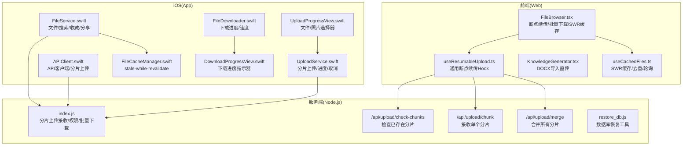
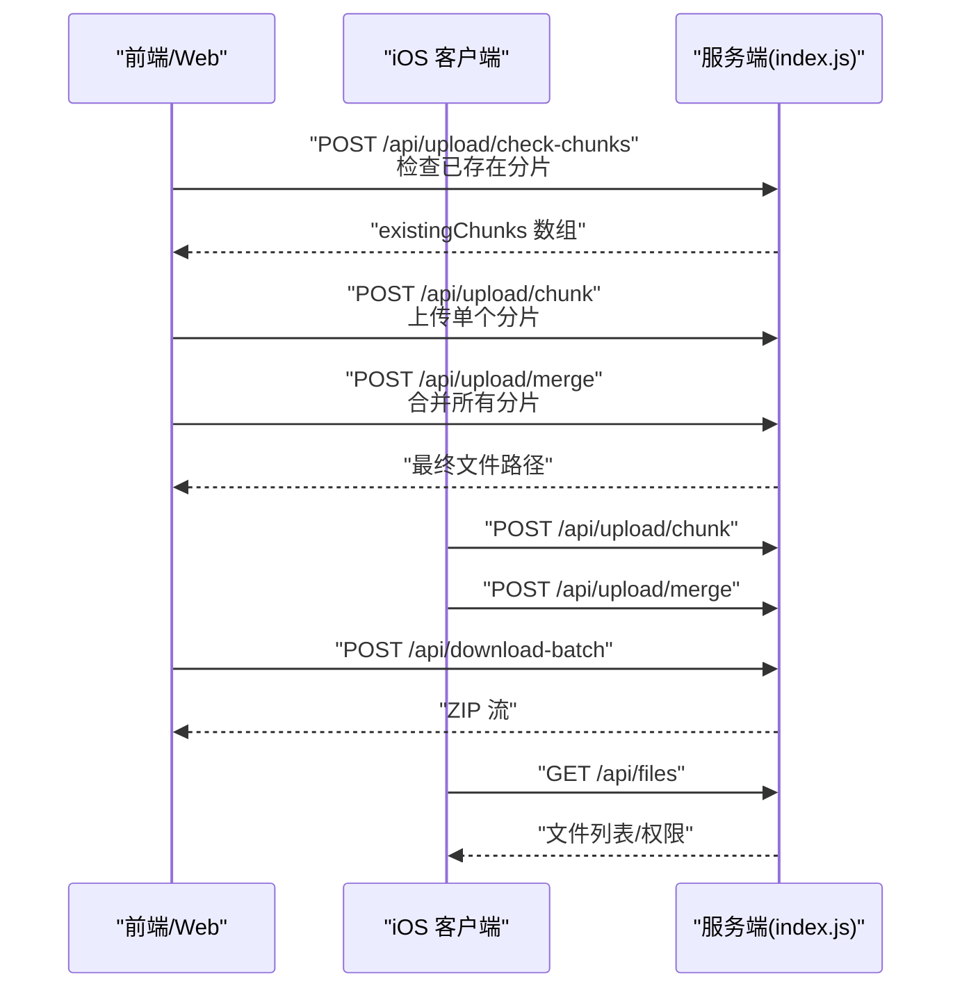
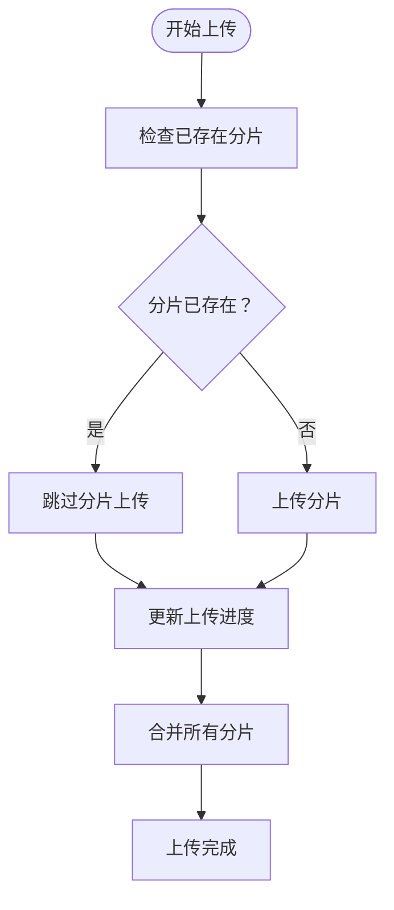
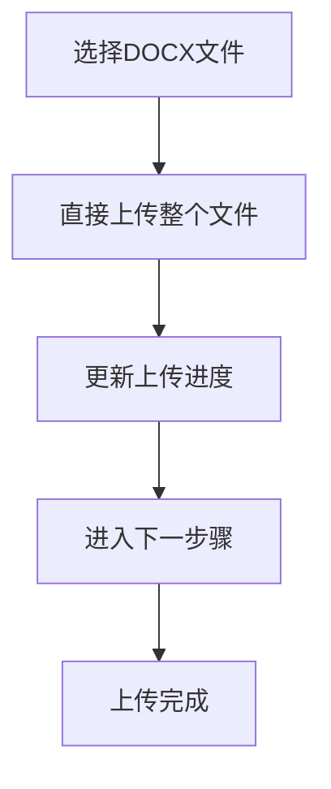
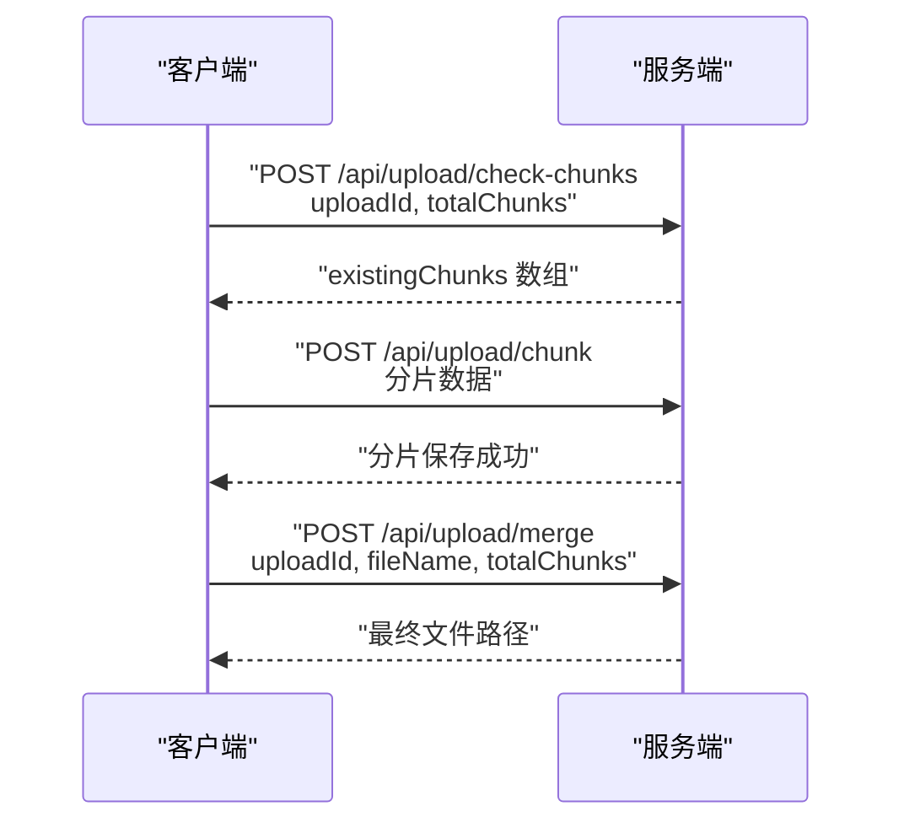
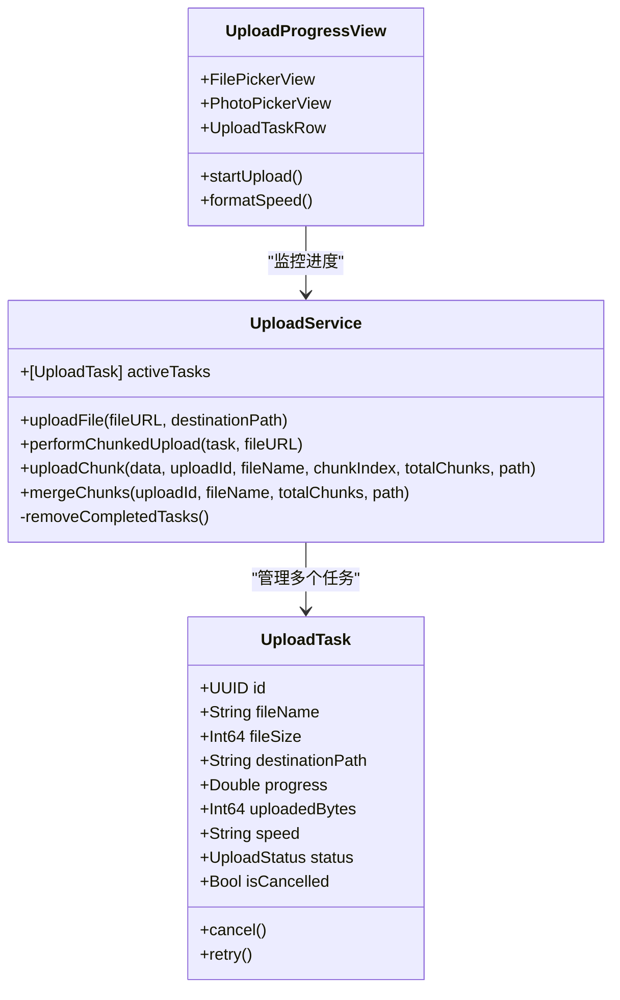
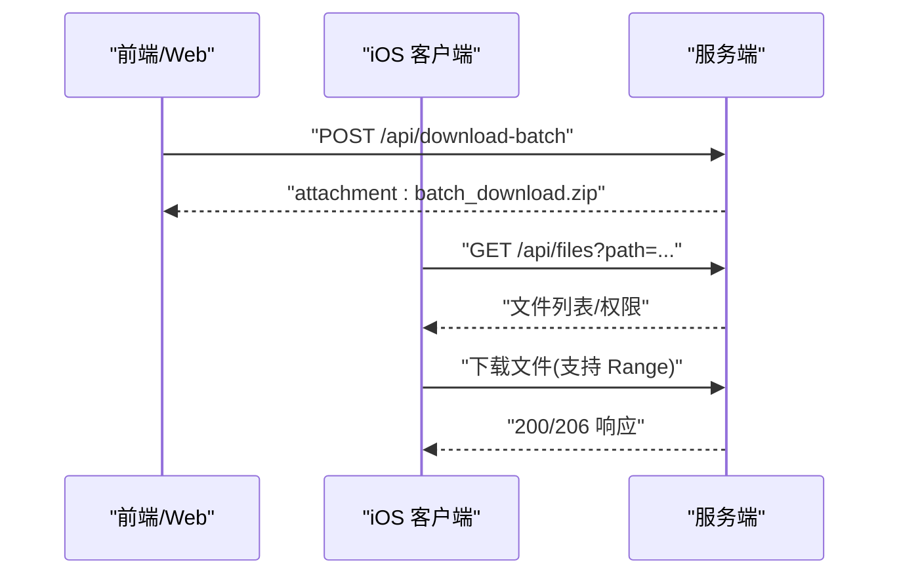
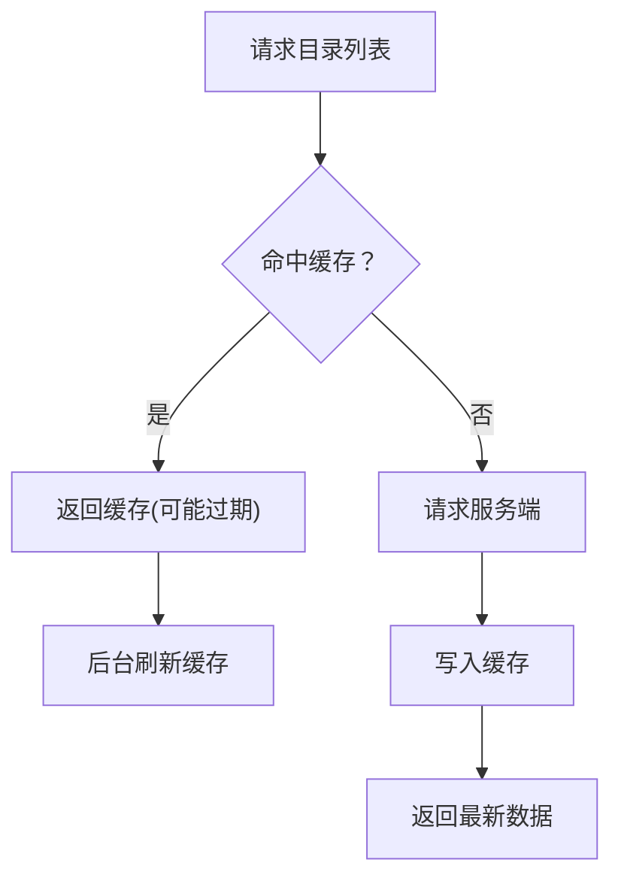
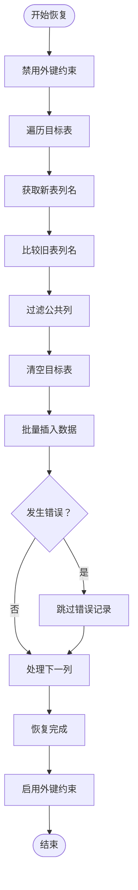
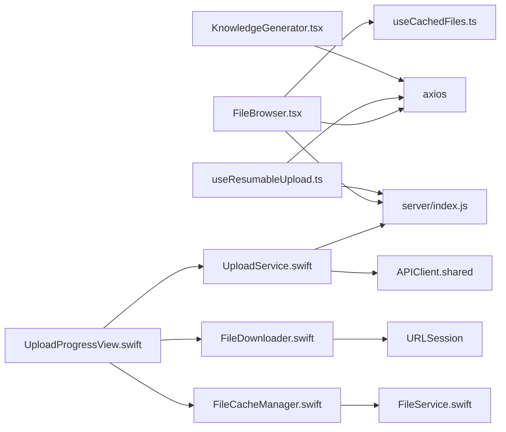

# 文件上传下载

<cite>
**本文引用的文件**
- [client/src/components/FileBrowser.tsx](file://client/src/components/FileBrowser.tsx)
- [client/src/hooks/useResumableUpload.ts](file://client/src/hooks/useResumableUpload.ts)
- [client/src/components/KnowledgeGenerator.tsx](file://client/src/components/KnowledgeGenerator.tsx)
- [client/src/hooks/useCachedFiles.ts](file://client/src/hooks/useCachedFiles.ts)
- [ios/LonghornApp/Services/FileService.swift](file://ios/LonghornApp/Services/FileService.swift)
- [ios/LonghornApp/Services/UploadService.swift](file://ios/LonghornApp/Services/UploadService.swift)
- [ios/LonghornApp/Services/APIClient.swift](file://ios/LonghornApp/Services/APIClient.swift)
- [ios/LonghornApp/Services/FileDownloader.swift](file://ios/LonghornApp/Services/FileDownloader.swift)
- [ios/LonghornApp/Services/FileCacheManager.swift](file://ios/LonghornApp/Services/FileCacheManager.swift)
- [ios/LonghornApp/Views/Files/UploadProgressView.swift](file://ios/LonghornApp/Views/Files/UploadProgressView.swift)
- [ios/LonghornApp/Views/Components/DownloadProgressView.swift](file://ios/LonghornApp/Views/Components/DownloadProgressView.swift)
- [server/index.js](file://server/index.js)
- [server/restore_db.js](file://server/restore_db.js)
</cite>

## 更新摘要
**变更内容**
- 后端上传性能优化：从 busboy 替换为 multer + fs.renameSync，提升分片上传性能
- 前端上传实现：从 XMLHttpRequest 改为 axios，统一网络请求处理
- 数据库 file_stats 表列名标准化：使用标准字段名替代历史命名
- 新增数据库恢复工具：restore_db.js 提供完整的数据库恢复功能

## 目录
1. [简介](#简介)
2. [项目结构](#项目结构)
3. [核心组件](#核心组件)
4. [架构总览](#架构总览)
5. [详细组件分析](#详细组件分析)
6. [依赖关系分析](#依赖关系分析)
7. [性能考量](#性能考量)
8. [故障排查指南](#故障排查指南)
9. [结论](#结论)
10. [附录](#附录)

## 简介
本文件围绕"文件上传下载"能力进行系统化说明，覆盖以下要点：
- 断点续传上传机制，支持分片上传和网络中断恢复
- 多文件上传处理流程，包括分片检查、上传和合并
- 文件下载机制、批量下载与下载进度展示
- 并发下载优化思路（基于现有实现的建议）
- 上传进度跟踪、错误处理与重试策略建议
- 文件完整性校验与安全检查（含类型校验与存储配额）
- 前端文件选择器、拖拽上传与批量操作
- iOS 端本地缓存与后台同步机制
- iOS 端文件选择器、照片选择器与上传进度视图
- DOCX文件导入流程的直传实现

## 项目结构
该仓库包含三部分与文件上传下载密切相关的模块：
- 前端（React + SWR）：负责文件列表缓存、断点续传、批量下载、预览等
- 服务端（Node.js）：负责断点续传接收、权限校验、批量打包下载等
- iOS 客户端（SwiftUI + Combine）：负责断点续传、下载进度、缓存与后台同步

**图表来源**
- [client/src/components/FileBrowser.tsx](file://client/src/components/FileBrowser.tsx#L320-L449)
- [client/src/hooks/useResumableUpload.ts](file://client/src/hooks/useResumableUpload.ts#L1-L340)
- [client/src/components/KnowledgeGenerator.tsx](file://client/src/components/KnowledgeGenerator.tsx#L208-L300)
- [client/src/hooks/useCachedFiles.ts](file://client/src/hooks/useCachedFiles.ts#L40-L86)
- [ios/LonghornApp/Services/FileService.swift](file://ios/LonghornApp/Services/FileService.swift#L18-L49)
- [ios/LonghornApp/Services/UploadService.swift](file://ios/LonghornApp/Services/UploadService.swift#L50-L90)
- [ios/LonghornApp/Services/APIClient.swift](file://ios/LonghornApp/Services/APIClient.swift#L249-L281)
- [ios/LonghornApp/Services/FileDownloader.swift](file://ios/LonghornApp/Services/FileDownloader.swift#L1-L42)
- [ios/LonghornApp/Services/FileCacheManager.swift](file://ios/LonghornApp/Services/FileCacheManager.swift#L29-L82)
- [ios/LonghornApp/Views/Files/UploadProgressView.swift](file://ios/LonghornApp/Views/Files/UploadProgressView.swift#L12-L51)
- [ios/LonghornApp/Views/Components/DownloadProgressView.swift](file://ios/LonghornApp/Views/Components/DownloadProgressView.swift#L10-L30)
- [server/index.js](file://server/index.js#L1223-L1312)
- [server/restore_db.js](file://server/restore_db.js#L1-L105)

**章节来源**
- [client/src/components/FileBrowser.tsx](file://client/src/components/FileBrowser.tsx#L1-L200)
- [client/src/hooks/useResumableUpload.ts](file://client/src/hooks/useResumableUpload.ts#L1-L340)
- [client/src/components/KnowledgeGenerator.tsx](file://client/src/components/KnowledgeGenerator.tsx#L1-L200)
- [client/src/hooks/useCachedFiles.ts](file://client/src/hooks/useCachedFiles.ts#L1-L102)
- [ios/LonghornApp/Services/FileService.swift](file://ios/LonghornApp/Services/FileService.swift#L1-L247)
- [ios/LonghornApp/Services/UploadService.swift](file://ios/LonghornApp/Services/UploadService.swift#L1-L275)
- [ios/LonghornApp/Services/APIClient.swift](file://ios/LonghornApp/Services/APIClient.swift#L1-L300)
- [ios/LonghornApp/Services/FileDownloader.swift](file://ios/LonghornApp/Services/FileDownloader.swift#L1-L106)
- [ios/LonghornApp/Services/FileCacheManager.swift](file://ios/LonghornApp/Services/FileCacheManager.swift#L1-L185)
- [ios/LonghornApp/Views/Files/UploadProgressView.swift](file://ios/LonghornApp/Views/Files/UploadProgressView.swift#L1-L784)
- [ios/LonghornApp/Views/Components/DownloadProgressView.swift](file://ios/LonghornApp/Views/Components/DownloadProgressView.swift#L1-L89)
- [server/index.js](file://server/index.js#L1223-L1312)
- [server/restore_db.js](file://server/restore_db.js#L1-L105)

## 核心组件
- 前端断点续传与进度跟踪：基于useResumableUpload hook，支持5MB分片上传、断点续传、进度反馈
- 服务端断点续传接收：接收分片并进行权限校验、分片合并
- iOS 分片上传：使用512KB分片大小，显示实时进度
- 下载与批量下载：支持单文件下载与批量打包下载，iOS 提供下载进度视图
- 缓存与预取：前端 SWR 与 iOS stale-while-revalidate，提升导航与列表加载体验
- 权限与安全：服务端统一校验写权限与读权限，防止越权访问
- DOCX文件导入：支持大型DOCX文件的直传和进度跟踪

**章节来源**
- [client/src/hooks/useResumableUpload.ts](file://client/src/hooks/useResumableUpload.ts#L1-L340)
- [client/src/components/FileBrowser.tsx](file://client/src/components/FileBrowser.tsx#L340-L449)
- [client/src/components/KnowledgeGenerator.tsx](file://client/src/components/KnowledgeGenerator.tsx#L208-L300)
- [server/index.js](file://server/index.js#L1223-L1312)
- [ios/LonghornApp/Services/UploadService.swift](file://ios/LonghornApp/Services/UploadService.swift#L91-L159)
- [ios/LonghornApp/Services/APIClient.swift](file://ios/LonghornApp/Services/APIClient.swift#L249-L281)
- [ios/LonghornApp/Services/FileDownloader.swift](file://ios/LonghornApp/Services/FileDownloader.swift#L20-L42)
- [client/src/hooks/useCachedFiles.ts](file://client/src/hooks/useCachedFiles.ts#L40-L86)
- [ios/LonghornApp/Services/FileCacheManager.swift](file://ios/LonghornApp/Services/FileCacheManager.swift#L29-L82)

## 架构总览
整体采用"前端/移动端 + 服务端"的三层架构：
- 前端/移动端通过 HTTP 接口与服务端交互
- 服务端负责权限控制、断点续传接收、批量打包与元数据更新
- 客户端负责用户体验（进度、预览、缓存、后台同步）

**图表来源**
- [client/src/hooks/useResumableUpload.ts](file://client/src/hooks/useResumableUpload.ts#L64-L89)
- [client/src/hooks/useResumableUpload.ts](file://client/src/hooks/useResumableUpload.ts#L94-L140)
- [client/src/hooks/useResumableUpload.ts](file://client/src/hooks/useResumableUpload.ts#L145-L173)
- [server/index.js](file://server/index.js#L1223-L1312)
- [ios/LonghornApp/Services/UploadService.swift](file://ios/LonghornApp/Services/UploadService.swift#L161-L237)
- [ios/LonghornApp/Services/APIClient.swift](file://ios/LonghornApp/Services/APIClient.swift#L249-L281)
- [server/index.js](file://server/index.js#L2624-L2677)
- [ios/LonghornApp/Services/FileService.swift](file://ios/LonghornApp/Services/FileService.swift#L18-L49)

## 详细组件分析

### 前端断点续传与进度跟踪

**更新** 前端上传实现从 XMLHttpRequest 改为 axios

- **断点续传策略**：基于5MB分片大小，支持网络中断后的文件恢复上传
- **分片检查**：上传前检查已存在的分片，跳过已上传的部分
- **进度计算**：基于上传字节与文件总字节的比例，支持分片级别的精确进度
- **取消与中断**：使用 AbortController 中断上传，清空输入并恢复 UI
- **错误处理**：完善的错误捕获和用户反馈机制

**图表来源**
- [client/src/hooks/useResumableUpload.ts](file://client/src/hooks/useResumableUpload.ts#L178-L307)
- [client/src/components/FileBrowser.tsx](file://client/src/components/FileBrowser.tsx#L377-L499)

**章节来源**
- [client/src/hooks/useResumableUpload.ts](file://client/src/hooks/useResumableUpload.ts#L1-L340)
- [client/src/components/FileBrowser.tsx](file://client/src/components/FileBrowser.tsx#L320-L499)

### DOCX文件导入流程的直传

**更新** 移除了分块上传功能，采用直传方式

- **直传策略**：直接上传整个DOCX文件，不再进行分片处理
- **进度跟踪**：实时更新上传进度，支持字节级精度
- **速度计算**：计算并显示实时上传速度，支持B/s、KB/s、MB/s格式
- **步骤管理**：将DOCX导入流程分为多个步骤，包括上传、解析、转换等
- **错误处理**：完善的错误捕获和用户反馈机制

**图表来源**
- [client/src/components/KnowledgeGenerator.tsx](file://client/src/components/KnowledgeGenerator.tsx#L225-L300)

**章节来源**
- [client/src/components/KnowledgeGenerator.tsx](file://client/src/components/KnowledgeGenerator.tsx#L208-L624)

### 服务端断点续传接收
- **分片检查**：检查指定uploadId对应的分片是否存在
- **分片上传**：接收单个分片并保存到临时目录
- **分片合并**：按顺序合并所有分片为最终文件
- **权限校验**：仅允许 Full/Contributor 写入目标目录
- **元数据更新**：插入/替换 file_stats，记录上传者与时间

**更新** 后端上传性能优化：从 busboy 替换为 multer + fs.renameSync

**图表来源**
- [server/index.js](file://server/index.js#L1223-L1312)

**章节来源**
- [server/index.js](file://server/index.js#L1223-L1312)

### iOS 分片上传与进度视图

**更新** 新增了分片上传服务UploadService.swift，支持512KB分片大小

- **分片策略**：使用512KB分片大小，支持更细粒度的进度更新
- **实时进度跟踪**：支持字节级精度，包括已上传字节、总字节和实时速度
- **高级进度界面**：提供圆形进度条、百分比显示、速度计算
- **多文件支持**：支持文档选择器和照片选择器，异步导出后分片上传
- **状态管理**：完整的任务生命周期管理，包括 pending/uploading/merging/completed/failed/cancelled 状态

**图表来源**
- [ios/LonghornApp/Services/UploadService.swift](file://ios/LonghornApp/Services/UploadService.swift#L11-L89)
- [ios/LonghornApp/Views/Files/UploadProgressView.swift](file://ios/LonghornApp/Views/Files/UploadProgressView.swift#L53-L156)

**章节来源**
- [ios/LonghornApp/Services/UploadService.swift](file://ios/LonghornApp/Services/UploadService.swift#L1-L355)
- [ios/LonghornApp/Views/Files/UploadProgressView.swift](file://ios/LonghornApp/Views/Files/UploadProgressView.swift#L1-L784)

### 下载与批量下载
- 单文件下载：服务端直接返回文件流，支持 ETag 缓存
- 批量下载：服务端聚合多个文件生成 ZIP，客户端接收二进制流并触发下载
- iOS 下载进度：基于 URLSessionDownloadTask 的委托回调，计算已下载/总大小与速度

**图表来源**
- [server/index.js](file://server/index.js#L2297-L2304)
- [server/index.js](file://server/index.js#L2624-L2677)
- [ios/LonghornApp/Services/FileDownloader.swift](file://ios/LonghornApp/Services/FileDownloader.swift#L44-L105)

**章节来源**
- [server/index.js](file://server/index.js#L2297-L2304)
- [server/index.js](file://server/index.js#L2624-L2677)
- [ios/LonghornApp/Services/FileDownloader.swift](file://ios/LonghornApp/Services/FileDownloader.swift#L1-L106)
- [ios/LonghornApp/Views/Components/DownloadProgressView.swift](file://ios/LonghornApp/Views/Components/DownloadProgressView.swift#L10-L89)

### 缓存与预取（SWR 与 iOS）
- 前端 SWR：对目录列表进行缓存、去重与轮询，keepPreviousData 提升导航体验
- iOS stale-while-revalidate：缓存目录列表，超过一定时间后后台刷新，同时返回可用缓存

**图表来源**
- [client/src/hooks/useCachedFiles.ts](file://client/src/hooks/useCachedFiles.ts#L40-L86)
- [ios/LonghornApp/Services/FileCacheManager.swift](file://ios/LonghornApp/Services/FileCacheManager.swift#L29-L82)

**章节来源**
- [client/src/hooks/useCachedFiles.ts](file://client/src/hooks/useCachedFiles.ts#L1-L102)
- [ios/LonghornApp/Services/FileCacheManager.swift](file://ios/LonghornApp/Services/FileCacheManager.swift#L1-L185)

### 前端文件选择器、拖拽上传与批量操作
- 文件选择器：点击触发 input[type=file]，支持多文件
- 拖拽上传：可在 UI 层实现拖拽区域，结合断点续传逻辑
- 批量操作：支持批量删除、批量移动、批量分享；批量下载通过服务端 ZIP 实现

**章节来源**
- [client/src/components/FileBrowser.tsx](file://client/src/components/FileBrowser.tsx#L320-L449)
- [client/src/components/FileBrowser.tsx](file://client/src/components/FileBrowser.tsx#L600-L641)

### iOS 文件选择器与照片选择器

**更新** iOS端新增了分片上传功能

- **文档选择器**：UIDocumentPickerViewController 支持多选，实时计算总大小和进度
- **照片选择器**：PhotosPicker 支持图片/视频多选，异步导出后分片上传，汇总总进度与速度
- **实时进度显示**：提供圆形进度条、百分比、速度
- **分片处理**：使用512KB分片大小，支持更细粒度的进度更新
- **错误处理**：完善的错误捕获和用户反馈机制

**章节来源**
- [ios/LonghornApp/Views/Files/UploadProgressView.swift](file://ios/LonghornApp/Views/Files/UploadProgressView.swift#L158-L206)
- [ios/LonghornApp/Views/Files/UploadProgressView.swift](file://ios/LonghornApp/Views/Files/UploadProgressView.swift#L208-L479)
- [ios/LonghornApp/Views/Files/UploadProgressView.swift](file://ios/LonghornApp/Views/Files/UploadProgressView.swift#L428-L737)

### 数据库恢复工具

**新增** 数据库恢复工具：restore_db.js 提供完整的数据库恢复功能

- **恢复策略**：支持跨数据库的表结构迁移，自动处理列名差异
- **智能匹配**：只恢复两边都存在的列，跳过不兼容的字段
- **事务处理**：使用事务确保数据一致性，支持外键约束的临时禁用
- **错误处理**：跳过重复键冲突，继续处理剩余数据
- **统计报告**：提供详细的恢复统计信息，包括总记录数和跳过的记录

**图表来源**
- [server/restore_db.js](file://server/restore_db.js#L48-L96)

**章节来源**
- [server/restore_db.js](file://server/restore_db.js#L1-L105)

## 依赖关系分析
- 前端依赖 axios 与 SWR，负责网络请求与缓存
- iOS 依赖 APIClient、URLSession、FileCacheManager 等，负责网络、缓存与下载
- 服务端依赖 multer（分片上传）、fs-extra、archiver（批量打包）等

**更新** 后端上传性能优化：从 busboy 替换为 multer + fs.renameSync

**图表来源**
- [client/src/components/FileBrowser.tsx](file://client/src/components/FileBrowser.tsx#L1-L10)
- [client/src/hooks/useResumableUpload.ts](file://client/src/hooks/useResumableUpload.ts#L1-L20)
- [client/src/components/KnowledgeGenerator.tsx](file://client/src/components/KnowledgeGenerator.tsx#L1-L20)
- [client/src/hooks/useCachedFiles.ts](file://client/src/hooks/useCachedFiles.ts#L1-L4)
- [ios/LonghornApp/Services/UploadService.swift](file://ios/LonghornApp/Services/UploadService.swift#L1-L10)
- [ios/LonghornApp/Services/APIClient.swift](file://ios/LonghornApp/Services/APIClient.swift#L1-L20)
- [ios/LonghornApp/Services/FileDownloader.swift](file://ios/LonghornApp/Services/FileDownloader.swift#L1-L18)
- [ios/LonghornApp/Services/FileCacheManager.swift](file://ios/LonghornApp/Services/FileCacheManager.swift#L1-L10)
- [ios/LonghornApp/Services/FileService.swift](file://ios/LonghornApp/Services/FileService.swift#L1-L10)
- [server/index.js](file://server/index.js#L1-L50)

**章节来源**
- [client/src/components/FileBrowser.tsx](file://client/src/components/FileBrowser.tsx#L1-L50)
- [client/src/hooks/useResumableUpload.ts](file://client/src/hooks/useResumableUpload.ts#L1-L50)
- [client/src/components/KnowledgeGenerator.tsx](file://client/src/components/KnowledgeGenerator.tsx#L1-L50)
- [client/src/hooks/useCachedFiles.ts](file://client/src/hooks/useCachedFiles.ts#L1-L20)
- [ios/LonghornApp/Services/UploadService.swift](file://ios/LonghornApp/Services/UploadService.swift#L1-L20)
- [ios/LonghornApp/Services/APIClient.swift](file://ios/LonghornApp/Services/APIClient.swift#L1-L20)
- [ios/LonghornApp/Services/FileDownloader.swift](file://ios/LonghornApp/Services/FileDownloader.swift#L1-L20)
- [ios/LonghornApp/Services/FileCacheManager.swift](file://ios/LonghornApp/Services/FileCacheManager.swift#L1-L20)
- [ios/LonghornApp/Services/FileService.swift](file://ios/LonghornApp/Services/FileService.swift#L1-L20)
- [server/index.js](file://server/index.js#L1-L50)

## 性能考量
- **断点续传策略**：前端和iOS端采用分片上传方式，支持网络中断后的文件恢复
- **分片大小优化**：前端使用5MB分片，iOS使用512KB分片，平衡传输效率和进度精度
- **并发策略**：前端/移动端当前实现为串行分片上传；如需提升吞吐，可考虑并发分片上传但需控制并发数与背压
- **缓存策略**：SWR 与 iOS stale-while-revalidate 已有效减少重复请求；可结合 ETag 与 Last-Modified 进一步优化
- **批量下载**：服务端使用 archiver，压缩级别可调；建议对超大集合分批打包
- **下载优化**：iOS 使用 URLSessionDownloadTask，建议启用后台会话与断点续传（需服务端支持 Range）
- **DOCX处理**：大型DOCX文件采用直传，避免分片上传的复杂性和内存占用
- **上传性能优化**：后端从 busboy 迁移到 multer + fs.renameSync，提升分片上传性能

**更新** 后端上传性能优化：从 busboy 替换为 multer + fs.renameSync

## 故障排查指南
- **上传失败**
  - 检查权限：确认目标目录具备 Full/Contributor 权限
  - 检查文件大小：确认文件大小在服务端限制范围内
  - 前端/移动端取消：确保正确处理 AbortController 或 Task 取消
  - **分片上传异常**：检查分片目录权限和磁盘空间
  - **iOS进度异常**：检查网络连接稳定性
  - **DOCX上传失败**：检查文件大小限制和内存使用情况
- **下载失败**
  - 检查路径与权限：确认文件存在且具备 Read 权限
  - 批量下载为空：确认所选路径均有效且可读
- **缓存异常**
  - 前端 SWR：检查去重间隔与轮询配置
  - iOS 缓存：确认 stale/expired 判定与后台刷新逻辑
- **数据库恢复失败**
  - 检查源数据库文件是否存在
  - 确认目标数据库具有相同的表结构
  - 查看恢复日志中的具体错误信息

**章节来源**
- [server/index.js](file://server/index.js#L1265-L1267)
- [server/index.js](file://server/index.js#L1279-L1282)
- [client/src/hooks/useResumableUpload.ts](file://client/src/hooks/useResumableUpload.ts#L312-L317)
- [client/src/components/FileBrowser.tsx](file://client/src/components/FileBrowser.tsx#L328-L338)
- [client/src/components/KnowledgeGenerator.tsx](file://client/src/components/KnowledgeGenerator.tsx#L291-L300)
- [ios/LonghornApp/Services/UploadService.swift](file://ios/LonghornApp/Services/UploadService.swift#L33-L37)
- [server/index.js](file://server/index.js#L2643-L2645)
- [client/src/hooks/useCachedFiles.ts](file://client/src/hooks/useCachedFiles.ts#L40-L86)
- [ios/LonghornApp/Services/FileCacheManager.swift](file://ios/LonghornApp/Services/FileCacheManager.swift#L17-L24)
- [server/restore_db.js](file://server/restore_db.js#L93-L96)

## 结论
本系统在前后端与移动端实现了完整的断点续传、权限控制与缓存优化，配合批量下载与进度展示，满足多场景下的文件管理需求。新增的断点续传功能显著提升了大文件上传的可靠性，iOS端的分片上传服务重写进一步提升了用户体验。移除的分块上传功能简化了实现逻辑，减少了调试代码，提高了系统的稳定性和可维护性。新增的DOCX文件导入流程进一步增强了对大型文档的支持。新增的数据库恢复工具提供了完整的数据迁移解决方案。后续可在并发上传、Range 支持与重试策略方面进一步增强。

## 附录

### 安全检查与文件类型验证
- 权限校验：写入前校验 Full/Contributor 权限，读取前校验 Read 权限
- 路径与名称：禁止包含路径分隔符的新名称，避免路径穿越
- 存储配额：建议在用户维度或部门维度引入配额限制（当前实现未见显式配额逻辑）
- DOCX文件验证：服务端对上传的DOCX文件进行格式验证和大小限制

**章节来源**
- [server/index.js](file://server/index.js#L1265-L1267)
- [server/index.js](file://server/index.js#L2686-L2689)
- [client/src/components/KnowledgeGenerator.tsx](file://client/src/components/KnowledgeGenerator.tsx#L210-L216)

### 文件完整性校验
- 当前实现未见哈希校验（如 MD5/SHA）流程
- 建议在上传完成后计算文件哈希并与客户端提供的摘要比对，或在服务端记录上传哈希以便后续校验

### Range 请求支持（下载）
- iOS 下载使用 URLSessionDownloadTask，可结合 Range 请求实现断点续传
- 服务端需支持 206 Partial Content 与 Content-Range 响应头（当前下载为完整文件流）

### 错误重试策略（建议）
- 断点续传：对网络瞬时错误进行指数退避重试
- 下载：对 5xx/网络错误进行有限次数重试，避免无限循环
- DOCX上传：对超时和网络错误进行重试，最大重试次数建议为3次

### iOS 上传进度视图特性详解

**更新** iOS上传进度视图的高级功能特性

- **实时字节级进度**：精确跟踪已上传字节和总字节，提供毫秒级更新频率
- **上传速度计算**：基于时间戳差值计算实时上传速度，支持 B/s、KB/s、MB/s 格式化显示
- **多文件聚合进度**：支持批量文件上传的总进度计算和显示
- **状态可视化**：使用不同图标和颜色表示任务状态（等待中、上传中、合并中、已完成、失败、已取消）
- **交互式控制**：支持任务取消、进度清除等用户操作

**章节来源**
- [ios/LonghornApp/Views/Files/UploadProgressView.swift](file://ios/LonghornApp/Views/Files/UploadProgressView.swift#L151-L155)
- [ios/LonghornApp/Views/Files/UploadProgressView.swift](file://ios/LonghornApp/Views/Files/UploadProgressView.swift#L365-L387)
- [ios/LonghornApp/Services/UploadService.swift](file://ios/LonghornApp/Services/UploadService.swift#L246-L254)

### 断点续传技术细节

**更新** 新增断点续传技术实现细节

- **分片大小选择**：前端使用5MB分片，iOS使用512KB分片，平衡传输效率和进度精度
- **uploadId生成**：基于文件特征（名称、大小、最后修改时间）生成稳定的uploadId
- **分片检查机制**：通过 /api/upload/check-chunks 端点检查已存在的分片，避免重复上传
- **进度计算算法**：实时计算上传速度，支持B/s、KB/s、MB/s格式化显示
- **错误恢复机制**：支持网络中断后的文件恢复上传，提高上传成功率

**章节来源**
- [client/src/hooks/useResumableUpload.ts](file://client/src/hooks/useResumableUpload.ts#L44-L59)
- [client/src/hooks/useResumableUpload.ts](file://client/src/hooks/useResumableUpload.ts#L64-L89)
- [client/src/hooks/useResumableUpload.ts](file://client/src/hooks/useResumableUpload.ts#L211-L241)
- [ios/LonghornApp/Services/UploadService.swift](file://ios/LonghornApp/Services/UploadService.swift#L66)
- [ios/LonghornApp/Services/UploadService.swift](file://ios/LonghornApp/Services/UploadService.swift#L177)

### 数据库表结构标准化

**更新** 数据库 file_stats 表列名标准化

- **列名标准化**：使用标准字段名替代历史命名，提高代码可读性和维护性
- **向后兼容**：通过数据库迁移脚本逐步更新现有数据
- **查询优化**：标准化的列名便于编写一致的SQL查询语句
- **开发效率**：统一的命名规范减少开发过程中的混淆和错误

**章节来源**
- [server/index.js](file://server/index.js#L1203-L1206)
- [server/index.js](file://server/index.js#L1364-L1367)
- [server/index.js](file://server/index.js#L3143)