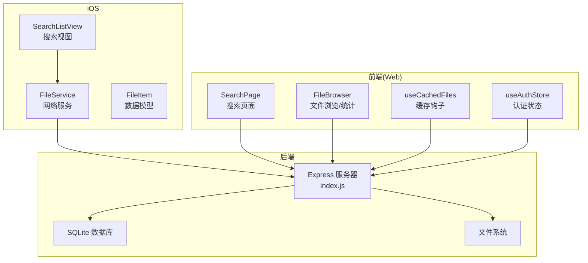
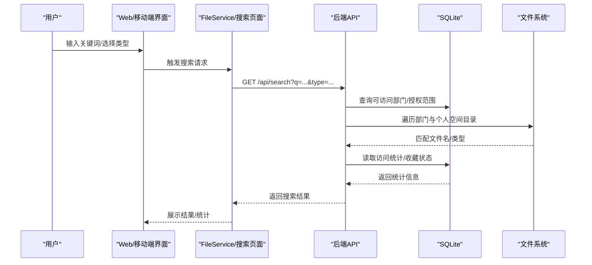
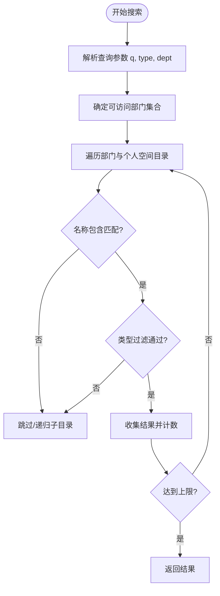
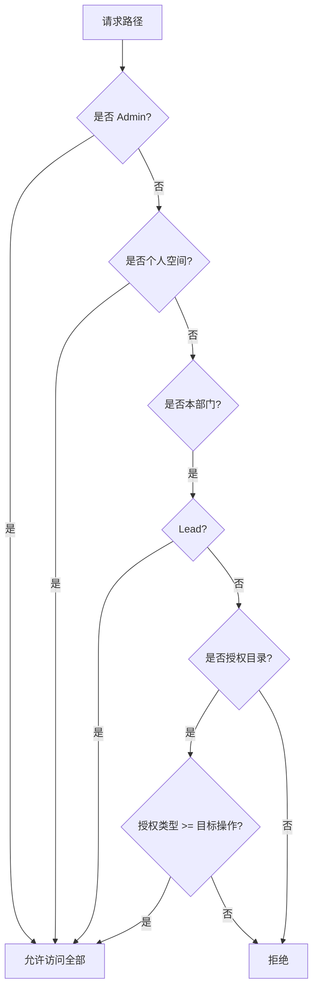
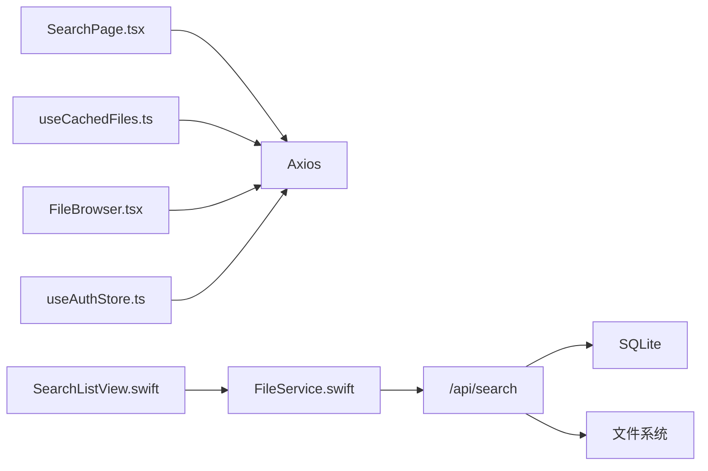

# 文件搜索统计

<cite>
**本文引用的文件**
- [client/src/components/SearchPage.tsx](file://client/src/components/SearchPage.tsx)
- [ios/LonghornApp/Views/Files/SearchListView.swift](file://ios/LonghornApp/Views/Files/SearchListView.swift)
- [server/index.js](file://server/index.js)
- [client/src/hooks/useCachedFiles.ts](file://client/src/hooks/useCachedFiles.ts)
- [client/src/components/FileBrowser.tsx](file://client/src/components/FileBrowser.tsx)
- [ios/LonghornApp/Services/FileService.swift](file://ios/LonghornApp/Services/FileService.swift)
- [ios/LonghornApp/Models/FileItem.swift](file://ios/LonghornApp/Models/FileItem.swift)
- [client/src/store/useAuthStore.ts](file://client/src/store/useAuthStore.ts)
- [docs/CONTRIBUTE_PERMISSION_IMPLEMENTATION.md](file://docs/CONTRIBUTE_PERMISSION_IMPLEMENTATION.md)
</cite>

## 目录
1. [简介](#简介)
2. [项目结构](#项目结构)
3. [核心组件](#核心组件)
4. [架构总览](#架构总览)
5. [详细组件分析](#详细组件分析)
6. [依赖关系分析](#依赖关系分析)
7. [性能考虑](#性能考虑)
8. [故障排除指南](#故障排除指南)
9. [结论](#结论)
10. [附录](#附录)

## 简介
本文件围绕“文件搜索与统计分析”主题，系统梳理前端与后端的搜索实现、关键词匹配算法、结果排序与过滤、权限控制、索引与缓存策略、访问统计与存储报告等能力。文档同时覆盖跨平台（Web/iOS）的交互差异，并提供性能优化建议与常见问题排查方法。

## 项目结构
Longhorn 采用前后端分离架构：
- 前端（React + TypeScript）：负责用户界面、交互与本地缓存（SWR），通过 Axios 发起 API 请求。
- 后端（Node.js + better-sqlite3）：提供 REST API，执行文件系统扫描、权限校验、访问统计与存储统计。
- iOS 客户端（SwiftUI + Swift）：通过自定义 FileService 调用后端 API，实现搜索与统计展示。

图表来源
- [client/src/components/SearchPage.tsx](file://client/src/components/SearchPage.tsx#L19-L227)
- [client/src/components/FileBrowser.tsx](file://client/src/components/FileBrowser.tsx#L1-L120)
- [client/src/hooks/useCachedFiles.ts](file://client/src/hooks/useCachedFiles.ts#L40-L86)
- [ios/LonghornApp/Views/Files/SearchListView.swift](file://ios/LonghornApp/Views/Files/SearchListView.swift#L10-L152)
- [ios/LonghornApp/Services/FileService.swift](file://ios/LonghornApp/Services/FileService.swift#L58-L69)
- [server/index.js](file://server/index.js#L1424-L1521)

章节来源
- [client/src/components/SearchPage.tsx](file://client/src/components/SearchPage.tsx#L19-L227)
- [ios/LonghornApp/Views/Files/SearchListView.swift](file://ios/LonghornApp/Views/Files/SearchListView.swift#L10-L152)
- [server/index.js](file://server/index.js#L1424-L1521)

## 核心组件
- 搜索页面（Web）：提供关键词输入、类型筛选、结果展示与导航。
- 搜索视图（iOS）：支持类型筛选与实时搜索提交，调用 FileService 进行搜索。
- 搜索 API（后端）：按用户可访问范围扫描文件系统，进行名称匹配与类型过滤。
- 缓存与预取（Web）：SWR 提供请求去重、缓存与刷新；预取目录加速导航。
- 统计与访问日志（后端）：维护全局访问计数与用户级访问日志，支持按路径查询。
- 权限控制（后端）：基于角色与授权表进行路径访问校验，支持 Contribute/Full 权限细化。

章节来源
- [client/src/components/SearchPage.tsx](file://client/src/components/SearchPage.tsx#L19-L227)
- [ios/LonghornApp/Views/Files/SearchListView.swift](file://ios/LonghornApp/Views/Files/SearchListView.swift#L10-L152)
- [server/index.js](file://server/index.js#L1424-L1521)
- [client/src/hooks/useCachedFiles.ts](file://client/src/hooks/useCachedFiles.ts#L40-L86)
- [server/index.js](file://server/index.js#L2442-L2467)
- [docs/CONTRIBUTE_PERMISSION_IMPLEMENTATION.md](file://docs/CONTRIBUTE_PERMISSION_IMPLEMENTATION.md#L31-L145)

## 架构总览
搜索与统计的整体流程如下：

图表来源
- [client/src/components/SearchPage.tsx](file://client/src/components/SearchPage.tsx#L30-L49)
- [ios/LonghornApp/Views/Files/SearchListView.swift](file://ios/LonghornApp/Views/Files/SearchListView.swift#L133-L151)
- [ios/LonghornApp/Services/FileService.swift](file://ios/LonghornApp/Services/FileService.swift#L58-L69)
- [server/index.js](file://server/index.js#L1424-L1521)

## 详细组件分析

### 搜索实现与关键词匹配
- 前端触发：Web 通过 Axios 发送 q 与 type 参数；iOS 通过 FileService.searchFiles 传入 query 与 type。
- 后端扫描：按用户可访问的部门集合与个人空间进行目录遍历，使用名称包含匹配（大小写不敏感）。
- 类型过滤：根据 image/video/document/audio 等类型参数过滤扩展名。
- 结果上限：遍历过程中限制返回数量以控制性能。

图表来源
- [server/index.js](file://server/index.js#L1424-L1521)

章节来源
- [client/src/components/SearchPage.tsx](file://client/src/components/SearchPage.tsx#L30-L49)
- [ios/LonghornApp/Views/Files/SearchListView.swift](file://ios/LonghornApp/Views/Files/SearchListView.swift#L133-L151)
- [server/index.js](file://server/index.js#L1424-L1521)

### 结果排序与展示
- Web：搜索结果按文件名/类型/大小/修改时间等字段支持排序（由前端列表组件处理）。
- iOS：搜索结果直接展示，类型筛选通过枚举与图标呈现。
- 访问统计：后端维护 file_stats 与 access_logs，前端可按路径查询访问历史。

章节来源
- [client/src/components/FileBrowser.tsx](file://client/src/components/FileBrowser.tsx#L469-L474)
- [ios/LonghornApp/Views/Files/SearchListView.swift](file://ios/LonghornApp/Views/Files/SearchListView.swift#L99-L111)
- [server/index.js](file://server/index.js#L2242-L2261)

### 文件元数据索引与统计
- 访问统计：/api/files/hit 与 /api/files/access 记录全局与用户级访问，file_stats 与 access_logs 表维护计数与最近访问时间。
- 上传者信息：文件列表接口从 file_stats 与 users 表关联获取 uploader。
- 最近访问：/api/files/recent 按最近访问时间倒序返回前若干条。

章节来源
- [server/index.js](file://server/index.js#L2442-L2467)
- [server/index.js](file://server/index.js#L1271-L1313)
- [server/index.js](file://server/index.js#L1329-L1360)
- [server/index.js](file://server/index.js#L2368-L2391)

### 标签系统与收藏
- 收藏状态：文件列表接口查询 starred_files 并标注 isStarred。
- 收藏操作：前端通过 /api/starred 接口添加/移除收藏。

章节来源
- [server/index.js](file://server/index.js#L2409-L2413)
- [client/src/components/FileBrowser.tsx](file://client/src/components/FileBrowser.tsx#L173-L182)

### 分类检索与权限控制
- 部门映射：后端维护部门代码与显示名映射，支持中文与代码两种路径形式。
- 权限判定：hasPermission 综合 Admin/Lead/Member/授权表/个人空间等规则，支持 Read/Contribute/Full 三级权限。
- 搜索范围：Admin 可检索全部部门；普通用户仅能搜索所属部门与授权目录。

图表来源
- [docs/CONTRIBUTE_PERMISSION_IMPLEMENTATION.md](file://docs/CONTRIBUTE_PERMISSION_IMPLEMENTATION.md#L92-L133)
- [server/index.js](file://server/index.js#L298-L353)

章节来源
- [server/index.js](file://server/index.js#L113-L123)
- [server/index.js](file://server/index.js#L298-L353)
- [docs/CONTRIBUTE_PERMISSION_IMPLEMENTATION.md](file://docs/CONTRIBUTE_PERMISSION_IMPLEMENTATION.md#L31-L145)

### 缓存与预取策略
- SWR 缓存：useCachedFiles 对目录列表进行缓存，支持去重、轮询与保持上一次数据。
- 预取目录：prefetchDirectories 预热子目录缓存，提升用户点击体验。
- 响应头与压缩：后端启用 compression 与 CORS，静态资源设置缓存与范围请求。

章节来源
- [client/src/hooks/useCachedFiles.ts](file://client/src/hooks/useCachedFiles.ts#L40-L86)
- [client/src/components/FileBrowser.tsx](file://client/src/components/FileBrowser.tsx#L184-L190)
- [server/index.js](file://server/index.js#L418-L427)

### 实时搜索与结果导航
- Web：输入回车或点击搜索按钮发起请求，结果点击可导航至对应路径。
- iOS：searchable 输入框提交时触发搜索，结果列表支持导航与预览。

章节来源
- [client/src/components/SearchPage.tsx](file://client/src/components/SearchPage.tsx#L89-L124)
- [ios/LonghornApp/Views/Files/SearchListView.swift](file://ios/LonghornApp/Views/Files/SearchListView.swift#L116-L119)

### 数据模型与跨平台一致性
- FileItem：统一文件/文件夹的数据结构，包含名称、路径、是否目录、大小、修改时间、上传者、收藏状态、访问计数等字段。
- 类型识别：iOS 端根据扩展名判断图片/视频/音频/文档类型，便于图标与预览。

章节来源
- [ios/LonghornApp/Models/FileItem.swift](file://ios/LonghornApp/Models/FileItem.swift#L12-L52)
- [ios/LonghornApp/Models/FileItem.swift](file://ios/LonghornApp/Models/FileItem.swift#L115-L133)

## 依赖关系分析

图表来源
- [client/src/components/SearchPage.tsx](file://client/src/components/SearchPage.tsx#L1-L10)
- [ios/LonghornApp/Views/Files/SearchListView.swift](file://ios/LonghornApp/Views/Files/SearchListView.swift#L1-L10)
- [ios/LonghornApp/Services/FileService.swift](file://ios/LonghornApp/Services/FileService.swift#L1-L15)
- [client/src/hooks/useCachedFiles.ts](file://client/src/hooks/useCachedFiles.ts#L1-L10)
- [client/src/components/FileBrowser.tsx](file://client/src/components/FileBrowser.tsx#L1-L10)
- [client/src/store/useAuthStore.ts](file://client/src/store/useAuthStore.ts#L1-L10)
- [server/index.js](file://server/index.js#L1424-L1521)

章节来源
- [client/src/components/SearchPage.tsx](file://client/src/components/SearchPage.tsx#L1-L10)
- [ios/LonghornApp/Views/Files/SearchListView.swift](file://ios/LonghornApp/Views/Files/SearchListView.swift#L1-L10)
- [ios/LonghornApp/Services/FileService.swift](file://ios/LonghornApp/Services/FileService.swift#L1-L15)
- [client/src/hooks/useCachedFiles.ts](file://client/src/hooks/useCachedFiles.ts#L1-L10)
- [client/src/components/FileBrowser.tsx](file://client/src/components/FileBrowser.tsx#L1-L10)
- [client/src/store/useAuthStore.ts](file://client/src/store/useAuthStore.ts#L1-L10)
- [server/index.js](file://server/index.js#L1424-L1521)

## 性能考虑
- 搜索限制：后端在遍历过程中限制返回数量，避免大规模扫描导致延迟。
- 缓存策略：SWR 提供去重与轮询，减少重复请求；预取目录降低首次访问延迟。
- 压缩与缓存：后端启用 gzip 压缩与静态资源缓存，提升传输效率。
- I/O 优化：文件统计与访问日志采用 SQLite 写入，注意并发与事务使用。

章节来源
- [server/index.js](file://server/index.js#L1516-L1517)
- [client/src/hooks/useCachedFiles.ts](file://client/src/hooks/useCachedFiles.ts#L40-L86)
- [server/index.js](file://server/index.js#L418-L427)

## 故障排除指南
- 搜索无结果
  - 确认关键词非空且类型筛选合理。
  - 检查用户权限是否覆盖目标部门/个人空间。
- 权限被拒
  - 确认角色与授权类型（Read/Contribute/Full）满足操作要求。
  - 检查授权是否过期。
- 访问统计异常
  - 确认 /api/files/hit 与 /api/files/access 已正确调用。
  - 检查 file_stats 与 access_logs 中是否存在对应记录。
- iOS 搜索无结果
  - 确认 FileService.searchFiles 的 query 与 type 参数正确传递。
  - 检查网络层 APIClient 配置与 Token。

章节来源
- [server/index.js](file://server/index.js#L2442-L2467)
- [server/index.js](file://server/index.js#L1271-L1313)
- [ios/LonghornApp/Services/FileService.swift](file://ios/LonghornApp/Services/FileService.swift#L58-L69)
- [docs/CONTRIBUTE_PERMISSION_IMPLEMENTATION.md](file://docs/CONTRIBUTE_PERMISSION_IMPLEMENTATION.md#L31-L145)

## 结论
Longhorn 的搜索与统计体系以“权限可控 + 高效缓存 + 简洁匹配”为核心设计原则：前端提供一致的搜索体验，后端通过目录扫描与 SQLite 统计支撑访问分析与存储报告。通过合理的权限模型与缓存策略，系统在保证安全的前提下实现了良好的性能与可维护性。

## 附录
- 搜索 API 参数
  - q：关键词（必填）
  - type：类型过滤（image/video/document/audio）
  - dept：部门代码（可选）
- 统计 API
  - /api/files/stats：按路径查询访问历史
  - /api/files/hit：记录访问（全局/用户级）
  - /api/files/recent：最近访问列表

章节来源
- [server/index.js](file://server/index.js#L1424-L1521)
- [server/index.js](file://server/index.js#L2242-L2261)
- [server/index.js](file://server/index.js#L2442-L2467)
- [server/index.js](file://server/index.js#L1329-L1360)