# 文件浏览预览

<cite>
**本文档引用的文件**
- [client/src/components/FileBrowser.tsx](file://client/src/components/FileBrowser.tsx)
- [client/src/hooks/useCachedFiles.ts](file://client/src/hooks/useCachedFiles.ts)
- [client/src/components/SearchPage.tsx](file://client/src/components/SearchPage.tsx)
- [client/src/components/RecentPage.tsx](file://client/src/components/RecentPage.tsx)
- [ios/LonghornApp/Views/Files/FileBrowserView.swift](file://ios/LonghornApp/Views/Files/FileBrowserView.swift)
- [ios/LonghornApp/Services/FileService.swift](file://ios/LonghornApp/Services/FileService.swift)
- [ios/LonghornApp/Services/FileCacheManager.swift](file://ios/LonghornApp/Services/FileCacheManager.swift)
- [ios/LonghornApp/Services/PreviewCacheManager.swift](file://ios/LonghornApp/Services/PreviewCacheManager.swift)
- [ios/LonghornApp/Views/Files/FilePreviewView.swift](file://ios/LonghornApp/Views/Files/FilePreviewView.swift)
- [ios/LonghornApp/Views/Files/SearchListView.swift](file://ios/LonghornApp/Views/Files/SearchListView.swift)
- [ios/LonghornApp/Views/Components/ThumbnailView.swift](file://ios/LonghornApp/Views/Components/ThumbnailView.swift)
- [ios/LonghornApp/Models/FileItem.swift](file://ios/LonghornApp/Models/FileItem.swift)
- [server/index.js](file://server/index.js)
</cite>

## 更新摘要
**变更内容**
- 更新了自动刷新行为章节，反映文件浏览器已禁用自动刷新功能
- 新增了手动刷新机制的详细说明
- 更新了性能考虑章节，反映新的手动刷新策略
- 增强了故障排除指南，包含手动刷新相关的指导

## 目录
1. [简介](#简介)
2. [项目结构](#项目结构)
3. [核心组件](#核心组件)
4. [架构总览](#架构总览)
5. [详细组件分析](#详细组件分析)
6. [依赖关系分析](#依赖关系分析)
7. [性能考虑](#性能考虑)
8. [故障排除指南](#故障排除指南)
9. [结论](#结论)
10. [附录](#附录)

## 简介
本文件聚焦于文件浏览与预览功能的端到端实现，涵盖以下方面：
- 目录树构建与文件列表渲染
- 分页加载与缓存策略
- 多格式文件预览（图片、视频、文档、压缩包等）
- 缩略图生成、缓存与懒加载
- 搜索过滤、排序与快速导航
- 移动端触摸手势与响应式布局
- 预览窗口交互、全屏与离线能力
- **新增**：手动刷新机制与性能优化策略

## 项目结构
前端采用 React + TypeScript，后端提供 REST 接口；iOS 采用 SwiftUI + Swift，通过统一的 API 提供一致的文件浏览体验。

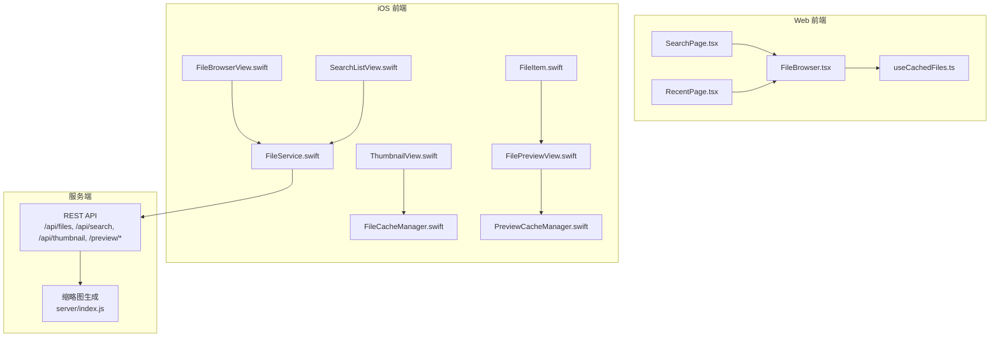

**图表来源**
- [client/src/components/FileBrowser.tsx](file://client/src/components/FileBrowser.tsx#L1-L200)
- [client/src/hooks/useCachedFiles.ts](file://client/src/hooks/useCachedFiles.ts#L1-L102)
- [client/src/components/SearchPage.tsx](file://client/src/components/SearchPage.tsx#L1-L230)
- [client/src/components/RecentPage.tsx](file://client/src/components/RecentPage.tsx#L1-L9)
- [ios/LonghornApp/Views/Files/FileBrowserView.swift](file://ios/LonghornApp/Views/Files/FileBrowserView.swift#L1-L200)
- [ios/LonghornApp/Services/FileService.swift](file://ios/LonghornApp/Services/FileService.swift#L1-L120)
- [ios/LonghornApp/Services/FileCacheManager.swift](file://ios/LonghornApp/Services/FileCacheManager.swift#L1-L120)
- [ios/LonghornApp/Services/PreviewCacheManager.swift](file://ios/LonghornApp/Services/PreviewCacheManager.swift#L1-L120)
- [ios/LonghornApp/Views/Files/FilePreviewView.swift](file://ios/LonghornApp/Views/Files/FilePreviewView.swift#L1-L120)
- [ios/LonghornApp/Views/Files/SearchListView.swift](file://ios/LonghornApp/Views/Files/SearchListView.swift#L1-L120)
- [ios/LonghornApp/Views/Components/ThumbnailView.swift](file://ios/LonghornApp/Views/Components/ThumbnailView.swift#L1-L120)
- [ios/LonghornApp/Models/FileItem.swift](file://ios/LonghornApp/Models/FileItem.swift#L1-L120)
- [server/index.js](file://server/index.js#L517-L577)

**章节来源**
- [client/src/components/FileBrowser.tsx](file://client/src/components/FileBrowser.tsx#L1-L200)
- [ios/LonghornApp/Views/Files/FileBrowserView.swift](file://ios/LonghornApp/Views/Files/FileBrowserView.swift#L1-L200)

## 核心组件
- 文件浏览器（Web/iOS）：负责目录浏览、文件列表渲染、上下文菜单、批量操作、预览入口。
- 缓存系统（Web/iOS）：目录列表缓存、预取、预览缓存与磁盘持久化。
- 预览引擎（iOS）：QuickLook 文档预览、AVPlayer 视频播放、缩略图与原图智能加载。
- 搜索与排序（Web/iOS）：关键词搜索、类型筛选、排序与快速导航。
- 缩略图与懒加载（iOS/Web）：内存缓存、网络请求与降级策略。
- **新增**：手动刷新机制（Web：SWR 手动刷新；iOS：下拉刷新 + 手动触发）。

**章节来源**
- [client/src/hooks/useCachedFiles.ts](file://client/src/hooks/useCachedFiles.ts#L1-L102)
- [ios/LonghornApp/Services/FileCacheManager.swift](file://ios/LonghornApp/Services/FileCacheManager.swift#L1-L120)
- [ios/LonghornApp/Services/PreviewCacheManager.swift](file://ios/LonghornApp/Services/PreviewCacheManager.swift#L1-L120)
- [ios/LonghornApp/Views/Files/FilePreviewView.swift](file://ios/LonghornApp/Views/Files/FilePreviewView.swift#L1-L120)
- [ios/LonghornApp/Views/Components/ThumbnailView.swift](file://ios/LonghornApp/Views/Components/ThumbnailView.swift#L1-L120)

## 架构总览
Web 端通过 SWR 进行目录列表缓存与手动刷新；iOS 端采用"缓存 + 预取 + 预览缓存"的三段式策略，结合 QuickLook 与 AVPlayer 提供多格式预览。**重要变更**：自动刷新已被禁用，改为用户手动触发更新。

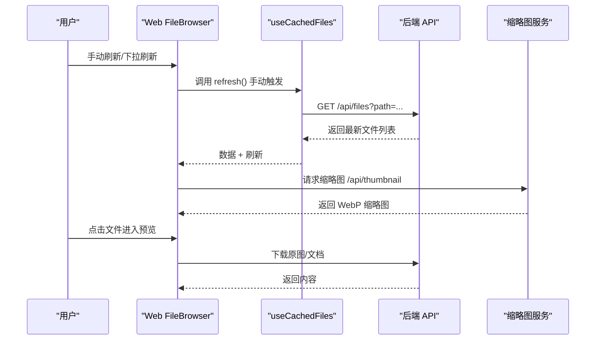

**图表来源**
- [client/src/components/FileBrowser.tsx](file://client/src/components/FileBrowser.tsx#L96-L102)
- [client/src/hooks/useCachedFiles.ts](file://client/src/hooks/useCachedFiles.ts#L58-L86)
- [server/index.js](file://server/index.js#L517-L577)

**章节来源**
- [client/src/components/FileBrowser.tsx](file://client/src/components/FileBrowser.tsx#L96-L102)
- [client/src/hooks/useCachedFiles.ts](file://client/src/hooks/useCachedFiles.ts#L58-L86)

## 详细组件分析

### 目录树构建与文件列表渲染
- Web 端通过 SWR 缓存目录列表，**已禁用自动刷新**（refreshInterval = 0），支持手动刷新与"过期即刷新"，并提供预取函数以提升导航体验。
- iOS 端通过 FileStore + FileCacheManager 实现目录缓存与预取，**保留下拉刷新机制**，但定时轮询已调整为手动触发的后台刷新。

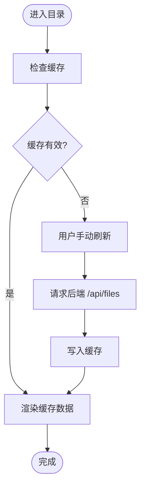

**图表来源**
- [client/src/hooks/useCachedFiles.ts](file://client/src/hooks/useCachedFiles.ts#L58-L86)
- [ios/LonghornApp/Services/FileCacheManager.swift](file://ios/LonghornApp/Services/FileCacheManager.swift#L45-L82)

**章节来源**
- [client/src/hooks/useCachedFiles.ts](file://client/src/hooks/useCachedFiles.ts#L58-L86)
- [ios/LonghornApp/Services/FileCacheManager.swift](file://ios/LonghornApp/Services/FileCacheManager.swift#L45-L82)

### 分页加载与缓存策略
- Web：SWR 默认 keepPreviousData，展示"陈旧数据 + 后台刷新"，减少跳闪；**refreshInterval 已禁用**，通过 globalMutate 预热缓存；手动刷新通过 refresh() 函数触发。
- iOS：FileCacheManager 实现"stale-while-revalidate"，5 分钟陈旧即触发后台刷新，30 分钟完全过期；预取最近子目录。

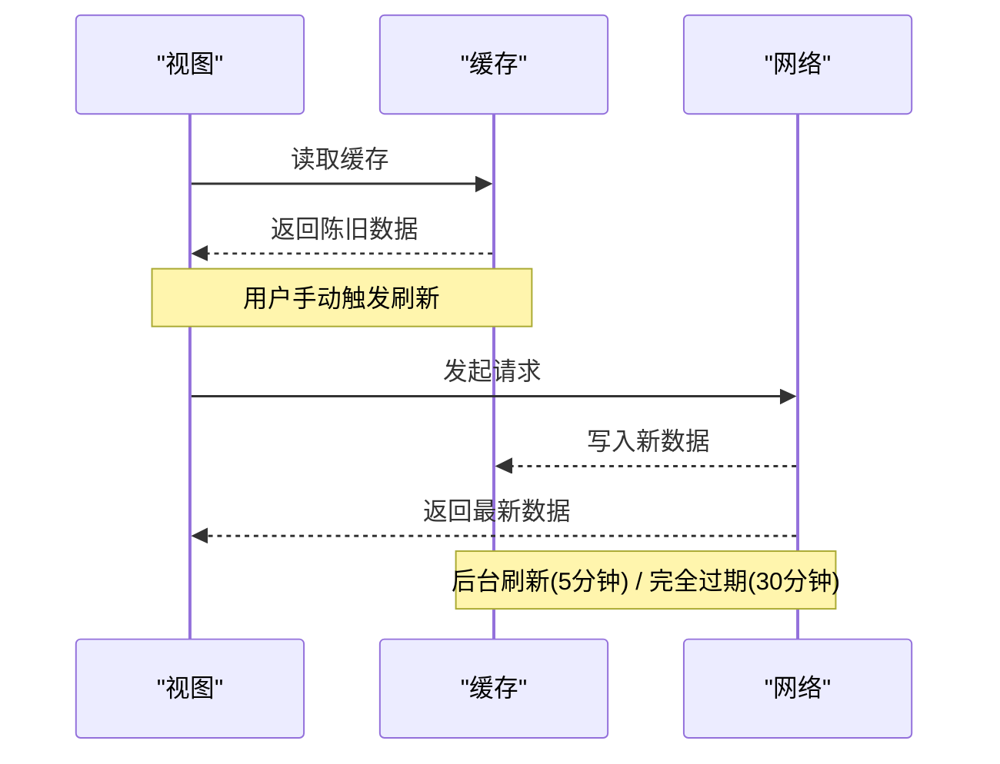

**图表来源**
- [client/src/hooks/useCachedFiles.ts](file://client/src/hooks/useCachedFiles.ts#L66-L67)
- [ios/LonghornApp/Services/FileCacheManager.swift](file://ios/LonghornApp/Services/FileCacheManager.swift#L16-L24)
- [ios/LonghornApp/Services/FileCacheManager.swift](file://ios/LonghornApp/Services/FileCacheManager.swift#L149-L157)

**章节来源**
- [client/src/hooks/useCachedFiles.ts](file://client/src/hooks/useCachedFiles.ts#L66-L67)
- [ios/LonghornApp/Services/FileCacheManager.swift](file://ios/LonghornApp/Services/FileCacheManager.swift#L16-L24)

### 多格式文件预览支持
- 图片：iOS 优先使用预览图（/api/thumbnail?size=preview），大图走预览 API，小图直下原图；Web 使用缩略图 API 并支持降级。
- 视频：iOS 使用 AVPlayer 流式播放；Web 使用视频标签。
- 文档：Web 对 docx 使用 docx-preview，xlsx 使用 xlsx 库转表；iOS 使用 QuickLook。
- 压缩包：Web/iOS 均以下载原文件方式处理，不在线预览。

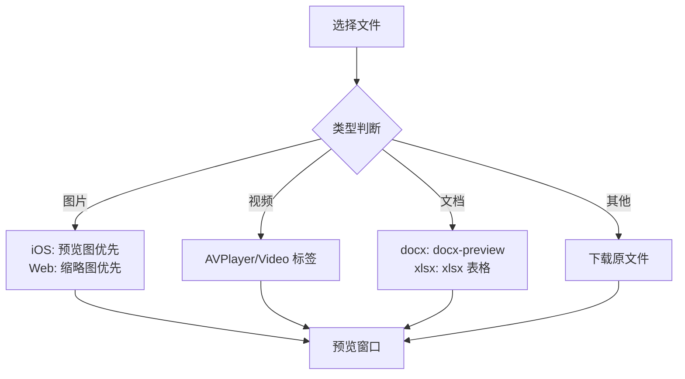

**图表来源**
- [client/src/components/FileBrowser.tsx](file://client/src/components/FileBrowser.tsx#L273-L294)
- [client/src/components/FileBrowser.tsx](file://client/src/components/FileBrowser.tsx#L771-L800)
- [ios/LonghornApp/Views/Files/FilePreviewView.swift](file://ios/LonghornApp/Views/Files/FilePreviewView.swift#L213-L290)

**章节来源**
- [client/src/components/FileBrowser.tsx](file://client/src/components/FileBrowser.tsx#L273-L294)
- [client/src/components/FileBrowser.tsx](file://client/src/components/FileBrowser.tsx#L771-L800)
- [ios/LonghornApp/Views/Files/FilePreviewView.swift](file://ios/LonghornApp/Views/Files/FilePreviewView.swift#L213-L290)

### 缩略图生成策略与懒加载
- 服务端：基于路径与尺寸生成缓存键，若缓存存在且较源文件新则直接返回；否则排队生成并限制并发数，避免资源耗尽。
- iOS：内存缓存 + 网络请求 + 失败降级图标；缩略图尺寸按密度放大以适配高分辨率屏幕。
- Web：同 iOS 思路，使用缩略图 API 并在失败时回退到预览地址或隐藏占位。

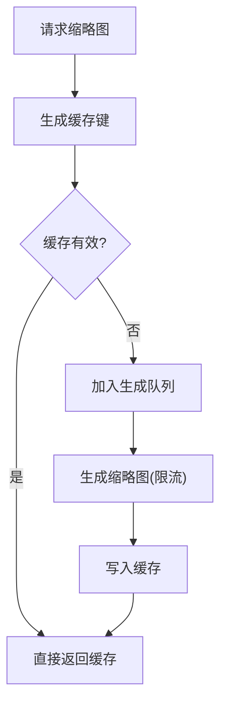

**图表来源**
- [server/index.js](file://server/index.js#L517-L577)
- [ios/LonghornApp/Views/Components/ThumbnailView.swift](file://ios/LonghornApp/Views/Components/ThumbnailView.swift#L73-L110)
- [client/src/components/FileBrowser.tsx](file://client/src/components/FileBrowser.tsx#L775-L794)

**章节来源**
- [server/index.js](file://server/index.js#L517-L577)
- [ios/LonghornApp/Views/Components/ThumbnailView.swift](file://ios/LonghornApp/Views/Components/ThumbnailView.swift#L73-L110)
- [client/src/components/FileBrowser.tsx](file://client/src/components/FileBrowser.tsx#L775-L794)

### 搜索过滤、排序与快速导航
- Web：关键词搜索支持类型过滤；排序字段包括名称、修改时间、大小、访问次数、上传者；快速导航通过路由参数与面包屑实现。
- iOS：支持类型筛选（图片/视频/文档/音频）、关键词搜索、下拉刷新与**手动触发**的定时轮询；导航标题根据路径动态解析。

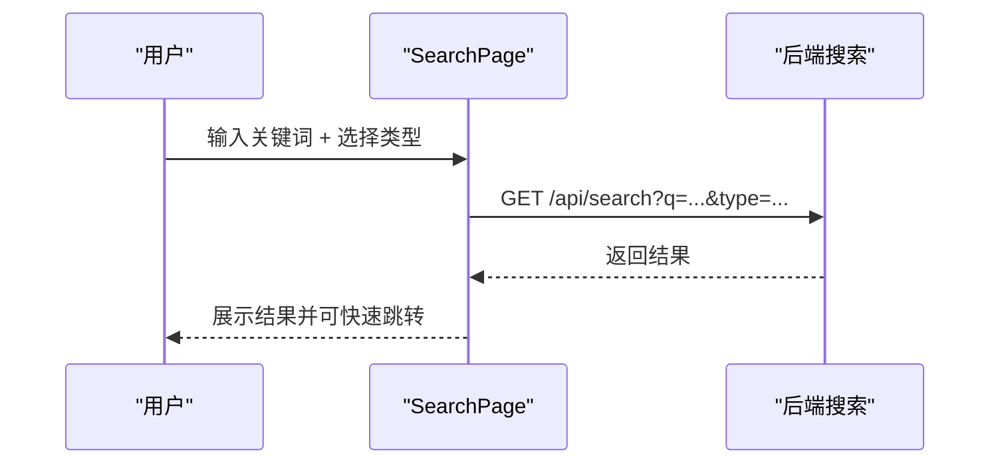

**图表来源**
- [client/src/components/SearchPage.tsx](file://client/src/components/SearchPage.tsx#L30-L49)
- [ios/LonghornApp/Views/Files/SearchListView.swift](file://ios/LonghornApp/Views/Files/SearchListView.swift#L133-L151)

**章节来源**
- [client/src/components/SearchPage.tsx](file://client/src/components/SearchPage.tsx#L30-L49)
- [ios/LonghornApp/Views/Files/SearchListView.swift](file://ios/LonghornApp/Views/Files/SearchListView.swift#L133-L151)

### 移动端触摸手势与响应式布局
- iOS 预览视图支持双击缩放、拖拽平移；工具栏提供收藏、下载、分享等操作；全屏覆盖预览。
- 响应式布局：iOS 使用 LazyVGrid 自适应列数；Web 使用 CSS 布局与媒体查询（由样式控制，具体样式文件未在当前上下文中列出）。

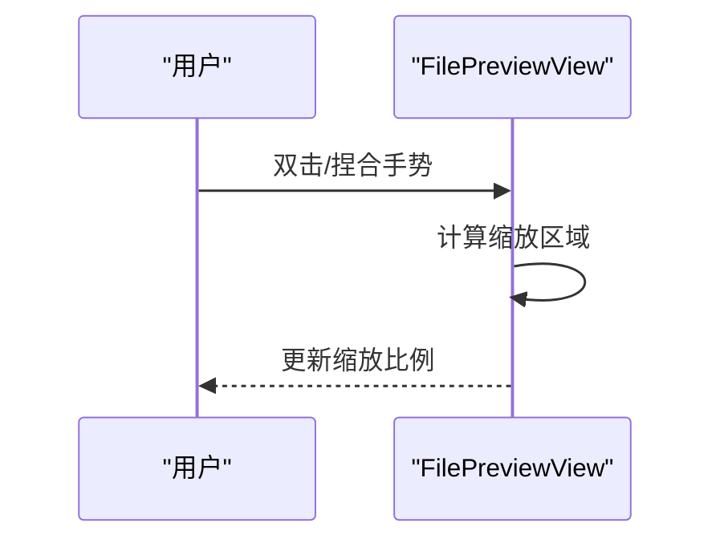

**图表来源**
- [ios/LonghornApp/Views/Files/FilePreviewView.swift](file://ios/LonghornApp/Views/Files/FilePreviewView.swift#L90-L97)
- [ios/LonghornApp/Views/Files/FilePreviewView.swift](file://ios/LonghornApp/Views/Files/FilePreviewView.swift#L156-L209)

**章节来源**
- [ios/LonghornApp/Views/Files/FilePreviewView.swift](file://ios/LonghornApp/Views/Files/FilePreviewView.swift#L90-L97)
- [ios/LonghornApp/Views/Files/FilePreviewView.swift](file://ios/LonghornApp/Views/Files/FilePreviewView.swift#L156-L209)

### 预览窗口交互设计、全屏与离线预览
- 预览窗口：iOS 使用 sheet/fullScreenCover 承载预览内容；工具栏集成收藏、下载、分享；支持 QuickLook 文档与 AVPlayer 视频。
- 全屏：iOS 支持全屏覆盖预览；Web 通过模态或新窗口承载预览。
- 离线预览：iOS 预览缓存（PreviewCacheManager）持久化至沙盒缓存目录，按大小上限（500MB）淘汰；目录缓存支持离线使用。

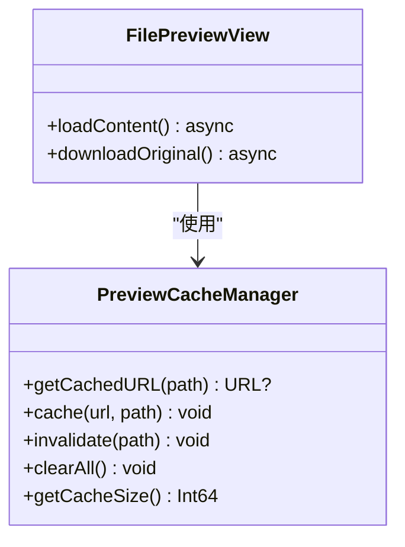

**图表来源**
- [ios/LonghornApp/Services/PreviewCacheManager.swift](file://ios/LonghornApp/Services/PreviewCacheManager.swift#L10-L120)
- [ios/LonghornApp/Views/Files/FilePreviewView.swift](file://ios/LonghornApp/Views/Files/FilePreviewView.swift#L221-L317)

**章节来源**
- [ios/LonghornApp/Services/PreviewCacheManager.swift](file://ios/LonghornApp/Services/PreviewCacheManager.swift#L10-L120)
- [ios/LonghornApp/Views/Files/FilePreviewView.swift](file://ios/LonghornApp/Views/Files/FilePreviewView.swift#L221-L317)

### 手动刷新机制
**新增**：文件浏览器已禁用自动刷新，改为完全手动触发的更新机制。

#### Web 端手动刷新
- SWR hook 中 refreshInterval 已设置为 0，禁用自动轮询
- 通过 refresh() 函数提供手动刷新能力
- 支持用户主动触发更新，如上传完成后自动刷新

#### iOS 端手动刷新
- 保留下拉刷新（refreshable）机制
- 定时轮询调整为手动触发的后台刷新
- 支持用户主动触发更新，如文件操作完成后刷新

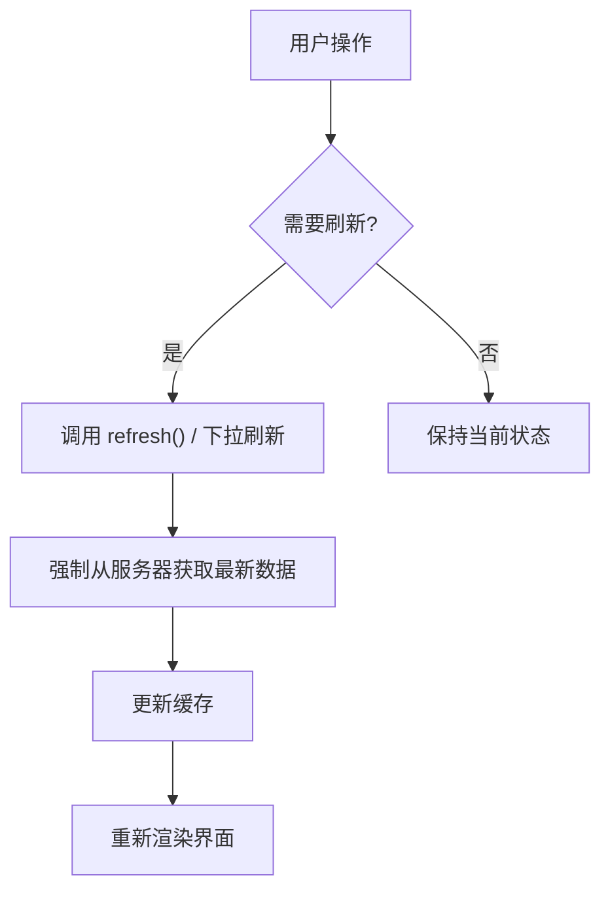

**图表来源**
- [client/src/hooks/useCachedFiles.ts](file://client/src/hooks/useCachedFiles.ts#L46-L47)
- [client/src/components/FileBrowser.tsx](file://client/src/components/FileBrowser.tsx#L158-L162)
- [ios/LonghornApp/Views/Files/FileBrowserView.swift](file://ios/LonghornApp/Views/Files/FileBrowserView.swift#L130-L132)

**章节来源**
- [client/src/hooks/useCachedFiles.ts](file://client/src/hooks/useCachedFiles.ts#L46-L47)
- [client/src/components/FileBrowser.tsx](file://client/src/components/FileBrowser.tsx#L158-L162)
- [ios/LonghornApp/Views/Files/FileBrowserView.swift](file://ios/LonghornApp/Views/Files/FileBrowserView.swift#L130-L132)

## 依赖关系分析
- Web 端依赖 SWR 进行缓存与刷新，Axios 发起请求；useCachedFiles 提供预取能力；**refreshInterval 已禁用**，改为手动触发。
- iOS 端依赖 FileService 统一调用后端 API；FileCacheManager 管理目录缓存；PreviewCacheManager 管理预览缓存；ThumbnailView/QuickLook/AVPlayer 提供多格式预览；**定时轮询调整为手动触发**。
- 服务端提供缩略图生成与缓存校验逻辑，限制并发以保障稳定性。

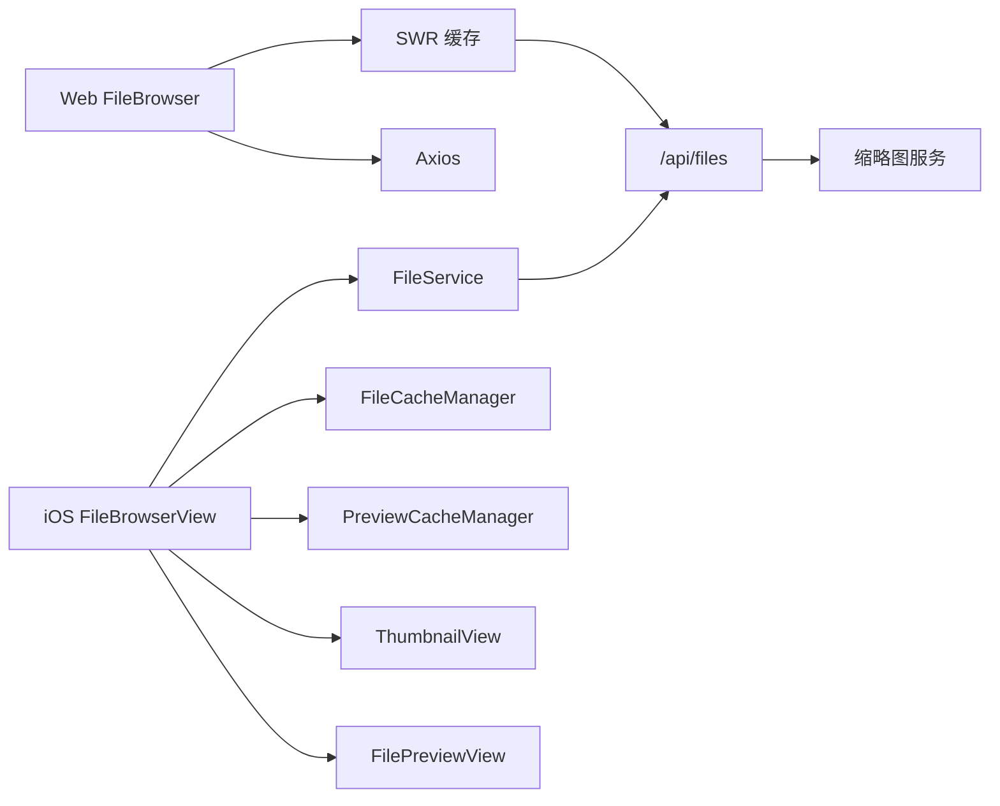

**图表来源**
- [client/src/hooks/useCachedFiles.ts](file://client/src/hooks/useCachedFiles.ts#L58-L86)
- [ios/LonghornApp/Services/FileService.swift](file://ios/LonghornApp/Services/FileService.swift#L18-L39)
- [ios/LonghornApp/Services/FileCacheManager.swift](file://ios/LonghornApp/Services/FileCacheManager.swift#L29-L82)
- [ios/LonghornApp/Services/PreviewCacheManager.swift](file://ios/LonghornApp/Services/PreviewCacheManager.swift#L10-L40)
- [server/index.js](file://server/index.js#L517-L577)

**章节来源**
- [client/src/hooks/useCachedFiles.ts](file://client/src/hooks/useCachedFiles.ts#L58-L86)
- [ios/LonghornApp/Services/FileService.swift](file://ios/LonghornApp/Services/FileService.swift#L18-L39)
- [ios/LonghornApp/Services/FileCacheManager.swift](file://ios/LonghornApp/Services/FileCacheManager.swift#L29-L82)
- [ios/LonghornApp/Services/PreviewCacheManager.swift](file://ios/LonghornApp/Services/PreviewCacheManager.swift#L10-L40)
- [server/index.js](file://server/index.js#L517-L577)

## 性能考虑
- 缓存与预取：目录缓存 5 分钟陈旧即刷新，预取最近子目录，显著降低首屏延迟。
- 缩略图限流：服务端并发限制与缓存命中优先，避免 CPU/IO 抖动。
- 预览缓存上限：iOS 预览缓存按 500MB 上限淘汰，避免占用过多存储。
- 网络层优化：**SWR 手动刷新策略**替代自动轮询，减少不必要的网络请求；iOS 内存缓存减少网络往返。
- **新增**：手动刷新机制显著降低后台资源消耗，提升应用整体性能。

## 故障排除指南
- 预览失败：检查缩略图/原图下载状态与网络权限；iOS 可尝试重新下载原图；Web 检查 /preview 与 /api/thumbnail 权限。
- 缓存异常：清理预览缓存或目录缓存；确认缓存目录可写；iOS 可清空缓存后重试。
- 搜索无结果：确认关键词与类型筛选；检查后端搜索接口可用性与索引状态。
- 导航卡顿：减少一次性预取数量；检查网络质量与后端响应时间。
- **新增**：文件未更新问题：确认已正确调用手动刷新函数；检查网络连接状态；尝试下拉刷新。

**章节来源**
- [ios/LonghornApp/Views/Files/FilePreviewView.swift](file://ios/LonghornApp/Views/Files/FilePreviewView.swift#L273-L280)
- [ios/LonghornApp/Services/PreviewCacheManager.swift](file://ios/LonghornApp/Services/PreviewCacheManager.swift#L204-L218)
- [client/src/components/SearchPage.tsx](file://client/src/components/SearchPage.tsx#L43-L49)

## 结论
该系统通过"目录缓存 + 预取 + 预览缓存"的三层策略，在保证数据新鲜度的同时显著提升了浏览与预览的流畅度。**重要更新**：禁用自动刷新改为手动触发，进一步优化了性能表现，减少了不必要的网络请求和后台资源消耗。iOS 与 Web 在多格式预览、缩略图与离线能力上形成互补，移动端交互与响应式布局进一步增强了用户体验。

## 附录
- 数据模型：FileItem 定义了文件元数据、类型判定与格式化方法，支撑预览与 UI 渲染。
- 服务接口：FileService 统一封装了文件列表、搜索、收藏、分享等操作，便于跨平台调用。

**章节来源**
- [ios/LonghornApp/Models/FileItem.swift](file://ios/LonghornApp/Models/FileItem.swift#L11-L194)
- [ios/LonghornApp/Services/FileService.swift](file://ios/LonghornApp/Services/FileService.swift#L18-L246)