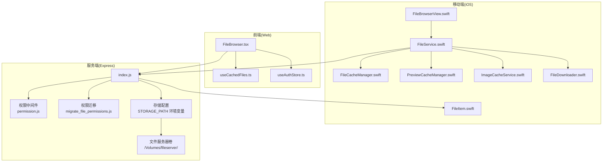
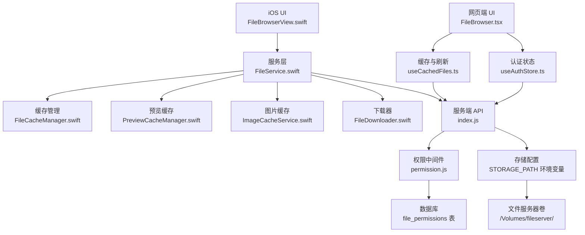
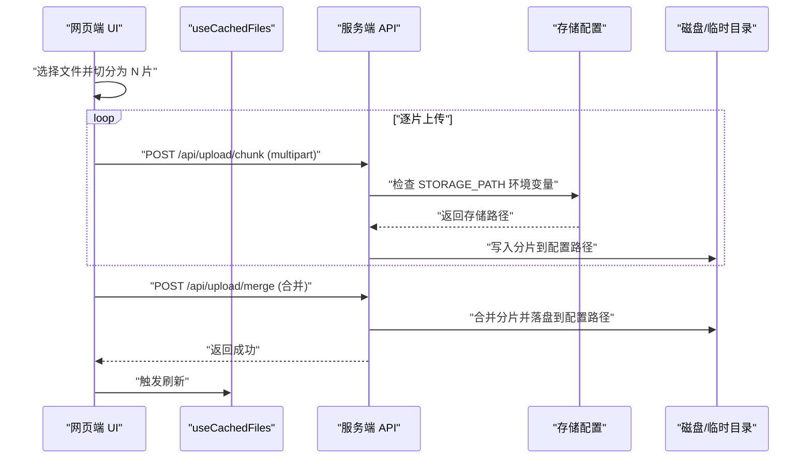
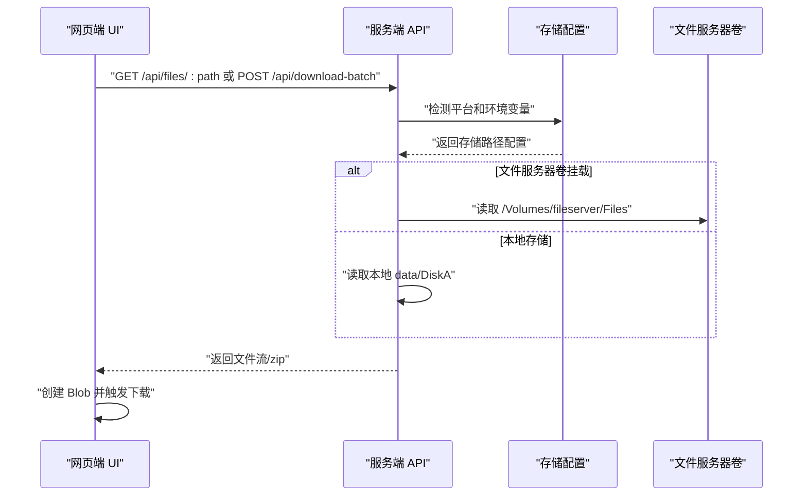
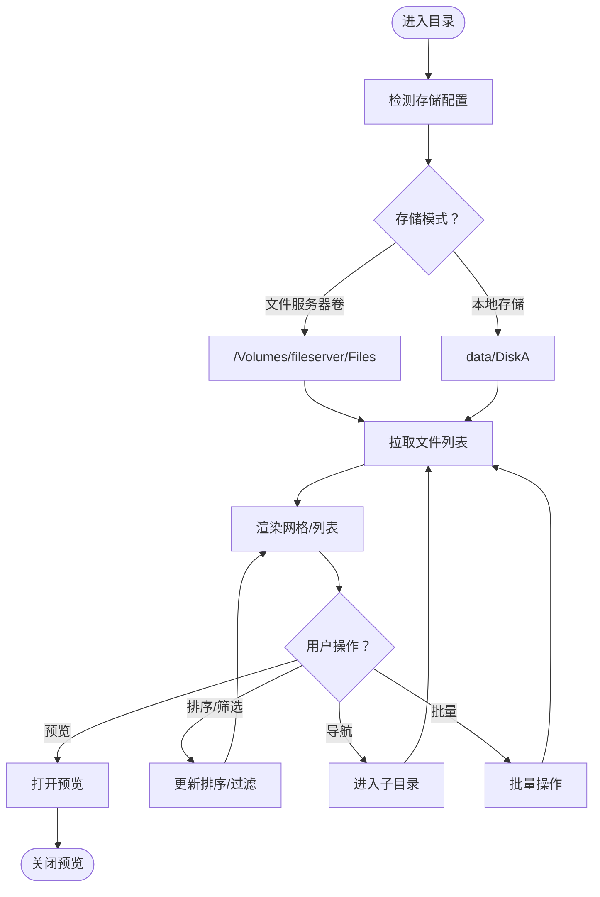
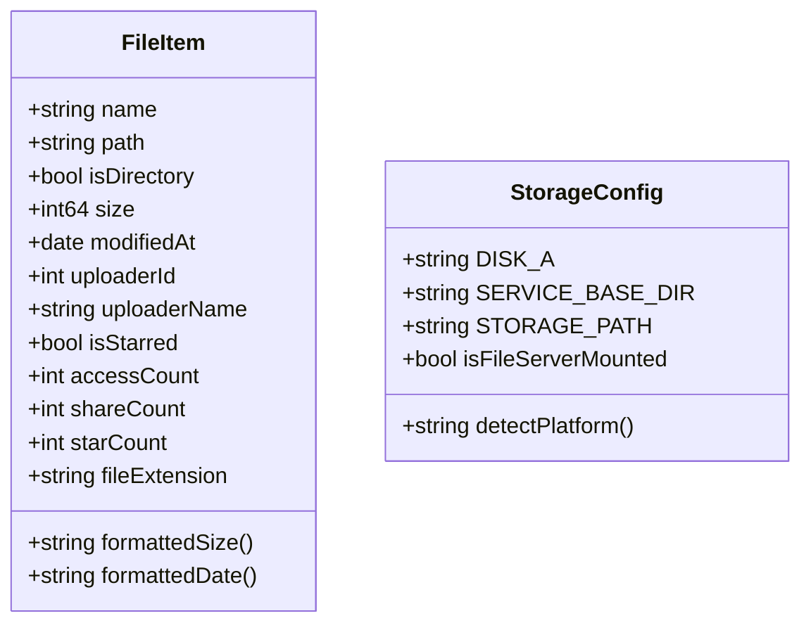
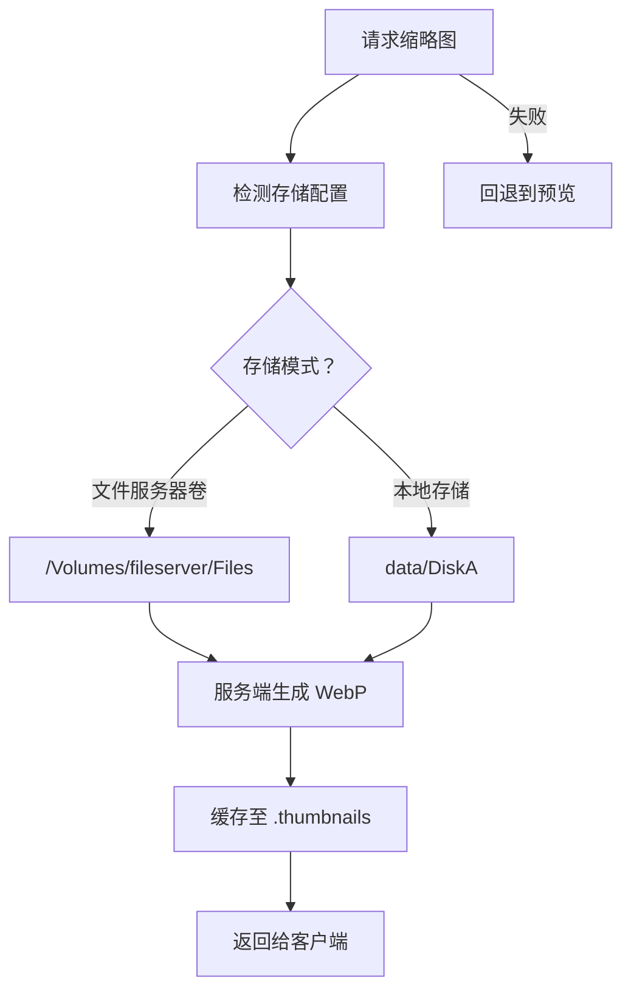
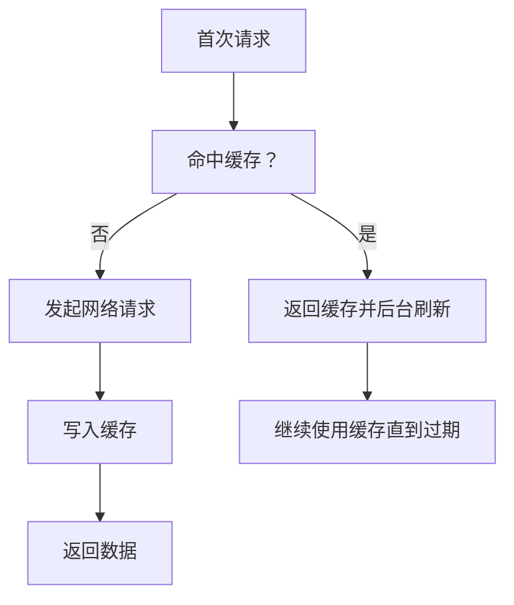
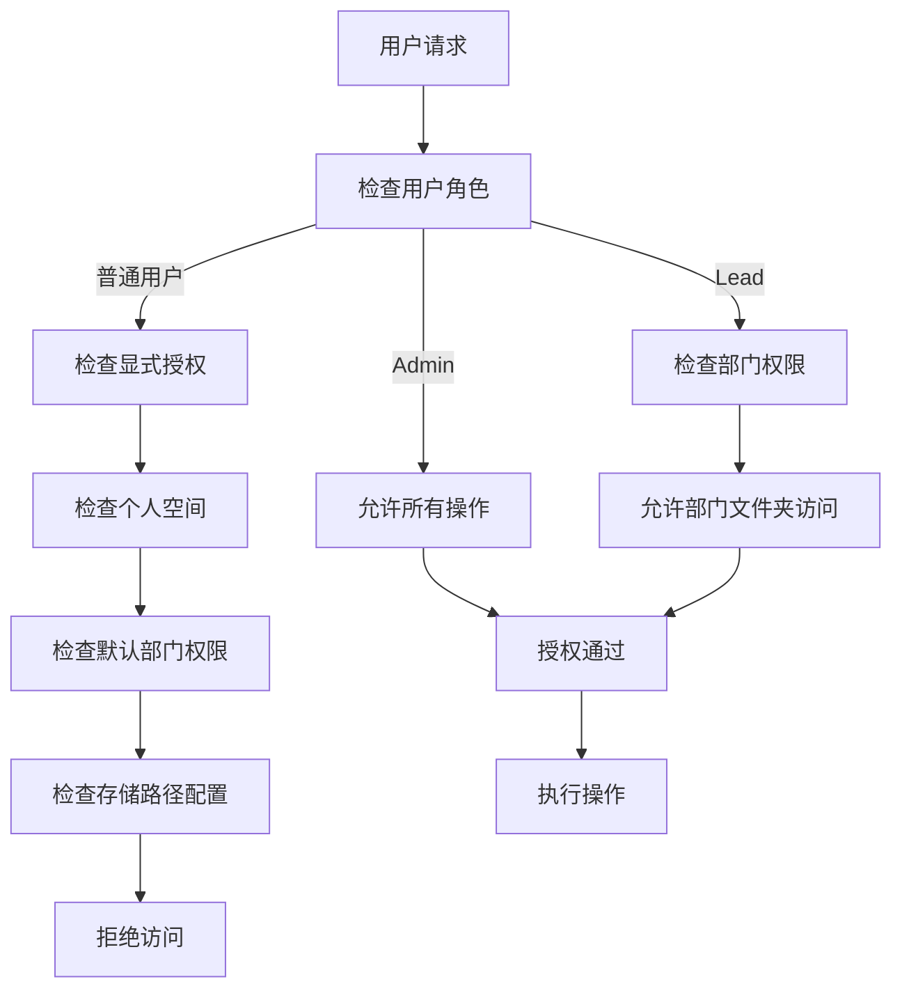
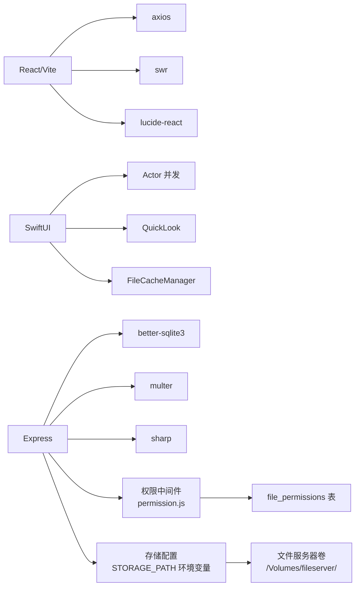

# 文件管理系统

<cite>
**本文引用的文件**
- [client/src/components/FileBrowser.tsx](file://client/src/components/FileBrowser.tsx)
- [client/src/hooks/useCachedFiles.ts](file://client/src/hooks/useCachedFiles.ts)
- [client/src/store/useAuthStore.ts](file://client/src/store/useAuthStore.ts)
- [client/README.md](file://client/README.md)
- [ios/LonghornApp/Views/Files/FileBrowserView.swift](file://ios/LonghornApp/Views/Files/FileBrowserView.swift)
- [ios/LonghornApp/Services/FileService.swift](file://ios/LonghornApp/Services/FileService.swift)
- [ios/LonghornApp/Services/FileCacheManager.swift](file://ios/LonghornApp/Services/FileCacheManager.swift)
- [ios/LonghornApp/Services/PreviewCacheManager.swift](file://ios/LonghornApp/Services/PreviewCacheManager.swift)
- [ios/LonghornApp/Services/ImageCacheService.swift](file://ios/LonghornApp/Services/ImageCacheService.swift)
- [ios/LonghornApp/Services/FileDownloader.swift](file://ios/LonghornApp/Services/FileDownloader.swift)
- [ios/LonghornApp/Models/FileItem.swift](file://ios/LonghornApp/Models/FileItem.swift)
- [ios/README.md](file://ios/README.md)
- [server/index.js](file://server/index.js)
- [server/package.json](file://server/package.json)
- [server/migrate_file_permissions.js](file://server/migrate_file_permissions.js)
- [server/service/middleware/permission.js](file://server/service/middleware/permission.js)
- [server/service/routes/system.js](file://server/service/routes/system.js)
- [docs/Service_DataModel.md](file://docs/Service_DataModel.md)
- [docs/OPS.md](file://docs/OPS.md)
</cite>

## 更新摘要
**变更内容**
- 新增可配置附件存储位置章节，详细说明 STORAGE_PATH 环境变量和文件服务器卷挂载
- 更新文件存储架构，增加基于平台的存储路径配置和软链接映射
- 新增文件服务器卷挂载配置和部署路径说明
- 更新权限验证与并发控制章节，增加存储路径配置优化
- 新增存储路径环境变量和平台检测机制

## 目录
1. [简介](#简介)
2. [项目结构](#项目结构)
3. [核心组件](#核心组件)
4. [架构总览](#架构总览)
5. [详细组件分析](#详细组件分析)
6. [依赖关系分析](#依赖关系分析)
7. [性能考量](#性能考量)
8. [故障排查指南](#故障排查指南)
9. [结论](#结论)
10. [附录](#附录)

## 简介
本文件管理系统以 React + Vite（网页端）与 SwiftUI（iOS 端）为核心，结合服务端 Express 提供统一的数据与文件能力。系统覆盖文件上传（含分片与合并）、下载、浏览、搜索、预览、缩略图、权限与分享、收藏与统计、批量操作、缓存与并发控制等完整能力，并提供跨端一致的用户体验。

**更新** 新增可配置的附件存储位置功能，支持基于平台和部署环境的文件服务器卷挂载，提供灵活的存储架构配置。

## 项目结构
- 前端（React/Vite）
  - 组件层：文件浏览器、登录、仪表盘、搜索、分享、回收站、星标页等
  - 数据层：认证状态、全局提示、确认弹窗、缓存钩子
  - 工具与国际化：日期本地化、路径翻译
- 移动端（SwiftUI）
  - 视图层：文件浏览器、预览、搜索、批量操作、分享对话
  - 服务层：网络请求、文件缓存、预览缓存、图片缓存、下载器
  - 模型层：文件项、用户、权限、分享、回收站等数据模型
- 服务端（Express）
  - 路由与业务：文件列表、上传（分片/合并）、下载、搜索、权限、分享、回收站、统计
  - 存储：SQLite 数据库、磁盘文件、缩略图、回收站、临时上传/分片目录
  - 权限中间件：基于角色的权限控制和 View As 功能
  - **新增** 可配置存储路径：支持 STORAGE_PATH 环境变量和文件服务器卷挂载



**图表来源**
- [client/src/components/FileBrowser.tsx:1-200](file://client/src/components/FileBrowser.tsx#L1-L200)
- [client/src/hooks/useCachedFiles.ts:1-102](file://client/src/hooks/useCachedFiles.ts#L1-L102)
- [client/src/store/useAuthStore.ts:1-31](file://client/src/store/useAuthStore.ts#L1-L31)
- [ios/LonghornApp/Views/Files/FileBrowserView.swift:1-200](file://ios/LonghornApp/Views/Files/FileBrowserView.swift#L1-L200)
- [ios/LonghornApp/Services/FileService.swift:1-120](file://ios/LonghornApp/Services/FileService.swift#L1-L120)
- [ios/LonghornApp/Services/FileCacheManager.swift:1-120](file://ios/LonghornApp/Services/FileCacheManager.swift#L1-L120)
- [ios/LonghornApp/Services/PreviewCacheManager.swift:1-120](file://ios/LonghornApp/Services/PreviewCacheManager.swift#L1-L120)
- [ios/LonghornApp/Services/ImageCacheService.swift:1-37](file://ios/LonghornApp/Services/ImageCacheService.swift#L1-L37)
- [ios/LonghornApp/Services/FileDownloader.swift:1-106](file://ios/LonghornApp/Services/FileDownloader.swift#L1-L106)
- [ios/LonghornApp/Models/FileItem.swift:1-120](file://ios/LonghornApp/Models/FileItem.swift#L1-L120)
- [server/index.js:1-200](file://server/index.js#L1-L200)
- [server/service/middleware/permission.js:1-278](file://server/service/middleware/permission.js#L1-L278)
- [server/migrate_file_permissions.js:1-139](file://server/migrate_file_permissions.js#L1-L139)
- [server/service/routes/system.js:470-495](file://server/service/routes/system.js#L470-L495)

**章节来源**
- [client/README.md:1-35](file://client/README.md#L1-L35)
- [ios/README.md:1-27](file://ios/README.md#L1-L27)
- [docs/OPS.md:84-89](file://docs/OPS.md#L84-L89)

## 核心组件
- 网页端文件浏览器
  - 支持网格/列表视图、排序、筛选、预览、上下文菜单、批量操作、分享、收藏、统计、搜索
  - 使用 SWR 进行缓存与自动刷新，支持预取子目录
- iOS 文件浏览器
  - 基于 Actor 的缓存管理，stale-while-revalidate 模式；后台轮询刷新；预取子目录
  - 集成自定义预览面板、批量操作、搜索、分享、下载进度
- 服务端
  - 提供文件列表、上传（分片+合并）、下载、搜索、权限、分享、回收站、统计等接口
  - 使用 better-sqlite3 管理元数据，Multer 处理上传，Sharp 生成缩略图
  - **新增** 权限中间件提供基于角色的权限控制和 View As 功能
  - **新增** 可配置存储路径支持 STORAGE_PATH 环境变量和文件服务器卷挂载

**章节来源**
- [client/src/components/FileBrowser.tsx:1-200](file://client/src/components/FileBrowser.tsx#L1-L200)
- [client/src/hooks/useCachedFiles.ts:1-102](file://client/src/hooks/useCachedFiles.ts#L1-L102)
- [ios/LonghornApp/Views/Files/FileBrowserView.swift:1-200](file://ios/LonghornApp/Views/Files/FileBrowserView.swift#L1-L200)
- [ios/LonghornApp/Services/FileCacheManager.swift:1-120](file://ios/LonghornApp/Services/FileCacheManager.swift#L1-L120)
- [server/index.js:1-200](file://server/index.js#L1-L200)
- [server/service/middleware/permission.js:1-278](file://server/service/middleware/permission.js#L1-L278)

## 架构总览
系统采用"前端组件 + 服务端 API"的分层设计，移动端通过服务层封装网络调用，缓存与预取策略贯穿前后端，确保流畅的交互体验。**新增** 权限中间件在服务端提供统一的权限控制机制，**新增** 可配置存储路径支持灵活的文件存储架构。



**图表来源**
- [client/src/components/FileBrowser.tsx:1-200](file://client/src/components/FileBrowser.tsx#L1-L200)
- [client/src/hooks/useCachedFiles.ts:1-102](file://client/src/hooks/useCachedFiles.ts#L1-L102)
- [client/src/store/useAuthStore.ts:1-31](file://client/src/store/useAuthStore.ts#L1-L31)
- [ios/LonghornApp/Views/Files/FileBrowserView.swift:1-200](file://ios/LonghornApp/Views/Files/FileBrowserView.swift#L1-L200)
- [ios/LonghornApp/Services/FileService.swift:1-120](file://ios/LonghornApp/Services/FileService.swift#L1-L120)
- [ios/LonghornApp/Services/FileCacheManager.swift:1-120](file://ios/LonghornApp/Services/FileCacheManager.swift#L1-L120)
- [ios/LonghornApp/Services/PreviewCacheManager.swift:1-120](file://ios/LonghornApp/Services/PreviewCacheManager.swift#L1-L120)
- [ios/LonghornApp/Services/ImageCacheService.swift:1-37](file://ios/LonghornApp/Services/ImageCacheService.swift#L1-L37)
- [ios/LonghornApp/Services/FileDownloader.swift:1-106](file://ios/LonghornApp/Services/FileDownloader.swift#L1-L106)
- [server/index.js:1-200](file://server/index.js#L1-L200)
- [server/service/middleware/permission.js:1-278](file://server/service/middleware/permission.js#L1-L278)
- [server/service/routes/system.js:470-495](file://server/service/routes/system.js#L470-L495)

## 详细组件分析

### 文件上传处理流程（分片与合并）
- 前端（React）
  - 选择文件后创建 AbortController 控制取消
  - 默认 5MB 分片，逐片上传并累计进度，最后调用合并接口
  - 支持速率计算与进度展示，失败时捕获并提示
- 服务端（Express）
  - 使用 Multer 将分片写入临时目录，合并完成后落盘
  - 上传成功后更新数据库元数据（路径、大小、上传者等）
  - **新增** 支持可配置存储路径，优先使用 STORAGE_PATH 环境变量



**图表来源**
- [client/src/components/FileBrowser.tsx:340-450](file://client/src/components/FileBrowser.tsx#L340-L450)
- [server/index.js:38-44](file://server/index.js#L38-L44)
- [server/service/routes/system.js:470-495](file://server/service/routes/system.js#L470-L495)

**章节来源**
- [client/src/components/FileBrowser.tsx:340-450](file://client/src/components/FileBrowser.tsx#L340-L450)
- [server/index.js:38-44](file://server/index.js#L38-L44)
- [server/service/routes/system.js:470-495](file://server/service/routes/system.js#L470-L495)

### 文件下载机制
- 前端（React）
  - 单文件下载：通过 axios 发起请求并触发浏览器下载
  - 批量下载：POST /api/download-batch 返回 zip 流，动态创建 a 标签触发下载
- iOS
  - 使用 URLSession 下载任务，实时计算进度与速度，支持取消
  - 下载完成后返回临时路径，交由上层处理后续动作
- **新增** 服务端文件路径解析
  - 支持两种存储模式：文件服务器卷挂载和本地存储
  - 自动检测平台环境，优先使用文件服务器卷路径



**图表来源**
- [client/src/components/FileBrowser.tsx:600-641](file://client/src/components/FileBrowser.tsx#L600-L641)
- [ios/LonghornApp/Services/FileDownloader.swift:1-106](file://ios/LonghornApp/Services/FileDownloader.swift#L1-L106)
- [server/service/routes/system.js:470-495](file://server/service/routes/system.js#L470-L495)

**章节来源**
- [client/src/components/FileBrowser.tsx:600-641](file://client/src/components/FileBrowser.tsx#L600-L641)
- [ios/LonghornApp/Services/FileDownloader.swift:1-106](file://ios/LonghornApp/Services/FileDownloader.swift#L1-L106)
- [server/service/routes/system.js:470-495](file://server/service/routes/system.js#L470-L495)

### 文件浏览界面实现
- 网页端
  - 使用 SWR 缓存目录列表，支持视图模式切换、排序、键盘与菜单事件
  - 预取前 5 个子目录提升导航体验
- iOS
  - 基于 Actor 的缓存管理，stale-while-revalidate，后台轮询刷新
  - 支持搜索、批量选择、上下文菜单、侧边栏导航
- **新增** 存储路径适配
  - 自动适配不同存储模式下的文件路径
  - 支持软链接映射和直接路径访问



**图表来源**
- [client/src/components/FileBrowser.tsx:1-200](file://client/src/components/FileBrowser.tsx#L1-L200)
- [client/src/hooks/useCachedFiles.ts:1-102](file://client/src/hooks/useCachedFiles.ts#L1-L102)
- [ios/LonghornApp/Views/Files/FileBrowserView.swift:1-200](file://ios/LonghornApp/Views/Files/FileBrowserView.swift#L1-L200)
- [ios/LonghornApp/Services/FileCacheManager.swift:1-120](file://ios/LonghornApp/Services/FileCacheManager.swift#L1-L120)
- [server/index.js:29-35](file://server/index.js#L29-L35)

**章节来源**
- [client/src/components/FileBrowser.tsx:1-200](file://client/src/components/FileBrowser.tsx#L1-L200)
- [client/src/hooks/useCachedFiles.ts:1-102](file://client/src/hooks/useCachedFiles.ts#L1-L102)
- [ios/LonghornApp/Views/Files/FileBrowserView.swift:1-200](file://ios/LonghornApp/Views/Files/FileBrowserView.swift#L1-L200)
- [ios/LonghornApp/Services/FileCacheManager.swift:1-120](file://ios/LonghornApp/Services/FileCacheManager.swift#L1-L120)
- [server/index.js:29-35](file://server/index.js#L29-L35)

### 文件元数据管理
- 数据模型（iOS）
  - FileItem 包含名称、路径、是否目录、大小、修改时间、上传者、收藏/访问/分享计数等
  - 支持多种日期格式解析与本地化显示
- 服务端
  - SQLite 表结构包含部门、用户、权限、收藏、词汇表等
  - 文件元数据与权限控制、访问统计、分享链接等
  - **新增** 存储路径字段支持不同存储模式



**图表来源**
- [ios/LonghornApp/Models/FileItem.swift:1-200](file://ios/LonghornApp/Models/FileItem.swift#L1-L200)
- [server/index.js:29-35](file://server/index.js#L29-L35)

**章节来源**
- [ios/LonghornApp/Models/FileItem.swift:1-200](file://ios/LonghornApp/Models/FileItem.swift#L1-L200)
- [server/index.js:29-35](file://server/index.js#L29-L35)

### 缩略图生成与预览
- 缩略图
  - 服务端使用 Sharp 生成 WebP 缩略图，按需请求 /api/thumbnail
  - 网页端在图标加载失败时回退到预览
  - **新增** 支持文件服务器卷中的文件缩略图生成
- 预览缓存（iOS）
  - 基于 LRU 的磁盘缓存，最大 500MB，按最后访问时间淘汰
  - 缓存索引持久化，启动时恢复并清理孤儿文件



**图表来源**
- [client/src/components/FileBrowser.tsx:770-800](file://client/src/components/FileBrowser.tsx#L770-L800)
- [server/index.js:1-200](file://server/index.js#L1-L200)
- [server/service/routes/system.js:510-586](file://server/service/routes/system.js#L510-L586)
- [ios/LonghornApp/Services/PreviewCacheManager.swift:1-120](file://ios/LonghornApp/Services/PreviewCacheManager.swift#L1-L120)

**章节来源**
- [client/src/components/FileBrowser.tsx:770-800](file://client/src/components/FileBrowser.tsx#L770-L800)
- [server/service/routes/system.js:510-586](file://server/service/routes/system.js#L510-L586)
- [ios/LonghornApp/Services/PreviewCacheManager.swift:1-120](file://ios/LonghornApp/Services/PreviewCacheManager.swift#L1-L120)
- [server/index.js:1-200](file://server/index.js#L1-L200)

### 缓存策略
- 网页端（React/SWR）
  - 目录列表缓存，去重间隔 5 秒，轮询 5 秒，保持旧数据即时显示
  - 支持预取子目录，减少二次点击延迟
- iOS（Actor 缓存）
  - stale-while-revalidate：缓存 5 分钟内可用，30 分钟强制刷新
  - 预取前 5 个子目录，后台刷新不阻塞 UI
  - 图片缓存内存限制，避免滚动卡顿
- 服务端
  - 缩略图缓存至 data/.thumbnails 目录
  - **新增** 存储路径配置影响缓存和文件访问性能



**图表来源**
- [client/src/hooks/useCachedFiles.ts:1-102](file://client/src/hooks/useCachedFiles.ts#L1-L102)
- [ios/LonghornApp/Services/FileCacheManager.swift:1-120](file://ios/LonghornApp/Services/FileCacheManager.swift#L1-L120)
- [ios/LonghornApp/Services/ImageCacheService.swift:1-37](file://ios/LonghornApp/Services/ImageCacheService.swift#L1-L37)
- [server/index.js:32-35](file://server/index.js#L32-L35)

**章节来源**
- [client/src/hooks/useCachedFiles.ts:1-102](file://client/src/hooks/useCachedFiles.ts#L1-L102)
- [ios/LonghornApp/Services/FileCacheManager.swift:1-120](file://ios/LonghornApp/Services/FileCacheManager.swift#L1-L120)
- [ios/LonghornApp/Services/ImageCacheService.swift:1-37](file://ios/LonghornApp/Services/ImageCacheService.swift#L1-L37)
- [server/index.js:32-35](file://server/index.js#L32-L35)

### 权限验证与并发控制
- 权限
  - **新增** 基于角色的权限控制，支持 Admin、Employee、Market、Dealer 四种角色
  - **新增** file_permissions 表存储用户对文件夹的访问权限，包含 access_type 和 expires_at 字段
  - **新增** path_hash 字段用于快速路径查询，通过 MD5 哈希加速权限检查
  - **新增** 唯一索引防止重复授权，过期时间索引优化查询性能
  - **新增** View As 功能，允许管理员以其他用户身份查看
  - **新增** 存储路径配置优化，支持不同存储模式下的权限检查
- 并发
  - iOS 使用 Actor 保证缓存与预取的线程安全
  - 防止重复请求（loading 标记），避免竞态
  - 网页端 SWR 去重与轮询，降低网络压力

**章节来源**
- [server/index.js:121-133](file://server/index.js#L121-L133)
- [server/index.js:734-787](file://server/index.js#L734-L787)
- [server/migrate_file_permissions.js:1-139](file://server/migrate_file_permissions.js#L1-L139)
- [server/service/middleware/permission.js:1-278](file://server/service/middleware/permission.js#L1-L278)
- [docs/Service_DataModel.md:1470-1518](file://docs/Service_DataModel.md#L1470-L1518)

### 大文件处理优化
- 分片上传（前端）
  - 5MB 分片，支持断点续传与取消
  - 合并阶段一次性完成，避免多次 IO
- 服务端
  - 分片写入 .chunks，合并后落盘，减少内存占用
  - 压缩与 CORS 中间件提升传输效率
  - **新增** 可配置存储路径，支持文件服务器卷挂载优化大文件处理

**章节来源**
- [client/src/components/FileBrowser.tsx:340-450](file://client/src/components/FileBrowser.tsx#L340-L450)
- [server/index.js:38-44](file://server/index.js#L38-L44)
- [server/service/routes/system.js:470-495](file://server/service/routes/system.js#L470-L495)

### 文件搜索与批量操作
- 搜索
  - 网页端：输入即触发，支持多作用域（全部/部门/个人）
  - iOS：集成系统搜索栏，支持多条件查询
- 批量操作
  - 选择多个文件后执行移动、删除、下载、分享
  - 服务端批量接口返回成功/失败明细，前端提示汇总结果
  - **新增** 支持不同存储模式下的批量操作

**章节来源**
- [client/src/components/FileBrowser.tsx:308-340](file://client/src/components/FileBrowser.tsx#L308-L340)
- [ios/LonghornApp/Views/Files/FileBrowserView.swift:308-344](file://ios/LonghornApp/Views/Files/FileBrowserView.swift#L308-L344)
- [ios/LonghornApp/Services/FileService.swift:78-110](file://ios/LonghornApp/Services/FileService.swift#L78-L110)

### 文件统计分析
- 访问统计
  - 记录访问日志，支持按文件查看访问历史
  - 收藏/分享计数用于分析热度
- iOS 统计面板
  - 展示访问次数、最近访问者、分享次数等
  - **新增** 支持不同存储模式下的统计信息

**章节来源**
- [client/src/components/FileBrowser.tsx:248-271](file://client/src/components/FileBrowser.tsx#L248-L271)
- [ios/LonghornApp/Services/FileService.swift:227-246](file://ios/LonghornApp/Services/FileService.swift#L227-L246)

### API 接口文档（摘要）
- 文件列表
  - GET /api/files?path=...
  - GET /api/files/recent
  - GET /api/files/starred
- 上传
  - POST /api/upload/chunk
  - POST /api/upload/merge
- 下载
  - GET /api/files/:path
  - POST /api/download-batch
- 搜索
  - GET /api/search?q=&scope=&type=
- **新增** 权限管理
  - GET /api/admin/users/:id/permissions
  - POST /api/admin/users/:id/permissions
  - DELETE /api/admin/permissions/:id
  - GET /api/user/permissions
- **新增** 存储配置
  - GET /api/storage/config
  - GET /api/storage/status
- 权限与分享
  - POST /api/folders
  - POST /api/starred
  - DELETE /api/starred/:id
  - POST /api/shares
  - POST /api/share-collection
- 统计
  - POST /api/files/access
  - GET /api/files/stats?path=

**章节来源**
- [server/index.js:1540-1589](file://server/index.js#L1540-L1589)
- [server/index.js:1671-1694](file://server/index.js#L1671-L1694)

### 前端组件使用示例
- 文件浏览器（网页端）
  - 引入 FileBrowser 组件，传入 mode 参数（all/recent/starred/personal）
  - 使用 useCachedFiles 获取 files、userCanWrite、isLoading、refresh
- 认证状态
  - 使用 useAuthStore 获取 token 与用户信息，注入到请求头
- **新增** 存储配置
  - 支持动态检测存储模式和路径配置

**章节来源**
- [client/src/components/FileBrowser.tsx:72-102](file://client/src/components/FileBrowser.tsx#L72-L102)
- [client/src/hooks/useCachedFiles.ts:1-102](file://client/src/hooks/useCachedFiles.ts#L1-L102)
- [client/src/store/useAuthStore.ts:1-31](file://client/src/store/useAuthStore.ts#L1-L31)

### 权限管理功能详解
**新增** 本节详细介绍新的文件权限管理体系

#### 权限表结构
- file_permissions 表包含以下字段：
  - user_id：关联用户 ID
  - folder_path：文件夹路径（如 "MS/Projects", "OP/Docs"）
  - access_type：访问类型（Read、Contribute、Full）
  - expires_at：过期时间（可选）
  - path_hash：folder_path 的 MD5 哈希值，用于快速查询
  - created_at：创建时间

#### 权限查询优化
- **path_hash 字段**：使用 folder_path 的 MD5 哈希值，实现 O(1) 索引查找
- **索引优化**：
  - 唯一索引 idx_file_permissions_user_path 防止重复授权
  - 索引 idx_file_permissions_path_hash 加速路径哈希查询
  - 索引 idx_file_permissions_expires 优化过期清理

#### 权限检查逻辑
1. **Admin 角色** → 自动拥有所有文件权限
2. **Lead 角色** → 自动拥有整个部门文件夹权限
3. **显式授权**（file_permissions 表）→ 按 access_type 判断
4. **个人空间** → Members/{username} 自动授权给本人
5. **部门成员** → 默认读取所在部门文件夹
6. **拒绝访问** ❌
7. **新增** **存储路径适配** → 不同存储模式下的权限检查

#### 权限中间件实现
- **角色权限定义**：Admin、Employee、Market、Dealer 四种角色
- **部门权限映射**：operation、marketing、rd 三个部门的不同权限
- **View As 功能**：管理员可切换到其他用户身份查看
- **权限检查器**：提供 canAccessTicket、canViewActivity、canEditTicket 等方法
- **新增** **存储路径检测**：自动适配文件服务器卷和本地存储



**图表来源**
- [server/service/middleware/permission.js:11-52](file://server/service/middleware/permission.js#L11-L52)
- [server/service/middleware/permission.js:83-210](file://server/service/middleware/permission.js#L83-L210)
- [docs/Service_DataModel.md:1498-1507](file://docs/Service_DataModel.md#L1498-L1507)

**章节来源**
- [server/index.js:121-133](file://server/index.js#L121-L133)
- [server/index.js:734-787](file://server/index.js#L734-L787)
- [server/migrate_file_permissions.js:1-139](file://server/migrate_file_permissions.js#L1-L139)
- [server/service/middleware/permission.js:1-278](file://server/service/middleware/permission.js#L1-L278)
- [docs/Service_DataModel.md:1470-1518](file://docs/Service_DataModel.md#L1470-L1518)

### 可配置附件存储位置
**新增** 本节详细介绍新的可配置存储位置功能

#### 存储路径配置
- **STORAGE_PATH 环境变量**：支持自定义存储路径配置
- **平台检测**：自动检测操作系统和部署环境
- **文件服务器卷挂载**：支持 /Volumes/fileserver/ 目录挂载
- **软链接映射**：server/data/DiskA -> /Volumes/fileserver/Files

#### 存储模式检测
1. **环境变量优先**：优先使用 STORAGE_PATH 环境变量
2. **平台检测**：darwin 平台且非 KineCore 环境使用文件服务器卷
3. **默认回退**：使用本地 data/DiskA 目录
4. **服务端存储**：SERVICE_BASE_DIR 自动适配文件服务器卷

#### 目录结构配置
- **文件存储**：/Volumes/fileserver/Files/
- **服务存储**：/Volumes/fileserver/Service/
- **附件存储**：Service_Uploads/
- **知识库存储**：Service/Knowledge/Images/

#### 存储配置示例
```javascript
// 存储路径配置逻辑
const DISK_A = process.env.STORAGE_PATH || 
  (process.platform === 'darwin' && !__dirname.includes('KineCore') 
    ? '/Volumes/fileserver/Files' 
    : path.join(__dirname, 'data/DiskA'));

const SERVICE_BASE_DIR = process.platform === 'darwin' && !__dirname.includes('KineCore') 
  ? '/Volumes/fileserver/Service' 
  : path.join(__dirname, 'data/Service');
```

**章节来源**
- [server/index.js:29-35](file://server/index.js#L29-L35)
- [server/service/routes/system.js:473-476](file://server/service/routes/system.js#L473-L476)
- [docs/OPS.md:84-89](file://docs/OPS.md#L84-L89)

## 依赖关系分析
- 前端
  - axios 用于 HTTP 请求
  - swr 用于缓存与刷新
  - lucide-react 用于图标
- iOS
  - SwiftUI 用于声明式 UI
  - Actor 用于并发安全
  - QuickLook 用于预览
- 服务端
  - express 提供路由
  - better-sqlite3 管理数据库
  - multer 处理上传
  - sharp 生成缩略图
  - **新增** 权限中间件提供统一权限控制
  - **新增** 存储配置支持可配置文件存储位置



**图表来源**
- [client/README.md:1-35](file://client/README.md#L1-L35)
- [ios/README.md:1-27](file://ios/README.md#L1-L27)
- [server/package.json:1-30](file://server/package.json#L1-L30)
- [server/service/middleware/permission.js:1-278](file://server/service/middleware/permission.js#L1-L278)
- [server/index.js:29-35](file://server/index.js#L29-L35)

**章节来源**
- [client/README.md:1-35](file://client/README.md#L1-L35)
- [ios/README.md:1-27](file://ios/README.md#L1-L27)
- [server/package.json:1-30](file://server/package.json#L1-L30)

## 性能考量
- 网页端
  - SWR 去重与轮询，keepPreviousData 提升导航即时性
  - 预取子目录减少二次点击等待
- iOS
  - Actor 缓存避免竞态，stale-while-revalidate 平衡新鲜度与性能
  - 图片缓存限制内存占用，滚动更顺滑
  - 预览缓存按大小淘汰，避免磁盘膨胀
- 服务端
  - 压缩中间件、WAL 日志模式、分片上传降低 IO 压力
  - **新增** path_hash 字段和索引优化，将权限查询从 LIKE 模糊匹配优化为 O(1) 精确匹配
  - **新增** 可配置存储路径优化，支持文件服务器卷挂载提升大文件处理性能

**更新** 权限查询性能优化和存储路径配置显著提升系统响应速度，特别是大量文件夹权限检查和大文件处理场景。

## 故障排查指南
- 上传失败
  - 检查分片目录权限与磁盘空间
  - 确认合并接口调用与网络中断处理
  - **新增** 检查 STORAGE_PATH 环境变量配置
- 下载异常
  - 检查服务端路径映射与权限
  - iOS 下载器取消与错误回调
  - **新增** 验证文件服务器卷挂载状态
- 预览空白
  - 检查缩略图生成与回退逻辑
  - iOS 预览缓存索引损坏时清空缓存
  - **新增** 确认存储路径配置正确
- 缓存问题
  - SWR 缓存去重与轮询参数
  - iOS 缓存过期与预取队列
- **新增** 权限问题
  - 检查 file_permissions 表中是否存在重复授权
  - 验证 path_hash 字段是否正确生成
  - 确认索引是否正常创建
  - **新增** 验证存储路径配置和文件服务器卷状态
- **新增** 存储配置问题
  - 检查 STORAGE_PATH 环境变量设置
  - 验证文件服务器卷挂载点可用性
  - 确认软链接映射正确性

**章节来源**
- [client/src/components/FileBrowser.tsx:328-450](file://client/src/components/FileBrowser.tsx#L328-L450)
- [ios/LonghornApp/Services/FileDownloader.swift:1-106](file://ios/LonghornApp/Services/FileDownloader.swift#L1-L106)
- [ios/LonghornApp/Services/PreviewCacheManager.swift:1-120](file://ios/LonghornApp/Services/PreviewCacheManager.swift#L1-L120)
- [server/migrate_file_permissions.js:1-139](file://server/migrate_file_permissions.js#L1-L139)
- [server/index.js:29-35](file://server/index.js#L29-L35)

## 结论
本系统通过前后端协同的缓存与并发策略，实现了跨端一致的文件管理体验。上传采用分片合并，下载与预览具备良好的性能与稳定性；**新增的权限管理体系**提供了完善的文件访问控制，包括基于角色的权限控制、path_hash 查询优化和 View As 功能；**新增的可配置存储位置功能**支持灵活的文件存储架构，基于平台和部署环境自动适配文件服务器卷挂载；统计与批量操作满足企业协作需求。建议持续优化缓存淘汰策略与错误恢复机制，进一步提升大规模场景下的稳定性。

## 附录
- 开发与部署
  - 前端：npm run dev / npm run build
  - 服务端：npm start / npm run dev
  - iOS：Xcode 直接运行，确保服务器地址配置正确
- **新增** 权限管理
  - 运行权限迁移脚本：node server/migrate_file_permissions.js
  - 验证权限表结构和索引
  - 测试权限中间件功能
- **新增** 存储配置
  - 设置 STORAGE_PATH 环境变量：export STORAGE_PATH=/custom/storage/path
  - 验证文件服务器卷挂载：ls -la /Volumes/fileserver/
  - 检查软链接映射：ls -la server/data/DiskA
  - 测试存储路径检测逻辑

**章节来源**
- [client/README.md:18-31](file://client/README.md#L18-L31)
- [server/package.json:6-9](file://server/package.json#L6-L9)
- [ios/README.md:20-23](file://ios/README.md#L20-L23)
- [server/migrate_file_permissions.js:1-139](file://server/migrate_file_permissions.js#L1-L139)
- [docs/OPS.md:84-89](file://docs/OPS.md#L84-L89)