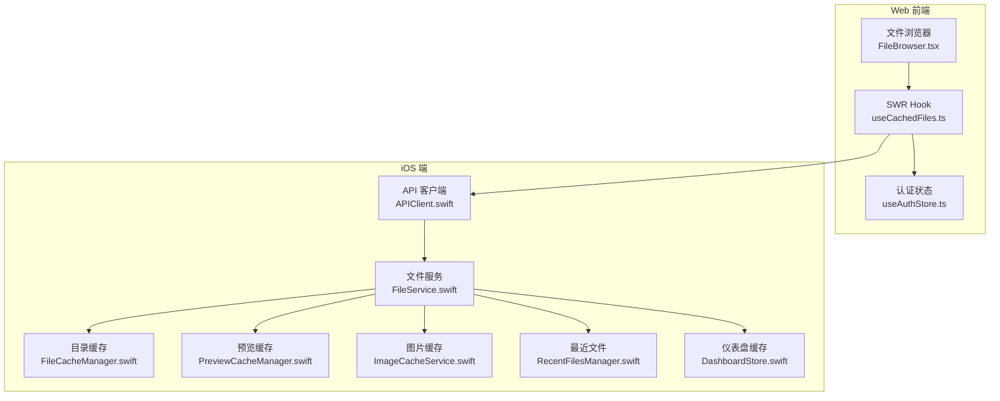
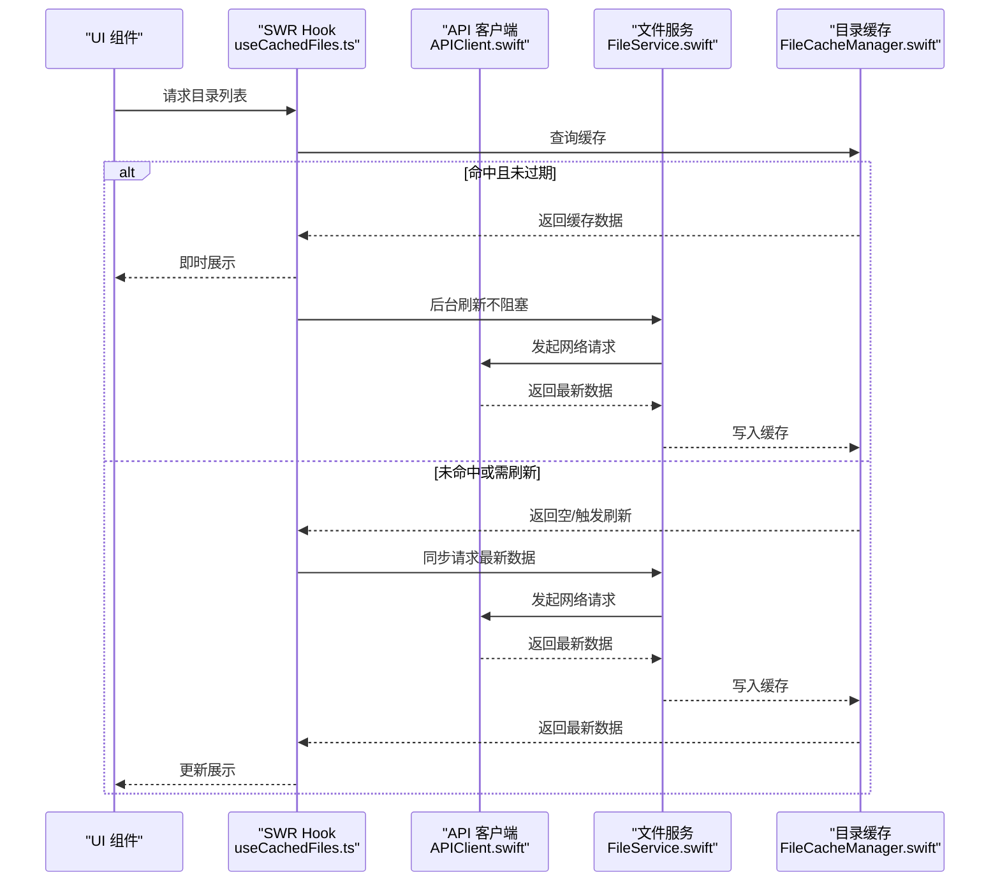
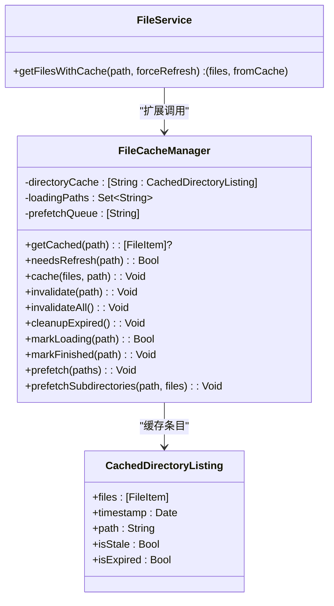
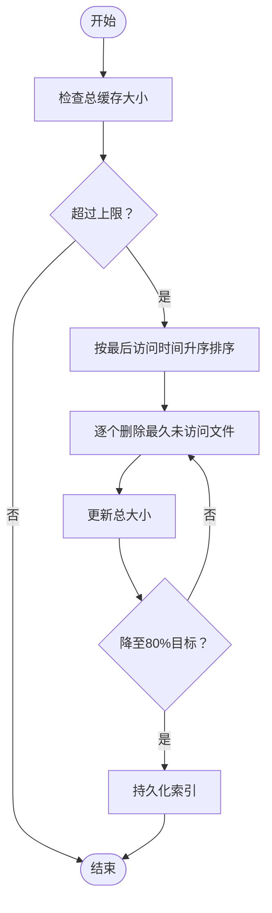
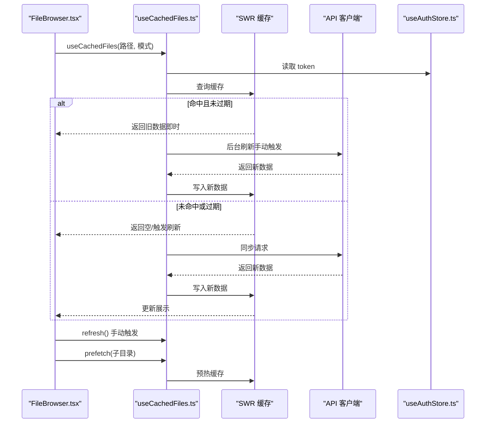
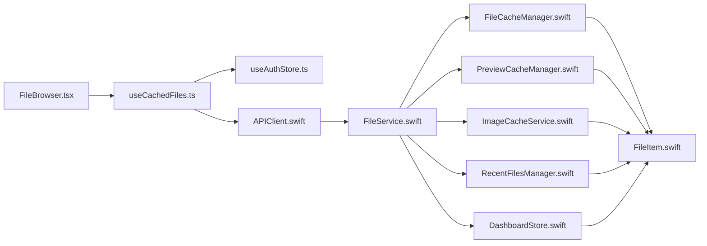

# 文件缓存策略

<cite>
**本文引用的文件**
- [FileCacheManager.swift](file://ios/LonghornApp/Services/FileCacheManager.swift)
- [FileStore.swift](file://ios/LonghornApp/Services/FileStore.swift)
- [useCachedFiles.ts](file://client/src/hooks/useCachedFiles.ts)
- [FileService.swift](file://ios/LonghornApp/Services/FileService.swift)
- [APIClient.swift](file://ios/LonghornApp/Services/APIClient.swift)
- [PreviewCacheManager.swift](file://ios/LonghornApp/Services/PreviewCacheManager.swift)
- [ImageCacheService.swift](file://ios/LonghornApp/Services/ImageCacheService.swift)
- [FileItem.swift](file://ios/LonghornApp/Models/FileItem.swift)
- [RecentFilesManager.swift](file://ios/LonghornApp/Services/RecentFilesManager.swift)
- [DashboardStore.swift](file://ios/LonghornApp/Services/DashboardStore.swift)
- [FileBrowser.tsx](file://client/src/components/FileBrowser.tsx)
- [useAuthStore.ts](file://client/src/store/useAuthStore.ts)
</cite>

## 更新摘要
**所做更改**
- 更新了 Web 前端文件浏览缓存章节，反映 `useCachedFiles` 中自动刷新配置的变更
- 修改了性能考量部分，强调手动刷新控制的优势
- 更新了故障排查指南，增加手动刷新相关的指导

## 目录
1. [简介](#简介)
2. [项目结构](#项目结构)
3. [核心组件](#核心组件)
4. [架构总览](#架构总览)
5. [详细组件分析](#详细组件分析)
6. [依赖关系分析](#依赖关系分析)
7. [性能考量](#性能考量)
8. [故障排查指南](#故障排查指南)
9. [结论](#结论)
10. [附录](#附录)

## 简介
本文件面向移动端与前端的文件缓存策略，系统性梳理多层缓存架构、缓存优先级与失效策略；详解移动端本地缓存管理、离线访问支持与缓存同步机制；阐述缓存大小控制、智能清理与存储空间优化策略；包含预加载机制、热点文件识别与缓存命中率优化；提供缓存一致性保证、冲突解决与版本管理思路；并给出缓存性能监控、统计与故障恢复机制。

## 项目结构
本项目在 iOS 与 Web 前端分别实现了文件浏览与预览的多层缓存体系：
- iOS 端采用 actor 并发安全的目录缓存与预览缓存，结合内存图片缓存与最近文件记录，实现"过期时间 + LRU"混合策略。
- Web 前端基于 SWR 的 stale-while-revalidate 模式，结合预取与去重窗口，提升交互即时性与网络效率。
- 两者均通过统一的服务层与 API 客户端进行数据获取与错误处理，确保缓存与网络的一致性。

**图表来源**
- [useCachedFiles.ts](file://client/src/hooks/useCachedFiles.ts#L40-L86)
- [FileBrowser.tsx](file://client/src/components/FileBrowser.tsx#L96-L102)
- [useAuthStore.ts](file://client/src/store/useAuthStore.ts#L17-L30)
- [FileCacheManager.swift](file://ios/LonghornApp/Services/FileCacheManager.swift#L29-L133)
- [FileService.swift](file://ios/LonghornApp/Services/FileService.swift#L11-L419)
- [APIClient.swift](file://ios/LonghornApp/Services/APIClient.swift#L38-L326)
- [PreviewCacheManager.swift](file://ios/LonghornApp/Services/PreviewCacheManager.swift#L10-L219)
- [ImageCacheService.swift](file://ios/LonghornApp/Services/ImageCacheService.swift#L10-L37)
- [RecentFilesManager.swift](file://ios/LonghornApp/Services/RecentFilesManager.swift#L34-L125)
- [DashboardStore.swift](file://ios/LonghornApp/Services/DashboardStore.swift#L12-L135)

**章节来源**
- [useCachedFiles.ts](file://client/src/hooks/useCachedFiles.ts#L40-L86)
- [FileCacheManager.swift](file://ios/LonghornApp/Services/FileCacheManager.swift#L29-L133)
- [FileService.swift](file://ios/LonghornApp/Services/FileService.swift#L11-L419)
- [APIClient.swift](file://ios/LonghornApp/Services/APIClient.swift#L38-L326)
- [PreviewCacheManager.swift](file://ios/LonghornApp/Services/PreviewCacheManager.swift#L10-L219)
- [ImageCacheService.swift](file://ios/LonghornApp/Services/ImageCacheService.swift#L10-L37)
- [RecentFilesManager.swift](file://ios/LonghornApp/Services/RecentFilesManager.swift#L34-L125)
- [DashboardStore.swift](file://ios/LonghornApp/Services/DashboardStore.swift#L12-L135)
- [FileBrowser.tsx](file://client/src/components/FileBrowser.tsx#L96-L102)
- [useAuthStore.ts](file://client/src/store/useAuthStore.ts#L17-L30)

## 核心组件
- 目录缓存与预取（iOS）：基于 actor 的并发安全缓存，实现"过期时间 + 预取"策略，支持后台刷新与子目录预取。
- 预览缓存（iOS）：基于磁盘的 LRU 缓存，按最大容量限制清理，无时间过期。
- 图片缓存（iOS）：基于内存的 LRU 缓存，限制数量与总大小。
- 文件浏览缓存（Web）：基于 SWR 的 stale-while-revalidate，支持去重窗口与轮询，提供预取能力。
- 服务层与 API 客户端（iOS/Web）：统一网络请求、错误处理与鉴权头注入。
- 最近文件与仪表盘缓存（iOS）：短期有效缓存，保障常用场景的即时响应。

**章节来源**
- [FileCacheManager.swift](file://ios/LonghornApp/Services/FileCacheManager.swift#L29-L133)
- [PreviewCacheManager.swift](file://ios/LonghornApp/Services/PreviewCacheManager.swift#L10-L219)
- [ImageCacheService.swift](file://ios/LonghornApp/Services/ImageCacheService.swift#L10-L37)
- [useCachedFiles.ts](file://client/src/hooks/useCachedFiles.ts#L40-L86)
- [FileService.swift](file://ios/LonghornApp/Services/FileService.swift#L11-L419)
- [APIClient.swift](file://ios/LonghornApp/Services/APIClient.swift#L38-L326)
- [RecentFilesManager.swift](file://ios/LonghornApp/Services/RecentFilesManager.swift#L34-L125)
- [DashboardStore.swift](file://ios/LonghornApp/Services/DashboardStore.swift#L12-L135)

## 架构总览
多层缓存策略在不同层级协同工作：
- Web 层（SWR）：UI 即时渲染 + 后台刷新，降低首屏等待。
- iOS 层（目录缓存 + 预览缓存 + 图片缓存）：并发安全 + 离线可用 + 空间可控。
- 服务层（FileService/APIClient）：统一错误处理与鉴权，保障缓存一致性。

**图表来源**
- [useCachedFiles.ts](file://client/src/hooks/useCachedFiles.ts#L40-L86)
- [FileCacheManager.swift](file://ios/LonghornApp/Services/FileCacheManager.swift#L45-L76)
- [FileService.swift](file://ios/LonghornApp/Services/FileService.swift#L18-L39)
- [APIClient.swift](file://ios/LonghornApp/Services/APIClient.swift#L69-L72)

## 详细组件分析

### iOS 目录缓存与预取（FileCacheManager）
- 结构与职责
  - 缓存结构：目录路径 → 目录列表 + 时间戳 + 路径。
  - 过期策略：分为"过期（5分钟）"与"完全过期（30分钟）"，过期即不返回。
  - 并发控制：使用 actor 保证并发安全；loadingPaths 防止重复请求。
  - 预取：支持批量预取与子目录预取（最多5个），后台静默刷新。
- 关键流程
  - 读取：先查缓存，再判断是否需要后台刷新。
  - 写入：成功获取数据后写入缓存。
  - 清理：支持按路径失效、全部失效与过期清理。
- 与服务层集成
  - 通过扩展方法将缓存与 FileService 的 getFilesWithCache 集成，实现"SWR"模式。

**图表来源**
- [FileCacheManager.swift](file://ios/LonghornApp/Services/FileCacheManager.swift#L11-L133)
- [FileService.swift](file://ios/LonghornApp/Services/FileService.swift#L137-L184)

**章节来源**
- [FileCacheManager.swift](file://ios/LonghornApp/Services/FileCacheManager.swift#L11-L133)
- [FileService.swift](file://ios/LonghornApp/Services/FileService.swift#L137-L184)

### iOS 预览缓存（PreviewCacheManager）
- 结构与职责
  - 基于磁盘的 LRU 缓存，以最大缓存大小（默认 500MB）为上限。
  - 索引持久化（index.json），启动时恢复索引并清理孤儿文件。
  - 访问时间更新与去抖保存，避免频繁磁盘写入。
- 清理策略
  - 总容量超过上限时，按 LRU（最久未访问）淘汰，降至 80% 目标。
  - 支持按路径、路径集合与目录前缀批量失效。
- 适用场景
  - 预览大文件（如 PDF、图片、视频缩略）的本地缓存，减少重复下载与解码开销。

**图表来源**
- [PreviewCacheManager.swift](file://ios/LonghornApp/Services/PreviewCacheManager.swift#L147-L166)
- [PreviewCacheManager.swift](file://ios/LonghornApp/Services/PreviewCacheManager.swift#L43-L63)

**章节来源**
- [PreviewCacheManager.swift](file://ios/LonghornApp/Services/PreviewCacheManager.swift#L10-L219)

### iOS 图片缓存（ImageCacheService）
- 结构与职责
  - 基于 NSCache 的内存缓存，限制数量与总大小，适合平滑滚动场景。
- 适用场景
  - 缩略图与预览图的快速展示，降低重复解码成本。

**章节来源**
- [ImageCacheService.swift](file://ios/LonghornApp/Services/ImageCacheService.swift#L10-L37)

### iOS 文件浏览缓存（FileStore）
- 结构与职责
  - 以路径为键的目录列表缓存，配合最后更新时间与加载状态。
  - 5 分钟有效期，避免重复请求；加载失败不清除旧缓存，保障离线可用。
  - 提供乐观更新（增删改）与失效接口，便于与操作同步。
- 与目录缓存的关系
  - FileStore 与 FileCacheManager 协同：前者负责 UI 级缓存与加载状态，后者负责后台 SWR 与预取。

**章节来源**
- [FileStore.swift](file://ios/LonghornApp/Services/FileStore.swift#L12-L139)

### Web 前端文件浏览缓存（useCachedFiles + FileBrowser）
- 结构与职责
  - 基于 SWR 的 stale-while-revalidate：返回旧数据，后台刷新新数据。
  - 去重窗口（dedupingInterval）与轮询（refreshInterval）降低网络压力。
  - 预取：通过全局 mutate 预热子目录缓存，提升导航体验。
- 与 UI 的集成
  - FileBrowser 在渲染时根据文件列表决定是否预取可见子目录，提高后续跳转速度。
- **更新** 自动刷新配置变更
  - `refreshInterval` 默认设置为 0，禁用自动刷新机制，改为完全的手动刷新控制。
  - 通过 `refresh()` 函数提供显式的手动刷新能力，确保精确的刷新时机控制。

**图表来源**
- [useCachedFiles.ts](file://client/src/hooks/useCachedFiles.ts#L40-L86)
- [FileBrowser.tsx](file://client/src/components/FileBrowser.tsx#L184-L190)
- [useAuthStore.ts](file://client/src/store/useAuthStore.ts#L17-L30)

**章节来源**
- [useCachedFiles.ts](file://client/src/hooks/useCachedFiles.ts#L40-L86)
- [FileBrowser.tsx](file://client/src/components/FileBrowser.tsx#L184-L190)
- [useAuthStore.ts](file://client/src/store/useAuthStore.ts#L17-L30)

### 服务层与 API 客户端（iOS）
- APIClient
  - 统一构建请求、注入认证头、处理 401 自动登出、解析错误响应。
  - 支持下载/上传等文件操作，自动移动到缓存目录。
- FileService
  - 封装文件列表、搜索、收藏、回收站、分享等业务接口。
  - 与缓存层协作，提供"强制刷新/后台刷新"的能力。

**章节来源**
- [APIClient.swift](file://ios/LonghornApp/Services/APIClient.swift#L38-L326)
- [FileService.swift](file://ios/LonghornApp/Services/FileService.swift#L11-L419)

### 最近文件与仪表盘缓存（iOS）
- 最近文件（RecentFilesManager）
  - 以 UserDefaults 持久化，支持时间区间过滤与迁移兼容。
- 仪表盘缓存（DashboardStore）
  - 用户/系统/部门统计数据短期缓存（5分钟），避免频繁刷新。

**章节来源**
- [RecentFilesManager.swift](file://ios/LonghornApp/Services/RecentFilesManager.swift#L34-L125)
- [DashboardStore.swift](file://ios/LonghornApp/Services/DashboardStore.swift#L12-L135)

## 依赖关系分析
- iOS 端
  - FileService 依赖 APIClient 进行网络请求；FileCacheManager 与 FileStore 作为缓存层，分别面向后台刷新与 UI 缓存。
  - 预览缓存与图片缓存独立于目录缓存，互补使用。
- Web 端
  - FileBrowser 依赖 useCachedFiles；useCachedFiles 依赖 SWR 与认证状态；通过 API 客户端访问后端。
- 数据模型
  - FileItem 作为跨端通用的数据载体，包含路径、类型、大小、时间等字段，支撑缓存键与 UI 渲染。

**图表来源**
- [FileBrowser.tsx](file://client/src/components/FileBrowser.tsx#L96-L102)
- [useCachedFiles.ts](file://client/src/hooks/useCachedFiles.ts#L40-L86)
- [useAuthStore.ts](file://client/src/store/useAuthStore.ts#L17-L30)
- [APIClient.swift](file://ios/LonghornApp/Services/APIClient.swift#L38-L326)
- [FileService.swift](file://ios/LonghornApp/Services/FileService.swift#L11-L419)
- [FileCacheManager.swift](file://ios/LonghornApp/Services/FileCacheManager.swift#L29-L133)
- [PreviewCacheManager.swift](file://ios/LonghornApp/Services/PreviewCacheManager.swift#L10-L219)
- [ImageCacheService.swift](file://ios/LonghornApp/Services/ImageCacheService.swift#L10-L37)
- [RecentFilesManager.swift](file://ios/LonghornApp/Services/RecentFilesManager.swift#L34-L125)
- [DashboardStore.swift](file://ios/LonghornApp/Services/DashboardStore.swift#L12-L135)
- [FileItem.swift](file://ios/LonghornApp/Models/FileItem.swift#L12-L40)

**章节来源**
- [FileItem.swift](file://ios/LonghornApp/Models/FileItem.swift#L12-L40)

## 性能考量
- 命中率优化
  - iOS：目录缓存 5 分钟过期，30 分钟完全过期，后台刷新不阻塞 UI；预取子目录减少二次请求。
  - Web：SWR keepPreviousData + dedupingInterval + refreshInterval（已禁用自动刷新），兼顾即时性与网络成本。
- 空间与资源控制
  - iOS 预览缓存按 500MB 上限 LRU 清理；图片缓存限制数量与内存；目录缓存按路径失效与过期清理。
  - Web：SWR 去重窗口与轮询间隔降低重复请求。
- 离线可用性
  - iOS FileStore 在加载失败时不清理旧缓存，保障离线浏览。
- 预取与热点识别
  - Web：FileBrowser 基于可见子目录进行预取；iOS：prefetchSubdirectories 选择前 N 个子目录预取。
- **更新** 手动刷新控制优势
  - 禁用自动刷新后，应用可以更精确地控制数据更新时机，避免不必要的网络请求。
  - 通过用户交互或特定事件触发刷新，提升用户体验的同时减少资源消耗。

**章节来源**
- [FileCacheManager.swift](file://ios/LonghornApp/Services/FileCacheManager.swift#L16-L133)
- [PreviewCacheManager.swift](file://ios/LonghornApp/Services/PreviewCacheManager.swift#L24-L166)
- [ImageCacheService.swift](file://ios/LonghornApp/Services/ImageCacheService.swift#L15-L19)
- [FileStore.swift](file://ios/LonghornApp/Services/FileStore.swift#L79-L84)
- [useCachedFiles.ts](file://client/src/hooks/useCachedFiles.ts#L40-L86)
- [FileBrowser.tsx](file://client/src/components/FileBrowser.tsx#L184-L190)

## 故障排查指南
- 常见问题与定位
  - 401 未授权：APIClient 在收到 401 时自动登出，需检查 token 注入与刷新逻辑。
  - 网络超时/无数据：检查请求超时配置与响应解析。
  - 预览缓存异常：检查索引文件是否存在、磁盘权限与容量上限。
  - 目录缓存未更新：确认 needsRefresh 逻辑与后台刷新任务是否执行。
  - **更新** 手动刷新问题：如果页面数据未更新，检查是否正确调用了 `refresh()` 函数。
- 恢复与清理
  - iOS：清空预览缓存、目录缓存、图片缓存；重置最近文件与仪表盘缓存。
  - Web：SWR mutate 触发重新验证；必要时清除浏览器缓存或禁用预取。

**章节来源**
- [APIClient.swift](file://ios/LonghornApp/Services/APIClient.swift#L287-L315)
- [PreviewCacheManager.swift](file://ios/LonghornApp/Services/PreviewCacheManager.swift#L43-L63)
- [FileCacheManager.swift](file://ios/LonghornApp/Services/FileCacheManager.swift#L112-L121)
- [FileStore.swift](file://ios/LonghornApp/Services/FileStore.swift#L89-L94)

## 结论
本项目的文件缓存策略在移动端与 Web 前端形成互补：iOS 侧重并发安全、离线可用与空间可控的多级缓存；Web 侧重即时渲染与网络节流的 SWR 模式。**更新后的 Web 端通过禁用自动刷新机制，采用完全的手动刷新控制，提供了更精确的缓存管理能力，减少了不必要的网络请求，同时保持了良好的用户体验。** 两者通过统一的服务层与 API 客户端保持一致的错误处理与鉴权策略，辅以预取、LRU 清理与短期缓存，整体在性能、稳定性与用户体验之间取得平衡。

## 附录
- 缓存一致性建议
  - 操作完成后主动失效相关路径缓存，确保 UI 与服务端一致。
  - 对于强一致需求，可在关键操作后强制刷新。
- 版本管理与迁移
  - iOS 预览缓存索引采用 JSON 持久化，失败时清空重建；最近文件记录支持格式迁移。
- 统计与监控
  - iOS 可扩展：记录缓存命中/未命中次数、预取成功率、清理事件；Web 可扩展：统计 SWR 命中率、去重窗口命中、轮询频率。
- **更新** 手动刷新最佳实践
  - 在用户明确触发操作（如点击刷新按钮、完成文件上传）时调用 `refresh()`。
  - 对于重要但不紧急的数据更新，考虑延迟刷新以避免频繁网络请求。
  - 结合用户行为分析，在合适的时机自动触发刷新，而非依赖固定的定时器。