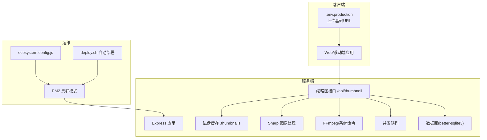
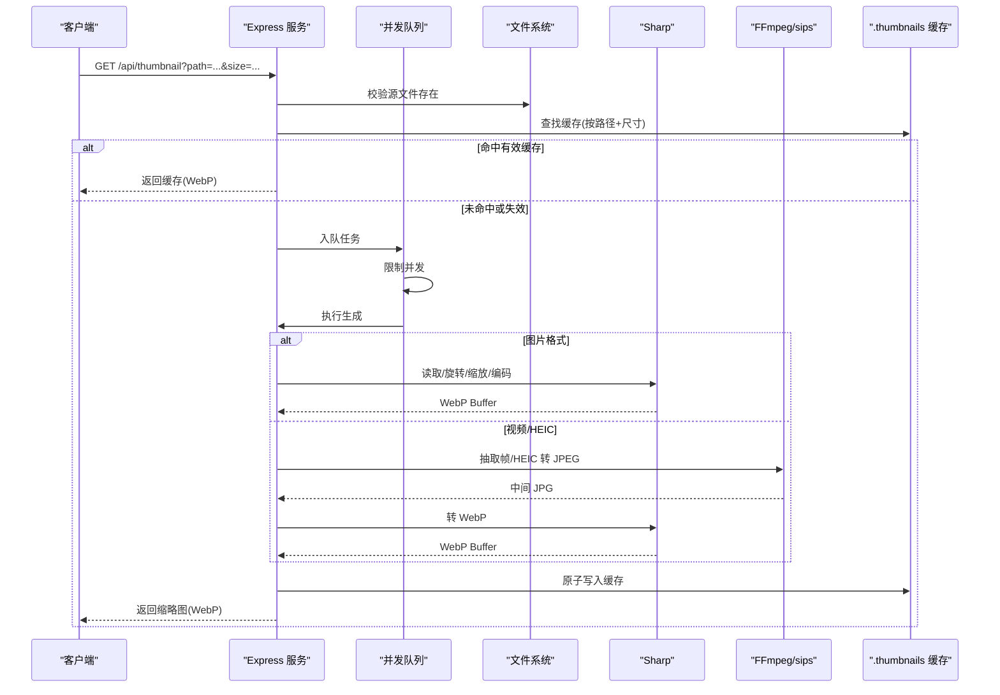
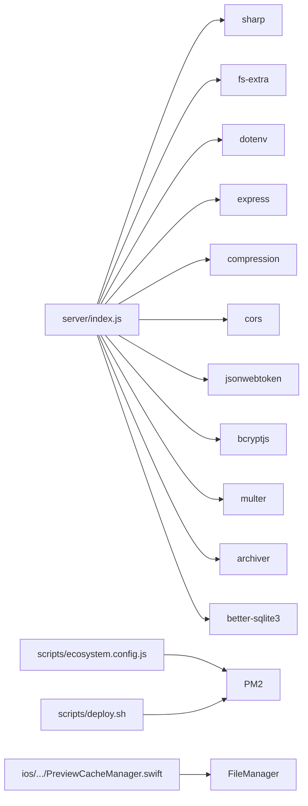
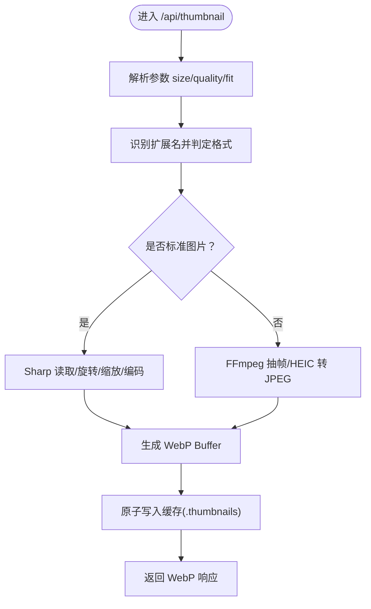
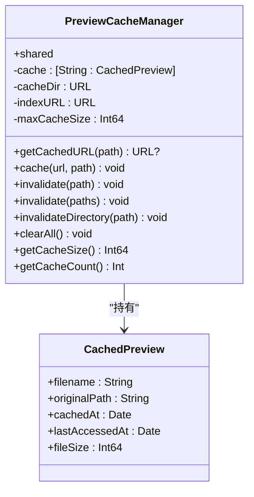

# 缩略图生成

<cite>
**本文引用的文件**
- [server/index.js](file://server/index.js)
- [server/package.json](file://server/package.json)
- [scripts/ecosystem.config.js](file://scripts/ecosystem.config.js)
- [scripts/deploy.sh](file://scripts/deploy.sh)
- [ios/LonghornApp/Services/PreviewCacheManager.swift](file://ios/LonghornApp/Services/PreviewCacheManager.swift)
- [client/.env.production](file://client/.env.production)
</cite>

## 目录
1. [简介](#简介)
2. [项目结构](#项目结构)
3. [核心组件](#核心组件)
4. [架构总览](#架构总览)
5. [组件详解](#组件详解)
6. [依赖关系分析](#依赖关系分析)
7. [性能考量](#性能考量)
8. [故障排查指南](#故障排查指南)
9. [结论](#结论)
10. [附录](#附录)

## 简介
本文件面向缩略图生成系统的技术文档，围绕基于 Sharp 的图像处理流程、HEIC/HEIF 格式支持与 FFmpeg 视频帧提取机制展开；同时覆盖缓存策略（磁盘与内存）、并发队列与资源限制、多尺寸生成算法、质量参数与格式转换优化、失效检测与自动重建、缓存清理策略，以及跨平台兼容性与性能监控指标。

## 项目结构
后端缩略图服务位于 server/index.js，采用 Express 提供 /api/thumbnail 接口；iOS 端通过 PreviewCacheManager 实现预览缓存（LRU + 大小上限），前端通过 .env.production 控制上传域名以规避代理超时问题。部署使用 PM2 集群模式，具备自动重启与内存阈值保护。

图表来源
- [server/index.js](file://server/index.js#L481-L679)
- [server/package.json](file://server/package.json#L15-L28)
- [scripts/ecosystem.config.js](file://scripts/ecosystem.config.js#L1-L41)
- [scripts/deploy.sh](file://scripts/deploy.sh#L1-L67)
- [client/.env.production](file://client/.env.production#L1-L7)

章节来源
- [server/index.js](file://server/index.js#L1-L80)
- [server/package.json](file://server/package.json#L1-L30)
- [scripts/ecosystem.config.js](file://scripts/ecosystem.config.js#L1-L41)
- [scripts/deploy.sh](file://scripts/deploy.sh#L1-L67)
- [client/.env.production](file://client/.env.production#L1-L7)

## 核心组件
- 缩略图生成接口：/api/thumbnail，支持尺寸与质量参数，自动识别格式并分流至 Sharp 或 FFmpeg。
- 缓存层：磁盘缓存 .thumbnails，按路径+尺寸命名，校验 mtime 与大小确保有效性。
- 并发队列：限制同时处理任务数量，避免 CPU/IO 过载。
- FFmpeg/HEIC 支持：视频帧提取与 HEIC 转 JPEG 再转 WebP；macOS 下优先 sips 处理 HEIC。
- iOS 预览缓存：基于 LRU 的内存索引 + 磁盘文件，最大容量 500MB，惰性持久化与去孤儿文件。
- 部署与集群：PM2 集群 + 内存阈值保护，零停机热更新。

章节来源
- [server/index.js](file://server/index.js#L481-L679)
- [ios/LonghornApp/Services/PreviewCacheManager.swift](file://ios/LonghornApp/Services/PreviewCacheManager.swift#L10-L219)
- [scripts/ecosystem.config.js](file://scripts/ecosystem.config.js#L1-L41)

## 架构总览
缩略图请求处理链路如下：

图表来源
- [server/index.js](file://server/index.js#L481-L679)

## 组件详解

### 1) 缩略图生成接口与流程
- 参数与行为
  - 查询参数：path（必填，解码后拼接 DISK_A）、size（默认 200，preview=1200）、quality（默认 75，preview=85）、fit（默认 cover，preview=inside）。
  - 支持格式：标准图片（Sharp 直接处理）、视频与 HEIC/HEIF（FFmpeg/sips 抽帧/转换）。
- 缓存策略
  - 命名规则：基于路径替换分隔符并附加尺寸，扩展名为 .webp。
  - 生效条件：缓存文件大小 > 0 且 mtime > 源文件 mtime。
  - 失效与清理：若缓存为 0 字节则删除；读取失败亦删除并回源重建。
- 生成与落盘
  - 图片：Sharp 读取 → EXIF 旋转 → 缩放到目标尺寸 → WebP 编码 → 写入缓存。
  - 视频/HEIC：先抽帧或 HEIC 转 JPEG，再由 Sharp 转 WebP；临时中间文件在完成后删除。
  - 原子写入：先写临时文件，再 rename 到最终缓存路径，避免并发读取损坏。
- 错误处理
  - FFmpeg 日志：失败时追加时间戳与 stderr 至 ffmpeg_error.log。
  - 回退：无法生成返回 404/500 JSON；Sharp 异常统一 500。

章节来源
- [server/index.js](file://server/index.js#L481-L679)

### 2) 并发队列与资源限制
- 队列实现
  - 基于数组的 FIFO 队列，内部计数 thumbProcessing 控制并发。
  - 最大并发 MAX_CONCURRENT_THUMBS 默认 2，兼顾树莓派/迷你主机等低功耗设备。
- 资源限制
  - FFmpeg 执行设置超时 60 秒，防止卡死。
  - PM2 集群模式启用，实例数为“max”，充分利用多核；设置内存阈值 500M，超限自动重启。
- CPU 使用率控制
  - 通过并发上限与进程池（cluster）降低瞬时 CPU 峰值。
  - 建议：根据硬件核数与负载动态调整 MAX_CONCURRENT_THUMBS。

章节来源
- [server/index.js](file://server/index.js#L555-L577)
- [scripts/ecosystem.config.js](file://scripts/ecosystem.config.js#L7-L22)

### 3) HEIC/HEIF 与视频帧提取
- HEIC/HEIF
  - macOS 下优先使用系统 sips 将 HEIC 转换为 JPEG，再交由 Sharp 转 WebP。
  - 其他平台使用 FFmpeg 抽帧，fallback 逻辑保证稳定性。
- 视频
  - 优先尝试在 1 秒位置抽帧，失败则回退到起始帧；统一通过滤镜保证等比缩放与裁剪居中。
- 跨平台兼容
  - 自动探测 ffmpeg 路径（Apple Silicon、Intel Mac、Linux），若未找到则回退到 PATH。
  - Content-Type 设置：对 .heic/.heif/.hevc/.mov 显式设置响应头，确保浏览器正确处理。

章节来源
- [server/index.js](file://server/index.js#L498-L611)
- [server/index.js](file://server/index.js#L397-L416)

### 4) 缓存策略与磁盘优化
- 磁盘缓存
  - 目录：THUMB_DIR（.thumbnails），按“路径+尺寸”命名，后缀 .webp。
  - 命中即直接返回，带 Cache-Control: public, max-age=604800。
  - 原子写入：先写临时文件，再 rename，避免并发竞态。
- 失效检测与自动重建
  - 依据 mtime 与 size 判断缓存有效性；异常或空文件自动删除并重新生成。
- 清理策略
  - 服务器端：缓存目录仅存放 .webp 文件，无定期清理逻辑；可通过外部脚本或运维手段清理。
  - 客户端：LRU + 最大容量 500MB，惰性保存索引，去孤儿文件，支持按路径/前缀批量失效。

章节来源
- [server/index.js](file://server/index.js#L517-L551)
- [server/index.js](file://server/index.js#L660-L668)
- [ios/LonghornApp/Services/PreviewCacheManager.swift](file://ios/LonghornApp/Services/PreviewCacheManager.swift#L10-L219)

### 5) 内存管理与并发控制
- 服务器端
  - 并发队列 + 进程池（cluster）双层限制，避免单实例内存与 CPU 波峰。
  - FFmpeg 超时与错误日志，便于定位卡顿与失败原因。
- 客户端
  - PreviewCacheManager 使用 actor 与惰性保存，减少频繁磁盘 IO；LRU 淘汰按最后访问时间排序。

章节来源
- [server/index.js](file://server/index.js#L555-L577)
- [scripts/ecosystem.config.js](file://scripts/ecosystem.config.js#L7-L22)
- [ios/LonghornApp/Services/PreviewCacheManager.swift](file://ios/LonghornApp/Services/PreviewCacheManager.swift#L10-L219)

### 6) 不同尺寸与质量参数
- 尺寸与质量
  - size：默认 200，preview=1200；fit：默认 cover，preview=inside。
  - quality：默认 75，preview=85；输出格式统一为 WebP。
- 算法细节
  - 图片：EXIF 旋转 → 缩放（居中裁剪/等比填充）→ WebP 编码。
  - 视频/HEIC：先抽帧/转换为 JPEG，再按相同流程生成 WebP。
- 质量与体积权衡
  - preview 模式提高质量与尺寸，适合详情页；普通缩略图用于列表，兼顾体积与加载速度。

章节来源
- [server/index.js](file://server/index.js#L492-L496)
- [server/index.js](file://server/index.js#L648-L657)
- [server/index.js](file://server/index.js#L628-L635)

### 7) 跨平台兼容性
- FFmpeg 路径探测：Apple Silicon、Intel Mac、Linux、PATH 四种路径逐个探测。
- HEIC 处理：macOS 优先 sips，其他平台回退 FFmpeg。
- 响应头：显式设置 HEIC/HEIF/HEVC/MOV 的 Content-Type，避免浏览器误判。
- 上传域名：.env.production 支持配置独立上传域名，绕过代理导致的大文件超时。

章节来源
- [server/index.js](file://server/index.js#L585-L598)
- [server/index.js](file://server/index.js#L604-L610)
- [server/index.js](file://server/index.js#L397-L416)
- [client/.env.production](file://client/.env.production#L1-L7)

### 8) 性能监控与指标
- 服务器端
  - PM2 配置包含内存上限、自动重启、日志轮转，便于监控与告警。
  - FFmpeg 错误日志文件 ffmpeg_error.log 记录失败原因与时间。
- 客户端
  - PreviewCacheManager 指标：当前缓存大小、条目数量；支持按路径/前缀失效与清空。
- 建议指标
  - 缩略图生成耗时分布、队列等待时长、并发数、FFmpeg 成功率、缓存命中率、内存占用、CPU 使用率。

章节来源
- [scripts/ecosystem.config.js](file://scripts/ecosystem.config.js#L21-L34)
- [server/index.js](file://server/index.js#L583-L583)
- [ios/LonghornApp/Services/PreviewCacheManager.swift](file://ios/LonghornApp/Services/PreviewCacheManager.swift#L211-L217)

## 依赖关系分析

图表来源
- [server/index.js](file://server/index.js#L1-L14)
- [server/package.json](file://server/package.json#L15-L28)
- [scripts/ecosystem.config.js](file://scripts/ecosystem.config.js#L1-L41)
- [scripts/deploy.sh](file://scripts/deploy.sh#L56-L61)

章节来源
- [server/package.json](file://server/package.json#L15-L28)
- [scripts/ecosystem.config.js](file://scripts/ecosystem.config.js#L1-L41)
- [scripts/deploy.sh](file://scripts/deploy.sh#L56-L61)

## 性能考量
- 并发与资源
  - 通过并发队列与 PM2 集群限制 CPU/内存峰值；根据硬件核数与负载调优 MAX_CONCURRENT_THUMBS。
- I/O 与磁盘
  - 原子写入缓存避免竞态；缓存目录仅存放 .webp，便于清理。
- 编码与体积
  - WebP 输出质量可调；preview 模式用于高保真展示，普通缩略图用于列表。
- 超时与健壮性
  - FFmpeg 超时 60 秒；失败记录日志；空缓存自动删除并重建。
- 上传与网络
  - .env.production 支持独立上传域名，规避代理超时问题。

章节来源
- [server/index.js](file://server/index.js#L555-L577)
- [server/index.js](file://server/index.js#L660-L668)
- [scripts/ecosystem.config.js](file://scripts/ecosystem.config.js#L21-L22)
- [client/.env.production](file://client/.env.production#L1-L7)

## 故障排查指南
- 常见问题与定位
  - FFmpeg 未安装或路径错误：检查 possibleFfmpegPaths 是否匹配；查看 ffmpeg_error.log。
  - 缓存读取失败：确认缓存文件大小与 mtime；必要时删除后自动重建。
  - HEIC 处理异常：macOS 优先 sips；非 macOS 回退 FFmpeg。
  - 上传超时：检查 VITE_UPLOAD_BASE_URL 是否指向直连域名。
- 服务器端
  - PM2 日志：error_file/out_file；内存超限自动重启。
- 客户端
  - 预览缓存失效：按路径或前缀调用 invalidate/invalidateDirectory；必要时 clearAll。

章节来源
- [server/index.js](file://server/index.js#L585-L598)
- [server/index.js](file://server/index.js#L583-L583)
- [server/index.js](file://server/index.js#L547-L550)
- [scripts/ecosystem.config.js](file://scripts/ecosystem.config.js#L31-L34)
- [client/.env.production](file://client/.env.production#L1-L7)
- [ios/LonghornApp/Services/PreviewCacheManager.swift](file://ios/LonghornApp/Services/PreviewCacheManager.swift#L168-L202)

## 结论
该缩略图系统以 Sharp 为核心，结合 FFmpeg 与系统工具（sips）实现对多格式的良好支持；通过并发队列与 PM2 集群实现资源可控与高可用；磁盘与内存双层缓存提升访问效率。建议在生产环境中持续监控队列长度、生成耗时与 FFmpeg 成功率，并根据硬件能力动态调整并发与质量参数，以获得最佳的吞吐与体验平衡。

## 附录

### A. 关键流程图：缩略图生成算法

图表来源
- [server/index.js](file://server/index.js#L481-L679)

### B. 类关系图：iOS 预览缓存管理器

图表来源
- [ios/LonghornApp/Services/PreviewCacheManager.swift](file://ios/LonghornApp/Services/PreviewCacheManager.swift#L10-L219)