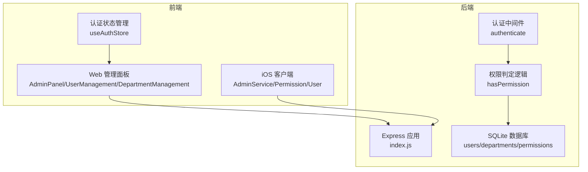
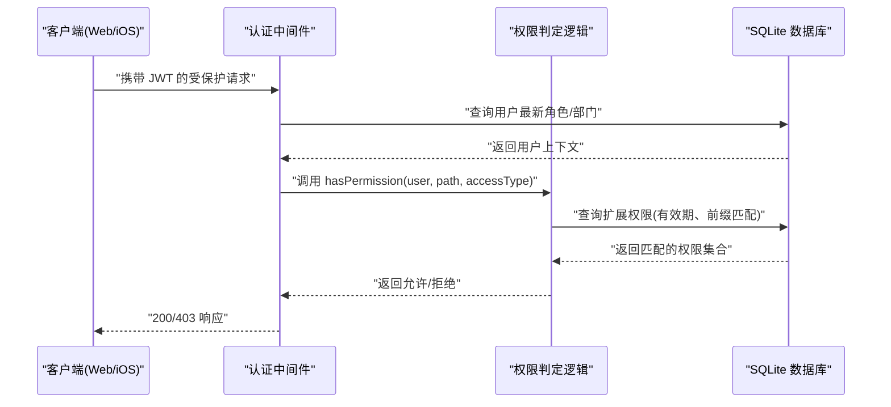
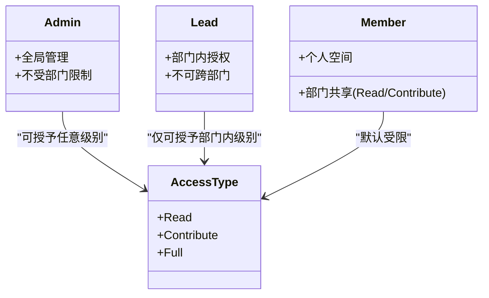
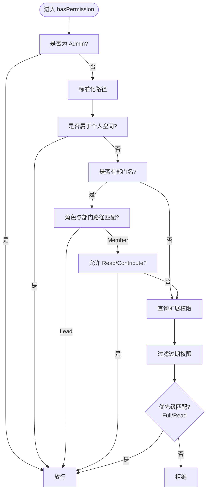
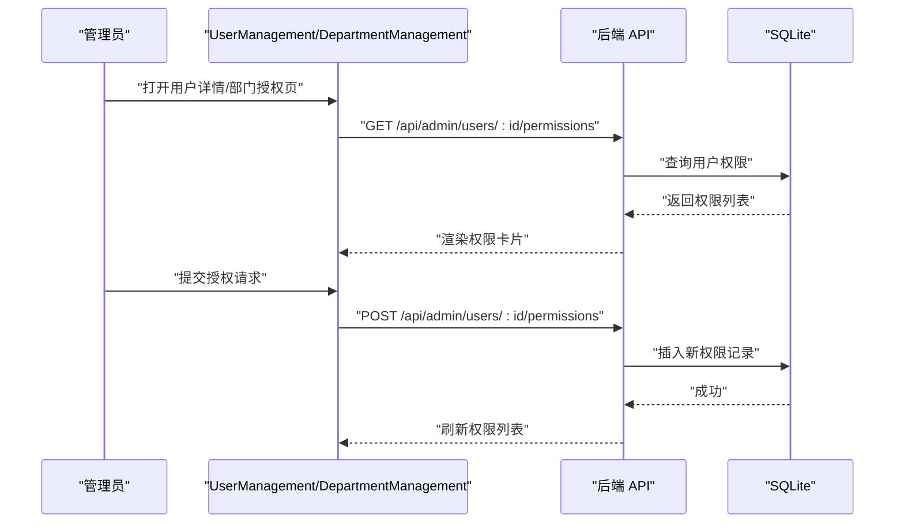
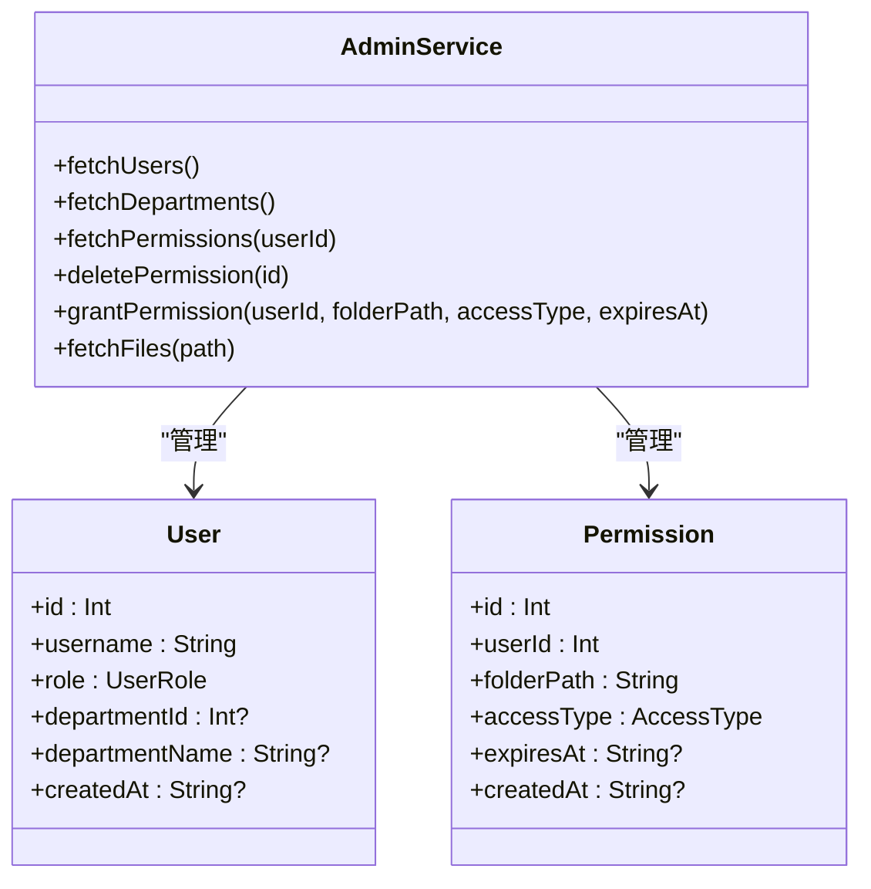
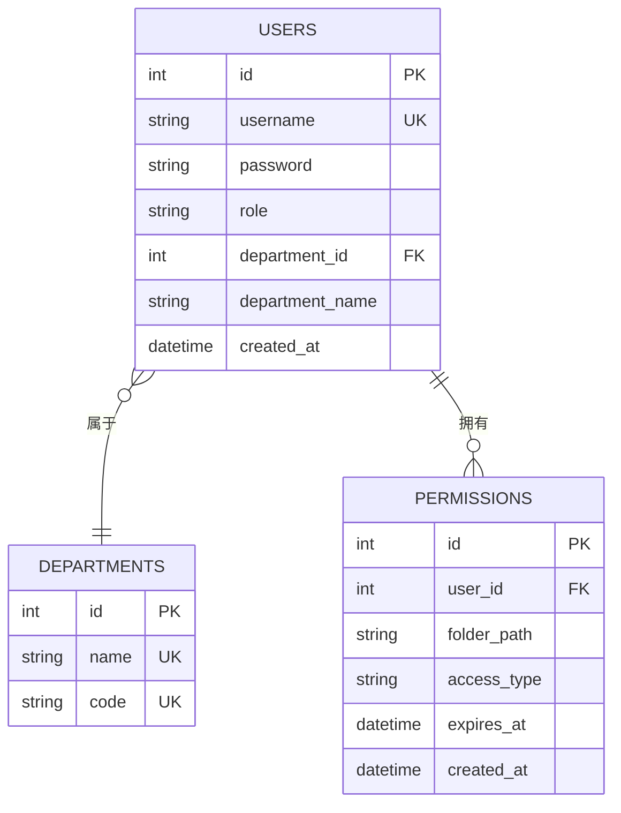
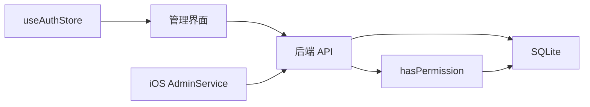

# RBAC 权限模型

<cite>
**本文档引用的文件**
- [client/src/components/AdminPanel.tsx](file://client/src/components/AdminPanel.tsx)
- [client/src/components/UserManagement.tsx](file://client/src/components/UserManagement.tsx)
- [client/src/components/DepartmentManagement.tsx](file://client/src/components/DepartmentManagement.tsx)
- [client/src/store/useAuthStore.ts](file://client/src/store/useAuthStore.ts)
- [ios/LonghornApp/Models/Permission.swift](file://ios/LonghornApp/Models/Permission.swift)
- [ios/LonghornApp/Services/AdminService.swift](file://ios/LonghornApp/Services/AdminService.swift)
- [ios/LonghornApp/Models/User.swift](file://ios/LonghornApp/Models/User.swift)
- [server/index.js](file://server/index.js)
- [server/debug_logic_test.js](file://server/debug_logic_test.js)
</cite>

## 目录
1. [简介](#简介)
2. [项目结构](#项目结构)
3. [核心组件](#核心组件)
4. [架构总览](#架构总览)
5. [详细组件分析](#详细组件分析)
6. [依赖关系分析](#依赖关系分析)
7. [性能考量](#性能考量)
8. [故障排查指南](#故障排查指南)
9. [结论](#结论)
10. [附录](#附录)

## 简介
本文件系统性梳理 Longhorn 的 RBAC（基于角色的访问控制）模型，重点覆盖 Admin、Lead、Member 三类角色的权限定义与继承关系，权限矩阵与级别划分，权限传递机制，以及在部门级、个人空间与全局范围内的权限表现。同时给出数据库存储结构、查询优化与缓存策略建议，并提供权限变更的审计与安全注意事项。

## 项目结构
Longhorn 的权限体系由前端（Web/iOS）与后端（Node.js + SQLite）协同实现：
- 前端负责用户界面、权限授予与展示、本地状态与令牌持久化
- 后端负责认证鉴权中间件、权限判定逻辑、部门与用户数据管理、权限持久化与查询
- 数据库采用 SQLite，表结构包含 users、departments、permissions 等

**图表来源**
- [client/src/components/AdminPanel.tsx](file://client/src/components/AdminPanel.tsx#L1-L66)
- [client/src/components/UserManagement.tsx](file://client/src/components/UserManagement.tsx#L1-L824)
- [client/src/components/DepartmentManagement.tsx](file://client/src/components/DepartmentManagement.tsx#L1-L430)
- [client/src/store/useAuthStore.ts](file://client/src/store/useAuthStore.ts#L1-L31)
- [ios/LonghornApp/Services/AdminService.swift](file://ios/LonghornApp/Services/AdminService.swift#L1-L155)
- [ios/LonghornApp/Models/Permission.swift](file://ios/LonghornApp/Models/Permission.swift#L1-L27)
- [ios/LonghornApp/Models/User.swift](file://ios/LonghornApp/Models/User.swift#L1-L85)
- [server/index.js](file://server/index.js#L267-L459)

**章节来源**
- [client/src/components/AdminPanel.tsx](file://client/src/components/AdminPanel.tsx#L1-L66)
- [client/src/components/UserManagement.tsx](file://client/src/components/UserManagement.tsx#L1-L824)
- [client/src/components/DepartmentManagement.tsx](file://client/src/components/DepartmentManagement.tsx#L1-L430)
- [client/src/store/useAuthStore.ts](file://client/src/store/useAuthStore.ts#L1-L31)
- [ios/LonghornApp/Services/AdminService.swift](file://ios/LonghornApp/Services/AdminService.swift#L1-L155)
- [ios/LonghornApp/Models/Permission.swift](file://ios/LonghornApp/Models/Permission.swift#L1-L27)
- [ios/LonghornApp/Models/User.swift](file://ios/LonghornApp/Models/User.swift#L1-L85)
- [server/index.js](file://server/index.js#L267-L459)

## 核心组件
- 角色与权限模型
  - 角色：Admin（超级管理员）、Lead（部门负责人）、Member（普通成员）
  - 权限级别：Read（只读）、Contribute（贡献写入）、Full（完全控制）
- 认证与授权
  - 前端通过本地存储保存用户与令牌；后端使用 JWT 中间件校验并注入用户上下文
  - 权限判定函数根据用户角色、个人空间、部门范围与扩展权限进行综合判断
- 管理界面
  - 管理员可查看/编辑用户、授予/撤销权限、管理部门
  - 部门负责人仅能对本部门范围内的目录进行授权与查看

**章节来源**
- [client/src/store/useAuthStore.ts](file://client/src/store/useAuthStore.ts#L1-L31)
- [server/index.js](file://server/index.js#L267-L459)
- [client/src/components/UserManagement.tsx](file://client/src/components/UserManagement.tsx#L1-L824)
- [client/src/components/DepartmentManagement.tsx](file://client/src/components/DepartmentManagement.tsx#L1-L430)
- [ios/LonghornApp/Models/User.swift](file://ios/LonghornApp/Models/User.swift#L1-L85)
- [ios/LonghornApp/Models/Permission.swift](file://ios/LonghornApp/Models/Permission.swift#L1-L27)

## 架构总览
Longhorn 的权限流程序如下：
- 前端发起受保护请求（携带 Bearer Token）
- 后端中间件验证 JWT 并加载用户最新角色/部门信息
- 权限判定函数按角色与路径规则计算是否允许访问
- 若未满足，检查扩展权限表（permissions），匹配前缀路径与有效期内的权限
- 返回结果或拒绝访问

**图表来源**
- [server/index.js](file://server/index.js#L267-L459)
- [server/index.js](file://server/index.js#L1015-L1079)

**章节来源**
- [server/index.js](file://server/index.js#L267-L459)
- [server/index.js](file://server/index.js#L1015-L1079)

## 详细组件分析

### 角色与权限矩阵
- 角色层级
  - Admin：全局最高权限，可管理所有用户与部门，不受部门限制
  - Lead：仅对其所在部门的目录具有授权与访问能力
  - Member：默认仅可访问个人空间与部门共享区域（Read/Contribute 级别）
- 权限级别
  - Read：只读访问
  - Contribute：贡献写入（上传/修改等受限操作）
  - Full：完全控制（删除、授权等高危操作）

**图表来源**
- [server/index.js](file://server/index.js#L299-L353)
- [ios/LonghornApp/Models/Permission.swift](file://ios/LonghornApp/Models/Permission.swift#L4-L8)

**章节来源**
- [server/index.js](file://server/index.js#L299-L353)
- [ios/LonghornApp/Models/Permission.swift](file://ios/LonghornApp/Models/Permission.swift#L4-L8)

### 权限判定流程（算法）
hasPermission 的核心逻辑：
- 超级管理员直接放行
- 个人空间路径（Members/{username}）始终放行
- 部门路径规则：
  - Lead 可访问其部门根及其子树
  - Member 可访问其部门根及其子树，且在特定条件下允许 Read/Contribute
- 扩展权限（permissions 表）：
  - 按用户 ID 查询，匹配 folder_path 或其前缀
  - 忽略过期权限，优先级 Full > Read

**图表来源**
- [server/index.js](file://server/index.js#L299-L353)

**章节来源**
- [server/index.js](file://server/index.js#L299-L353)

### 前端权限管理界面
- 管理面板（AdminPanel）
  - 提供系统概览、用户管理、部门权限与系统设置入口
- 用户管理（UserManagement）
  - 列表展示用户、部门、角色
  - 支持编辑账户信息、重置密码、授予/撤销动态权限
  - 动态权限类型：Read、Contribute、Full
- 部门管理（DepartmentManagement）
  - 授权给指定用户到目标目录，选择有效期（7 天、1 个月、永久、自定义）
  - 部门负责人仅能对本部门目录授权

**图表来源**
- [client/src/components/UserManagement.tsx](file://client/src/components/UserManagement.tsx#L190-L295)
- [client/src/components/DepartmentManagement.tsx](file://client/src/components/DepartmentManagement.tsx#L70-L82)
- [server/index.js](file://server/index.js#L1031-L1051)

**章节来源**
- [client/src/components/AdminPanel.tsx](file://client/src/components/AdminPanel.tsx#L1-L66)
- [client/src/components/UserManagement.tsx](file://client/src/components/UserManagement.tsx#L1-L824)
- [client/src/components/DepartmentManagement.tsx](file://client/src/components/DepartmentManagement.tsx#L1-L430)
- [server/index.js](file://server/index.js#L1031-L1051)

### iOS 端权限模型与服务
- 权限模型（Permission）
  - 字段：id、userId、folderPath、accessType、expiresAt、createdAt
  - accessType 对应 Read/Contribute/Full
- 用户模型（User）
  - 字段：id、username、role、departmentId、departmentName、createdAt
  - role 枚举：Admin、Lead、Member
- 管理服务（AdminService）
  - 提供获取用户、部门、权限、删除权限、授予权限、文件浏览等接口封装

**图表来源**
- [ios/LonghornApp/Models/Permission.swift](file://ios/LonghornApp/Models/Permission.swift#L1-L27)
- [ios/LonghornApp/Models/User.swift](file://ios/LonghornApp/Models/User.swift#L1-L85)
- [ios/LonghornApp/Services/AdminService.swift](file://ios/LonghornApp/Services/AdminService.swift#L1-L155)

**章节来源**
- [ios/LonghornApp/Models/Permission.swift](file://ios/LonghornApp/Models/Permission.swift#L1-L27)
- [ios/LonghornApp/Models/User.swift](file://ios/LonghornApp/Models/User.swift#L1-L85)
- [ios/LonghornApp/Services/AdminService.swift](file://ios/LonghornApp/Services/AdminService.swift#L1-L155)

### 数据库存储结构
- users：用户基本信息、角色、所属部门
- departments：部门名称与代码映射
- permissions：用户对目录的细粒度权限、有效期

**图表来源**
- [server/index.js](file://server/index.js#L34-L78)

**章节来源**
- [server/index.js](file://server/index.js#L34-L78)

### 权限传递与继承机制
- 继承关系
  - Admin > Lead > Member：角色越高，权限越大
- 传递路径
  - 个人空间：Members/{username} 自动放行
  - 部门路径：Lead 可访问部门根及子树；Member 在 Read/Contribute 下可访问部门共享区域
  - 扩展权限：permissions 表提供细粒度授权，支持前缀匹配与有效期控制

**章节来源**
- [server/index.js](file://server/index.js#L299-L353)

### 不同部门中的权限表现
- 运营部（OP）
  - Lead 可授权 OP 根目录及子目录
  - Member 默认可访问 OP 根及子树（Read/Contribute）
- 市场部（MS）
  - Lead 可授权 MS 根目录及子目录
  - Member 默认可访问 MS 根及子树（Read/Contribute）
- 研发部（RD）
  - Lead 可授权 RD 根目录及子目录
  - Member 默认可访问 RD 根及子树（Read/Contribute）
- 通用台面（RE）
  - Lead 可授权 RE 根目录及子目录
  - Member 默认可访问 RE 根及子树（Read/Contribute）
- 个人空间（MEMBERS）
  - 任一成员均可访问自身空间（Members/{username}）

**章节来源**
- [server/index.js](file://server/index.js#L114-L122)
- [server/index.js](file://server/index.js#L299-L353)

### 查询优化与缓存策略
- 查询优化
  - permissions 表按 user_id、folder_path 建索引，提升前缀匹配效率
  - hasPermission 中先做角色与路径快速判断，减少数据库查询
- 缓存策略
  - 前端：对用户列表、部门列表、权限列表进行短期缓存，减少重复请求
  - 后端：对常用路径解析与权限判定结果进行内存缓存（需注意并发与失效策略）

[本节为通用优化建议，不直接分析具体文件，故无“章节来源”]

### 审计日志与安全考虑
- 审计日志
  - 建议记录权限变更事件：授权/撤销、角色变更、登录登出
  - 记录字段：操作人、目标用户、操作类型、目标路径、生效时间、过期时间、结果
- 安全考虑
  - 严格区分 Admin/Lead/Member 的操作边界
  - Lead 仅能对本部门目录授权，防止越权
  - 密码更新与令牌刷新需配合强口令策略与短有效期
  - 对外暴露的 API 需启用 CORS 与速率限制

[本节为通用安全建议，不直接分析具体文件，故无“章节来源”]

## 依赖关系分析
- 前端依赖后端提供的管理接口与文件浏览接口
- 后端依赖 SQLite 存储用户、部门与权限数据
- 权限判定依赖用户角色、部门名称与扩展权限表

**图表来源**
- [client/src/store/useAuthStore.ts](file://client/src/store/useAuthStore.ts#L1-L31)
- [client/src/components/UserManagement.tsx](file://client/src/components/UserManagement.tsx#L1-L824)
- [ios/LonghornApp/Services/AdminService.swift](file://ios/LonghornApp/Services/AdminService.swift#L1-L155)
- [server/index.js](file://server/index.js#L267-L459)

**章节来源**
- [client/src/store/useAuthStore.ts](file://client/src/store/useAuthStore.ts#L1-L31)
- [client/src/components/UserManagement.tsx](file://client/src/components/UserManagement.tsx#L1-L824)
- [ios/LonghornApp/Services/AdminService.swift](file://ios/LonghornApp/Services/AdminService.swift#L1-L155)
- [server/index.js](file://server/index.js#L267-L459)

## 性能考量
- 数据库层面
  - 为 permissions.user_id、permissions.folder_path 建立复合索引，加速前缀匹配
  - 定期清理过期权限，保持表规模可控
- 服务层面
  - 对高频路径解析与权限判定结果进行缓存
  - 合理设置 JWT 过期时间，平衡安全性与性能
- 前端层面
  - 对用户列表、部门列表与权限列表进行本地缓存，减少网络请求
  - 分页与懒加载策略用于大列表场景

[本节为通用性能建议，不直接分析具体文件，故无“章节来源”]

## 故障排查指南
- 常见问题
  - Lead 无法授权：确认 folder_path 是否以部门名开头
  - Member 无法访问：检查是否在部门共享范围内或是否存在扩展权限
  - 权限未生效：确认权限未过期、路径大小写与斜杠规范化
- 排查步骤
  - 使用调试脚本验证路径解析与权限判定
  - 检查 permissions 表中对应用户的记录
  - 核对用户角色与部门信息是否正确

**章节来源**
- [server/debug_logic_test.js](file://server/debug_logic_test.js#L1-L81)
- [server/index.js](file://server/index.js#L299-L353)

## 结论
Longhorn 的 RBAC 模型以角色为基础、以路径为边界、以扩展权限为补充，形成了清晰的权限继承与传递机制。通过严格的前端管理界面与后端权限判定逻辑，实现了 Admin 全局管控、Lead 部门自治与 Member 限定访问的分层权限体系。结合数据库索引、缓存与审计日志，可在保证安全性的前提下提升系统性能与可观测性。

## 附录
- 路径解析与权限判定测试脚本可用于验证逻辑正确性与边界条件

**章节来源**
- [server/debug_logic_test.js](file://server/debug_logic_test.js#L1-L81)