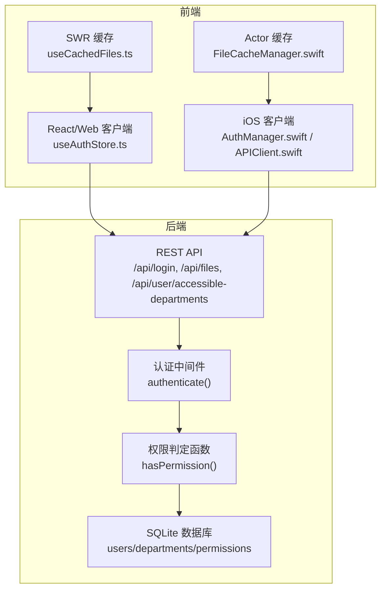
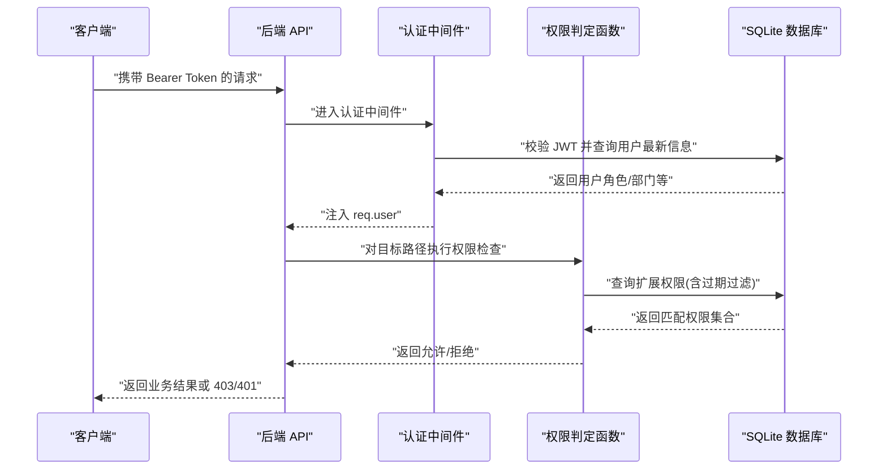
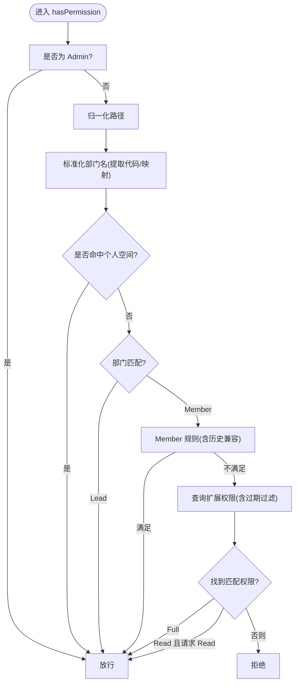
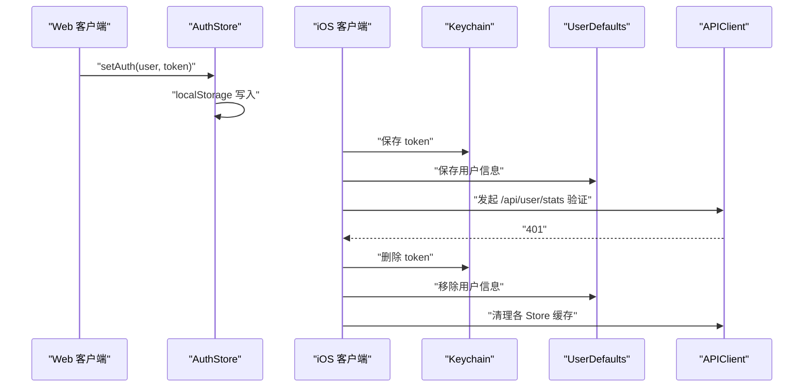
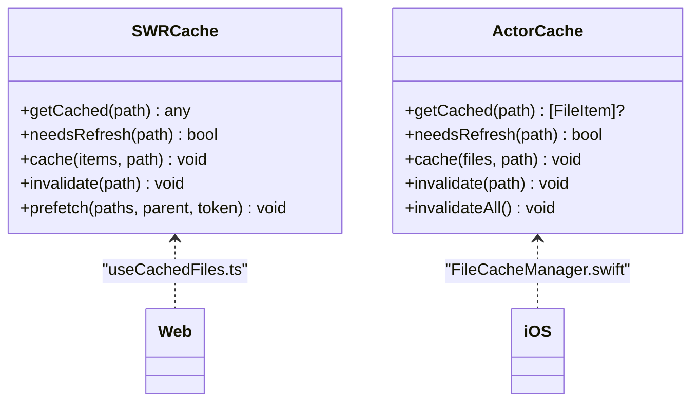
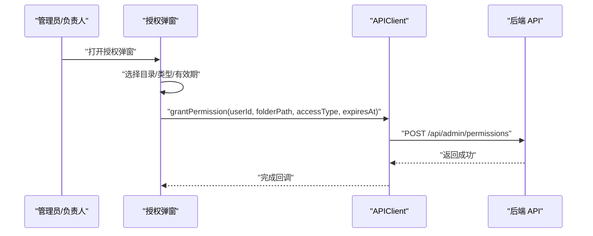
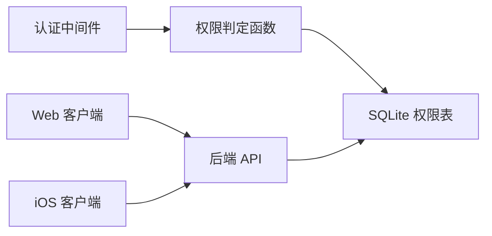

# 动态权限验证

<cite>
**本文引用的文件**
- [server/index.js](file://server/index.js)
- [client/src/store/useAuthStore.ts](file://client/src/store/useAuthStore.ts)
- [ios/LonghornApp/Services/AuthManager.swift](file://ios/LonghornApp/Services/AuthManager.swift)
- [ios/LonghornApp/Services/APIClient.swift](file://ios/LonghornApp/Services/APIClient.swift)
- [ios/LonghornApp/Models/Permission.swift](file://ios/LonghornApp/Models/Permission.swift)
- [client/src/hooks/useCachedFiles.ts](file://client/src/hooks/useCachedFiles.ts)
- [ios/LonghornApp/Services/FileCacheManager.swift](file://ios/LonghornApp/Services/FileCacheManager.swift)
- [ios/LonghornApp/GrantPermissionSheet.swift](file://ios/LonghornApp/GrantPermissionSheet.swift)
- [server/debug_logic_test.js](file://server/debug_logic_test.js)
- [docs/CONTRIBUTE_PERMISSION_IMPLEMENTATION.md](file://docs/CONTRIBUTE_PERMISSION_IMPLEMENTATION.md)
</cite>

## 目录
1. [简介](#简介)
2. [项目结构](#项目结构)
3. [核心组件](#核心组件)
4. [架构总览](#架构总览)
5. [详细组件分析](#详细组件分析)
6. [依赖关系分析](#依赖关系分析)
7. [性能考量](#性能考量)
8. [故障排查指南](#故障排查指南)
9. [结论](#结论)
10. [附录](#附录)

## 简介
本技术文档围绕 Longhorn 的动态权限验证机制展开，系统性阐述实时权限检查算法、权限缓存策略与性能优化手段；重点解析 hasPermission 函数的实现原理（用户角色判断、部门权限计算、扩展权限查询）；说明数据库查询优化、索引使用与批量验证机制；给出前后端缓存策略与缓存一致性保障方案；并提供权限验证失败的处理流程、错误日志记录与调试工具。

## 项目结构
Longhorn 采用前后端分离架构：
- 前端（Web/iOS）负责用户交互、本地缓存与请求封装；
- 后端（Node.js + better-sqlite3）提供认证中间件、权限判定逻辑与文件服务。

图表来源
- [server/index.js](file://server/index.js#L267-L295)
- [server/index.js](file://server/index.js#L300-L353)
- [client/src/store/useAuthStore.ts](file://client/src/store/useAuthStore.ts#L1-L31)
- [ios/LonghornApp/Services/AuthManager.swift](file://ios/LonghornApp/Services/AuthManager.swift#L1-L195)
- [ios/LonghornApp/Services/APIClient.swift](file://ios/LonghornApp/Services/APIClient.swift#L1-L326)
- [client/src/hooks/useCachedFiles.ts](file://client/src/hooks/useCachedFiles.ts#L1-L101)
- [ios/LonghornApp/Services/FileCacheManager.swift](file://ios/LonghornApp/Services/FileCacheManager.swift#L1-L74)

章节来源
- [server/index.js](file://server/index.js#L267-L295)
- [server/index.js](file://server/index.js#L300-L353)
- [client/src/store/useAuthStore.ts](file://client/src/store/useAuthStore.ts#L1-L31)
- [ios/LonghornApp/Services/AuthManager.swift](file://ios/LonghornApp/Services/AuthManager.swift#L1-L195)
- [ios/LonghornApp/Services/APIClient.swift](file://ios/LonghornApp/Services/APIClient.swift#L1-L326)
- [client/src/hooks/useCachedFiles.ts](file://client/src/hooks/useCachedFiles.ts#L1-L101)
- [ios/LonghornApp/Services/FileCacheManager.swift](file://ios/LonghornApp/Services/FileCacheManager.swift#L1-L74)

## 核心组件
- 认证中间件：校验 JWT 并从数据库加载最新用户信息，注入到请求上下文。
- 权限判定函数：根据用户角色、部门归属与扩展权限，实时判断路径访问能力。
- 前端缓存层：Web 使用 SWR，iOS 使用 Actor 缓存，均采用“过期即刷新”的策略。
- 管理端授权界面：提供授权类型与有效期配置，调用后端接口写入权限表。

章节来源
- [server/index.js](file://server/index.js#L267-L295)
- [server/index.js](file://server/index.js#L300-L353)
- [client/src/hooks/useCachedFiles.ts](file://client/src/hooks/useCachedFiles.ts#L1-L101)
- [ios/LonghornApp/Services/FileCacheManager.swift](file://ios/LonghornApp/Services/FileCacheManager.swift#L1-L74)
- [ios/LonghornApp/GrantPermissionSheet.swift](file://ios/LonghornApp/GrantPermissionSheet.swift#L1-L173)

## 架构总览
权限验证的关键流程如下：

图表来源
- [server/index.js](file://server/index.js#L267-L295)
- [server/index.js](file://server/index.js#L300-L353)
- [server/index.js](file://server/index.js#L715-L756)

章节来源
- [server/index.js](file://server/index.js#L267-L295)
- [server/index.js](file://server/index.js#L300-L353)
- [server/index.js](file://server/index.js#L715-L756)

## 详细组件分析

### hasPermission 实现原理
- 用户角色优先级：Admin 直接放行；非 Admin 则进入路径与部门规则。
- 路径归一化：统一斜杠方向与去除多余分隔符，避免大小写与格式差异导致的误判。
- 部门名称标准化：支持“中文名称 (代码)”与“中文名称”两种存储形式，统一转为代码以便比较。
- 个人空间豁免：若路径命中 members/{username} 或其子路径，则直接放行。
- 部门权限：Lead 对本部门路径拥有完全权限；Member 对本部门路径通常仅读取或贡献权限，存在历史兼容路径时亦可放行。
- 扩展权限：查询 permissions 表，匹配 folder_path 等于或为父路径前缀；同时过滤过期权限；按权限类型进行降序匹配，遇到 Full 则放行，Read 只对 Read 放行。
- 返回值：任一条件满足即返回允许，否则拒绝。

图表来源
- [server/index.js](file://server/index.js#L300-L353)
- [server/debug_logic_test.js](file://server/debug_logic_test.js#L29-L58)

章节来源
- [server/index.js](file://server/index.js#L300-L353)
- [server/debug_logic_test.js](file://server/debug_logic_test.js#L1-L81)

### 认证与会话管理
- Web：使用 zustand 存储用户与 token，并持久化到 localStorage；登录成功后写入本地存储并更新状态。
- iOS：使用 Keychain 存储 token，UserDefaults 存储用户信息；启动时尝试恢复会话并异步验证有效性；401 时触发登出清理缓存。

图表来源
- [client/src/store/useAuthStore.ts](file://client/src/store/useAuthStore.ts#L1-L31)
- [ios/LonghornApp/Services/AuthManager.swift](file://ios/LonghornApp/Services/AuthManager.swift#L1-L195)
- [ios/LonghornApp/Services/APIClient.swift](file://ios/LonghornApp/Services/APIClient.swift#L1-L326)

章节来源
- [client/src/store/useAuthStore.ts](file://client/src/store/useAuthStore.ts#L1-L31)
- [ios/LonghornApp/Services/AuthManager.swift](file://ios/LonghornApp/Services/AuthManager.swift#L1-L195)
- [ios/LonghornApp/Services/APIClient.swift](file://ios/LonghornApp/Services/APIClient.swift#L1-L326)

### 前端缓存策略
- Web（React/SWR）：对目录列表进行缓存，支持去重、前台/重连再验证、轮询刷新；预取接口可提前填充缓存。
- iOS（Swift/Actor）：目录列表缓存采用“过期即刷新”策略，区分新鲜与完全过期；提供预取队列与并发控制，避免重复请求。

图表来源
- [client/src/hooks/useCachedFiles.ts](file://client/src/hooks/useCachedFiles.ts#L1-L101)
- [ios/LonghornApp/Services/FileCacheManager.swift](file://ios/LonghornApp/Services/FileCacheManager.swift#L1-L74)

章节来源
- [client/src/hooks/useCachedFiles.ts](file://client/src/hooks/useCachedFiles.ts#L1-L101)
- [ios/LonghornApp/Services/FileCacheManager.swift](file://ios/LonghornApp/Services/FileCacheManager.swift#L1-L74)

### 授权管理与扩展权限
- 授权类型：Read、Contribute、Full；分别对应只读、可上传、完全权限。
- 有效期：支持固定天数、月、永久与自定义日期；到期自动失效。
- 管理端接口：管理员与部门负责人可查看与删除指定用户的权限条目；支持按用户查询权限列表。

图表来源
- [ios/LonghornApp/GrantPermissionSheet.swift](file://ios/LonghornApp/GrantPermissionSheet.swift#L1-L173)
- [ios/LonghornApp/Services/APIClient.swift](file://ios/LonghornApp/Services/APIClient.swift#L1-L326)
- [server/index.js](file://server/index.js#L1015-L1064)

章节来源
- [ios/LonghornApp/GrantPermissionSheet.swift](file://ios/LonghornApp/GrantPermissionSheet.swift#L1-L173)
- [ios/LonghornApp/Services/APIClient.swift](file://ios/LonghornApp/Services/APIClient.swift#L1-L326)
- [server/index.js](file://server/index.js#L1015-L1064)

## 依赖关系分析
- 认证中间件依赖 JWT 解密与数据库用户查询，确保角色与部门信息最新。
- 权限判定函数依赖部门映射表、路径解析与权限表；权限表需维护 folder_path、access_type、expires_at 字段。
- 前端缓存与后端 API 紧密耦合：缓存命中率取决于 API 的 ETag/Last-Modified 与路径规范化程度。

图表来源
- [server/index.js](file://server/index.js#L267-L295)
- [server/index.js](file://server/index.js#L300-L353)
- [server/index.js](file://server/index.js#L715-L756)

章节来源
- [server/index.js](file://server/index.js#L267-L295)
- [server/index.js](file://server/index.js#L300-L353)
- [server/index.js](file://server/index.js#L715-L756)

## 性能考量
- 权限判定复杂度：hasPermission 主要为字符串匹配与一次权限表扫描；可通过以下方式优化：
  - 为 permissions.user_id、permissions.folder_path 建立复合索引，加速 LIKE 前缀匹配与按用户筛选。
  - 将 folder_path 统一为大写/小写并去除多余分隔符，减少归一化成本。
  - 对频繁访问的路径建立内存缓存（短期有效），降低数据库查询频率。
- 前端缓存：
  - Web：利用 ETag/Last-Modified 与短周期轮询，结合 SWR 的去重与静默刷新，显著降低网络与后端压力。
  - iOS：Actor 缓存避免并发重复请求，过期策略平衡新鲜度与性能。
- 批量验证：在需要批量判断权限时，建议合并请求或使用后端提供的批量接口（若存在），减少往返次数。
- 日志与诊断：后端提供调试端点输出当前用户、路径解析与权限检查结果，便于定位问题。

章节来源
- [server/index.js](file://server/index.js#L758-L790)
- [client/src/hooks/useCachedFiles.ts](file://client/src/hooks/useCachedFiles.ts#L1-L101)
- [ios/LonghornApp/Services/FileCacheManager.swift](file://ios/LonghornApp/Services/FileCacheManager.swift#L1-L74)

## 故障排查指南
- 401/403 常见原因：
  - Token 无效或过期：iOS 会在验证失败时自动登出并清理缓存；Web 登录后应正确写入 localStorage。
  - 权限不足：确认用户角色与部门归属；检查 permissions 表是否存在有效授权且未过期。
  - 路径解析差异：前端与后端对中文部门名与大小写的处理需一致，避免路径不匹配。
- 错误日志与调试：
  - 后端全局日志记录每个 HTTP 请求；调试端点输出当前用户、路径解析与权限检查结果。
  - iOS 在登录失败、Token 验证失败、API 错误时打印详细日志并抛出本地化错误描述。
  - Web 在登录失败时显示错误提示，避免静默失败。
- 缓存一致性：
  - 登出或权限变更后，需主动清理前端缓存；iOS 提供了清理各 Store 缓存的方法。
  - 对于目录列表缓存，建议在权限变更后调用失效接口或等待过期刷新。

章节来源
- [ios/LonghornApp/Services/AuthManager.swift](file://ios/LonghornApp/Services/AuthManager.swift#L1-L195)
- [ios/LonghornApp/Services/APIClient.swift](file://ios/LonghornApp/Services/APIClient.swift#L1-L326)
- [server/index.js](file://server/index.js#L422-L427)
- [server/index.js](file://server/index.js#L758-L790)
- [client/src/components/Login.tsx](file://client/src/components/Login.tsx#L1-L161)

## 结论
Longhorn 的动态权限验证以“角色优先 + 部门匹配 + 扩展权限表”的组合模型实现，具备良好的可扩展性与可维护性。通过前后端缓存策略与数据库索引优化，可在保证安全的前提下提升用户体验与系统性能。建议持续完善权限表索引、路径规范化与缓存一致性机制，并在权限变更后及时清理缓存，确保系统稳定运行。

## 附录
- 权限类型与边界说明参见产品文档中的流程图与数据库依赖章节。
- 授权弹窗支持多种有效期选项，便于精细化授权管理。

章节来源
- [docs/CONTRIBUTE_PERMISSION_IMPLEMENTATION.md](file://docs/CONTRIBUTE_PERMISSION_IMPLEMENTATION.md#L92-L192)
- [ios/LonghornApp/GrantPermissionSheet.swift](file://ios/LonghornApp/GrantPermissionSheet.swift#L1-L173)