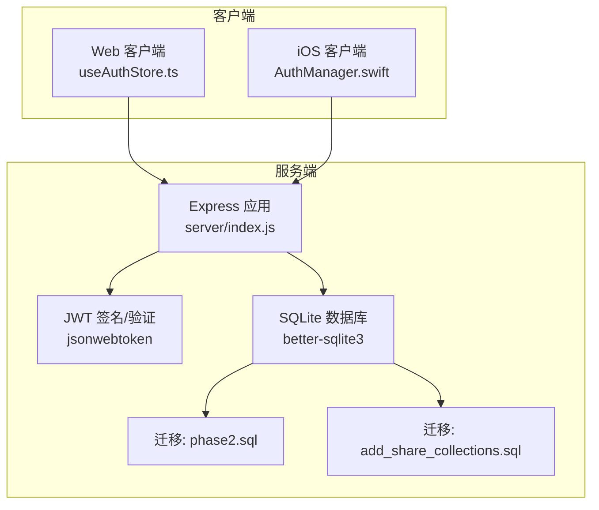
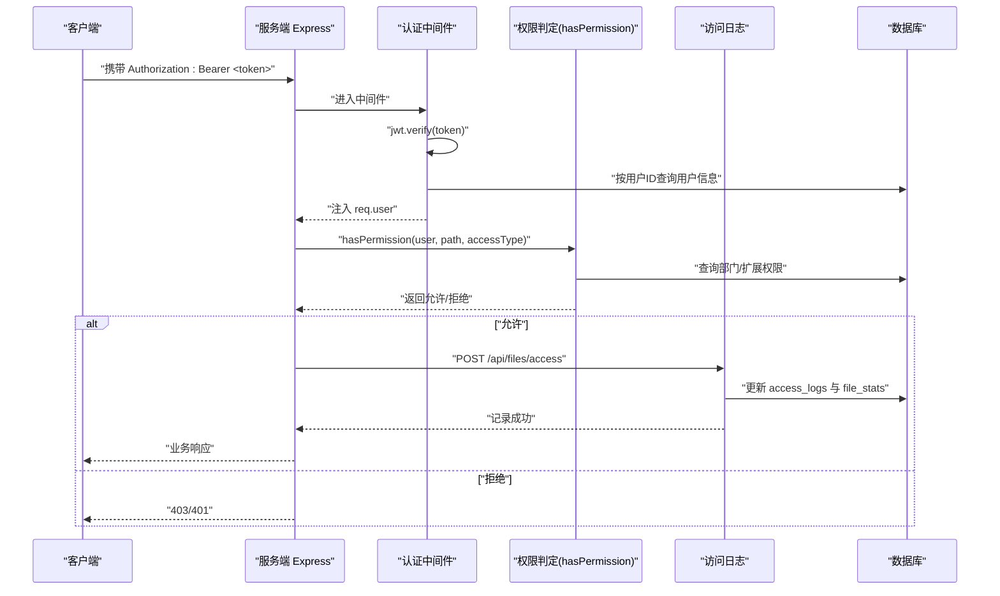
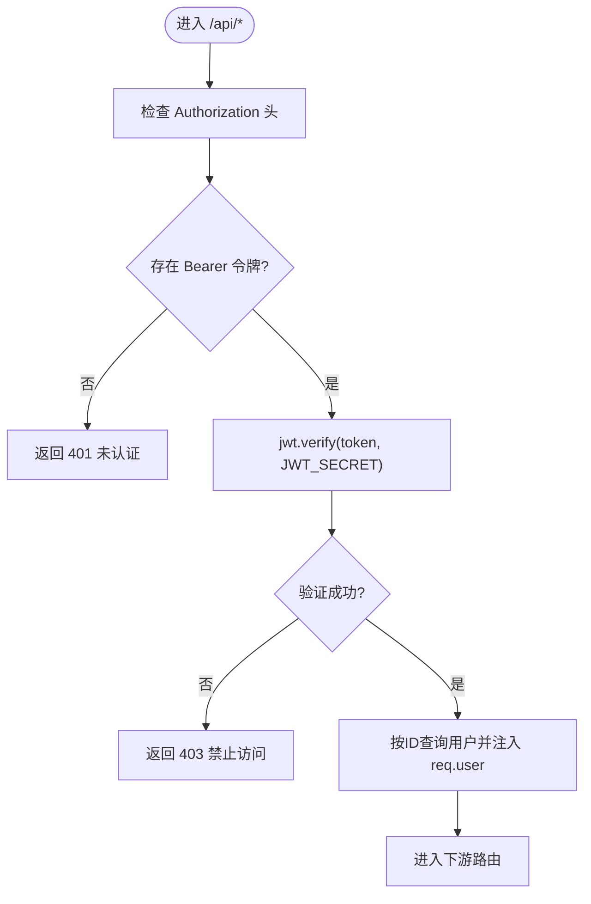
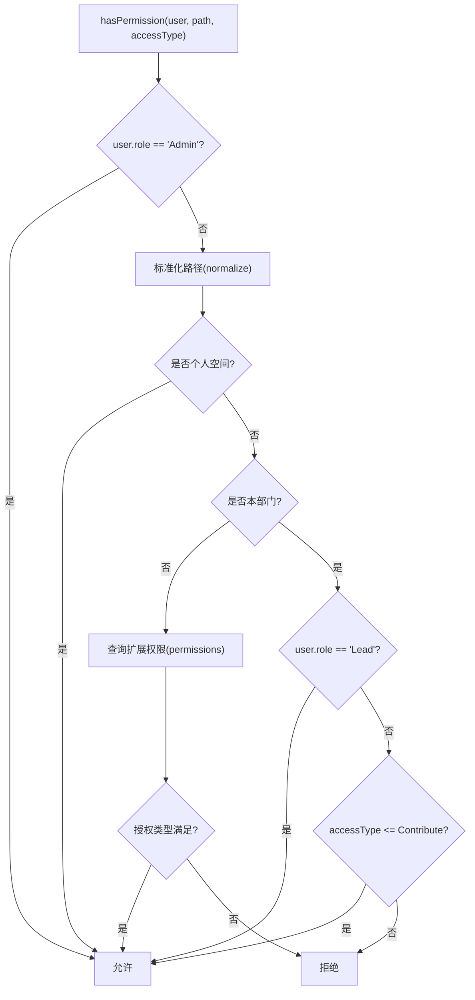
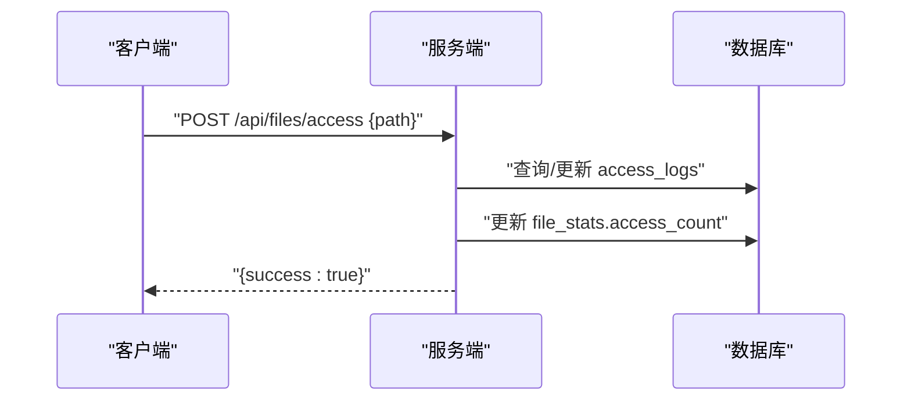
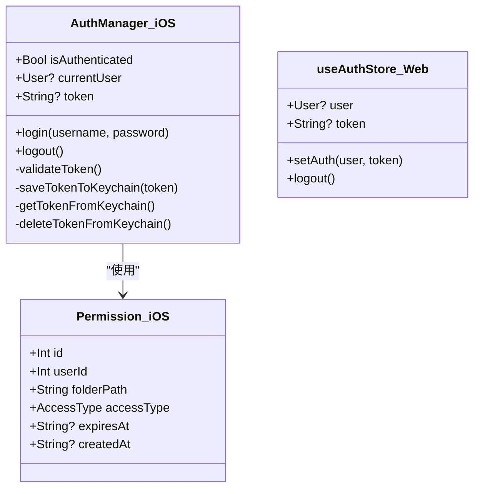
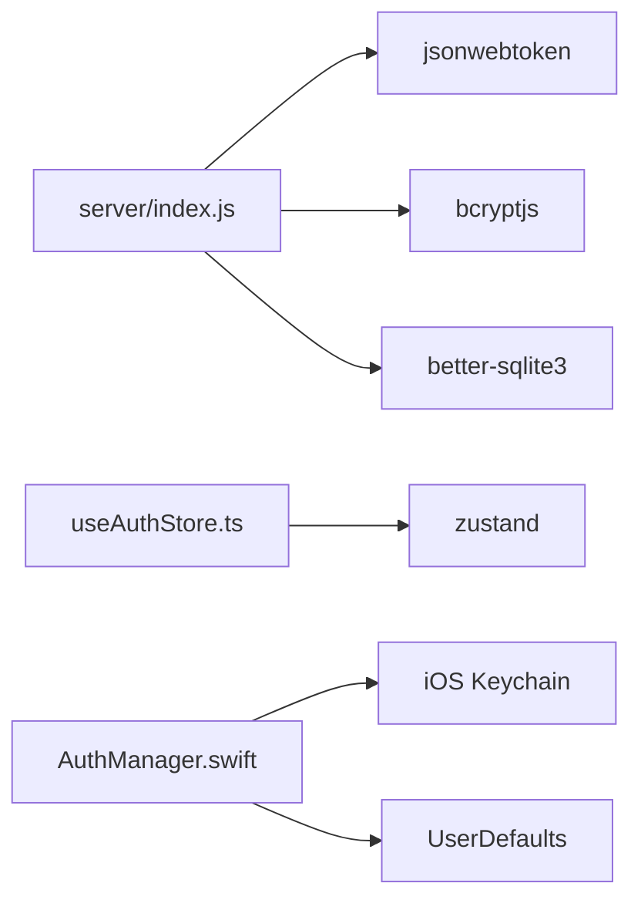
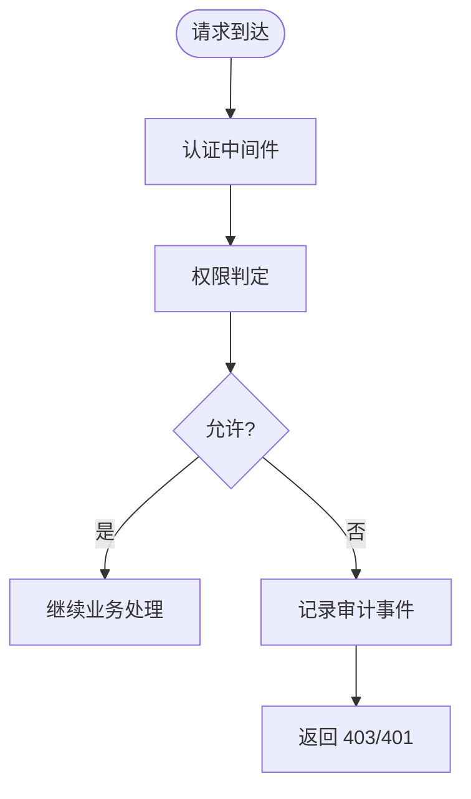

# 权限审计与安全

<cite>
**本文引用的文件**
- [server/index.js](file://server/index.js)
- [server/package.json](file://server/package.json)
- [server/migrations/phase2.sql](file://server/migrations/phase2.sql)
- [server/migrations/add_share_collections.sql](file://server/migrations/add_share_collections.sql)
- [ios/LonghornApp/Services/AuthManager.swift](file://ios/LonghornApp/Services/AuthManager.swift)
- [ios/LonghornApp/Models/Permission.swift](file://ios/LonghornApp/Models/Permission.swift)
- [client/src/store/useAuthStore.ts](file://client/src/store/useAuthStore.ts)
- [docs/CONTRIBUTE_PERMISSION_IMPLEMENTATION.md](file://docs/CONTRIBUTE_PERMISSION_IMPLEMENTATION.md)
</cite>

## 目录
1. [简介](#简介)
2. [项目结构](#项目结构)
3. [核心组件](#核心组件)
4. [架构总览](#架构总览)
5. [详细组件分析](#详细组件分析)
6. [依赖关系分析](#依赖关系分析)
7. [性能考量](#性能考量)
8. [故障排查指南](#故障排查指南)
9. [结论](#结论)
10. [附录](#附录)

## 简介
本文件面向 Longhorn 的权限审计与安全机制，系统化梳理权限访问日志记录、权限变更审计与安全事件监控的实现现状与潜在风险，并提出针对 JWT 令牌安全、权限泄露预防与审计日志存储策略的改进建议。同时给出威胁模型、风险评估与合规性、数据保护与隐私安全的实践要点。

## 项目结构
Longhorn 采用前后端分离架构：
- 服务端基于 Node.js + Express，使用 SQLite 存储用户、权限、访问日志等数据；提供认证中间件、权限校验函数与若干 API。
- 客户端包含 Web（React/Vite）与 iOS（SwiftUI）两套界面，分别通过本地存储与 iOS Keychain 管理认证状态与令牌。

图表来源
- [server/index.js](file://server/index.js#L1-L80)
- [server/package.json](file://server/package.json#L15-L27)
- [server/migrations/phase2.sql](file://server/migrations/phase2.sql#L1-L32)
- [server/migrations/add_share_collections.sql](file://server/migrations/add_share_collections.sql#L1-L32)
- [client/src/store/useAuthStore.ts](file://client/src/store/useAuthStore.ts#L1-L31)
- [ios/LonghornApp/Services/AuthManager.swift](file://ios/LonghornApp/Services/AuthManager.swift#L1-L195)

章节来源
- [server/index.js](file://server/index.js#L1-L80)
- [server/package.json](file://server/package.json#L15-L27)

## 核心组件
- 认证与权限中间件：负责解析 Authorization 头中的 JWT，校验有效性并注入用户上下文；提供 hasPermission 判断逻辑。
- 权限模型：基于角色（Admin/Lead/Member）与扩展权限表（permissions）实现三级权限（Read/Contribute/Full）。
- 访问日志：提供 /api/files/access 接口记录路径级访问统计，辅助审计与监控。
- 安全存储：Web 使用 localStorage，iOS 使用 Keychain；登录后服务端签发 JWT 并返回给客户端持久化。

章节来源
- [server/index.js](file://server/index.js#L267-L295)
- [server/index.js](file://server/index.js#L300-L353)
- [server/index.js](file://server/index.js#L1271-L1313)
- [client/src/store/useAuthStore.ts](file://client/src/store/useAuthStore.ts#L17-L30)
- [ios/LonghornApp/Services/AuthManager.swift](file://ios/LonghornApp/Services/AuthManager.swift#L134-L180)

## 架构总览
Longhorn 的权限与安全围绕“认证中间件 + 权限判定 + 访问日志 + 安全存储”展开。请求进入后先经认证中间件，再由 hasPermission 决定是否放行；对文件访问行为，通过访问日志接口记录访问次数与最后访问时间，结合 file_stats 统计访问频次。

图表来源
- [server/index.js](file://server/index.js#L267-L295)
- [server/index.js](file://server/index.js#L300-L353)
- [server/index.js](file://server/index.js#L1271-L1313)

## 详细组件分析

### 认证中间件与 JWT 安全
- 解析 Authorization 头，提取 Bearer 令牌并使用 JWT_SECRET 进行验证。
- 验证失败返回 403，未携带头返回 401。
- 验证通过后从数据库加载最新用户信息（含角色与部门），注入 req.user 供后续路由使用。

图表来源
- [server/index.js](file://server/index.js#L267-L295)

章节来源
- [server/index.js](file://server/index.js#L267-L295)

### 权限判定逻辑（三级权限）
- 角色优先：Admin 直接放行；Lead 在本部门范围内放行；Member 默认仅在个人空间与本部门内具备 Contribute 权限。
- 扩展权限：permissions 表支持 Read/Contribute/Full 三种授权类型，且可设置过期时间。
- 删除/移动等敏感操作需额外进行文件所有者校验（file_stats.uploader_id），避免越权删除他人内容。

图表来源
- [server/index.js](file://server/index.js#L300-L353)

章节来源
- [server/index.js](file://server/index.js#L300-L353)
- [docs/CONTRIBUTE_PERMISSION_IMPLEMENTATION.md](file://docs/CONTRIBUTE_PERMISSION_IMPLEMENTATION.md#L92-L134)

### 访问日志与审计
- 提供 /api/files/access 接口，记录用户对特定路径的访问次数与最后访问时间，并同步更新 file_stats.access_count。
- 日志表 access_logs 与 file_stats 表共同支撑“最近访问”、“热门文件”等能力，亦可用于审计追踪。

图表来源
- [server/index.js](file://server/index.js#L1271-L1313)

章节来源
- [server/index.js](file://server/index.js#L1271-L1313)

### 安全存储与令牌生命周期
- Web：useAuthStore 将用户信息与 token 写入 localStorage，便于页面刷新后恢复会话。
- iOS：AuthManager 使用 Keychain 存储 token，UserDefaults 存储用户信息；启动时尝试恢复会话并异步验证 token 有效性；登出时清理缓存与用户信息。
- 服务端登录接口签发 JWT，包含用户标识与角色，客户端在后续请求中通过 Authorization 头携带。

图表来源
- [ios/LonghornApp/Services/AuthManager.swift](file://ios/LonghornApp/Services/AuthManager.swift#L13-L195)
- [client/src/store/useAuthStore.ts](file://client/src/store/useAuthStore.ts#L10-L30)
- [ios/LonghornApp/Models/Permission.swift](file://ios/LonghornApp/Models/Permission.swift#L10-L26)

章节来源
- [ios/LonghornApp/Services/AuthManager.swift](file://ios/LonghornApp/Services/AuthManager.swift#L13-L195)
- [client/src/store/useAuthStore.ts](file://client/src/store/useAuthStore.ts#L17-L30)
- [ios/LonghornApp/Models/Permission.swift](file://ios/LonghornApp/Models/Permission.swift#L4-L26)

### 权限变更审计与共享功能
- 权限管理：支持管理员/部门负责人动态授予 Read/Contribute/Full 权限，并可设置过期时间。
- 共享功能：提供分享链接与集合分享的数据库结构，支持密码保护、过期控制与访问计数。

章节来源
- [server/index.js](file://server/index.js#L1031-L1051)
- [server/index.js](file://server/index.js#L1315-L1327)
- [server/migrations/phase2.sql](file://server/migrations/phase2.sql#L13-L25)
- [server/migrations/add_share_collections.sql](file://server/migrations/add_share_collections.sql#L4-L29)

## 依赖关系分析
- 服务端依赖 jsonwebtoken 进行 JWT 签发与验证；bcryptjs 用于密码比较；better-sqlite3 作为 ORM 存储层。
- 客户端依赖 zustand 管理认证状态；iOS 依赖系统 Keychain 与 UserDefaults。

图表来源
- [server/package.json](file://server/package.json#L15-L27)
- [client/src/store/useAuthStore.ts](file://client/src/store/useAuthStore.ts#L1-L1)
- [ios/LonghornApp/Services/AuthManager.swift](file://ios/LonghornApp/Services/AuthManager.swift#L134-L180)

章节来源
- [server/package.json](file://server/package.json#L15-L27)

## 性能考量
- 访问日志与权限判定均涉及数据库查询，建议：
  - 对高频访问路径建立索引（如 access_logs.path、file_stats.path、permissions.user_id/folder_path）。
  - 控制访问日志写入频率，避免在大文件预览等高并发场景造成抖动。
  - 对权限判定逻辑进行缓存（短期缓存用户权限集合），降低重复查询成本。

[本节为通用指导，无需列出具体文件来源]

## 故障排查指南
- 认证失败（401/403）
  - 检查客户端是否正确携带 Authorization: Bearer 令牌。
  - 确认 JWT_SECRET 一致且未过期。
  - 若用户被删除或角色变更，需重新登录以获取最新用户信息。
- 权限不足（403）
  - 确认用户角色与目标路径归属（个人空间/部门/扩展授权）。
  - 对于删除/移动等操作，确认 file_stats.uploader_id 是否存在且匹配当前用户。
- 访问日志未更新
  - 确认调用了 /api/files/access 接口。
  - 检查 access_logs 与 file_stats 表写入是否成功。

章节来源
- [server/index.js](file://server/index.js#L267-L295)
- [server/index.js](file://server/index.js#L300-L353)
- [server/index.js](file://server/index.js#L1271-L1313)

## 结论
Longhorn 已具备基础的 JWT 认证、三级权限模型与访问日志能力。为进一步强化安全与审计，建议完善令牌生命周期管理、增强异常访问检测与告警、优化权限判定与日志写入性能，并补充合规性与隐私保护措施。

[本节为总结性内容，无需列出具体文件来源]

## 附录

### 权限验证失败处理流程

图表来源
- [server/index.js](file://server/index.js#L267-L295)
- [server/index.js](file://server/index.js#L300-L353)

### 异常权限访问的检测与防护
- 检测：对频繁访问受限路径、批量删除失败、跨部门越权尝试等行为进行日志记录与阈值告警。
- 防护：启用短时效令牌、强制二次验证（如密码）、限制批量操作速率、对异常来源封禁临时策略。

[本节为通用指导，无需列出具体文件来源]

### JWT 令牌安全机制
- 签发：服务端使用强密钥（JWT_SECRET）签发包含用户标识与角色的令牌。
- 传输：客户端通过 Authorization 头传递令牌；建议仅在 HTTPS 下传输。
- 存储：Web 使用 localStorage，iOS 使用 Keychain；建议定期轮换密钥并缩短令牌有效期。

章节来源
- [server/index.js](file://server/index.js#L684-L713)
- [ios/LonghornApp/Services/AuthManager.swift](file://ios/LonghornApp/Services/AuthManager.swift#L134-L180)
- [client/src/store/useAuthStore.ts](file://client/src/store/useAuthStore.ts#L17-L30)

### 权限泄露预防与安全审计日志存储策略
- 预防：最小权限原则、定期审查扩展权限、限制导出与复制传播。
- 审计：集中化日志采集（access_logs + file_stats），保留至少 90 天以上；对高风险操作（删除/移动/授权变更）单独标记与告警。

章节来源
- [server/index.js](file://server/index.js#L1271-L1313)
- [server/index.js](file://server/index.js#L1315-L1327)

### 威胁模型与风险评估
- 威胁：令牌泄露、越权访问、滥用共享链接、权限绕过。
- 风险等级：中高（令牌泄露与越权访问）。
- 建议：启用多因子认证、缩短令牌有效期、部署异常检测与自动阻断。

[本节为通用指导，无需列出具体文件来源]

### 合规性、数据保护与隐私安全
- 合规：遵循最小必要与可追溯原则，保留审计日志满足内部合规要求。
- 数据保护：对敏感字段（如访问日志中的用户名）进行脱敏处理；限制日志保留周期。
- 隐私：共享链接默认不暴露用户身份，密码保护与过期控制降低隐私泄露风险。

[本节为通用指导，无需列出具体文件来源]