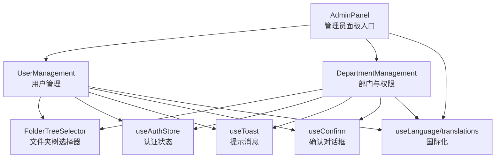
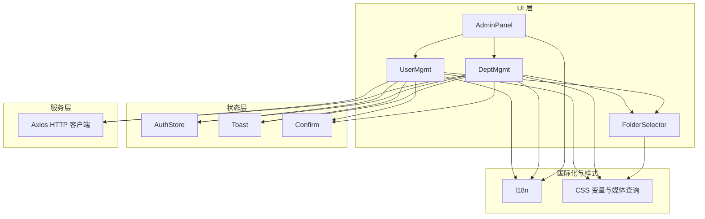
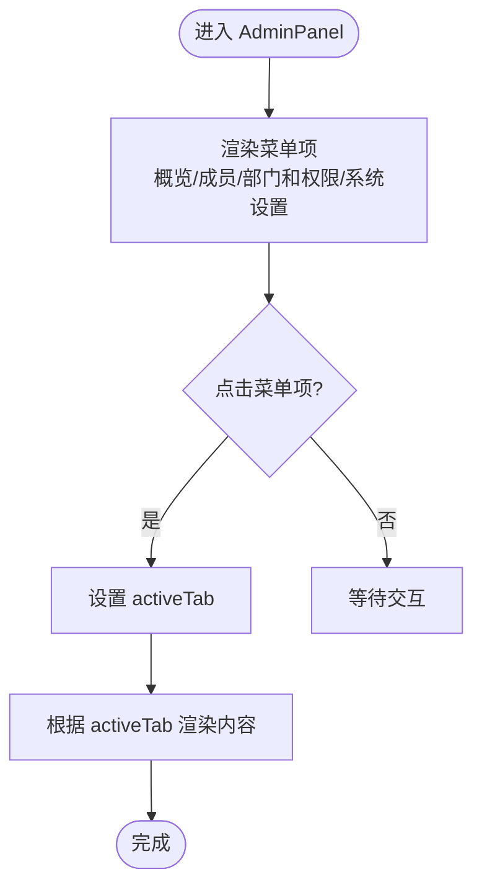
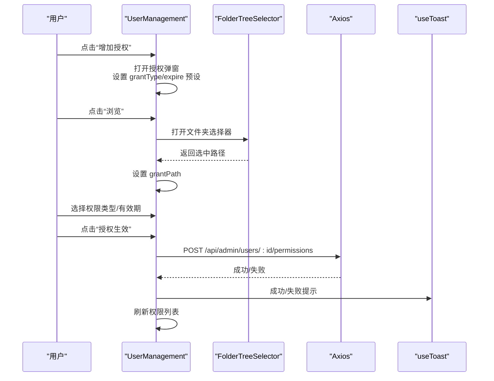
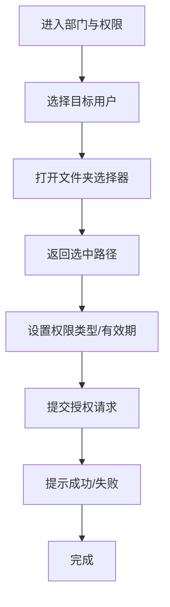
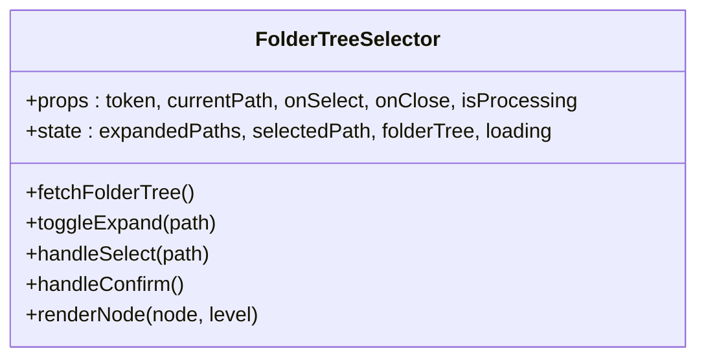
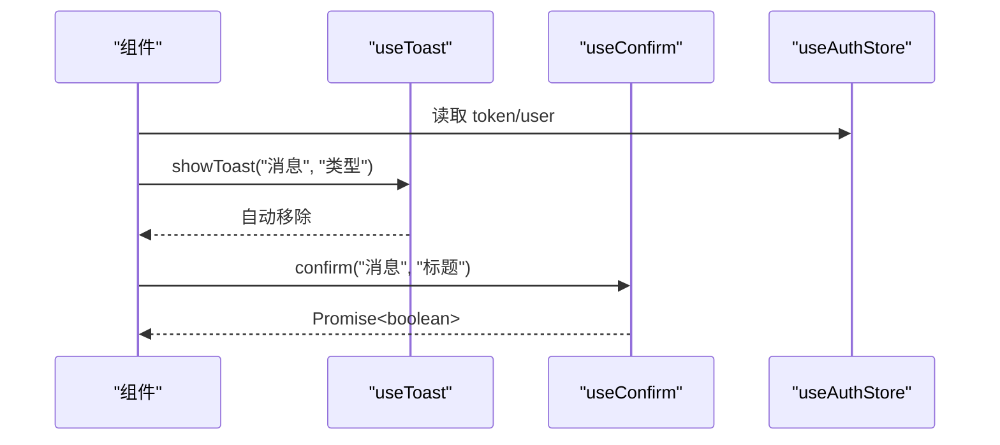
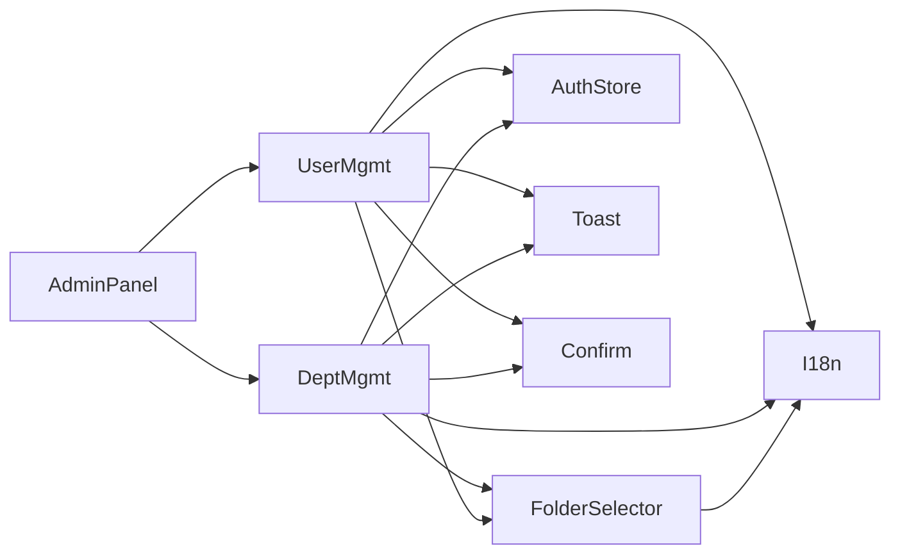

# 权限管理界面

<cite>
**本文档引用的文件**
- [client/src/components/AdminPanel.tsx](file://client/src/components/AdminPanel.tsx)
- [client/src/components/UserManagement.tsx](file://client/src/components/UserManagement.tsx)
- [client/src/components/DepartmentManagement.tsx](file://client/src/components/DepartmentManagement.tsx)
- [client/src/components/FolderTreeSelector.tsx](file://client/src/components/FolderTreeSelector.tsx)
- [client/src/store/useAuthStore.ts](file://client/src/store/useAuthStore.ts)
- [client/src/store/useToast.ts](file://client/src/store/useToast.ts)
- [client/src/store/useConfirm.ts](file://client/src/store/useConfirm.ts)
- [client/src/i18n/useLanguage.ts](file://client/src/i18n/useLanguage.ts)
- [client/src/i18n/translations.ts](file://client/src/i18n/translations.ts)
- [client/src/index.css](file://client/src/index.css)
- [client/src/main.tsx](file://client/src/main.tsx)
</cite>

## 目录
1. [引言](#引言)
2. [项目结构](#项目结构)
3. [核心组件](#核心组件)
4. [架构总览](#架构总览)
5. [详细组件分析](#详细组件分析)
6. [依赖关系分析](#依赖关系分析)
7. [性能考虑](#性能考虑)
8. [故障排除指南](#故障排除指南)
9. [结论](#结论)

## 引言
本文件面向 Longhorn 权限管理界面的前端技术文档，聚焦管理员面板中的“用户管理”和“部门与权限”两大模块。文档从组件架构、交互流程、数据绑定与状态管理、表单验证、响应式设计、国际化与可访问性等方面进行系统化梳理，并提供可视化图表帮助理解。

## 项目结构
Longhorn 前端采用 React + TypeScript 构建，权限管理相关代码主要位于 client/src/components 目录下，配合 Zustand 状态管理、国际化与样式体系共同构成完整的权限管理界面。

**图表来源**
- [client/src/components/AdminPanel.tsx](file://client/src/components/AdminPanel.tsx#L10-L66)
- [client/src/components/UserManagement.tsx](file://client/src/components/UserManagement.tsx#L129-L824)
- [client/src/components/DepartmentManagement.tsx](file://client/src/components/DepartmentManagement.tsx#L15-L430)
- [client/src/components/FolderTreeSelector.tsx](file://client/src/components/FolderTreeSelector.tsx#L21-L348)
- [client/src/store/useAuthStore.ts](file://client/src/store/useAuthStore.ts#L17-L31)
- [client/src/store/useToast.ts](file://client/src/store/useToast.ts#L17-L41)
- [client/src/store/useConfirm.ts](file://client/src/store/useConfirm.ts#L14-L37)
- [client/src/i18n/useLanguage.ts](file://client/src/i18n/useLanguage.ts#L30-L59)
- [client/src/i18n/translations.ts](file://client/src/i18n/translations.ts#L4-L745)

**章节来源**
- [client/src/components/AdminPanel.tsx](file://client/src/components/AdminPanel.tsx#L1-L66)
- [client/src/components/UserManagement.tsx](file://client/src/components/UserManagement.tsx#L1-L824)
- [client/src/components/DepartmentManagement.tsx](file://client/src/components/DepartmentManagement.tsx#L1-L430)
- [client/src/components/FolderTreeSelector.tsx](file://client/src/components/FolderTreeSelector.tsx#L1-L348)
- [client/src/store/useAuthStore.ts](file://client/src/store/useAuthStore.ts#L1-L31)
- [client/src/store/useToast.ts](file://client/src/store/useToast.ts#L1-L41)
- [client/src/store/useConfirm.ts](file://client/src/store/useConfirm.ts#L1-L37)
- [client/src/i18n/useLanguage.ts](file://client/src/i18n/useLanguage.ts#L1-L59)
- [client/src/i18n/translations.ts](file://client/src/i18n/translations.ts#L1-L800)
- [client/src/index.css](file://client/src/index.css#L1-L200)
- [client/src/main.tsx](file://client/src/main.tsx#L1-L11)

## 核心组件
- 管理员面板入口：负责二级导航与内容区域切换，承载用户管理与部门权限两大功能页。
- 用户管理：提供成员列表、搜索、创建用户、编辑账户、动态目录授权、撤销授权等功能。
- 部门与权限：提供按用户/文件夹/权限类型的授权配置，支持有效期策略与部门创建。
- 文件夹树选择器：用于在授权流程中选择目标目录，支持层级展开与路径高亮。
- 状态管理：认证状态、提示消息、确认对话框通过 Zustand 管理，避免深层传递。
- 国际化：统一的语言切换与翻译键值，覆盖权限管理相关文案。

**章节来源**
- [client/src/components/AdminPanel.tsx](file://client/src/components/AdminPanel.tsx#L10-L66)
- [client/src/components/UserManagement.tsx](file://client/src/components/UserManagement.tsx#L129-L824)
- [client/src/components/DepartmentManagement.tsx](file://client/src/components/DepartmentManagement.tsx#L15-L430)
- [client/src/components/FolderTreeSelector.tsx](file://client/src/components/FolderTreeSelector.tsx#L21-L348)
- [client/src/store/useAuthStore.ts](file://client/src/store/useAuthStore.ts#L17-L31)
- [client/src/store/useToast.ts](file://client/src/store/useToast.ts#L17-L41)
- [client/src/store/useConfirm.ts](file://client/src/store/useConfirm.ts#L14-L37)
- [client/src/i18n/useLanguage.ts](file://client/src/i18n/useLanguage.ts#L30-L59)
- [client/src/i18n/translations.ts](file://client/src/i18n/translations.ts#L4-L745)

## 架构总览
权限管理界面采用“容器组件 + 表单组件 + 选择器组件”的分层设计，结合 Zustand 实现轻量状态共享，Axios 进行 API 通信，Framer Motion 提供过渡动画，国际化与样式系统贯穿始终。

**图表来源**
- [client/src/components/AdminPanel.tsx](file://client/src/components/AdminPanel.tsx#L10-L66)
- [client/src/components/UserManagement.tsx](file://client/src/components/UserManagement.tsx#L129-L824)
- [client/src/components/DepartmentManagement.tsx](file://client/src/components/DepartmentManagement.tsx#L15-L430)
- [client/src/components/FolderTreeSelector.tsx](file://client/src/components/FolderTreeSelector.tsx#L21-L348)
- [client/src/store/useAuthStore.ts](file://client/src/store/useAuthStore.ts#L17-L31)
- [client/src/store/useToast.ts](file://client/src/store/useToast.ts#L17-L41)
- [client/src/store/useConfirm.ts](file://client/src/store/useConfirm.ts#L14-L37)
- [client/src/i18n/useLanguage.ts](file://client/src/i18n/useLanguage.ts#L30-L59)
- [client/src/index.css](file://client/src/index.css#L1-L200)

## 详细组件分析

### 管理员面板（AdminPanel）
- 职责：提供“概览/成员/部门和权限/系统设置”的二级导航，根据激活标签渲染对应内容。
- 交互：点击菜单项切换 activeTab，渲染 SystemDashboard、UserManagement 或 DepartmentManagement。
- 国际化：菜单项文本通过 useLanguage.t 获取，确保多语言一致。

**图表来源**
- [client/src/components/AdminPanel.tsx](file://client/src/components/AdminPanel.tsx#L10-L66)

**章节来源**
- [client/src/components/AdminPanel.tsx](file://client/src/components/AdminPanel.tsx#L10-L66)

### 用户管理（UserManagement）
- 成员列表与搜索：支持按用户名过滤，展示部门、角色、个人空间入口。
- 创建用户：表单包含用户名、密码、部门、角色，提交后刷新列表并提示。
- 编辑账户：支持修改用户名、部门、角色，可选重置密码；管理员可见“增加授权”按钮。
- 动态目录授权：选择目标目录（文件夹浏览器）、权限类型（只读/贡献/完全）、有效期（7天/1月/永久/自定义），提交后刷新权限列表。
- 撤销授权：二次确认后调用删除接口，刷新权限。
- 文件夹浏览器：基于 FolderTreeSelector 的独立弹窗，支持路径回退与目录选择。
- 状态与提示：useAuthStore 提供 token 与用户角色；useToast 统一提示；useConfirm 统一确认。

**图表来源**
- [client/src/components/UserManagement.tsx](file://client/src/components/UserManagement.tsx#L129-L824)
- [client/src/components/FolderTreeSelector.tsx](file://client/src/components/FolderTreeSelector.tsx#L21-L348)

**章节来源**
- [client/src/components/UserManagement.tsx](file://client/src/components/UserManagement.tsx#L129-L824)

### 部门与权限（DepartmentManagement）
- 授权配置：选择目标用户、目标文件夹（文件夹选择器）、权限类型、有效期（7天/1月/永久/自定义），提交后提示成功。
- 部门创建：校验部门名称与代码格式（2-3位大写字母），提交后刷新列表。
- 规则提示：核心规则与审计说明，帮助管理员理解权限冲突与有效期策略。

**图表来源**
- [client/src/components/DepartmentManagement.tsx](file://client/src/components/DepartmentManagement.tsx#L15-L430)
- [client/src/components/FolderTreeSelector.tsx](file://client/src/components/FolderTreeSelector.tsx#L21-L348)

**章节来源**
- [client/src/components/DepartmentManagement.tsx](file://client/src/components/DepartmentManagement.tsx#L15-L430)

### 文件夹树选择器（FolderTreeSelector）
- 功能：递归加载文件夹树，支持展开/折叠、路径高亮、双击进入子级、单击选中。
- 个性化：支持按用户名提升个人空间至顶部，便于用户空间授权。
- 交互：父组件传入 token、当前路径、回调 onSelect/onClose，内部维护 expandedPaths、selectedPath。

**图表来源**
- [client/src/components/FolderTreeSelector.tsx](file://client/src/components/FolderTreeSelector.tsx#L21-L348)

**章节来源**
- [client/src/components/FolderTreeSelector.tsx](file://client/src/components/FolderTreeSelector.tsx#L21-L348)

### 状态管理与工具
- 认证状态（useAuthStore）：持久化用户与 token，提供 setAuth/logout。
- 提示消息（useToast）：统一 toast 队列，自动移除，支持多种类型。
- 确认对话框（useConfirm）：Promise 化确认流程，支持自定义标题与按钮文案。

**图表来源**
- [client/src/store/useAuthStore.ts](file://client/src/store/useAuthStore.ts#L17-L31)
- [client/src/store/useToast.ts](file://client/src/store/useToast.ts#L17-L41)
- [client/src/store/useConfirm.ts](file://client/src/store/useConfirm.ts#L14-L37)

**章节来源**
- [client/src/store/useAuthStore.ts](file://client/src/store/useAuthStore.ts#L17-L31)
- [client/src/store/useToast.ts](file://client/src/store/useToast.ts#L17-L41)
- [client/src/store/useConfirm.ts](file://client/src/store/useConfirm.ts#L14-L37)

### 国际化与样式
- 国际化：useLanguage 提供 t(key, params)，translations 提供多语言键值，支持 zh/en/de/ja。
- 样式：CSS 变量定义主题色与边框，媒体查询适配移动端，提供动画与交互反馈。

**章节来源**
- [client/src/i18n/useLanguage.ts](file://client/src/i18n/useLanguage.ts#L30-L59)
- [client/src/i18n/translations.ts](file://client/src/i18n/translations.ts#L4-L745)
- [client/src/index.css](file://client/src/index.css#L1-L200)

## 依赖关系分析
- 组件耦合：AdminPanel 作为容器，UserManagement 与 DepartmentManagement 并行存在，均依赖 FolderTreeSelector、useAuthStore、useToast、useConfirm、国际化。
- 数据流：用户操作触发状态变更与 API 请求，Axios 返回后更新本地状态并触发 UI 更新。
- 外部依赖：Axios（HTTP）、Framer Motion（动画）、Lucide Icons（图标）。

**图表来源**
- [client/src/components/AdminPanel.tsx](file://client/src/components/AdminPanel.tsx#L10-L66)
- [client/src/components/UserManagement.tsx](file://client/src/components/UserManagement.tsx#L129-L824)
- [client/src/components/DepartmentManagement.tsx](file://client/src/components/DepartmentManagement.tsx#L15-L430)
- [client/src/components/FolderTreeSelector.tsx](file://client/src/components/FolderTreeSelector.tsx#L21-L348)
- [client/src/store/useAuthStore.ts](file://client/src/store/useAuthStore.ts#L17-L31)
- [client/src/store/useToast.ts](file://client/src/store/useToast.ts#L17-L41)
- [client/src/store/useConfirm.ts](file://client/src/store/useConfirm.ts#L14-L37)
- [client/src/i18n/useLanguage.ts](file://client/src/i18n/useLanguage.ts#L30-L59)

**章节来源**
- [client/src/components/AdminPanel.tsx](file://client/src/components/AdminPanel.tsx#L10-L66)
- [client/src/components/UserManagement.tsx](file://client/src/components/UserManagement.tsx#L129-L824)
- [client/src/components/DepartmentManagement.tsx](file://client/src/components/DepartmentManagement.tsx#L15-L430)
- [client/src/components/FolderTreeSelector.tsx](file://client/src/components/FolderTreeSelector.tsx#L21-L348)
- [client/src/store/useAuthStore.ts](file://client/src/store/useAuthStore.ts#L17-L31)
- [client/src/store/useToast.ts](file://client/src/store/useToast.ts#L17-L41)
- [client/src/store/useConfirm.ts](file://client/src/store/useConfirm.ts#L14-L37)
- [client/src/i18n/useLanguage.ts](file://client/src/i18n/useLanguage.ts#L30-L59)

## 性能考虑
- 并发请求：用户与部门数据通过 Promise.all 并发获取，减少首屏等待。
- 懒加载与虚拟滚动：文件夹树渲染支持展开/折叠，避免一次性渲染大量节点。
- 动画与过渡：使用 Framer Motion 的轻量动画，避免阻塞主线程。
- 样式优化：CSS 变量与媒体查询减少重复计算，移动端交互更流畅。

[本节为通用指导，无需特定文件引用]

## 故障排除指南
- 授权失败：检查 token 是否有效，确认权限类型与有效期设置是否符合预期；查看 useToast 提示。
- 撤销权限：二次确认对话框未触发时，检查 useConfirm 的 isOpen 与 close 流程。
- 文件夹选择异常：确认 FolderTreeSelector 的 token 与 currentPath 传入正确，网络请求是否成功。
- 国际化显示异常：检查 useLanguage 的语言切换与 translations 键值是否存在。

**章节来源**
- [client/src/store/useToast.ts](file://client/src/store/useToast.ts#L17-L41)
- [client/src/store/useConfirm.ts](file://client/src/store/useConfirm.ts#L14-L37)
- [client/src/components/FolderTreeSelector.tsx](file://client/src/components/FolderTreeSelector.tsx#L21-L348)
- [client/src/i18n/useLanguage.ts](file://client/src/i18n/useLanguage.ts#L30-L59)

## 结论
Longhorn 权限管理界面通过清晰的组件分层、完善的交互与状态管理、严谨的国际化与样式体系，实现了用户管理与部门权限配置的高效操作。建议后续在以下方面持续优化：增强批量操作能力、完善权限审计日志、引入权限冲突检测与可视化提示，以及进一步提升移动端交互体验。