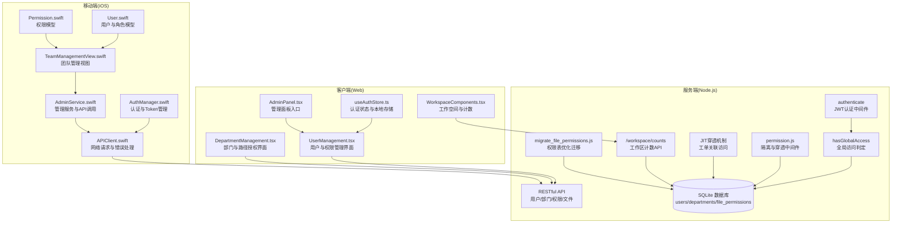
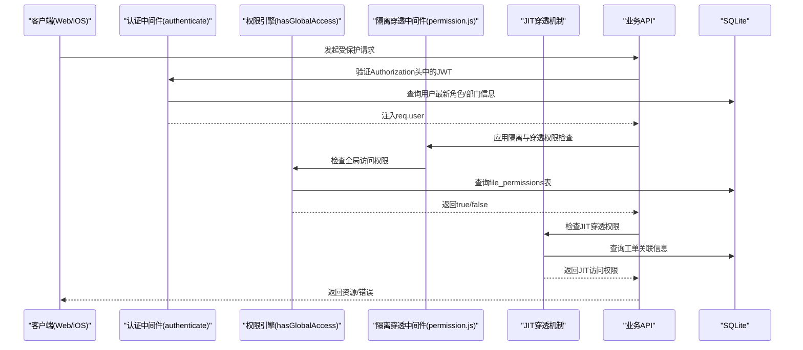
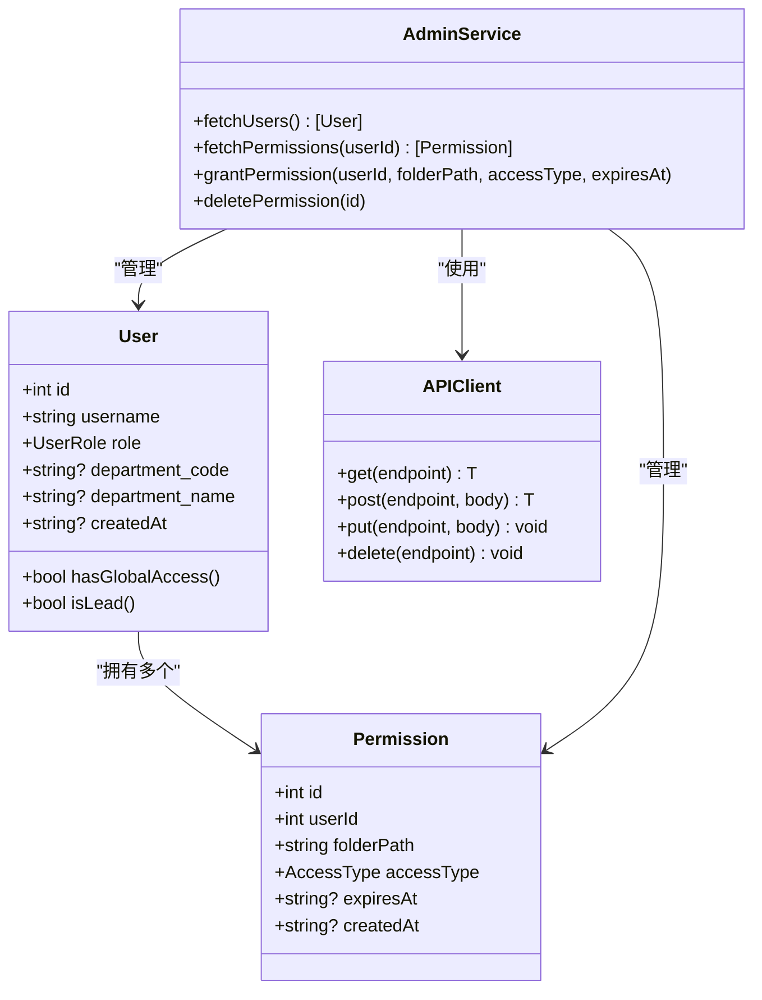
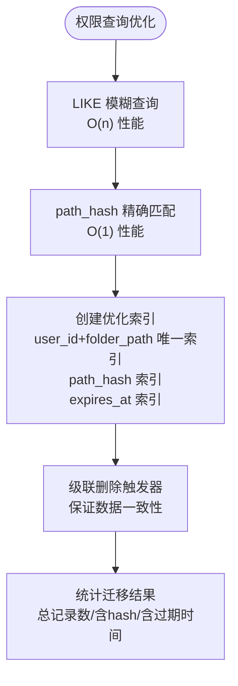
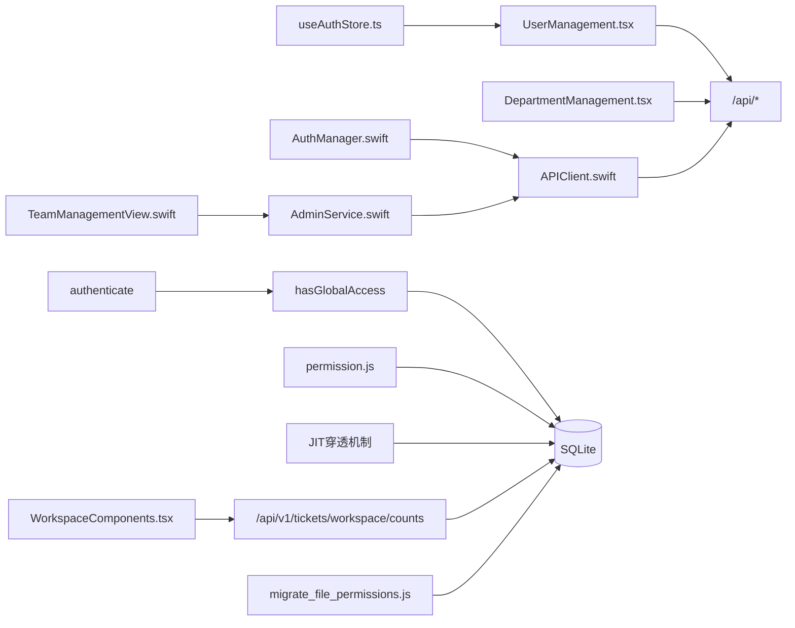

# 权限管理系统

<cite>
**本文档引用的文件**
- [useAuthStore.ts](file://client/src/store/useAuthStore.ts)
- [AuthManager.swift](file://ios/LonghornApp/Services/AuthManager.swift)
- [APIClient.swift](file://ios/LonghornApp/Services/APIClient.swift)
- [Permission.swift](file://ios/LonghornApp/Models/Permission.swift)
- [User.swift](file://ios/LonghornApp/Models/User.swift)
- [AdminService.swift](file://ios/LonghornApp/Services/AdminService.swift)
- [AdminPanel.tsx](file://client/src/components/AdminPanel.tsx)
- [TeamManagementView.swift](file://ios/LonghornApp/Views/Admin/TeamManagementView.swift)
- [UserManagement.tsx](file://client/src/components/UserManagement.tsx)
- [DepartmentManagement.tsx](file://client/src/components/DepartmentManagement.tsx)
- [index.js](file://server/index.js)
- [permission.js](file://server/service/middleware/permission.js)
- [migrate_file_permissions.js](file://server/migrate_file_permissions.js)
- [tickets.js](file://server/service/routes/tickets.js)
- [knowledge.js](file://server/service/routes/knowledge.js)
- [Service_DataModel.md](file://docs/Service_DataModel.md)
- [fix_departments_permissions.sql](file://server/migrations/fix_departments_permissions.sql)
- [WorkspaceComponents.tsx](file://client/src/components/Workspace/WorkspaceComponents.tsx)
- [App.tsx](file://client/src/App.tsx)
</cite>

## 更新摘要
**所做更改**
- 更新了权限中间件章节，反映新的"隔离与穿透"原则和 JIT 穿透机制
- 新增了部门感知过滤和基于角色的可见性控制章节
- 新增了工作区计数端点和增强的授权逻辑章节
- 更新了 CRM/IB 访问控制和上下文穿透机制
- 完善了权限查询优化和新的基于角色的权限中间件

## 目录
1. [简介](#简介)
2. [项目结构](#项目结构)
3. [核心组件](#核心组件)
4. [架构总览](#架构总览)
5. [详细组件分析](#详细组件分析)
6. [依赖关系分析](#依赖关系分析)
7. [性能考量](#性能考量)
8. [故障排除指南](#故障排除指南)
9. [结论](#结论)

## 简介
本文件为 Longhorn 权限管理系统的技术文档，围绕 RBAC（基于角色的访问控制）模型展开，详细阐述三层级权限体系（Admin、Lead、Member）与路径权限控制、动态权限验证及权限缓存机制。文档涵盖权限规则定义、存储与查询优化、API 接口规范以及前端权限控制组件的使用指南，并提供权限审计、异常处理与安全加固建议。

**重要更新**：本次更新反映了权限中间件的大幅重构，实现了新的"隔离与穿透"原则，支持部门感知过滤和 JIT（Just-In-Time）穿透机制，新增工作区计数端点和增强的授权逻辑。

## 项目结构
Longhorn 权限系统由三部分组成：
- 客户端（Web）：React + TypeScript，负责用户界面、权限展示与交互。
- 移动端（iOS）：Swift + SwiftUI，负责用户界面、权限展示与交互。
- 服务端（Node.js）：基于 JWT 的认证中间件与权限校验逻辑，配合 SQLite 数据库存储用户、部门与权限数据。



**图表来源**
- [useAuthStore.ts](file://client/src/store/useAuthStore.ts#L1-L34)
- [AuthManager.swift](file://ios/LonghornApp/Services/AuthManager.swift#L1-L195)
- [APIClient.swift](file://ios/LonghornApp/Services/APIClient.swift#L1-L386)
- [User.swift](file://ios/LonghornApp/Models/User.swift#L1-L85)
- [Permission.swift](file://ios/LonghornApp/Models/Permission.swift#L1-L27)
- [AdminService.swift](file://ios/LonghornApp/Services/AdminService.swift#L1-L155)
- [UserManagement.tsx](file://client/src/components/UserManagement.tsx#L1-L895)
- [DepartmentManagement.tsx](file://client/src/components/DepartmentManagement.tsx#L1-L430)
- [AdminPanel.tsx](file://client/src/components/AdminPanel.tsx#L1-L131)
- [WorkspaceComponents.tsx](file://client/src/components/Workspace/WorkspaceComponents.tsx#L1-L200)
- [index.js](file://server/index.js#L587-L678)
- [permission.js](file://server/service/middleware/permission.js#L1-L213)
- [migrate_file_permissions.js](file://server/migrate_file_permissions.js#L1-L139)
- [tickets.js](file://server/service/routes/tickets.js#L1340-L1391)

**章节来源**
- [useAuthStore.ts](file://client/src/store/useAuthStore.ts#L1-L34)
- [AuthManager.swift](file://ios/LonghornApp/Services/AuthManager.swift#L1-L195)
- [APIClient.swift](file://ios/LonghornApp/Services/APIClient.swift#L1-L386)
- [User.swift](file://ios/LonghornApp/Models/User.swift#L1-L85)
- [Permission.swift](file://ios/LonghornApp/Models/Permission.swift#L1-L27)
- [AdminService.swift](file://ios/LonghornApp/Services/AdminService.swift#L1-L155)
- [UserManagement.tsx](file://client/src/components/UserManagement.tsx#L1-L895)
- [DepartmentManagement.tsx](file://client/src/components/DepartmentManagement.tsx#L1-L430)
- [AdminPanel.tsx](file://client/src/components/AdminPanel.tsx#L1-L131)
- [WorkspaceComponents.tsx](file://client/src/components/Workspace/WorkspaceComponents.tsx#L1-L200)
- [index.js](file://server/index.js#L587-L678)
- [permission.js](file://server/service/middleware/permission.js#L1-L213)
- [migrate_file_permissions.js](file://server/migrate_file_permissions.js#L1-L139)
- [tickets.js](file://server/service/routes/tickets.js#L1340-L1391)

## 核心组件
- 认证与会话管理
  - Web：使用 zustand 管理用户与 Token，持久化到 localStorage。
  - iOS：使用 Keychain 存储 Token，UserDefaults 存储用户信息；登录后异步验证 Token 有效性。
- 权限模型
  - iOS：Permission 结构体包含用户 ID、文件夹路径、访问类型（Read/Contribute/Full）、过期时间等。
  - 服务端：hasGlobalAccess 函数判断用户是否拥有 CRM/IB 全局访问权限；新的基于角色的权限中间件提供更精细的权限控制。
- 管理服务
  - iOS AdminService：封装 /api/admin/* 接口，包括用户、部门、系统统计与权限管理。
  - Web UserManagement/DepartmentManagement：负责权限授予、撤销与路径选择。
- 权限判定引擎
  - 服务端 authenticate 中间件加载最新用户信息；hasGlobalAccess 统一判定逻辑。
  - 新的基于角色的权限中间件提供更精细的权限控制，支持 JIT 穿透机制。

**章节来源**
- [useAuthStore.ts](file://client/src/store/useAuthStore.ts#L1-L34)
- [AuthManager.swift](file://ios/LonghornApp/Services/AuthManager.swift#L1-L195)
- [APIClient.swift](file://ios/LonghornApp/Services/APIClient.swift#L1-L386)
- [Permission.swift](file://ios/LonghornApp/Models/Permission.swift#L1-L27)
- [User.swift](file://ios/LonghornApp/Models/User.swift#L1-L85)
- [AdminService.swift](file://ios/LonghornApp/Services/AdminService.swift#L1-L155)
- [UserManagement.tsx](file://client/src/components/UserManagement.tsx#L1-L895)
- [DepartmentManagement.tsx](file://client/src/components/DepartmentManagement.tsx#L1-L430)
- [index.js](file://server/index.js#L587-L678)
- [permission.js](file://server/service/middleware/permission.js#L1-L213)

## 架构总览
Longhorn 的权限架构采用"前端 UI + 服务端判定"的模式，新的"隔离与穿透"原则：
- 前端负责展示与交互，服务端负责严格的权限判定与数据一致性。
- 认证采用 JWT，中间件在每次请求时验证并注入用户上下文。
- 权限判定覆盖个人空间、部门内默认权限与扩展授权（file_permissions 表）。
- 新的 JIT（Just-In-Time）穿透机制：OP/RD 用户默认无权访问 CRM/IB，仅通过工单获得临时访问权限。



**图表来源**
- [index.js](file://server/index.js#L587-L678)
- [APIClient.swift](file://ios/LonghornApp/Services/APIClient.swift#L331-L375)
- [AuthManager.swift](file://ios/LonghornApp/Services/AuthManager.swift#L114-L123)
- [permission.js](file://server/service/middleware/permission.js#L15-L25)
- [permission.js](file://server/service/middleware/permission.js#L28-L77)

**章节来源**
- [index.js](file://server/index.js#L587-L678)
- [APIClient.swift](file://ios/LonghornApp/Services/APIClient.swift#L331-L375)
- [AuthManager.swift](file://ios/LonghornApp/Services/AuthManager.swift#L114-L123)
- [permission.js](file://server/service/middleware/permission.js#L1-L213)

## 详细组件分析

### RBAC 模型与角色权限差异
- 角色定义
  - Admin：超级管理员，拥有全局权限。
  - Exec：执行管理层，拥有全局权限。
  - MS（市场部）：全局读写权限。
  - GE（通用台面）：平台管理员，拥有全局权限。
  - OP/RD（运营/研发）：默认无权访问 CRM/IB，需要通过工单获得 JIT 穿透。
  - Dealer：经销商用户，权限受限。
- 默认权限矩阵（基于新的隔离与穿透原则）
  - Admin/Exec/MS/GE：CRM/IB 全局访问。
  - OP/RD：CRM/IB 默认无权访问，通过工单关联获得 JIT 穿透。
  - Dealer：仅能访问自己的工单和关联信息。

**更新**：根据新的权限中间件实现，OP/RD 用户默认无权访问 CRM/IB，需要通过工单关联获得 JIT 穿透。



**图表来源**
- [User.swift](file://ios/LonghornApp/Models/User.swift#L26-L50)
- [Permission.swift](file://ios/LonghornApp/Models/Permission.swift#L10-L26)
- [APIClient.swift](file://ios/LonghornApp/Services/APIClient.swift#L68-L108)
- [AdminService.swift](file://ios/LonghornApp/Services/AdminService.swift#L17-L91)

**章节来源**
- [User.swift](file://ios/LonghornApp/Models/User.swift#L10-L23)
- [Permission.swift](file://ios/LonghornApp/Models/Permission.swift#L4-L8)

### 新的权限中间件：隔离与穿透原则
**更新**：权限中间件大幅重构，实现了新的"隔离与穿透"原则：

#### 核心原则
- **隔离**：不同部门之间默认相互隔离
- **穿透**：通过工单关联实现临时访问权限
- **最小权限**：默认拒绝，仅在必要时授予

#### 全局访问权限判定
```javascript
function hasGlobalAccess(user) {
  if (!user) return false;
  // Admin / Exec 全权限
  if (user.role === 'Admin' || user.role === 'Exec') return true;
  // MS (市场部) 全局读写
  const deptCode = user.department_code || '';
  if (deptCode === 'MS') return true;
  // GE (通用台面) — 平台管理员
  if (deptCode === 'GE') return true;
  return false;
}
```

#### JIT 穿透机制
- `getAccessibleAccountIds(db, userId)`：获取用户通过工单关联可访问的 account_id 列表
- `getAccessibleSerialNumbers(db, userId)`：获取用户通过工单关联可访问的 serial_number 列表
- `getAccessibleDealerIds(db, userId)`：获取用户通过工单关联可访问的 dealer_id 列表

**章节来源**
- [permission.js](file://server/service/middleware/permission.js#L1-L213)

### 部门感知过滤与基于角色的可见性控制
**更新**：新增了基于部门代码的访问控制和可见性过滤：

#### 部门节点映射
```javascript
const DEPARTMENT_NODES = {
  'MS': ['draft', 'submitted', 'ms_review', 'waiting_customer', 'ms_closing'],
  'OP': ['op_receiving', 'op_diagnosing', 'op_repairing', 'op_qa'],
  'GE': ['ge_review', 'ge_closing'],
  'RD': ['op_diagnosing', 'op_repairing']
};
```

#### 工作区计数 API
新增 `/api/v1/tickets/workspace/counts` 端点，提供工作空间视图的实时计数：
- My Tasks：分配给当前用户的任务数量
- Mentioned：在参与者列表中的工单数量
- Team Queue：团队队列中的未分配工单数量

```javascript
router.get('/workspace/counts', authenticate, (req, res) => {
  const userId = req.user.id;
  const deptCode = getDeptCode(req.user);
  const relevantNodes = DEPARTMENT_NODES[deptCode];
  
  // 部门感知的队列过滤
  if (relevantNodes && req.user.role !== 'Admin' && req.user.role !== 'Exec') {
    teamQueueSql += ` AND current_node IN (${relevantNodes.map(n => `'${n}'`).join(',')})`;
  }
});
```

**章节来源**
- [permission.js](file://server/service/middleware/permission.js#L52-L77)
- [tickets.js](file://server/service/routes/tickets.js#L1340-L1391)

### CRM/IB 访问控制与上下文穿透机制
**更新**：增强了 CRM 和 IB 的访问控制：

#### CRM 访问守卫
```javascript
function requireCrmAccess(req, res, next) {
  if (!req.user) {
    return res.status(401).json({ success: false, error: '未认证' });
  }
  if (hasGlobalAccess(req.user)) {
    return next();
  }
  return res.status(403).json({
    success: false,
    error: '权限不足：您所在部门无权浏览客户档案全量列表。如需查看特定客户信息，请通过关联工单访问。'
  });
}
```

#### IB（Install Base）访问守卫
```javascript
function requireIbAccess(db) {
  return (req, res, next) => {
    if (!req.user) {
      return res.status(401).json({ success: false, error: '未认证' });
    }
    if (hasGlobalAccess(req.user)) {
      return next();
    }
    // OP/RD 可以搜索，但仅返回自己工单关联的产品
    req.accessibleSerialNumbers = getAccessibleSerialNumbers(db, req.user.id);
    req.isRestrictedAccess = true;
    next();
  };
}
```

#### 上下文穿透守卫
```javascript
function requireContextAccess(db) {
  return (req, res, next) => {
    if (!req.user) {
      return res.status(401).json({ success: false, error: '未认证' });
    }
    if (hasGlobalAccess(req.user)) {
      return next();
    }

    const { account_id, serial_number } = req.query;

    // 检查 account_id 穿透
    if (account_id) {
      const accessibleIds = getAccessibleAccountIds(db, req.user.id);
      const accessibleDealerIds = getAccessibleDealerIds(db, req.user.id);
      const allAccessible = [...accessibleIds, ...accessibleDealerIds];
      if (!allAccessible.includes(parseInt(account_id))) {
        return res.status(403).json({
          success: false,
          error: '权限不足：您没有该客户的访问权限。仅可查看与您关联工单的客户信息。'
        });
      }
    }
  };
}
```

**章节来源**
- [permission.js](file://server/service/middleware/permission.js#L83-L163)

### 文件权限表优化与新的查询机制
**更新**：Longhorn 权限系统经历了重大优化，主要变更包括：

#### 表结构变更
- **表重命名**：permissions → file_permissions
- **新增字段**：path_hash 用于快速查询
- **唯一索引**：防止重复授权
- **过期时间索引**：优化查询性能

#### 查询优化机制
优化前的查询使用 LIKE 模糊匹配：
```sql
-- 优化前：LIKE 模糊查询，无法利用索引
SELECT access_type FROM permissions 
WHERE user_id = ? AND folder_path LIKE 'MS/%'
```

优化后的查询使用精确匹配：
```sql
-- 优化后：使用 path_hash 精确匹配，B-Tree 索引 O(1) 查找
SELECT access_type FROM file_permissions 
WHERE user_id = ? AND path_hash = ?
```

#### 迁移脚本功能
迁移脚本包含以下功能：
1. 验证 file_permissions 表存在性
2. 添加 path_hash 列（如果不存在）
3. 为现有数据生成 MD5 哈希值
4. 创建优化索引
5. 添加级联删除触发器
6. 统计迁移结果



**图表来源**
- [migrate_file_permissions.js](file://server/migrate_file_permissions.js#L1-L139)
- [Service_DataModel.md](file://docs/Service_DataModel.md#L1509-L1518)

**章节来源**
- [migrate_file_permissions.js](file://server/migrate_file_permissions.js#L1-L139)
- [Service_DataModel.md](file://docs/Service_DataModel.md#L1509-L1518)

### 路径权限控制与动态权限验证
- 路径规范化：统一斜杠与大小写，支持"运营部/..."与"OP/..."两种输入。
- 部门名归一化：从"运营部 (OP)"提取代码 OP 或映射 NAME_TO_CODE。
- 扩展授权：LIKE 匹配 folder_path 及其子路径，过滤过期授权。
- 动态验证：前端在授权弹窗中调用 /api/files?path=... 获取可浏览目录树，结合权限类型进行交互。

**章节来源**
- [index.js](file://server/index.js#L640-L686)
- [UserManagement.tsx](file://client/src/components/UserManagement.tsx#L230-L240)
- [DepartmentManagement.tsx](file://client/src/components/DepartmentManagement.tsx#L124-L142)

### 权限缓存机制
- iOS：AuthManager 在启动时检查本地保存的会话，若存在则异步调用 /api/user/stats 验证 Token 有效性；验证失败自动登出并清理缓存。
- Web：useAuthStore 从 localStorage 初始化用户与 Token，组件首次渲染时触发数据拉取。
- 建议：服务端可对热门路径的权限结果进行短期缓存（如 Redis），降低频繁查询成本；前端可缓存最近访问的目录树与权限标记。

**章节来源**
- [AuthManager.swift](file://ios/LonghornApp/Services/AuthManager.swift#L94-L123)
- [useAuthStore.ts](file://client/src/store/useAuthStore.ts#L17-L30)

### 权限规则定义、存储与查询优化
- 规则定义：权限类型 Read/Contribute/Full；支持过期时间；部门名可含代码。
- 存储：SQLite 表 users/departments/file_permissions；文件元数据 file_stats 用于删除/移动时的所有权校验。
- 查询优化：
  - 为 file_permissions.user_id、file_permissions.folder_path、file_permissions.expires_at 建索引。
  - 使用 path_hash 字段进行精确匹配，替代 LIKE 模糊查询。
  - 过滤过期授权时使用日期比较索引。
  - 缓存热门部门/用户的权限集合。

**更新**：查询优化已通过迁移脚本完成，使用 path_hash 字段替代传统的 LIKE 查询，显著提升性能。

**章节来源**
- [migrate_file_permissions.js](file://server/migrate_file_permissions.js#L75-L97)
- [Service_DataModel.md](file://docs/Service_DataModel.md#L1509-L1518)

### API 接口文档（权限相关）
- 认证与会话
  - POST /api/login：用户名密码登录，返回 token 与用户信息。
  - GET /api/user/stats：验证 Token 有效性。
- 管理端
  - GET /api/admin/users：获取用户列表。
  - GET /api/admin/departments：获取部门列表。
  - GET /api/admin/users/:id/permissions：获取用户权限列表。
  - POST /api/admin/users/:id/permissions：授予用户权限（folder_path、access_type、expires_at）。
  - DELETE /api/admin/permissions/:id：撤销权限。
  - GET /api/admin/stats：系统统计。
- 路径与文件
  - GET /api/files?path=...：列出目录内容。
  - GET /api/user/accessible-departments：获取用户可访问的部门列表。
- 工作区
  - GET /api/v1/tickets/workspace/counts：获取工作区视图计数（My Tasks、Mentioned、Team Queue）。
  - GET /api/v1/tickets/stats/summary：获取工单统计摘要。

**更新**：新增了工作区计数和统计摘要 API。

**章节来源**
- [AuthManager.swift](file://ios/LonghornApp/Services/AuthManager.swift#L44-L69)
- [APIClient.swift](file://ios/LonghornApp/Services/APIClient.swift#L68-L108)
- [AdminService.swift](file://ios/LonghornApp/Services/AdminService.swift#L17-L91)
- [UserManagement.tsx](file://client/src/components/UserManagement.tsx#L219-L228)
- [DepartmentManagement.tsx](file://client/src/components/DepartmentManagement.tsx#L70-L82)
- [tickets.js](file://server/service/routes/tickets.js#L1340-L1391)

### 前端权限控制组件使用指南
- Web
  - AdminPanel.tsx：管理面板入口，包含系统仪表盘、用户管理、部门权限与系统设置。
  - UserManagement.tsx：支持创建用户、编辑账户、重置密码、授予/撤销权限、浏览目录树。
  - DepartmentManagement.tsx：支持部门创建、路径授权（Read/Contribute/Full）、有效期设置。
  - WorkspaceComponents.tsx：工作空间侧边栏，显示工作区计数和过滤器。
- iOS
  - TeamManagementView.swift：按角色过滤用户列表（Admin 全部可见，Lead 仅本部门）。
  - AdminService.swift：封装管理 API，提供 fetchUsers/fetchPermissions/grantPermission/deletePermission 等方法。
  - Permission.swift：权限数据模型，用于展示与交互。

**更新**：新增了工作空间组件和计数显示功能。

**章节来源**
- [AdminPanel.tsx](file://client/src/components/AdminPanel.tsx#L10-L33)
- [UserManagement.tsx](file://client/src/components/UserManagement.tsx#L167-L188)
- [DepartmentManagement.tsx](file://client/src/components/DepartmentManagement.tsx#L32-L44)
- [WorkspaceComponents.tsx](file://client/src/components/Workspace/WorkspaceComponents.tsx#L48-L119)
- [TeamManagementView.swift](file://ios/LonghornApp/Views/Admin/TeamManagementView.swift#L9-L38)
- [AdminService.swift](file://ios/LonghornApp/Services/AdminService.swift#L17-L91)
- [Permission.swift](file://ios/LonghornApp/Models/Permission.swift#L10-L26)

### 权限审计、异常处理与安全加固
- 审计
  - 服务端全局日志记录 HTTP 请求与响应状态，便于追踪权限相关事件。
  - 建议：引入 access_logs 表记录每次文件访问/变更的用户、路径、时间与结果。
- 异常处理
  - iOS APIClient：统一错误枚举（invalidURL/noData/decodingError/networkError/serverError/unauthorized），401 自动登出。
  - Web：axios 请求统一携带 Authorization 头，错误提示本地化。
- 安全加固
  - JWT 密钥安全存储；服务端中间件严格校验签名与过期时间。
  - 服务端对敏感操作（删除/移动）增加所有权校验（file_stats/uploader_id）。
  - 建议：启用 HTTPS、CORS 白名单、速率限制与请求体大小限制。

**章节来源**
- [APIClient.swift](file://ios/LonghornApp/Services/APIClient.swift#L10-L35)
- [APIClient.swift](file://ios/LonghornApp/Services/APIClient.swift#L287-L315)
- [AuthManager.swift](file://ios/LonghornApp/Services/AuthManager.swift#L71-L89)

## 依赖关系分析
- 前端依赖
  - Web：axios、date-fns、lucide-react、zustand。
  - iOS：Foundation、Combine、SwiftUI。
- 服务端依赖
  - JWT 验证、SQLite 查询、Express 中间件、CORS、压缩与静态资源服务。
- 耦合度与内聚性
  - 权限判定集中在 hasGlobalAccess，内聚性高；前端通过 AdminService/APIClient 解耦与服务端交互。
  - 存在潜在循环：AdminService 依赖 APIClient，APIClient 依赖 AuthManager；可通过依赖注入进一步解耦。



**图表来源**
- [useAuthStore.ts](file://client/src/store/useAuthStore.ts#L1-L34)
- [UserManagement.tsx](file://client/src/components/UserManagement.tsx#L1-L895)
- [DepartmentManagement.tsx](file://client/src/components/DepartmentManagement.tsx#L1-L430)
- [WorkspaceComponents.tsx](file://client/src/components/Workspace/WorkspaceComponents.tsx#L1-L200)
- [AuthManager.swift](file://ios/LonghornApp/Services/AuthManager.swift#L1-L195)
- [APIClient.swift](file://ios/LonghornApp/Services/APIClient.swift#L1-L386)
- [AdminService.swift](file://ios/LonghornApp/Services/AdminService.swift#L1-L155)
- [TeamManagementView.swift](file://ios/LonghornApp/Views/Admin/TeamManagementView.swift#L1-L86)
- [index.js](file://server/index.js#L587-L678)
- [permission.js](file://server/service/middleware/permission.js#L1-L213)
- [migrate_file_permissions.js](file://server/migrate_file_permissions.js#L1-L139)
- [tickets.js](file://server/service/routes/tickets.js#L1340-L1391)

**章节来源**
- [useAuthStore.ts](file://client/src/store/useAuthStore.ts#L1-L34)
- [AuthManager.swift](file://ios/LonghornApp/Services/AuthManager.swift#L1-L195)
- [APIClient.swift](file://ios/LonghornApp/Services/APIClient.swift#L1-L386)
- [AdminService.swift](file://ios/LonghornApp/Services/AdminService.swift#L1-L155)
- [UserManagement.tsx](file://client/src/components/UserManagement.tsx#L1-L895)
- [DepartmentManagement.tsx](file://client/src/components/DepartmentManagement.tsx#L1-L430)
- [WorkspaceComponents.tsx](file://client/src/components/Workspace/WorkspaceComponents.tsx#L1-L200)
- [TeamManagementView.swift](file://ios/LonghornApp/Views/Admin/TeamManagementView.swift#L1-L86)
- [index.js](file://server/index.js#L587-L678)
- [permission.js](file://server/service/middleware/permission.js#L1-L213)
- [migrate_file_permissions.js](file://server/migrate_file_permissions.js#L1-L139)
- [tickets.js](file://server/service/routes/tickets.js#L1340-L1391)

## 性能考量
- 查询优化
  - 为 file_permissions.user_id、file_permissions.folder_path、file_permissions.expires_at 建立复合索引。
  - 使用 path_hash 字段进行精确匹配，替代传统的 LIKE "folder_path || '/%'" 查询。
  - 对 LIKE "folder_path || '/%'" 的查询，考虑物化路径前缀或使用 GIN/Fuzzy 索引。
- 缓存策略
  - 服务端：对热门路径/用户权限结果进行短期缓存（如 5-10 分钟）。
  - 前端：缓存最近访问的目录树与权限标记，减少重复请求。
  - 工作区计数：前端每分钟轮询一次工作区计数，避免频繁刷新。
- 并发与批处理
  - 批量删除/移动时，按文件逐一校验所有权，建议分批处理并提供进度反馈。
- 日志与监控
  - 服务端开启慢查询日志与权限判定耗时统计，定位瓶颈。

**更新**：通过 path_hash 字段和索引优化，权限查询性能得到显著提升，从 O(n) 查询复杂度降至 O(1)。

## 故障排除指南
- 登录失败/401
  - 检查 Authorization 头是否正确携带 Bearer Token。
  - iOS：确认 Keychain 中 token 是否存在；APIClient 在 401 时会触发登出。
  - Web：确认 localStorage 中 token 与 user 是否存在。
- 权限不足
  - 确认用户角色与目标路径是否匹配（Admin/Exec/MS/GE 全权限；OP/RD 需要 JIT 穿透）。
  - 检查 file_permissions 表是否存在有效授权且未过期。
  - 对于 CRM/IB 访问，确认用户是否有全局访问权限或通过工单获得 JIT 穿透。
- 路径不一致
  - 确认"运营部/..."与"OP/..."两种输入格式是否正确归一化。
- 删除/移动失败
  - 确认 file_stats 中 uploader_id 是否为当前用户；历史文件可能缺失该字段。
- 权限查询缓慢
  - 确认 file_permissions 表已执行迁移脚本，包含 path_hash 字段和相关索引。
  - 检查数据库连接池配置和查询超时设置。
- 工作区计数不更新
  - 确认前端已正确调用 /api/v1/tickets/workspace/counts API。
  - 检查部门节点映射是否正确配置。

**更新**：新增了 CRM/IB 访问和工作区计数相关的故障排除指导。

**章节来源**
- [APIClient.swift](file://ios/LonghornApp/Services/APIClient.swift#L347-L353)
- [AuthManager.swift](file://ios/LonghornApp/Services/AuthManager.swift#L114-L123)
- [index.js](file://server/index.js#L633-L686)
- [migrate_file_permissions.js](file://server/migrate_file_permissions.js#L1-L139)
- [permission.js](file://server/service/middleware/permission.js#L83-L163)
- [tickets.js](file://server/service/routes/tickets.js#L1340-L1391)

## 结论
Longhorn 的权限系统经过大幅重构，实现了新的"隔离与穿透"原则，以清晰的角色与路径权限模型为基础，结合服务端严格判定与前端友好交互，实现了 Admin/Exec/MS/GE/OP/RD/Dealer 七层级权限体系。通过 JIT（Just-In-Time）穿透机制和部门感知过滤，系统在保证安全的同时显著提升了灵活性和用户体验。新的基于角色的权限中间件提供了更精细的权限控制能力，支持复杂的业务场景需求。新增的工作区计数端点和增强的授权逻辑进一步完善了系统的可用性和可维护性。建议后续继续完善权限审计、优化查询与缓存策略，并持续强化安全与可观测性。