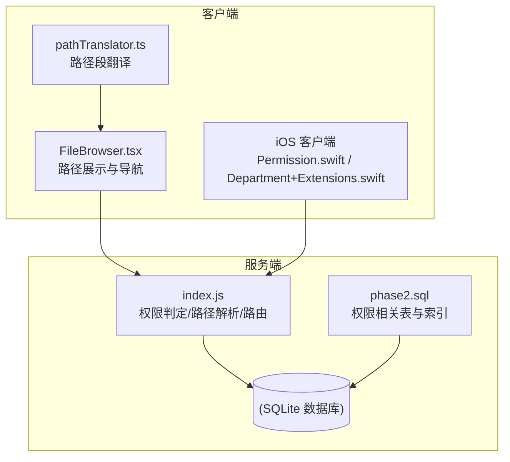
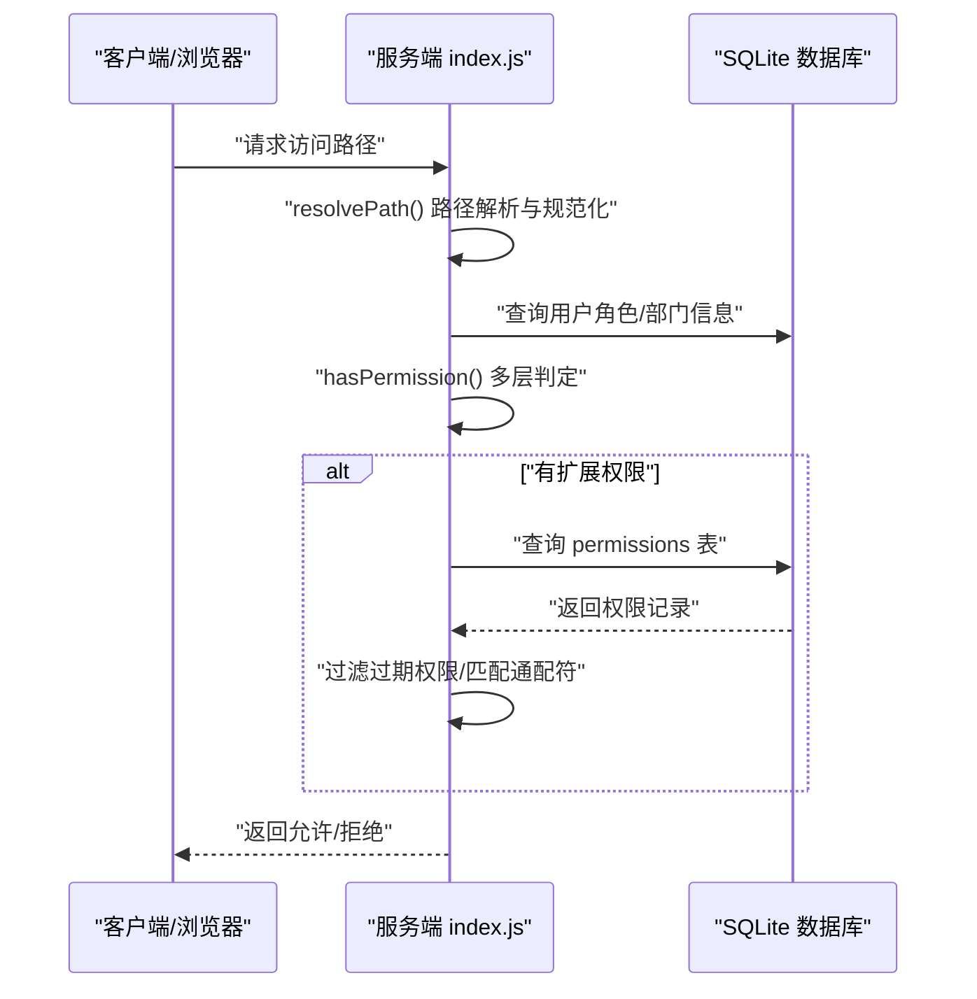
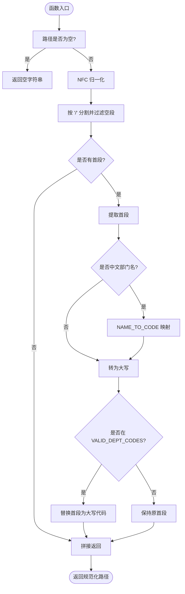
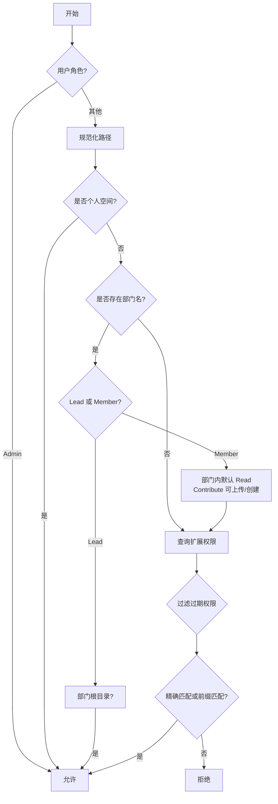
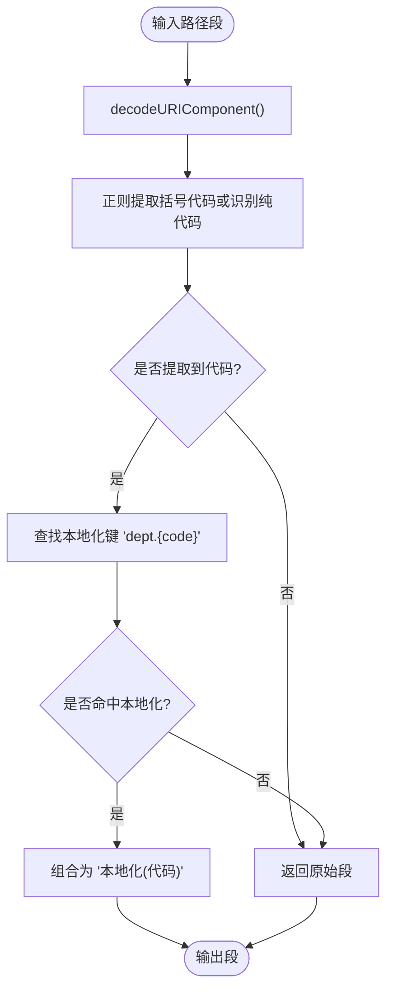
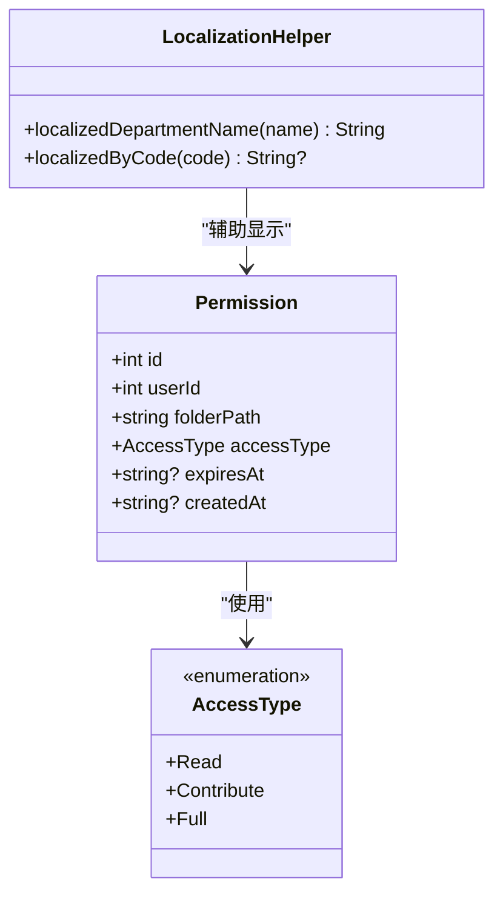
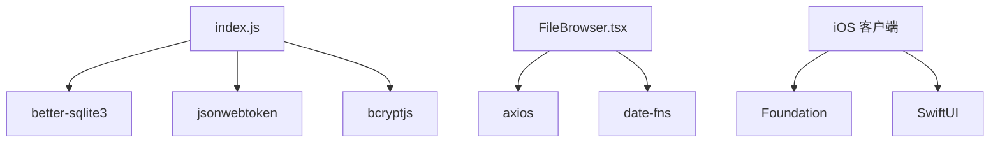

# 路径权限控制

<cite>
**本文引用的文件**
- [server/index.js](file://server/index.js)
- [client/src/utils/pathTranslator.ts](file://client/src/utils/pathTranslator.ts)
- [client/src/components/FileBrowser.tsx](file://client/src/components/FileBrowser.tsx)
- [ios/LonghornApp/Models/Permission.swift](file://ios/LonghornApp/Models/Permission.swift)
- [ios/LonghornApp/Models/Department+Extensions.swift](file://ios/LonghornApp/Models/Department+Extensions.swift)
- [ios/LonghornApp/Services/FileService.swift](file://ios/LonghornApp/Services/FileService.swift)
- [server/migrations/phase2.sql](file://server/migrations/phase2.sql)
- [docs/CONTRIBUTE_PERMISSION_IMPLEMENTATION.md](file://docs/CONTRIBUTE_PERMISSION_IMPLEMENTATION.md)
- [server/debug_logic_test.js](file://server/debug_logic_test.js)
</cite>

## 目录
1. [简介](#简介)
2. [项目结构](#项目结构)
3. [核心组件](#核心组件)
4. [架构总览](#架构总览)
5. [详细组件分析](#详细组件分析)
6. [依赖关系分析](#依赖关系分析)
7. [性能考量](#性能考量)
8. [故障排查指南](#故障排查指南)
9. [结论](#结论)
10. [附录](#附录)

## 简介
本文件面向 Longhorn 的路径权限控制系统，系统性阐述以下主题：
- 部门路径解析机制与中文部门名称到代码的映射规则
- 路径权限验证算法：部门路径匹配、个人空间路径验证、通配符权限支持
- 路径规范化处理、大小写转换与特殊字符处理
- 权限相关的数据库存储格式、索引策略与查询优化
- 动态权限更新机制与缓存失效策略

本技术文档兼顾前端、后端与 iOS 客户端的实现细节，帮助开发者与运维人员准确理解并维护权限体系。

## 项目结构
Longhorn 的权限控制由三层协同实现：
- 服务端（Node.js + better-sqlite3）：负责权限判定、路径解析、数据库访问与 API 提供
- 前端（React + TypeScript）：负责路径展示翻译、UI 导航与权限提示
- iOS 客户端（Swift）：负责本地化部门名称、权限模型与网络请求

图表来源
- [server/index.js](file://server/index.js#L232-L259)
- [client/src/utils/pathTranslator.ts](file://client/src/utils/pathTranslator.ts#L14-L52)
- [client/src/components/FileBrowser.tsx](file://client/src/components/FileBrowser.tsx#L296-L312)
- [ios/LonghornApp/Models/Permission.swift](file://ios/LonghornApp/Models/Permission.swift#L10-L26)
- [ios/LonghornApp/Models/Department+Extensions.swift](file://ios/LonghornApp/Models/Department+Extensions.swift#L19-L92)
- [server/migrations/phase2.sql](file://server/migrations/phase2.sql#L1-L32)

章节来源
- [server/index.js](file://server/index.js#L232-L259)
- [client/src/utils/pathTranslator.ts](file://client/src/utils/pathTranslator.ts#L14-L52)
- [client/src/components/FileBrowser.tsx](file://client/src/components/FileBrowser.tsx#L296-L312)
- [ios/LonghornApp/Models/Permission.swift](file://ios/LonghornApp/Models/Permission.swift#L10-L26)
- [ios/LonghornApp/Models/Department+Extensions.swift](file://ios/LonghornApp/Models/Department+Extensions.swift#L19-L92)
- [server/migrations/phase2.sql](file://server/migrations/phase2.sql#L1-L32)

## 核心组件
- 路径解析与规范化：服务端对请求路径进行 NFC 归一化、中文部门名到代码映射、大写标准化与首段校验
- 权限判定引擎：基于用户角色、部门归属、个人空间、扩展权限表进行多层判定
- 路径翻译工具：前端将“代码 (代码)”或纯代码的路径段翻译为本地化名称
- iOS 本地化与权限模型：iOS 将部门名本地化并支持权限枚举与授权目录显示
- 数据库存储与索引：权限表、星标表、分享表及其索引设计

章节来源
- [server/index.js](file://server/index.js#L232-L353)
- [client/src/utils/pathTranslator.ts](file://client/src/utils/pathTranslator.ts#L14-L52)
- [ios/LonghornApp/Models/Permission.swift](file://ios/LonghornApp/Models/Permission.swift#L4-L8)
- [ios/LonghornApp/Models/Department+Extensions.swift](file://ios/LonghornApp/Models/Department+Extensions.swift#L19-L92)
- [server/migrations/phase2.sql](file://server/migrations/phase2.sql#L1-L32)

## 架构总览
Longhorn 的权限控制遵循“服务端集中判定 + 客户端轻量展示”的模式。请求进入服务端后，先进行路径解析与规范化，再结合用户上下文与数据库中的权限规则进行判定；前端与 iOS 侧主要负责 UI 层的本地化与交互。

图表来源
- [server/index.js](file://server/index.js#L232-L353)
- [server/index.js](file://server/index.js#L341-L350)

## 详细组件分析

### 组件 A：路径解析与规范化（服务端）
职责：
- 对传入路径进行 NFC 归一化，确保中文字符编码一致
- 将首段中文部门名映射为部门代码
- 统一大写化首段并校验是否属于有效部门代码集合
- 返回规范化后的路径字符串

实现要点：
- 使用 NFC 归一化避免不同平台（Web/iOS）对中文编码差异导致的匹配失败
- 首段映射采用 NAME_TO_CODE，随后统一转为大写并校验 VALID_DEPT_CODES
- 输出路径去除多余斜杠，保证后续权限匹配一致性

图表来源
- [server/index.js](file://server/index.js#L232-L259)

章节来源
- [server/index.js](file://server/index.js#L232-L259)

### 组件 B：权限判定算法（服务端）
职责：
- 基于用户角色（Admin/Lead/Member）、部门归属、个人空间路径与扩展权限表进行判定
- 支持通配符匹配（folder_path 以“目录/”前缀匹配子路径）
- 过滤过期权限条目

判定流程：
- 管理员直接放行
- 个人空间：members/username 或其子路径一律放行
- 部门内路径：Lead 拥有根目录 Full 权限；Member 在部门内默认 Read，Contribute 可上传/创建，Full 需所有权
- 扩展权限：精确匹配或前缀匹配（LIKE “目录/%”），且未过期

图表来源
- [server/index.js](file://server/index.js#L300-L353)
- [server/index.js](file://server/index.js#L341-L350)

章节来源
- [server/index.js](file://server/index.js#L300-L353)
- [server/index.js](file://server/index.js#L341-L350)

### 组件 C：路径翻译与显示（前端）
职责：
- 将路径段中的“中文部门名 (代码)”或纯代码翻译为本地化名称
- 支持整条路径的分段翻译与连接

实现要点：
- 解码 URL 编码后提取括号内的代码，或识别长度为 2-3 且全为大写的纯代码
- 通过国际化键“dept.{code}”查找本地化名称
- 若未找到本地化映射，则回退为原始值

图表来源
- [client/src/utils/pathTranslator.ts](file://client/src/utils/pathTranslator.ts#L14-L52)

章节来源
- [client/src/utils/pathTranslator.ts](file://client/src/utils/pathTranslator.ts#L14-L52)

### 组件 D：iOS 本地化与权限模型
职责：
- 将“名称 (代码)”或纯代码的部门名本地化
- 支持根据代码或名称映射到本地化字符串
- 权限模型包含访问类型枚举（只读/贡献/完全）

实现要点：
- 正则提取括号内的代码，或识别纯代码
- 通过本地化资源包查找“dept.{code}”
- 权限结构体与后端 permissions 表字段对应，便于前后端一致性

图表来源
- [ios/LonghornApp/Models/Permission.swift](file://ios/LonghornApp/Models/Permission.swift#L4-L8)
- [ios/LonghornApp/Models/Permission.swift](file://ios/LonghornApp/Models/Permission.swift#L10-L26)
- [ios/LonghornApp/Models/Department+Extensions.swift](file://ios/LonghornApp/Models/Department+Extensions.swift#L19-L92)

章节来源
- [ios/LonghornApp/Models/Permission.swift](file://ios/LonghornApp/Models/Permission.swift#L4-L8)
- [ios/LonghornApp/Models/Permission.swift](file://ios/LonghornApp/Models/Permission.swift#L10-L26)
- [ios/LonghornApp/Models/Department+Extensions.swift](file://ios/LonghornApp/Models/Department+Extensions.swift#L19-L92)

### 组件 E：数据库存储与索引策略
权限相关表与索引：
- permissions：用户权限记录，支持精确匹配与前缀匹配（LIKE “目录/%”）
- starred_files：用户星标文件，含 user_id 与 file_path 索引
- share_links：分享链接，含 share_token 与 user_id 索引

查询优化建议：
- 为 permissions.folder_path 建立前缀索引（若 SQLite 支持）或使用 LIKE “目录/%” 的前缀扫描
- 为 permissions.user_id 建立索引以加速用户权限查询
- 为 starred_files.user_id 与 file_path 建立复合索引以提升星标查询性能

章节来源
- [server/migrations/phase2.sql](file://server/migrations/phase2.sql#L1-L32)

### 组件 F：动态权限更新与缓存失效
动态权限更新：
- 管理员/部门主管可通过接口为用户授予 Read/Contribute/Full 权限，支持设置过期时间
- 授权目录支持前缀匹配，满足“目录/”下的通配符权限

缓存与一致性：
- 服务端 hasPermission 查询数据库，避免内存缓存导致的权限陈旧
- 前端 FileBrowser 通过 SWR 等机制刷新文件列表，间接保证 UI 与权限状态一致
- iOS 侧通过 API 获取最新权限列表与本地化名称

章节来源
- [server/index.js](file://server/index.js#L1031-L1051)
- [server/index.js](file://server/index.js#L1155-L1169)
- [client/src/components/FileBrowser.tsx](file://client/src/components/FileBrowser.tsx#L96-L102)
- [ios/LonghornApp/Services/FileService.swift](file://ios/LonghornApp/Services/FileService.swift#L46-L49)

## 依赖关系分析
- 服务端依赖：
  - better-sqlite3：数据库访问
  - jwt：认证令牌验证
  - bcryptjs：密码哈希比对
- 前端依赖：
  - axios：HTTP 请求
  - lucide-react：图标
  - date-fns：日期格式化
- iOS 依赖：
  - Foundation：本地化与正则
  - SwiftUI：UI 展示

图表来源
- [server/index.js](file://server/index.js#L1-L14)
- [client/src/components/FileBrowser.tsx](file://client/src/components/FileBrowser.tsx#L1-L41)
- [ios/LonghornApp/Services/FileService.swift](file://ios/LonghornApp/Services/FileService.swift#L8-L14)

章节来源
- [server/index.js](file://server/index.js#L1-L14)
- [client/src/components/FileBrowser.tsx](file://client/src/components/FileBrowser.tsx#L1-L41)
- [ios/LonghornApp/Services/FileService.swift](file://ios/LonghornApp/Services/FileService.swift#L8-L14)

## 性能考量
- 路径解析成本低，主要为字符串处理与一次数据库查询（用户信息）
- 权限判定查询 permissions 表时，建议：
  - 为 user_id 建立索引
  - 为 folder_path 建立前缀索引或使用 LIKE “目录/%” 的前缀扫描
- 前端与 iOS 侧尽量减少重复请求，利用缓存与增量刷新
- 大规模权限变更时，建议批量更新并触发受影响用户的权限缓存失效

## 故障排查指南
常见问题与定位方法：
- 路径无法匹配：
  - 检查路径是否经过 NFC 归一化，中文部门名是否正确映射为代码
  - 确认首段是否为有效部门代码
- 权限判定异常：
  - 使用调试端点查看路径解析与权限判定结果
  - 检查 permissions 表中是否存在过期记录
- 本地化显示异常：
  - 确认国际化键“dept.{code}”是否存在
  - iOS 侧检查本地化资源包与语言偏好设置

章节来源
- [server/index.js](file://server/index.js#L758-L790)
- [server/debug_logic_test.js](file://server/debug_logic_test.js#L43-L80)

## 结论
Longhorn 的路径权限控制通过“服务端集中判定 + 客户端轻量展示”的架构实现了跨平台的一致性。服务端的路径解析与权限判定逻辑清晰、可扩展性强；前端与 iOS 侧分别承担本地化与交互职责。配合合理的数据库索引与动态权限更新机制，系统能够在保证安全性的前提下提供良好的用户体验。

## 附录
- 中文部门名到代码映射参考：
  - 运营部 → OP
  - 市场部 → MS
  - 研发部 → RD
  - 综合管理 → GE
  - 通用台面 → RE
- 有效部门代码集合：
  - OP、MS、RD、RE、MEMBERS

章节来源
- [server/index.js](file://server/index.js#L222-L230)
- [server/index.js](file://server/index.js#L121-L122)