# JWT 令牌认证机制

<cite>
**本文档引用的文件**
- [useAuthStore.ts](file://client/src/store/useAuthStore.ts)
- [Login.tsx](file://client/src/components/Login.tsx)
- [AuthManager.swift](file://ios/LonghornApp/Services/AuthManager.swift)
- [APIClient.swift](file://ios/LonghornApp/Services/APIClient.swift)
- [LoginView.swift](file://ios/LonghornApp/Views/Auth/LoginView.swift)
- [index.js](file://server/index.js)
- [.env.production](file://client/.env.production)
- [package.json](file://server/package.json)
</cite>

## 目录
1. [简介](#简介)
2. [项目结构](#项目结构)
3. [核心组件](#核心组件)
4. [架构概览](#架构概览)
5. [详细组件分析](#详细组件分析)
6. [依赖关系分析](#依赖关系分析)
7. [性能考虑](#性能考虑)
8. [故障排除指南](#故障排除指南)
9. [结论](#结论)

## 简介

本项目实现了基于 JSON Web Token (JWT) 的完整认证机制，涵盖前端 React Zustand 状态管理和 iOS Keychain Services 存储。该系统提供了从用户登录到令牌验证、过期处理和自动登出的完整生命周期管理。

## 项目结构

项目采用前后端分离架构，认证逻辑分布在三个主要层面：

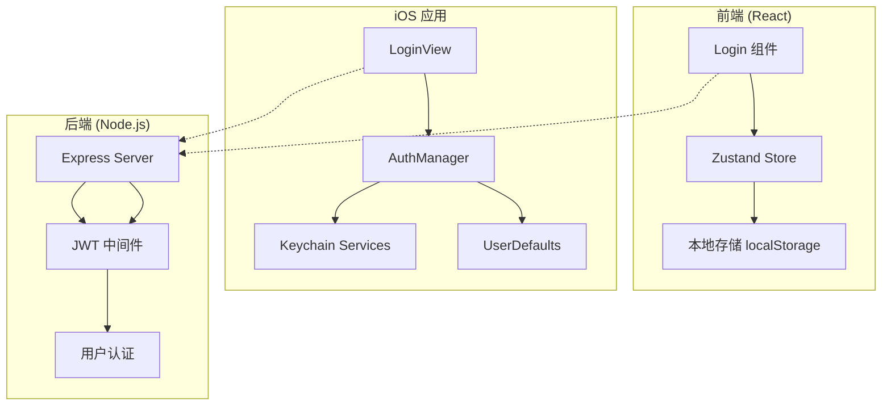

**图表来源**
- [Login.tsx](file://client/src/components/Login.tsx#L15-L27)
- [AuthManager.swift](file://ios/LonghornApp/Services/AuthManager.swift#L43-L69)
- [index.js](file://server/index.js#L267-L295)

**章节来源**
- [useAuthStore.ts](file://client/src/store/useAuthStore.ts#L1-L31)
- [AuthManager.swift](file://ios/LonghornApp/Services/AuthManager.swift#L1-L195)
- [index.js](file://server/index.js#L683-L713)

## 核心组件

### 前端认证状态管理

前端使用 Zustand 实现轻量级状态管理，提供响应式的认证状态：

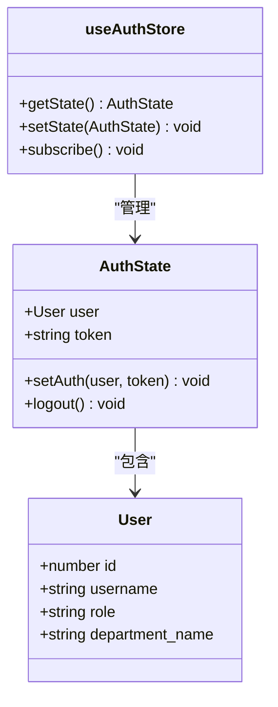

**图表来源**
- [useAuthStore.ts](file://client/src/store/useAuthStore.ts#L3-L15)

### iOS 认证管理器

iOS 平台使用 ObservableObject 设计模式实现认证管理：

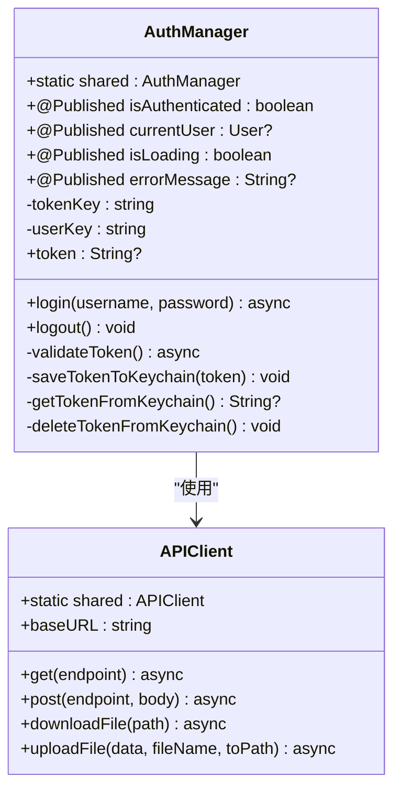

**图表来源**
- [AuthManager.swift](file://ios/LonghornApp/Services/AuthManager.swift#L11-L34)
- [APIClient.swift](file://ios/LonghornApp/Services/APIClient.swift#L38-L64)

**章节来源**
- [useAuthStore.ts](file://client/src/store/useAuthStore.ts#L17-L30)
- [AuthManager.swift](file://ios/LonghornApp/Services/AuthManager.swift#L13-L39)

## 架构概览

整个认证系统的交互流程如下：

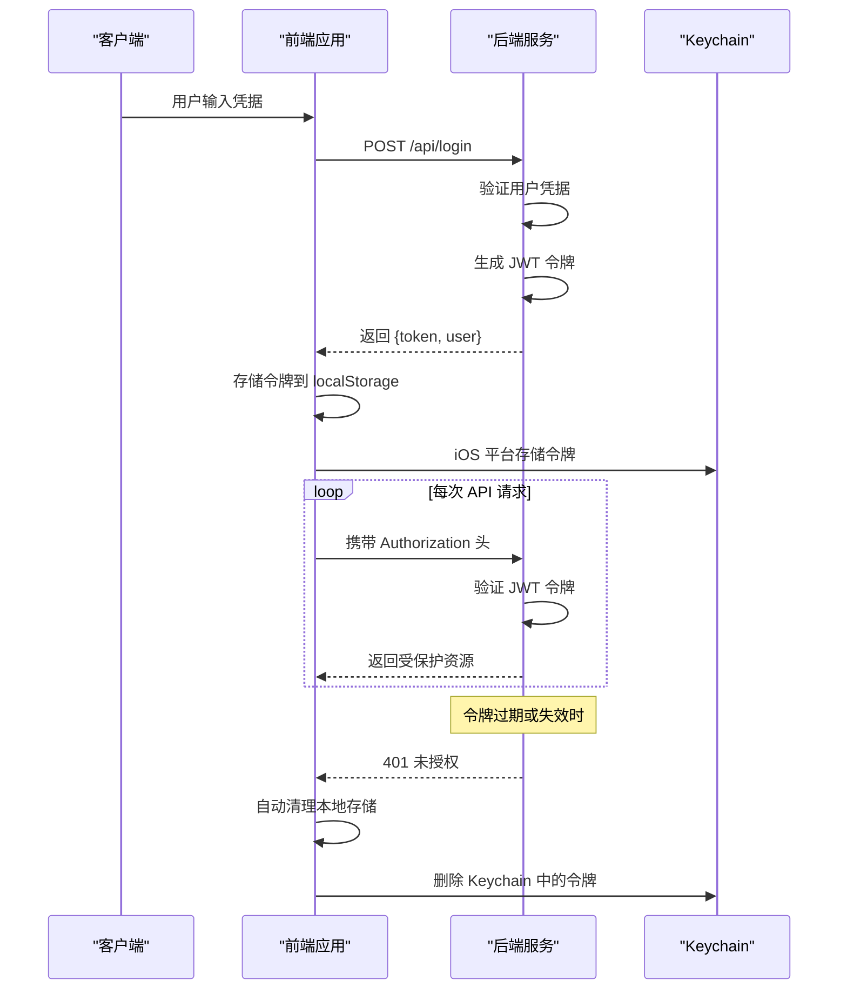

**图表来源**
- [Login.tsx](file://client/src/components/Login.tsx#L15-L27)
- [AuthManager.swift](file://ios/LonghornApp/Services/AuthManager.swift#L43-L69)
- [APIClient.swift](file://ios/LonghornApp/Services/APIClient.swift#L263-L266)

## 详细组件分析

### JWT 生成与验证流程

#### 后端 JWT 实现

后端使用 jsonwebtoken 库实现 JWT 的生成和验证：

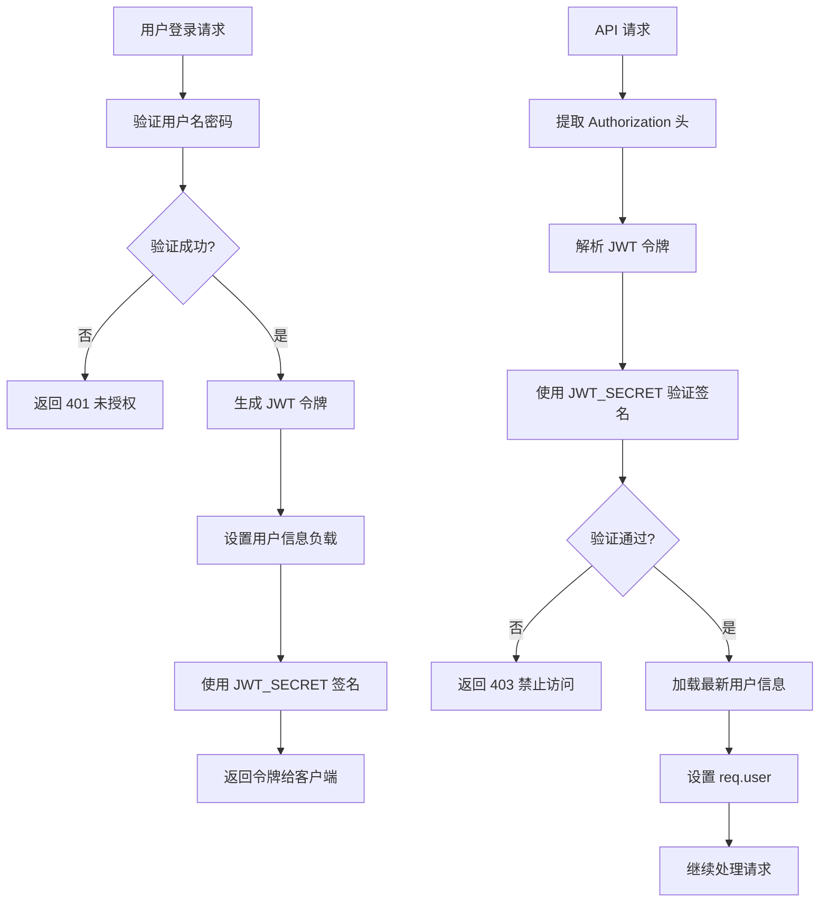

**图表来源**
- [index.js](file://server/index.js#L684-L713)
- [index.js](file://server/index.js#L267-L295)

#### 前端令牌存储策略

前端使用 localStorage 进行持久化存储：

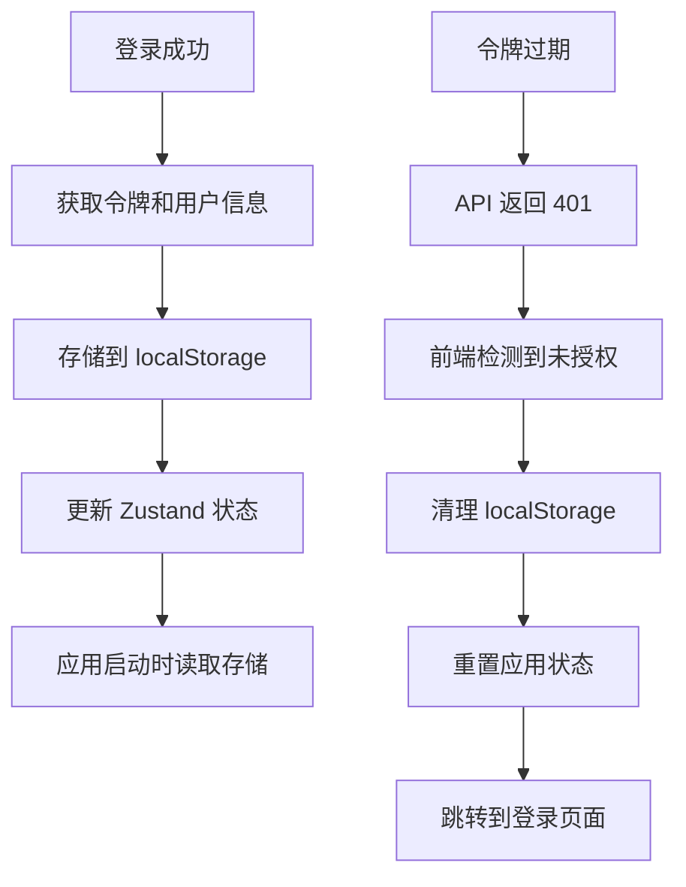

**图表来源**
- [useAuthStore.ts](file://client/src/store/useAuthStore.ts#L17-L30)

#### iOS 令牌存储策略

iOS 使用 Keychain Services 提供最高级别的安全存储：

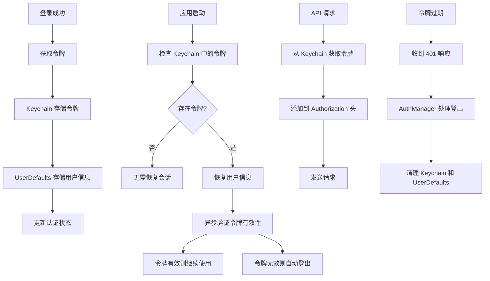

**图表来源**
- [AuthManager.swift](file://ios/LonghornApp/Services/AuthManager.swift#L93-L123)
- [AuthManager.swift](file://ios/LonghornApp/Services/AuthManager.swift#L134-L180)

**章节来源**
- [index.js](file://server/index.js#L21-L21)
- [index.js](file://server/index.js#L694-L694)
- [useAuthStore.ts](file://client/src/store/useAuthStore.ts#L18-L29)
- [AuthManager.swift](file://ios/LonghornApp/Services/AuthManager.swift#L134-L180)

### JWT_SECRET 配置与安全存储

#### 环境变量配置

JWT_SECRET 作为敏感配置项，需要通过环境变量进行管理：

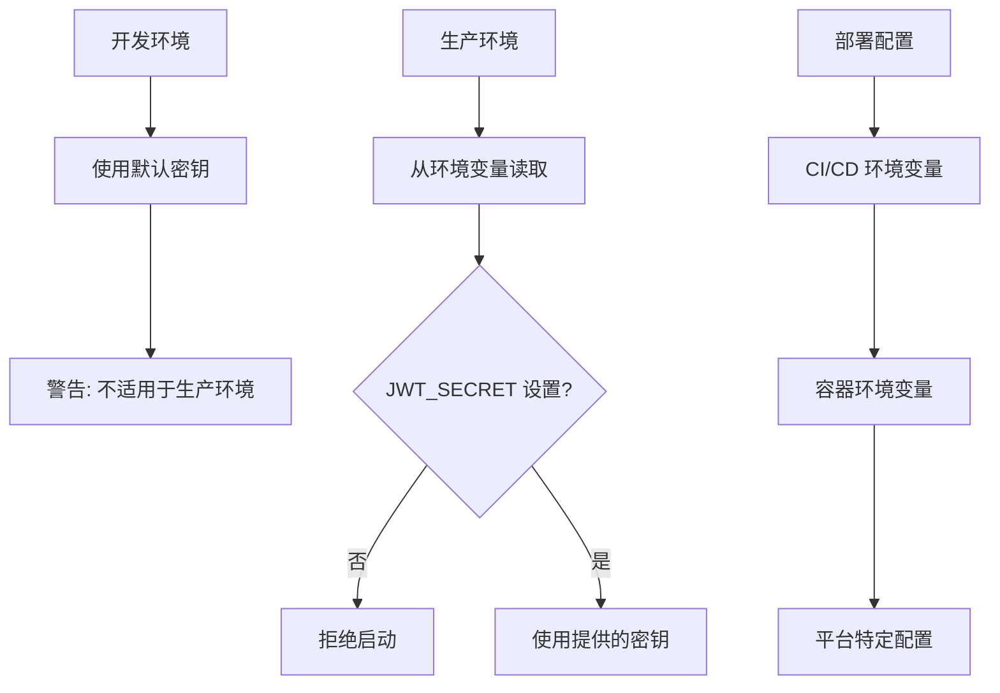

**图表来源**
- [index.js](file://server/index.js#L21-L21)

#### 安全最佳实践

1. **密钥强度**: 使用至少 32 字符的随机字符串
2. **密钥轮换**: 定期更换 JWT_SECRET
3. **环境隔离**: 开发、测试、生产环境使用不同密钥
4. **访问控制**: 限制对密钥文件的访问权限

**章节来源**
- [index.js](file://server/index.js#L21-L21)

### 令牌生命周期管理

#### 完整认证流程

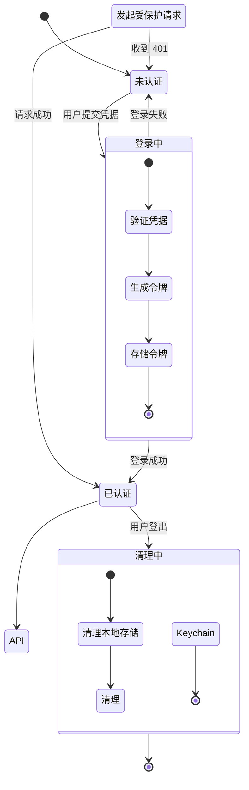

**图表来源**
- [Login.tsx](file://client/src/components/Login.tsx#L15-L27)
- [AuthManager.swift](file://ios/LonghornApp/Services/AuthManager.swift#L71-L89)

#### 自动刷新机制

当前实现采用被动验证策略，当 API 返回 401 时自动触发登出：

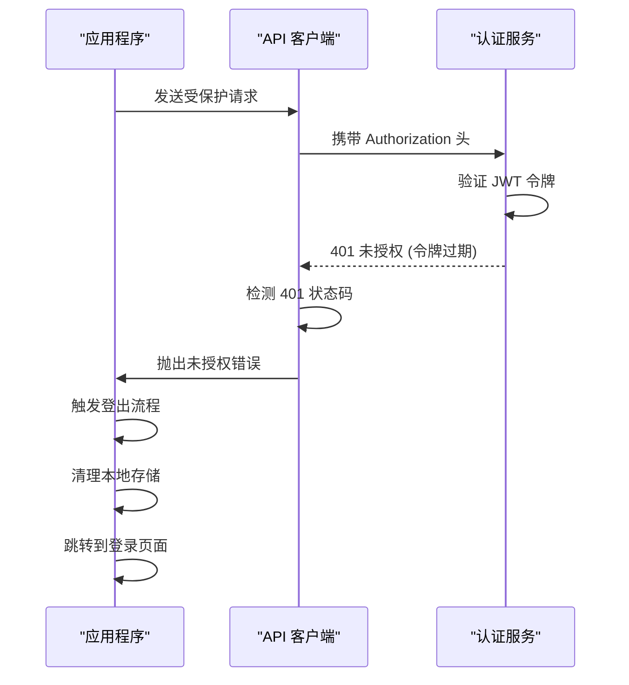

**图表来源**
- [APIClient.swift](file://ios/LonghornApp/Services/APIClient.swift#L287-L293)

**章节来源**
- [APIClient.swift](file://ios/LonghornApp/Services/APIClient.swift#L263-L315)
- [AuthManager.swift](file://ios/LonghornApp/Services/AuthManager.swift#L114-L123)

### 错误处理策略

#### 前端错误处理

前端使用 axios 进行 API 调用，统一处理认证相关的错误：

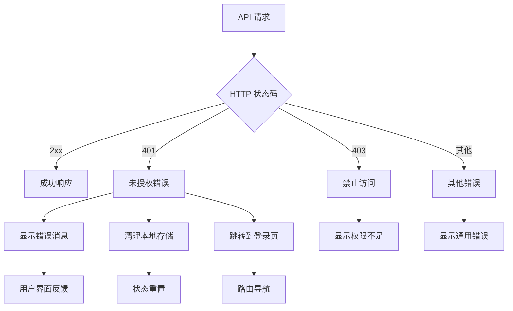

**图表来源**
- [Login.tsx](file://client/src/components/Login.tsx#L20-L26)

#### iOS 错误处理

iOS 平台使用自定义错误类型进行精细的错误分类：

```mermaid
flowchart TD
A[网络请求] --> B{响应状态}
B --> |2xx| C[成功处理]
B --> |401| D[未授权处理]
B --> |4xx| E[客户端错误]
B --> |5xx| F[服务器错误]
D --> G[AuthManager.logout()]
D --> H[显示错误消息]
D --> I[清理 Keychain]
E --> J[解析具体错误]
F --> K[重试机制]
G --> L[应用状态重置]
H --> M[用户界面更新]
I --> N[会话清理完成]
```

**图表来源**
- [APIClient.swift](file://ios/LonghornApp/Services/APIClient.swift#L11-L35)
- [APIClient.swift](file://ios/LonghornApp/Services/APIClient.swift#L287-L315)

**章节来源**
- [Login.tsx](file://client/src/components/Login.tsx#L20-L26)
- [APIClient.swift](file://ios/LonghornApp/Services/APIClient.swift#L11-L35)

## 依赖关系分析

### 技术栈依赖

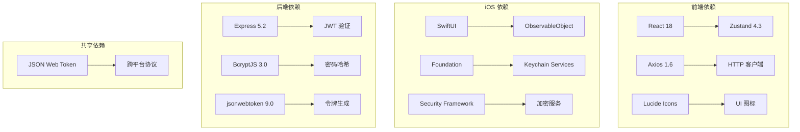

**图表来源**
- [package.json](file://server/package.json#L15-L28)
- [AuthManager.swift](file://ios/LonghornApp/Services/AuthManager.swift#L8-L9)

### 关键依赖关系

1. **前端状态管理**: Zustand 提供轻量级状态管理，替代 Redux
2. **iOS 存储**: Keychain Services 提供安全的令牌存储
3. **后端验证**: Express 中间件统一处理 JWT 验证
4. **网络通信**: Axios 和自定义 APIClient 处理 HTTP 请求

**章节来源**
- [package.json](file://server/package.json#L15-L28)
- [AuthManager.swift](file://ios/LonghornApp/Services/AuthManager.swift#L8-L9)

## 性能考虑

### 前端性能优化

1. **状态更新**: 使用 Zustand 的选择器避免不必要的重渲染
2. **本地存储**: localStorage 读写操作在主线程执行，注意性能影响
3. **内存管理**: 及时清理过期的认证状态和事件监听器

### iOS 性能优化

1. **Keychain 访问**: Keychain 操作异步执行，避免阻塞主线程
2. **缓存策略**: UserDefaults 用于存储用户信息，减少 Keychain 访问频率
3. **并发处理**: 使用 async/await 确保异步操作的正确性

### 后端性能优化

1. **JWT 验证**: 使用内存缓存减少重复的令牌验证开销
2. **数据库查询**: 在认证中间件中只查询必要的用户信息
3. **连接池**: 合理配置数据库连接池以提高并发性能

## 故障排除指南

### 常见问题诊断

#### 令牌验证失败

**症状**: API 返回 403 禁止访问或 401 未授权

**排查步骤**:
1. 检查 JWT_SECRET 配置是否正确
2. 验证令牌格式是否符合 JWT 标准
3. 确认令牌签名算法匹配
4. 检查令牌过期时间设置

#### 本地存储问题

**症状**: 登录后无法保持会话状态

**排查步骤**:
1. 检查浏览器是否禁用 localStorage
2. 验证存储键名是否一致
3. 确认存储的数据格式正确
4. 检查跨域存储限制

#### iOS Keychain 访问问题

**症状**: 令牌无法保存或读取

**排查步骤**:
1. 检查 Keychain 权限设置
2. 验证 Bundle Identifier 配置
3. 确认 Keychain Sharing 配置
4. 检查设备兼容性支持

### 调试工具

#### 前端调试

1. 使用浏览器开发者工具查看 Network 面板
2. 检查 Application 面板中的 localStorage 内容
3. 使用 React DevTools 检查状态更新

#### iOS 调试

1. 使用 Xcode Console 查看日志输出
2. 检查 Keychain Access 工具中的存储项
3. 使用 LLDB 断点调试认证流程

**章节来源**
- [AuthManager.swift](file://ios/LonghornApp/Services/AuthManager.swift#L94-L123)
- [APIClient.swift](file://ios/LonghornApp/Services/APIClient.swift#L287-L315)

## 结论

本项目的 JWT 认证机制实现了跨平台的一致性体验，通过合理的状态管理和安全存储策略，为用户提供了可靠的认证保障。前端使用 Zustand 实现轻量级状态管理，iOS 使用 Keychain Services 提供最高级别的安全存储，后端通过 Express 中间件统一处理认证逻辑。

### 最佳实践总结

1. **安全性优先**: iOS 平台使用 Keychain Services 存储令牌，前端使用 localStorage 作为后备方案
2. **错误处理**: 统一的错误处理机制确保用户体验的一致性
3. **性能优化**: 合理的状态管理和异步操作避免性能瓶颈
4. **可维护性**: 清晰的代码结构和模块化设计便于后续维护和扩展

### 未来改进建议

1. **实现主动刷新**: 添加令牌自动刷新机制，减少用户频繁登录
2. **多因素认证**: 集成额外的安全层，如生物识别认证
3. **审计日志**: 添加详细的认证活动记录，便于安全审计
4. **令牌撤销**: 实现令牌撤销机制，支持即时吊销失效令牌