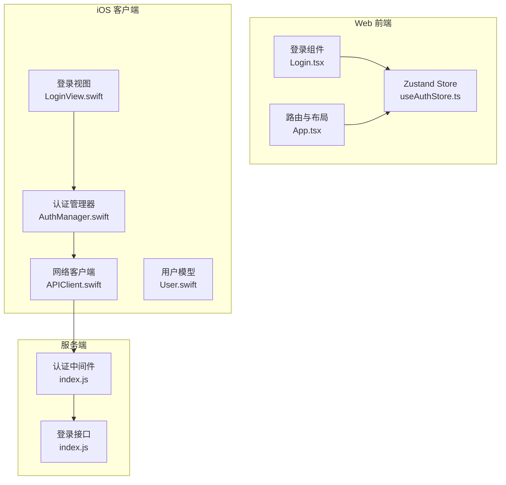
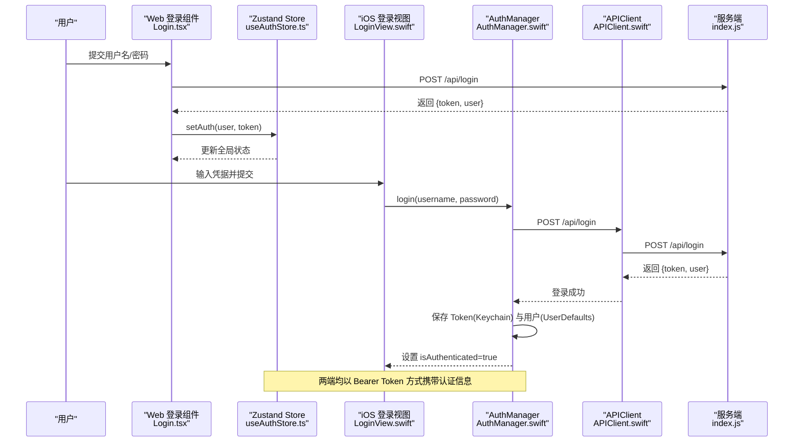
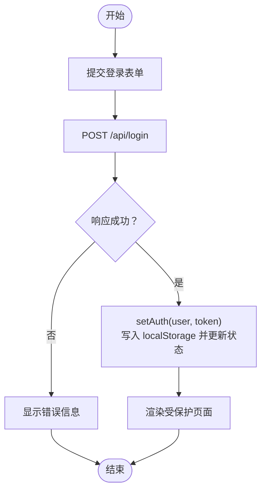
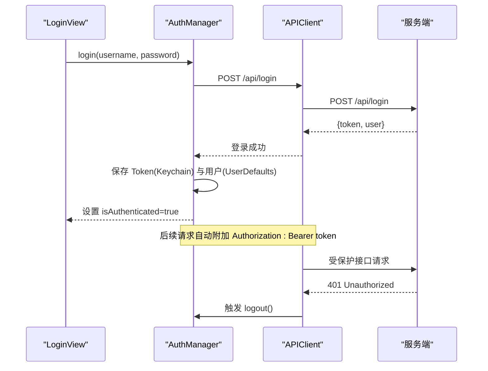
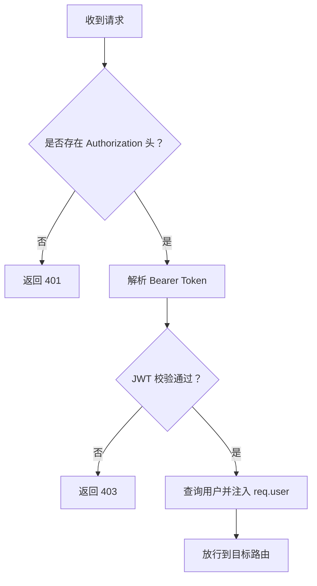
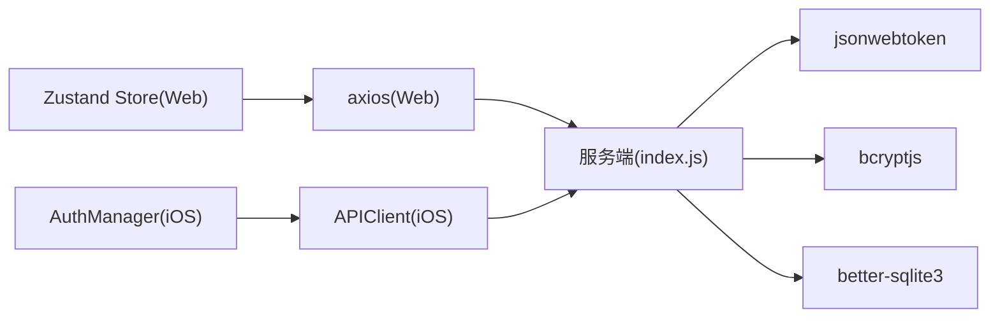

# 会话管理与状态维护

<cite>
**本文引用的文件**
- [useAuthStore.ts](file://client/src/store/useAuthStore.ts)
- [Login.tsx](file://client/src/components/Login.tsx)
- [App.tsx](file://client/src/App.tsx)
- [AuthManager.swift](file://ios/LonghornApp/Services/AuthManager.swift)
- [APIClient.swift](file://ios/LonghornApp/Services/APIClient.swift)
- [LoginView.swift](file://ios/LonghornApp/Views/Auth/LoginView.swift)
- [User.swift](file://ios/LonghornApp/Models/User.swift)
- [index.js](file://server/index.js)
- [package.json](file://server/package.json)
</cite>

## 目录
1. [引言](#引言)
2. [项目结构](#项目结构)
3. [核心组件](#核心组件)
4. [架构总览](#架构总览)
5. [组件详解](#组件详解)
6. [依赖关系分析](#依赖关系分析)
7. [性能考量](#性能考量)
8. [故障排查指南](#故障排查指南)
9. [结论](#结论)

## 引言
本文件系统性梳理 Longhorn 应用在 Web（React + Vite）与 iOS 平台上的“会话管理与状态维护”方案，覆盖以下主题：
- 用户会话的创建、维护与销毁流程
- 认证中间件与请求拦截机制
- 前端状态管理（Zustand Store）与 iOS 会话状态同步策略
- 会话超时处理、多设备登录管理与并发会话控制
- 会话安全策略、状态持久化与异常恢复机制

## 项目结构
Longhorn 的会话相关实现横跨三端：Web 前端使用 Zustand 进行状态管理；iOS 使用自研 AuthManager 与 APIClient；服务端通过 JWT 中间件进行鉴权。

**图表来源**
- [useAuthStore.ts](file://client/src/store/useAuthStore.ts#L1-L31)
- [Login.tsx](file://client/src/components/Login.tsx#L1-L161)
- [App.tsx](file://client/src/App.tsx#L66-L126)
- [AuthManager.swift](file://ios/LonghornApp/Services/AuthManager.swift#L1-L195)
- [APIClient.swift](file://ios/LonghornApp/Services/APIClient.swift#L1-L326)
- [LoginView.swift](file://ios/LonghornApp/Views/Auth/LoginView.swift#L1-L345)
- [User.swift](file://ios/LonghornApp/Models/User.swift#L1-L85)
- [index.js](file://server/index.js#L267-L295)
- [index.js](file://server/index.js#L684-L713)

**章节来源**
- [useAuthStore.ts](file://client/src/store/useAuthStore.ts#L1-L31)
- [AuthManager.swift](file://ios/LonghornApp/Services/AuthManager.swift#L1-L195)
- [APIClient.swift](file://ios/LonghornApp/Services/APIClient.swift#L1-L326)
- [index.js](file://server/index.js#L267-L295)

## 核心组件
- Web 前端会话状态
  - Zustand Store：负责用户信息与令牌的本地存储与全局状态更新，提供 setAuth 与 logout 方法。
- iOS 会话状态
  - AuthManager：负责登录、登出、Token 与用户信息持久化（Keychain/UserDefaults）、会话恢复与失效校验。
  - APIClient：统一发起请求并在 401 时触发登出与错误提示。
- 服务端认证中间件
  - authenticate 中间件：从 Authorization 头解析 JWT，校验并注入用户信息；受保护路由均需通过该中间件。

**章节来源**
- [useAuthStore.ts](file://client/src/store/useAuthStore.ts#L10-L30)
- [AuthManager.swift](file://ios/LonghornApp/Services/AuthManager.swift#L13-L123)
- [APIClient.swift](file://ios/LonghornApp/Services/APIClient.swift#L68-L315)
- [index.js](file://server/index.js#L267-L295)

## 架构总览
下图展示从登录到请求拦截的整体流程，以及两端与服务端的交互关系。

**图表来源**
- [Login.tsx](file://client/src/components/Login.tsx#L15-L27)
- [useAuthStore.ts](file://client/src/store/useAuthStore.ts#L20-L24)
- [LoginView.swift](file://ios/LonghornApp/Views/Auth/LoginView.swift#L277-L281)
- [AuthManager.swift](file://ios/LonghornApp/Services/AuthManager.swift#L44-L69)
- [APIClient.swift](file://ios/LonghornApp/Services/APIClient.swift#L75-L88)
- [index.js](file://server/index.js#L684-L713)

## 组件详解

### Web 前端：Zustand Store 与登录流程
- 状态模型
  - user：当前用户对象或空
  - token：当前访问令牌或空
  - setAuth：写入 localStorage 并更新状态
  - logout：移除 localStorage 并清空状态
- 登录流程
  - 登录组件调用后端 /api/login，成功后通过 setAuth 写入本地存储与状态。
- 路由守卫
  - App 路由层根据是否存在 user 与 role 决定是否渲染受保护页面或跳转至登录页。

**图表来源**
- [Login.tsx](file://client/src/components/Login.tsx#L15-L27)
- [useAuthStore.ts](file://client/src/store/useAuthStore.ts#L20-L29)
- [App.tsx](file://client/src/App.tsx#L75-L84)

**章节来源**
- [useAuthStore.ts](file://client/src/store/useAuthStore.ts#L10-L30)
- [Login.tsx](file://client/src/components/Login.tsx#L15-L27)
- [App.tsx](file://client/src/App.tsx#L75-L84)

### iOS：AuthManager 与 APIClient
- AuthManager
  - 登录：调用 APIClient.post("/api/login")，成功后将 token 写入 Keychain，用户信息写入 UserDefaults，并设置 isAuthenticated。
  - 登出：清除 token、用户信息，清理各 Store 缓存，发送登出事件。
  - 会话恢复：启动时若存在 token，则尝试从 UserDefaults 恢复用户并异步调用 /api/user/stats 验证有效性，失败则自动登出。
- APIClient
  - 统一构建请求：自动添加 Bearer Token 头。
  - 请求拦截：当响应为 401 时，立即在主线程触发 AuthManager.logout() 并抛出 APIError.unauthorized。

**图表来源**
- [AuthManager.swift](file://ios/LonghornApp/Services/AuthManager.swift#L44-L89)
- [APIClient.swift](file://ios/LonghornApp/Services/APIClient.swift#L263-L315)
- [index.js](file://server/index.js#L267-L295)

**章节来源**
- [AuthManager.swift](file://ios/LonghornApp/Services/AuthManager.swift#L44-L123)
- [APIClient.swift](file://ios/LonghornApp/Services/APIClient.swift#L68-L110)
- [APIClient.swift](file://ios/LonghornApp/Services/APIClient.swift#L263-L315)

### 服务端：认证中间件与登录接口
- 认证中间件 authenticate
  - 从 Authorization 头解析 Bearer Token，使用 JWT_SECRET 校验；
  - 校验通过后从数据库加载最新用户信息（含部门名等），注入 req.user 并放行；
  - 无头或校验失败返回 401/403。
- 登录接口 /api/login
  - 校验用户名与密码，成功后签发 JWT，同时确保用户个人目录存在。

**图表来源**
- [index.js](file://server/index.js#L267-L295)
- [index.js](file://server/index.js#L684-L713)

**章节来源**
- [index.js](file://server/index.js#L267-L295)
- [index.js](file://server/index.js#L684-L713)

### 会话超时处理
- Web 端
  - 通过路由守卫与 axios 请求头携带 token 实现；若服务端返回 401，需要在前端捕获并引导登出（当前 App.tsx 中未见对 401 的专门拦截逻辑，建议在全局请求拦截器中增加 401 处理）。
- iOS 端
  - APIClient 已内置 401 自动登出逻辑，确保会话异常时快速恢复到未登录状态。

**章节来源**
- [App.tsx](file://client/src/App.tsx#L134-L150)
- [APIClient.swift](file://ios/LonghornApp/Services/APIClient.swift#L287-L293)

### 多设备登录管理与并发会话控制
- 当前实现
  - 服务端未见针对“多设备登录”或“并发会话上限”的显式控制逻辑；登录即签发新 JWT，未对旧令牌做失效处理。
- 建议策略
  - 服务端引入“设备/会话维度”的令牌黑名单或签发时间戳校验；
  - 前端在登录成功后可选择性地清理历史会话（如 Keychain/LocalStorage）或提示用户仅保留一个活跃会话。

**章节来源**
- [index.js](file://server/index.js#L693-L701)
- [AuthManager.swift](file://ios/LonghornApp/Services/AuthManager.swift#L52-L56)

### 会话安全策略
- 传输安全
  - 服务端使用 JWT 校验；建议配合 HTTPS 与短有效期令牌（结合刷新机制）。
- 令牌存储
  - iOS：Token 存储于 Keychain（更安全）；用户信息存储于 UserDefaults。
  - Web：Token 与用户信息存储于 localStorage（相对不安全，建议迁移到 HttpOnly Cookie 或内存态）。
- 请求拦截
  - iOS：统一在 APIClient 中附加 Authorization 头并在 401 时自动登出。
  - Web：当前登录成功后写入状态与本地存储，建议在全局请求拦截器中统一处理 401。

**章节来源**
- [AuthManager.swift](file://ios/LonghornApp/Services/AuthManager.swift#L134-L180)
- [APIClient.swift](file://ios/LonghornApp/Services/APIClient.swift#L263-L315)
- [useAuthStore.ts](file://client/src/store/useAuthStore.ts#L18-L29)

### 状态持久化与异常恢复
- iOS
  - 启动时检查 Keychain 是否存在 token，若有则从 UserDefaults 恢复用户并异步调用 /api/user/stats 验证有效性，失败则自动登出。
- Web
  - 页面刷新后从 localStorage 恢复 user 与 token，但未见自动验证流程；建议在应用初始化阶段发起一次受保护接口请求以验证令牌有效性。

**章节来源**
- [AuthManager.swift](file://ios/LonghornApp/Services/AuthManager.swift#L94-L123)
- [useAuthStore.ts](file://client/src/store/useAuthStore.ts#L18-L19)

## 依赖关系分析
- 前端依赖
  - React + Vite（运行时环境）
  - axios（Web 端请求）
  - zustand（状态管理）
- iOS 依赖
  - APIClient 依赖 AuthManager 的 token；AuthManager 依赖 Keychain 与 UserDefaults。
- 服务端依赖
  - express、jsonwebtoken、bcryptjs、better-sqlite3 等。

**图表来源**
- [package.json](file://server/package.json#L15-L28)
- [APIClient.swift](file://ios/LonghornApp/Services/APIClient.swift#L38-L64)
- [AuthManager.swift](file://ios/LonghornApp/Services/AuthManager.swift#L13-L39)

**章节来源**
- [package.json](file://server/package.json#L15-L28)
- [APIClient.swift](file://ios/LonghornApp/Services/APIClient.swift#L38-L64)
- [AuthManager.swift](file://ios/LonghornApp/Services/AuthManager.swift#L13-L39)

## 性能考量
- 请求头统一注入与 401 自动登出，减少重复判断逻辑，提升一致性与可维护性。
- iOS 使用 Keychain 存储 Token，避免明文落盘，降低被窃取风险。
- Web 端建议将敏感信息迁移至 HttpOnly Cookie，避免 XSS 风险与 localStorage 泄露。

## 故障排查指南
- 登录后无法进入受保护页面（Web）
  - 检查 setAuth 是否正确写入 localStorage 与状态；确认 App 路由守卫逻辑是否生效。
- iOS 登录后仍提示未登录
  - 检查 Keychain 是否成功写入 token；UserDefaults 是否成功写入用户信息；确认 /api/user/stats 验证是否通过。
- 请求返回 401
  - iOS：APIClient 已自动登出，检查网络与服务端 JWT 配置。
  - Web：建议在全局请求拦截器中增加 401 处理，统一跳转登录页。
- 会话异常或多设备冲突
  - 服务端尚未实现并发会话控制，建议引入令牌黑名单或签发时间戳校验。

**章节来源**
- [App.tsx](file://client/src/App.tsx#L75-L84)
- [AuthManager.swift](file://ios/LonghornApp/Services/AuthManager.swift#L114-L123)
- [APIClient.swift](file://ios/LonghornApp/Services/APIClient.swift#L287-L293)

## 结论
Longhorn 在三端实现了基础的会话生命周期管理：Web 使用 Zustand 管理状态，iOS 使用 AuthManager 与 APIClient 统一处理认证与拦截，服务端通过 JWT 中间件保障受保护接口的安全访问。为进一步增强安全性与用户体验，建议：
- Web 端引入全局请求拦截器处理 401；
- 服务端引入并发会话控制与令牌黑名单；
- Web 端将敏感信息迁移至 HttpOnly Cookie；
- 在应用初始化阶段统一验证会话有效性。