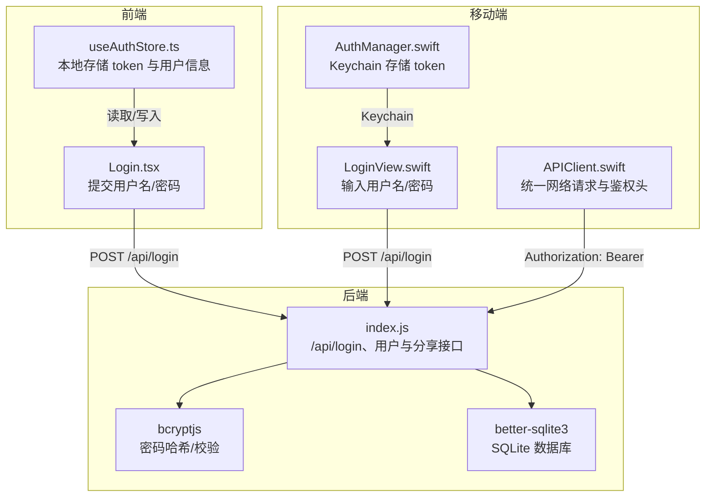
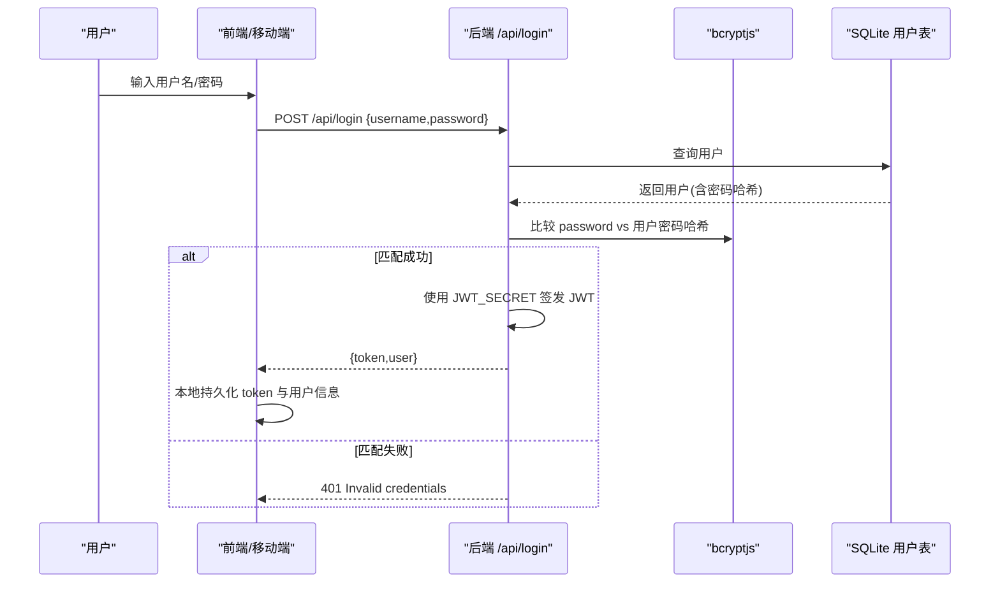
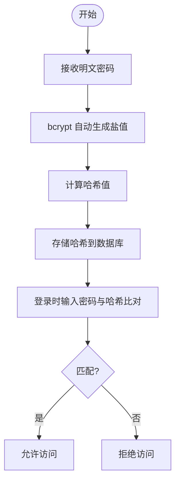
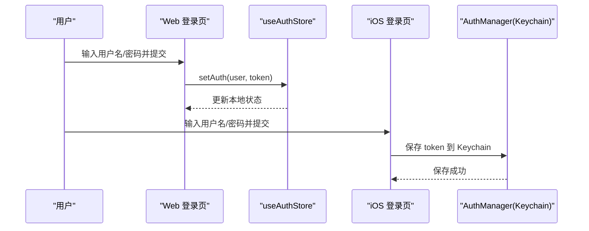
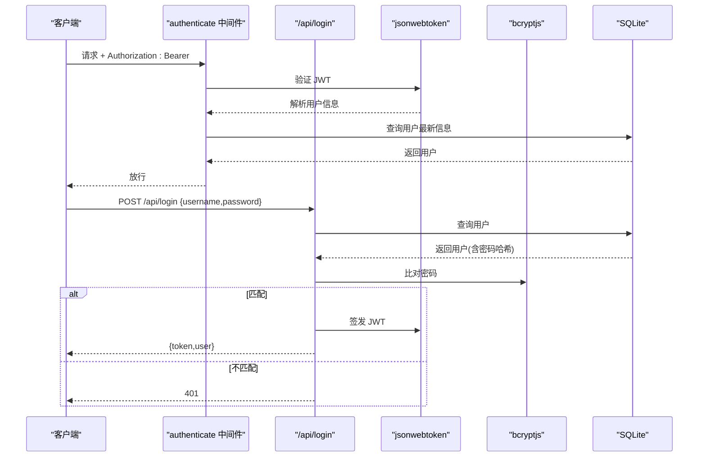
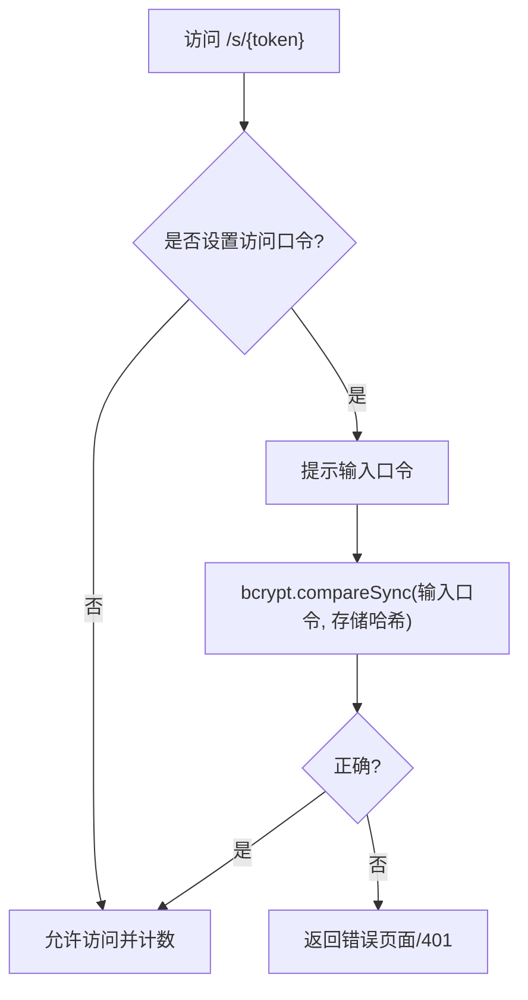
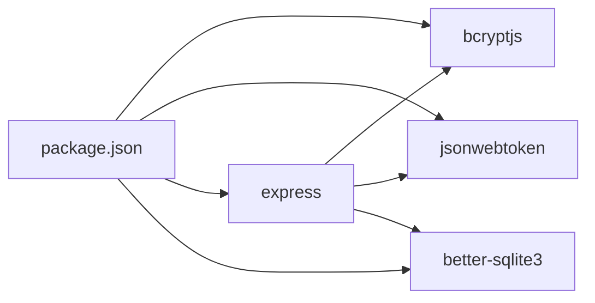

# 密码加密与安全存储

<cite>
**本文引用的文件**
- [server/index.js](file://server/index.js)
- [server/package.json](file://server/package.json)
- [client/src/components/Login.tsx](file://client/src/components/Login.tsx)
- [client/src/store/useAuthStore.ts](file://client/src/store/useAuthStore.ts)
- [ios/LonghornApp/Services/AuthManager.swift](file://ios/LonghornApp/Services/AuthManager.swift)
- [ios/LonghornApp/Services/APIClient.swift](file://ios/LonghornApp/Services/APIClient.swift)
- [ios/LonghornApp/Views/Auth/LoginView.swift](file://ios/LonghornApp/Views/Auth/LoginView.swift)
</cite>

## 目录
1. [简介](#简介)
2. [项目结构](#项目结构)
3. [核心组件](#核心组件)
4. [架构总览](#架构总览)
5. [详细组件分析](#详细组件分析)
6. [依赖关系分析](#依赖关系分析)
7. [性能考量](#性能考量)
8. [故障排查指南](#故障排查指南)
9. [结论](#结论)
10. [附录](#附录)

## 简介
本文件聚焦于系统中的“密码加密与安全存储”能力，围绕 bcrypt 加密算法的使用、盐值生成机制、哈希强度配置与性能优化策略展开；同时覆盖前端密码输入的安全处理、后端验证流程、密码强度规则建议、安全存储最佳实践、常见安全威胁防护以及密码重置流程与安全审计日志方案。目标是帮助开发者与运维人员在不直接阅读源码的情况下，也能理解并正确实施安全策略。

## 项目结构
本项目采用前后端分离架构：前端（React/Vite）负责用户交互与本地状态持久化；移动端（SwiftUI + UIKit）负责认证与网络请求；后端（Node.js + Express）提供认证、权限控制与数据接口，并通过 bcrypt 对密码进行哈希存储。

图表来源
- [server/index.js](file://server/index.js#L683-L713)
- [server/package.json](file://server/package.json#L15-L28)
- [client/src/components/Login.tsx](file://client/src/components/Login.tsx#L15-L27)
- [client/src/store/useAuthStore.ts](file://client/src/store/useAuthStore.ts#L17-L30)
- [ios/LonghornApp/Services/AuthManager.swift](file://ios/LonghornApp/Services/AuthManager.swift#L24-L34)
- [ios/LonghornApp/Services/APIClient.swift](file://ios/LonghornApp/Services/APIClient.swift#L263-L266)

章节来源
- [server/index.js](file://server/index.js#L683-L713)
- [server/package.json](file://server/package.json#L15-L28)
- [client/src/components/Login.tsx](file://client/src/components/Login.tsx#L15-L27)
- [client/src/store/useAuthStore.ts](file://client/src/store/useAuthStore.ts#L17-L30)
- [ios/LonghornApp/Services/AuthManager.swift](file://ios/LonghornApp/Services/AuthManager.swift#L24-L34)
- [ios/LonghornApp/Services/APIClient.swift](file://ios/LonghornApp/Services/APIClient.swift#L263-L266)

## 核心组件
- bcrypt 加密与比较
  - 后端使用 bcryptjs 进行密码哈希与比对，哈希强度参数固定为 10。
  - 在用户注册、更新密码、分享链接创建等场景均使用相同强度参数。
- JWT 令牌
  - 登录成功后签发 JWT，作为后续请求的认证凭据。
- 前端本地存储
  - 浏览器端使用 localStorage 存储 token 与用户信息；移动端使用 Keychain 存储 token，UserDefaults 存储用户信息。
- 网络层
  - 统一添加 Authorization: Bearer 头，便于后端中间件校验。

章节来源
- [server/index.js](file://server/index.js#L683-L713)
- [server/index.js](file://server/index.js#L935-L948)
- [server/index.js](file://server/index.js#L999-L1003)
- [server/index.js](file://server/index.js#L1902-L1936)
- [server/index.js](file://server/index.js#L1955-L2000)
- [client/src/store/useAuthStore.ts](file://client/src/store/useAuthStore.ts#L17-L30)
- [ios/LonghornApp/Services/AuthManager.swift](file://ios/LonghornApp/Services/AuthManager.swift#L24-L34)
- [ios/LonghornApp/Services/APIClient.swift](file://ios/LonghornApp/Services/APIClient.swift#L263-L266)

## 架构总览
下图展示从用户输入到后端验证再到令牌下发的整体流程。

图表来源
- [server/index.js](file://server/index.js#L683-L713)
- [server/package.json](file://server/package.json#L17-L17)

章节来源
- [server/index.js](file://server/index.js#L683-L713)

## 详细组件分析

### bcrypt 加密与盐值生成机制
- 算法选择：使用 bcryptjs，具备自适应成本因子，能抵御 GPU/ASIC 并行暴力破解。
- 盐值生成：bcrypt 内部自动生成随机盐值并与密码混合，无需手动干预。
- 成本因子：当前代码中固定为 10，兼顾安全性与性能。
- 使用场景：
  - 注册新用户时对明文密码进行哈希存储。
  - 更新用户密码时对新密码进行哈希替换。
  - 创建分享链接时可选地对访问口令进行哈希存储。
  - 登录时对输入密码与数据库中哈希进行比对。

图表来源
- [server/index.js](file://server/index.js#L935-L948)
- [server/index.js](file://server/index.js#L999-L1003)
- [server/index.js](file://server/index.js#L1902-L1936)
- [server/index.js](file://server/index.js#L1955-L2000)

章节来源
- [server/index.js](file://server/index.js#L935-L948)
- [server/index.js](file://server/index.js#L999-L1003)
- [server/index.js](file://server/index.js#L1902-L1936)
- [server/index.js](file://server/index.js#L1955-L2000)

### 密码哈希过程与强度配置
- 哈希过程
  - 明文密码 → bcrypt.hashSync(固定成本因子 10) → 哈希字符串 → 存储至 users 表 password 字段。
  - 登录时明文密码 → bcrypt.compareSync(与数据库哈希) → 布尔结果决定是否放行。
- 强度配置
  - 成本因子固定为 10，属于中等强度，兼顾安全与性能。
  - 若硬件资源充足且安全要求更高，可考虑提升成本因子（如 12），但需评估登录延迟与 CPU 占用。
- 性能优化策略
  - 使用同步哈希 API（hashSync/compareSync）简化逻辑，适合小型服务端。
  - 对高并发场景建议引入异步哈希与队列限流，避免阻塞事件循环。
  - 缓存近期活跃用户的登录状态，减少重复哈希比对。

章节来源
- [server/index.js](file://server/index.js#L692-L694)
- [server/index.js](file://server/index.js#L935-L948)
- [server/index.js](file://server/index.js#L999-L1003)

### 前端密码输入与安全处理
- 浏览器端
  - 登录表单使用受控输入，提交前不做本地哈希处理，避免破坏后端统一策略。
  - 登录成功后将 token 与用户信息写入 localStorage，便于后续请求自动携带 Authorization 头。
- 移动端
  - 登录表单支持明文/密文切换，输入完成后发起登录请求。
  - 登录成功后将 token 写入 iOS Keychain（更安全），用户信息写入 UserDefaults。
  - 网络层统一注入 Authorization: Bearer 头，便于后端中间件校验。

图表来源
- [client/src/components/Login.tsx](file://client/src/components/Login.tsx#L15-L27)
- [client/src/store/useAuthStore.ts](file://client/src/store/useAuthStore.ts#L17-L30)
- [ios/LonghornApp/Views/Auth/LoginView.swift](file://ios/LonghornApp/Views/Auth/LoginView.swift#L277-L281)
- [ios/LonghornApp/Services/AuthManager.swift](file://ios/LonghornApp/Services/AuthManager.swift#L24-L34)

章节来源
- [client/src/components/Login.tsx](file://client/src/components/Login.tsx#L15-L27)
- [client/src/store/useAuthStore.ts](file://client/src/store/useAuthStore.ts#L17-L30)
- [ios/LonghornApp/Views/Auth/LoginView.swift](file://ios/LonghornApp/Views/Auth/LoginView.swift#L277-L281)
- [ios/LonghornApp/Services/AuthManager.swift](file://ios/LonghornApp/Services/AuthManager.swift#L24-L34)

### 后端验证流程与中间件
- 中间件 authenticate
  - 从 Authorization 头提取 Bearer token，使用 JWT_SECRET 验证签名。
  - 验证通过后从数据库刷新用户角色与部门信息，注入 req.user。
- 登录路由
  - 接收用户名/密码，查询用户并使用 bcrypt.compareSync 进行比对。
  - 成功则签发 JWT 并返回用户信息，失败返回 401。

图表来源
- [server/index.js](file://server/index.js#L267-L295)
- [server/index.js](file://server/index.js#L683-L713)

章节来源
- [server/index.js](file://server/index.js#L267-L295)
- [server/index.js](file://server/index.js#L683-L713)

### 分享链接访问与口令保护
- 创建分享链接时可选设置访问口令，系统对口令进行 bcrypt 哈希存储。
- 访问分享链接时若设置了口令，需先验证口令正确性再允许下载。
- 该流程同样使用 bcrypt.compareSync 进行口令比对。

图表来源
- [server/index.js](file://server/index.js#L2068-L2083)
- [server/index.js](file://server/index.js#L2113-L2132)
- [server/index.js](file://server/index.js#L2163-L2166)

章节来源
- [server/index.js](file://server/index.js#L2068-L2083)
- [server/index.js](file://server/index.js#L2113-L2132)
- [server/index.js](file://server/index.js#L2163-L2166)

### 安全存储最佳实践
- 服务器侧
  - 密码字段仅存储哈希，不保留明文。
  - JWT Secret 应妥善保管，避免硬编码在源码中。
  - 对敏感接口启用 authenticate 中间件与 CORS 白名单。
- 前端侧
  - 浏览器端 localStorage 存储 token 存在 XSS 风险，建议结合 HttpOnly Cookie（需后端配合）或 CSP 策略降低风险。
  - 移动端使用 Keychain 存储 token，安全性更高。
- 网络传输
  - 始终使用 HTTPS，防止中间人攻击与明文泄露。
  - 对外暴露的 API 限制速率与频率，防止暴力破解。

章节来源
- [server/index.js](file://server/index.js#L21-L22)
- [client/src/store/useAuthStore.ts](file://client/src/store/useAuthStore.ts#L17-L30)
- [ios/LonghornApp/Services/AuthManager.swift](file://ios/LonghornApp/Services/AuthManager.swift#L134-L151)
- [ios/LonghornApp/Services/APIClient.swift](file://ios/LonghornApp/Services/APIClient.swift#L44-L51)

### 常见安全威胁与防护
- 暴力破解
  - 使用 bcrypt 固定成本因子，配合登录失败次数限制与账户锁定策略（建议后端实现）。
- 会话劫持
  - 使用短期有效的 JWT，结合刷新令牌机制；移动端 Keychain 存储 token 更安全。
- XSS/CSRF
  - 前端避免在 localStorage 中长期存放敏感信息；必要时启用 SameSite Cookie 与 CSP。
- 敏感信息泄露
  - 严格控制日志输出，避免打印明文密码或 JWT；生产环境关闭调试日志。

章节来源
- [server/index.js](file://server/index.js#L267-L295)
- [ios/LonghornApp/Services/AuthManager.swift](file://ios/LonghornApp/Services/AuthManager.swift#L134-L151)

### 密码重置流程与安全审计
- 密码重置流程建议
  - 生成一次性重置令牌并设置过期时间，发送至用户邮箱。
  - 用户点击链接后跳转至重置页面，输入新密码并提交。
  - 后端验证令牌有效性与过期时间，通过后使用 bcrypt.hashSync 更新密码。
- 安全审计日志
  - 记录登录尝试（成功/失败）、密码重置请求、分享链接访问（含口令验证）等关键事件。
  - 日志字段建议包括：时间戳、用户 ID/名称、IP、UA、路径、状态码、附加上下文（如口令验证结果）。
  - 日志落盘与轮转策略，避免磁盘打满；敏感字段脱敏。

章节来源
- [server/index.js](file://server/index.js#L1288-L1313)

## 依赖关系分析
后端依赖 bcryptjs 与 jsonwebtoken 实现密码哈希与令牌签发；Express 提供路由与中间件；better-sqlite3 提供数据库访问。

图表来源
- [server/package.json](file://server/package.json#L15-L28)

章节来源
- [server/package.json](file://server/package.json#L15-L28)

## 性能考量
- bcrypt 成本因子
  - 当前为 10，平衡安全与性能；若登录延迟过高，可评估提升至 12，同时监控 CPU 使用率。
- 并发与阻塞
  - hashSync/compareSync 为同步调用，高并发下可能阻塞事件循环；建议引入异步 API 与队列限流。
- 缓存与降级
  - 对频繁访问的用户信息进行短期缓存，减少数据库与哈希比对压力。
- 网络与存储
  - 合理设置静态资源缓存与压缩策略，降低带宽与 CPU 开销。

章节来源
- [server/index.js](file://server/index.js#L683-L713)

## 故障排查指南
- 登录失败
  - 检查用户名是否存在、密码是否正确；确认 bcrypt.compareSync 的输入与数据库哈希一致。
  - 查看后端日志与 401 响应原因。
- 令牌无效
  - 确认 Authorization 头格式为 Bearer；检查 JWT_SECRET 是否一致；验证签名是否被篡改。
- 前端无法持久化
  - 浏览器端检查 localStorage 权限与跨域设置；移动端检查 Keychain 写入状态。
- 分享链接无法访问
  - 检查口令是否正确、链接是否过期、文件是否存在。

章节来源
- [server/index.js](file://server/index.js#L267-L295)
- [server/index.js](file://server/index.js#L683-L713)
- [ios/LonghornApp/Services/AuthManager.swift](file://ios/LonghornApp/Services/AuthManager.swift#L134-L151)

## 结论
本项目在密码安全方面采用了 bcrypt 哈希与 JWT 令牌相结合的方案，前端与移动端分别采用 localStorage 与 Keychain 存储 token，整体满足中小型应用的安全需求。为进一步提升安全性，建议引入更强的成本因子、短期令牌与刷新机制、严格的 CSP 与 HTTPS 策略，并完善安全审计日志体系。

## 附录
- 密码强度建议（通用）
  - 最小长度：8-12 字符；推荐 12+。
  - 复杂度：大小写字母、数字、特殊字符组合。
  - 避免常见弱口令与字典词。
  - 定期更换与历史口令检测。