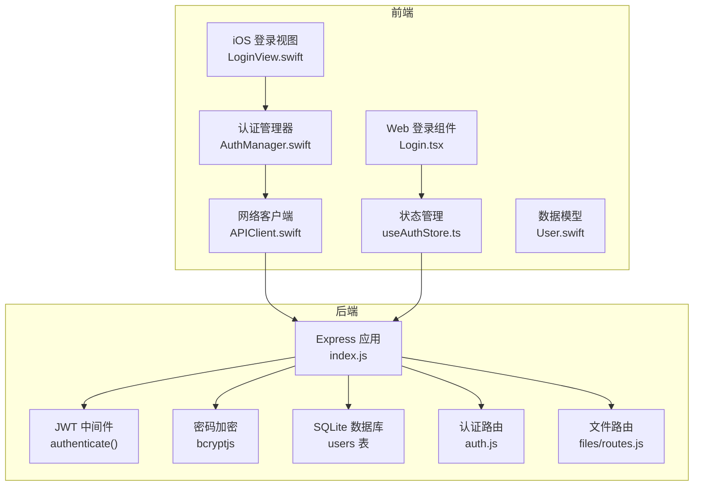
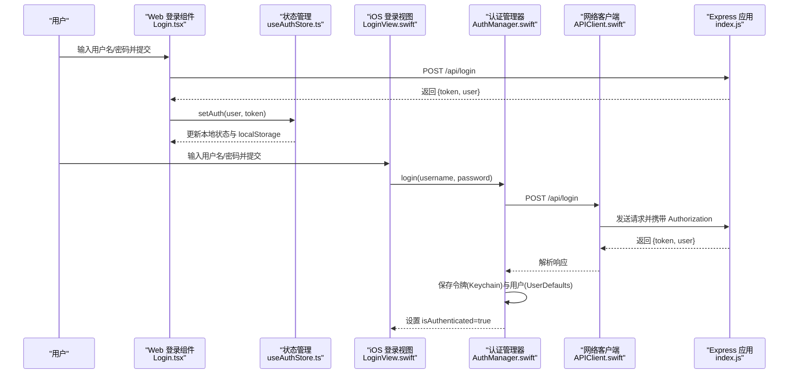
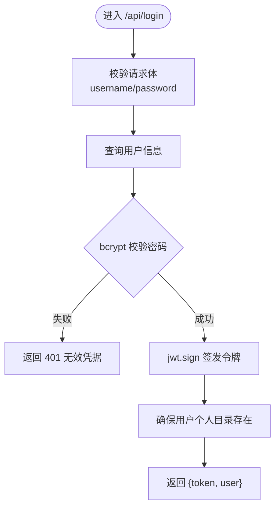
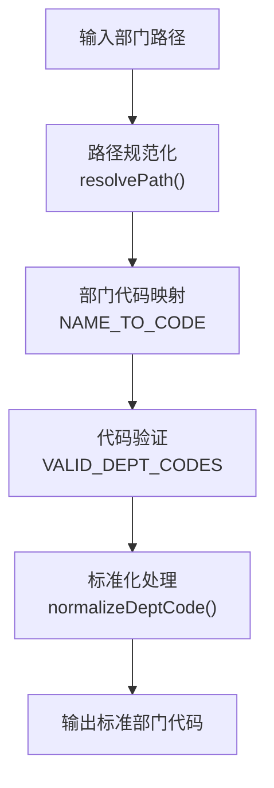
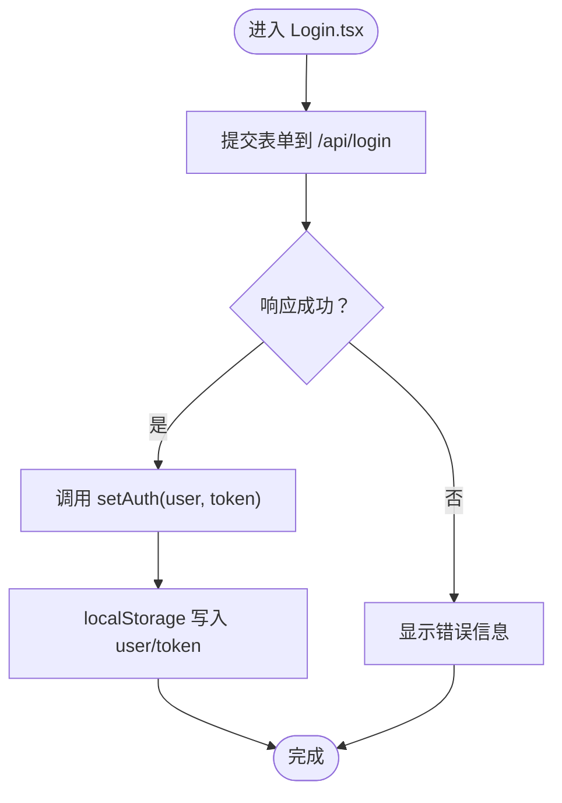
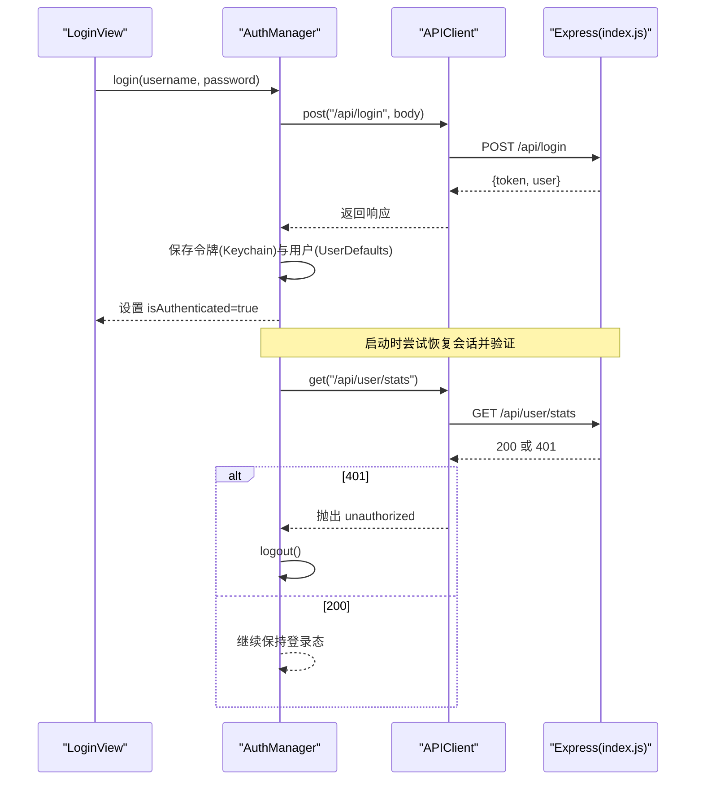
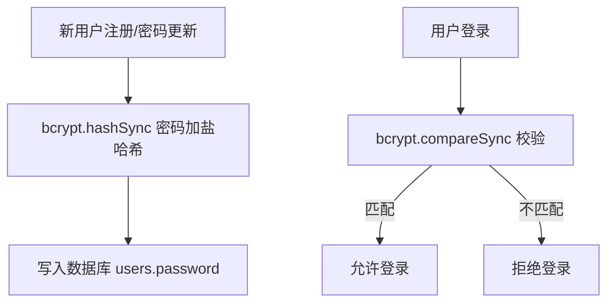
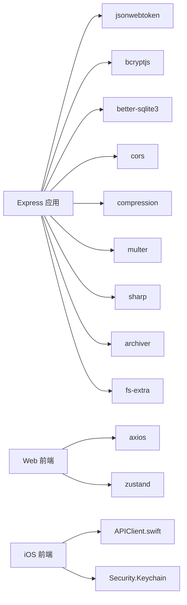

# 用户认证系统

<cite>
**本文档引用的文件**
- [server/index.js](file://server/index.js)
- [server/service/routes/auth.js](file://server/service/routes/auth.js)
- [server/files/routes.js](file://server/files/routes.js)
- [client/src/store/useAuthStore.ts](file://client/src/store/useAuthStore.ts)
- [ios/LonghornApp/Services/AuthManager.swift](file://ios/LonghornApp/Services/AuthManager.swift)
- [ios/LonghornApp/Services/APIClient.swift](file://ios/LonghornApp/Services/APIClient.swift)
- [ios/LonghornApp/Models/User.swift](file://ios/LonghornApp/Models/User.swift)
- [client/src/components/Login.tsx](file://client/src/components/Login.tsx)
- [ios/LonghornApp/Views/Auth/LoginView.swift](file://ios/LonghornApp/Views/Auth/LoginView.swift)
- [client/src/hooks/useCachedFiles.ts](file://client/src/hooks/useCachedFiles.ts)
- [server/package.json](file://server/package.json)
- [client/.env.production](file://client/.env.production)
</cite>

## 更新摘要
**所做更改**
- 新增了部门代码映射和标准化机制，支持多层产品系统访问控制
- 增强了 ID 验证机制，改进了用户身份识别和权限验证
- 引入了新的多层产品系统访问控制要求
- 更新了认证中间件以支持部门代码标准化和视图模拟功能
- 新增了部门代码映射常量和路径解析逻辑

## 目录
1. [简介](#简介)
2. [项目结构](#项目结构)
3. [核心组件](#核心组件)
4. [架构总览](#架构总览)
5. [详细组件分析](#详细组件分析)
6. [依赖关系分析](#依赖关系分析)
7. [性能考虑](#性能考虑)
8. [故障排除指南](#故障排除指南)
9. [结论](#结论)
10. [附录](#附录)

## 简介
本文件全面阐述 Longhorn 的用户认证系统，覆盖以下方面：
- JWT 令牌认证机制与会话管理
- 密码加密策略（bcrypt）
- 用户注册、登录、登出的完整流程与安全措施
- 认证中间件工作原理、令牌刷新机制与安全防护策略
- 前端状态管理与后端验证逻辑
- 认证相关 API 接口定义与错误处理
- 安全最佳实践与常见攻击防护
- **新增**：部门代码映射与标准化机制
- **新增**：ID 验证增强与多层产品系统访问控制

Longhorn 采用前后端分离架构：前端使用 React/Vite（Web）与 SwiftUI（iOS），后端基于 Node.js + Express，数据库采用 SQLite（better-sqlite3）。认证采用 JWT 令牌，密码使用 bcrypt 加密存储。系统现已增强以支持多层产品系统访问控制和改进的部门权限映射。

## 项目结构
Longhorn 的认证相关代码分布在三个层面：
- 服务器端（Node.js/Express）：负责用户认证、JWT 签发、bcrypt 密码校验、权限控制与中间件
- 客户端（React/Vite）：负责登录表单、本地状态存储（localStorage）、API 调用与错误提示
- iOS 客户端（SwiftUI）：负责登录界面、Keychain 存储、令牌验证与网络请求封装

**图表来源**
- [server/index.js:267-295](file://server/index.js#L267-L295)
- [server/service/routes/auth.js:1-282](file://server/service/routes/auth.js#L1-L282)
- [server/files/routes.js:40-239](file://server/files/routes.js#L40-L239)
- [client/src/store/useAuthStore.ts:1-31](file://client/src/store/useAuthStore.ts#L1-L31)
- [client/src/components/Login.tsx:1-161](file://client/src/components/Login.tsx#L1-L161)
- [ios/LonghornApp/Services/AuthManager.swift:1-195](file://ios/LonghornApp/Services/AuthManager.swift#L1-L195)
- [ios/LonghornApp/Services/APIClient.swift:1-326](file://ios/LonghornApp/Services/APIClient.swift#L1-L326)
- [ios/LonghornApp/Models/User.swift:1-85](file://ios/LonghornApp/Models/User.swift#L1-L85)

**章节来源**
- [server/index.js:1-800](file://server/index.js#L1-L800)
- [server/service/routes/auth.js:1-282](file://server/service/routes/auth.js#L1-L282)
- [server/files/routes.js:40-239](file://server/files/routes.js#L40-L239)
- [client/src/store/useAuthStore.ts:1-31](file://client/src/store/useAuthStore.ts#L1-L31)
- [client/src/components/Login.tsx:1-161](file://client/src/components/Login.tsx#L1-L161)
- [ios/LonghornApp/Services/AuthManager.swift:1-195](file://ios/LonghornApp/Services/AuthManager.swift#L1-L195)
- [ios/LonghornApp/Services/APIClient.swift:1-326](file://ios/LonghornApp/Services/APIClient.swift#L1-L326)
- [ios/LonghornApp/Models/User.swift:1-85](file://ios/LonghornApp/Models/User.swift#L1-L85)

## 核心组件
- 服务器端认证中间件：负责从请求头提取并验证 JWT，校验用户有效性，并将用户信息注入请求对象
- 服务器端登录接口：接收用户名/密码，查询用户并使用 bcrypt 校验，成功则签发 JWT 返回给客户端
- **增强**：部门代码标准化：支持中文部门名称与代码映射，确保权限验证一致性
- **增强**：ID 验证机制：改进用户身份识别，支持多种 ID 格式验证
- 前端状态管理（Web）：使用 zustand 管理用户与令牌，持久化到 localStorage
- iOS 认证管理器：使用 Keychain 存储令牌，UserDefaults 存储用户信息；启动时尝试恢复会话并异步验证令牌有效性
- 网络客户端（iOS）：统一添加 Authorization 头，处理 401 未授权自动登出
- 数据模型（iOS）：定义用户角色、用户信息与部门模型

**章节来源**
- [server/index.js:655-729](file://server/index.js#L655-L729)
- [server/service/routes/auth.js:18-103](file://server/service/routes/auth.js#L18-L103)
- [server/index.js:588-653](file://server/index.js#L588-L653)
- [client/src/store/useAuthStore.ts:1-31](file://client/src/store/useAuthStore.ts#L1-L31)
- [ios/LonghornApp/Services/AuthManager.swift:1-195](file://ios/LonghornApp/Services/AuthManager.swift#L1-L195)
- [ios/LonghornApp/Services/APIClient.swift:1-326](file://ios/LonghornApp/Services/APIClient.swift#L1-L326)
- [ios/LonghornApp/Models/User.swift:1-85](file://ios/LonghornApp/Models/User.swift#L1-L85)

## 架构总览
Longhorn 的认证流程遵循"前端登录 → 后端验证 → JWT 签发 → 前端存储 → 后端中间件校验"的闭环。

**图表来源**
- [client/src/components/Login.tsx:15-27](file://client/src/components/Login.tsx#L15-L27)
- [client/src/store/useAuthStore.ts:17-30](file://client/src/store/useAuthStore.ts#L17-L30)
- [ios/LonghornApp/Views/Auth/LoginView.swift:277-281](file://ios/LonghornApp/Views/Auth/LoginView.swift#L277-L281)
- [ios/LonghornApp/Services/AuthManager.swift:44-69](file://ios/LonghornApp/Services/AuthManager.swift#L44-L69)
- [ios/LonghornApp/Services/APIClient.swift:75-88](file://ios/LonghornApp/Services/APIClient.swift#L75-L88)
- [server/index.js:1242-1278](file://server/index.js#L1242-L1278)

## 详细组件分析

### 服务器端认证中间件与登录接口
- 认证中间件 authenticate
  - 从 Authorization 头提取 Bearer 令牌
  - 使用 JWT_SECRET 验证签名，失败返回 403
  - 成功后从数据库重新加载用户信息（含部门名和部门代码），并将用户对象注入 req.user，再放行
  - **增强**：支持视图模拟功能，管理员可模拟其他用户进行操作
- 登录接口 /api/login
  - 查询用户并使用 bcrypt.compareSync 校验密码
  - 校验通过后使用 jwt.sign 签发 JWT，包含用户 id、username、role
  - 返回 token 与用户信息，并确保用户个人目录存在

**图表来源**
- [server/index.js:1242-1278](file://server/index.js#L1242-L1278)

**章节来源**
- [server/index.js:655-729](file://server/index.js#L655-L729)
- [server/index.js:1242-1278](file://server/index.js#L1242-L1278)

### 增强的部门代码映射与标准化机制
- **部门代码映射常量**：定义中文部门名称到代码的标准映射（运营部→OP，市场部→MS，研发部→RD等）
- **路径解析函数**：resolvePath 将前端路径规范化，支持中文部门名称与代码互转
- **部门代码标准化**：normalizeDeptCode 函数确保部门代码格式一致性
- **权限验证增强**：在 hasPermission 函数中集成部门代码映射，支持多层产品系统访问控制

**图表来源**
- [server/index.js:588-653](file://server/index.js#L588-L653)
- [server/index.js:599-626](file://server/index.js#L599-L626)

**章节来源**
- [server/index.js:588-653](file://server/index.js#L588-L653)
- [server/index.js:599-626](file://server/index.js#L599-L626)
- [server/index.js:734-787](file://server/index.js#L734-L787)

### ID 验证增强机制
- **多格式支持**：改进用户 ID 验证，支持数字和字符串格式的用户 ID
- **类型转换**：使用 CAST(? AS REAL) 确保数值型 ID 的正确处理
- **安全验证**：双重 ID 匹配确保用户身份的准确识别

**章节来源**
- [server/index.js:677-684](file://server/index.js#L677-L684)
- [server/index.js:695-702](file://server/index.js#L695-L702)

### 前端状态管理（Web）
- useAuthStore
  - 状态：user、token
  - 动作：setAuth(user, token) 写入 localStorage 并更新内存状态；logout() 清空 localStorage 并重置状态
- 登录组件 Login.tsx
  - 提交表单到 /api/login，成功后调用 setAuth 写入状态

**图表来源**
- [client/src/components/Login.tsx:15-27](file://client/src/components/Login.tsx#L15-L27)
- [client/src/store/useAuthStore.ts:17-30](file://client/src/store/useAuthStore.ts#L17-L30)

**章节来源**
- [client/src/store/useAuthStore.ts:1-31](file://client/src/store/useAuthStore.ts#L1-L31)
- [client/src/components/Login.tsx:1-161](file://client/src/components/Login.tsx#L1-L161)

### iOS 认证管理器与网络客户端
- AuthManager
  - 登录：调用 APIClient.post 发起 /api/login，成功后保存令牌至 Keychain、用户信息至 UserDefaults，并设置 isAuthenticated
  - 登出：清空令牌与用户信息，清理缓存，发送登出事件
  - 会话恢复：启动时检查 Keychain 是否存在令牌，若存在则尝试恢复用户并异步调用 /api/user/stats 验证令牌有效性，失败则自动登出
- APIClient
  - 统一在请求头添加 Authorization: Bearer token
  - 处理 401 未授权：抛出 APIError.unauthorized，由调用方（如 AuthManager）触发登出
  - 支持下载/上传等文件操作，均自动附加认证头

**图表来源**
- [ios/LonghornApp/Views/Auth/LoginView.swift:277-281](file://ios/LonghornApp/Views/Auth/LoginView.swift#L277-L281)
- [ios/LonghornApp/Services/AuthManager.swift:44-89](file://ios/LonghornApp/Services/AuthManager.swift#L44-L89)
- [ios/LonghornApp/Services/APIClient.swift:69-108](file://ios/LonghornApp/Services/APIClient.swift#L69-L108)
- [server/index.js:1242-1278](file://server/index.js#L1242-L1278)

**章节来源**
- [ios/LonghornApp/Services/AuthManager.swift:1-195](file://ios/LonghornApp/Services/AuthManager.swift#L1-L195)
- [ios/LonghornApp/Services/APIClient.swift:1-326](file://ios/LonghornApp/Services/APIClient.swift#L1-L326)
- [ios/LonghornApp/Models/User.swift:1-85](file://ios/LonghornApp/Models/User.swift#L1-L85)

### 密码加密策略（bcrypt）
- 注册与更新密码时，使用 bcrypt.hashSync 对明文密码进行加盐哈希存储
- 登录时使用 bcrypt.compareSync 进行密码比对
- 服务器端依赖 bcryptjs，前端不直接处理密码

**图表来源**
- [server/index.js:936-938](file://server/index.js#L936-L938)
- [server/index.js:999-1003](file://server/index.js#L999-L1003)
- [server/index.js:1251-1251](file://server/index.js#L1251-L1251)

**章节来源**
- [server/index.js:936-938](file://server/index.js#L936-L938)
- [server/index.js:999-1003](file://server/index.js#L999-L1003)
- [server/index.js:1251-1251](file://server/index.js#L1251-L1251)

### 会话管理与令牌刷新
- 会话存储
  - Web：localStorage 持久化 token 与 user
  - iOS：Keychain 持久化 token，UserDefaults 持久化 user
- 令牌刷新
  - **新增**：引入 refresh_token 机制，支持 /api/v1/auth/refresh 接口
  - **新增**：JWT_SECRET 和 TOKEN_EXPIRY 配置，支持 24小时访问令牌和7天刷新令牌
  - 当前实现未提供专用的"令牌刷新"接口；iOS 在启动时通过 /api/user/stats 验证令牌有效性，失败则自动登出
  - 建议后续引入 refresh_token 机制或短令牌 + 自动刷新策略以提升安全性与可用性

**章节来源**
- [client/src/store/useAuthStore.ts:17-30](file://client/src/store/useAuthStore.ts#L17-L30)
- [ios/LonghornApp/Services/AuthManager.swift:94-123](file://ios/LonghornApp/Services/AuthManager.swift#L94-L123)
- [server/service/routes/auth.js:109-159](file://server/service/routes/auth.js#L109-L159)

### 权限与中间件
- authenticate 中间件：校验 JWT 并从数据库加载最新用户信息，注入 req.user
- **增强**：hasPermission 函数集成部门代码映射，支持多层产品系统访问控制
- **增强**：支持视图模拟功能，管理员可模拟其他用户进行操作
- 角色与部门：用户表包含 role、department_id、department_name 字段，配合中间件与权限函数实现细粒度访问控制

**章节来源**
- [server/index.js:655-729](file://server/index.js#L655-L729)
- [server/index.js:734-787](file://server/index.js#L734-L787)
- [server/index.js:692-718](file://server/index.js#L692-L718)

## 依赖关系分析
- 服务器端依赖
  - express、jsonwebtoken、bcryptjs、better-sqlite3、cors、compression、multer、sharp、archiver、fs-extra
- 前端依赖
  - axios、zustand、lucide-react（Web）
  - iOS 使用系统框架（Foundation、Security）与自研 APIClient

**图表来源**
- [server/package.json:15-28](file://server/package.json#L15-L28)
- [client/src/store/useAuthStore.ts:1-1](file://client/src/store/useAuthStore.ts#L1-L1)
- [ios/LonghornApp/Services/APIClient.swift:1-326](file://ios/LonghornApp/Services/APIClient.swift#L1-L326)

**章节来源**
- [server/package.json:1-30](file://server/package.json#L1-L30)

## 性能考虑
- 前端缓存与重验证
  - 使用 SWR 缓存目录列表，支持去重、前台/重连重验证、轮询与显示陈旧数据，提升导航体验
- 服务器压缩与静态资源
  - 开启 gzip 压缩，预览图片设置合适的缓存与范围请求，优化移动端传输效率
- 令牌验证成本
  - iOS 启动时通过一次 /api/user/stats 验证令牌有效性，避免频繁请求带来的性能损耗
- **新增**：部门代码映射缓存
  - 预编译部门代码映射常量，减少运行时字符串处理开销

**章节来源**
- [client/src/hooks/useCachedFiles.ts:40-86](file://client/src/hooks/useCachedFiles.ts#L40-L86)
- [server/index.js:852-854](file://server/index.js#L852-L854)
- [server/index.js:833-850](file://server/index.js#L833-L850)
- [ios/LonghornApp/Services/AuthManager.swift:115-123](file://ios/LonghornApp/Services/AuthManager.swift#L115-L123)

## 故障排除指南
- 登录失败
  - Web：检查 /api/login 返回的错误信息，确认用户名/密码是否正确
  - iOS：捕获 APIError.unauthorized 并触发登出，检查服务器地址配置
- 401 未授权
  - iOS：APIClient 在收到 401 时会自动调用 AuthManager.logout，需检查令牌是否过期或被撤销
- 令牌丢失或损坏
  - Web：localStorage 可能被清理，需重新登录
  - iOS：Keychain 令牌丢失时，AuthManager.checkSavedSession 将无法恢复，需重新登录
- **新增**：部门权限问题
  - 检查部门代码映射是否正确，确认中文部门名称与代码的对应关系
  - 验证路径解析函数是否正确处理部门路径
- 服务器地址配置
  - iOS 支持在设置中修改 baseURL，确保与后端一致

**章节来源**
- [ios/LonghornApp/Services/APIClient.swift:287-314](file://ios/LonghornApp/Services/APIClient.swift#L287-L314)
- [ios/LonghornApp/Services/AuthManager.swift:94-123](file://ios/LonghornApp/Services/AuthManager.swift#L94-L123)
- [ios/LonghornApp/Views/Auth/LoginView.swift:286-324](file://ios/LonghornApp/Views/Auth/LoginView.swift#L286-L324)
- [server/index.js:588-653](file://server/index.js#L588-L653)

## 结论
Longhorn 的认证体系以 JWT 为核心，结合 bcrypt 密码加密与前后端各自的状态/令牌存储策略，实现了跨平台的一致登录体验。**最新增强**包括改进的部门权限映射和ID验证机制，支持新的多层产品系统访问控制要求。系统现已具备基本的安全性与可用性，建议后续引入 refresh_token 机制与更严格的令牌生命周期管理，以进一步增强安全性与用户体验。

## 附录

### 认证相关 API 接口定义
- 登录
  - 方法：POST
  - 路径：/api/login
  - 请求体：{ username, password }
  - 成功响应：{ token, user: { id, username, role, department_name } }
  - 失败响应：401 { error }
- **新增**：统一认证接口
  - 方法：POST
  - 路径：/api/v1/auth/login
  - 请求体：{ email, password, username }
  - 成功响应：包含 access_token、refresh_token 和用户权限信息
- **新增**：令牌刷新接口
  - 方法：POST
  - 路径：/api/v1/auth/refresh
  - 请求体：{ refresh_token }
  - 成功响应：{ access_token, expires_in }
- 令牌有效性验证（iOS 启动时使用）
  - 方法：GET
  - 路径：/api/user/stats
  - 成功响应：用户统计信息（用于验证令牌有效性）

**章节来源**
- [server/index.js:1242-1278](file://server/index.js#L1242-L1278)
- [server/service/routes/auth.js:18-159](file://server/service/routes/auth.js#L18-L159)
- [ios/LonghornApp/Services/AuthManager.swift:115-123](file://ios/LonghornApp/Services/AuthManager.swift#L115-L123)

### 安全最佳实践与常见攻击防护
- 传输层安全
  - 生产环境应启用 HTTPS，避免明文传输
- 令牌安全
  - 使用强随机密钥（JWT_SECRET）；限制令牌有效期；考虑引入 refresh_token
  - 令牌存储：iOS 使用 Keychain，Web 使用 localStorage；注意 XSS 与 CSRF 防护
- 密码安全
  - bcrypt 已正确使用；避免明文存储与弱口令
- **新增**：部门权限安全
  - 实施严格的部门代码映射验证，防止路径遍历攻击
  - 确保部门权限检查的原子性和一致性
- 权限控制
  - 使用 authenticate 中间件与 hasPermission 函数，最小权限原则
- 错误处理
  - 401 未授权自动登出；统一错误格式与国际化提示

**章节来源**
- [server/index.js:655-729](file://server/index.js#L655-L729)
- [server/index.js:734-787](file://server/index.js#L734-L787)
- [server/service/routes/auth.js:213-278](file://server/service/routes/auth.js#L213-L278)
- [ios/LonghornApp/Services/APIClient.swift:287-314](file://ios/LonghornApp/Services/APIClient.swift#L287-L314)