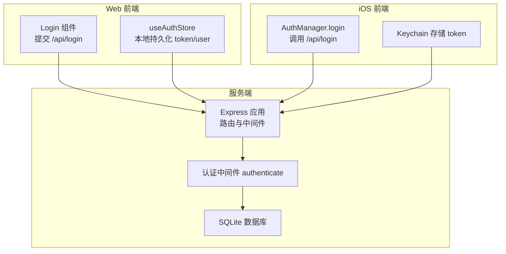
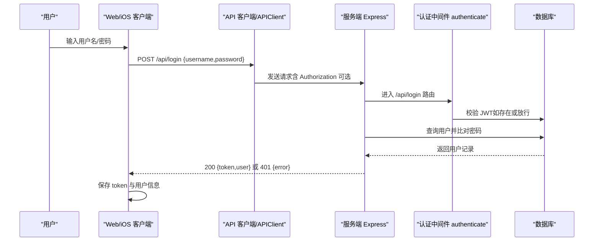
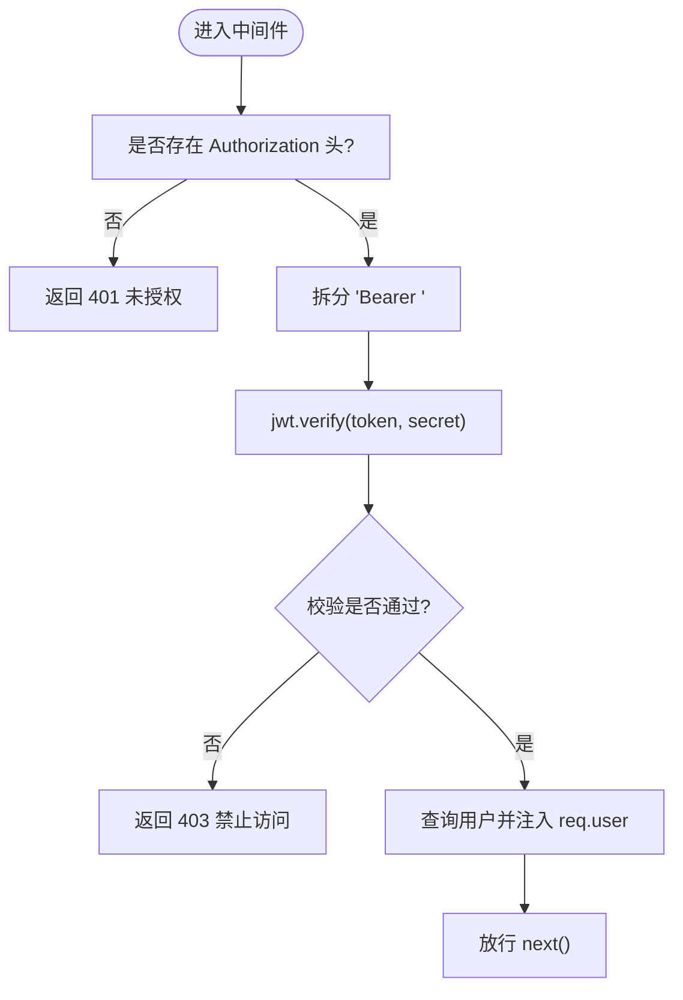
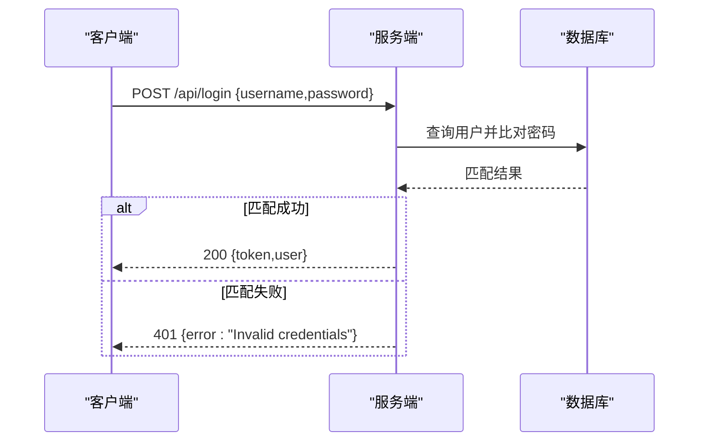
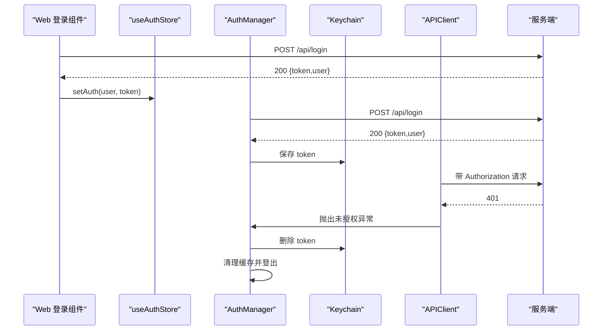
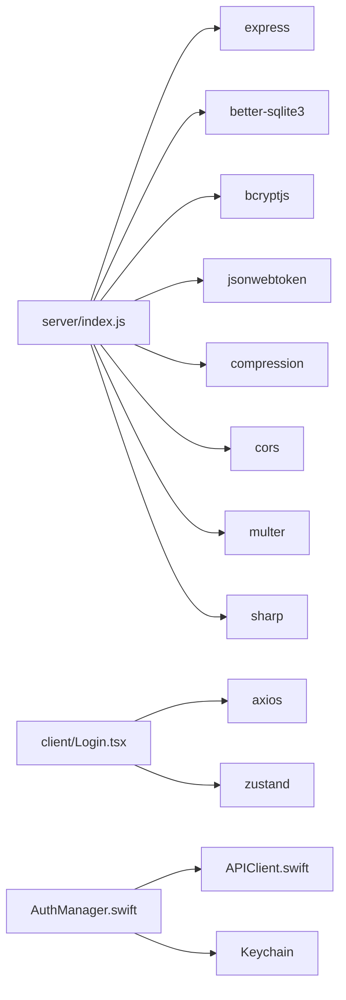

# 认证流程与 API 接口

<cite>
**本文引用的文件**
- [server/index.js](file://server/index.js)
- [client/src/components/Login.tsx](file://client/src/components/Login.tsx)
- [client/src/store/useAuthStore.ts](file://client/src/store/useAuthStore.ts)
- [ios/LonghornApp/Services/AuthManager.swift](file://ios/LonghornApp/Services/AuthManager.swift)
- [ios/LonghornApp/Services/APIClient.swift](file://ios/LonghornApp/Services/APIClient.swift)
- [server/package.json](file://server/package.json)
</cite>

## 目录
1. [简介](#简介)
2. [项目结构](#项目结构)
3. [核心组件](#核心组件)
4. [架构总览](#架构总览)
5. [详细组件分析](#详细组件分析)
6. [依赖关系分析](#依赖关系分析)
7. [性能考量](#性能考量)
8. [故障排查指南](#故障排查指南)
9. [结论](#结论)
10. [附录：API 规范与错误码](#附录api-规范与错误码)

## 简介
本文件系统性梳理 Longhorn 项目的认证流程与相关 API 接口，重点覆盖：
- 用户注册、登录、登出的完整流程与各阶段 API 规范
- /api/login 接口的请求参数、响应格式与错误处理
- 认证中间件 authenticate 的实现原理与使用方式
- API 安全验证策略、错误码定义与客户端集成示例
- 提供认证流程图与调试指南，帮助开发者快速集成与排障

## 项目结构
后端基于 Node.js + Express，采用 SQLite 存储用户与权限；前端包含 Web 客户端与 iOS 客户端，均通过统一的 /api/* 接口进行认证交互。

图表来源
- [server/index.js](file://server/index.js#L267-L295)
- [client/src/components/Login.tsx](file://client/src/components/Login.tsx#L15-L27)
- [client/src/store/useAuthStore.ts](file://client/src/store/useAuthStore.ts#L17-L30)
- [ios/LonghornApp/Services/AuthManager.swift](file://ios/LonghornApp/Services/AuthManager.swift#L44-L69)
- [ios/LonghornApp/Services/APIClient.swift](file://ios/LonghornApp/Services/APIClient.swift#L247-L269)

章节来源
- [server/index.js](file://server/index.js#L1-L120)
- [client/src/components/Login.tsx](file://client/src/components/Login.tsx#L1-L161)
- [client/src/store/useAuthStore.ts](file://client/src/store/useAuthStore.ts#L1-L31)
- [ios/LonghornApp/Services/AuthManager.swift](file://ios/LonghornApp/Services/AuthManager.swift#L1-L195)
- [ios/LonghornApp/Services/APIClient.swift](file://ios/LonghornApp/Services/APIClient.swift#L1-L326)

## 核心组件
- 认证中间件 authenticate：校验 Authorization 头中的 JWT，失败时返回 401/403；成功则加载用户最新信息注入 req.user 并放行
- /api/login：接收用户名与密码，校验通过后签发 JWT，并返回 token 与用户信息
- 前端登录组件与状态管理：Web 使用 useAuthStore，iOS 使用 AuthManager 与 Keychain
- API 客户端：统一在请求头添加 Authorization: Bearer token，处理 401 自动登出

章节来源
- [server/index.js](file://server/index.js#L267-L295)
- [server/index.js](file://server/index.js#L684-L713)
- [client/src/components/Login.tsx](file://client/src/components/Login.tsx#L15-L27)
- [client/src/store/useAuthStore.ts](file://client/src/store/useAuthStore.ts#L17-L30)
- [ios/LonghornApp/Services/AuthManager.swift](file://ios/LonghornApp/Services/AuthManager.swift#L44-L69)
- [ios/LonghornApp/Services/APIClient.swift](file://ios/LonghornApp/Services/APIClient.swift#L247-L269)

## 架构总览
下图展示从用户输入凭据到服务端签发令牌的关键交互路径：

图表来源
- [server/index.js](file://server/index.js#L267-L295)
- [server/index.js](file://server/index.js#L684-L713)
- [ios/LonghornApp/Services/APIClient.swift](file://ios/LonghornApp/Services/APIClient.swift#L247-L269)
- [ios/LonghornApp/Services/AuthManager.swift](file://ios/LonghornApp/Services/AuthManager.swift#L44-L69)
- [client/src/components/Login.tsx](file://client/src/components/Login.tsx#L15-L27)

## 详细组件分析

### 认证中间件 authenticate 实现与使用
- 作用：拦截受保护路由，校验 Authorization: Bearer <token> 中的 JWT
- 校验失败：
  - 无 token：返回 401
  - token 无效/过期：返回 403
- 校验成功：
  - 从数据库刷新用户角色/部门信息，注入 req.user
  - 放行后续处理器

图表来源
- [server/index.js](file://server/index.js#L267-L295)

章节来源
- [server/index.js](file://server/index.js#L267-L295)

### /api/login 接口规范
- 方法与路径
  - POST /api/login
- 请求体字段
  - username: 字符串，必填
  - password: 字符串，必填
- 成功响应
  - 200 OK
  - 结构：{ token: "字符串", user: { id, username, role, department_name } }
- 失败响应
  - 401 Unauthorized
  - 结构：{ error: "Invalid credentials" }
- 安全要点
  - 服务端使用 bcrypt 对密码进行比对
  - 成功后签发 JWT，客户端需妥善存储与传输

图表来源
- [server/index.js](file://server/index.js#L684-L713)

章节来源
- [server/index.js](file://server/index.js#L684-L713)

### 前端登录与状态管理
- Web（React + Zustand）
  - Login 组件提交 /api/login，成功后调用 setAuth 写入 localStorage
  - useAuthStore 统一管理 user/token 的本地持久化与清理
- iOS（Swift + Keychain）
  - AuthManager.login 调用 /api/login，保存 token 到 Keychain，用户信息到 UserDefaults
  - APIClient 在每个请求自动附加 Authorization: Bearer token
  - 401 时自动触发 logout 并清理缓存

图表来源
- [client/src/components/Login.tsx](file://client/src/components/Login.tsx#L15-L27)
- [client/src/store/useAuthStore.ts](file://client/src/store/useAuthStore.ts#L17-L30)
- [ios/LonghornApp/Services/AuthManager.swift](file://ios/LonghornApp/Services/AuthManager.swift#L44-L69)
- [ios/LonghornApp/Services/APIClient.swift](file://ios/LonghornApp/Services/APIClient.swift#L247-L269)

章节来源
- [client/src/components/Login.tsx](file://client/src/components/Login.tsx#L1-L161)
- [client/src/store/useAuthStore.ts](file://client/src/store/useAuthStore.ts#L1-L31)
- [ios/LonghornApp/Services/AuthManager.swift](file://ios/LonghornApp/Services/AuthManager.swift#L1-L195)
- [ios/LonghornApp/Services/APIClient.swift](file://ios/LonghornApp/Services/APIClient.swift#L1-L326)

### 注册与登出流程
- 注册
  - 服务端提供管理员接口用于创建用户（见管理员用户管理相关路由），前端通过管理员面板调用
  - 注册成功后可直接使用 /api/login 获取 token
- 登出
  - Web：useAuthStore.logout 清空本地存储
  - iOS：AuthManager.logout 删除 Keychain 中 token，清理 UserDefaults 与各类缓存，并广播登出事件

章节来源
- [server/index.js](file://server/index.js#L934-L948)
- [client/src/store/useAuthStore.ts](file://client/src/store/useAuthStore.ts#L25-L29)
- [ios/LonghornApp/Services/AuthManager.swift](file://ios/LonghornApp/Services/AuthManager.swift#L71-L89)

## 依赖关系分析
- 服务端依赖
  - express、better-sqlite3、bcryptjs、jsonwebtoken、cors、compression、multer、sharp 等
- 前端依赖
  - Web：axios、zustand 等
  - iOS：自研 APIClient 与 AuthManager，结合系统 Keychain

图表来源
- [server/package.json](file://server/package.json#L15-L28)
- [server/index.js](file://server/index.js#L1-L30)
- [client/src/components/Login.tsx](file://client/src/components/Login.tsx#L1-L10)
- [client/src/store/useAuthStore.ts](file://client/src/store/useAuthStore.ts#L1-L10)
- [ios/LonghornApp/Services/AuthManager.swift](file://ios/LonghornApp/Services/AuthManager.swift#L1-L20)
- [ios/LonghornApp/Services/APIClient.swift](file://ios/LonghornApp/Services/APIClient.swift#L1-L40)

章节来源
- [server/package.json](file://server/package.json#L1-L30)
- [server/index.js](file://server/index.js#L1-L30)

## 性能考量
- 认证中间件每次请求都会进行 JWT 校验与数据库查询，建议：
  - 控制 token 生命周期，避免频繁刷新
  - 在网关层或反向代理层做必要的缓存与限流
  - 对高频接口考虑短生命周期 token + 刷新机制（当前仓库未实现刷新接口）

## 故障排查指南
- 常见问题与定位
  - 401 未授权：检查客户端是否正确携带 Authorization: Bearer token；确认服务端 JWT_SECRET 配置一致
  - 403 禁止访问：检查 token 是否被篡改或过期；确认用户角色与资源权限
  - 登录失败：确认用户名/密码正确；检查数据库中用户是否存在且密码哈希匹配
  - iOS 登录后立即 401：APIClient 已在收到 401 时自动触发登出，检查服务端时间同步与 token 有效性
- 建议步骤
  - 查看服务端日志（全局中间件输出请求信息）
  - 使用 /api/debug/info（需已认证）查看当前用户、部门与权限判定结果
  - 检查客户端本地存储（Web localStorage、iOS Keychain）中的 token 是否存在

章节来源
- [server/index.js](file://server/index.js#L424-L427)
- [server/index.js](file://server/index.js#L758-L790)
- [ios/LonghornApp/Services/APIClient.swift](file://ios/LonghornApp/Services/APIClient.swift#L287-L293)

## 结论
本项目采用 JWT 作为认证载体，配合统一的认证中间件与前后端一致的请求头规范，实现了跨平台的认证能力。建议在现有基础上补充 token 刷新与登出接口，以进一步提升用户体验与安全性。

## 附录：API 规范与错误码

### /api/login
- 方法：POST
- 路径：/api/login
- 请求体
  - username: 字符串，必填
  - password: 字符串，必填
- 成功响应
  - 200 OK
  - 结构：{ token: "字符串", user: { id, username, role, department_name } }
- 失败响应
  - 401 Unauthorized
  - 结构：{ error: "Invalid credentials" }

章节来源
- [server/index.js](file://server/index.js#L684-L713)

### 认证中间件 authenticate
- 作用：校验 Authorization 头中的 JWT
- 行为
  - 无 token：返回 401
  - token 校验失败：返回 403
  - 校验成功：注入 req.user 并放行
- 注意：中间件会从数据库刷新用户最新信息

章节来源
- [server/index.js](file://server/index.js#L267-L295)

### 客户端集成要点
- Web（React）
  - 登录成功后调用 setAuth(user, token) 写入 localStorage
  - 后续请求无需手动添加 Authorization，可按需扩展
- iOS（Swift）
  - AuthManager.login 调用 /api/login 并保存 token 至 Keychain
  - APIClient 在请求头自动附加 Authorization: Bearer token
  - 401 时自动触发登出与缓存清理

章节来源
- [client/src/components/Login.tsx](file://client/src/components/Login.tsx#L15-L27)
- [client/src/store/useAuthStore.ts](file://client/src/store/useAuthStore.ts#L17-L30)
- [ios/LonghornApp/Services/AuthManager.swift](file://ios/LonghornApp/Services/AuthManager.swift#L44-L69)
- [ios/LonghornApp/Services/APIClient.swift](file://ios/LonghornApp/Services/APIClient.swift#L247-L269)