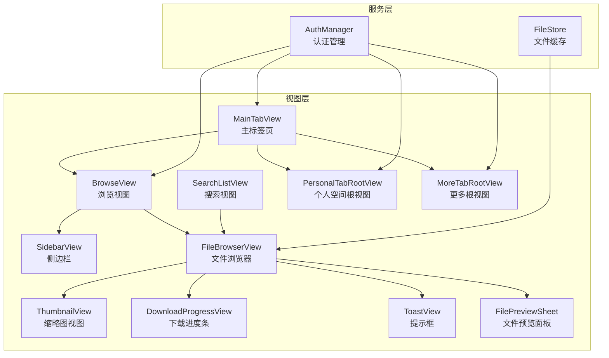
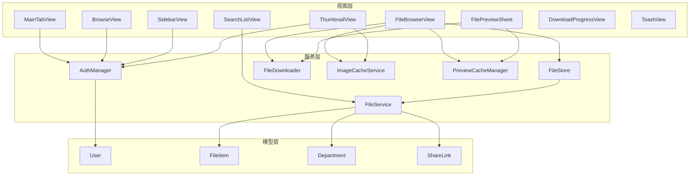
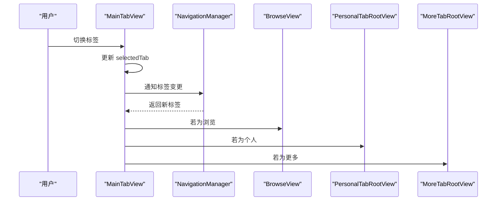
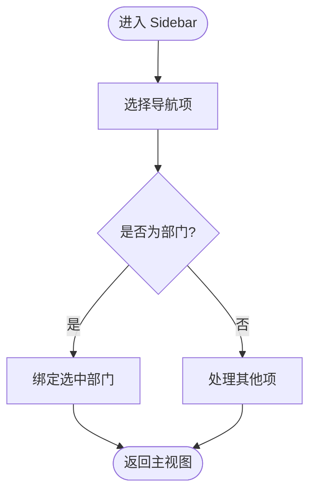
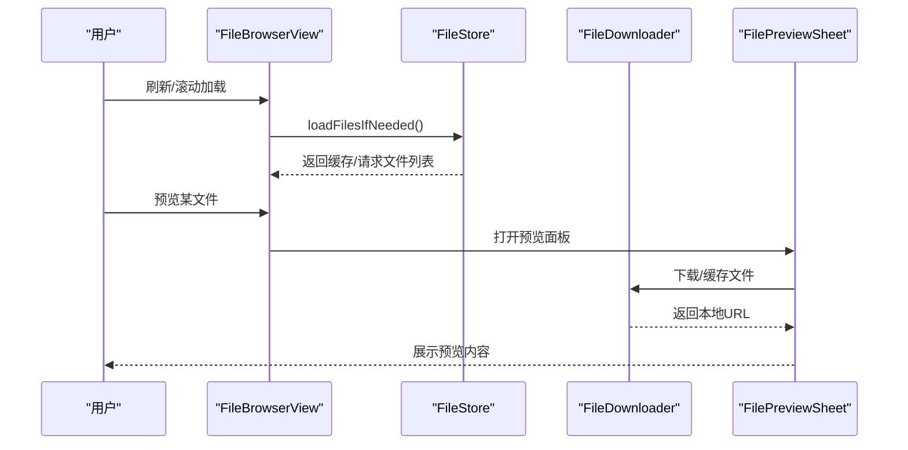
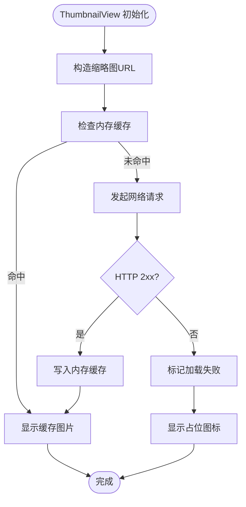
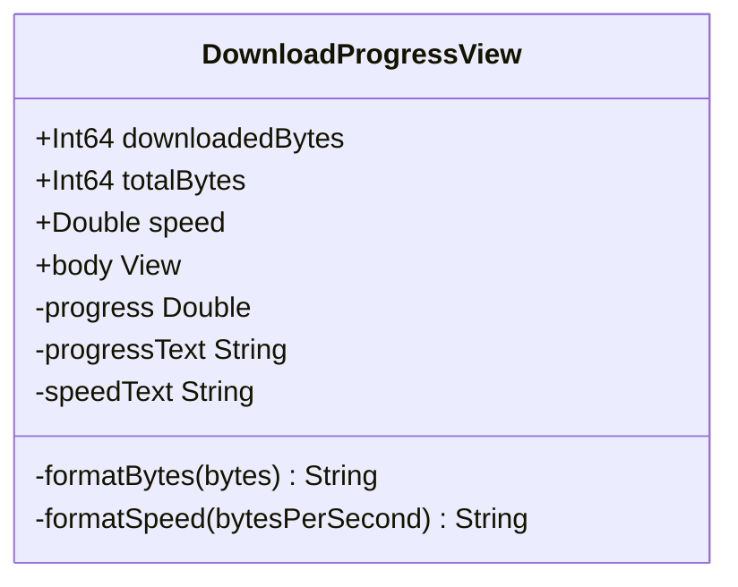
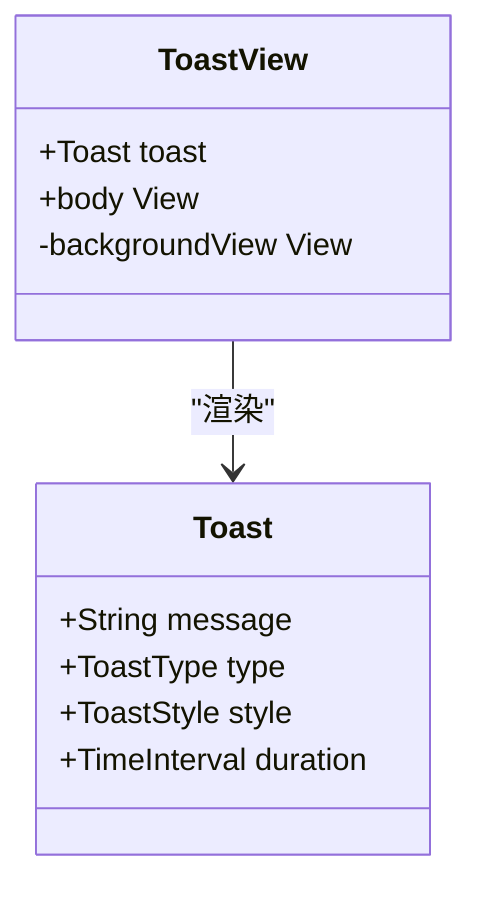
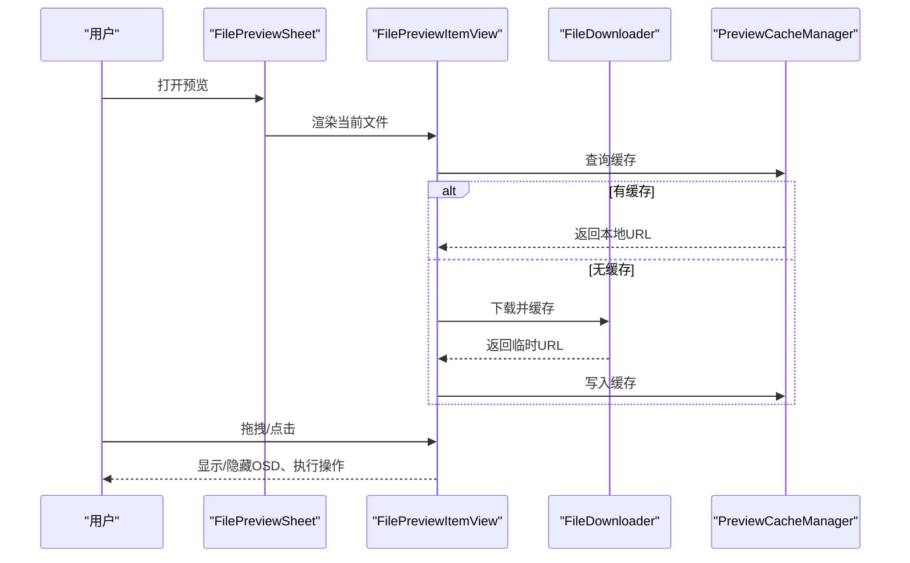
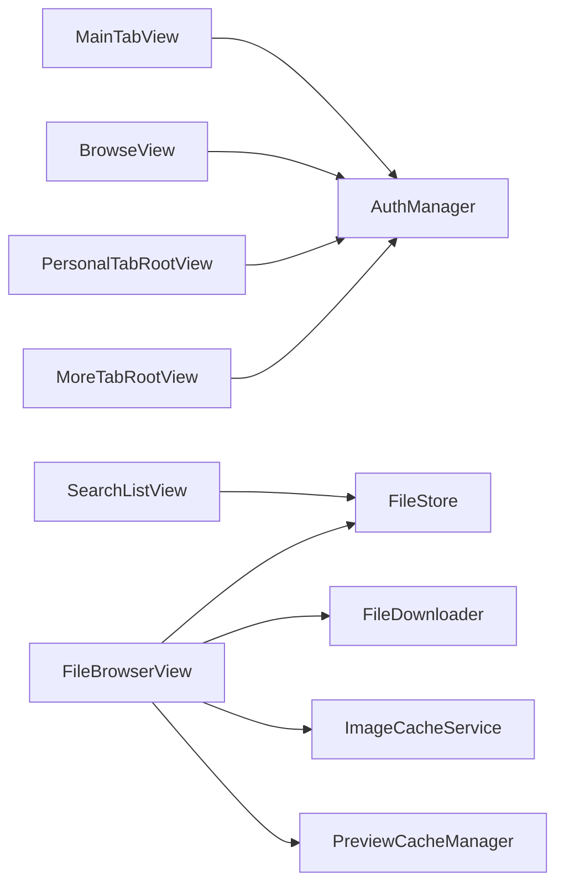

# SwiftUI 组件设计

<cite>
**本文档引用的文件**
- [MainTabView.swift](file://ios/LonghornApp/Views/Main/MainTabView.swift)
- [SidebarView.swift](file://ios/LonghornApp/Views/Main/SidebarView.swift)
- [FileBrowserView.swift](file://ios/LonghornApp/Views/Files/FileBrowserView.swift)
- [ThumbnailView.swift](file://ios/LonghornApp/Views/Components/ThumbnailView.swift)
- [DownloadProgressView.swift](file://ios/LonghornApp/Views/Components/DownloadProgressView.swift)
- [ToastView.swift](file://ios/LonghornApp/Views/Components/ToastView.swift)
- [SearchListView.swift](file://ios/LonghornApp/Views/Files/SearchListView.swift)
- [BrowseView.swift](file://ios/LonghornApp/Views/Main/BrowseView.swift)
- [PersonalTabRootView.swift](file://ios/LonghornApp/Views/Main/PersonalTabRootView.swift)
- [MoreTabRootView.swift](file://ios/LonghornApp/Views/Main/MoreTabRootView.swift)
- [FilePreviewSheet.swift](file://ios/LonghornApp/Views/Components/FilePreviewSheet.swift)
- [AuthManager.swift](file://ios/LonghornApp/Services/AuthManager.swift)
- [FileStore.swift](file://ios/LonghornApp/Services/FileStore.swift)
</cite>

## 目录
1. [简介](#简介)
2. [项目结构](#项目结构)
3. [核心组件](#核心组件)
4. [架构总览](#架构总览)
5. [详细组件分析](#详细组件分析)
6. [依赖关系分析](#依赖关系分析)
7. [性能考虑](#性能考虑)
8. [故障排查指南](#故障排查指南)
9. [结论](#结论)
10. [附录](#附录)

## 简介
本设计文档聚焦 Longhorn iOS 应用中的 SwiftUI 组件，系统梳理主标签页视图、侧边栏导航与文件浏览器三大核心模块，深入解析自定义组件（缩略图视图、提示框、下载进度条、文件预览面板）的设计模式与实现细节。文档同时阐述组件间通信机制、状态传递与事件处理流程，给出响应式设计原则、动画效果与交互优化建议，并总结组件复用策略、样式定制与可访问性支持要点。

## 项目结构
Longhorn iOS 的 SwiftUI 层采用“按功能域分层”的组织方式：
- Views 层：主界面（Main）、文件浏览（Files）、组件（Components）、设置与更多（Settings/More）等
- Services 层：认证、文件服务、缓存、下载、通知等
- Models 层：用户、文件项、权限、分享等数据模型

图表来源
- [MainTabView.swift](file://ios/LonghornApp/Views/Main/MainTabView.swift#L10-L78)
- [SidebarView.swift](file://ios/LonghornApp/Views/Main/SidebarView.swift#L10-L129)
- [FileBrowserView.swift](file://ios/LonghornApp/Views/Files/FileBrowserView.swift#L15-L305)
- [SearchListView.swift](file://ios/LonghornApp/Views/Files/SearchListView.swift#L10-L151)
- [ThumbnailView.swift](file://ios/LonghornApp/Views/Components/ThumbnailView.swift#L10-L111)
- [DownloadProgressView.swift](file://ios/LonghornApp/Views/Components/DownloadProgressView.swift#L10-L76)
- [ToastView.swift](file://ios/LonghornApp/Views/Components/ToastView.swift#L4-L43)
- [FilePreviewSheet.swift](file://ios/LonghornApp/Views/Components/FilePreviewSheet.swift#L17-L140)
- [BrowseView.swift](file://ios/LonghornApp/Views/Main/BrowseView.swift#L3-L142)
- [PersonalTabRootView.swift](file://ios/LonghornApp/Views/Main/PersonalTabRootView.swift#L3-L91)
- [MoreTabRootView.swift](file://ios/LonghornApp/Views/Main/MoreTabRootView.swift#L3-L136)
- [AuthManager.swift](file://ios/LonghornApp/Services/AuthManager.swift#L12-L89)
- [FileStore.swift](file://ios/LonghornApp/Services/FileStore.swift#L12-L101)

章节来源
- [MainTabView.swift](file://ios/LonghornApp/Views/Main/MainTabView.swift#L10-L78)
- [BrowseView.swift](file://ios/LonghornApp/Views/Main/BrowseView.swift#L3-L142)
- [PersonalTabRootView.swift](file://ios/LonghornApp/Views/Main/PersonalTabRootView.swift#L3-L91)
- [MoreTabRootView.swift](file://ios/LonghornApp/Views/Main/MoreTabRootView.swift#L3-L136)

## 核心组件
- 主标签页视图（MainTabView）：根据设备尺寸（iPhone/iPad）选择 TabView 或 NavigationSplitView 布局；通过环境对象与导航管理器协调页面跳转与标签状态。
- 侧边栏导航（SidebarView）：iPad 场景下的导航入口，基于部门与快捷项组织内容，支持用户信息与登出菜单。
- 文件浏览器（FileBrowserView）：完整的文件浏览体验，支持列表/网格视图、排序、搜索、批量操作、上传/下载、预览与分享。
- 自定义组件：缩略图视图（ThumbnailView）、下载进度条（DownloadProgressView）、提示框（ToastView）、文件预览面板（FilePreviewSheet）。

章节来源
- [MainTabView.swift](file://ios/LonghornApp/Views/Main/MainTabView.swift#L10-L78)
- [SidebarView.swift](file://ios/LonghornApp/Views/Main/SidebarView.swift#L10-L129)
- [FileBrowserView.swift](file://ios/LonghornApp/Views/Files/FileBrowserView.swift#L15-L305)
- [ThumbnailView.swift](file://ios/LonghornApp/Views/Components/ThumbnailView.swift#L10-L111)
- [DownloadProgressView.swift](file://ios/LonghornApp/Views/Components/DownloadProgressView.swift#L10-L76)
- [ToastView.swift](file://ios/LonghornApp/Views/Components/ToastView.swift#L4-L43)
- [FilePreviewSheet.swift](file://ios/LonghornApp/Views/Components/FilePreviewSheet.swift#L17-L140)

## 架构总览
Longhorn iOS 采用“视图-服务-模型”分层架构：
- 视图层负责用户交互与展示，通过环境对象与服务层解耦
- 服务层封装网络请求、缓存、下载、认证等横切关注点
- 模型层承载业务数据，如用户、文件项、权限等

图表来源
- [AuthManager.swift](file://ios/LonghornApp/Services/AuthManager.swift#L12-L89)
- [FileStore.swift](file://ios/LonghornApp/Services/FileStore.swift#L12-L101)
- [FileBrowserView.swift](file://ios/LonghornApp/Views/Files/FileBrowserView.swift#L15-L305)
- [FilePreviewSheet.swift](file://ios/LonghornApp/Views/Components/FilePreviewSheet.swift#L17-L140)
- [ThumbnailView.swift](file://ios/LonghornApp/Views/Components/ThumbnailView.swift#L10-L111)

## 详细组件分析

### 主标签页视图（MainTabView）
- 设计要点
  - 响应式布局：根据水平尺寸类选择 TabView 或 iPad 布局（当前复用 TabView 以保持一致性）
  - 标签状态：使用 AppStorage 与枚举 Tab 管理当前选中标签
  - 导航联动：监听导航管理器的标签变更，驱动 Tab 切换
- 关键交互
  - 浏览（Browse）、个人（Personal）、更多（More）三个根视图
  - 通过环境对象注入 AuthManager 与 NavigationManager
- 可扩展性
  - iPad 场景可替换为 NavigationSplitView，左侧 SidebarView 作为导航入口

图表来源
- [MainTabView.swift](file://ios/LonghornApp/Views/Main/MainTabView.swift#L10-L78)

章节来源
- [MainTabView.swift](file://ios/LonghornApp/Views/Main/MainTabView.swift#L10-L78)

### 侧边栏导航（SidebarView）
- 设计要点
  - 使用 List.sidebar 样式，Section 分组组织“快速访问、空间、部门、工具”
  - 通过枚举 SidebarItem 表示可选项目，绑定选中项
  - 集成用户头像与登出菜单
- 交互机制
  - 选择部门项时，通过 @Binding 将选中部门回传给父视图
  - 角色文本根据用户角色动态显示

图表来源
- [SidebarView.swift](file://ios/LonghornApp/Views/Main/SidebarView.swift#L10-L129)

章节来源
- [SidebarView.swift](file://ios/LonghornApp/Views/Main/SidebarView.swift#L10-L129)

### 文件浏览器（FileBrowserView）
- 设计要点
  - 支持列表/网格双视图模式与多种排序方式
  - 搜索、批量选择、上下文菜单、上传/下载、预览、分享、重命名、移动/复制、删除、收藏
  - 内置加载状态、错误提示与空态占位
- 状态管理
  - 使用 @StateObject 管理 FileStore 缓存，结合 AppStorage 控制视图模式与排序
  - 多个 @State 控制弹窗与操作状态（创建文件夹、移动、分享、删除、重命名、复制、统计、上传进度、预览、批量下载）
- 数据流
  - 通过 FileService 获取文件列表，FileStore 提供缓存与乐观更新
  - 预览面板通过 FilePreviewSheet 展示，支持拖拽关闭与详情展开

图表来源
- [FileBrowserView.swift](file://ios/LonghornApp/Views/Files/FileBrowserView.swift#L15-L305)
- [FileStore.swift](file://ios/LonghornApp/Services/FileStore.swift#L46-L85)
- [FilePreviewSheet.swift](file://ios/LonghornApp/Views/Components/FilePreviewSheet.swift#L17-L140)

章节来源
- [FileBrowserView.swift](file://ios/LonghornApp/Views/Files/FileBrowserView.swift#L15-L305)
- [FileStore.swift](file://ios/LonghornApp/Services/FileStore.swift#L12-L101)

### 缩略图视图（ThumbnailView）
- 设计要点
  - 异步加载缩略图，支持内存缓存与失败占位
  - 根据文件类型决定是否使用缩略图或系统图标
- 性能与体验
  - 使用 ImageCacheService 进行内存缓存，减少重复网络请求
  - 加载中显示占位圆角矩形与进度指示

图表来源
- [ThumbnailView.swift](file://ios/LonghornApp/Views/Components/ThumbnailView.swift#L10-L111)

章节来源
- [ThumbnailView.swift](file://ios/LonghornApp/Views/Components/ThumbnailView.swift#L10-L111)

### 下载进度条（DownloadProgressView）
- 设计要点
  - 圆形进度指示器，显示百分比、已下载/总大小与实时速度
  - 使用 ByteCountFormatter 格式化字节与速度
- 适用场景
  - 文件预览面板中的下载进度展示
  - 上传进度视图（UploadProgressView）

图表来源
- [DownloadProgressView.swift](file://ios/LonghornApp/Views/Components/DownloadProgressView.swift#L10-L76)

章节来源
- [DownloadProgressView.swift](file://ios/LonghornApp/Views/Components/DownloadProgressView.swift#L10-L76)

### 提示框（ToastView）
- 设计要点
  - 支持标准与显著两种风格，自动适配背景材质与文字颜色
  - 支持最多两行文本，圆角背景与阴影增强可读性
- 使用场景
  - 上传/下载/操作反馈等轻提示

图表来源
- [ToastView.swift](file://ios/LonghornApp/Views/Components/ToastView.swift#L4-L43)

章节来源
- [ToastView.swift](file://ios/LonghornApp/Views/Components/ToastView.swift#L4-L43)

### 文件预览面板（FilePreviewSheet）
- 设计要点
  - 支持左右滑动切换、下拉关闭、上拉展开详情
  - 针对图片、视频、PDF、文本等类型提供专用渲染器
  - 集成下载、分享、收藏、跳转到位置等操作
- 交互细节
  - 拖拽手势最小距离与垂直判断，避免与横向翻页冲突
  - OSD（On-Screen Display）顶部工具栏与底部操作区
  - 预览缓存与原图下载逻辑

图表来源
- [FilePreviewSheet.swift](file://ios/LonghornApp/Views/Components/FilePreviewSheet.swift#L17-L140)
- [FilePreviewSheet.swift](file://ios/LonghornApp/Views/Components/FilePreviewSheet.swift#L144-L755)

章节来源
- [FilePreviewSheet.swift](file://ios/LonghornApp/Views/Components/FilePreviewSheet.swift#L17-L140)
- [FilePreviewSheet.swift](file://ios/LonghornApp/Views/Components/FilePreviewSheet.swift#L144-L755)

### 搜索视图（SearchListView）
- 设计要点
  - 支持按类型筛选（全部、图片、视频、文档、音频）
  - 搜索触发与结果展示，空态与加载态处理
- 与文件浏览器的关系
  - 搜索结果可直接跳转至文件浏览器或简单详情

章节来源
- [SearchListView.swift](file://ios/LonghornApp/Views/Files/SearchListView.swift#L10-L151)

### 浏览视图（BrowseView）
- 设计要点
  - 顶部搜索入口、部门与授权目录入口、常用功能（分享、收藏、最近）
  - 根据用户角色过滤部门列表
- 与导航管理器联动
  - 监听 jumpToPath 事件，触发导航栈跳转

章节来源
- [BrowseView.swift](file://ios/LonghornApp/Views/Main/BrowseView.swift#L3-L142)

### 个人空间根视图（PersonalTabRootView）
- 设计要点
  - 用户信息头部、个人空间入口、核心统计卡片
  - 任务加载与下拉刷新

章节来源
- [PersonalTabRootView.swift](file://ios/LonghornApp/Views/Main/PersonalTabRootView.swift#L3-L91)

### 更多根视图（MoreTabRootView）
- 设计要点
  - 管理员可见系统概览，非管理员可见部门概览
  - 管理入口（团队管理）与工具入口（设置、回收站）、账户登出

章节来源
- [MoreTabRootView.swift](file://ios/LonghornApp/Views/Main/MoreTabRootView.swift#L3-L136)

## 依赖关系分析
- 组件耦合
  - MainTabView 与各根视图松耦合，通过环境对象与导航管理器传递状态
  - FileBrowserView 与 FileStore、FileDownloader、ImageCacheService 等服务强耦合，体现“视图-服务”职责分离
- 外部依赖
  - AuthManager 提供认证状态与令牌管理，贯穿应用全局
  - FileService 提供文件 CRUD 与搜索能力

图表来源
- [MainTabView.swift](file://ios/LonghornApp/Views/Main/MainTabView.swift#L10-L78)
- [BrowseView.swift](file://ios/LonghornApp/Views/Main/BrowseView.swift#L3-L142)
- [PersonalTabRootView.swift](file://ios/LonghornApp/Views/Main/PersonalTabRootView.swift#L3-L91)
- [MoreTabRootView.swift](file://ios/LonghornApp/Views/Main/MoreTabRootView.swift#L3-L136)
- [FileBrowserView.swift](file://ios/LonghornApp/Views/Files/FileBrowserView.swift#L15-L305)
- [AuthManager.swift](file://ios/LonghornApp/Services/AuthManager.swift#L12-L89)
- [FileStore.swift](file://ios/LonghornApp/Services/FileStore.swift#L12-L101)

章节来源
- [AuthManager.swift](file://ios/LonghornApp/Services/AuthManager.swift#L12-L89)
- [FileStore.swift](file://ios/LonghornApp/Services/FileStore.swift#L12-L101)

## 性能考虑
- 缓存策略
  - FileStore 对文件列表进行内存缓存，5 分钟有效期，避免重复请求
  - ThumbnailView 使用内存缓存与懒加载，降低网络与渲染压力
- 异步与并发
  - 使用 async/await 与 Task 管理后台刷新与预览加载
  - 预览面板对大图采用缩略图先行、原图异步下载与缓存
- 视图渲染
  - 列表/网格切换与懒加载 Grid，减少一次性渲染负担
  - 预览面板使用 AsyncImage 与条件渲染，避免阻塞主线程

## 故障排查指南
- 登录与认证
  - AuthManager 提供令牌持久化与会话恢复，登出时清理缓存并发出登出事件
- 文件加载失败
  - FileBrowserView 提供“重试”按钮与错误提示；FileStore 在异常时不清理旧缓存，保证离线可用
- 预览失败
  - FilePreviewSheet 提供错误提示与降级方案（WebView/PDFKitView/文本视图）
- 下载异常
  - DownloadProgressView 展示实时进度与速度；FileDownloader 负责下载与缓存，错误码区分取消与其他错误

章节来源
- [AuthManager.swift](file://ios/LonghornApp/Services/AuthManager.swift#L71-L89)
- [FileBrowserView.swift](file://ios/LonghornApp/Views/Files/FileBrowserView.swift#L740-L774)
- [FilePreviewSheet.swift](file://ios/LonghornApp/Views/Components/FilePreviewSheet.swift#L550-L560)
- [DownloadProgressView.swift](file://ios/LonghornApp/Views/Components/DownloadProgressView.swift#L10-L76)

## 结论
Longhorn iOS 的 SwiftUI 组件围绕“视图-服务-模型”分层设计，实现了主标签页、侧边栏与文件浏览器的统一交互体验。通过缓存、异步加载与预览面板的精细交互，兼顾性能与用户体验。建议后续在 iPad 场景引入 NavigationSplitView 以契合 iOS Files App 风格，并进一步完善无障碍支持与主题化样式体系。

## 附录
- 组件复用策略
  - 将通用 UI 组件（如 ToastView、DownloadProgressView、ThumbnailView）抽象为独立视图，便于跨视图复用
  - 通过协议与泛型提升组件灵活性（如 FileRowView 的抽象）
- 样式定制
  - 使用 Color、字体与圆角常量集中管理主题色与视觉规范
  - 通过环境对象注入主题与语言偏好
- 可访问性支持
  - 为按钮与图标提供语义化标签与替代文本
  - 为列表与网格提供合适的行高与间距，确保触控目标尺寸符合可访问性要求