# iOS 应用架构

<cite>
**本文档引用的文件**
- [LonghornApp.swift](file://ios/LonghornApp/LonghornApp.swift)
- [ContentView.swift](file://ios/LonghornApp/ContentView.swift)
- [LoginView.swift](file://ios/LonghornApp/Views/Auth/LoginView.swift)
- [MainTabView.swift](file://ios/LonghornApp/Views/Main/MainTabView.swift)
- [AuthManager.swift](file://ios/LonghornApp/Services/AuthManager.swift)
- [LanguageManager.swift](file://ios/LonghornApp/Services/LanguageManager.swift)
- [APIClient.swift](file://ios/LonghornApp/Services/APIClient.swift)
- [DashboardStore.swift](file://ios/LonghornApp/Services/DashboardStore.swift)
- [ToastManager.swift](file://ios/LonghornApp/Services/ToastManager.swift)
- [User.swift](file://ios/LonghornApp/Models/User.swift)
- [Localizable.xcstrings](file://ios/LonghornApp/Resources/Localizable.xcstrings)
- [Info.plist](file://ios/LonghornApp/Info.plist)
</cite>

## 目录
1. [简介](#简介)
2. [项目结构](#项目结构)
3. [核心组件](#核心组件)
4. [架构总览](#架构总览)
5. [详细组件分析](#详细组件分析)
6. [依赖关系分析](#依赖关系分析)
7. [性能考虑](#性能考虑)
8. [故障排除指南](#故障排除指南)
9. [结论](#结论)

## 简介
本文件系统性梳理 Longhorn iOS 应用的整体架构与实现细节，重点覆盖以下方面：
- SwiftUI 应用生命周期与主入口点
- MVVM 架构在 iOS 中的落地：视图模型绑定、状态管理与数据流控制
- 模块化组织结构、依赖注入与环境对象管理
- 国际化支持、深色模式适配与主题切换机制
- 应用启动流程、内存管理与性能优化策略

Longhorn iOS 客户端采用 SwiftUI + MVVM 的现代架构，通过服务层统一处理网络、缓存与业务逻辑，利用 ObservableObject + @StateObject/@EnvironmentObject 实现状态共享与响应式更新，并通过本地化资源与语言管理器实现多语言支持。

## 项目结构
应用采用按功能域划分的模块化组织方式，主要目录与职责如下：
- ios/LonghornApp/LonghornApp.swift：应用入口，定义 WindowGroup 场景，注入全局服务并通过环境对象传递给视图树
- ios/LonghornApp/ContentView.swift：根视图，依据认证状态动态切换登录页或主界面，并承载全局 Toast 展示
- ios/LonghornApp/Views/*：按功能域分层的视图集合，如 Auth、Main、Files、Shares、Settings 等
- ios/LonghornApp/Services/*：服务层，封装网络、认证、缓存、语言、通知等横切关注点
- ios/LonghornApp/Models/*：数据模型与枚举，如用户、部门、权限等
- ios/LonghornApp/Resources/*：资源文件，包括本地化字符串、图标等

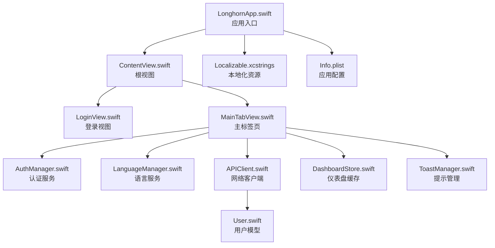

图表来源
- [LonghornApp.swift](file://ios/LonghornApp/LonghornApp.swift#L11-L24)
- [ContentView.swift](file://ios/LonghornApp/ContentView.swift#L10-L37)
- [LoginView.swift](file://ios/LonghornApp/Views/Auth/LoginView.swift#L10-L282)
- [MainTabView.swift](file://ios/LonghornApp/Views/Main/MainTabView.swift#L10-L78)
- [AuthManager.swift](file://ios/LonghornApp/Services/AuthManager.swift#L12-L195)
- [LanguageManager.swift](file://ios/LonghornApp/Services/LanguageManager.swift#L3-L57)
- [APIClient.swift](file://ios/LonghornApp/Services/APIClient.swift#L38-L326)
- [DashboardStore.swift](file://ios/LonghornApp/Services/DashboardStore.swift#L12-L157)
- [ToastManager.swift](file://ios/LonghornApp/Services/ToastManager.swift#L43-L78)
- [User.swift](file://ios/LonghornApp/Models/User.swift#L26-L50)
- [Localizable.xcstrings](file://ios/LonghornApp/Resources/Localizable.xcstrings#L1-L800)
- [Info.plist](file://ios/LonghornApp/Info.plist#L3-L11)

章节来源
- [LonghornApp.swift](file://ios/LonghornApp/LonghornApp.swift#L11-L24)
- [ContentView.swift](file://ios/LonghornApp/ContentView.swift#L10-L37)

## 核心组件
本节聚焦应用的关键组件及其职责边界与交互关系。

- 应用入口与场景管理
  - LonghornApp 作为 @main 入口，创建 WindowGroup 并注入 AuthManager 与 LanguageManager 两个全局服务，同时设置默认深色模式偏好
  - 通过 environmentObject 将服务实例注入视图层次，使子视图可直接访问

- 根视图与路由
  - ContentView 根据认证状态在 LoginView 与 MainTabView 之间切换；同时监听语言变化并触发布局刷新
  - 顶部叠加 ToastManager.shared 的当前提示，使用 z-index 保证层级

- 认证与会话管理
  - AuthManager 提供登录、登出、Token 持久化与 Keychain 操作，支持启动时会话恢复与 Token 校验
  - 登出时清理相关缓存并广播登出事件

- 语言与本地化
  - LanguageManager 统一管理当前语言代码、Locale 与 AppLanguage 枚举，支持语言切换并同步至每日单词服务

- 网络与数据流
  - APIClient 封装统一的请求构建、鉴权头添加、错误处理与文件上传/下载能力，集中处理 401 未授权并触发登出

- 缓存与状态
  - DashboardStore 提供用户、系统与部门统计数据的缓存与刷新策略，带失效时间控制
  - ToastManager 提供统一的提示展示与自动隐藏机制

章节来源
- [LonghornApp.swift](file://ios/LonghornApp/LonghornApp.swift#L11-L24)
- [ContentView.swift](file://ios/LonghornApp/ContentView.swift#L10-L37)
- [AuthManager.swift](file://ios/LonghornApp/Services/AuthManager.swift#L12-L195)
- [LanguageManager.swift](file://ios/LonghornApp/Services/LanguageManager.swift#L3-L57)
- [APIClient.swift](file://ios/LonghornApp/Services/APIClient.swift#L38-L326)
- [DashboardStore.swift](file://ios/LonghornApp/Services/DashboardStore.swift#L12-L157)
- [ToastManager.swift](file://ios/LonghornApp/Services/ToastManager.swift#L43-L78)

## 架构总览
Longhorn iOS 采用 MVVM 架构，视图层负责渲染与交互，ViewModel 通过 ObservableObject 管理状态，Model 与 Service 层承担数据与业务逻辑。依赖通过环境对象注入，形成清晰的单向数据流。

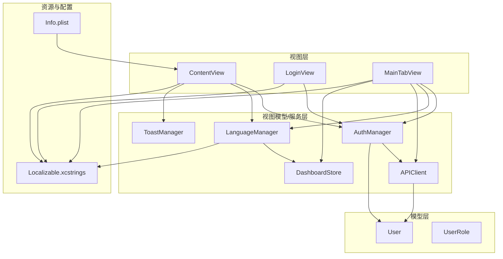

图表来源
- [ContentView.swift](file://ios/LonghornApp/ContentView.swift#L10-L37)
- [LoginView.swift](file://ios/LonghornApp/Views/Auth/LoginView.swift#L10-L282)
- [MainTabView.swift](file://ios/LonghornApp/Views/Main/MainTabView.swift#L10-L78)
- [AuthManager.swift](file://ios/LonghornApp/Services/AuthManager.swift#L12-L195)
- [LanguageManager.swift](file://ios/LonghornApp/Services/LanguageManager.swift#L3-L57)
- [APIClient.swift](file://ios/LonghornApp/Services/APIClient.swift#L38-L326)
- [DashboardStore.swift](file://ios/LonghornApp/Services/DashboardStore.swift#L12-L157)
- [ToastManager.swift](file://ios/LonghornApp/Services/ToastManager.swift#L43-L78)
- [User.swift](file://ios/LonghornApp/Models/User.swift#L26-L50)
- [Localizable.xcstrings](file://ios/LonghornApp/Resources/Localizable.xcstrings#L1-L800)
- [Info.plist](file://ios/LonghornApp/Info.plist#L3-L11)

## 详细组件分析

### 应用入口与生命周期
- 入口类 LonghornApp 创建 WindowGroup，注入 AuthManager 与 LanguageManager，并设置默认深色模式
- 根视图为 ContentView，通过环境对象访问认证与语言状态
- Info.plist 中配置了 NSAppTransportSecurity，允许任意 HTTP 加载，便于开发调试

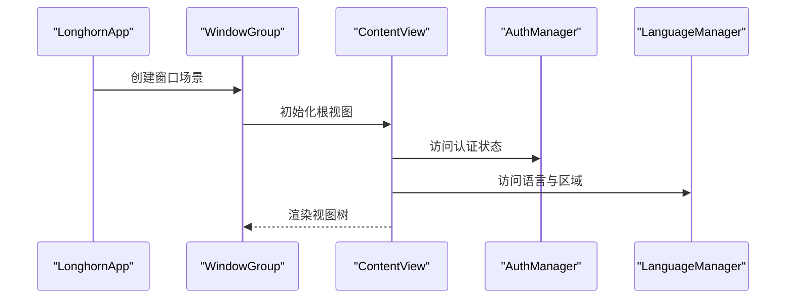

图表来源
- [LonghornApp.swift](file://ios/LonghornApp/LonghornApp.swift#L11-L24)
- [ContentView.swift](file://ios/LonghornApp/ContentView.swift#L10-L37)

章节来源
- [LonghornApp.swift](file://ios/LonghornApp/LonghornApp.swift#L11-L24)
- [Info.plist](file://ios/LonghornApp/Info.plist#L3-L11)

### 登录流程与 MVVM 绑定
- LoginView 通过 @State 管理输入字段，使用 @EnvironmentObject 访问 AuthManager
- 登录按钮触发 AuthManager.login，期间 isLoading 控制 UI 状态
- 认证错误通过 AuthManager.errorMessage 由视图层展示
- 登录成功后，AuthManager 更新 isAuthenticated，驱动 ContentView 切换到主界面

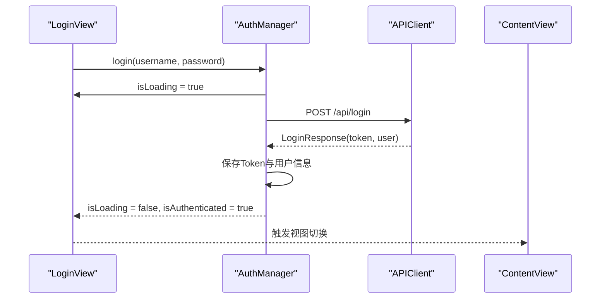

图表来源
- [LoginView.swift](file://ios/LonghornApp/Views/Auth/LoginView.swift#L10-L282)
- [AuthManager.swift](file://ios/LonghornApp/Services/AuthManager.swift#L44-L69)
- [APIClient.swift](file://ios/LonghornApp/Services/APIClient.swift#L75-L88)
- [ContentView.swift](file://ios/LonghornApp/ContentView.swift#L19-L23)

章节来源
- [LoginView.swift](file://ios/LonghornApp/Views/Auth/LoginView.swift#L10-L282)
- [AuthManager.swift](file://ios/LonghornApp/Services/AuthManager.swift#L44-L69)

### 主界面与导航
- MainTabView 根据设备尺寸选择 iPhone 的 TabView 或 iPad 的 SplitView 结构
- 通过 NavigationManager.shared 在视图间进行跨视图的状态同步（如跳转路径与选中标签）
- 侧边栏与部门浏览视图提供部门级文件浏览入口

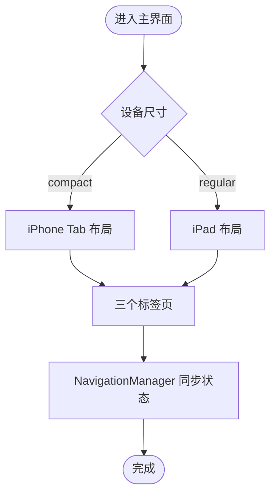

图表来源
- [MainTabView.swift](file://ios/LonghornApp/Views/Main/MainTabView.swift#L23-L77)

章节来源
- [MainTabView.swift](file://ios/LonghornApp/Views/Main/MainTabView.swift#L10-L78)

### 认证状态管理与 Keychain
- AuthManager 在初始化时检查保存的 Token 并尝试恢复用户信息
- Token 通过 Keychain 与 UserDefaults 双重持久化，确保安全与可用性
- 登出时清理缓存并广播登出事件，随后重置认证状态

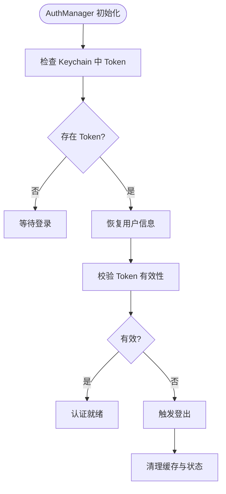

图表来源
- [AuthManager.swift](file://ios/LonghornApp/Services/AuthManager.swift#L94-L123)
- [AuthManager.swift](file://ios/LonghornApp/Services/AuthManager.swift#L72-L89)

章节来源
- [AuthManager.swift](file://ios/LonghornApp/Services/AuthManager.swift#L36-L123)

### 语言管理与国际化
- LanguageManager 统一管理语言代码映射与 Locale 生成，支持 AppLanguage 枚举与每日单词语言同步
- 通过设置环境中的 locale，驱动 SwiftUI 文本本地化渲染
- Localizable.xcstrings 提供多语言字符串资源，覆盖英文、简体中文、德文、日文

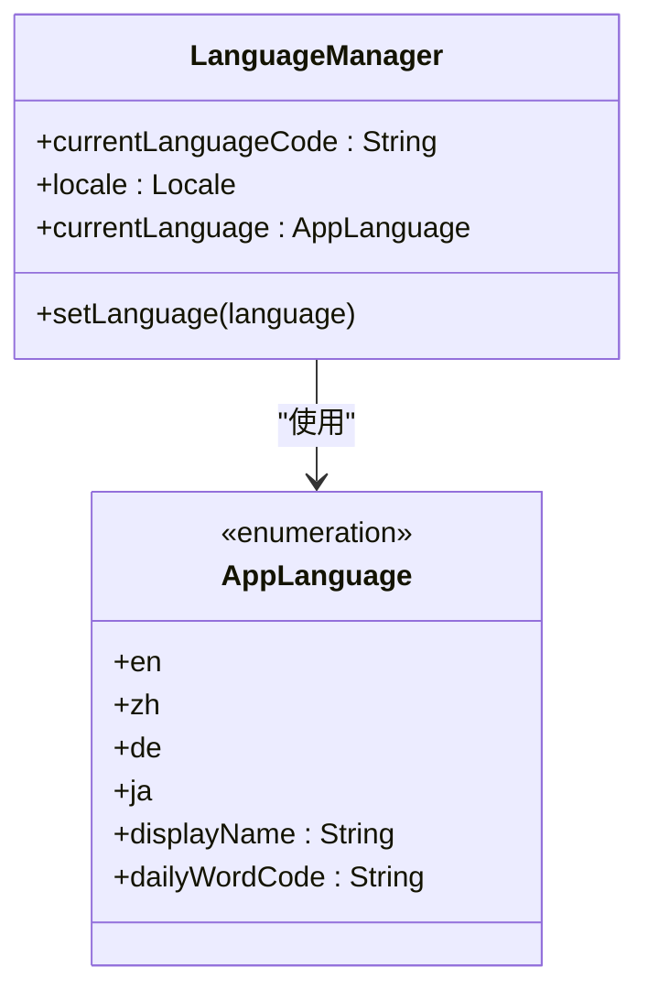

图表来源
- [LanguageManager.swift](file://ios/LonghornApp/Services/LanguageManager.swift#L3-L57)

章节来源
- [LanguageManager.swift](file://ios/LonghornApp/Services/LanguageManager.swift#L3-L57)
- [Localizable.xcstrings](file://ios/LonghornApp/Resources/Localizable.xcstrings#L1-L800)

### 网络层与错误处理
- APIClient 提供统一的 GET/POST/PUT/DELETE 接口，自动添加认证头与 JSON 编解码
- 对 401 未授权进行特殊处理，触发 AuthManager 登出
- 文件下载/上传支持进度回调与批量下载，返回临时 URL 并移动到缓存目录

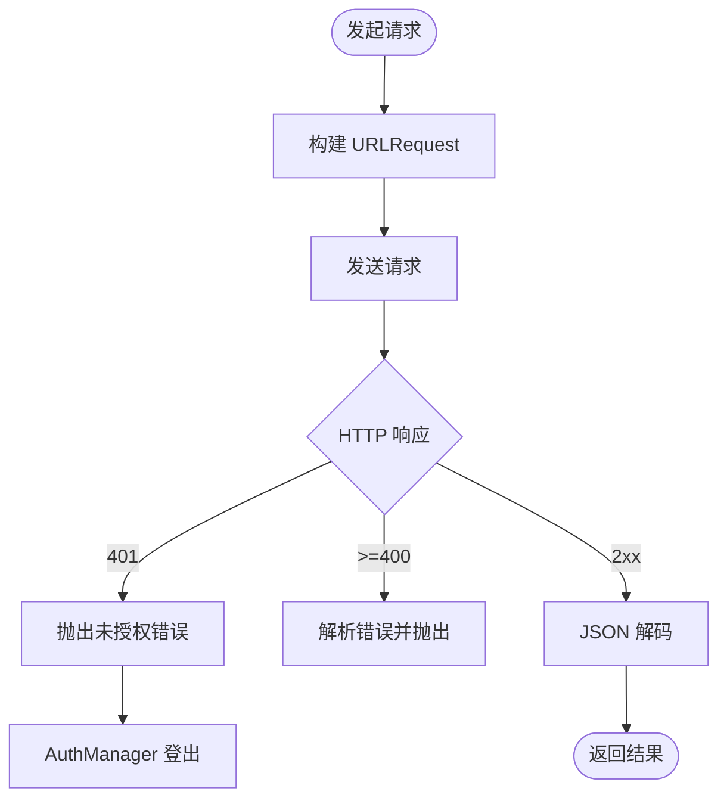

图表来源
- [APIClient.swift](file://ios/LonghornApp/Services/APIClient.swift#L247-L315)
- [AuthManager.swift](file://ios/LonghornApp/Services/AuthManager.swift#L290-L292)

章节来源
- [APIClient.swift](file://ios/LonghornApp/Services/APIClient.swift#L38-L326)

### 缓存与状态管理
- DashboardStore 以 @MainActor 运行，维护用户、系统与部门统计的缓存与加载状态
- 通过缓存有效期（默认 5 分钟）控制刷新频率，避免频繁网络请求
- 登出时清空所有缓存，确保数据一致性

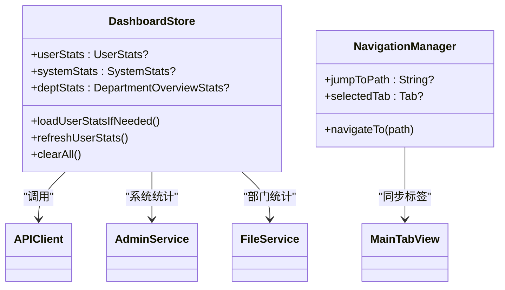

图表来源
- [DashboardStore.swift](file://ios/LonghornApp/Services/DashboardStore.swift#L12-L157)

章节来源
- [DashboardStore.swift](file://ios/LonghornApp/Services/DashboardStore.swift#L12-L157)

### 提示系统与用户体验
- ToastManager 提供统一的提示类型（成功/错误/信息/警告）与样式（标准/显著），支持自动隐藏与触觉反馈
- ContentView 顶部叠加显示当前 Toast，避免遮挡底部 TabBar

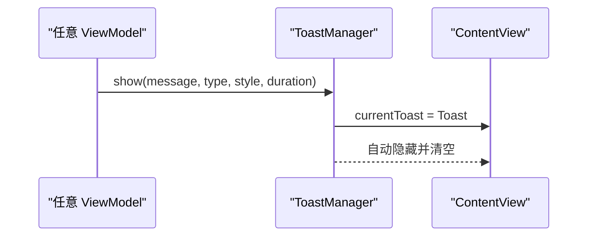

图表来源
- [ToastManager.swift](file://ios/LonghornApp/Services/ToastManager.swift#L50-L76)
- [ContentView.swift](file://ios/LonghornApp/ContentView.swift#L29-L35)

章节来源
- [ToastManager.swift](file://ios/LonghornApp/Services/ToastManager.swift#L43-L78)
- [ContentView.swift](file://ios/LonghornApp/ContentView.swift#L14-L35)

## 依赖关系分析
- 组件耦合与内聚
  - 视图层仅依赖环境对象与局部状态，保持低耦合
  - 服务层集中处理网络与业务逻辑，提升内聚性
- 直接与间接依赖
  - ContentView 间接依赖 AuthManager、LanguageManager、ToastManager
  - MainTabView 依赖 AuthManager、LanguageManager、APIClient、DashboardStore
  - APIClient 依赖 AuthManager 获取 Token，形成循环依赖需谨慎处理（已在执行阶段获取）
- 外部依赖与集成点
  - Keychain 用于 Token 安全存储
  - 本地化资源与系统 Locale 集成
  - Info.plist 中的 ATS 配置影响网络请求行为

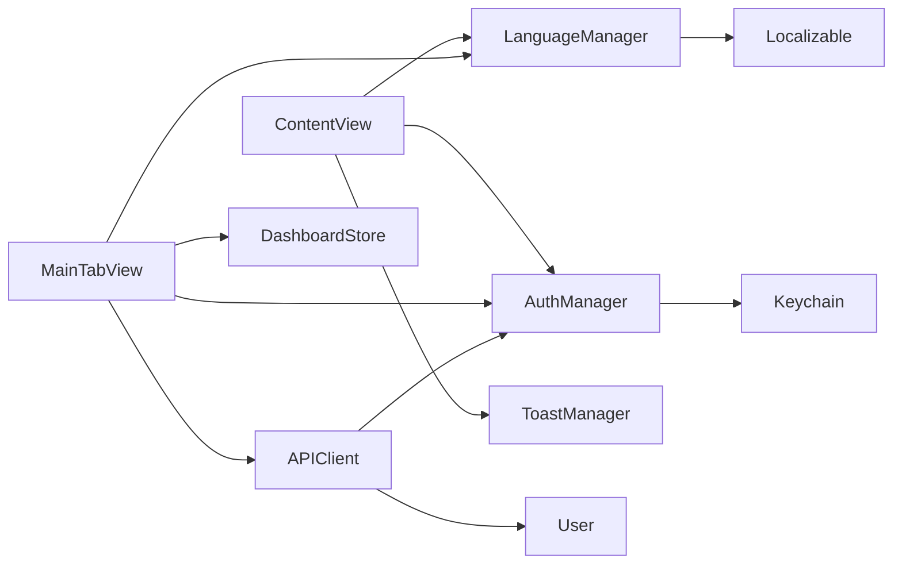

图表来源
- [ContentView.swift](file://ios/LonghornApp/ContentView.swift#L10-L37)
- [MainTabView.swift](file://ios/LonghornApp/Views/Main/MainTabView.swift#L10-L78)
- [AuthManager.swift](file://ios/LonghornApp/Services/AuthManager.swift#L12-L195)
- [APIClient.swift](file://ios/LonghornApp/Services/APIClient.swift#L38-L326)
- [User.swift](file://ios/LonghornApp/Models/User.swift#L26-L50)
- [Localizable.xcstrings](file://ios/LonghornApp/Resources/Localizable.xcstrings#L1-L800)

章节来源
- [ContentView.swift](file://ios/LonghornApp/ContentView.swift#L10-L37)
- [MainTabView.swift](file://ios/LonghornApp/Views/Main/MainTabView.swift#L10-L78)
- [AuthManager.swift](file://ios/LonghornApp/Services/AuthManager.swift#L12-L195)
- [APIClient.swift](file://ios/LonghornApp/Services/APIClient.swift#L38-L326)

## 性能考虑
- 状态与渲染
  - 使用 @Published 与 @StateObject 管理状态，避免不必要的重绘
  - ContentView 对认证状态与语言变化使用动画与 id 绑定，减少重排
- 缓存策略
  - DashboardStore 采用 5 分钟有效期缓存，降低网络压力
  - 文件下载/上传使用缓存目录与进度回调，提升用户体验
- 内存管理
  - 登出时主动清理缓存与状态，防止内存泄漏
  - 使用 @MainActor 限定 UI 相关状态更新，避免并发问题
- 网络优化
  - 统一超时配置与错误处理，避免长时间阻塞
  - 401 未授权即时登出，减少无效请求

[本节为通用指导，不直接分析具体文件]

## 故障排除指南
- 登录失败
  - 检查 AuthManager.errorMessage 与网络连通性
  - 确认 Info.plist 中 ATS 配置是否允许任意加载
- Token 失效
  - 观察 APIClient 对 401 的处理与 AuthManager 登出逻辑
  - 确保 Keychain 中 Token 正确存储与读取
- 语言切换无效
  - 确认 LanguageManager.currentLanguageCode 与 Locale 设置
  - 检查 Localizable.xcstrings 中对应键值是否存在
- Toast 不显示
  - 确认 ToastManager.shared.currentToast 已正确赋值
  - 检查 ContentView 的叠加层级与安全区域

章节来源
- [AuthManager.swift](file://ios/LonghornApp/Services/AuthManager.swift#L60-L66)
- [APIClient.swift](file://ios/LonghornApp/Services/APIClient.swift#L287-L293)
- [LanguageManager.swift](file://ios/LonghornApp/Services/LanguageManager.swift#L25-L30)
- [ToastManager.swift](file://ios/LonghornApp/Services/ToastManager.swift#L50-L76)
- [Info.plist](file://ios/LonghornApp/Info.plist#L5-L9)

## 结论
Longhorn iOS 应用通过清晰的 MVVM 分层与模块化设计，实现了认证、网络、缓存与本地化的统一管理。应用入口简洁明确，视图与服务通过环境对象解耦，配合缓存与错误处理机制，提供了稳定可靠的用户体验。建议在后续迭代中进一步完善 iPad 布局与主题切换机制，并持续优化缓存策略与网络性能。