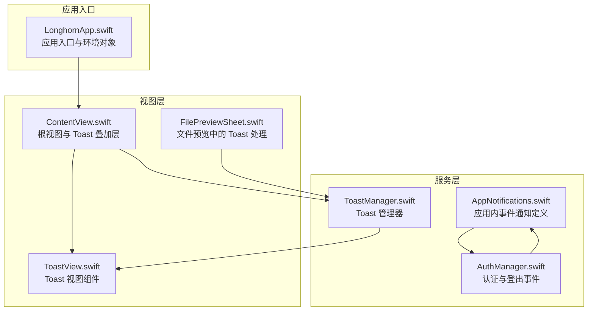
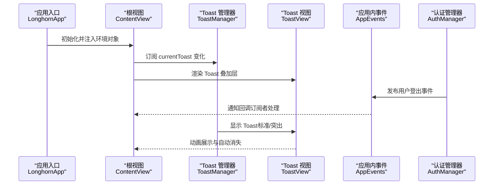
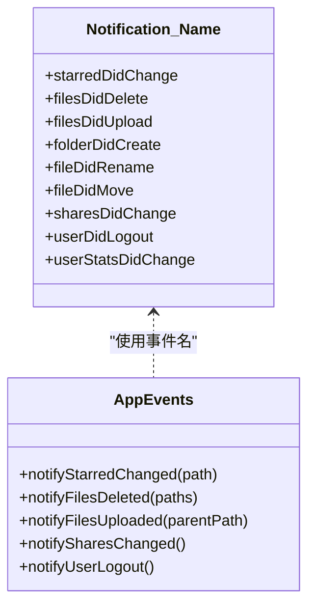
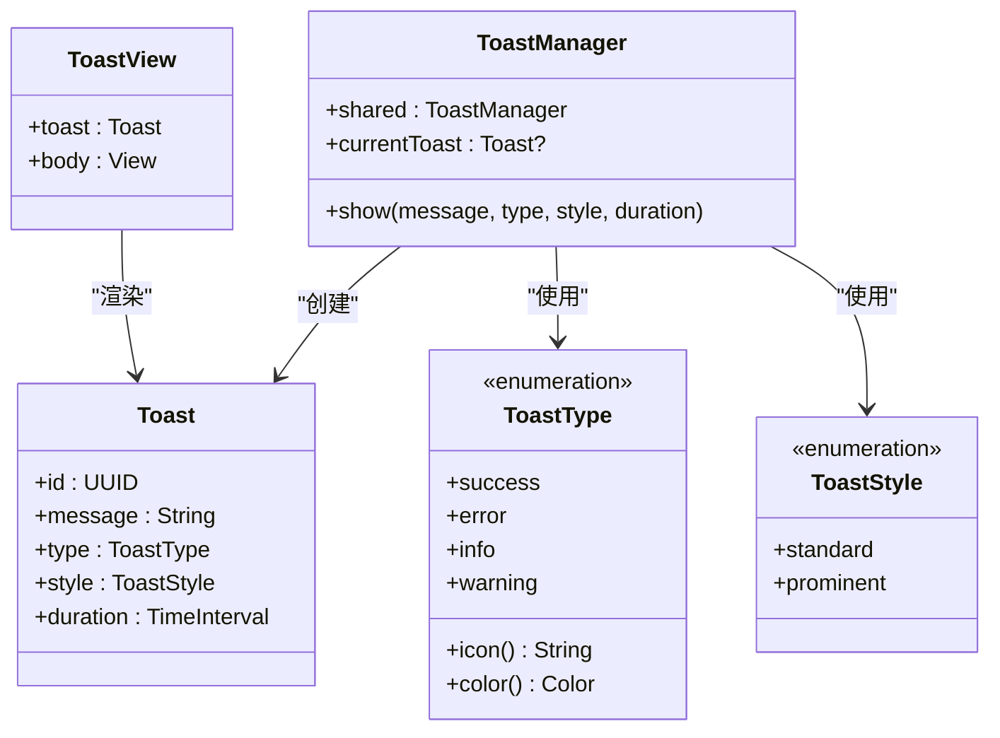
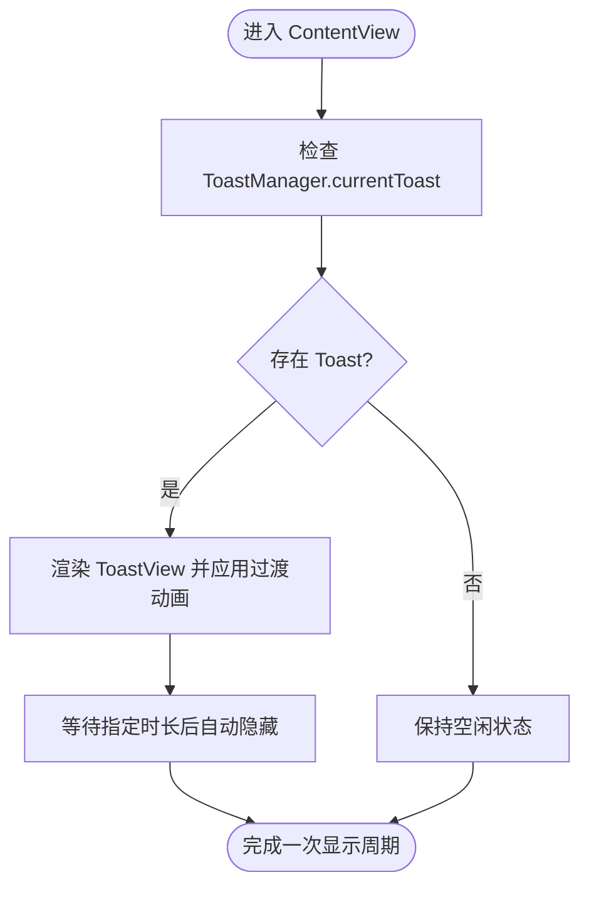
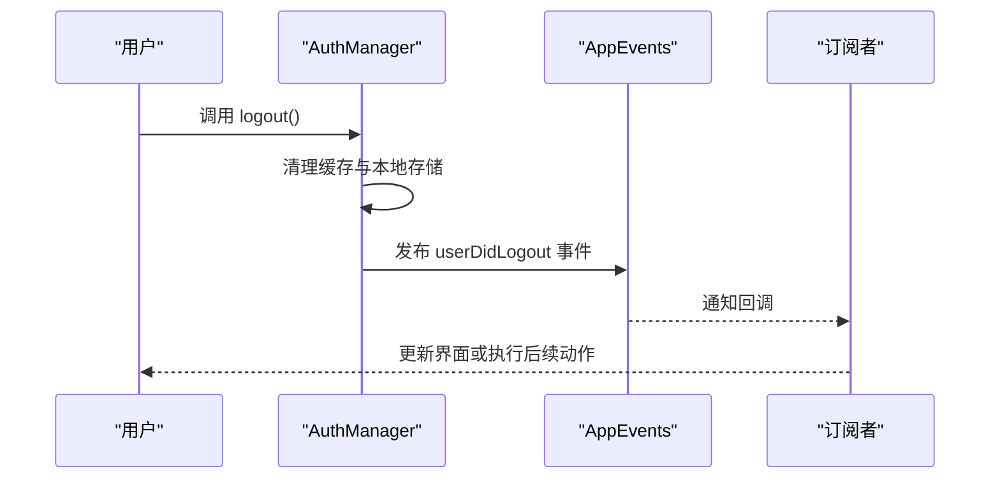
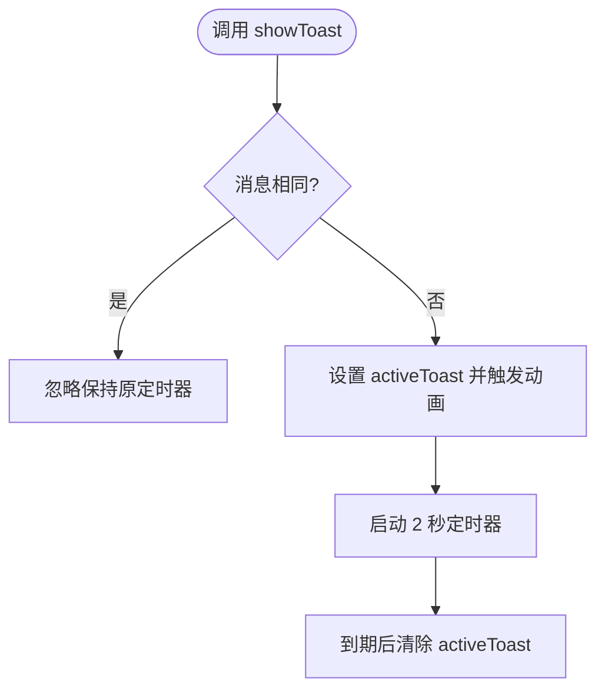
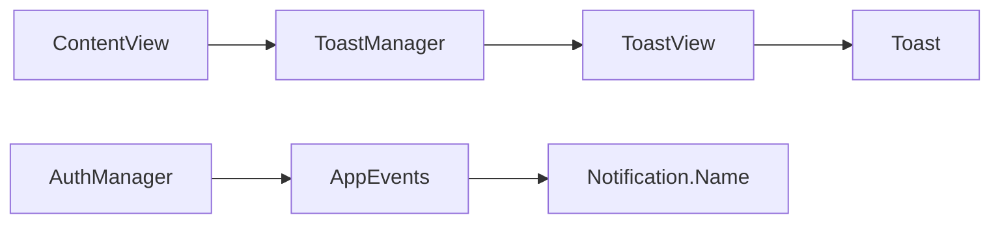

# 推送通知系统

<cite>
**本文档引用的文件**
- [AppNotifications.swift](file://ios/LonghornApp/Services/AppNotifications.swift)
- [ToastManager.swift](file://ios/LonghornApp/Services/ToastManager.swift)
- [ToastView.swift](file://ios/LonghornApp/Views/Components/ToastView.swift)
- [ContentView.swift](file://ios/LonghornApp/ContentView.swift)
- [AuthManager.swift](file://ios/LonghornApp/Services/AuthManager.swift)
- [LonghornApp.swift](file://ios/LonghornApp/LonghornApp.swift)
- [Info.plist](file://ios/LonghornApp/Info.plist)
- [FilePreviewSheet.swift](file://ios/LonghornApp/Views/Components/FilePreviewSheet.swift)
</cite>

## 目录
1. [简介](#简介)
2. [项目结构](#项目结构)
3. [核心组件](#核心组件)
4. [架构概览](#架构概览)
5. [详细组件分析](#详细组件分析)
6. [依赖关系分析](#依赖关系分析)
7. [性能考虑](#性能考虑)
8. [故障排除指南](#故障排除指南)
9. [结论](#结论)
10. [附录](#附录)

## 简介
本文件针对 Longhorn iOS 应用的通知系统进行深入技术文档化，重点覆盖以下方面：
- 应用内事件通知的统一定义与发布机制
- Toast 管理器的消息队列、自动消失与用户交互处理
- 前台通知展示与后台处理流程
- 通知个性化定制、静默推送与紧急通知处理策略
- 测试方法、调试工具与用户体验优化方案

需要特别说明的是：当前仓库中的 iOS 代码主要实现了「应用内事件通知」与「Toast 通知」两大功能模块；而「远程推送通知（APNs）」的权限申请、后台处理与前台展示等逻辑在当前代码库中并未直接体现。因此，本文档将严格基于现有代码进行分析，并对缺失部分提供可落地的实现建议与最佳实践。

## 项目结构
Longhorn iOS 项目采用 Swift（SwiftUI）开发，通知系统相关代码主要分布在以下位置：
- 服务层：统一的应用内事件通知定义与发布
- 视图层：Toast 的 UI 展示与动画效果
- 应用入口：全局环境对象注入与主题配置
- 权限与认证：登出事件触发与应用内通知联动

**图表来源**
- [LonghornApp.swift](file://ios/LonghornApp/LonghornApp.swift#L11-L25)
- [AppNotifications.swift](file://ios/LonghornApp/Services/AppNotifications.swift#L10-L43)
- [AuthManager.swift](file://ios/LonghornApp/Services/AuthManager.swift#L71-L89)
- [ToastManager.swift](file://ios/LonghornApp/Services/ToastManager.swift#L43-L77)
- [ContentView.swift](file://ios/LonghornApp/ContentView.swift#L14-L36)
- [ToastView.swift](file://ios/LonghornApp/Views/Components/ToastView.swift#L4-L43)
- [FilePreviewSheet.swift](file://ios/LonghornApp/Views/Components/FilePreviewSheet.swift#L103-L142)

**章节来源**
- [LonghornApp.swift](file://ios/LonghornApp/LonghornApp.swift#L11-L25)
- [AppNotifications.swift](file://ios/LonghornApp/Services/AppNotifications.swift#L10-L43)
- [AuthManager.swift](file://ios/LonghornApp/Services/AuthManager.swift#L71-L89)
- [ToastManager.swift](file://ios/LonghornApp/Services/ToastManager.swift#L43-L77)
- [ContentView.swift](file://ios/LonghornApp/ContentView.swift#L14-L36)
- [ToastView.swift](file://ios/LonghornApp/Views/Components/ToastView.swift#L4-L43)
- [FilePreviewSheet.swift](file://ios/LonghornApp/Views/Components/FilePreviewSheet.swift#L103-L142)

## 核心组件
本节概述通知系统的关键组件及其职责：
- 应用内事件通知定义与发布：通过扩展 Notification.Name 提供统一的事件名称，并通过 AppEvents 工具类发布事件，便于跨模块解耦通信。
- Toast 管理器：单例管理 Toast 的显示、样式与生命周期，支持标准与突出两种风格，以及触觉反馈。
- 根视图与 Toast 叠加层：在 ContentView 中以 ZStack 方式叠加 ToastView，实现底部弹出与过渡动画。
- 登出事件联动：AuthManager 在登出时通过 AppEvents 发布用户登出事件，用于触发应用内通知处理。

**章节来源**
- [AppNotifications.swift](file://ios/LonghornApp/Services/AppNotifications.swift#L10-L43)
- [AppEvents.notifyUserLogout](file://ios/LonghornApp/Services/AppNotifications.swift#L81-L85)
- [ToastManager.swift](file://ios/LonghornApp/Services/ToastManager.swift#L43-L77)
- [ContentView.swift](file://ios/LonghornApp/ContentView.swift#L28-L36)
- [AuthManager.swift](file://ios/LonghornApp/Services/AuthManager.swift#L71-L89)

## 架构概览
下图展示了应用内通知与 Toast 的整体交互流程：

**图表来源**
- [LonghornApp.swift](file://ios/LonghornApp/LonghornApp.swift#L11-L25)
- [ContentView.swift](file://ios/LonghornApp/ContentView.swift#L14-L36)
- [ToastManager.swift](file://ios/LonghornApp/Services/ToastManager.swift#L43-L77)
- [ToastView.swift](file://ios/LonghornApp/Views/Components/ToastView.swift#L4-L43)
- [AppEvents.notifyUserLogout](file://ios/LonghornApp/Services/AppNotifications.swift#L81-L85)
- [AuthManager.swift](file://ios/LonghornApp/Services/AuthManager.swift#L71-L89)

## 详细组件分析

### 应用内事件通知系统
该系统通过扩展 Notification.Name 定义了多类应用内事件，包括文件操作、分享变更与用户事件等。AppEvents 工具类提供静态方法用于发布这些事件，便于在业务逻辑中统一触发。

**图表来源**
- [AppNotifications.swift](file://ios/LonghornApp/Services/AppNotifications.swift#L10-L43)
- [AppNotifications.swift](file://ios/LonghornApp/Services/AppNotifications.swift#L47-L85)

**章节来源**
- [AppNotifications.swift](file://ios/LonghornApp/Services/AppNotifications.swift#L10-L43)
- [AppNotifications.swift](file://ios/LonghornApp/Services/AppNotifications.swift#L47-L85)

### Toast 管理器与显示机制
Toast 管理器采用单例模式，通过 @Published 属性暴露 currentToast，实现与视图层的响应式绑定。其显示逻辑包含：
- 触觉反馈：当样式为突出时，根据 Toast 类型触发相应触觉反馈
- 动画过渡：进入时使用 snappy 动画，退出时使用 easeOut 动画
- 自动消失：按设定时长延时后隐藏，避免并发显示冲突
- 个性化样式：支持标准与突出两种风格，颜色与图标随类型变化

**图表来源**
- [ToastManager.swift](file://ios/LonghornApp/Services/ToastManager.swift#L5-L28)
- [ToastManager.swift](file://ios/LonghornApp/Services/ToastManager.swift#L35-L41)
- [ToastManager.swift](file://ios/LonghornApp/Services/ToastManager.swift#L43-L77)
- [ToastView.swift](file://ios/LonghornApp/Views/Components/ToastView.swift#L4-L43)

**章节来源**
- [ToastManager.swift](file://ios/LonghornApp/Services/ToastManager.swift#L5-L28)
- [ToastManager.swift](file://ios/LonghornApp/Services/ToastManager.swift#L35-L41)
- [ToastManager.swift](file://ios/LonghornApp/Services/ToastManager.swift#L43-L77)
- [ToastView.swift](file://ios/LonghornApp/Views/Components/ToastView.swift#L4-L43)

### 前台通知展示与用户交互
根视图 ContentView 将 ToastView 作为叠加层渲染在底部，结合动画与 z-index 实现自然的出现与消失。Toast 的显示与隐藏完全由 ToastManager 控制，确保 UI 与业务逻辑解耦。

**图表来源**
- [ContentView.swift](file://ios/LonghornApp/ContentView.swift#L14-L36)
- [ToastManager.swift](file://ios/LonghornApp/Services/ToastManager.swift#L50-L76)

**章节来源**
- [ContentView.swift](file://ios/LonghornApp/ContentView.swift#L14-L36)
- [ToastManager.swift](file://ios/LonghornApp/Services/ToastManager.swift#L50-L76)

### 登出事件与应用内通知联动
AuthManager 在执行登出操作时，清理缓存并发布用户登出事件，从而触发应用内通知链路。订阅者可据此更新 UI 或执行其他清理逻辑。

**图表来源**
- [AuthManager.swift](file://ios/LonghornApp/Services/AuthManager.swift#L71-L89)
- [AppEvents.notifyUserLogout](file://ios/LonghornApp/Services/AppNotifications.swift#L81-L85)

**章节来源**
- [AuthManager.swift](file://ios/LonghornApp/Services/AuthManager.swift#L71-L89)
- [AppEvents.notifyUserLogout](file://ios/LonghornApp/Services/AppNotifications.swift#L81-L85)

### 文件预览中的 Toast 处理
文件预览视图中实现了独立的 Toast 显示逻辑，通过状态变量 activeToast 与 onChange 监听实现自动消失与重复提示的处理策略。

**图表来源**
- [FilePreviewSheet.swift](file://ios/LonghornApp/Views/Components/FilePreviewSheet.swift#L103-L142)

**章节来源**
- [FilePreviewSheet.swift](file://ios/LonghornApp/Views/Components/FilePreviewSheet.swift#L103-L142)

## 依赖关系分析
通知系统各组件之间的依赖关系如下：
- ContentView 依赖 ToastManager 提供的 currentToast 状态
- ToastView 依赖 Toast 结构体进行渲染
- AuthManager 通过 AppEvents 发布用户登出事件
- AppEvents 使用 Notification.Name 定义的事件名

**图表来源**
- [ContentView.swift](file://ios/LonghornApp/ContentView.swift#L14-L36)
- [ToastManager.swift](file://ios/LonghornApp/Services/ToastManager.swift#L43-L77)
- [ToastView.swift](file://ios/LonghornApp/Views/Components/ToastView.swift#L4-L43)
- [AuthManager.swift](file://ios/LonghornApp/Services/AuthManager.swift#L71-L89)
- [AppNotifications.swift](file://ios/LonghornApp/Services/AppNotifications.swift#L10-L43)

**章节来源**
- [ContentView.swift](file://ios/LonghornApp/ContentView.swift#L14-L36)
- [ToastManager.swift](file://ios/LonghornApp/Services/ToastManager.swift#L43-L77)
- [ToastView.swift](file://ios/LonghornApp/Views/Components/ToastView.swift#L4-L43)
- [AuthManager.swift](file://ios/LonghornApp/Services/AuthManager.swift#L71-L89)
- [AppNotifications.swift](file://ios/LonghornApp/Services/AppNotifications.swift#L10-L43)

## 性能考虑
- 响应式更新：ToastManager 使用 @Published 属性驱动 UI 更新，避免手动刷新带来的性能损耗
- 主线程任务：Toast 显示与隐藏均在主线程执行，确保动画与布局一致性
- 动画优化：进入与退出使用轻量级动画，减少复杂计算开销
- 内存管理：Toast 为值类型，生命周期由管理器控制，避免循环引用

[本节为通用性能建议，不直接分析具体文件]

## 故障排除指南
- Toast 不显示或闪烁
  - 检查是否在主线程调用 ToastManager.show
  - 确认 ContentView 中已正确订阅 currentToast 并渲染 ToastView
- Toast 自动消失异常
  - 核对 duration 参数是否合理
  - 确保未在短时间内重复调用 show 导致计时器冲突
- 登出事件未触发
  - 确认 AuthManager.logout 是否被调用
  - 检查订阅者是否正确注册并处理 userDidLogout 事件
- 网络与安全配置
  - 若遇到网络请求问题，检查 Info.plist 中的 NSAppTransportSecurity 设置

**章节来源**
- [ToastManager.swift](file://ios/LonghornApp/Services/ToastManager.swift#L50-L76)
- [ContentView.swift](file://ios/LonghornApp/ContentView.swift#L28-L36)
- [AuthManager.swift](file://ios/LonghornApp/Services/AuthManager.swift#L71-L89)
- [Info.plist](file://ios/LonghornApp/Info.plist#L4-L11)

## 结论
Longhorn iOS 的通知系统以「应用内事件通知」与「Toast 通知」为核心，实现了清晰的模块划分与良好的解耦设计。通过统一的事件定义与发布机制，配合响应式的 Toast 管理器，系统在前台展示与用户交互方面具备良好的可用性。对于远程推送通知（APNs）相关的权限申请、后台处理与前台展示等功能，当前代码库尚未实现，建议参考 Apple 推送通知框架与本仓库现有通知模式进行集成。

[本节为总结性内容，不直接分析具体文件]

## 附录

### 通知类型与样式对照表
- Toast 类型：success、error、info、warning
- Toast 样式：standard（磨砂玻璃）、prominent（纯色强调）
- 默认时长：2.0 秒

**章节来源**
- [ToastManager.swift](file://ios/LonghornApp/Services/ToastManager.swift#L5-L28)
- [ToastManager.swift](file://ios/LonghornApp/Services/ToastManager.swift#L30-L33)
- [ToastManager.swift](file://ios/LonghornApp/Services/ToastManager.swift#L40-L41)

### 远程推送通知（APNs）实现建议
由于当前代码库未包含 APNs 相关实现，以下为可落地的集成步骤建议：
- 权限申请：在应用启动时请求用户授权接收通知
- 后台处理：在应用进入后台时保存必要的上下文，以便前台展示时恢复
- 前台展示：将远程推送内容转换为应用内 Toast 或页面提示
- 紧急通知：对关键事件（如安全告警）采用突出样式与触觉反馈
- 静默推送：仅更新应用内状态而不展示 UI，避免打扰用户

[本节为概念性建议，不直接映射到具体源码文件]