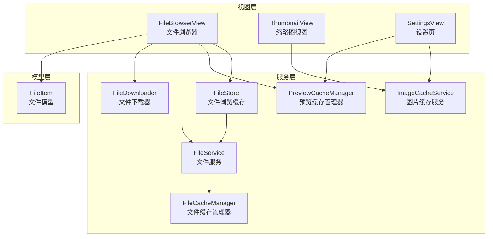
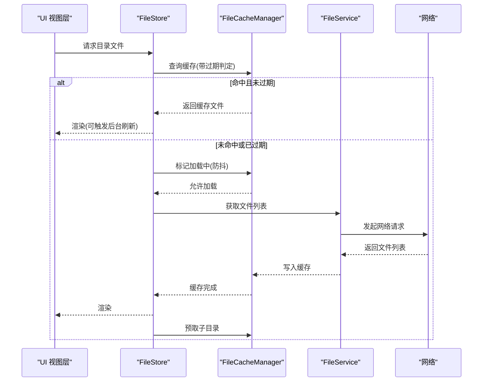
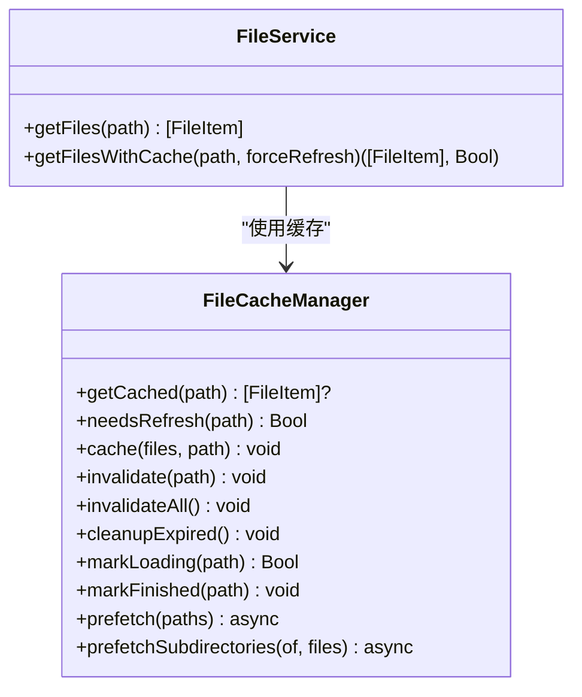
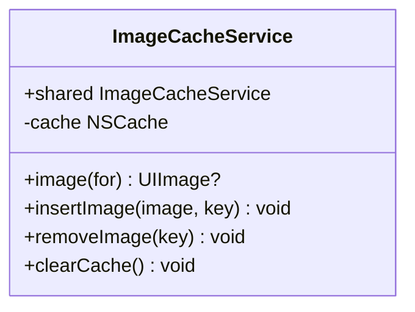
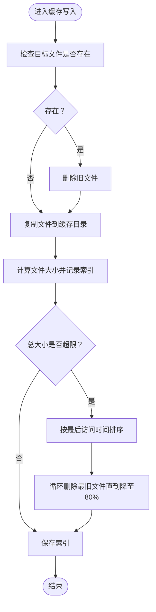
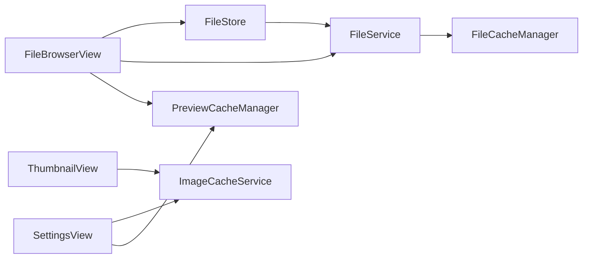

# 数据缓存策略

<cite>
**本文引用的文件**
- [FileCacheManager.swift](file://ios/LonghornApp/Services/FileCacheManager.swift)
- [ImageCacheService.swift](file://ios/LonghornApp/Services/ImageCacheService.swift)
- [PreviewCacheManager.swift](file://ios/LonghornApp/Services/PreviewCacheManager.swift)
- [FileStore.swift](file://ios/LonghornApp/Services/FileStore.swift)
- [FileService.swift](file://ios/LonghornApp/Services/FileService.swift)
- [FileItem.swift](file://ios/LonghornApp/Models/FileItem.swift)
- [FileDownloader.swift](file://ios/LonghornApp/Services/FileDownloader.swift)
- [FileBrowserView.swift](file://ios/LonghornApp/Views/Files/FileBrowserView.swift)
- [ThumbnailView.swift](file://ios/LonghornApp/Views/Components/ThumbnailView.swift)
- [SettingsView.swift](file://ios/LonghornApp/Views/Settings/SettingsView.swift)
- [DashboardStore.swift](file://ios/LonghornApp/Services/DashboardStore.swift)
</cite>

## 目录
1. [简介](#简介)
2. [项目结构](#项目结构)
3. [核心组件](#核心组件)
4. [架构总览](#架构总览)
5. [组件详解](#组件详解)
6. [依赖关系分析](#依赖关系分析)
7. [性能考量](#性能考量)
8. [故障排除指南](#故障排除指南)
9. [结论](#结论)

## 简介
本文件系统性梳理 Longhorn iOS 应用的数据缓存策略，重点覆盖三类缓存：
- 文件缓存管理器：基于“过期时间”的目录列表缓存与预取机制，采用 stale-while-revalidate 模式提升交互流畅度。
- 图片缓存服务：基于内存缓存（NSCache）的缩略图与预览图缓存，支持容量与条目上限控制。
- 预览缓存管理器：基于磁盘的 LRU 缓存，按总大小上限进行淘汰，保障预览文件的快速访问。

文档还涵盖缓存大小限制、LRU 算法实现、缓存命中率优化建议、性能监控与调试手段，以及常见问题排查方法。

## 项目结构
围绕缓存策略的关键代码位于 iOS 应用的 Services 与 Views 层：
- Services：文件缓存、图片缓存、预览缓存、文件服务、下载器等。
- Models：文件模型定义，包含文件类型判定与格式化信息。
- Views：文件浏览器、缩略图视图、设置页等使用缓存的界面层。

图表来源
- [FileBrowserView.swift](file://ios/LonghornApp/Views/Files/FileBrowserView.swift#L880-L973)
- [ThumbnailView.swift](file://ios/LonghornApp/Views/Components/ThumbnailView.swift#L64-L110)
- [SettingsView.swift](file://ios/LonghornApp/Views/Settings/SettingsView.swift#L105-L119)
- [FileCacheManager.swift](file://ios/LonghornApp/Services/FileCacheManager.swift#L29-L133)
- [FileDownloader.swift](file://ios/LonghornApp/Services/FileDownloader.swift#L20-L42)
- [PreviewCacheManager.swift](file://ios/LonghornApp/Services/PreviewCacheManager.swift#L10-L219)
- [ImageCacheService.swift](file://ios/LonghornApp/Services/ImageCacheService.swift#L10-L37)
- [FileService.swift](file://ios/LonghornApp/Services/FileService.swift#L11-L419)
- [FileStore.swift](file://ios/LonghornApp/Services/FileStore.swift#L12-L140)
- [FileItem.swift](file://ios/LonghornApp/Models/FileItem.swift#L12-L194)

章节来源
- [FileCacheManager.swift](file://ios/LonghornApp/Services/FileCacheManager.swift#L1-L185)
- [ImageCacheService.swift](file://ios/LonghornApp/Services/ImageCacheService.swift#L1-L37)
- [PreviewCacheManager.swift](file://ios/LonghornApp/Services/PreviewCacheManager.swift#L1-L219)
- [FileStore.swift](file://ios/LonghornApp/Services/FileStore.swift#L1-L140)
- [FileService.swift](file://ios/LonghornApp/Services/FileService.swift#L1-L419)
- [FileItem.swift](file://ios/LonghornApp/Models/FileItem.swift#L1-L288)
- [FileBrowserView.swift](file://ios/LonghornApp/Views/Files/FileBrowserView.swift#L880-L973)
- [ThumbnailView.swift](file://ios/LonghornApp/Views/Components/ThumbnailView.swift#L1-L216)
- [SettingsView.swift](file://ios/LonghornApp/Views/Settings/SettingsView.swift#L100-L121)

## 核心组件
- 文件缓存管理器（SWR 模式）：维护目录列表缓存，区分“过期”与“完全过期”，支持后台刷新与预取；通过 FileService 扩展提供带缓存的文件列表获取。
- 图片缓存服务：基于 NSCache 的内存缓存，限制条目数与总占用字节，提供增删查清能力。
- 预览缓存管理器：基于磁盘的 LRU 缓存，按总大小上限进行淘汰，索引持久化，支持去孤儿文件清理。
- 文件浏览缓存（FileStore）：UI 主线程安全的浏览缓存，结合过期时间与加载状态，避免重复请求。
- 文件模型（FileItem）：提供文件类型判定（图片/视频/音频/文档），辅助缓存策略选择。

章节来源
- [FileCacheManager.swift](file://ios/LonghornApp/Services/FileCacheManager.swift#L29-L184)
- [ImageCacheService.swift](file://ios/LonghornApp/Services/ImageCacheService.swift#L10-L37)
- [PreviewCacheManager.swift](file://ios/LonghornApp/Services/PreviewCacheManager.swift#L10-L219)
- [FileStore.swift](file://ios/LonghornApp/Services/FileStore.swift#L12-L140)
- [FileItem.swift](file://ios/LonghornApp/Models/FileItem.swift#L12-L194)

## 架构总览
整体缓存架构由“内存缓存 + 磁盘缓存 + 网络服务”三层组成，配合 UI 层的懒加载与预取策略，实现低延迟与高命中率。

图表来源
- [FileStore.swift](file://ios/LonghornApp/Services/FileStore.swift#L46-L85)
- [FileCacheManager.swift](file://ios/LonghornApp/Services/FileCacheManager.swift#L137-L184)
- [FileService.swift](file://ios/LonghornApp/Services/FileService.swift#L18-L39)

## 组件详解

### 文件缓存管理器（SWR 模式）
- 过期策略
  - “过期”（stale）：默认 5 分钟，允许返回旧数据并后台刷新。
  - “完全过期”（expired）：默认 30 分钟，不再返回缓存。
- 并发控制
  - 通过加载集合避免重复请求，返回“加载中”状态给调用方。
- 预取机制
  - 预取直接子目录，最多 5 个，降低后续访问延迟。
- 与 FileService 的集成
  - 通过扩展提供带缓存的文件列表获取，自动触发后台刷新与预取。

图表来源
- [FileCacheManager.swift](file://ios/LonghornApp/Services/FileCacheManager.swift#L29-L133)
- [FileService.swift](file://ios/LonghornApp/Services/FileService.swift#L137-L184)

章节来源
- [FileCacheManager.swift](file://ios/LonghornApp/Services/FileCacheManager.swift#L11-L133)
- [FileService.swift](file://ios/LonghornApp/Services/FileService.swift#L137-L184)

### 图片缓存服务（内存缓存）
- 缓存介质：内存（NSCache）。
- 限制策略：
  - 条目数量上限：固定值。
  - 总占用字节上限：固定值。
- 接口能力：查询、插入、移除、清空。

图表来源
- [ImageCacheService.swift](file://ios/LonghornApp/Services/ImageCacheService.swift#L10-L37)

章节来源
- [ImageCacheService.swift](file://ios/LonghornApp/Services/ImageCacheService.swift#L10-L37)
- [ThumbnailView.swift](file://ios/LonghornApp/Views/Components/ThumbnailView.swift#L64-L110)

### 预览缓存管理器（磁盘 LRU 缓存）
- 存储位置：应用 Caches 目录下的独立缓存目录，索引文件 index.json 持久化。
- 缓存策略：
  - 基于“最近最少使用”（LRU）淘汰，依据最后访问时间排序。
  - 总大小超过上限（默认 500MB）时，从最旧开始删除，直至降至 80%。
- 索引与一致性：
  - 异步加载索引，启动时清理孤儿文件（存在于磁盘但不在索引中的文件）。
  - 访问时更新内存中的最后访问时间，定期去抖保存索引。
- 失效与清理：
  - 单文件失效、批量失效、按前缀失效（目录级）、清空全部。

图表来源
- [PreviewCacheManager.swift](file://ios/LonghornApp/Services/PreviewCacheManager.swift#L115-L166)

章节来源
- [PreviewCacheManager.swift](file://ios/LonghornApp/Services/PreviewCacheManager.swift#L10-L219)

### 文件浏览缓存（FileStore）
- 缓存结构：路径 -> 文件列表，配合最后更新时间与加载状态。
- 过期时间：默认 5 分钟，避免频繁网络请求。
- 并发控制：避免同一路径重复请求。
- 乐观更新：支持添加/删除/重命名等操作后的缓存同步。

章节来源
- [FileStore.swift](file://ios/LonghornApp/Services/FileStore.swift#L12-L140)

### 文件模型（FileItem）
- 提供文件类型判定（图片/视频/音频/文档），辅助 UI 与缓存策略选择。
- 提供格式化大小与修改时间，便于展示与统计。

章节来源
- [FileItem.swift](file://ios/LonghornApp/Models/FileItem.swift#L12-L194)

## 依赖关系分析
- FileBrowserView 依赖 FileStore 与 FileService 获取文件列表；当缓存命中时优先渲染，未命中时触发网络请求与后台刷新。
- ThumbnailView 依赖 ImageCacheService 进行缩略图缓存，减少网络与解码开销。
- SettingsView 提供一键清理内存与磁盘缓存入口，便于调试与释放空间。
- DashboardStore 与 FileStore 类似，采用统一的过期时间策略，保障仪表盘数据的及时性与稳定性。

图表来源
- [FileBrowserView.swift](file://ios/LonghornApp/Views/Files/FileBrowserView.swift#L880-L973)
- [ThumbnailView.swift](file://ios/LonghornApp/Views/Components/ThumbnailView.swift#L64-L110)
- [SettingsView.swift](file://ios/LonghornApp/Views/Settings/SettingsView.swift#L105-L119)
- [FileStore.swift](file://ios/LonghornApp/Services/FileStore.swift#L46-L85)
- [FileService.swift](file://ios/LonghornApp/Services/FileService.swift#L137-L184)
- [FileCacheManager.swift](file://ios/LonghornApp/Services/FileCacheManager.swift#L137-L184)

章节来源
- [FileBrowserView.swift](file://ios/LonghornApp/Views/Files/FileBrowserView.swift#L880-L973)
- [ThumbnailView.swift](file://ios/LonghornApp/Views/Components/ThumbnailView.swift#L64-L110)
- [SettingsView.swift](file://ios/LonghornApp/Views/Settings/SettingsView.swift#L105-L119)
- [FileStore.swift](file://ios/LonghornApp/Services/FileStore.swift#L46-L85)
- [FileService.swift](file://ios/LonghornApp/Services/FileService.swift#L137-L184)
- [FileCacheManager.swift](file://ios/LonghornApp/Services/FileCacheManager.swift#L137-L184)

## 性能考量
- 缓存大小限制
  - 图片缓存：条目数与总字节数双限制，避免内存峰值过高。
  - 预览缓存：总大小上限与淘汰阈值，平衡磁盘占用与命中率。
- LRU 算法实现
  - 以“最后访问时间”为淘汰键，排序后自最旧向新推进删除，直至降至 80% 上限。
- 命中率优化建议
  - 预取策略：对用户即将进入的子目录进行预取，降低首屏等待。
  - UI 懒加载：仅在可见区域加载缩略图，减少不必要的网络与解码。
  - 缓存键设计：缩略图键包含尺寸参数，避免尺寸混淆导致的误命中。
- 并发与去抖
  - 加载状态集合避免重复请求；索引保存采用去抖策略，降低频繁磁盘写入。
- 离线可用性
  - 刷新失败时保留旧缓存，保证基本浏览功能。

章节来源
- [ImageCacheService.swift](file://ios/LonghornApp/Services/ImageCacheService.swift#L15-L19)
- [PreviewCacheManager.swift](file://ios/LonghornApp/Services/PreviewCacheManager.swift#L24-L39)
- [PreviewCacheManager.swift](file://ios/LonghornApp/Services/PreviewCacheManager.swift#L147-L166)
- [FileStore.swift](file://ios/LonghornApp/Services/FileStore.swift#L46-L85)
- [FileCacheManager.swift](file://ios/LonghornApp/Services/FileCacheManager.swift#L101-L132)

## 故障排除指南
- 预览缓存异常
  - 现象：预览打开失败或空白。
  - 排查：检查预览缓存目录是否存在对应文件；若索引存在但磁盘缺失，会自动清理并重建索引；可在设置中一键清空磁盘缓存。
- 缩略图不显示
  - 现象：缩略图占位或加载失败。
  - 排查：确认缓存键包含尺寸参数；检查网络请求与授权头；必要时清空内存缓存后重试。
- 目录列表卡顿
  - 现象：切换目录时短暂卡顿。
  - 排查：确认是否触发了后台刷新与预取；检查是否有大量重复请求被合并。
- 缓存清理
  - 设置页提供“清空所有缓存”入口，可一次性清理内存与磁盘缓存，便于定位问题与释放空间。

章节来源
- [PreviewCacheManager.swift](file://ios/LonghornApp/Services/PreviewCacheManager.swift#L42-L63)
- [SettingsView.swift](file://ios/LonghornApp/Views/Settings/SettingsView.swift#L105-L119)
- [ThumbnailView.swift](file://ios/LonghornApp/Views/Components/ThumbnailView.swift#L64-L110)
- [FileCacheManager.swift](file://ios/LonghornApp/Services/FileCacheManager.swift#L101-L132)

## 结论
Longhorn iOS 的缓存体系通过“内存缓存 + 磁盘缓存 + 网络服务”的分层设计，在保证用户体验的同时兼顾资源占用与稳定性。文件缓存采用 SWR 模式与预取策略，图片缓存采用 NSCache 的容量限制，预览缓存采用 LRU 与大小上限控制。配合 UI 层的懒加载与去抖策略，整体命中率与响应速度得到显著提升。建议在后续迭代中引入缓存命中率统计与更细粒度的监控指标，持续优化缓存策略与资源分配。