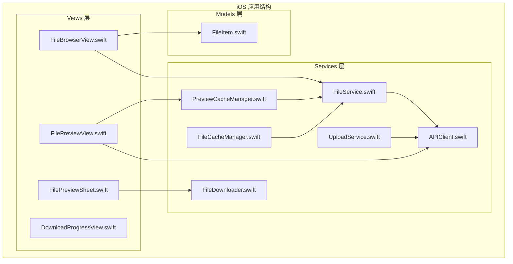
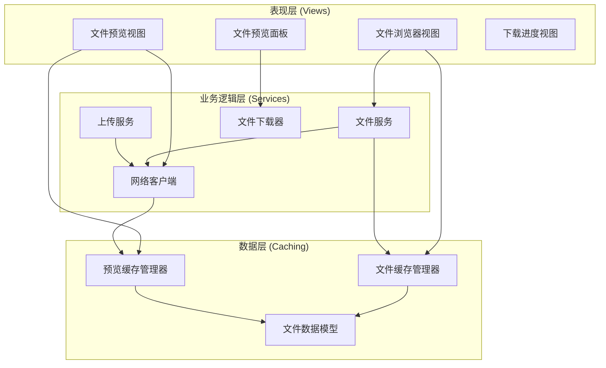
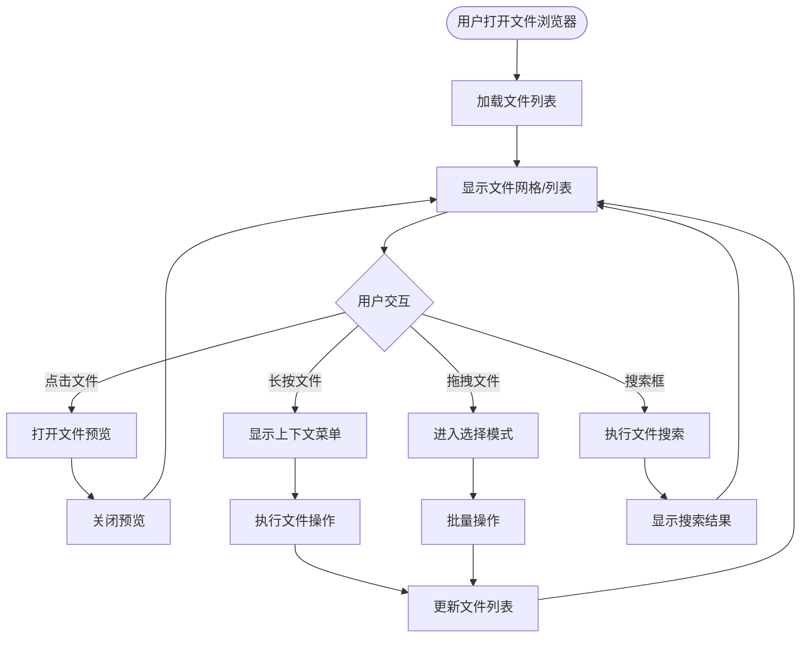
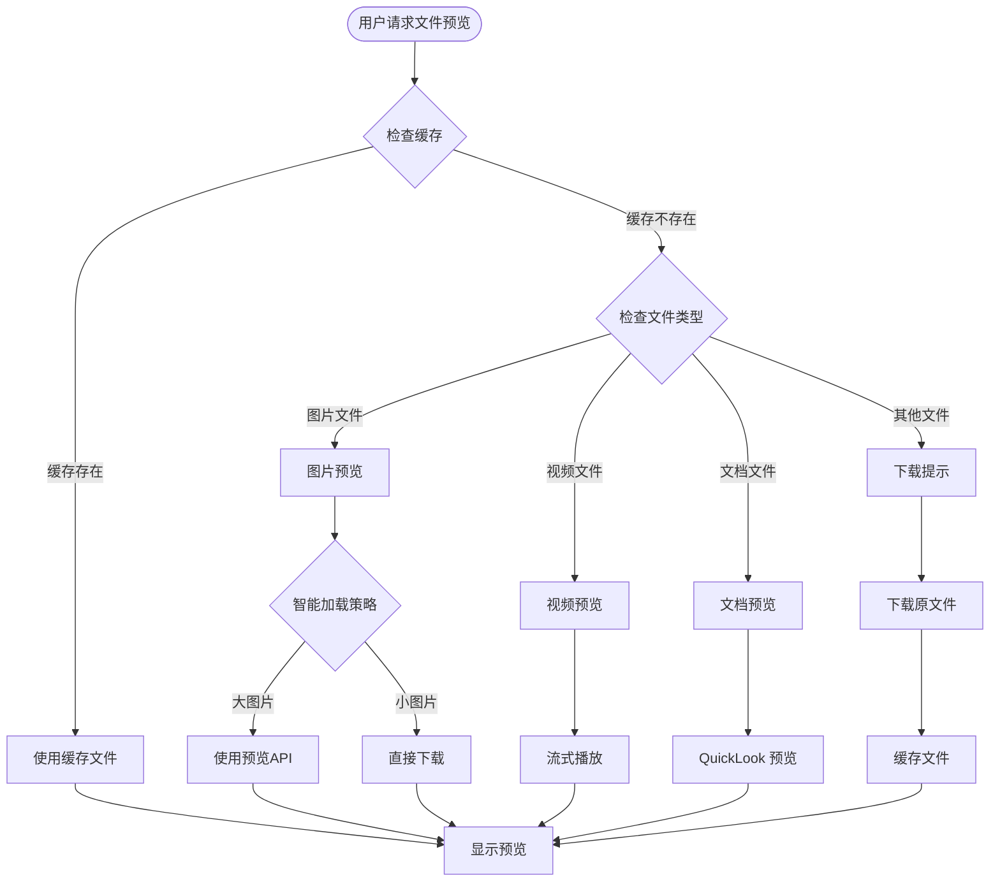
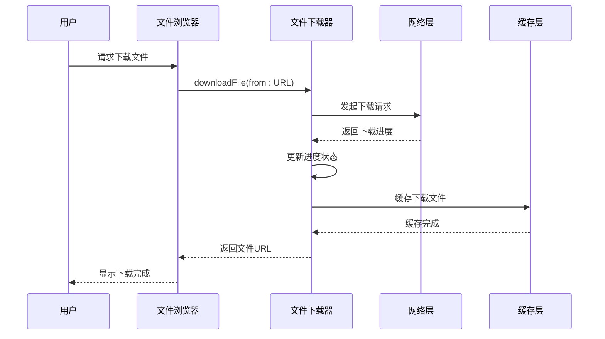
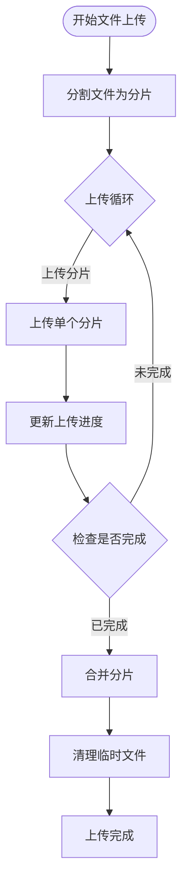
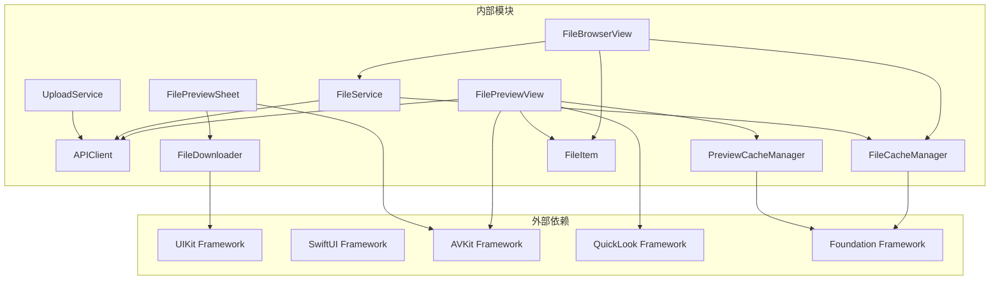

# 文件操作实现

<cite>
**本文档引用的文件**
- [FileService.swift](file://ios/LonghornApp/Services/FileService.swift)
- [FileDownloader.swift](file://ios/LonghornApp/Services/FileDownloader.swift)
- [APIClient.swift](file://ios/LonghornApp/Services/APIClient.swift)
- [FileItem.swift](file://ios/LonghornApp/Models/FileItem.swift)
- [FileBrowserView.swift](file://ios/LonghornApp/Views/Files/FileBrowserView.swift)
- [FilePreviewView.swift](file://ios/LonghornApp/Views/Files/FilePreviewView.swift)
- [FilePreviewSheet.swift](file://ios/LonghornApp/Views/Components/FilePreviewSheet.swift)
- [UploadService.swift](file://ios/LonghornApp/Services/UploadService.swift)
- [FileCacheManager.swift](file://ios/LonghornApp/Services/FileCacheManager.swift)
- [PreviewCacheManager.swift](file://ios/LonghornApp/Services/PreviewCacheManager.swift)
- [DownloadProgressView.swift](file://ios/LonghornApp/Views/Components/DownloadProgressView.swift)
</cite>

## 目录
1. [简介](#简介)
2. [项目结构](#项目结构)
3. [核心组件](#核心组件)
4. [架构概览](#架构概览)
5. [详细组件分析](#详细组件分析)
6. [依赖关系分析](#依赖关系分析)
7. [性能考虑](#性能考虑)
8. [故障排除指南](#故障排除指南)
9. [结论](#结论)

## 简介

Longhorn iOS 应用的文件操作实现是一个完整的文件管理系统，提供了丰富的文件操作功能。该系统基于 Swift 和 SwiftUI 构建，实现了文件上传、下载、删除、重命名、搜索、预览等核心功能。

系统采用分层架构设计，通过服务层抽象网络请求，通过缓存层提升性能，通过视图层提供用户友好的界面。整个系统支持断点续传、并发控制、智能缓存等高级特性。

## 项目结构

Longhorn iOS 应用的文件操作模块主要分布在以下目录结构中：



**图表来源**
- [FileService.swift](file://ios/LonghornApp/Services/FileService.swift#L1-L419)
- [APIClient.swift](file://ios/LonghornApp/Services/APIClient.swift#L1-L326)
- [FileBrowserView.swift](file://ios/LonghornApp/Views/Files/FileBrowserView.swift#L1-L800)

**章节来源**
- [FileService.swift](file://ios/LonghornApp/Services/FileService.swift#L1-L50)
- [APIClient.swift](file://ios/LonghornApp/Services/APIClient.swift#L1-L50)

## 核心组件

### 文件服务层

文件服务层是整个文件操作系统的核心，负责与后端 API 进行通信，提供统一的文件操作接口。

#### 主要功能
- 文件列表获取和缓存管理
- 文件搜索和过滤
- 文件操作（上传、下载、删除、重命名）
- 收藏管理和回收站操作
- 分享功能和权限管理

#### 关键特性
- **异步操作支持**：所有文件操作都基于 async/await 模型
- **错误处理**：完善的 API 错误处理机制
- **缓存策略**：智能缓存和预取机制
- **乐观更新**：即时 UI 更新，后台同步

**章节来源**
- [FileService.swift](file://ios/LonghornApp/Services/FileService.swift#L11-L247)

### 网络客户端

网络客户端封装了所有 HTTP 请求操作，提供了统一的 API 调用接口。

#### 主要功能
- RESTful API 调用
- 文件上传和下载
- 认证令牌管理
- 错误响应处理

#### 关键特性
- **自动认证**：自动添加 Bearer Token
- **超时控制**：请求和资源超时配置
- **JSON 解析**：自动 JSON 序列化和反序列化
- **进度回调**：支持上传下载进度监控

**章节来源**
- [APIClient.swift](file://ios/LonghornApp/Services/APIClient.swift#L38-L316)

### 文件下载器

文件下载器实现了高效的文件下载功能，支持进度跟踪和取消操作。

#### 主要功能
- 断点续传支持
- 并发下载控制
- 实时进度跟踪
- 下载速度计算

#### 关键特性
- **ObservableObject**：支持 SwiftUI 状态绑定
- **进度监控**：实时下载进度和速度
- **内存管理**：临时文件管理和清理
- **错误处理**：完善的异常处理机制

**章节来源**
- [FileDownloader.swift](file://ios/LonghornApp/Services/FileDownloader.swift#L4-L106)

## 架构概览

Longhorn iOS 应用采用了清晰的分层架构设计，确保了代码的可维护性和可扩展性。



**图表来源**
- [FileBrowserView.swift](file://ios/LonghornApp/Views/Files/FileBrowserView.swift#L15-L80)
- [FileService.swift](file://ios/LonghornApp/Services/FileService.swift#L11-L50)
- [FileCacheManager.swift](file://ios/LonghornApp/Services/FileCacheManager.swift#L29-L42)

## 详细组件分析

### 文件浏览器视图

文件浏览器视图是用户与文件系统交互的主要界面，提供了丰富的文件浏览和操作功能。

#### 用户界面设计



**图表来源**
- [FileBrowserView.swift](file://ios/LonghornApp/Views/Files/FileBrowserView.swift#L112-L305)

#### 文件列表展示

文件浏览器支持两种显示模式：列表模式和网格模式。

**列表模式特点**：
- 适合显示大量文件
- 提供详细信息（文件名、大小、修改时间）
- 支持行选择和批量操作

**网格模式特点**：
- 适合快速浏览
- 显示文件图标和缩略图
- 支持触摸手势操作

#### 搜索和过滤

系统提供了强大的搜索功能，支持多种搜索范围和过滤条件。

**搜索范围**：
- 全局搜索：在整个文件系统中搜索
- 部门搜索：在特定部门内搜索
- 个人空间搜索：在用户个人空间搜索

**搜索条件**：
- 文件名匹配
- 文件类型过滤
- 修改时间范围
- 文件大小范围

#### 批量操作

文件浏览器支持多种批量操作，提高用户工作效率。

**批量操作类型**：
- 批量收藏/取消收藏
- 批量移动/复制
- 批量下载
- 批量删除

**操作流程**：
1. 进入选择模式
2. 选择多个文件
3. 执行批量操作
4. 确认操作结果

**章节来源**
- [FileBrowserView.swift](file://ios/LonghornApp/Views/Files/FileBrowserView.swift#L86-L111)
- [FileBrowserView.swift](file://ios/LonghornApp/Views/Files/FileBrowserView.swift#L322-L344)

### 文件预览功能

文件预览功能提供了丰富的文件查看体验，支持多种文件类型的预览。

#### 预览策略



**图表来源**
- [FilePreviewView.swift](file://ios/LonghornApp/Views/Files/FilePreviewView.swift#L221-L290)

#### 图片预览优化

系统针对不同大小的图片文件采用了不同的预览策略：

**大图片处理**：
- 使用服务器预览 API 获取压缩版本
- 减少内存占用和加载时间
- 支持渐进式加载

**小图片处理**：
- 直接下载原图文件
- 提供最高质量预览
- 实时缩放和旋转

#### 多媒体播放

视频文件预览支持流式播放，无需完整下载即可开始播放。

**播放特性**：
- 流式传输，边播边下
- 支持暂停和继续
- 实时缓冲优化
- 适配不同网络环境

**章节来源**
- [FilePreviewView.swift](file://ios/LonghornApp/Views/Files/FilePreviewView.swift#L88-L118)
- [FilePreviewView.swift](file://ios/LonghornApp/Views/Files/FilePreviewView.swift#L213-L220)

### 文件下载器实现

文件下载器是文件操作的核心组件之一，实现了高效的文件下载功能。

#### 下载机制



**图表来源**
- [FileDownloader.swift](file://ios/LonghornApp/Services/FileDownloader.swift#L20-L35)
- [APIClient.swift](file://ios/LonghornApp/Services/APIClient.swift#L112-L145)

#### 进度跟踪

文件下载器提供了详细的进度跟踪功能：

**进度指标**：
- 下载百分比
- 已下载字节数
- 总文件大小
- 实时下载速度

**更新频率**：
- 每0.5秒计算一次速度
- 实时更新UI状态
- 平滑动画效果

#### 取消操作

系统支持下载取消功能，用户可以随时停止下载操作。

**取消流程**：
1. 用户触发取消操作
2. 下载器停止网络请求
3. 清理临时文件
4. 恢复UI状态
5. 显示取消提示

**章节来源**
- [FileDownloader.swift](file://ios/LonghornApp/Services/FileDownloader.swift#L37-L42)
- [FileDownloader.swift](file://ios/LonghornApp/Services/FileDownloader.swift#L78-L96)

### 上传服务实现

上传服务支持大文件的分片上传，提供了断点续传和进度监控功能。

#### 分片上传机制



**图表来源**
- [UploadService.swift](file://ios/LonghornApp/Services/UploadService.swift#L92-L159)

#### 分片策略

**分片大小**：5MB
**并发控制**：顺序上传，避免服务器压力
**重试机制**：失败自动重试
**进度反馈**：实时上传进度

#### 进度监控

上传服务提供了详细的进度监控：

**进度信息**：
- 当前上传字节数
- 总文件大小
- 上传速度
- 剩余时间估计

**状态管理**：
- 等待中
- 上传中
- 合并中
- 已完成
- 已取消

**章节来源**
- [UploadService.swift](file://ios/LonghornApp/Services/UploadService.swift#L50-L89)
- [UploadService.swift](file://ios/LonghornApp/Services/UploadService.swift#L161-L213)

### 缓存管理

系统实现了多层次的缓存策略，确保应用的高性能运行。

#### 文件缓存管理

文件缓存管理器实现了类似 SWR（stale-while-revalidate）的缓存策略：

**缓存策略**：
- **5分钟过期**：缓存仍然可用但会后台刷新
- **30分钟完全过期**：强制重新请求
- **智能预取**：预加载子目录文件

**缓存结构**：
```swift
struct CachedDirectoryListing {
    let files: [FileItem]
    let timestamp: Date
    let path: String
    var isStale: Bool  // 5分钟过期
    var isExpired: Bool  // 30分钟过期
}
```

#### 预览缓存管理

预览缓存管理器专门用于管理文件预览缓存：

**缓存特性**：
- **500MB 大小限制**：防止磁盘空间过度占用
- **LRU 算法**：自动清理最久未使用的文件
- **随机文件名**：避免文件名冲突
- **索引持久化**：崩溃恢复能力

**清理策略**：
- 超过500MB时启动清理
- 按最后访问时间排序
- 清理到80%容量为止

**章节来源**
- [FileCacheManager.swift](file://ios/LonghornApp/Services/FileCacheManager.swift#L29-L133)
- [PreviewCacheManager.swift](file://ios/LonghornApp/Services/PreviewCacheManager.swift#L10-L219)

## 依赖关系分析

Longhorn iOS 应用的文件操作模块具有清晰的依赖关系，确保了模块间的松耦合。



**图表来源**
- [FileBrowserView.swift](file://ios/LonghornApp/Views/Files/FileBrowserView.swift#L8-L11)
- [FileService.swift](file://ios/LonghornApp/Services/FileService.swift#L8-L9)

### 组件耦合度

**低耦合设计**：
- 所有网络请求通过 APIClient 统一处理
- 文件操作通过 FileService 抽象
- 缓存逻辑独立封装
- UI 组件与业务逻辑分离

**依赖注入**：
- 服务层使用单例模式
- 视图层通过状态绑定与服务层通信
- 缓存层提供统一的缓存接口

**章节来源**
- [APIClient.swift](file://ios/LonghornApp/Services/APIClient.swift#L38-L64)
- [FileService.swift](file://ios/LonghornApp/Services/FileService.swift#L12-L14)

## 性能考虑

Longhorn iOS 应用在设计时充分考虑了性能优化，采用了多种策略来提升用户体验。

### 缓存策略优化

**多级缓存架构**：
- **内存缓存**：快速访问最近使用的文件列表
- **磁盘缓存**：持久化存储预览文件
- **智能预取**：预测用户行为，提前加载数据

**缓存淘汰策略**：
- LRU 算法确保热门文件优先
- 容量限制防止内存溢出
- 时间戳过期机制保证数据新鲜度

### 网络优化

**连接池管理**：
- 复用 URLSession 连接
- 限制并发请求数量
- 自动重连机制

**数据压缩**：
- 服务器端文件压缩
- 客户端增量更新
- 二进制协议优化

### 内存管理

**弱引用设计**：
- 避免循环引用
- 及时释放不再使用的资源
- ARC 自动内存管理

**延迟加载**：
- 图片缩略图延迟加载
- 预览文件按需下载
- 大文件分块处理

## 故障排除指南

### 常见问题及解决方案

#### 文件下载失败

**问题症状**：
- 下载进度卡住
- 文件损坏
- 网络超时

**解决步骤**：
1. 检查网络连接状态
2. 重新发起下载请求
3. 清理缓存文件
4. 检查服务器状态

**预防措施**：
- 实施断点续传
- 添加重试机制
- 监控下载完整性

#### 文件预览异常

**问题症状**：
- 预览页面空白
- 图片显示模糊
- 视频播放卡顿

**解决步骤**：
1. 检查缓存文件完整性
2. 清理预览缓存
3. 重新生成缩略图
4. 检查文件格式支持

**预防措施**：
- 实施缓存验证
- 添加格式检测
- 优化预览算法

#### 性能问题

**问题症状**：
- 界面卡顿
- 内存占用过高
- 响应延迟

**解决步骤**：
1. 分析内存使用情况
2. 优化缓存策略
3. 实施懒加载
4. 减少不必要的重绘

**预防措施**：
- 定期性能测试
- 内存泄漏检测
- 异步操作优化

**章节来源**
- [FileDownloader.swift](file://ios/LonghornApp/Services/FileDownloader.swift#L37-L42)
- [FileCacheManager.swift](file://ios/LonghornApp/Services/FileCacheManager.swift#L78-L82)

## 结论

Longhorn iOS 应用的文件操作实现展现了现代移动应用开发的最佳实践。通过精心设计的分层架构、智能的缓存策略、完善的错误处理机制，系统提供了流畅、可靠的文件管理体验。

### 主要优势

**架构设计**：
- 清晰的分层架构确保了代码的可维护性
- 服务抽象提供了良好的扩展性
- 状态管理简化了复杂业务逻辑

**性能优化**：
- 多级缓存策略提升了响应速度
- 智能预取减少了等待时间
- 内存管理优化了资源使用

**用户体验**：
- 直观的界面设计
- 流畅的交互体验
- 完善的功能覆盖

### 技术亮点

**并发处理**：
- 异步操作模型
- 并发下载支持
- 进度实时更新

**错误处理**：
- 完善的异常捕获
- 用户友好的错误提示
- 自动重试机制

**数据管理**：
- 智能缓存策略
- 数据一致性保证
- 离线访问支持

该实现为类似的企业文件管理应用提供了优秀的参考模板，展示了如何在移动平台上构建高性能、易维护的文件管理系统。