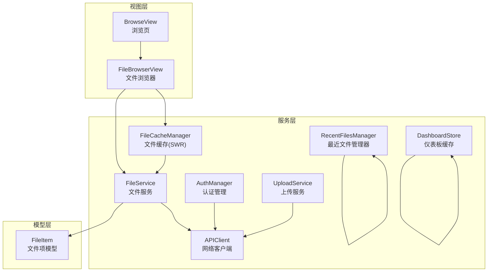
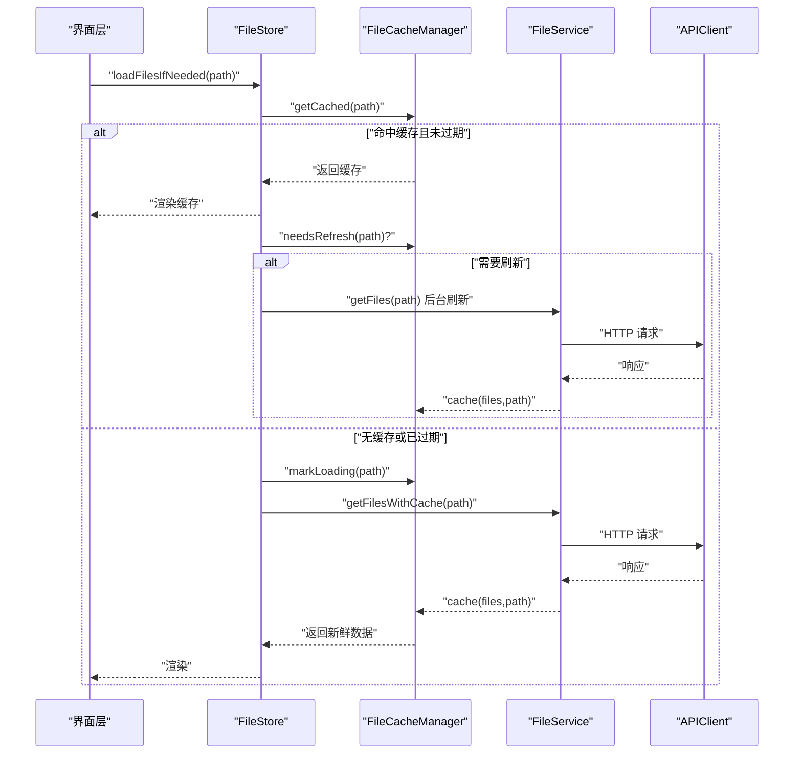
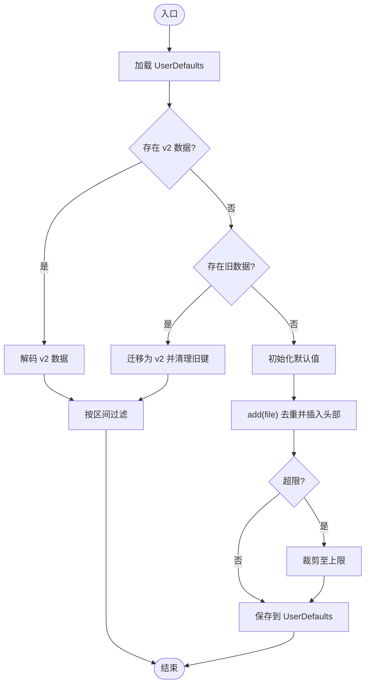
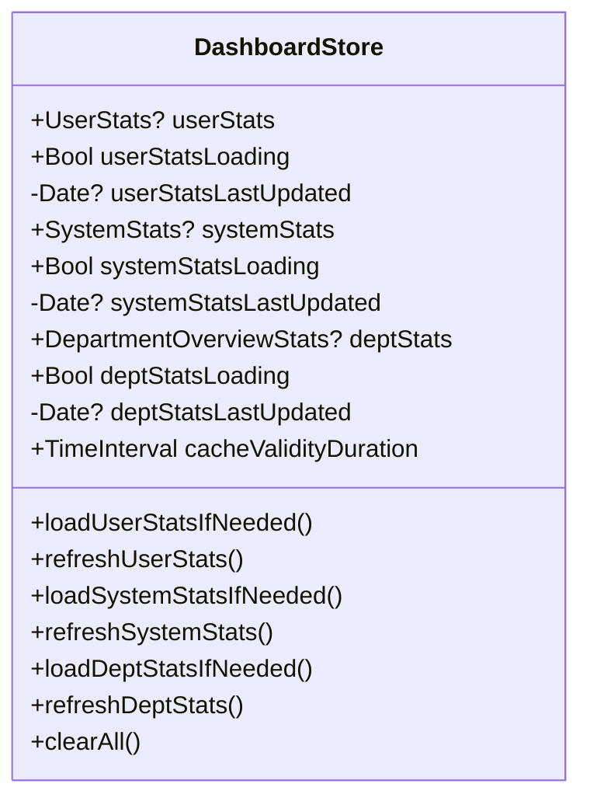
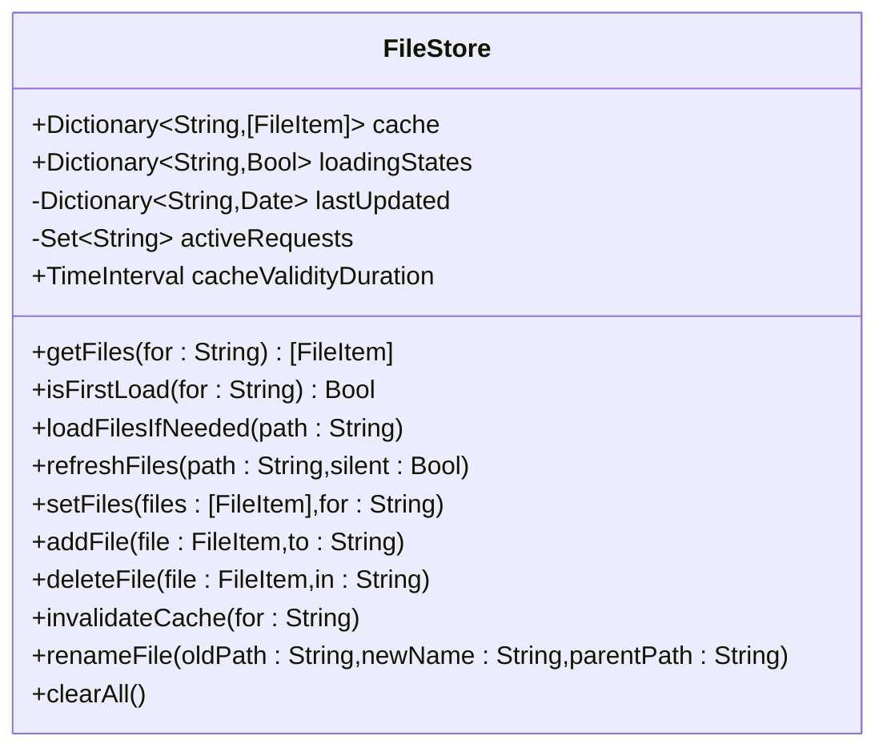
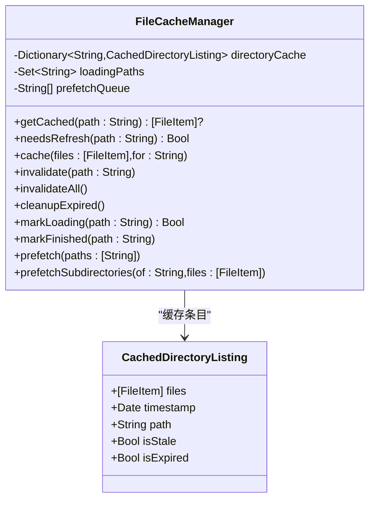
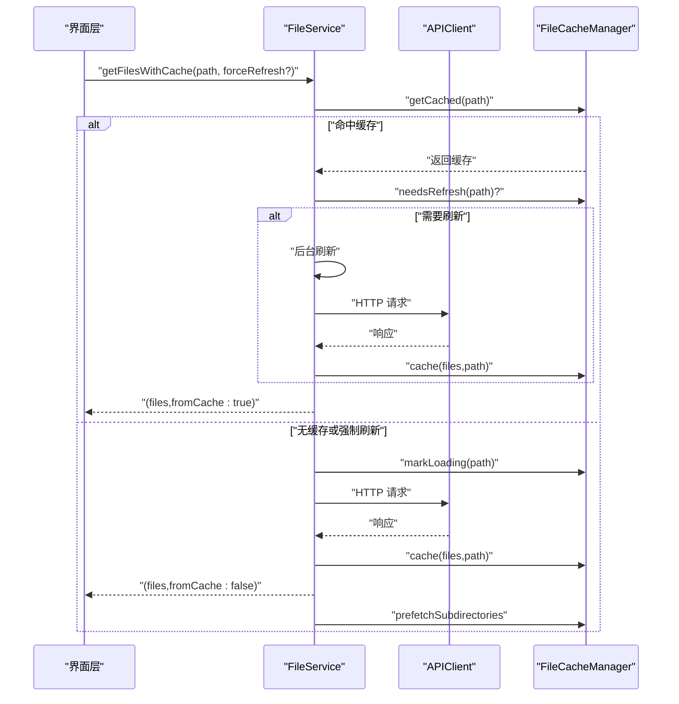
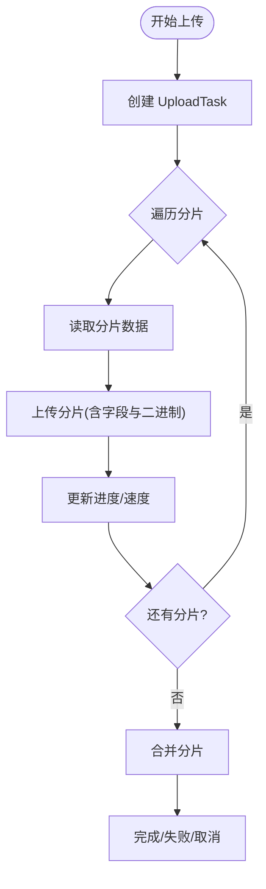
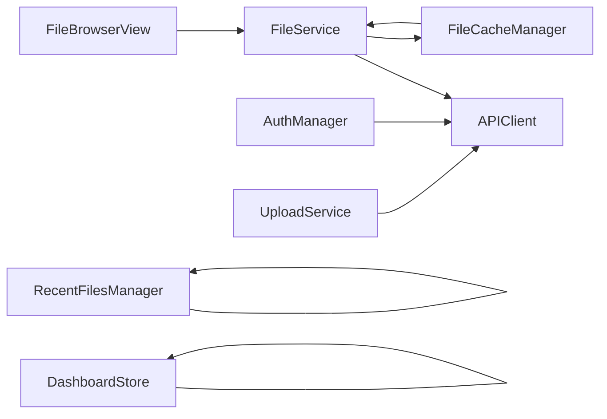

# 离线同步机制

<cite>
**本文引用的文件**
- [RecentFilesManager.swift](file://ios/LonghornApp/Services/RecentFilesManager.swift)
- [DashboardStore.swift](file://ios/LonghornApp/Services/DashboardStore.swift)
- [FileStore.swift](file://ios/LonghornApp/Services/FileStore.swift)
- [FileCacheManager.swift](file://ios/LonghornApp/Services/FileCacheManager.swift)
- [APIClient.swift](file://ios/LonghornApp/Services/APIClient.swift)
- [FileService.swift](file://ios/LonghornApp/Services/FileService.swift)
- [FileItem.swift](file://ios/LonghornApp/Models/FileItem.swift)
- [AuthManager.swift](file://ios/LonghornApp/Services/AuthManager.swift)
- [BrowseView.swift](file://ios/LonghornApp/Views/Main/BrowseView.swift)
- [FileBrowserView.swift](file://ios/LonghornApp/Views/Files/FileBrowserView.swift)
- [UploadService.swift](file://ios/LonghornApp/Services/UploadService.swift)
</cite>

## 目录
1. [简介](#简介)
2. [项目结构](#项目结构)
3. [核心组件](#核心组件)
4. [架构总览](#架构总览)
5. [详细组件分析](#详细组件分析)
6. [依赖关系分析](#依赖关系分析)
7. [性能考量](#性能考量)
8. [故障排查指南](#故障排查指南)
9. [结论](#结论)
10. [附录](#附录)

## 简介
本文件聚焦 Longhorn iOS 应用的离线同步机制，围绕“最近文件管理器”的离线数据处理、仪表板存储的缓存策略、文件存储的离线操作与状态管理进行系统化梳理。重点覆盖以下方面：
- 最近文件管理器：本地持久化、时间区间过滤与迁移兼容
- 仪表板存储：缓存有效期、状态恢复与并发加载控制
- 文件存储：智能缓存、stale-while-revalidate 模式、乐观更新与重复请求去重
- 离线能力：加载失败时保留旧缓存以维持可用性
- 数据一致性：缓存过期策略与后台刷新
- 同步优先级：预取队列与后台刷新
- 迁移与恢复：缓存清理与登出时的状态重置
- 性能优化：分片上传、批量下载与缓存预取

## 项目结构
iOS 端采用模块化设计，核心围绕 Services（服务层）、Models（数据模型）与 Views（界面层）协作：
- Services 层负责网络请求、缓存管理、状态存储与业务服务
- Models 层定义数据结构与序列化规则
- Views 层通过 Store/Manager 组件驱动 UI 更新

图表来源
- [BrowseView.swift](file://ios/LonghornApp/Views/Main/BrowseView.swift#L1-L197)
- [FileBrowserView.swift](file://ios/LonghornApp/Views/Files/FileBrowserView.swift#L1-L2204)
- [RecentFilesManager.swift](file://ios/LonghornApp/Services/RecentFilesManager.swift#L1-L125)
- [DashboardStore.swift](file://ios/LonghornApp/Services/DashboardStore.swift#L1-L157)
- [FileCacheManager.swift](file://ios/LonghornApp/Services/FileCacheManager.swift#L1-L185)
- [FileService.swift](file://ios/LonghornApp/Services/FileService.swift#L1-L419)
- [APIClient.swift](file://ios/LonghornApp/Services/APIClient.swift#L1-L326)
- [AuthManager.swift](file://ios/LonghornApp/Services/AuthManager.swift#L1-L195)
- [UploadService.swift](file://ios/LonghornApp/Services/UploadService.swift#L1-L275)
- [FileItem.swift](file://ios/LonghornApp/Models/FileItem.swift#L1-L288)

章节来源
- [BrowseView.swift](file://ios/LonghornApp/Views/Main/BrowseView.swift#L1-L197)
- [FileBrowserView.swift](file://ios/LonghornApp/Views/Files/FileBrowserView.swift#L1-L2204)

## 核心组件
- 最近文件管理器：基于 UserDefaults 的本地持久化，支持时间区间过滤与版本迁移
- 仪表板缓存：用户/部门/系统统计数据的短期缓存，统一有效期与加载状态
- 文件缓存与浏览缓存：SWR 模式与路径级缓存，避免重复请求与提升响应速度
- 文件服务：封装 API 调用，提供带缓存的文件列表获取与后台刷新
- 网络客户端：统一请求构建、鉴权头注入、错误处理与下载/批量下载
- 上传服务：分片上传、进度反馈、取消与合并流程
- 认证管理：Token 持久化、会话恢复与登出清理

章节来源
- [RecentFilesManager.swift](file://ios/LonghornApp/Services/RecentFilesManager.swift#L1-L125)
- [DashboardStore.swift](file://ios/LonghornApp/Services/DashboardStore.swift#L1-L157)
- [FileCacheManager.swift](file://ios/LonghornApp/Services/FileCacheManager.swift#L1-L185)
- [FileStore.swift](file://ios/LonghornApp/Services/FileStore.swift#L1-L140)
- [FileService.swift](file://ios/LonghornApp/Services/FileService.swift#L1-L419)
- [APIClient.swift](file://ios/LonghornApp/Services/APIClient.swift#L1-L326)
- [UploadService.swift](file://ios/LonghornApp/Services/UploadService.swift#L1-L275)
- [AuthManager.swift](file://ios/LonghornApp/Services/AuthManager.swift#L1-L195)

## 架构总览
离线同步的关键在于“缓存优先、后台刷新、乐观更新”三要素：
- 缓存优先：优先返回可用缓存，提升首屏与弱网体验
- 后台刷新：在返回缓存的同时触发静默刷新，确保下次访问最新数据
- 乐观更新：在本地立即反映用户操作结果，网络成功后再对齐远端状态

图表来源
- [FileStore.swift](file://ios/LonghornApp/Services/FileStore.swift#L46-L85)
- [FileCacheManager.swift](file://ios/LonghornApp/Services/FileCacheManager.swift#L45-L82)
- [FileCacheManager.swift](file://ios/LonghornApp/Services/FileCacheManager.swift#L137-L184)
- [FileService.swift](file://ios/LonghornApp/Services/FileService.swift#L18-L39)
- [APIClient.swift](file://ios/LonghornApp/Services/APIClient.swift#L68-L109)

## 详细组件分析

### 最近文件管理器（离线数据处理）
- 本地存储：使用 UserDefaults 持久化最近文件条目，支持 v2 结构与旧结构迁移
- 时间区间：支持今日/一周/两周/一月等区间过滤，按区间裁剪与展示
- 去重与更新：新增文件时移除旧记录并插入头部，超过上限裁剪
- 持久化策略：编码为 JSON 并写入 UserDefaults；加载失败时回退并尝试迁移

图表来源
- [RecentFilesManager.swift](file://ios/LonghornApp/Services/RecentFilesManager.swift#L83-L114)
- [RecentFilesManager.swift](file://ios/LonghornApp/Services/RecentFilesManager.swift#L67-L81)

章节来源
- [RecentFilesManager.swift](file://ios/LonghornApp/Services/RecentFilesManager.swift#L1-L125)

### 仪表板存储（缓存策略与状态恢复）
- 缓存结构：分别缓存用户/部门/系统统计数据，带 lastUpdated 时间戳
- 有效期：统一 5 分钟有效期，过期则触发刷新
- 加载状态：独立 loading 状态，避免重复请求
- 清理策略：提供 clearAll 清空缓存与时间戳，便于登出后重置

图表来源
- [DashboardStore.swift](file://ios/LonghornApp/Services/DashboardStore.swift#L11-L135)

章节来源
- [DashboardStore.swift](file://ios/LonghornApp/Services/DashboardStore.swift#L1-L157)

### 文件存储与离线操作（缓存、状态与网络监听）
- 路径级缓存：以路径为键缓存文件列表，记录 lastUpdated 与 loadingStates
- 有效期：5 分钟内直接返回缓存，否则触发刷新
- 防重复请求：activeRequests 集合避免同一路径并发请求
- 加载失败策略：捕获异常但不清除旧缓存，保障离线可用性
- 乐观更新：支持 addFile、deleteFile、renameFile 等本地即时更新
- 与服务层集成：FileService 提供 getFilesWithCache，实现 SWR 与后台刷新

图表来源
- [FileStore.swift](file://ios/LonghornApp/Services/FileStore.swift#L11-L139)

章节来源
- [FileStore.swift](file://ios/LonghornApp/Services/FileStore.swift#L1-L140)

### 文件缓存管理（SWR 模式与预取）
- SWR 模式：缓存分为“新鲜(stale=false)”与“陈旧(stale=true)”两类
- 过期策略：5 分钟 stale、30 分钟 expired；expired 不再返回
- 预取队列：prefetchSubdirectories 自动预取直接子目录，提升后续访问速度
- 并发控制：loadingPaths 防止重复请求；后台刷新不阻塞 UI

图表来源
- [FileCacheManager.swift](file://ios/LonghornApp/Services/FileCacheManager.swift#L27-L133)

章节来源
- [FileCacheManager.swift](file://ios/LonghornApp/Services/FileCacheManager.swift#L1-L185)

### 文件服务与网络客户端（离线模式检测与错误处理）
- 文件服务：封装文件列表、搜索、收藏、回收站、分享等 API
- 网络客户端：统一请求构建、鉴权头注入、401 自动登出、错误分类与日志输出
- 下载/批量下载：返回临时文件 URL，移动到 caches 目录，便于离线预览
- 上传：提供分片上传与合并，支持进度与取消

图表来源
- [FileService.swift](file://ios/LonghornApp/Services/FileService.swift#L18-L39)
- [FileCacheManager.swift](file://ios/LonghornApp/Services/FileCacheManager.swift#L137-L184)
- [APIClient.swift](file://ios/LonghornApp/Services/APIClient.swift#L68-L109)

章节来源
- [FileService.swift](file://ios/LonghornApp/Services/FileService.swift#L1-L419)
- [APIClient.swift](file://ios/LonghornApp/Services/APIClient.swift#L1-L326)

### 上传服务（分片上传与进度管理）
- 分片大小：默认 5MB，支持断点续传与合并
- 进度与速度：实时计算并格式化传输速率
- 取消与清理：支持取消任务与完成后清理
- 与认证：自动注入 Bearer Token

图表来源
- [UploadService.swift](file://ios/LonghornApp/Services/UploadService.swift#L59-L89)
- [UploadService.swift](file://ios/LonghornApp/Services/UploadService.swift#L91-L159)
- [UploadService.swift](file://ios/LonghornApp/Services/UploadService.swift#L215-L237)

章节来源
- [UploadService.swift](file://ios/LonghornApp/Services/UploadService.swift#L1-L275)

### 文件模型（数据结构与序列化）
- FileItem：文件/文件夹的核心数据模型，支持多种日期格式解析与图标映射
- 收藏/回收站/分享等模型：与服务层 API 对应的数据结构

章节来源
- [FileItem.swift](file://ios/LonghornApp/Models/FileItem.swift#L1-L288)

## 依赖关系分析
- 视图层依赖 Store/Manager：BrowseView 与 FileBrowserView 通过环境对象注入 AuthManager、NavigationManager、FileStore 等
- Store 依赖服务层：FileStore 依赖 FileService；FileService 依赖 APIClient
- 缓存层：FileCacheManager 独立于 UI，被 FileService 扩展调用
- 认证层：AuthManager 统一管理 Token 与会话，登出时清理各 Store 缓存

图表来源
- [FileBrowserView.swift](file://ios/LonghornApp/Views/Files/FileBrowserView.swift#L15-L25)
- [FileService.swift](file://ios/LonghornApp/Services/FileService.swift#L1-L419)
- [APIClient.swift](file://ios/LonghornApp/Services/APIClient.swift#L1-L326)
- [FileCacheManager.swift](file://ios/LonghornApp/Services/FileCacheManager.swift#L1-L185)
- [RecentFilesManager.swift](file://ios/LonghornApp/Services/RecentFilesManager.swift#L1-L125)
- [DashboardStore.swift](file://ios/LonghornApp/Services/DashboardStore.swift#L1-L157)
- [AuthManager.swift](file://ios/LonghornApp/Services/AuthManager.swift#L1-L195)
- [UploadService.swift](file://ios/LonghornApp/Services/UploadService.swift#L1-L275)

章节来源
- [BrowseView.swift](file://ios/LonghornApp/Views/Main/BrowseView.swift#L1-L197)
- [FileBrowserView.swift](file://ios/LonghornApp/Views/Files/FileBrowserView.swift#L1-L2204)

## 性能考量
- 缓存命中率：路径级缓存与 SWR 模式减少网络请求，提高首屏与弱网体验
- 预取策略：对直接子目录进行预取，降低后续访问延迟
- 乐观更新：本地即时反映用户操作，避免等待网络响应
- 分片上传：大文件分片上传，支持断点续传与进度反馈
- 并发控制：activeRequests/loadingPaths 防止重复请求与竞态
- 后台刷新：不阻塞 UI 的静默刷新，保持数据新鲜度

## 故障排查指南
- 加载失败仍可用：FileStore 在网络异常时不清除旧缓存，保障离线可用性
- 登出清理：AuthManager.logout 清理 FileStore/DashboardStore/ShareStore 缓存，避免数据泄露
- 401 自动登出：APIClient 在收到 401 时触发登出并抛出错误
- 缓存清理：DashboardStore 提供 clearAll；FileStore 提供 clearAll/invalidateCache
- 预取失败：FileCacheManager 静默处理预取异常，不影响主流程

章节来源
- [FileStore.swift](file://ios/LonghornApp/Services/FileStore.swift#L79-L84)
- [AuthManager.swift](file://ios/LonghornApp/Services/AuthManager.swift#L71-L89)
- [APIClient.swift](file://ios/LonghornApp/Services/APIClient.swift#L287-L293)
- [DashboardStore.swift](file://ios/LonghornApp/Services/DashboardStore.swift#L125-L134)
- [FileCacheManager.swift](file://ios/LonghornApp/Services/FileCacheManager.swift#L112-L118)

## 结论
Longhorn iOS 应用通过“缓存优先 + 后台刷新 + 乐观更新”的组合拳，在弱网与离线场景下提供了稳定、快速的用户体验。最近文件管理器与仪表板缓存确保常用数据的快速访问，文件缓存与浏览缓存结合 SWR 模式与预取策略显著降低延迟，上传服务提供可靠的分片上传能力。配合登出清理与错误处理机制，整体离线同步方案具备良好的一致性与可维护性。

## 附录
- 离线数据迁移与备份恢复建议
  - 最近文件：UserDefaults 迁移逻辑已内置，无需额外处理
  - 仪表板：clearAll 可在登出或切换账号时调用
  - 文件缓存：invalidateAll 或按需 invalidateCache，结合后台刷新
- 同步性能优化
  - 合理设置缓存有效期与预取数量
  - 控制并发请求与分片大小
  - 使用后台任务进行静默刷新，避免阻塞主线程