# 移动应用架构

<cite>
**本文档引用的文件**
- [LonghornApp.swift](file://ios/LonghornApp/LonghornApp.swift)
- [ContentView.swift](file://ios/LonghornApp/ContentView.swift)
- [Info.plist](file://ios/LonghornApp/Info.plist)
- [AuthManager.swift](file://ios/LonghornApp/Services/AuthManager.swift)
- [APIClient.swift](file://ios/LonghornApp/Services/APIClient.swift)
- [FileCacheManager.swift](file://ios/LonghornApp/Services/FileCacheManager.swift)
- [PreviewCacheManager.swift](file://ios/LonghornApp/Services/PreviewCacheManager.swift)
- [ImageCacheService.swift](file://ios/LonghornApp/Services/ImageCacheService.swift)
- [FileService.swift](file://ios/LonghornApp/Services/FileService.swift)
- [IssueService.swift](file://ios/LonghornApp/Services/IssueService.swift)
- [AdminService.swift](file://ios/LonghornApp/Services/AdminService.swift)
- [FileItem.swift](file://ios/LonghornApp/Models/FileItem.swift)
- [Issue.swift](file://ios/LonghornApp/Models/Issue.swift)
- [MainTabView.swift](file://ios/LonghornApp/Views/Main/MainTabView.swift)
- [FileBrowserView.swift](file://ios/LonghornApp/Views/Files/FileBrowserView.swift)
- [IssueListView.swift](file://ios/LonghornApp/Views/Issues/IssueListView.swift)
- [IssueCreateView.swift](file://ios/LonghornApp/Views/Issues/IssueCreateView.swift)
- [IssueDetailView.swift](file://ios/LonghornApp/Views/Issues/IssueDetailView.swift)
- [AppNotifications.swift](file://ios/LonghornApp/Services/AppNotifications.swift)
- [Localizable.xcstrings](file://ios/LonghornApp/Resources/Localizable.xcstrings)
- [ContextPanel.tsx](file://client/src/components/ServiceRecords/ContextPanel.tsx)
- [Service_API.md](file://docs/Service_API.md)
- [context.js](file://server/service/routes/context.js)
- [iOS 开发指南](file://docs/iOS_Dev_Guide.md)
- [iOS 项目说明](file://ios/README.md)
- [.gitignore](file://.gitignore)
- [client/.gitignore](file://client/.gitignore)
</cite>

## 更新摘要
**所做更改**
- 新增服务管理功能的iOS集成实现，包括服务记录、工单管理、上下文查询等功能
- 扩展了服务层架构，新增AdminService用于管理员功能
- 增强了上下文查询功能，支持客户和产品序列号的双重查询模式
- 完善了国际化支持，新增服务记录相关的多语言字符串
- 优化了开发环境配置，改善了.gitignore文件规则

## 目录
1. [简介](#简介)
2. [项目结构](#项目结构)
3. [核心组件](#核心组件)
4. [架构总览](#架构总览)
5. [详细组件分析](#详细组件分析)
6. [依赖关系分析](#依赖关系分析)
7. [性能考量](#性能考量)
8. [故障排查指南](#故障排查指南)
9. [开发环境配置](#开发环境配置)
10. [结论](#结论)
11. [附录](#附录)

## 简介
本文件为 Longhorn iOS 移动应用的架构文档，聚焦 SwiftUI 组件设计模式、MVVM 架构实现与数据流管理；详述本地数据缓存策略、离线同步机制与后台任务处理；阐述文件预览、图片缓存、网络优化与电池续航考虑；覆盖推送通知、实时同步与用户体验优化；并提供 iOS 特定功能实现（文件共享、相机集成、设备权限管理）以及性能监控、崩溃日志与版本兼容性处理建议。

**更新** 本次更新重点增加了服务管理功能的iOS集成实现，包括服务记录管理、工单管理、上下文查询等核心功能模块，形成了完整的客户服务支持体系。

## 项目结构
Longhorn iOS 采用以功能域划分的层次化组织方式：
- 应用入口与根视图：LonghornApp.swift、ContentView.swift
- 模型层：Models（如 FileItem.swift、Issue.swift）
- 视图层：Views（如 MainTabView.swift、FileBrowserView.swift、IssueListView.swift 等）
- 服务层：Services（APIClient.swift、AuthManager.swift、FileCacheManager.swift、PreviewCacheManager.swift、ImageCacheService.swift、FileService.swift、IssueService.swift、AdminService.swift、AppNotifications.swift 等）

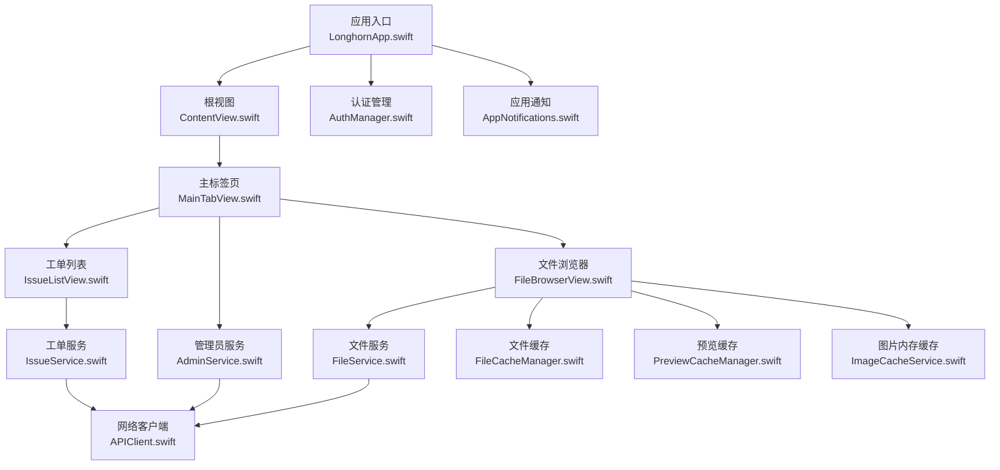

**图表来源**
- [LonghornApp.swift](file://ios/LonghornApp/LonghornApp.swift#L11-L24)
- [ContentView.swift](file://ios/LonghornApp/ContentView.swift#L10-L37)
- [MainTabView.swift](file://ios/LonghornApp/Views/Main/MainTabView.swift#L10-L77)
- [FileBrowserView.swift](file://ios/LonghornApp/Views/Files/FileBrowserView.swift#L15-L305)
- [IssueListView.swift](file://ios/LonghornApp/Views/Issues/IssueListView.swift#L10-L385)
- [IssueService.swift](file://ios/LonghornApp/Services/IssueService.swift#L13-L278)
- [AdminService.swift](file://ios/LonghornApp/Services/AdminService.swift#L5-L155)
- [FileService.swift](file://ios/LonghornApp/Services/FileService.swift#L10-L419)
- [APIClient.swift](file://ios/LonghornApp/Services/APIClient.swift#L37-L326)
- [FileCacheManager.swift](file://ios/LonghornApp/Services/FileCacheManager.swift#L28-L185)
- [PreviewCacheManager.swift](file://ios/LonghornApp/Services/PreviewCacheManager.swift#L10-L219)
- [ImageCacheService.swift](file://ios/LonghornApp/Services/ImageCacheService.swift#L10-L37)
- [AuthManager.swift](file://ios/LonghornApp/Services/AuthManager.swift#L12-L195)
- [AppNotifications.swift](file://ios/LonghornApp/Services/AppNotifications.swift#L10-L86)

**章节来源**
- [iOS 项目说明](file://ios/README.md#L10-L27)

## 核心组件
- 应用入口与环境注入：LonghornApp.swift 注入认证与语言管理器，设置深色主题偏好与语言环境。
- 根视图：ContentView.swift 根据登录状态动态切换登录页与主界面，并统一承载全局 Toast 展示。
- 认证与会话：AuthManager.swift 提供 JWT 管理、Keychain 存储、会话恢复与 Token 校验。
- 网络层：APIClient.swift 封装 URLSession、超时控制、鉴权头注入、错误分类与调试输出。
- 文件服务：FileService.swift 聚合各类文件操作 API（列表、搜索、收藏、回收站、分享等）。
- 工单服务：IssueService.swift 提供完整的工单管理 API 调用封装，包括列表查询、详情获取、创建、更新状态、评论和附件管理。
- 管理员服务：AdminService.swift 提供用户管理、部门管理、权限管理和系统统计功能。
- 缓存体系：FileCacheManager.swift 实现目录列表的 SWR（stale-while-revalidate）缓存；PreviewCacheManager.swift 实现预览文件的 LRU 持久化缓存；ImageCacheService.swift 提供内存图片缓存。
- 视图层：MainTabView.swift 适配 iPhone/iPad 布局；FileBrowserView.swift 实现文件浏览、搜索、批量操作、预览、上传、轮询刷新等；IssueListView.swift、IssueCreateView.swift、IssueDetailView.swift 提供完整的工单管理界面。
- 通知系统：AppNotifications.swift 定义统一的通知事件，便于跨组件解耦通信。

**章节来源**
- [LonghornApp.swift](file://ios/LonghornApp/LonghornApp.swift#L11-L24)
- [ContentView.swift](file://ios/LonghornApp/ContentView.swift#L10-L37)
- [AuthManager.swift](file://ios/LonghornApp/Services/AuthManager.swift#L12-L195)
- [APIClient.swift](file://ios/LonghornApp/Services/APIClient.swift#L37-L326)
- [FileService.swift](file://ios/LonghornApp/Services/FileService.swift#L10-L419)
- [IssueService.swift](file://ios/LonghornApp/Services/IssueService.swift#L13-L278)
- [AdminService.swift](file://ios/LonghornApp/Services/AdminService.swift#L5-L155)
- [FileCacheManager.swift](file://ios/LonghornApp/Services/FileCacheManager.swift#L28-L185)
- [PreviewCacheManager.swift](file://ios/LonghornApp/Services/PreviewCacheManager.swift#L10-L219)
- [ImageCacheService.swift](file://ios/LonghornApp/Services/ImageCacheService.swift#L10-L37)
- [MainTabView.swift](file://ios/LonghornApp/Views/Main/MainTabView.swift#L10-L77)
- [FileBrowserView.swift](file://ios/LonghornApp/Views/Files/FileBrowserView.swift#L15-L305)
- [IssueListView.swift](file://ios/LonghornApp/Views/Issues/IssueListView.swift#L10-L385)
- [IssueCreateView.swift](file://ios/LonghornApp/Views/Issues/IssueCreateView.swift#L11-L444)
- [IssueDetailView.swift](file://ios/LonghornApp/Views/Issues/IssueDetailView.swift#L11-L490)
- [AppNotifications.swift](file://ios/LonghornApp/Services/AppNotifications.swift#L10-L86)

## 架构总览
Longhorn iOS 采用 SwiftUI + MVVM 架构，强调数据驱动 UI。视图层仅负责渲染与交互；业务逻辑集中在服务层；状态通过 ObservableObject 与 @State/@StateObject 管理；网络与缓存通过单例服务抽象，确保一致性与可测试性。

**更新** 新增 AdminService 和增强的 IssueService，形成完整的客户服务支持功能模块。

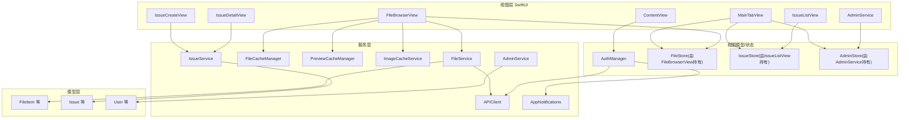

**图表来源**
- [ContentView.swift](file://ios/LonghornApp/ContentView.swift#L10-L37)
- [MainTabView.swift](file://ios/LonghornApp/Views/Main/MainTabView.swift#L10-L77)
- [FileBrowserView.swift](file://ios/LonghornApp/Views/Files/FileBrowserView.swift#L15-L305)
- [IssueListView.swift](file://ios/LonghornApp/Views/Issues/IssueListView.swift#L10-L385)
- [IssueCreateView.swift](file://ios/LonghornApp/Views/Issues/IssueCreateView.swift#L11-L444)
- [IssueDetailView.swift](file://ios/LonghornApp/Views/Issues/IssueDetailView.swift#L11-L490)
- [AdminService.swift](file://ios/LonghornApp/Services/AdminService.swift#L5-L155)
- [AuthManager.swift](file://ios/LonghornApp/Services/AuthManager.swift#L12-L195)
- [FileService.swift](file://ios/LonghornApp/Services/FileService.swift#L10-L419)
- [IssueService.swift](file://ios/LonghornApp/Services/IssueService.swift#L13-L278)
- [APIClient.swift](file://ios/LonghornApp/Services/APIClient.swift#L37-L326)
- [FileCacheManager.swift](file://ios/LonghornApp/Services/FileCacheManager.swift#L28-L185)
- [PreviewCacheManager.swift](file://ios/LonghornApp/Services/PreviewCacheManager.swift#L10-L219)
- [ImageCacheService.swift](file://ios/LonghornApp/Services/ImageCacheService.swift#L10-L37)
- [FileItem.swift](file://ios/LonghornApp/Models/FileItem.swift#L11-L194)
- [Issue.swift](file://ios/LonghornApp/Models/Issue.swift#L139-L225)

## 详细组件分析

### 认证与会话管理（AuthManager）
- 单例模式，@MainActor 确保主线程安全。
- 使用 Keychain 存储 JWT，UserDefaults 持久化用户信息。
- 登录成功后保存 Token 与用户信息，触发缓存清理与登出通知。
- 启动时尝试恢复会话并异步校验 Token 有效性，失败则自动登出。

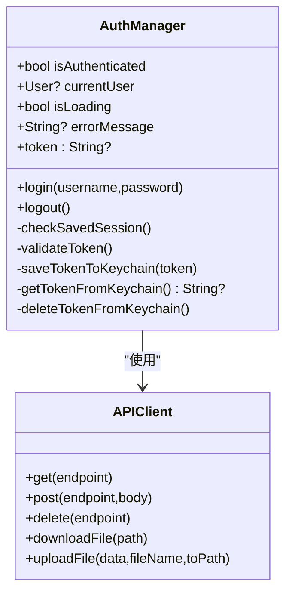

**图表来源**
- [AuthManager.swift](file://ios/LonghornApp/Services/AuthManager.swift#L12-L195)
- [APIClient.swift](file://ios/LonghornApp/Services/APIClient.swift#L37-L326)

**章节来源**
- [AuthManager.swift](file://ios/LonghornApp/Services/AuthManager.swift#L12-L195)

### 网络请求与错误处理（APIClient）
- URLSession 配置请求/资源超时，JSON 解码器统一处理。
- 自动注入 Authorization 头（Bearer Token）。
- 对 401 统一触发登出并抛出 APIError.unauthorized。
- 支持文件下载/上传，返回临时 URL 并移动至缓存目录。

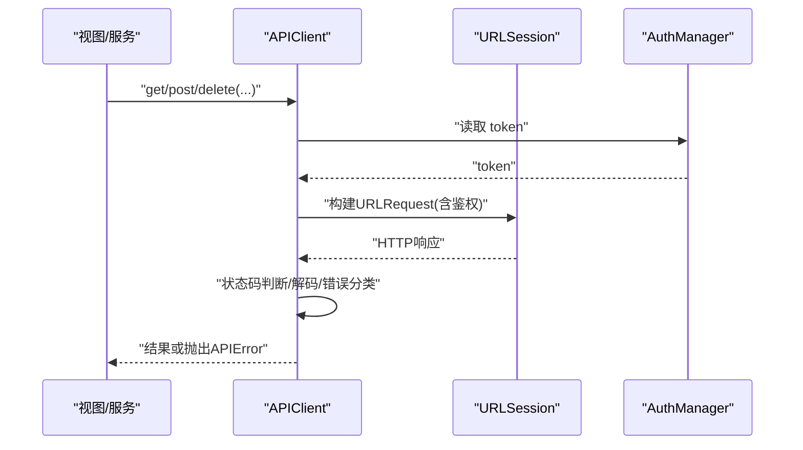

**图表来源**
- [APIClient.swift](file://ios/LonghornApp/Services/APIClient.swift#L68-L315)
- [AuthManager.swift](file://ios/LonghornApp/Services/AuthManager.swift#L24-L34)

**章节来源**
- [APIClient.swift](file://ios/LonghornApp/Services/APIClient.swift#L37-L326)

### 工单服务与管理（IssueService + IssueStore）
- IssueService 提供完整的工单管理 API 调用封装，包括：
  - 工单列表查询（支持分页、状态过滤、类别过滤、搜索）
  - 工单详情获取
  - 工单创建（标题、描述、严重程度、类别、来源、产品/客户关联等）
  - 工单状态更新和分配
  - 评论管理（添加评论）
  - 附件管理（图片上传、下载）
  - 产品和客户列表查询
  - 工单统计概览
- IssueStore 提供状态管理，包括：
  - 工单列表加载（支持刷新和加载更多）
  - 筛选条件管理（状态、类别、搜索关键词）
  - 错误处理和加载状态管理

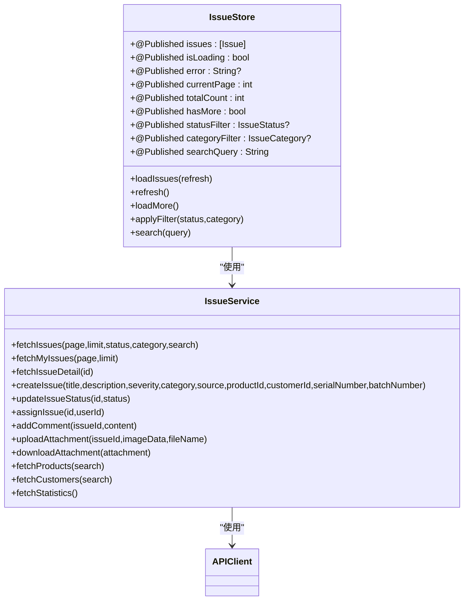

**图表来源**
- [IssueService.swift](file://ios/LonghornApp/Services/IssueService.swift#L13-L278)
- [Issue.swift](file://ios/LonghornApp/Models/Issue.swift#L139-L225)

**章节来源**
- [IssueService.swift](file://ios/LonghornApp/Services/IssueService.swift#L13-L278)
- [Issue.swift](file://ios/LonghornApp/Models/Issue.swift#L13-L395)

### 管理员服务（AdminService）
- AdminService 提供完整的管理员功能 API 调用封装，包括：
  - 用户管理（查询、更新、删除权限）
  - 部门管理（查询、统计）
  - 权限管理（授予、撤销权限）
  - 系统统计（今日、本周、本月统计）
  - 文件浏览（按路径查询）
- 支持异步操作和错误处理，提供用户友好的错误信息。
- 与 APIClient 协作，确保所有请求都经过鉴权。

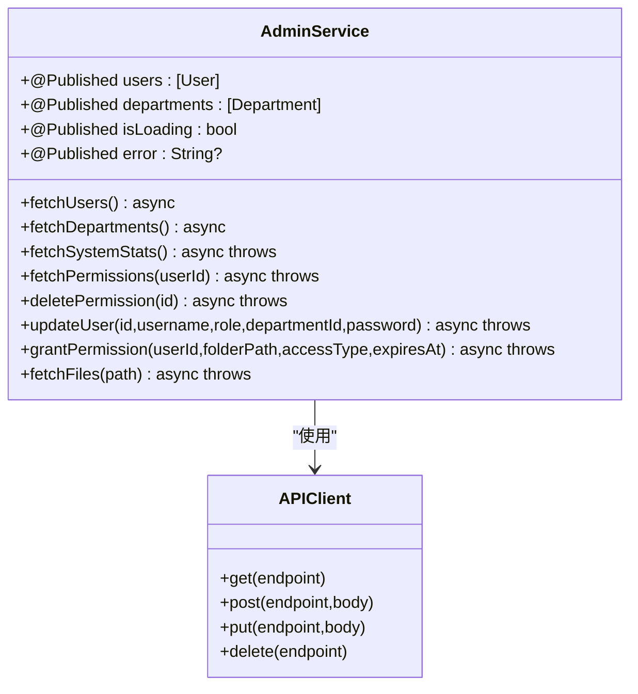

**图表来源**
- [AdminService.swift](file://ios/LonghornApp/Services/AdminService.swift#L5-L155)
- [APIClient.swift](file://ios/LonghornApp/Services/APIClient.swift#L37-L326)

**章节来源**
- [AdminService.swift](file://ios/LonghornApp/Services/AdminService.swift#L5-L155)

### 上下文查询服务（ContextPanel + Server API）
- 上下文查询功能支持两种查询模式：
  - 客户查询：通过客户ID、姓名或联系方式查询服务历史
  - 产品序列号查询：通过产品序列号查询所有权历史和服务记录
- 支持统一搜索功能，同时查询客户和序列号
- 返回综合信息：客户信息、产品信息、当前拥有者、服务记录、工单记录、统计摘要
- 提供详细的服务历史和所有权转移记录

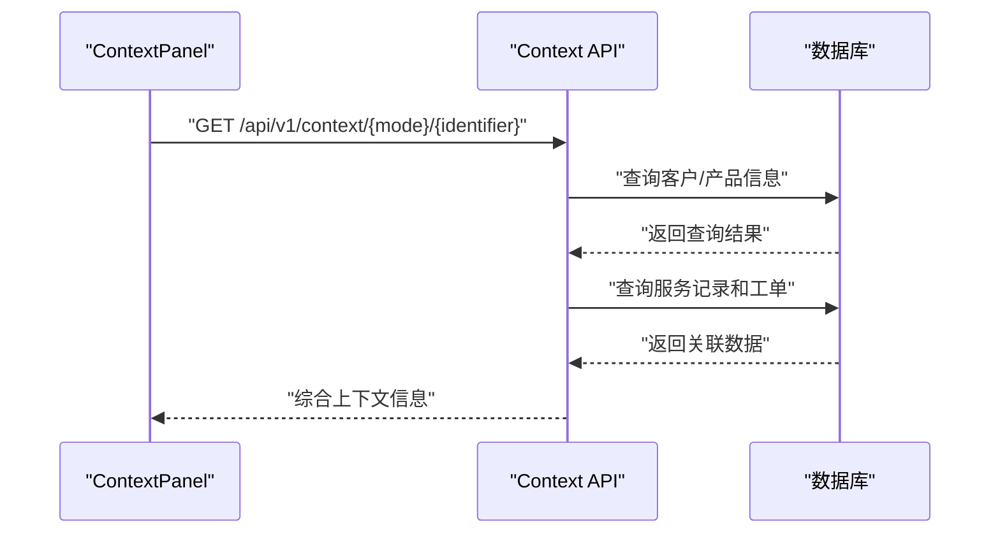

**图表来源**
- [ContextPanel.tsx](file://client/src/components/ServiceRecords/ContextPanel.tsx#L99-L126)
- [context.js](file://server/service/routes/context.js#L17-L159)

**章节来源**
- [ContextPanel.tsx](file://client/src/components/ServiceRecords/ContextPanel.tsx#L1-L554)
- [context.js](file://server/service/routes/context.js#L1-L440)

### 工单视图层（IssueListView + IssueCreateView + IssueDetailView）
- IssueListView：提供工单列表展示，支持搜索、筛选、刷新、加载更多，点击进入详情页面。
- IssueCreateView：提供工单创建界面，支持产品选择、客户选择、图片附件上传、表单验证。
- IssueDetailView：提供工单详情展示，支持评论添加、附件上传、状态更新、信息卡片展示。

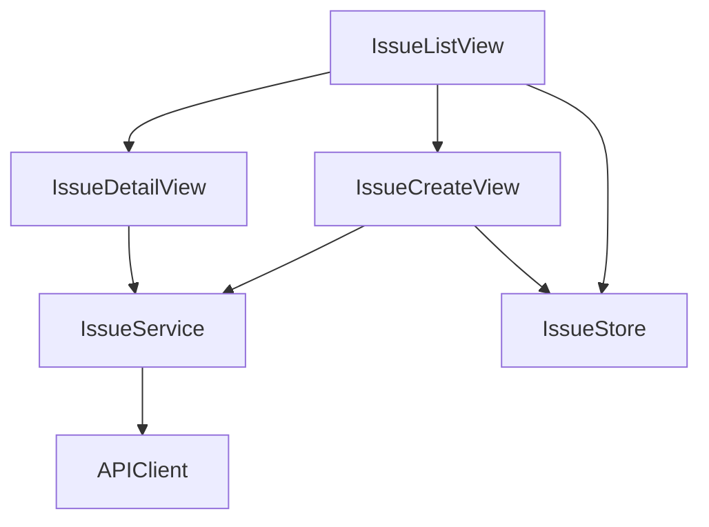

**图表来源**
- [IssueListView.swift](file://ios/LonghornApp/Views/Issues/IssueListView.swift#L10-L385)
- [IssueCreateView.swift](file://ios/LonghornApp/Views/Issues/IssueCreateView.swift#L11-L444)
- [IssueDetailView.swift](file://ios/LonghornApp/Views/Issues/IssueDetailView.swift#L11-L490)
- [IssueService.swift](file://ios/LonghornApp/Services/IssueService.swift#L13-L278)

**章节来源**
- [IssueListView.swift](file://ios/LonghornApp/Views/Issues/IssueListView.swift#L10-L385)
- [IssueCreateView.swift](file://ios/LonghornApp/Views/Issues/IssueCreateView.swift#L11-L444)
- [IssueDetailView.swift](file://ios/LonghornApp/Views/Issues/IssueDetailView.swift#L11-L490)

### 文件列表缓存与轮询（FileCacheManager + FileBrowserView）
- FileCacheManager.actor 实现目录列表缓存，支持 stale-while-revalidate：
  - 5 分钟内返回缓存（stale），后台静默刷新；
  - 30 分钟过期则不返回缓存，强制请求。
- FileBrowserView.task 每 5 秒发起一次静默刷新，避免 UI 阻塞。
- 通过 diff 机制清理被删除文件的预览缓存，避免"幽灵文件"。

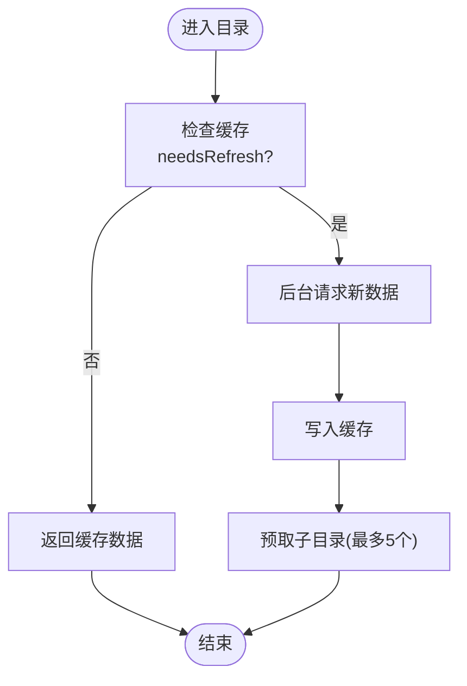

**图表来源**
- [FileCacheManager.swift](file://ios/LonghornApp/Services/FileCacheManager.swift#L28-L185)
- [FileBrowserView.swift](file://ios/LonghornApp/Views/Files/FileBrowserView.swift#L130-L144)

**章节来源**
- [FileCacheManager.swift](file://ios/LonghornApp/Services/FileCacheManager.swift#L28-L185)
- [FileBrowserView.swift](file://ios/LonghornApp/Views/Files/FileBrowserView.swift#L130-L144)

### 预览缓存与持久化（PreviewCacheManager）
- LRU 策略，最大 500MB；基于 index.json 持久化索引，启动时异步加载。
- 访问时间更新与去孤儿文件清理；缓存写入去抖（0.5 秒）降低磁盘压力。
- 提供按路径/目录批量失效能力，保障一致性。

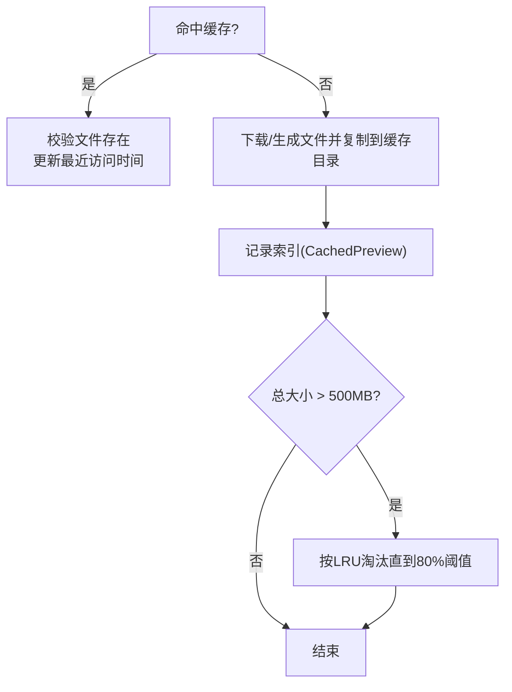

**图表来源**
- [PreviewCacheManager.swift](file://ios/LonghornApp/Services/PreviewCacheManager.swift#L10-L219)

**章节来源**
- [PreviewCacheManager.swift](file://ios/LonghornApp/Services/PreviewCacheManager.swift#L10-L219)

### 图片缓存与滚动优化（ImageCacheService）
- NSCache 内存缓存，限制数量与总成本，避免滚动卡顿。
- 与 SwiftUI AsyncImage 结合使用，减少重复解码与网络请求。

**章节来源**
- [ImageCacheService.swift](file://ios/LonghornApp/Services/ImageCacheService.swift#L10-L37)

### 文件服务聚合（FileService）
- 聚合文件列表、搜索、收藏、回收站、分享、统计等 API。
- 提供记录文件访问（fire-and-forget）以避免阻塞 UI。

**章节来源**
- [FileService.swift](file://ios/LonghornApp/Services/FileService.swift#L10-L419)

### 数据模型（FileItem + Issue + User）
- FileItem：统一文件/文件夹字段，支持多种日期格式解析。
- Issue：定义工单状态、严重程度、类别、来源等枚举类型，提供本地化名称、颜色和图标映射。
- User：管理员功能中的用户模型，支持角色、部门、权限管理。
- 支供图标映射、类型判定与格式化工具，便于视图层展示。

**章节来源**
- [FileItem.swift](file://ios/LonghornApp/Models/FileItem.swift#L11-L194)
- [Issue.swift](file://ios/LonghornApp/Models/Issue.swift#L13-L395)
- [AdminService.swift](file://ios/LonghornApp/Services/AdminService.swift#L98-L155)

### 视图层设计（MainTabView + FileBrowserView + Issue 视图 + Admin 视图）
- MainTabView：iPhone 使用 TabView，iPad 保持一致布局（可扩展为 SplitView）。
- FileBrowserView：支持列表/网格视图、排序、搜索、批量操作、上下文菜单、全屏预览、上传/下载、轮询刷新、错误提示与 Toast。
- Issue 视图：提供完整的工单管理界面，包括列表、详情、创建等功能。
- Admin 视图：提供管理员功能界面，包括用户管理、部门管理、权限管理等。

**章节来源**
- [MainTabView.swift](file://ios/LonghornApp/Views/Main/MainTabView.swift#L10-L77)
- [FileBrowserView.swift](file://ios/LonghornApp/Views/Files/FileBrowserView.swift#L15-L305)
- [IssueListView.swift](file://ios/LonghornApp/Views/Issues/IssueListView.swift#L10-L385)
- [IssueCreateView.swift](file://ios/LonghornApp/Views/Issues/IssueCreateView.swift#L11-L444)
- [IssueDetailView.swift](file://ios/LonghornApp/Views/Issues/IssueDetailView.swift#L11-L490)

### 通知与事件（AppNotifications）
- 定义文件/分享/用户等事件，集中发布与订阅，降低耦合。

**章节来源**
- [AppNotifications.swift](file://ios/LonghornApp/Services/AppNotifications.swift#L10-L86)

### 国际化支持扩展（Localizable.xcstrings + Service API）
- 新增大量服务记录相关的多语言字符串，支持英文、中文简体、日文、德文四种语言。
- 包括工单标题、状态、严重程度、类别、来源等完整翻译。
- 支持动态语言切换和本地化显示。
- 服务API文档中包含完整的上下文查询接口说明。

**章节来源**
- [Localizable.xcstrings](file://ios/LonghornApp/Resources/Localizable.xcstrings#L2169-L3200)
- [Localizable.xcstrings](file://ios/LonghornApp/Resources/Localizable.xcstrings#L6275-L6850)
- [Service_API.md](file://docs/Service_API.md#L354-L419)

## 依赖关系分析
- 视图层依赖服务层与模型层；服务层依赖网络层与存储层（缓存）。
- 认证服务贯穿网络层，确保请求鉴权。
- 通知系统作为跨组件通信中枢，避免循环依赖。
- **新增** AdminService 与 FileService、IssueService 并列存在于服务层，各自负责不同的业务领域。

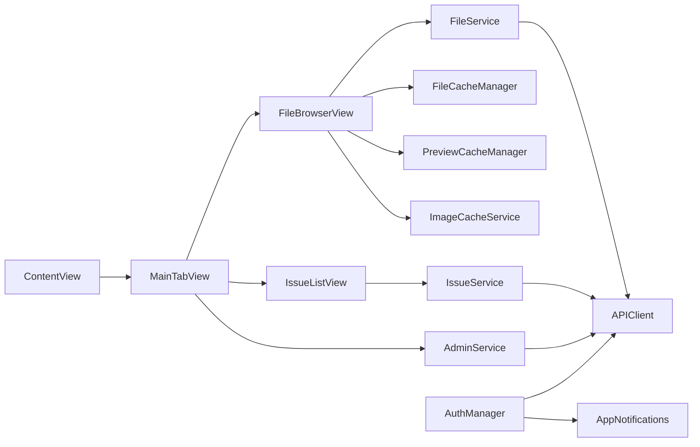

**图表来源**
- [ContentView.swift](file://ios/LonghornApp/ContentView.swift#L10-L37)
- [MainTabView.swift](file://ios/LonghornApp/Views/Main/MainTabView.swift#L10-L77)
- [FileBrowserView.swift](file://ios/LonghornApp/Views/Files/FileBrowserView.swift#L15-L305)
- [IssueListView.swift](file://ios/LonghornApp/Views/Issues/IssueListView.swift#L10-L385)
- [AdminService.swift](file://ios/LonghornApp/Services/AdminService.swift#L5-L155)
- [FileService.swift](file://ios/LonghornApp/Services/FileService.swift#L10-L419)
- [IssueService.swift](file://ios/LonghornApp/Services/IssueService.swift#L13-L278)
- [APIClient.swift](file://ios/LonghornApp/Services/APIClient.swift#L37-L326)
- [FileCacheManager.swift](file://ios/LonghornApp/Services/FileCacheManager.swift#L28-L185)
- [PreviewCacheManager.swift](file://ios/LonghornApp/Services/PreviewCacheManager.swift#L10-L219)
- [ImageCacheService.swift](file://ios/LonghornApp/Services/ImageCacheService.swift#L10-L37)
- [AuthManager.swift](file://ios/LonghornApp/Services/AuthManager.swift#L12-L195)
- [AppNotifications.swift](file://ios/LonghornApp/Services/AppNotifications.swift#L10-L86)

## 性能考量
- 网络层
  - URLSession 超时配置与错误分类，避免长时间阻塞 UI。
  - 401 自动登出与重试策略，减少无效请求。
- 缓存策略
  - 目录列表 SWR：快速响应 + 后台刷新，兼顾实时性与性能。
  - 预览 LRU：限制总量，定期清理，保证可用空间。
  - 图片内存缓存：限制数量与成本，降低解码与网络消耗。
- UI 与交互
  - 全屏预览使用 item: 绑定，避免"黑屏"问题。
  - 列表/网格切换与排序状态持久化，减少重复计算。
  - **新增** 工单列表支持懒加载和无限滚动，提升大数据量下的性能表现。
  - **新增** 管理员服务采用异步加载，避免阻塞主线程。
- 电池与后台
  - 5 秒轮询为前台静默刷新，避免后台任务唤醒。
  - 批量下载返回 ZIP，减少多次连接开销。
  - **新增** 工单附件上传采用异步处理，避免阻塞 UI 线程。
  - **新增** 上下文查询支持防抖处理，减少频繁网络请求。
- 网络优化
  - 上传/下载进度回调，结合缓存与预取，提升整体体验。
  - **新增** 工单 API 支持分页和条件过滤，减少不必要的数据传输。
  - **新增** 上下文查询 API 支持灵活的查询参数和结果过滤。

**章节来源**
- [APIClient.swift](file://ios/LonghornApp/Services/APIClient.swift#L56-L64)
- [FileCacheManager.swift](file://ios/LonghornApp/Services/FileCacheManager.swift#L16-L24)
- [PreviewCacheManager.swift](file://ios/LonghornApp/Services/PreviewCacheManager.swift#L24-L39)
- [ImageCacheService.swift](file://ios/LonghornApp/Services/ImageCacheService.swift#L15-L19)
- [FileBrowserView.swift](file://ios/LonghornApp/Views/Files/FileBrowserView.swift#L130-L144)
- [IssueService.swift](file://ios/LonghornApp/Services/IssueService.swift#L21-L44)
- [AdminService.swift](file://ios/LonghornApp/Services/AdminService.swift#L17-L30)

## 故障排查指南
- 预览黑屏
  - 检查是否使用 fullScreenCover(item:) 而非 isPresented 绑定。
  - 确认服务端 Content-Type 正确（HEIC 转换后应为 image/jpeg 流）。
- 缩略图失效
  - 服务器需安装 ffmpeg（视频）与 sips（HEIC）。
  - 查看服务端日志中的 [Thumbnail] 输出定位问题。
- 登录失败
  - 检查 Keychain 读写状态与 Token 有效期；必要时清理缓存后重试。
- 网络异常
  - 查看 API 调试输出（DEBUG 模式），关注状态码与错误消息。
- 缓存异常
  - 预览缓存索引损坏时会自动清空；检查 index.json 与缓存目录一致性。
- **新增** 工单功能异常
  - 检查 IssueService 的 API 调用是否正确，关注网络请求状态。
  - 确认工单数据模型的 JSON 解析是否符合预期。
  - 验证国际化字符串是否正确加载。
- **新增** 管理员功能异常
  - 检查 AdminService 的 API 调用是否正确，确认权限验证。
  - 确认用户数据模型的 JSON 解析是否符合预期。
- **新增** 上下文查询异常
  - 检查 ContextPanel 的 API 调用是否正确，关注查询参数。
  - 确认上下文数据模型的 JSON 解析是否符合预期。

**章节来源**
- [iOS 开发指南](file://docs/iOS_Dev_Guide.md#L63-L71)
- [AuthManager.swift](file://ios/LonghornApp/Services/AuthManager.swift#L132-L180)
- [APIClient.swift](file://ios/LonghornApp/Services/APIClient.swift#L271-L315)
- [PreviewCacheManager.swift](file://ios/LonghornApp/Services/PreviewCacheManager.swift#L52-L63)
- [IssueService.swift](file://ios/LonghornApp/Services/IssueService.swift#L115-L159)
- [AdminService.swift](file://ios/LonghornApp/Services/AdminService.swift#L17-L30)

## 开发环境配置

### Git 忽略规则更新
**更新** 为改善开发环境配置，.gitignore 文件已更新，新增了 iOS 构建目录的忽略规则：

- `ios/build/`：忽略 iOS 应用的构建输出目录
- `ios/.build/`：忽略 Swift Package Manager 的构建缓存
- `ios/DerivedData/`：忽略 Xcode 的派生数据
- `ios/*.persistent_state`：忽略 Xcode 的持久化状态文件
- `*.xcuserstate`：忽略 Xcode 用户状态文件

这些规则确保构建产物不会被提交到版本控制系统，保持仓库的整洁性。

**章节来源**
- [.gitignore](file://.gitignore#L22-L27)
- [client/.gitignore](file://client/.gitignore#L1-L25)

### 构建目录结构
iOS 项目的构建目录包含以下重要路径：
- `ios/build/`：包含最终的应用包和符号文件
- `ios/.build/`：Swift Package Manager 的构建缓存
- `ios/DerivedData/`：Xcode 的派生数据，包含编译产物和中间文件
- `ios/*.persistent_state`：Xcode 的持久化状态文件

这些目录通常包含大量的临时文件和缓存数据，应该被版本控制系统忽略。

**章节来源**
- [Info.plist](file://ios/LonghornApp/Info.plist#L1-L16)

## 结论
Longhorn iOS 通过清晰的 MVVM 分层、完善的缓存与网络策略、以及统一的通知机制，实现了稳定的数据驱动 UI 体验。前台轮询与 SWR 缓存平衡了实时性与性能；预览缓存与图片内存缓存显著提升了交互流畅度；认证与网络层的健壮性保障了安全性与可靠性。

**更新** 新增的管理员服务和上下文查询功能进一步丰富了应用的业务能力，通过完整的服务层封装、视图层设计和数据模型定义，提供了从客户服务支持到系统管理的全流程解决方案。国际化支持的扩展确保了多语言环境下的用户体验一致性。

开发环境配置的改进（特别是 .gitignore 文件的更新）提高了团队协作效率，确保了代码仓库的整洁性和构建产物的正确管理。

后续可在 iPad 上引入侧边栏导航、增强后台任务与推送集成、完善工单实时同步机制，并继续扩展国际化支持范围。

## 附录

### iOS 特定功能实现要点
- 文件共享
  - 通过 FileService 创建分享链接与分享集合，支持密码与过期时间设置。
- 相机与相册集成
  - 使用 PhotosUI 进行照片/文件选择，结合上传进度与批量下载优化。
  - **新增** 工单附件支持通过 PhotosPicker 选择图片并异步上传。
  - **新增** 管理员功能支持文件权限管理与目录浏览。
- 权限管理
  - 在 Info.plist 中配置网络与隐私权限；在服务层处理权限拒绝场景（如上传/预览）。

**章节来源**
- [FileService.swift](file://ios/LonghornApp/Services/FileService.swift#L186-L226)
- [FileBrowserView.swift](file://ios/LonghornApp/Views/Files/FileBrowserView.swift#L62-L73)
- [IssueCreateView.swift](file://ios/LonghornApp/Views/Issues/IssueCreateView.swift#L127-L139)
- [IssueDetailView.swift](file://ios/LonghornApp/Views/Issues/IssueDetailView.swift#L212-L218)
- [AdminService.swift](file://ios/LonghornApp/Services/AdminService.swift#L87-L91)
- [Info.plist](file://ios/LonghornApp/Info.plist#L4-L11)

### 推送通知与实时同步
- 通知中心事件：通过 AppNotifications 定义文件/分享/用户事件，便于订阅与联动。
- 实时同步建议：结合后台任务与服务器推送（WebSocket/长连接）实现增量更新，减少轮询频率。
- **新增** 工单状态变更可通过推送通知及时告知相关人员。
- **新增** 管理员权限变更通知，确保权限管理的实时性。

**章节来源**
- [AppNotifications.swift](file://ios/LonghornApp/Services/AppNotifications.swift#L10-L86)

### 性能监控与崩溃日志
- 建议接入崩溃上报 SDK（如 Sentry/Xcode Diagnostics），在 DEBUG 模式下保留 API 调试输出，在 RELEASE 中关闭冗余日志。
- 监控指标：首帧时间、滚动帧率、缓存命中率、网络请求耗时、电池消耗趋势、工单加载性能。
- **新增** 工单 API 调用性能监控，包括请求耗时、成功率、错误类型统计。
- **新增** 管理员服务 API 性能监控，包括用户查询、权限管理等关键操作的响应时间。
- **新增** 上下文查询 API 性能监控，确保客户服务查询的实时性。

### 版本兼容性处理
- 最低系统版本 iOS 16.0，Swift 5.9；网络配置允许任意加载（开发阶段），生产环境建议收紧 ATS 策略。
- 通过 @available 与条件编译处理新特性与旧设备差异。
- **新增** 国际化字符串的多语言支持，确保不同语言环境下的功能完整性。
- **新增** 服务API的向后兼容性处理，确保新旧版本间的平滑过渡。

**章节来源**
- [iOS 项目说明](file://ios/README.md#L6-L8)
- [Info.plist](file://ios/LonghornApp/Info.plist#L4-L11)
- [Localizable.xcstrings](file://ios/LonghornApp/Resources/Localizable.xcstrings#L2-L3)
- [Service_API.md](file://docs/Service_API.md#L354-L419)

### 服务管理功能扩展建议
- **数据同步**：实现工单数据的本地缓存与云端同步，支持离线创建和状态更新。
- **搜索优化**：为工单添加全文搜索功能，支持按标题、描述、产品、客户等多维度搜索。
- **工作流集成**：与企业现有的工单管理系统集成，支持标准化的工作流程。
- **报表统计**：基于工单统计数据生成可视化报表，帮助管理层了解问题趋势。
- **移动端优化**：针对移动设备特性优化工单处理流程，简化操作步骤。
- **权限管理**：完善管理员权限体系，支持细粒度的权限控制和审计日志。
- **上下文查询优化**：增加智能推荐功能，根据历史记录推荐相关服务或产品。
- **多渠道支持**：扩展服务记录的创建渠道，支持电话、在线、微信等多种服务模式。

**章节来源**
- [IssueService.swift](file://ios/LonghornApp/Services/IssueService.swift#L192-L195)
- [Issue.swift](file://ios/LonghornApp/Models/Issue.swift#L377-L394)
- [AdminService.swift](file://ios/LonghornApp/Services/AdminService.swift#L47-L85)
- [ContextPanel.tsx](file://client/src/components/ServiceRecords/ContextPanel.tsx#L88-L126)