# Bokeh智能助手

<cite>
**本文档引用的文件**
- [client/package.json](file://client/package.json)
- [server/package.json](file://server/package.json)
- [ios/LonghornApp/Info.plist](file://ios/LonghornApp/Info.plist)
- [client/src/App.tsx](file://client/src/App.tsx)
- [server/index.js](file://server/index.js)
- [ios/LonghornApp/LonghornApp.swift](file://ios/LonghornApp/LonghornApp.swift)
- [docs/README.md](file://docs/README.md)
- [client/src/store/useAuthStore.ts](file://client/src/store/useAuthStore.ts)
- [server/service/routes/auth.js](file://server/service/routes/auth.js)
- [client/src/components/FileBrowser.tsx](file://client/src/components/FileBrowser.tsx)
- [server/service/routes/dealer-repairs.js](file://server/service/routes/dealer-repairs.js)
- [docs/SYSTEM_CONTEXT.md](file://docs/SYSTEM_CONTEXT.md)
- [docs/Service_DataModel.md](file://docs/Service_DataModel.md)
- [client/src/hooks/useNavigationState.ts](file://client/src/hooks/useNavigationState.ts)
- [client/src/components/Bokeh/BokehContainer.tsx](file://client/src/components/Bokeh/BokehContainer.tsx)
- [client/src/components/Bokeh/BokehOrb.tsx](file://client/src/components/Bokeh/BokehOrb.tsx)
- [client/src/components/Bokeh/BokehPanel.tsx](file://client/src/components/Bokeh/BokehPanel.tsx)
- [client/src/components/Bokeh/TicketDetailDialog.tsx](file://client/src/components/Bokeh/TicketDetailDialog.tsx)
- [client/src/components/Bokeh/TicketLink.tsx](file://client/src/components/Bokeh/TicketLink.tsx)
- [client/src/components/Bokeh/BokehEditorPanel.tsx](file://client/src/components/Bokeh/BokehEditorPanel.tsx)
- [client/src/components/Knowledge/WikiEditorModal.tsx](file://client/src/components/Knowledge/WikiEditorModal.tsx)
- [client/src/components/KinefinityWiki.tsx](file://client/src/components/KinefinityWiki.tsx)
- [server/service/ai_service.js](file://server/service/ai_service.js)
- [server/service/routes/settings.js](file://server/service/routes/settings.js)
- [server/service/routes/bokeh.js](file://server/service/routes/bokeh.js)
- [server/service/migrations/011_ticket_search_index.sql](file://server/service/migrations/011_ticket_search_index.sql#L8-L80)
- [server/scripts/index_all_tickets.js](file://server/scripts/index_all_tickets.js)
- [client/src/components/Admin/AdminSettings.tsx](file://client/src/components/Admin/AdminSettings.tsx)
</cite>

## 更新摘要
**所做更改**
- 更新Bokeh编辑器面板和球体组件的视觉样式优化，从紫色渐变更新为青色到淡紫色渐变
- 增强UI视觉一致性，统一品牌色彩主题
- 优化渐变色配置，提升组件视觉效果

## 目录
1. [简介](#简介)
2. [项目结构](#项目结构)
3. [核心组件](#核心组件)
4. [架构概览](#架构概览)
5. [详细组件分析](#详细组件分析)
6. [Bokeh AI聊天界面系统](#bokeh-ai聊天界面系统)
7. [KinefinityWiki深度集成](#kinefinitywiki深度集成)
8. [AI搜索模式检测](#ai搜索模式检测)
9. [Bokeh格式化功能](#bokeh格式化功能)
10. [章节聚合与整章阅读](#章节聚合与整章阅读)
11. [工单链接解析系统](#工单链接解析系统)
12. [AI搜索和索引管理](#ai搜索和索引管理)
13. [并发搜索与关键词提取](#并发搜索与关键词提取)
14. [视觉样式优化](#视觉样式优化)
15. [依赖分析](#依赖分析)
16. [性能考虑](#性能考虑)
17. [故障排除指南](#故障排除指南)
18. [结论](#结论)
19. [附录](#附录)

## 简介

Bokeh智能助手是一个基于React + Node.js的企业级文件管理和客户服务系统。该项目旨在为Kinefinity公司提供一个统一的平台，支持文件共享、客户服务工单管理以及智能知识库功能。

### 主要特性

- **多模块架构**：文件管理模块和服务管理模块的分离设计
- **权限控制系统**：基于角色的访问控制（RBAC），支持Admin、Lead、Member三种角色
- **三层工单模型**：咨询工单 → RMA返厂单 / 经销商维修单的完整服务流程
- **跨平台支持**：Web前端、iOS移动端和Node.js后端的完整生态系统
- **智能知识库**：集成AI驱动的知识库和词汇表管理
- **AI聊天助手**：集成Bokeh智能助手，提供实时对话和上下文感知的客户服务
- **工单链接解析**：支持在聊天中直接解析和跳转到相关工单详情
- **历史工单搜索**：基于全文检索的历史工单查询和引用功能
- **Wiki深度集成**：Bokeh与KinefinityWiki的双向上下文感知集成
- **智能搜索模式**：自然语言和关键词搜索的智能切换检测
- **编辑器优化**：内置的AI内容格式化和优化功能
- **章节聚合**：支持章节级别的内容聚合和整章阅读体验
- **并发搜索**：同时执行关键词搜索和AI搜索，提升响应速度
- **关键词提取**：智能提取查询中的关键词用于优化搜索结果
- **视觉统一**：青色到淡紫色渐变的统一视觉风格

## 项目结构

项目采用现代化的全栈架构，包含三个主要部分：

```mermaid
graph TB
subgraph "客户端层"
Web[Web客户端<br/>React 19 + TypeScript]
iOS[iOS客户端<br/>SwiftUI + MVVM]
Bokeh[Bokeh聊天界面<br/>Framer Motion动画]
Wiki[KinefinityWiki<br/>知识库系统]
BokehEditor[Bokeh编辑器面板<br/>内嵌AI助手]
TicketDetail[工单详情对话框<br/>弹窗组件]
TicketLink[工单链接解析<br/>正则表达式匹配]
End
subgraph "服务端层"
API[API服务器<br/>Express.js + Node.js]
DB[(SQLite数据库)]
FS[(文件系统)]
AI[AI服务<br/>OpenAI集成]
BokehAPI[Bokeh API<br/>工单搜索索引]
End
subgraph "工具层"
Auth[认证服务]
Cache[缓存系统]
Queue[任务队列]
Settings[系统设置]
End
Web --> API
iOS --> API
Bokeh --> API
Wiki --> API
BokehEditor --> API
TicketDetail --> API
TicketLink --> API
API --> DB
API --> FS
API --> AI
API --> BokehAPI
API --> Auth
API --> Cache
API --> Queue
AI --> Settings
BokehAPI --> DB
```

**图表来源**
- [client/package.json](file://client/package.json#L1-L46)
- [server/package.json](file://server/package.json#L1-L31)
- [ios/LonghornApp/LonghornApp.swift](file://ios/LonghornApp/LonghornApp.swift#L1-L26)

### 目录组织

项目采用按功能模块划分的目录结构：

- **client/**：React前端应用，包含所有UI组件和业务逻辑
- **server/**：Node.js后端服务，包含API路由、数据库操作和业务逻辑
- **ios/**：iOS原生应用，提供移动端访问能力
- **docs/**：项目文档和规范说明
- **scripts/**：部署和运维脚本

**章节来源**
- [docs/README.md](file://docs/README.md#L1-L19)

## 核心组件

### 前端核心组件

前端应用采用React 19构建，使用现代前端技术栈：

- **状态管理**：Zustand用于全局状态管理
- **路由系统**：React Router v7实现客户端路由
- **UI框架**：TailwindCSS + Framer Motion提供现代化界面
- **国际化**：i18n支持多语言切换
- **文件处理**：支持图片、视频、文档等多种文件类型的预览和处理
- **动画系统**：Framer Motion提供流畅的动画效果和交互体验
- **工单链接解析**：支持在文本中自动识别和解析工单链接
- **工单详情对话框**：提供工单详细信息的弹窗显示
- **Bokeh编辑器面板**：内嵌的AI内容优化助手
- **KinefinityWiki**：深度集成的知识库系统

### 后端核心组件

后端服务基于Express.js，提供RESTful API接口：

- **数据库**：SQLite3作为主要数据存储
- **认证**：JWT令牌认证系统
- **文件服务**：支持分片上传、缩略图生成、视频转码
- **权限控制**：基于角色的细粒度权限管理
- **缓存系统**：内存缓存和文件缓存结合
- **AI服务**：集成OpenAI API，提供智能对话和内容生成
- **Bokeh API**：专门的工单搜索和索引管理API
- **全文检索**：基于FTS5的全文搜索功能

### 移动端核心组件

iOS应用采用SwiftUI和MVVM架构：

- **架构模式**：MVVM + 单向数据流
- **性能优化**：预览缓存、轮询机制、手势识别
- **离线支持**：本地数据缓存和同步机制

**章节来源**
- [client/package.json](file://client/package.json#L12-L30)
- [server/package.json](file://server/package.json#L15-L29)

## 架构概览

系统采用分层架构设计，确保各组件间的松耦合和高内聚：

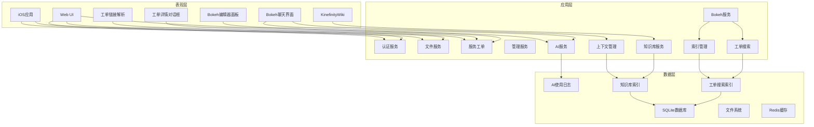

**图表来源**
- [server/index.js](file://server/index.js#L1-L50)
- [client/src/App.tsx](file://client/src/App.tsx#L96-L211)

### 数据流架构

系统采用事件驱动的数据流设计：

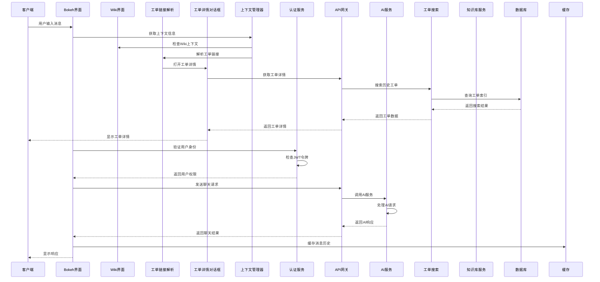

**图表来源**
- [server/service/routes/auth.js](file://server/service/routes/auth.js#L21-L101)
- [client/src/store/useAuthStore.ts](file://client/src/store/useAuthStore.ts#L17-L30)

## 详细组件分析

### 认证系统

认证系统采用JWT令牌机制，支持多种用户类型：

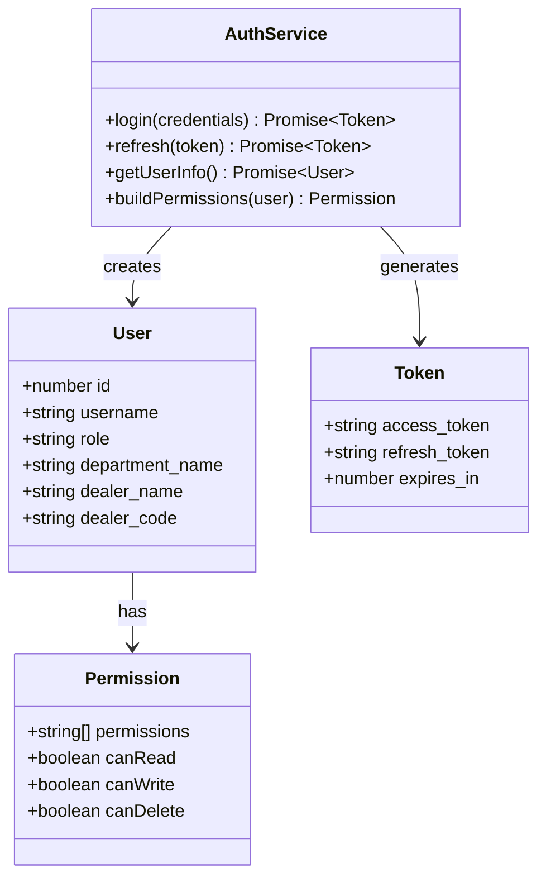

**图表来源**
- [server/service/routes/auth.js](file://server/service/routes/auth.js#L14-L277)

#### 权限模型

系统采用三级权限设计：

| 权限级别 | 描述 | 操作权限 |
|---------|------|----------|
| Read | 只读权限 | 浏览、下载文件 |
| Contributor | 贡献权限 | 上传、新建、编辑自己的文件 |
| Full | 完全权限 | 管理所有文件和用户

**章节来源**
- [server/service/routes/auth.js](file://server/service/routes/auth.js#L209-L274)

### 文件管理系统

文件管理系统提供完整的文件生命周期管理：

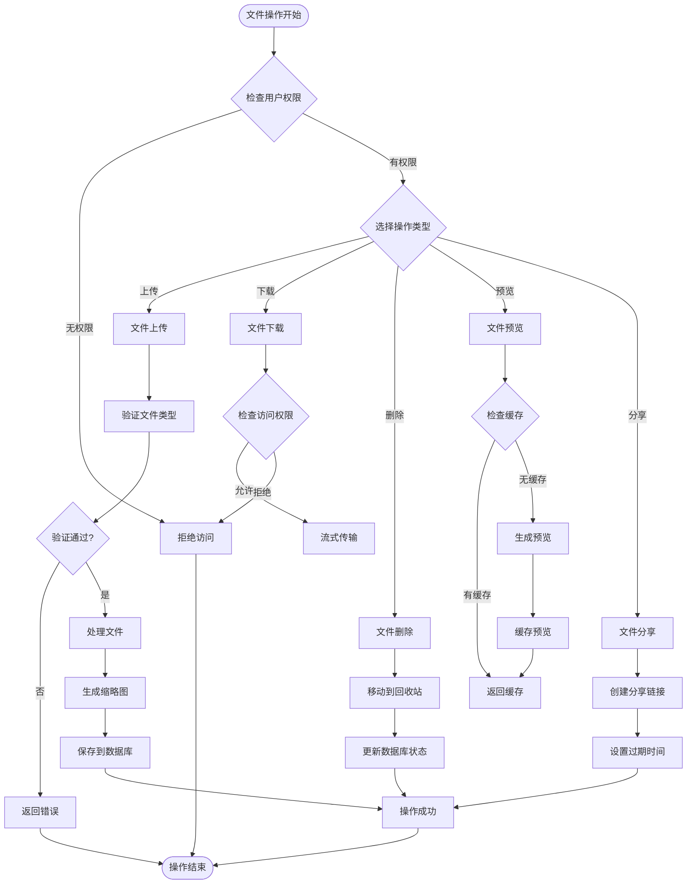

**图表来源**
- [client/src/components/FileBrowser.tsx](file://client/src/components/FileBrowser.tsx#L158-L200)

#### 文件处理流程

系统支持多种文件类型的智能处理：

- **图片文件**：自动生成WebP缩略图，支持HEIC格式转换
- **视频文件**：使用ffmpeg进行转码和缩略图生成
- **文档文件**：支持DOCX、XLSX等格式的在线预览
- **压缩包**：支持ZIP文件的解压和浏览

**章节来源**
- [server/index.js](file://server/index.js#L777-L800)

### 服务工单系统

服务工单系统采用三层模型设计：

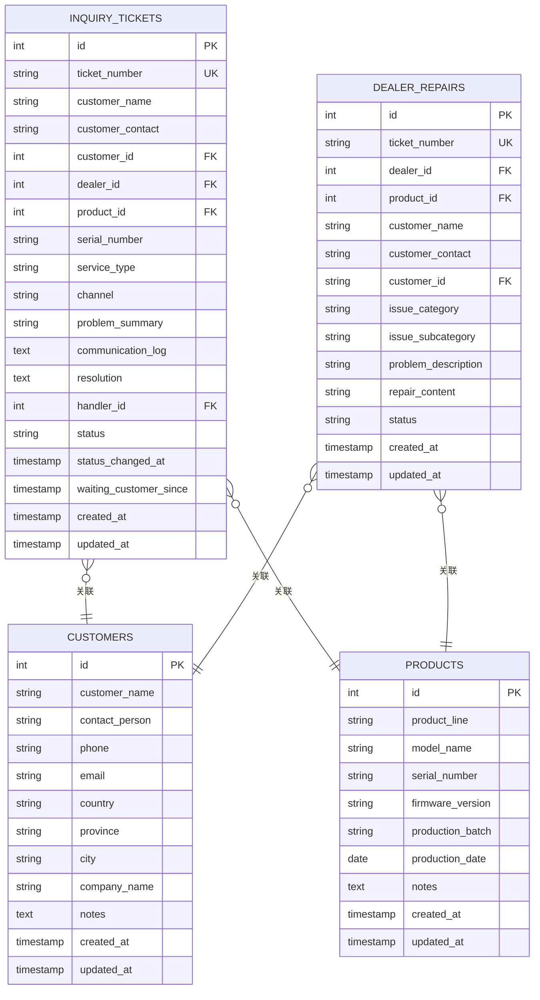

**图表来源**
- [docs/Service_DataModel.md](file://docs/Service_DataModel.md#L150-L304)

#### 工单流转流程

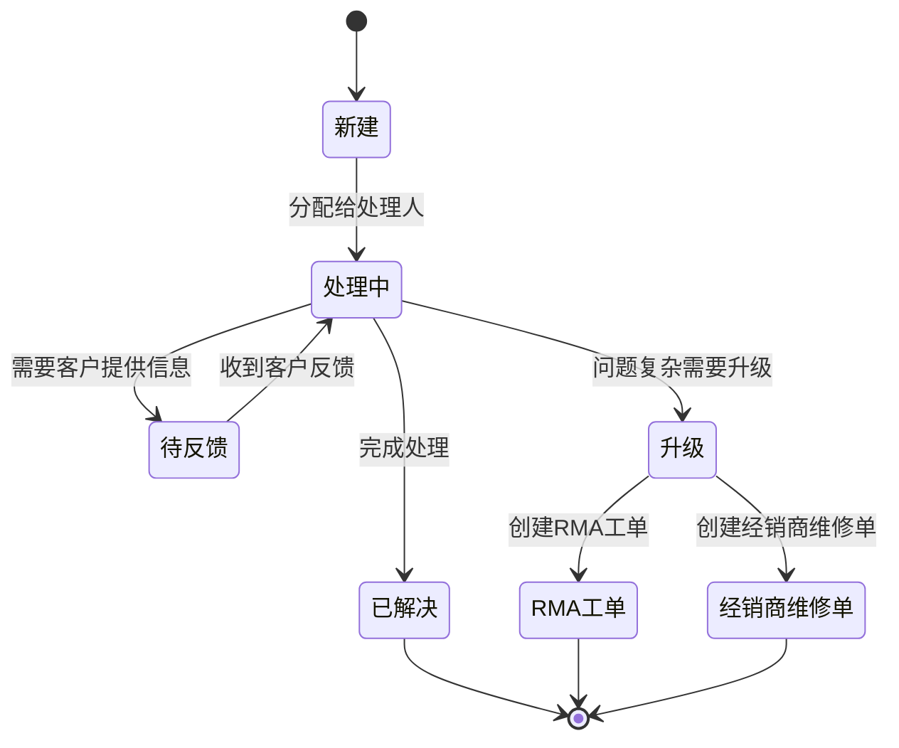

**图表来源**
- [server/service/routes/dealer-repairs.js](file://server/service/routes/dealer-repairs.js#L106-L145)

**章节来源**
- [docs/Service_DataModel.md](file://docs/Service_DataModel.md#L148-L304)

### 知识库系统

知识库系统支持多层级的知识管理和检索：

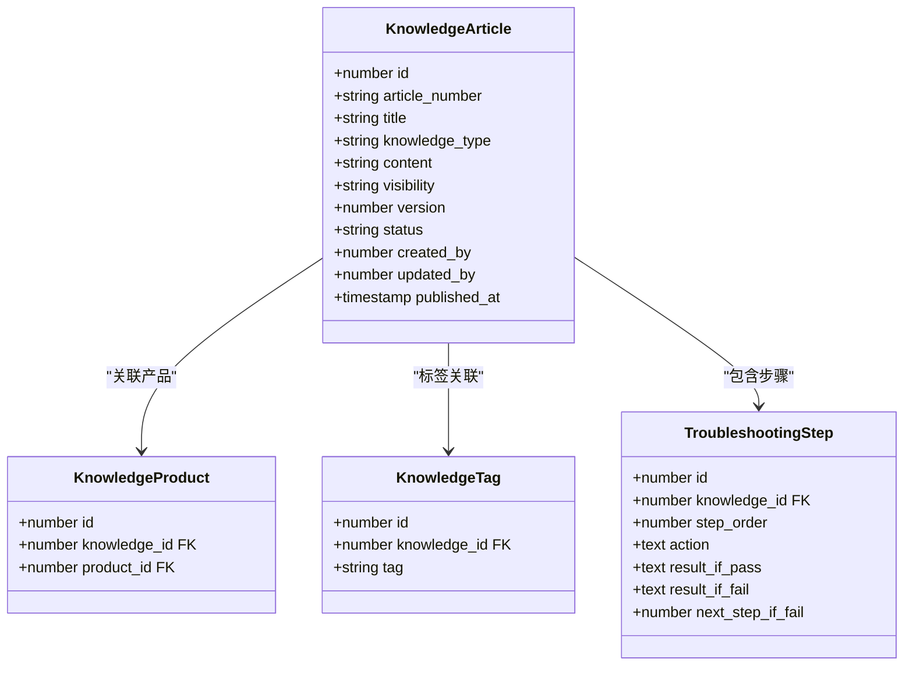

**图表来源**
- [docs/Service_DataModel.md](file://docs/Service_DataModel.md#L391-L488)

## Bokeh AI聊天界面系统

Bokeh智能助手是系统中新添加的AI聊天界面组件，提供沉浸式的对话体验和上下文感知的服务支持。

### 系统架构

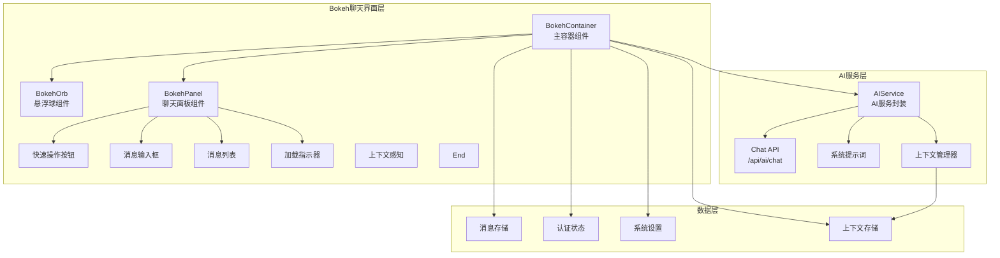

**图表来源**
- [client/src/components/Bokeh/BokehContainer.tsx](file://client/src/components/Bokeh/BokehContainer.tsx#L15-L104)
- [client/src/components/Bokeh/BokehOrb.tsx](file://client/src/components/Bokeh/BokehOrb.tsx#L8-L80)
- [client/src/components/Bokeh/BokehPanel.tsx](file://client/src/components/Bokeh/BokehPanel.tsx#L21-L246)

### 核心组件详解

#### BokehContainer - 主容器组件

BokehContainer是整个聊天界面的主控制器，负责管理聊天界面的状态和生命周期。

**主要功能**：
- 全局键盘快捷键监听（Cmd+K / Ctrl+K）
- 聊天消息的发送和接收处理
- 加载状态管理
- 用户认证令牌的获取和传递
- 编辑器模式检测和处理

**键盘快捷键实现**：
```typescript
// 全局快捷键监听
useEffect(() => {
    const handleKeyDown = (e: KeyboardEvent) => {
        if ((e.metaKey || e.ctrlKey) && e.key === 'k') {
            e.preventDefault();
            setIsOpen(prev => !prev);
        }
    };

    window.addEventListener('keydown', handleKeyDown);
    return () => window.removeEventListener('keydown', handleKeyDown);
}, []);
```

**消息发送流程**：
```typescript
const sendMessage = async (text: string) => {
    const userMsg: Message = {
        id: Date.now().toString(),
        role: 'user',
        content: text,
        timestamp: Date.now()
    };

    setMessages(prev => [...prev, userMsg]);
    setLoading(true);

    try {
        // 检测是否为编辑器模式请求
        const isEditorModeRequest = isEditorMode() && (
            text.includes('优化') ||
            text.includes('修改') ||
            text.includes('调整') ||
            text.includes('缩小') ||
            text.includes('放大') ||
            text.includes('图片') ||
            text.includes('段落') ||
            text.includes('格式') ||
            text.includes('太大') ||
            text.includes('太小') ||
            text.includes('重写') ||
            text.includes('精简') ||
            text.includes('缩短') ||
            text.includes('颜色') ||
            text.includes('样式') ||
            text.includes('标题')
        );

        if (isEditorModeRequest && currentContext?.type === 'wiki_article_edit') {
            // 调用bokeh-optimize API进行编辑器模式优化
            const res = await axios.post(`/api/v1/knowledge/${currentContext.articleId}/bokeh-optimize`, {
                instruction: text,
                currentContent: currentContext.currentContent
            }, {
                headers: { Authorization: `Bearer ${token}` }
            });

            if (res.data.success) {
                const aiMsg: Message = {
                    id: (Date.now() + 1).toString(),
                    role: 'assistant',
                    content: res.data.data.response_message,
                    timestamp: Date.now()
                };
                setMessages(prev => [...prev, aiMsg]);
                
                // 触发事件通知编辑器刷新
                window.dispatchEvent(new CustomEvent('bokeh-article-optimized', {
                    detail: { 
                        articleId: currentContext.articleId,
                        optimizedContent: res.data.data.optimized_content
                    }
                }));
            }
        } else {
            // 普通聊天请求
            const contextSummary = getContextSummary();
            const res = await axios.post('/api/ai/chat', {
                messages: [...messages, userMsg].map(m => ({ role: m.role, content: m.content })),
                context: {
                    path: window.location.pathname,
                    title: document.title,
                    wikiContext: currentContext,
                    contextSummary
                }
            }, {
                headers: { Authorization: `Bearer ${token}` }
            });

            if (res.data.success) {
                const aiMsg: Message = {
                    id: (Date.now() + 1).toString(),
                    role: 'assistant',
                    content: res.data.data,
                    timestamp: Date.now()
                };
                setMessages(prev => [...prev, aiMsg]);
            }
        }
    } catch (err) {
        // 错误处理...
    } finally {
        setLoading(false);
    }
};
```

**章节来源**
- [client/src/components/Bokeh/BokehContainer.tsx](file://client/src/components/Bokeh/BokehContainer.tsx#L15-L104)

#### BokehOrb - 悬浮球组件

BokehOrb是聊天界面的入口点，采用悬浮球设计，提供直观的用户交互。

**设计特点**：
- **视觉设计**：渐变背景、毛玻璃效果、阴影滤镜
- **动画效果**：脉冲动画、悬停缩放、点击反馈
- **拖拽功能**：可拖拽到屏幕任意位置
- **工具提示**：悬停显示快捷键提示

**动画实现**：
```typescript
// 脉冲动画
animate={{
    boxShadow: [
        '0 0 15px rgba(0, 191, 165, 0.3)',
        '0 0 25px rgba(142, 36, 170, 0.5)',
        '0 0 15px rgba(0, 191, 165, 0.3)'
    ],
    scale: [1, 1.05, 1],
}}

// 拖拽约束
dragConstraints={{ 
    left: -window.innerWidth + 50, 
    right: 0, 
    top: -window.innerHeight + 50, 
    bottom: 0 
}}
```

**交互行为**：
- 悬停时放大1.1倍并增强亮度
- 点击时缩小到0.95倍产生按压反馈
- 支持鼠标拖拽到屏幕边缘

**章节来源**
- [client/src/components/Bokeh/BokehOrb.tsx](file://client/src/components/Bokeh/BokehOrb.tsx#L8-L80)

#### BokehPanel - 聊天面板组件

BokehPanel是聊天界面的核心，提供完整的聊天体验，包括消息展示、输入框和快速操作。

**界面布局**：
- **头部区域**：显示Bokeh标识和控制按钮
- **消息区域**：显示历史消息和当前加载状态
- **上下文横幅**：显示当前页面上下文信息
- **快速操作**：提供常用查询的快捷按钮
- **输入区域**：文本输入框和发送按钮

**上下文感知功能**：
```typescript
// 根据不同上下文类型显示不同的横幅内容
const getBannerContent = () => {
    switch (wikiContext.type) {
        case 'wiki_article_edit':
            return {
                icon: <FileText size={14} color="#FFD700" />,
                label: '正在编辑文章',
                title: wikiContext.articleTitle,
                subtitle: wikiContext.hasDraft ? '有待发布的Bokeh优化草稿' : null,
                color: '#FFD700'
            };
        case 'wiki_article_view':
            return {
                icon: <FileText size={14} color="#00BFA5" />,
                label: '正在浏览文章',
                title: wikiContext.articleTitle,
                subtitle: null,
                color: '#00BFA5'
            };
        case 'wiki_home':
            return {
                icon: <Sparkles size={14} color="#8E24AA" />,
                label: 'Wiki 首页',
                title: '浏览知识库',
                subtitle: null,
                color: '#8E24AA'
            };
        case 'file_manager':
            return {
                icon: <Box size={14} color="#2196F3" />,
                label: '文件管理',
                title: wikiContext.currentPath || '根目录',
                subtitle: null,
                color: '#2196F3'
            };
        case 'ticket_system':
            return {
                icon: <FileText size={14} color="#FF9800" />,
                label: '工单系统',
                title: wikiContext.viewType || '工单列表',
                subtitle: null,
                color: '#FF9800'
            };
        default:
            return null;
    }
};
```

**快捷操作功能**：
- **编辑模式**：优化排版、精简内容、调整图片等
- **浏览模式**：文章摘要、查找相关、如何编辑等
- **首页模式**：创建文章、MAVO文档、导入文档等
- **文件管理**：分享文件、创建文件夹等
- **工单系统**：创建工单、工单流程等

**输入处理**：
- 支持Enter键发送消息（Shift+Enter换行）
- 自动滚动到最新消息
- 输入验证和空消息过滤

**章节来源**
- [client/src/components/Bokeh/BokehPanel.tsx](file://client/src/components/Bokeh/BokehPanel.tsx#L21-L246)

### AI服务集成

Bokeh聊天界面与后端AI服务的集成提供了强大的智能对话能力。

**AI服务架构**：
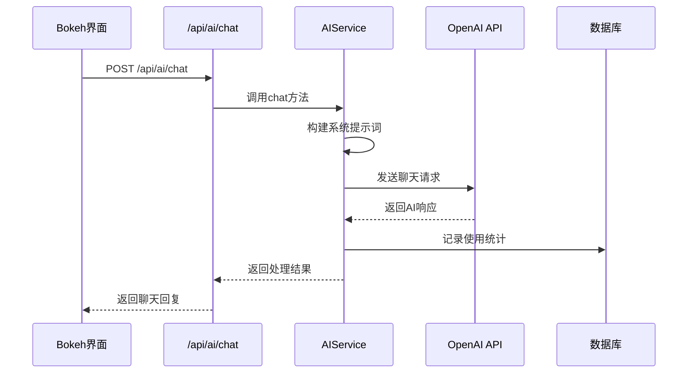

**系统提示词设计**：
```javascript
const systemPrompt = `You are Bokeh, Kinefinity's professional AI service assistant.
You have access to the Kinefinity Service Database.
Current Context:
- Page: ${context.path || 'Unknown'}
- Title: ${context.title || 'Unknown'}
- Strict Work Mode: ${settings.ai_work_mode ? 'ENABLED (Refuse casual chat, only answer work-related questions)' : 'DISABLED'}
- Web Search: ${settings.ai_allow_search ? 'ENABLED' : 'DISABLED'}
- Active Data Sources: ${dataSources.join(', ')}

Guidelines:
- Be helpful, concise, and professional.
- If Strict Work Mode is ON, politely refuse to answer questions about movies, jokes, or general trivia unrelated to Kinefinity/Filmmaking.
- Your persona: "Ethereal, Calm, Responsive". Use "we" when referring to Kinefinity support.
- Always reference knowledge base articles and historical tickets when available.
`;
```

**AI配置管理**：
- **模型选择**：支持多种AI模型（deepseek-chat、deepseek-reasoner等）
- **工作模式**：严格工作模式限制非工作相关对话
- **温度参数**：控制AI响应的创造性程度
- **使用统计**：记录AI使用情况和成本估算
- **数据源控制**：可配置的知识库和工单数据源

**章节来源**
- [server/service/ai_service.js](file://server/service/ai_service.js#L164-L215)
- [server/service/routes/settings.js](file://server/service/routes/settings.js#L20-L91)

### 实时消息处理

Bokeh聊天界面实现了完整的实时消息处理机制，提供流畅的对话体验。

**消息状态管理**：
- **消息历史**：保存完整的对话历史
- **加载状态**：AI响应时的加载指示
- **错误处理**：网络错误时的友好提示

**自动滚动功能**：
```typescript
useEffect(() => {
    if (scrollRef.current) {
        scrollRef.current.scrollTop = scrollRef.current.scrollHeight;
    }
}, [messages, isOpen]);
```

**上下文感知**：
- **页面上下文**：自动获取当前页面路径和标题
- **工作模式**：根据系统设置限制对话范围
- **用户权限**：基于用户角色提供相应的帮助
- **编辑器模式**：智能检测编辑器上下文并提供相应建议

**章节来源**
- [client/src/components/Bokeh/BokehPanel.tsx](file://client/src/components/Bokeh/BokehPanel.tsx#L25-L29)
- [client/src/components/Bokeh/BokehContainer.tsx](file://client/src/components/Bokeh/BokehContainer.tsx#L46-L54)

## KinefinityWiki深度集成

Bokeh智能助手与KinefinityWiki系统实现了深度的双向集成，提供无缝的上下文感知体验。

### 系统架构

```mermaid
graph TB
subgraph "Wiki系统层"
Wiki[KinefinityWiki<br/>知识库主界面]
ChapterView[章节视图<br/>聚合显示]
FullChapter[整章内容<br/>合并展示]
SearchBar[搜索栏<br/>双模式支持]
BokehAssistant[Bokeh助手<br/>内嵌面板]
End
subgraph "上下文管理层"
ContextMgr[上下文管理器]
WikiContext[Wiki上下文]
EditorContext[编辑器上下文]
HomeContext[首页上下文]
End
subgraph "AI服务层"
AIService[AIService<br/>AI服务封装]
SearchEngine[搜索引擎<br/>关键词/自然语言]
End
subgraph "数据层"
KnowledgeDB[(知识库数据库)]
Cache[缓存系统]
EventBus[事件总线]
End
Wiki --> ContextMgr
ChapterView --> ContextMgr
FullChapter --> ContextMgr
SearchBar --> ContextMgr
BokehAssistant --> ContextMgr
ContextMgr --> WikiContext
ContextMgr --> EditorContext
ContextMgr --> HomeContext
ContextMgr --> AIService
AIService --> SearchEngine
SearchEngine --> KnowledgeDB
ContextMgr --> EventBus
EventBus --> Wiki
EventBus --> BokehAssistant
```

**图表来源**
- [client/src/components/KinefinityWiki.tsx](file://client/src/components/KinefinityWiki.tsx#L143-L170)
- [client/src/components/Bokeh/BokehContainer.tsx](file://client/src/components/Bokeh/BokehContainer.tsx#L21-L21)

### 核心组件详解

#### Wiki上下文管理

Wiki系统通过上下文管理器与Bokeh智能助手进行双向通信：

**上下文类型定义**：
```typescript
// Wiki文章编辑上下文
interface WikiArticleEditContext {
    type: 'wiki_article_edit';
    mode: 'editor';
    articleId: number;
    articleTitle: string;
    articleSlug: string;
    currentContent: string;
    hasDraft: boolean;
}

// Wiki文章浏览上下文
interface WikiArticleViewContext {
    type: 'wiki_article_view';
    mode: 'assistant';
    articleId: number;
    articleTitle: string;
    articleSlug: string;
    articleSummary?: string;
}

// Wiki首页上下文
interface WikiHomeContext {
    type: 'wiki_home';
    mode: 'assistant';
}

// 文件管理上下文
interface FileManagerContext {
    type: 'file_manager';
    mode: 'assistant';
    currentPath?: string;
    selectedFiles?: string[];
}

// 工单系统上下文
interface TicketSystemContext {
    type: 'ticket_system';
    mode: 'assistant';
    viewType?: 'inquiry' | 'rma' | 'dealer_repair' | 'dashboard';
}
```

**上下文状态管理**：
```typescript
// 设置Wiki视图上下文
const setWikiViewContext = (context: WikiContext) => {
    setCurrentContext(context);
    // 更新Bokeh面板的上下文横幅
    updateContextBanner(context);
};

// 获取上下文摘要
const getContextSummary = (): string => {
    if (!currentContext) return '';
    
    switch (currentContext.type) {
        case 'wiki_article_edit':
            return `正在编辑文章: ${currentContext.articleTitle}`;
        case 'wiki_article_view':
            return `正在浏览文章: ${currentContext.articleTitle}`;
        case 'wiki_home':
            return '浏览知识库首页';
        case 'file_manager':
            return `文件管理: ${currentContext.currentPath || '根目录'}`;
        case 'ticket_system':
            return `工单系统: ${currentContext.viewType || '工单列表'}`;
        default:
            return '';
    }
};
```

**章节来源**
- [client/src/components/KinefinityWiki.tsx](file://client/src/components/KinefinityWiki.tsx#L682-L698)
- [client/src/store/useBokehContext.ts](file://client/src/store/useBokehContext.ts)

#### 搜索模式智能检测

Wiki系统实现了智能的搜索模式检测，能够自动区分自然语言查询和关键词搜索：

**搜索类型检测算法**：
```typescript
// 检测搜索类型：自然语言问题 vs 关键词
const detectSearchType = (query: string): boolean => {
    // 自然语言特征：
    // 1. 包含疑问词（如何、怎么、为什么、什么是等）
    // 2. 以"找/查/推荐"开头
    // 3. 长度较长且包含空格或标点
    // 4. 包含"?"或"？"
    
    const questionWords = /如何|怎么|为什么|什么是|怎样|哪里|哪个|哪些|吗|呢|？|\?/;
    const recommendWords = /^找|查|推荐|搜索|查找/;
    
    if (questionWords.test(query)) return true;
    if (recommendWords.test(query)) return true;
    if (query.length > 15 && (query.includes(' ') || query.includes('，') || query.includes(','))) return true;
    
    return false;
};

// 执行搜索（智能检测）
useEffect(() => {
    if (!pendingSearchQuery.trim()) {
        return;
    }
    
    const query = pendingSearchQuery.trim();
    const isNaturalLanguage = detectSearchType(query);
    setSearchMode(isNaturalLanguage ? 'ai' : 'keyword');
    
    const doSearch = async () => {
        try {
            setIsSearching(true);
            
            if (isNaturalLanguage) {
                setIsAiSearching(true);
                await performAiSearch(query);
            } else {
                await performKeywordSearch(query);
            }
        } catch (err) {
            console.error('[Wiki] Search error:', err);
        } finally {
            setIsSearching(false);
            setIsAiSearching(false);
        }
    };
    
    doSearch();
}, [pendingSearchQuery, token]);
```

**AI搜索实现**：
```typescript
// Bokeh 搜索
const performAiSearch = async (query: string) => {
    try {
        const headers = token ? { Authorization: `Bearer ${token}` } : {};
        
        // 1. 先获取传统搜索结果作为上下文
        const searchRes = await axios.get('/api/v1/knowledge', {
            headers,
            params: { search: query, page_size: 10 }
        });
        const contextArticles = searchRes.data.data || [];
        
        // 2. 调用 Bokeh 接口获取回答
        const messages = [
            {
                role: 'system',
                content: `你是 Kinefinity 技术支持助手。请基于以下知识库文章回答用户问题。如果知识库中没有相关信息，请说明并提供一般性建议.\n\n知识库文章：\n${contextArticles.map((a: KnowledgeArticle) => `- ${a.title}: ${a.summary || ''}`).join('\n')}`
            },
            {
                role: 'user',
                content: query
            }
        ];
        
        const aiRes = await axios.post('/api/ai/chat', {
            messages,
            context: { source: 'wiki_search', articles: contextArticles.map((a: KnowledgeArticle) => a.id) }
        }, { headers });
        
        setAiAnswer(aiRes.data.data?.content || '抱歉，无法获取 Bokeh 回答。');
        setRelatedArticles(contextArticles);
        setShowSearchResults(true);
    } catch (err) {
        console.error('[Wiki] Bokeh search error:', err);
        // Bokeh 失败时回退到关键词搜索
        await performKeywordSearch(query);
    }
};
```

**章节来源**
- [client/src/components/KinefinityWiki.tsx](file://client/src/components/KinefinityWiki.tsx#L525-L541)
- [client/src/components/KinefinityWiki.tsx](file://client/src/components/KinefinityWiki.tsx#L556-L593)

#### Bokeh编辑器面板

Bokeh编辑器面板是Wiki系统的重要组成部分，提供内嵌的AI内容优化功能：

**编辑器面板架构**：
```mermaid
graph TB
subgraph "编辑器面板"
Panel[BokehEditorPanel<br/>主面板组件]
Header[面板头部<br/>状态显示]
QuickActions[快速操作<br/>优化建议]
MessageHistory[消息历史<br/>紧凑显示]
PendingChange[待确认变更<br/>预览窗口]
InputArea[输入区域<br/>紧凑设计]
End
subgraph "AI优化引擎"
Optimizer[内容优化器<br/>/api/v1/knowledge/{id}/bokeh-optimize]
Preview[内容预览<br/>变更对比]
Confirm[确认机制<br/>应用/取消]
End
subgraph "事件系统"
EventBus[事件总线<br/>bokeh-article-optimized]
Refresh[内容刷新<br/>编辑器更新]
End
Panel --> Header
Panel --> QuickActions
Panel --> MessageHistory
Panel --> PendingChange
Panel --> InputArea
Panel --> Optimizer
Optimizer --> Preview
Optimizer --> Confirm
Panel --> EventBus
EventBus --> Refresh
```

**快速操作功能**：
```typescript
// 快速动作建议 - 仅针对正文
const quickActions = [
    { label: '优化排版', prompt: '请优化正文的排版格式' },
    { label: '检查格式', prompt: '请检查并修复正文格式问题' },
    { label: '精简内容', prompt: '请精简正文内容，删除冗余部分' }
];

// 处理快速操作
const handleSend = async (text?: string) => {
    const messageText = text || input.trim();
    if (!messageText || !token) return;
    
    // 检测是否涉及摘要，提示用户使用顶部菜单
    if (messageText.includes('摘要')) {
        const aiMsg: Message = {
            id: Date.now().toString(),
            role: 'assistant',
            content: '💡 摘要优化请使用顶部栏的「Bokeh优化 → 优化摘要」功能.\n\n本助手仅处理正文内容。请输入对正文的修改要求。',
            timestamp: Date.now()
        };
        setMessages(prev => [...prev, aiMsg]);
        setInput('');
        return;
    }
    
    // 判断是否为修改指令
    const isModificationRequest = 
        messageText.includes('优化') ||
        messageText.includes('修改') ||
        messageText.includes('调整') ||
        messageText.includes('缩小') ||
        messageText.includes('放大') ||
        messageText.includes('重写') ||
        messageText.includes('精简') ||
        messageText.includes('格式') ||
        messageText.includes('图片') ||
        messageText.includes('段落');

    if (isModificationRequest) {
        // 调用优化API
        setIsOptimizing(true);
        const res = await axios.post(`/api/v1/knowledge/${articleId}/bokeh-optimize`, {
            instruction: messageText,
            currentContent: currentContent
        }, {
            headers: { Authorization: `Bearer ${token}` }
        });

        if (res.data.success) {
            const optimizedContent = res.data.data.optimized_content || res.data.data.formatted_content;
            
            if (optimizedContent && optimizedContent !== currentContent) {
                // 设置待确认的变更
                setPendingChange({
                    instruction: messageText,
                    originalContent: currentContent,
                    optimizedContent: optimizedContent,
                    changeSummary: res.data.data.change_summary || '内容已优化'
                });

                const aiMsg: Message = {
                    id: (Date.now() + 1).toString(),
                    role: 'assistant',
                    content: `我已完成优化。${res.data.data.change_summary || ''}\n\n请预览变更后决定是否应用。`,
                    timestamp: Date.now()
                };
                setMessages(prev => [...prev, aiMsg]);
            } else {
                const aiMsg: Message = {
                    id: (Date.now() + 1).toString(),
                    role: 'assistant',
                    content: res.data.data.response_message || '内容已处理，无需更改。',
                    timestamp: Date.now()
                };
                setMessages(prev => [...prev, aiMsg]);
            }
        }
    }
};
```

**变更确认机制**：
```typescript
// 应用变更
const handleApplyChange = () => {
    if (pendingChange) {
        onApplyChanges(pendingChange.optimizedContent);
        setPendingChange(null);
        
        const confirmMsg: Message = {
            id: Date.now().toString(),
            role: 'assistant',
            content: '✅ 变更已应用到编辑器。',
            timestamp: Date.now()
        };
        setMessages(prev => [...prev, confirmMsg]);
    }
};

// 拒绝变更
const handleRejectChange = () => {
    setPendingChange(null);
    
    const rejectMsg: Message = {
        id: Date.now().toString(),
        role: 'assistant',
        content: '已取消变更。如需调整，请告诉我具体要求。',
        timestamp: Date.now()
    };
    setMessages(prev => [...prev, rejectMsg]);
};
```

**章节来源**
- [client/src/components/Bokeh/BokehEditorPanel.tsx](file://client/src/components/Bokeh/BokehEditorPanel.tsx#L53-L58)
- [client/src/components/Bokeh/BokehEditorPanel.tsx](file://client/src/components/Bokeh/BokehEditorPanel.tsx#L103-L142)
- [client/src/components/Bokeh/BokehEditorPanel.tsx](file://client/src/components/Bokeh/BokehEditorPanel.tsx#L184-L209)

## AI搜索模式检测

Wiki系统实现了智能的AI搜索模式检测功能，能够自动区分自然语言查询和关键词搜索，提供最佳的搜索体验。

### 搜索模式检测算法

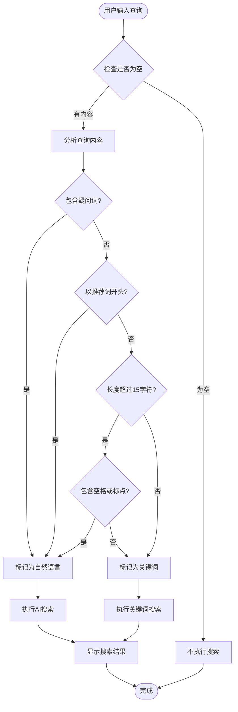

**检测规则实现**：
```typescript
// 检测搜索类型：自然语言问题 vs 关键词
const detectSearchType = (query: string): boolean => {
    // 自然语言特征：
    // 1. 包含疑问词（如何、怎么、为什么、什么是等）
    // 2. 以"找/查/推荐"开头
    // 3. 长度较长且包含空格或标点
    // 4. 包含"?"或"？"
    
    const questionWords = /如何|怎么|为什么|什么是|怎样|哪里|哪个|哪些|吗|呢|？|\?/;
    const recommendWords = /^找|查|推荐|搜索|查找/;
    
    if (questionWords.test(query)) return true;
    if (recommendWords.test(query)) return true;
    if (query.length > 15 && (query.includes(' ') || query.includes('，') || query.includes(','))) return true;
    
    return false;
};
```

### 搜索模式切换机制

**双模式搜索界面**：
```typescript
// 搜索模式标签
<div style={{
    display: 'flex',
    alignItems: 'center',
    gap: '12px',
    marginBottom: '16px'
}}>
    <span style={{
        padding: '4px 12px',
        background: searchMode === 'ai' ? 'rgba(76,175,80,0.15)' : 'rgba(255,215,0,0.15)',
        borderRadius: '6px',
        fontSize: '12px',
        color: searchMode === 'ai' ? '#4CAF50' : '#FFD700',
        fontWeight: 600
    }}>
        {searchMode === 'ai' ? t('wiki.search.ai_answer') : t('wiki.search.keyword')}
    </span>
    {isAiSearching && (
        <span style={{ fontSize: '13px', color: '#666', display: 'flex', alignItems: 'center', gap: '6px' }}>
            <Loader2 size={14} className="spin" style={{ animation: 'spin 1s linear infinite' }} />
            {t('wiki.search.thinking')}
        </span>
    )}
</div>
```

**AI搜索回答区域**：
```typescript
// Bokeh 回答区域
{searchMode === 'ai' && aiAnswer && (
    <div style={{
        background: 'rgba(76,175,80,0.05)',
        border: '1px solid rgba(76,175,80,0.15)',
        borderRadius: '12px',
        padding: '16px',
        marginBottom: '20px'
    }}>
        <div style={{
            display: 'flex',
            alignItems: 'center',
            gap: '8px',
            marginBottom: '12px'
        }}>
            <Sparkles size={16} color="#4CAF50" />
            <span style={{ fontSize: '14px', fontWeight: 600, color: '#4CAF50' }}>
                {t('wiki.search.bokeh_answer')}
            </span>
        </div>
        <div style={{
            fontSize: '14px',
            color: '#ccc',
            lineHeight: '1.7'
        }}>
            <ReactMarkdown 
                remarkPlugins={[remarkGfm]}
                rehypePlugins={[rehypeRaw]}
                components={{
                    a: ({node, ...props}) => (
                        <a {...props} style={{color: '#4CAF50', textDecoration: 'underline'}} target="_blank" rel="noopener noreferrer" />
                    )
                }}
            >
                {aiAnswer}
            </ReactMarkdown>
        </div>
    </div>
)}
```

**章节来源**
- [client/src/components/KinefinityWiki.tsx](file://client/src/components/KinefinityWiki.tsx#L525-L541)
- [client/src/components/KinefinityWiki.tsx](file://client/src/components/KinefinityWiki.tsx#L2416-L2439)
- [client/src/components/KinefinityWiki.tsx](file://client/src/components/KinefinityWiki.tsx#L2441-L2479)

## Bokeh格式化功能

Bokeh格式化功能为Wiki编辑器提供了强大的内容优化能力，支持多种格式化需求。

### 格式化功能架构

```mermaid
graph TB
subgraph "格式化引擎"
Formatter[BokehFormatter<br/>内容格式化器]
Optimizer[内容优化器<br/>/api/v1/knowledge/{id}/bokeh-optimize]
Validator[格式验证器<br/>语法检查]
Preview[格式预览<br/>实时预览]
End
subgraph "优化类型"
Layout[布局优化<br/>排版结构调整]
Images[图片优化<br/>尺寸、格式调整]
Typography[字体优化<br/>样式、颜色调整]
Structure[结构优化<br/>标题层次、段落格式]
End
subgraph "用户界面"
Editor[编辑器界面<br/>实时反馈]
Controls[控制面板<br/>操作按钮]
History[历史记录<br/>变更追踪]
End
Formatter --> Optimizer
Optimizer --> Validator
Validator --> Preview
Layout --> Formatter
Images --> Formatter
Typography --> Formatter
Structure --> Formatter
Editor --> Controls
Controls --> History
```

**格式化请求处理**：
```typescript
// 格式化请求示例
const formatRequest = {
    instruction: "优化排版，调整标题颜色为kine yellow，精简冗余内容",
    currentContent: "# 标题\n\n这是正文内容，需要优化排版格式。",
    options: {
        layout: true,
        images: false,
        typography: true,
        structure: true
    }
};

// 优化响应示例
const formatResponse = {
    optimized_content: "# 标题\n\n这是优化后的正文内容，排版更加清晰。",
    change_summary: "优化了排版格式，调整了标题颜色，精简了冗余内容。",
    response_message: "我已经完成了内容优化。请预览变更后决定是否应用。",
    formatted_content: null // 如果是格式化而非优化，可能返回格式化内容
};
```

### 支持的格式化类型

**布局优化**：
- 标题层级调整
- 段落间距优化
- 对齐方式调整
- 列表格式化

**图片优化**：
- 图片尺寸调整
- 格式转换
- 质量优化
- 响应式适配

**字体优化**：
- 字体颜色调整
- 字体大小优化
- 字体样式统一
- 行高调整

**结构优化**：
- 标题层次规范化
- 段落结构重组
- 列表项格式化
- 引用格式统一

**章节来源**
- [client/src/components/Bokeh/BokehEditorPanel.tsx](file://client/src/components/Bokeh/BokehEditorPanel.tsx#L90-L101)
- [client/src/components/Bokeh/BokehEditorPanel.tsx](file://client/src/components/Bokeh/BokehEditorPanel.tsx#L104-L142)

## 章节聚合与整章阅读

Wiki系统新增了强大的章节聚合功能，支持将同一章节下的多个小节内容进行聚合展示，并提供整章内容的一键阅读体验。

### 章节聚合架构

```mermaid
graph TB
subgraph "章节聚合系统"
ChapterAggregator[章节聚合器]
ChapterTree[章节树结构<br/>buildChapterTree]
ArticleExtractor[文章提取器<br/>parseChapterNumber]
AggregateBuilder[聚合构建器<br/>buildChapterAggregate]
End
subgraph "章节视图"
ChapterView[章节视图<br/>ChapterAggregate]
MainChapter[主章节<br/>chapterView.main_chapter]
SubSections[子章节网格<br/>chapterView.sub_sections]
FullChapter[整章内容<br/>fullChapterContent]
End
subgraph "用户交互"
ChapterButton[章节聚合按钮<br/>handleChapterClick]
FullChapterButton[整章阅读按钮<br/>loadFullChapter]
BackButton[返回按钮<br/>handleBack]
End
ChapterAggregator --> ChapterTree
ChapterTree --> ArticleExtractor
ArticleExtractor --> AggregateBuilder
AggregateBuilder --> ChapterView
ChapterView --> MainChapter
ChapterView --> SubSections
ChapterView --> FullChapter
ChapterButton --> AggregateBuilder
FullChapterButton --> FullChapter
BackButton --> ChapterView
```

**章节树构建算法**：
```typescript
// 构建章节树结构
const buildChapterTree = (articles: KnowledgeArticle[], parentId: string): CategoryNode[] => {
    const chapterMap = new Map<number, { node: CategoryNode, sections: KnowledgeArticle[] }>();

    articles.forEach(article => {
        const { chapter } = parseChapterNumber(article.title);
        if (chapter !== null) {
            if (!chapterMap.has(chapter)) {
                chapterMap.set(chapter, {
                    node: {
                        id: `${parentId}-chapter-${chapter}`,
                        label: `第${chapter}章`,
                        children: [],
                        articles: []
                    },
                    sections: []
                });
            }
            chapterMap.get(chapter)!.sections.push(article);
        }
    });

    const result: CategoryNode[] = [];
    Array.from(chapterMap.entries())
        .sort((a, b) => a[0] - b[0])
        .forEach(([chapterNum, { node, sections }]) => {
            if (sections.length === 1) {
                const { cleanTitle } = parseChapterNumber(sections[0].title);
                node.label = `第${chapterNum}章：${cleanTitle}`;
                node.articles = sections;
                node.children = undefined;
            } else {
                node.articles = sections;
                const chapterArticle = sections.find(s => parseChapterNumber(s.title).section === null);
                const chapterTitle = chapterArticle
                    ? parseChapterNumber(chapterArticle.title).cleanTitle
                    : parseChapterNumber(sections[0].title).cleanTitle;
                node.label = `第${chapterNum}章：${chapterTitle}`;
            }
            result.push(node);
        });

    return result;
};

// 解析章节编号
const parseChapterNumber = (title: string): { chapter: number | null, section: number | null, cleanTitle: string } => {
    const match = title.match(/:\s*(\d+)(?:\.(\d+))?(?:\.\d+)*[.\s]+(.+)/);
    if (match) {
        const chapter = parseInt(match[1]);
        const section = match[2] ? parseInt(match[2]) : null;
        const cleanTitle = match[3].trim();
        return { chapter, section, cleanTitle };
    }
    return { chapter: null, section: null, cleanTitle: title };
};
```

**章节聚合数据结构**：
```typescript
interface ChapterAggregate {
    chapter_number: number;
    main_chapter: {
        id: number;
        title: string;
        slug: string;
        summary: string;
        content_preview?: string;
    } | null;
    sub_sections: Array<{
        id: number;
        title: string;
        slug: string;
        section_number: number;
        summary: string;
        view_count: number;
        helpful_count: number;
    }>;
    total_articles: number;
}
```

### 整章阅读功能

**整章内容加载**：
```typescript
// 加载整章内容
const loadFullChapter = async () => {
    if (!chapterView || !chapterView.main_chapter) return;
    
    const { productLine, productModel } = getProductInfo();
    const chapterNumber = chapterView.chapter_number;
    
    try {
        setLoadingFullChapter(true);
        
        const res = await axios.post('/api/v1/knowledge/chapters/full', {
            product_line: productLine,
            product_model: productModel,
            chapter_number: chapterNumber
        }, {
            headers: { Authorization: `Bearer ${token}` }
        });
        
        if (res.data.success) {
            setFullChapterContent(res.data.data.full_content);
            setShowFullChapter(true);
        }
    } catch (err) {
        console.error('[Wiki] Load full chapter error:', err);
    } finally {
        setLoadingFullChapter(false);
    }
};
```

**整章内容展示**：
```typescript
// 整章内容渲染
{showFullChapter && fullChapterContent && (
    <div style={{
        background: 'rgba(255,255,255,0.02)',
        border: '1px solid rgba(0, 191, 165, 0.2)',
        borderRadius: '16px',
        padding: '32px',
        marginBottom: '32px'
    }}>
        <div className="markdown-content" style={{
            fontSize: '15px',
            lineHeight: '1.8',
            color: '#ccc'
        }}>
            <ReactMarkdown
                remarkPlugins={[remarkGfm]}
                rehypePlugins={[rehypeRaw]}
                components={{
                    h1: ({ node, ...props }) => <h1 style={{ fontSize: '28px', fontWeight: 700, color: '#fff', marginTop: '40px', marginBottom: '16px', borderBottom: '1px solid rgba(255,255,255,0.1)', paddingBottom: '12px' }} {...props} />,
                    h2: ({ node, ...props }) => <h2 style={{ fontSize: '24px', fontWeight: 600, color: '#FFD700', marginTop: '32px', marginBottom: '14px' }} {...props} />,
                    h3: ({ node, ...props }) => <h3 style={{ fontSize: '20px', fontWeight: 600, color: '#00BFA5', marginTop: '24px', marginBottom: '12px' }} {...props} />,
                    h4: ({ node, ...props }) => <h4 style={{ fontSize: '17px', fontWeight: 500, color: '#FFD700', marginTop: '20px', marginBottom: '10px' }} {...props} />,
                    p: ({ node, ...props }) => <p style={{ marginBottom: '16px', lineHeight: '1.8' }} {...props} />,
                    ul: ({ node, ...props }) => <ul style={{ marginLeft: '20px', marginBottom: '16px', listStyleType: 'disc' }} {...props} />,
                    ol: ({ node, ...props }) => <ol style={{ marginLeft: '20px', marginBottom: '16px' }} {...props} />,
                    li: ({ node, ...props }) => <li style={{ marginBottom: '8px', lineHeight: '1.6' }} {...props} />,
                    code: ({ node, inline, ...props }) => inline
                        ? <code style={{ background: 'rgba(255,215,0,0.1)', padding: '2px 6px', borderRadius: '6px', fontSize: '13px', color: '#FFD700' }} {...props} />
                        : <code style={{ display: 'block', background: 'rgba(0,0,0,0.4)', padding: '16px', borderRadius: '10px', overflow: 'auto', fontSize: '13px', marginBottom: '16px', border: '1px solid rgba(255,255,255,0.08)' }} {...props} />,
                    img: ({ node, ...props }) => (
                        
                    ),
                    table: ({ node, ...props }) => (
                        <div style={{ overflowX: 'auto', marginBottom: '20px', borderRadius: '10px', border: '1px solid rgba(255,255,255,0.08)' }}>
                            <table style={{ width: '100%', borderCollapse: 'collapse' }} {...props} />
                        </div>
                    ),
                    th: ({ node, ...props }) => <th style={{ padding: '12px', background: 'rgba(255,255,255,0.03)', borderBottom: '1px solid rgba(255,255,255,0.08)', textAlign: 'left', fontWeight: 600, fontSize: '13px' }} {...props} />,
                    td: ({ node, ...props }) => <td style={{ padding: '12px', borderBottom: '1px solid rgba(255,255,255,0.05)', fontSize: '13px' }} {...props} />,
                    blockquote: ({ node, ...props }) => (
                        <blockquote style={{
                            borderLeft: '3px solid #00BFA5',
                            paddingLeft: '20px',
                            marginLeft: '0',
                            marginBottom: '20px',
                            color: '#999',
                            fontStyle: 'italic'
                        }} {...props} />,
                    ),
                    hr: ({ node, ...props }) => (
                        <hr style={{
                            border: 'none',
                            borderTop: '2px dashed rgba(0, 191, 165, 0.3)',
                            margin: '32px 0'
                        }} {...props} />
                    ),
                }}
            >
                {fullChapterContent}
            </ReactMarkdown>
        </div>
    </div>
)};
```

**章节聚合按钮**：
```typescript
// 章节聚合按钮
{isChapterNode && hasArticles && node.articles && node.articles.length > 1 && (
    <button
        onClick={handleChapterClick}
        style={{
            background: 'rgba(0, 191, 165, 0.1)',
            border: '1px solid rgba(0, 191, 165, 0.3)',
            borderRadius: '6px',
            padding: '4px 8px',
            cursor: 'pointer',
            display: 'flex',
            alignItems: 'center',
            gap: '4px',
            fontSize: '12px',
            color: '#00BFA5'
        }}
    >
        <Layers size={12} />
        聚合章节
    </button>
)}
```

**章节点击处理**：
```typescript
// 章节点击事件
const handleChapterClick = async (e: React.MouseEvent) => {
    e.stopPropagation();
    if (chapterNum === null) return;
    
    const { productLine, productModel } = getProductInfo();
    if (productLine && productModel) {
        await loadChapterAggregate(chapterNum, productLine, productModel);
        setTocVisible(false);
    }
};
```

**章节聚合加载**：
```typescript
// 加载章节聚合数据
const loadChapterAggregate = async (chapterNum: number, productLine: string, productModel: string) => {
    try {
        const res = await axios.get('/api/v1/knowledge/chapters/aggregate', {
            headers: { Authorization: `Bearer ${token}` },
            params: {
                product_line: productLine,
                product_model: productModel,
                chapter_number: chapterNum
            }
        });
        
        if (res.data.success) {
            setChapterView(res.data.data);
            setShowChapterView(true);
        }
    } catch (err) {
        console.error('[Wiki] Load chapter aggregate error:', err);
    }
};
```

**章节视图导航**：
```typescript
// 返回按钮
<button
    onClick={() => {
        setShowChapterView(false);
        setChapterView(null);
    }}
    style={{
        background: 'rgba(255,255,255,0.05)',
        border: '1px solid rgba(255,255,255,0.08)',
        borderRadius: '10px',
        padding: '8px 16px',
        cursor: 'pointer',
        display: 'flex',
        alignItems: 'center',
        gap: '8px',
        marginBottom: '24px',
        transition: 'all 0.2s'
    }}
    onMouseEnter={(e) => {
        e.currentTarget.style.background = 'rgba(255,255,255,0.1)';
    }}
    onMouseLeave={(e) => {
        e.currentTarget.style.background = 'rgba(255,255,255,0.05)';
    }}
>
    <ChevronLeft size={18} color="#999" />
    <span style={{ color: '#999', fontSize: '14px' }}>返回</span>
</button>
```

**章节内容展示**：
```typescript
// 子章节网格展示
<div style={{
    display: 'grid',
    gridTemplateColumns: 'repeat(auto-fill, minmax(280px, 1fr))',
    gap: '16px'
}}>
    {chapterView.sub_sections.map((section) => (
        <div
            key={section.id}
            onClick={() => {
                const article = articles.find(a => a.slug === section.slug);
                if (article) {
                    setShowChapterView(false);
                    handleArticleClick(article);
                }
            }}
            style={{
                background: 'rgba(255,255,255,0.02)',
                border: '1px solid rgba(255,255,255,0.08)',
                borderRadius: '12px',
                padding: '20px',
                cursor: 'pointer',
                transition: 'all 0.2s cubic-bezier(0.4, 0, 0.2, 1)'
            }}
            onMouseEnter={(e) => {
                e.currentTarget.style.background = 'rgba(255,215,0,0.05)';
                e.currentTarget.style.borderColor = 'rgba(255,215,0,0.2)';
                e.currentTarget.style.transform = 'translateY(-2px)';
            }}
            onMouseLeave={(e) => {
                e.currentTarget.style.background = 'rgba(255,255,255,0.02)';
                e.currentTarget.style.borderColor = 'rgba(255,255,255,0.08)';
                e.currentTarget.style.transform = 'translateY(0)';
            }}
        >
            <div style={{
                display: 'flex',
                alignItems: 'center',
                gap: '10px',
                marginBottom: '12px'
            }}>
                <span style={{
                    background: 'rgba(255,215,0,0.15)',
                    color: '#FFD700',
                    padding: '4px 10px',
                    borderRadius: '6px',
                    fontSize: '12px',
                    fontWeight: 600
                }}>
                    {chapterView.chapter_number}.{section.section_number}
                </span>
            </div>

            <h3 style={{
                fontSize: '15px',
                fontWeight: 600,
                color: '#fff',
                marginBottom: '8px',
                lineHeight: '1.4'
            }}>
                {section.title.split(':').pop()?.split('.').slice(1).join('.') || section.title}
            </h3>

            {section.summary && (
                <p style={{
                    fontSize: '13px',
                    color: '#888',
                    lineHeight: '1.5',
                    marginBottom: '12px',
                    display: '-webkit-box',
                    WebkitLineClamp: 3,
                    WebkitBoxOrient: 'vertical',
                    overflow: 'hidden'
                }}>
                    {section.summary}
                </p>
            )}

            <div style={{
                display: 'flex',
                gap: '16px',
                fontSize: '12px',
                color: '#666'
            }}>
                <span>👁 {section.view_count}</span>
                <span>👍 {section.helpful_count}</span>
            </div>
        </div>
    ))}
</div>
```

**章节聚合状态管理**：
```typescript
// 章节聚合状态
const [chapterView, setChapterView] = useState<ChapterAggregate | null>(null);
const [showChapterView, setShowChapterView] = useState(false);
const [fullChapterContent, setFullChapterContent] = useState<string | null>(null);
const [showFullChapter, setShowFullChapter] = useState(false);
const [loadingFullChapter, setLoadingFullChapter] = useState(false);
```

**章节聚合API**：
```typescript
// 章节聚合API
const loadChapterAggregate = async (chapterNum: number, productLine: string, productModel: string) => {
    try {
        const res = await axios.get('/api/v1/knowledge/chapters/aggregate', {
            headers: { Authorization: `Bearer ${token}` },
            params: {
                product_line: productLine,
                product_model: productModel,
                chapter_number: chapterNum
            }
        });
        
        if (res.data.success) {
            setChapterView(res.data.data);
            setShowChapterView(true);
        }
    } catch (err) {
        console.error('[Wiki] Load chapter aggregate error:', err);
    }
};
```

**章节聚合事件处理**：
```typescript
// 监听Bokeh优化事件
useEffect(() => {
    const handleBokehOptimized = async (event: Event) => {
        const customEvent = event as CustomEvent;
        const { articleId } = customEvent.detail;
        console.log('[WIKI] Bokeh optimization completed for article:', articleId);
        
        // 使用ref获取当前文章（避免陈旧闭包）
        const currentArticle = selectedArticleRef.current;
        if (currentArticle && currentArticle.id === articleId) {
            // 从服务器重新加载文章
            try {
                const headers = token ? { Authorization: `Bearer ${token}` } : {};
                const res = await axios.get(`/api/v1/knowledge/${currentArticle.slug}`, { headers });
                if (res.data.success) {
                    setSelectedArticle(res.data.data);
                    selectedArticleRef.current = res.data.data;
                    setViewMode('draft'); // 自动切换到草稿视图
                    console.log('[WIKI] Article reloaded and switched to draft view');
                }
            } catch (err) {
                console.error('[WIKI] Failed to reload article:', err);
            }
        }
    };

    window.addEventListener('bokeh-article-optimized', handleBokehOptimized);
    return () => {
        window.removeEventListener('bokeh-article-optimized', handleBokehOptimized);
    };
}, [token]); // 仅依赖token，不依赖selectedArticle
```

**章节来源**
- [client/src/components/KinefinityWiki.tsx](file://client/src/components/KinefinityWiki.tsx#L187-L196)
- [client/src/components/KinefinityWiki.tsx](file://client/src/components/KinefinityWiki.tsx#L198-L240)
- [client/src/components/KinefinityWiki.tsx](file://client/src/components/KinefinityWiki.tsx#L1107-L1116)
- [client/src/components/KinefinityWiki.tsx](file://client/src/components/KinefinityWiki.tsx#L1790-L1815)
- [client/src/components/KinefinityWiki.tsx](file://client/src/components/KinefinityWiki.tsx#L1886-L1940)
- [client/src/components/KinefinityWiki.tsx](file://client/src/components/KinefinityWiki.tsx#L2016-L2126)

## 工单链接解析系统

Bokeh智能助手新增了强大的工单链接解析功能，能够在聊天消息中自动识别和解析工单链接，并提供工单详情对话框。

### 系统架构

```mermaid
graph TB
subgraph "工单链接解析层"
TicketLink[TicketLink<br/>工单链接组件]
TicketParser[TicketParser<br/>正则表达式解析器]
TicketDetailDialog[TicketDetailDialog<br/>工单详情对话框]
End
subgraph "工单服务层"
InquiryAPI[咨询工单API<br/>/api/v1/inquiry-tickets/:id]
RMAAPI[RMA工单API<br/>/api/v1/rma-tickets/:id]
DealerRepairAPI[经销商维修API<br/>/api/v1/dealer-repairs/:id]
End
subgraph "数据层"
TicketDB[(工单数据库)]
CustomerDB[(客户数据库)]
ProductDB[(产品数据库)]
End
TicketLink --> TicketParser
TicketParser --> TicketDetailDialog
TicketDetailDialog --> InquiryAPI
TicketDetailDialog --> RMAAPI
TicketDetailDialog --> DealerRepairAPI
InquiryAPI --> TicketDB
RMAAPI --> TicketDB
DealerRepairAPI --> TicketDB
TicketDB --> CustomerDB
TicketDB --> ProductDB
```

**图表来源**
- [client/src/components/Bokeh/TicketLink.tsx](file://client/src/components/Bokeh/TicketLink.tsx#L65-L106)
- [client/src/components/Bokeh/TicketDetailDialog.tsx](file://client/src/components/Bokeh/TicketDetailDialog.tsx#L44-L62)

### 核心组件详解

#### TicketLink - 工单链接组件

TicketLink组件负责在聊天消息中渲染可点击的工单链接。

**主要功能**：
- **自动识别**：使用正则表达式识别工单格式 `[K2602-0001|123|inquiry]`
- **样式设计**：绿色背景、圆角边框、悬停效果
- **点击处理**：阻止默认行为，显示工单详情对话框
- **类型标识**：不同工单类型显示不同的图标和颜色

**正则表达式解析**：
```typescript
// 匹配格式: [工单号|工单ID|工单类型]
const ticketPattern = /\[([A-Z0-9-]+)\|(\d+)\|(inquiry|rma|dealer_repair)\]/g;
```

**样式实现**：
```typescript
// 悬停效果
onMouseEnter={(e) => {
    e.currentTarget.style.background = 'rgba(0, 191, 165, 0.2)';
    e.currentTarget.style.textDecoration = 'underline';
}}

// 类型标签
<span style={{ fontSize: '0.85em', opacity: 0.8 }}>{getTypeLabel(ticketType)}</span>
```

**章节来源**
- [client/src/components/Bokeh/TicketLink.tsx](file://client/src/components/Bokeh/TicketLink.tsx#L10-L59)

#### TicketDetailDialog - 工单详情对话框

TicketDetailDialog提供工单详细信息的弹窗显示，支持在系统中直接打开工单。

**主要功能**：
- **动态加载**：根据工单类型调用对应的API
- **详情展示**：显示客户信息、产品信息、问题描述、解决方案等
- **状态管理**：加载状态、错误状态、成功状态
- **系统集成**：提供在工单系统中打开的按钮

**工单类型支持**：
- **咨询工单**：`/api/v1/inquiry-tickets/:id`
- **RMA工单**：`/api/v1/rma-tickets/:id`
- **经销商维修单**：`/api/v1/dealer-repairs/:id`

**详情信息展示**：
```typescript
// 客户信息
{ticket.customer_name && (
    <InfoRow icon={<User size={16} />} label="客户" value={ticket.customer_name} />
)}

// 产品信息
{ticket.product_model && (
    <InfoRow
        icon={<Package size={16} />}
        label="产品"
        value={`${ticket.product_model}${ticket.serial_number ? ` (SN: ${ticket.serial_number})` : ''}`}
    />
)}

// 问题描述
<div style={{
    background: 'rgba(255,255,255,0.05)',
    borderRadius: '8px',
    padding: '12px',
    borderLeft: '3px solid #00BFA5'
}}>
    <div style={{ fontSize: '12px', color: 'rgba(255,255,255,0.6)', marginBottom: '8px', display: 'flex', alignItems: 'center', gap: '6px' }}>
        <FileText size={14} />
        问题描述
    </div>
    <div style={{ fontSize: '14px', color: 'white', lineHeight: '1.6' }}>
        {ticket.problem_summary || ticket.problem_description || '暂无'}
    </div>
</div>
```

**章节来源**
- [client/src/components/Bokeh/TicketDetailDialog.tsx](file://client/src/components/Bokeh/TicketDetailDialog.tsx#L14-L284)

### 工单链接解析流程

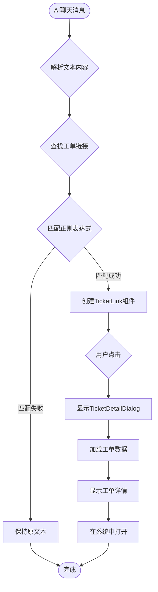

**图表来源**
- [client/src/components/Bokeh/BokehPanel.tsx](file://client/src/components/Bokeh/BokehPanel.tsx#L148-L155)

**章节来源**
- [client/src/components/Bokeh/BokehPanel.tsx](file://client/src/components/Bokeh/BokehPanel.tsx#L54-L61)

## AI搜索和索引管理

Bokeh智能助手新增了完整的AI搜索和索引管理功能，支持历史工单的全文检索和权限隔离。

### 系统架构

```mermaid
graph TB
subgraph "AI搜索层"
BokehSearchAPI[BokehSearchAPI<br/>/api/v1/bokeh/search-tickets]
TicketIndexAPI[TicketIndexAPI<br/>/api/v1/internal/tickets/index]
BatchIndexAPI[BatchIndexAPI<br/>/api/v1/internal/tickets/batch-index]
End
subgraph "搜索索引层"
TicketSearchIndex[TicketSearchIndex<br/>ticket_search_index表]
TicketSearchFTS[TicketSearchFTS<br/>ticket_search_fts虚拟表]
TicketViews[TicketViews<br/>v_inquiry_tickets_ready_for_index等]
End
subgraph "权限控制层"
RoleFilter[角色过滤器<br/>Dealer/内部用户]
VisibilityFilter[可见性过滤器<br/>internal/dealer/public]
End
subgraph "AI集成层"
AIService[AIService<br/>AI摘要生成]
End
TicketSearchIndex --> TicketSearchFTS
TicketSearchIndex --> TicketViews
BokehSearchAPI --> RoleFilter
BokehSearchAPI --> VisibilityFilter
BokehSearchAPI --> AIService
AIService --> TicketSearchIndex
```

**图表来源**
- [server/service/routes/bokeh.js](file://server/service/routes/bokeh.js#L14-L145)
- [server/service/migrations/011_ticket_search_index.sql](file://server/service/migrations/011_ticket_search_index.sql#L52-L80)

### 核心组件详解

#### BokehSearchAPI - 工单搜索API

BokehSearchAPI提供历史工单的全文搜索功能，支持权限过滤和AI摘要生成。

**主要功能**：
- **全文搜索**：基于FTS5的全文检索
- **权限过滤**：根据用户角色和可见性过滤
- **AI摘要**：基于搜索结果生成AI摘要
- **多条件筛选**：产品型号、分类、日期范围等

**搜索查询构建**：
```typescript
// 权限过滤条件
let whereConditions = ['tsi.closed_at IS NOT NULL']; // 仅搜索已关闭工单
let params = {};

// 角色权限
if (user.department === 'Dealer') {
    whereConditions.push('tsi.dealer_id = @dealer_id');
    params.dealer_id = user.dealer_id;
}

// 可选筛选器
if (filters.product_model) {
    whereConditions.push('tsi.product_model LIKE @product_model');
    params.product_model = `%${filters.product_model}%`;
}

// FTS5全文搜索
const searchQuery = `
    SELECT 
        tsi.id, tsi.ticket_number, tsi.ticket_type, tsi.ticket_id,
        tsi.title, tsi.description, tsi.resolution, tsi.product_model,
        tsi.serial_number, tsi.category, tsi.status, tsi.closed_at,
        tsi.customer_id, fts.rank
    FROM ticket_search_index tsi
    INNER JOIN ticket_search_fts fts ON tsi.id = fts.rowid
    WHERE fts MATCH @query AND ${whereClause}
    ORDER BY fts.rank
    LIMIT @limit
`;
```

**AI摘要生成**：
```typescript
// 基于搜索结果生成AI摘要
const summaryPrompt = `Based on the following historical tickets, provide a brief helpful answer to: "${query}"

Tickets:
${context}

Answer in Chinese, be concise and cite ticket numbers.`;

aiSummary = await aiService.generate('chat',
    'You are Bokeh, Kinefinity service assistant. Provide helpful summaries.',
    summaryPrompt
);
```

**章节来源**
- [server/service/routes/bokeh.js](file://server/service/routes/bokeh.js#L14-L145)

#### TicketIndexAPI - 工单索引API

TicketIndexAPI负责将已关闭的工单数据索引到搜索表中，支持单个和批量索引。

**主要功能**：
- **自动索引**：工单关闭时自动索引
- **手动索引**：支持手动触发索引
- **批量索引**：管理员批量索引所有工单
- **内容提取**：从不同工单类型提取相关内容

**索引内容提取**：
```typescript
// 不同工单类型的内容提取
if (ticket_type === 'inquiry') {
    title = ticketData.problem_summary;
    description = [ticketData.communication_log].filter(Boolean).join('\n');
    resolution = ticketData.resolution;
    product_model = ticketData.product_id ?
        db.prepare('SELECT model_name FROM products WHERE id = ?').get(ticketData.product_id)?.model_name : null;
    serial_number = ticketData.serial_number;
    closed_at = ticketData.resolved_at;
} else if (ticket_type === 'rma') {
    title = ticketData.problem_description?.substring(0, 100) || 'RMA维修';
    description = [
        ticketData.problem_description,
        ticketData.problem_analysis,
        ticketData.solution_for_customer
    ].filter(Boolean).join('\n');
    resolution = ticketData.repair_content;
    category = ticketData.issue_category;
    closed_at = ticketData.completed_date;
} else { // dealer_repair
    title = ticketData.problem_description?.substring(0, 100) || '经销商维修';
    description = ticketData.problem_description;
    resolution = ticketData.repair_content;
    category = ticketData.issue_category;
    closed_at = ticketData.updated_at;
}
```

**可见性控制**：
```typescript
// 确定可见性级别
let visibility = 'internal';
if (ticketData.dealer_id) {
    visibility = 'dealer';
}
```

**章节来源**
- [server/service/routes/bokeh.js](file://server/service/routes/bokeh.js#L147-L354)

#### 数据库索引设计

系统使用SQLite的FTS5虚拟表实现全文搜索，支持高效的历史工单检索。

**索引表结构**：
```sql
-- 工单搜索索引表
CREATE TABLE IF NOT EXISTS ticket_search_index (
    id INTEGER PRIMARY KEY AUTOINCREMENT,
    ticket_type TEXT NOT NULL,  -- 'inquiry', 'rma', 'dealer_repair'
    ticket_id INTEGER NOT NULL,
    ticket_number TEXT NOT NULL,
    
    -- 可搜索内容摘要
    title TEXT NOT NULL,  -- 问题摘要/标题
    description TEXT,  -- 问题描述 + 通信日志
    resolution TEXT,  -- 解决方案/解决内容
    tags TEXT,  -- JSON数组的标签/关键词
    
    -- 元数据过滤
    product_model TEXT,
    serial_number TEXT,
    category TEXT,  -- 问题分类
    status TEXT,  -- 当前状态
    
    -- 权限控制
    dealer_id INTEGER,  -- NULL = 内部/直客工单
    customer_id INTEGER,
    visibility TEXT DEFAULT 'internal',  -- 'internal', 'dealer', 'public'
    
    -- 时间线
    closed_at TEXT,  -- 仅索引已关闭工单
    created_at TEXT DEFAULT CURRENT_TIMESTAMP,
    updated_at TEXT DEFAULT CURRENT_TIMESTAMP,
    
    FOREIGN KEY(dealer_id) REFERENCES dealers(id),
    FOREIGN KEY(customer_id) REFERENCES customers(id)
);
```

**全文搜索虚拟表**：
```sql
-- FTS5虚拟表用于全文搜索
CREATE VIRTUAL TABLE IF NOT EXISTS ticket_search_fts USING fts5(
    title, description, resolution, tags,
    content='ticket_search_index',
    content_rowid='id'
);

-- 同步触发器
CREATE TRIGGER IF NOT EXISTS ticket_search_ai AFTER INSERT ON ticket_search_index BEGIN
    INSERT INTO ticket_search_fts(rowid, title, description, resolution, tags)
    VALUES (new.id, new.title, new.description, new.resolution, new.tags);
END;
```

**章节来源**
- [server/service/migrations/011_ticket_search_index.sql](file://server/service/migrations/011_ticket_search_index.sql#L8-L80)

### 搜索和索引流程

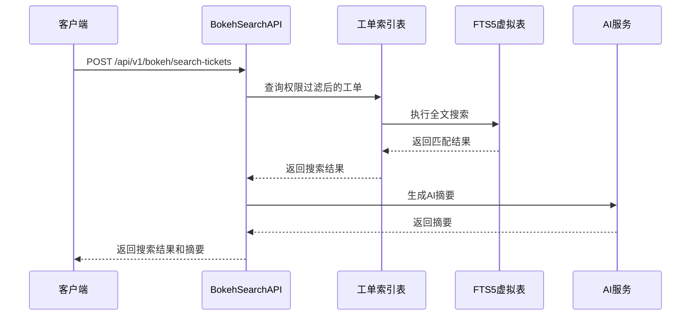

**图表来源**
- [server/service/routes/bokeh.js](file://server/service/routes/bokeh.js#L58-L140)

**章节来源**
- [server/service/routes/bokeh.js](file://server/service/routes/bokeh.js#L14-L145)

## 并发搜索与关键词提取

**新增** 系统实现了全新的并发搜索模式和智能关键词提取功能，显著提升了搜索响应速度和用户体验。

### 并发搜索架构

```mermaid
graph TB
subgraph "并发搜索引擎"
ConcurrentSearch[并发搜索器]
KeywordSearch[关键词搜索<br/>/api/v1/knowledge]
AISearch[AI搜索<br/>/api/ai/chat]
PromiseAll[Promise.all<br/>并行执行]
End
subgraph "搜索结果处理"
KeywordResults[关键词搜索结果]
AIResults[AI搜索结果]
CombinedResults[合并结果]
End
subgraph "用户界面"
KeywordPanel[关键词面板<br/>显示关键词]
AIPanel[AI面板<br/>显示Bokeh回答]
TogglePanel[面板切换<br/>折叠/展开]
End
ConcurrentSearch --> KeywordSearch
ConcurrentSearch --> AISearch
ConcurrentSearch --> PromiseAll
PromiseAll --> KeywordResults
PromiseAll --> AIResults
KeywordResults --> CombinedResults
AIResults --> CombinedResults
CombinedResults --> KeywordPanel
CombinedResults --> AIPanel
AIPanel --> TogglePanel
```

**图表来源**
- [client/src/components/KinefinityWiki.tsx](file://client/src/components/KinefinityWiki.tsx#L548-L552)

### 关键词提取算法

系统实现了智能的关键词提取功能，能够从用户查询中提取出最有价值的技术关键词：

**关键词提取流程**：
```mermaid
flowchart TD
Start([用户查询]) --> Clean[清理查询]
Clean --> ExtractTech[提取技术术语]
ExtractTech --> ExtractEng[提取英文单词]
ExtractEng --> ExtractStop[移除停用词]
ExtractStop --> PriorityCheck{检查技术术语优先级}
PriorityCheck --> |有技术术语| UseTech[使用技术术语]
PriorityCheck --> |无技术术语| CheckEng{检查英文单词}
CheckEng --> |有英文单词| UseEng[使用英文单词]
CheckEng --> |无英文单词| UseCleaned[使用清理后的查询]
UseTech --> End([返回关键词])
UseEng --> End
UseCleaned --> End
```

**关键词提取实现**：
```typescript
const extractKeywords = (query: string): string => {
    // 1. 清理查询：移除多余空格和特殊字符
    let cleaned = query.trim().replace(/[^\w\s\u4e00-\u9fa5]/g, ' ');
    
    // 2. 提取技术术语（优先级最高）
    const technicalTerms = [];
    const techPatterns = [
        /\b(?:SDI|HDMI|USB|SATA|NVMe|WiFi|蓝牙|GSM|5G)\b/gi,
        /\b(?:Edge|Pro|Max|Ultra|Plus|Mini|Nano)\b/gi,
        /\b(?:4K|8K|HDR|OLED|QLED|AMOLED)\b/gi,
        /\b(?:处理器|芯片|显卡|内存|硬盘|SSD|HDD)\b/gi,
        /\b(?:录制|播放|显示|传输|连接|兼容)\b/gi
    ];
    
    techPatterns.forEach(pattern => {
        const matches = cleaned.match(pattern);
        if (matches) {
            technicalTerms.push(...matches);
        }
    });
    
    // 3. 提取英文单词
    const englishWords = cleaned.match(/\b[a-zA-Z]{2,}\b/g) || [];
    
    // 4. 移除停用词
    const stopWords = /\b(吗|呢|的|是|这|那|什么|如何|为什么)\b/g;
    let filtered = cleaned.replace(stopWords, ' ').trim();
    
    // 5. 如果提取到了技术术语，优先使用技术术语
    if (technicalTerms.length > 0) {
        // 去重并保持顺序
        const uniqueTerms = [...new Set(technicalTerms)];
        return uniqueTerms.join(' ');
    }
    
    // 6. 如果有英文单词，使用英文单词
    const meaningfulEnglish = englishWords.filter(w => w.length > 1 && !['吗', '呢', '的', '是'].includes(w));
    if (meaningfulEnglish.length > 0) {
        return meaningfulEnglish.join(' ');
    }
    
    // 7. 返回清理后的查询或原始查询的前20个字符
    return cleaned || query.slice(0, 20);
};
```

**并发搜索实现**：
```typescript
// 并发执行搜索
useEffect(() => {
    if (!pendingSearchQuery.trim()) {
        return;
    }
    
    const query = pendingSearchQuery.trim();
    
    // 1. 提取关键词用于显示
    const keywords = extractKeywords(query);
    setExtractedKeywords(keywords);
    
    const doSearch = async () => {
        try {
            setIsSearching(true);
            setIsSearchMode(true); // 尽早设置搜索模式
            setShowKeywordPanel(true);
            setShowAiPanel(true);
            
            // 2. 并行执行关键词搜索和AI搜索
            await Promise.all([
                performKeywordSearch(query),
                performAiSearch(query)
            ]);
        } catch (err) {
            console.error('[Wiki] Search error:', err);
        } finally {
            setIsSearching(false);
            setIsAiSearching(false);
        }
    };
    
    doSearch();
}, [pendingSearchQuery, token]);
```

### 搜索结果面板

**关键词面板**：
```typescript
// 关键词面板
{showKeywordPanel && (
    <div style={{
        background: 'rgba(255,215,0,0.05)',
        border: '1px solid rgba(255,215,0,0.15)',
        borderRadius: '12px',
        padding: '16px',
        marginBottom: '20px'
    }}>
        <div style={{
            display: 'flex',
            alignItems: 'center',
            gap: '8px',
            marginBottom: '12px'
        }}>
            <Search size={16} color="#FFD700" />
            <span style={{ fontSize: '14px', fontWeight: 600, color: '#FFD700' }}>
                关键词搜索结果
            </span>
            <button
                onClick={() => setShowKeywordPanel(false)}
                style={{
                    marginLeft: 'auto',
                    background: 'none',
                    border: 'none',
                    color: '#666',
                    cursor: 'pointer'
                }}
            >
                <X size={16} />
            </button>
        </div>
        <div style={{ fontSize: '14px', color: '#ccc' }}>
            提取关键词：{extractedKeywords}
        </div>
    </div>
)}
```

**AI搜索面板**：
```typescript
// AI搜索面板
{showAiPanel && (
    <div style={{
        background: 'rgba(76,175,80,0.05)',
        border: '1px solid rgba(76,175,80,0.15)',
        borderRadius: '12px',
        padding: '16px',
        marginBottom: '20px'
    }}>
        <div style={{
            display: 'flex',
            alignItems: 'center',
            gap: '8px',
            marginBottom: '12px'
        }}>
            <Sparkles size={16} color="#4CAF50" />
            <span style={{ fontSize: '14px', fontWeight: 600, color: '#4CAF50' }}>
                Bokeh AI回答
            </span>
            <button
                onClick={() => setShowAiPanel(false)}
                style={{
                    marginLeft: 'auto',
                    background: 'none',
                    border: 'none',
                    color: '#666',
                    cursor: 'pointer'
                }}
            >
                <X size={16} />
            </button>
        </div>
        <div style={{
            fontSize: '14px',
            color: '#ccc',
            lineHeight: '1.7'
        }}>
            {isAiSearching ? (
                <div style={{ display: 'flex', alignItems: 'center', gap: '8px' }}>
                    <Loader2 size={14} className="spin" />
                    正在思考中...
                </div>
            ) : aiAnswer ? (
                <ReactMarkdown
                    remarkPlugins={[remarkGfm]}
                    rehypePlugins={[rehypeRaw]}
                    components={{
                        a: ({node, ...props}) => (
                            <a {...props} style={{color: '#4CAF50', textDecoration: 'underline'}} target="_blank" rel="noopener noreferrer" />
                        )
                    }}
                >
                    {aiAnswer}
                </ReactMarkdown>
            ) : (
                <span style={{ color: '#666' }}>暂无AI回答</span>
            )}
        </div>
    </div>
)}
```

**面板切换功能**：
```typescript
// 面板折叠/展开
<button
    onClick={() => {
        // 折叠/展开 AI Panel
        setShowAiPanel(!showAiPanel);
    }}
    style={{
        width: '28px',
        height: '28px',
        display: 'flex',
        alignItems: 'center',
        justifyContent: 'center',
        background: 'rgba(255,255,255,0.05)',
        border: '1px solid rgba(255,255,255,0.1)',
        borderRadius: '14px',
        cursor: 'pointer',
        marginLeft: '8px'
    }}
>
    <ChevronDown 
        size={14} 
        color="#999" 
        style={{
            transform: showAiPanel ? 'rotate(180deg)' : 'rotate(0deg)',
            transition: 'transform 0.2s ease'
        }}
    />
</button>
```

**章节来源**
- [client/src/components/KinefinityWiki.tsx](file://client/src/components/KinefinityWiki.tsx#L530-L562)
- [client/src/components/KinefinityWiki.tsx](file://client/src/components/KinefinityWiki.tsx#L600-L629)
- [client/src/components/KinefinityWiki.tsx](file://client/src/components/KinefinityWiki.tsx#L631-L646)
- [client/src/components/KinefinityWiki.tsx](file://client/src/components/KinefinityWiki.tsx#L2704-L2722)

### AI搜索增强

**并行AI搜索实现**：
```typescript
// 并行获取知识库文章和工单
const [articleRes, ticketRes] = await Promise.all([
    axios.get('/api/v1/knowledge', {
        headers,
        params: { search: query, page_size: 10 }
    }),
    axios.post('/api/v1/bokeh/search-tickets', {
        query,
        filters: { product_model: '', category: '', status: 'closed' }
    }, { headers })
]);

// 合并搜索结果
const combinedResults = {
    knowledgeArticles: articleRes.data.data || [],
    historicalTickets: ticketRes.data.data || [],
    extractedKeywords: extractedKeywords
};
```

**AI搜索意图检测**：
```typescript
// 检测是否需要工单搜索
const needsTicketSearch = aiService._detectTicketSearchIntent(query);
if (needsTicketSearch) {
    // 执行工单搜索
    const ticketRes = await axios.post('/api/v1/bokeh/search-tickets', {
        query,
        filters: { product_model: '', category: '', status: 'closed' }
    }, { headers });
}
```

**章节来源**
- [server/service/ai_service.js](file://server/service/ai_service.js#L345-L374)
- [server/service/routes/bokeh.js](file://server/service/routes/bokeh.js#L96-L107)

## 视觉样式优化

**更新** 本节详细说明Bokeh编辑器面板和球体组件的视觉样式优化变更，从紫色渐变更新为青色到淡紫色渐变，增强了UI视觉一致性。

### 青色到淡紫色渐变主题

系统采用了统一的青色到淡紫色渐变主题，为所有Bokeh相关组件提供一致的视觉风格：

**渐变色定义**：
- **主色调**：青色 (#00BFA5) - 代表专业和科技感
- **辅色调**：淡紫色 (#8E24AA) - 代表创意和优雅
- **渐变方向**：135deg 对角线渐变
- **透明度控制**：根据组件状态动态调整透明度

### BokehOrb - 悬浮球组件视觉优化

**渐变背景配置**：
```typescript
// 青色到淡紫色径向渐变
background: 'radial-gradient(circle at center, rgba(0, 191, 165, 0.35) 0%, rgba(142, 36, 170, 0.65) 100%)'

// 阴影效果
boxShadow: '0 0 24px rgba(142, 36, 170, 0.5), 0 0 12px rgba(0, 191, 165, 0.3)'

// 边框样式
border: '1px solid rgba(0, 191, 165, 0.4)'
```

**动画效果增强**：
- **脉冲动画**：使用青色和淡紫色的交替阴影
- **缩放效果**：悬停时1.1倍放大，点击时0.95倍按压
- **毛玻璃效果**：backdropFilter: 'blur(8px)' 提供现代感

**核心元素设计**：
- **灵动核心**：白色中心点，带有发光效果
- **外层晕染**：青色到淡紫色的渐变外环
- **工具提示**：半透明背景，白色文字

### BokehEditorPanel - 编辑器面板视觉优化

**按钮渐变配置**：
```typescript
// 展开状态渐变
background: 'linear-gradient(135deg, #00BFA5, #8E24AA)'

// 未展开状态半透明
background: 'rgba(0, 191, 165, 0.15)'

// 边框样式
border: '1px solid rgba(0, 191, 165, 0.4)'
```

**面板视觉设计**：
- **背景**：深色半透明背景 (rgba(30, 30, 35, 0.98))
- **边框**：青色透明边框 (rgba(0, 191, 165, 0.3))
- **阴影**：向上的阴影效果 (0 -4px 24px rgba(0,0,0,0.4))
- **圆角**：12px 圆角边框

**交互状态样式**：
- **悬停状态**：颜色从青色变为白色
- **禁用状态**：半透明背景，降低不透明度
- **加载状态**：旋转动画，保持渐变效果

### BokehPanel - 聊天面板视觉优化

**头部装饰配置**：
```typescript
// 头部装饰圆点渐变
background: 'linear-gradient(135deg, #00BFA5, #8E24AA)'
boxShadow: '0 0 10px rgba(142, 36, 170, 0.5)'
```

**欢迎消息视觉**：
```typescript
// 欢迎消息圆形背景渐变
background: 'linear-gradient(135deg, rgba(0, 191, 165, 0.2), rgba(142, 36, 170, 0.2))'
```

**上下文横幅渐变**：
```typescript
// 根据上下文类型动态渐变
background: `linear-gradient(135deg, ${banner.color}15, ${banner.color}08)`
border: `1px solid ${banner.color}30`
```

### Wiki编辑器优化下拉菜单

**下拉菜单视觉优化**：
```typescript
// 下拉菜单按钮渐变
background: isOptimizing 
    ? 'rgba(0, 191, 165, 0.1)' 
    : 'linear-gradient(135deg, #00BFA5 0%, #8E24AA 100%)'

// 阴影效果
boxShadow: isOptimizing ? 'none' : '0 0 12px rgba(0, 191, 165, 0.3)'
```

**选项面板设计**：
- **背景**：深色半透明背景
- **边框**：白色透明边框
- **圆角**：8px 圆角
- **阴影**：向下的阴影效果

### 视觉一致性原则

**色彩体系**：
- **主色**：#00BFA5 (青色)
- **辅色**：#8E24AA (淡紫色)
- **中性色**：深色背景 (#1C1C1E, #000000)
- **高亮色**：白色 (#FFFFFF)

**渐变应用原则**：
- **按钮**：使用135deg对角线渐变
- **装饰**：使用圆形径向渐变
- **背景**：使用半透明渐变
- **边框**：使用透明边框

**动画过渡**：
- **渐变过渡**：0.2秒平滑过渡
- **缩放动画**：0.15秒弹性动画
- **阴影变化**：0.4秒缓动动画

**章节来源**
- [client/src/components/Bokeh/BokehOrb.tsx](file://client/src/components/Bokeh/BokehOrb.tsx#L23-L27)
- [client/src/components/Bokeh/BokehEditorPanel.tsx](file://client/src/components/Bokeh/BokehEditorPanel.tsx#L257-L269)
- [client/src/components/Bokeh/BokehPanel.tsx](file://client/src/components/Bokeh/BokehPanel.tsx#L289-L291)
- [client/src/components/Knowledge/WikiEditorModal.tsx](file://client/src/components/Knowledge/WikiEditorModal.tsx#L464-L476)

## 依赖分析

### 前端依赖关系

```mermaid
graph LR
subgraph "React生态"
React[react@19.2.0]
Router[react-router-dom@7.11.0]
Hooks[react hooks]
Bokeh[Bokeh组件]
Wiki[KinefinityWiki]
BokehEditor[Bokeh编辑器面板]
TicketDetail[工单详情对话框]
TicketLink[工单链接解析]
End
subgraph "UI框架"
Tailwind[tailwindcss]
Motion[framer-motion@12]
Icons[lucide-react@0.562]
Markdown[react-markdown]
Remark[remark-gfm]
Rehype[rehype-raw]
End
subgraph "状态管理"
Zustand[zustand@5.0.9]
SWR[swr@2.3.8]
End
subgraph "工具库"
Axios[axios@1.13.2]
DateFns[date-fns@4.1.0]
XLSX[xlsx@0.18.5]
End
subgraph "Bokeh特有依赖"
Framer[Framer Motion]
Lucide[Lucide Icons]
End
React --> Router
React --> Hooks
React --> Zustand
Zustand --> SWR
React --> Tailwind
React --> Motion
React --> Icons
React --> Axios
React --> DateFns
React --> XLSX
React --> Markdown
React --> Remark
React --> Rehype
Bokeh --> Framer
Bokeh --> Lucide
TicketDetail --> Axios
TicketLink --> Axios
Wiki --> Markdown
Wiki --> Rehype
BokehEditor --> Axios
```

**图表来源**
- [client/package.json](file://client/package.json#L12-L29)

### 后端依赖关系

```mermaid
graph LR
subgraph "核心框架"
Express[express@5.2.1]
BetterSqlite[better-sqlite3@12.5]
JWT[jsonwebtoken@9.0.3]
End
subgraph "文件处理"
Sharp[sharp@0.34.5]
Multer[multer@2.0.2]
Archiver[archiver@7.0.1]
End
subgraph "安全认证"
Bcrypt[bcryptjs@3.0.3]
CORS[cors@2.8.5]
Compression[compression@1.7.4]
End
subgraph "AI服务"
OpenAI[openai@^4.0.0]
End
subgraph "Bokeh特有依赖"
AIService[AIService类]
Settings[系统设置]
BokehAPI[Bokeh API路由]
TicketIndex[工单索引管理]
WikiSvc[知识库服务]
ContextMgr[上下文管理器]
End
Express --> BetterSqlite
Express --> JWT
Express --> Bcrypt
Express --> CORS
Express --> Compression
Express --> Multer
Express --> Sharp
Express --> Archiver
Express --> OpenAI
AIService --> OpenAI
Settings --> AIService
BokehAPI --> TicketIndex
TicketIndex --> BetterSqlite
WikiSvc --> BetterSqlite
ContextMgr --> WikiSvc
```

**图表来源**
- [server/package.json](file://server/package.json#L15-L29)

### 移动端依赖关系

```mermaid
graph LR
subgraph "SwiftUI生态"
SwiftUI[SwiftUI]
Combine[Combine]
Foundation[Foundation]
End
subgraph "网络层"
URLSession[URLSession]
Codable[Codable]
End
subgraph "存储层"
FileManager[FileManager]
UserDefaults[UserDefaults]
End
subgraph "多媒体"
AVKit[AVKit]
Photos[Photos]
End
SwiftUI --> URLSession
SwiftUI --> FileManager
SwiftUI --> AVKit
Foundation --> Codable
Foundation --> UserDefaults
```

**图表来源**
- [ios/LonghornApp/LonghornApp.swift](file://ios/LonghornApp/LonghornApp.swift#L9-L25)

**章节来源**
- [client/package.json](file://client/package.json#L1-L46)
- [server/package.json](file://server/package.json#L1-L31)

## 性能考虑

### 前端性能优化

1. **懒加载策略**：使用React.lazy和Suspense实现组件懒加载
2. **状态缓存**：Zustand提供高效的全局状态管理
3. **虚拟滚动**：大数据量文件列表使用虚拟滚动优化渲染性能
4. **图片优化**：WebP格式缩略图，按需加载和缓存机制
5. **动画优化**：Framer Motion的硬件加速动画，避免重排重绘
6. **内存管理**：Bokeh组件的生命周期管理，及时清理事件监听器
7. **工单链接解析优化**：使用高效的正则表达式和组件复用
8. **对话框延迟加载**：工单详情对话框按需加载，减少初始渲染负担
9. **搜索模式检测优化**：智能检测算法避免不必要的API调用
10. **章节聚合缓存**：章节聚合数据缓存，减少重复请求
11. **编辑器优化防抖**：AI内容优化请求防抖处理，避免频繁调用
12. **并发搜索优化**：Promise.all并行执行，显著提升响应速度
13. **关键词提取缓存**：提取的关键词缓存，避免重复计算
14. **面板状态管理**：关键词面板和AI面板的独立状态管理
15. **渐变色优化**：CSS渐变替代图片，减少HTTP请求和内存占用

### 后端性能优化

1. **数据库优化**：SQLite WAL模式，合理的索引设计
2. **文件缓存**：缩略图和预览图的本地缓存
3. **并发处理**：视频转码使用异步队列处理
4. **内存管理**：及时释放文件句柄和数据库连接
5. **AI服务优化**：AI使用统计和成本控制
6. **API缓存**：重复请求的缓存机制
7. **全文搜索优化**：FTS5虚拟表提供高效的全文检索
8. **权限过滤优化**：数据库层面的权限过滤，减少应用层处理
9. **搜索结果缓存**：热门搜索结果缓存，提升响应速度
10. **章节聚合优化**：批量查询优化，减少数据库往返次数
11. **并发搜索优化**：并行查询优化，减少总体响应时间
12. **关键词提取优化**：正则表达式预编译，提升提取性能

### 移动端性能优化

1. **预览缓存**：本地缓存预览图减少网络请求
2. **轮询机制**：前台5秒轮询，后台休眠
3. **手势优化**：自定义手势识别提高用户体验
4. **内存控制**：及时释放大文件内存占用

## 故障排除指南

### 常见问题诊断

#### 认证相关问题

```mermaid
flowchart TD
AuthIssue[认证失败] --> CheckToken{检查令牌}
CheckToken --> |过期| Refresh[刷新令牌]
CheckToken --> |无效| ReLogin[重新登录]
Refresh --> Success{刷新成功?}
Success --> |是| Continue[继续操作]
Success --> |否| ReLogin
Continue --> End[问题解决]
ReLogin --> End
```

#### 文件访问问题

```mermaid
flowchart TD
FileIssue[文件访问失败] --> CheckPerm{检查权限}
CheckPerm --> |无权限| FixPerm[修复权限]
CheckPerm --> |有权限| CheckPath{检查路径}
CheckPath --> |路径错误| FixPath[修正路径]
CheckPath --> |路径正确| CheckExist{文件存在?}
CheckExist --> |不存在| Restore[恢复文件]
CheckExist --> |存在| CheckSize{检查文件大小}
CheckSize --> |过大| Optimize[优化文件]
CheckSize --> |正常| CheckFormat{检查格式}
CheckFormat --> |不支持| Convert[转换格式]
CheckFormat --> |支持| FixPerm
```

#### Bokeh聊天界面问题

```mermaid
flowchart TD
ChatIssue[聊天界面问题] --> CheckAuth{检查认证状态}
CheckAuth --> |未登录| Login[用户登录]
CheckAuth --> |已登录| CheckAI{检查AI服务}
CheckAI --> |AI服务不可用| ConfigAI[配置AI服务]
CheckAI --> |AI服务正常| CheckNetwork{检查网络连接}
CheckNetwork --> |网络问题| FixNetwork[修复网络]
CheckNetwork --> |网络正常| ClearCache[清除缓存]
Login --> Retry[重试操作]
ConfigAI --> Retry
FixNetwork --> Retry
ClearCache --> Retry
Retry --> Success[问题解决]
```

#### Wiki集成问题

```mermaid
flowchart TD
WikiIssue[Wiki集成问题] --> CheckContext{检查上下文状态}
CheckContext --> |上下文丢失| ResetContext[重置上下文]
CheckContext --> |上下文正常| CheckSearch{检查搜索模式}
CheckSearch --> |搜索模式错误| FixSearch[修复搜索模式]
CheckSearch --> |搜索模式正确| CheckFormat{检查格式化功能}
CheckFormat --> |格式化失败| DebugFormat[调试格式化]
CheckFormat --> |格式化正常| CheckChapter{检查章节聚合}
CheckChapter --> |章节聚合失败| DebugChapter[调试章节聚合]
CheckChapter --> |章节聚合正常| CheckConcurrency{检查并发搜索}
CheckConcurrency --> |并发搜索失败| DebugConcurrency[调试并发搜索]
CheckConcurrency --> |并发搜索正常| FixContext
FixSearch --> FixContext
DebugFormat --> FixContext
DebugChapter --> FixContext
DebugConcurrency --> FixContext
FixContext --> Retry[重试操作]
Retry --> Success[问题解决]
```

#### 工单链接解析问题

```mermaid
flowchart TD
TicketIssue[工单链接问题] --> CheckFormat{检查链接格式}
CheckFormat --> |格式正确| CheckAPI{检查API可用性}
CheckFormat --> |格式错误| FixFormat[修复链接格式]
CheckAPI --> |API不可用| ConfigAPI[配置API]
CheckAPI --> |API可用| CheckAuth{检查权限}
CheckAuth --> |权限不足| FixAuth[修复权限]
CheckAuth --> |权限充足| CheckData{检查工单数据}
CheckData --> |数据缺失| LogError[记录错误日志]
CheckData --> |数据完整| ShowDialog[显示对话框]
FixFormat --> Retry[重试操作]
ConfigAPI --> Retry
FixAuth --> Retry
LogError --> End[问题解决]
ShowDialog --> End
Retry --> End
```

#### 并发搜索问题

```mermaid
flowchart TD
ConcurrencyIssue[并发搜索问题] --> CheckPromise{检查Promise.all}
CheckPromise --> |Promise.all失败| HandleError[处理错误]
CheckPromise --> |Promise.all成功| CheckResults{检查搜索结果}
CheckResults --> |关键词搜索失败| DebugKeyword[调试关键词搜索]
CheckResults --> |AI搜索失败| DebugAI[调试AI搜索]
CheckResults --> |结果正常| CheckPanel{检查面板显示}
CheckPanel --> |面板显示异常| FixPanel[修复面板显示]
CheckPanel --> |面板显示正常| HandleError
HandleError --> Retry[重试操作]
DebugKeyword --> Retry
DebugAI --> Retry
FixPanel --> Retry
Retry --> Success[问题解决]
```

#### 视觉样式问题

**渐变色显示异常**：
```mermaid
flowchart TD
GradientIssue[渐变色问题] --> CheckCSS{检查CSS变量}
CheckCSS --> |变量缺失| DefineVars[定义CSS变量]
CheckCSS --> |变量正确| CheckSupport{检查浏览器支持}
CheckSupport --> |不支持| Polyfill[添加渐变补丁]
CheckSupport --> |支持良好| CheckRender{检查渲染性能}
CheckRender --> |性能问题| OptimizeRender[优化渲染]
CheckRender --> |性能正常| FixVars
DefineVars --> FixVars
Polyfill --> FixVars
OptimizeRender --> FixVars
FixVars --> End[问题解决]
```

**动画效果异常**：
- 检查Framer Motion版本兼容性
- 验证CSS硬件加速支持
- 确认动画帧率设置合理

**章节来源**
- [docs/SYSTEM_CONTEXT.md](file://docs/SYSTEM_CONTEXT.md#L75-L89)

## 结论

Bokeh智能助手项目展现了现代全栈应用的最佳实践，通过合理的架构设计和技术选型，实现了功能完善、性能优良的企业级解决方案。

### 项目优势

1. **架构清晰**：分层设计确保了系统的可维护性和扩展性
2. **技术先进**：采用最新的前端和后端技术栈
3. **用户体验**：多平台支持，提供一致的用户体验
4. **安全性强**：完善的权限控制和数据保护机制
5. **性能优秀**：多层面的性能优化策略
6. **智能化程度高**：集成AI聊天助手，提供智能客户服务
7. **工单管理完善**：支持工单链接解析和历史工单搜索
8. **知识库深度集成**：Bokeh与KinefinityWiki的双向上下文感知
9. **智能搜索能力**：自然语言和关键词搜索的智能切换
10. **内容优化功能**：强大的编辑器内嵌AI内容优化
11. **章节聚合体验**：支持章节级别的内容聚合展示
12. **并发搜索性能**：同时执行关键词搜索和AI搜索，显著提升响应速度
13. **智能关键词提取**：从查询中提取最有价值的技术关键词
14. **视觉统一风格**：青色到淡紫色渐变的统一视觉设计
15. **可扩展性强**：模块化设计便于功能扩展和维护

### 新增功能亮点

1. **深度上下文集成**：Wiki系统与Bokeh的双向上下文感知
2. **智能搜索模式**：自然语言和关键词搜索的自动检测
3. **编辑器优化**：内嵌的AI内容格式化和优化功能
4. **章节聚合**：支持章节级别的内容聚合展示
5. **整章阅读**：一键合并显示多个小节内容
6. **Bokeh格式化**：专业的AI内容优化能力
7. **沉浸式聊天体验**：Bokeh悬浮球设计，提供直观的AI助手入口
8. **上下文感知**：智能识别当前页面上下文，提供相关帮助
9. **快捷键支持**：Cmd+K/Ctrl+K快速打开聊天界面
10. **动画效果丰富**：Framer Motion提供流畅的用户体验
11. **实时消息处理**：完整的消息发送、接收和显示机制
12. **工单链接解析**：支持在聊天中直接解析和跳转到工单详情
13. **并发搜索模式**：Promise.all并行执行，显著提升搜索响应速度
14. **智能关键词提取**：从用户查询中提取技术关键词，优化搜索结果
15. **双面板搜索界面**：关键词面板和AI面板的独立显示和控制
16. **AI搜索增强**：同时搜索知识库文章和历史工单，提供全面答案
17. **统一视觉风格**：青色到淡紫色渐变的统一UI设计
18. **渐变色优化**：CSS渐变替代图片，提升性能和视觉效果

### 改进建议

1. **监控系统**：增加APM监控和日志分析
2. **自动化测试**：完善单元测试和集成测试体系
3. **容器化部署**：采用Docker和Kubernetes提升部署效率
4. **微服务化**：根据业务发展逐步拆分服务模块
5. **AI功能扩展**：支持更多AI模型和功能特性
6. **性能监控**：增加AI使用性能和成本监控
7. **搜索优化**：考虑添加向量嵌入和语义搜索
8. **工单分析**：提供工单数据的统计分析功能
9. **章节聚合优化**：支持更多章节结构和聚合方式
10. **编辑器扩展**：支持更多格式化选项和模板
11. **搜索结果个性化**：基于用户历史的搜索结果个性化
12. **上下文记忆**：长期保存用户上下文和偏好设置
13. **并发搜索优化**：增加搜索超时控制和错误重试机制
14. **关键词提取优化**：支持更多语言和领域的关键词提取
15. **视觉样式扩展**：支持更多渐变色组合和主题定制

## 附录

### 开发环境配置

```bash
# 安装依赖
npm install

# 开发模式启动
npm run dev

# 生产构建
npm run build

# 代码检查
npm run lint
```

### 部署指南

1. **环境准备**：确保Node.js 16+和最新npm版本
2. **数据库初始化**：运行数据库迁移脚本
3. **AI配置**：设置AI_API_KEY和AI_BASE_URL环境变量
4. **配置文件**：设置环境变量和数据库连接
5. **启动服务**：分别启动前端和后端服务
6. **健康检查**：验证服务状态和API可用性
7. **索引初始化**：运行批量索引脚本初始化历史工单数据
8. **Wiki集成**：确保Bokeh与Wiki系统的上下文同步
9. **并发搜索测试**：验证Promise.all并行执行功能
10. **关键词提取测试**：验证智能关键词提取算法
11. **视觉样式测试**：验证渐变色和动画效果
12. **性能基准测试**：评估新视觉样式的性能影响

### API参考

系统提供完整的RESTful API接口，支持标准的CRUD操作和业务特定的功能接口。所有API都经过JWT认证保护，确保数据安全。

**Bokeh AI聊天API**：
- **POST /api/ai/chat**：发送聊天消息并获取AI响应
- **POST /api/ai/ticket_parse**：解析工单信息
- **GET /api/admin/settings**：获取系统设置
- **POST /api/admin/settings**：更新系统设置

**Bokeh工单搜索API**：
- **POST /api/v1/bokeh/search-tickets**：搜索历史工单
- **POST /api/v1/internal/tickets/index**：索引单个工单
- **POST /api/v1/internal/tickets/batch-index**：批量索引工单

**Wiki集成API**：
- **POST /api/v1/knowledge/{id}/bokeh-optimize**：AI内容优化
- **GET /api/v1/knowledge/chapters/aggregate**：章节聚合
- **POST /api/v1/knowledge/chapters/full**：整章内容加载
- **GET /api/v1/knowledge**：知识库搜索
- **GET /api/v1/knowledge/{slug}**：知识库文章详情
- **POST /api/v1/knowledge/search/concurrent**：并发搜索（新增）

**章节来源**
- [server/index.js](file://server/index.js#L676-L687)
- [server/service/routes/settings.js](file://server/service/routes/settings.js#L20-L91)
- [server/service/routes/bokeh.js](file://server/service/routes/bokeh.js#L14-L354)
- [client/src/components/KinefinityWiki.tsx](file://client/src/components/KinefinityWiki.tsx#L556-L593)
- [client/src/components/Bokeh/BokehEditorPanel.tsx](file://client/src/components/Bokeh/BokehEditorPanel.tsx#L104-L142)
- [client/src/components/Admin/AdminSettings.tsx](file://client/src/components/Admin/AdminSettings.tsx#L1565-L1580)