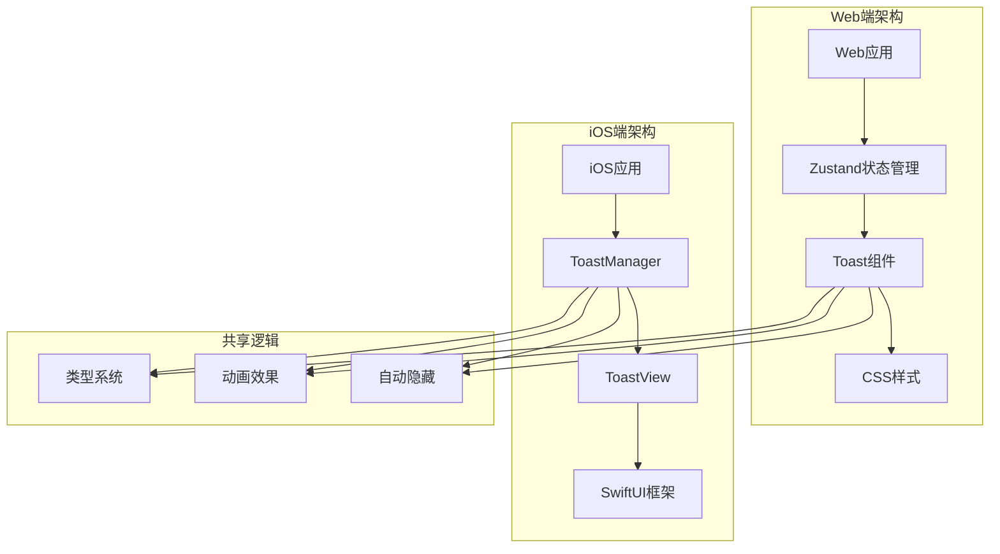
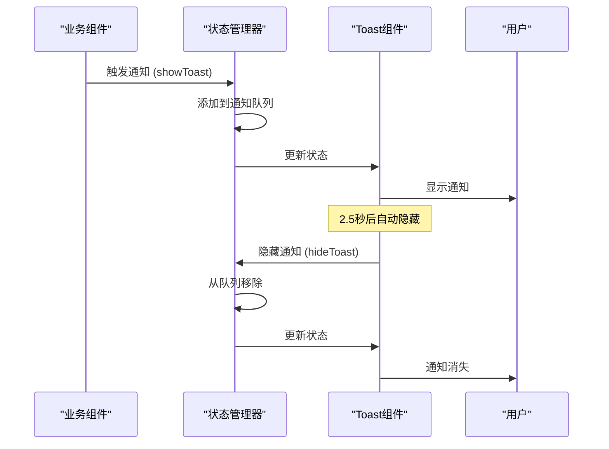
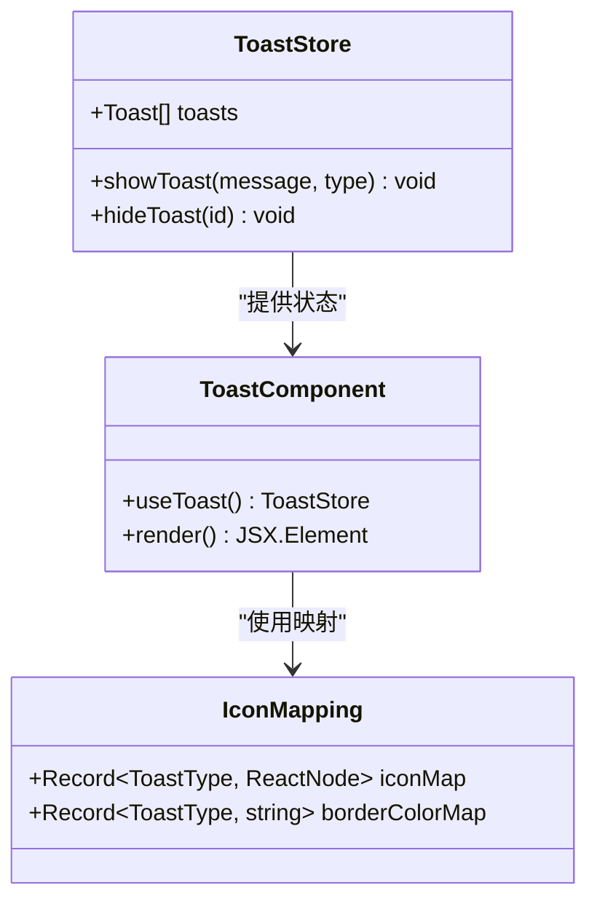
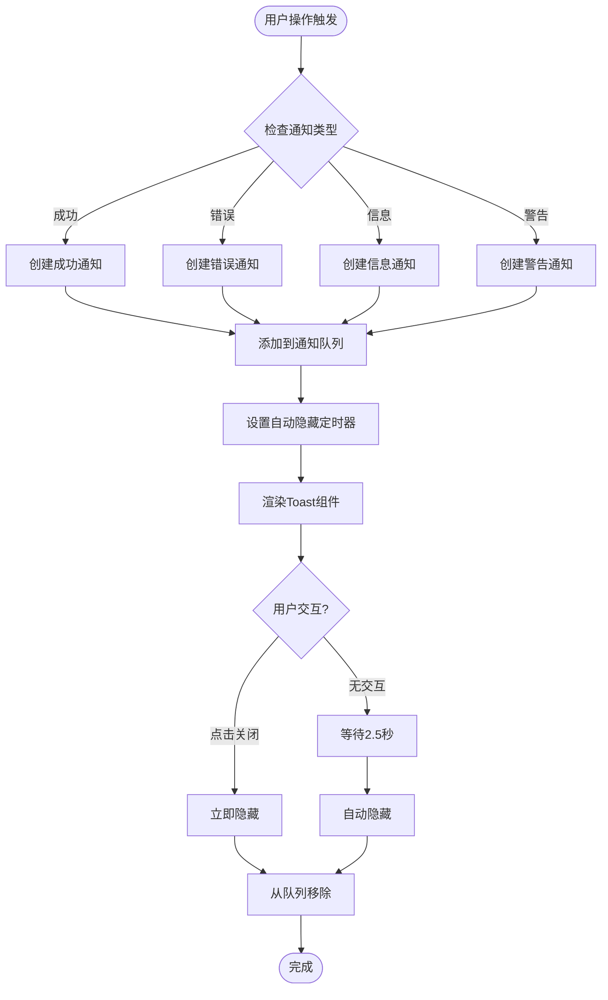
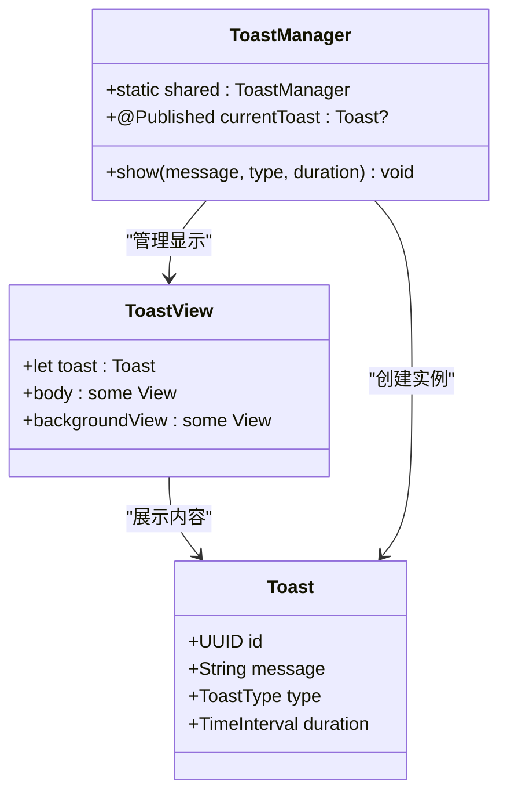
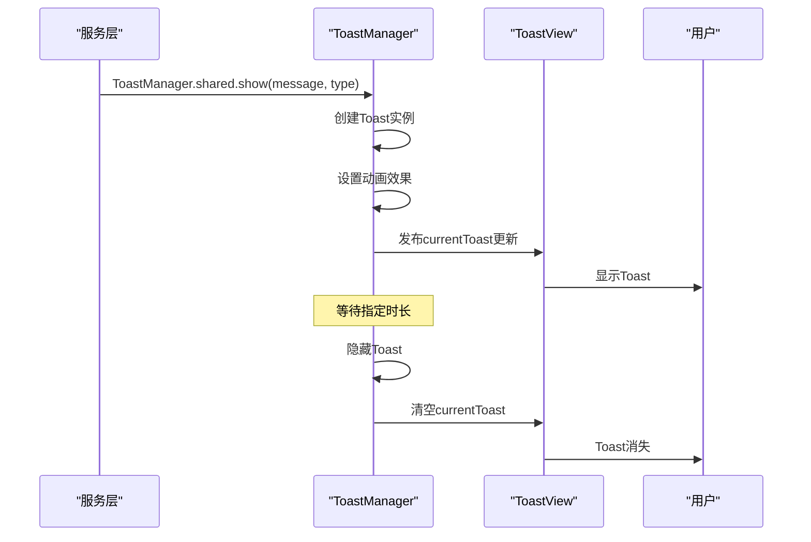
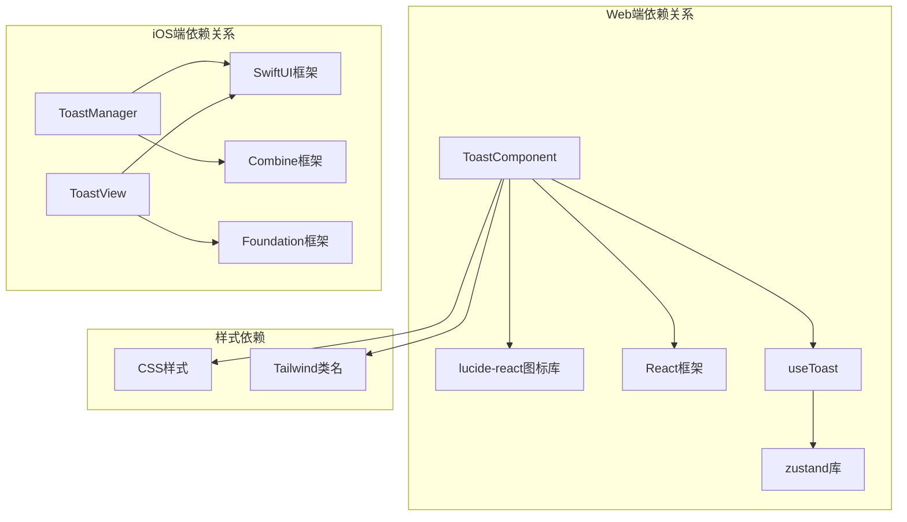

# Toast通知系统

<cite>
**本文档引用的文件**
- [client/src/components/Toast.tsx](file://client/src/components/Toast.tsx)
- [client/src/store/useToast.ts](file://client/src/store/useToast.ts)
- [client/src/App.tsx](file://client/src/App.tsx)
- [client/src/index.css](file://client/src/index.css)
- [ios/LonghornApp/Services/ToastManager.swift](file://ios/LonghornApp/Services/ToastManager.swift)
- [ios/LonghornApp/Views/Components/ToastView.swift](file://ios/LonghornApp/Views/Components/ToastView.swift)
- [ios/LonghornApp/ContentView.swift](file://ios/LonghornApp/ContentView.swift)
- [client/src/components/Admin/AdminSettings.tsx](file://client/src/components/Admin/AdminSettings.tsx)
</cite>

## 目录
1. [简介](#简介)
2. [项目结构](#项目结构)
3. [核心组件](#核心组件)
4. [架构概览](#架构概览)
5. [详细组件分析](#详细组件分析)
6. [依赖关系分析](#依赖关系分析)
7. [性能考虑](#性能考虑)
8. [故障排除指南](#故障排除指南)
9. [结论](#结论)

## 简介

Toast通知系统是Longhorn应用中的重要用户体验组件，提供轻量级、非侵入性的状态反馈机制。该系统支持多种通知类型（成功、错误、信息、警告），具有自动消失功能，并在Web和iOS平台实现了统一的通知体验。

系统采用响应式设计，能够在不同屏幕尺寸下自适应显示，并提供了丰富的视觉反馈和动画效果。通过全局状态管理，Toast通知可以在应用的任何地方被触发和显示。

## 项目结构

Longhorn项目的Toast通知系统采用跨平台架构，在Web端和iOS端分别实现了相应的组件：



**图表来源**
- [client/src/components/Toast.tsx:1-45](file://client/src/components/Toast.tsx#L1-L45)
- [client/src/store/useToast.ts:1-41](file://client/src/store/useToast.ts#L1-L41)
- [ios/LonghornApp/Services/ToastManager.swift:1-80](file://ios/LonghornApp/Services/ToastManager.swift#L1-L80)

**章节来源**
- [client/src/components/Toast.tsx:1-45](file://client/src/components/Toast.tsx#L1-L45)
- [client/src/store/useToast.ts:1-41](file://client/src/store/useToast.ts#L1-L41)
- [ios/LonghornApp/Services/ToastManager.swift:1-80](file://ios/LonghornApp/Services/ToastManager.swift#L1-L80)

## 核心组件

### Web端Toast组件

Web端的Toast系统基于React和Zustand状态管理库构建，提供了完整的通知管理功能：

**主要特性：**
- 支持四种通知类型：success（成功）、error（错误）、info（信息）、warning（警告）
- 自动消失机制，默认2.5秒后自动隐藏
- 响应式设计，适配移动端和桌面端
- 动画过渡效果，提供流畅的用户体验

**数据结构：**
```typescript
interface Toast {
    id: string;
    message: string;
    type: ToastType;
}

interface ToastStore {
    toasts: Toast[];
    showToast: (message: string, type?: ToastType) => void;
    hideToast: (id: string) => void;
}
```

**章节来源**
- [client/src/components/Toast.tsx:1-45](file://client/src/components/Toast.tsx#L1-L45)
- [client/src/store/useToast.ts:1-41](file://client/src/store/useToast.ts#L1-L41)

### iOS端Toast组件

iOS端的Toast系统基于SwiftUI和ObservableObject模式，实现了原生的iOS用户体验：

**主要特性：**
- 原生iOS设计语言，符合Apple Human Interface Guidelines
- 支持四种通知类型，每种类型对应特定的图标和颜色
- 自动布局系统，适配不同屏幕尺寸
- 平滑的动画过渡效果

**数据结构：**
```swift
enum ToastType {
    case success, error, info, warning
}

struct Toast: Equatable, Identifiable {
    let id = UUID()
    let message: String
    let type: ToastType
    let duration: TimeInterval
}

class ToastManager: ObservableObject {
    @Published var currentToast: Toast?
}
```

**章节来源**
- [ios/LonghornApp/Services/ToastManager.swift:1-80](file://ios/LonghornApp/Services/ToastManager.swift#L1-L80)
- [ios/LonghornApp/Views/Components/ToastView.swift:1-49](file://ios/LonghornApp/Views/Components/ToastView.swift#L1-L49)

## 架构概览

Toast通知系统的整体架构采用了分层设计，确保了跨平台的一致性和可维护性：



**图表来源**
- [client/src/store/useToast.ts:17-40](file://client/src/store/useToast.ts#L17-L40)
- [client/src/components/Toast.tsx:20-42](file://client/src/components/Toast.tsx#L20-L42)

**章节来源**
- [client/src/store/useToast.ts:17-40](file://client/src/store/useToast.ts#L17-L40)
- [client/src/components/Toast.tsx:20-42](file://client/src/components/Toast.tsx#L20-L42)

## 详细组件分析

### Web端Toast组件详细分析

#### 组件结构图


**图表来源**
- [client/src/store/useToast.ts:11-15](file://client/src/store/useToast.ts#L11-L15)
- [client/src/components/Toast.tsx:6-18](file://client/src/components/Toast.tsx#L6-L18)

#### 状态管理流程


**图表来源**
- [client/src/store/useToast.ts:20-32](file://client/src/store/useToast.ts#L20-L32)
- [client/src/components/Toast.tsx:35-37](file://client/src/components/Toast.tsx#L35-L37)

**章节来源**
- [client/src/store/useToast.ts:20-32](file://client/src/store/useToast.ts#L20-L32)
- [client/src/components/Toast.tsx:6-18](file://client/src/components/Toast.tsx#L6-L18)

### iOS端Toast组件详细分析

#### 组件结构图


**图表来源**
- [ios/LonghornApp/Services/ToastManager.swift:56-79](file://ios/LonghornApp/Services/ToastManager.swift#L56-L79)
- [ios/LonghornApp/Views/Components/ToastView.swift:4-28](file://ios/LonghornApp/Views/Components/ToastView.swift#L4-L28)

#### iOS通知显示流程


**图表来源**
- [ios/LonghornApp/Services/ToastManager.swift:63-78](file://ios/LonghornApp/Services/ToastManager.swift#L63-L78)
- [ios/LonghornApp/Views/Components/ToastView.swift:7-27](file://ios/LonghornApp/Views/Components/ToastView.swift#L7-L27)

**章节来源**
- [ios/LonghornApp/Services/ToastManager.swift:56-79](file://ios/LonghornApp/Services/ToastManager.swift#L56-L79)
- [ios/LonghornApp/Views/Components/ToastView.swift:4-28](file://ios/LonghornApp/Views/Components/ToastView.swift#L4-L28)

### 跨平台集成分析

#### Web端集成点
Toast系统在Web端被广泛集成到各个业务模块中：

**主要使用场景：**
- 管理员设置保存成功/失败提示
- 用户管理操作反馈
- 文件操作结果通知
- 系统状态变更提醒

**章节来源**
- [client/src/components/Admin/AdminSettings.tsx:308](file://client/src/components/Admin/AdminSettings.tsx#L308)
- [client/src/components/Admin/AdminSettings.tsx:322](file://client/src/components/Admin/AdminSettings.tsx#L322)

#### iOS端集成点
iOS端的Toast系统通过ContentView进行全局集成：

**主要集成方式：**
- 在ContentView中监听ToastManager的状态变化
- 使用ZStack实现Toast的覆盖层显示
- 通过@ObservedObject绑定ToastManager
- 实现底部对齐和动画过渡效果

**章节来源**
- [ios/LonghornApp/ContentView.swift:28-35](file://ios/LonghornApp/ContentView.swift#L28-L35)

## 依赖关系分析

### 组件间依赖关系



**图表来源**
- [client/src/components/Toast.tsx:1-4](file://client/src/components/Toast.tsx#L1-L4)
- [client/src/store/useToast.ts:1](file://client/src/store/useToast.ts#L1)
- [ios/LonghornApp/Services/ToastManager.swift:2-3](file://ios/LonghornApp/Services/ToastManager.swift#L2-L3)

### 外部依赖分析

**Web端外部依赖：**
- **Zustand**: 轻量级状态管理库，提供简单的状态管理模式
- **Lucide React**: 图标库，提供统一的图标系统
- **React**: 用户界面库，提供组件化开发能力

**iOS端外部依赖：**
- **SwiftUI**: Apple的声明式UI框架
- **Combine**: Apple的响应式编程框架
- **Foundation**: Apple的基础框架

**章节来源**
- [client/src/components/Toast.tsx:1-4](file://client/src/components/Toast.tsx#L1-L4)
- [client/src/store/useToast.ts:1](file://client/src/store/useToast.ts#L1)
- [ios/LonghornApp/Services/ToastManager.swift:2-3](file://ios/LonghornApp/Services/ToastManager.swift#L2-L3)

## 性能考虑

### Web端性能优化

**内存管理：**
- Toast组件使用React.memo优化渲染性能
- 自动隐藏机制确保内存及时释放
- 事件处理器使用useCallback避免不必要的重渲染

**渲染优化：**
- 条件渲染确保只有存在Toast时才渲染容器
- CSS动画使用GPU加速，提升流畅度
- 图标使用SVG格式，减少资源体积

**状态管理优化：**
- Zustand提供轻量级状态管理，避免Redux等重型解决方案
- 单一状态树设计，简化状态更新逻辑

### iOS端性能优化

**内存管理：**
- 使用weak reference避免循环引用
- ObservableObject的自动内存管理
- 及时清理动画和定时器

**渲染优化：**
- SwiftUI的声明式渲染提升性能
- 合理使用@State和@ObservedObject
- 动画使用系统级优化

**线程安全：**
- 主线程更新UI状态
- 异步操作使用Task进行并发处理

## 故障排除指南

### 常见问题及解决方案

**Web端问题：**

1. **Toast不显示**
   - 检查useToast状态是否正确初始化
   - 确认Toast组件是否正确导入和渲染
   - 验证CSS样式是否正确加载

2. **通知无法自动隐藏**
   - 检查setTimeout回调是否正确执行
   - 确认hideToast函数是否正确调用
   - 验证状态更新逻辑

3. **样式显示异常**
   - 检查CSS变量是否正确设置
   - 确认响应式断点是否正确
   - 验证主题切换功能

**iOS端问题：**

1. **Toast不显示**
   - 检查ToastManager.shared实例是否正确创建
   - 确认@ObservedObject绑定是否正确
   - 验证ContentView的ZStack层级

2. **动画效果异常**
   - 检查SwiftUI动画是否启用
   - 确认duration参数是否合理
   - 验证设备兼容性

3. **内存泄漏**
   - 检查是否有未清理的订阅
   - 确认ObservableObject的生命周期
   - 验证闭包捕获的引用

**章节来源**
- [client/src/store/useToast.ts:20-32](file://client/src/store/useToast.ts#L20-L32)
- [ios/LonghornApp/Services/ToastManager.swift:63-78](file://ios/LonghornApp/Services/ToastManager.swift#L63-L78)

## 结论

Longhorn项目的Toast通知系统展现了优秀的跨平台设计理念和实现质量。系统在保持功能完整性的同时，充分考虑了性能优化和用户体验，为用户提供了直观、及时的反馈机制。

**主要优势：**
- **跨平台一致性**: Web和iOS端提供相似的用户体验
- **轻量级设计**: 最小化依赖，降低系统复杂度
- **响应式布局**: 适配各种设备和屏幕尺寸
- **动画流畅**: 提供自然的过渡效果
- **易于扩展**: 清晰的架构便于功能扩展

**未来改进建议：**
- 增加通知优先级和队列管理
- 实现通知历史记录功能
- 添加多语言支持
- 提供自定义样式选项
- 增强无障碍访问支持

该Toast系统为Longhorn应用的整体用户体验奠定了坚实基础，是现代Web和移动应用开发的最佳实践案例。