# 前端架构设计

<cite>
**本文档引用的文件**
- [package.json](file://client/package.json)
- [vite.config.ts](file://client/vite.config.ts)
- [main.tsx](file://client/src/main.tsx)
- [App.tsx](file://client/src/App.tsx)
- [DailyWord.tsx](file://client/src/components/DailyWord.tsx)
- [TicketAiWizard.tsx](file://client/src/components/TicketAiWizard.tsx)
- [useDailyWordStore.ts](file://client/src/store/useDailyWordStore.ts)
- [dailyWords.ts](file://client/src/data/dailyWords.ts)
- [useAuthStore.ts](file://client/src/store/useAuthStore.ts)
- [useLanguage.ts](file://client/src/i18n/useLanguage.ts)
- [translations.ts](file://client/src/i18n/translations.ts)
- [useToast.ts](file://client/src/store/useToast.ts)
- [useConfirm.ts](file://client/src/store/useConfirm.ts)
- [useCachedFiles.ts](file://client/src/hooks/useCachedFiles.ts)
- [useCachedTickets.ts](file://client/src/hooks/useCachedTickets.ts)
- [FileBrowser.tsx](file://client/src/components/FileBrowser.tsx)
- [Login.tsx](file://client/src/components/Login.tsx)
- [AppRail.tsx](file://client/src/components/AppRail.tsx)
- [AttachmentZone.tsx](file://client/src/components/Service/AttachmentZone.tsx)
- [TicketCreationModal.tsx](file://client/src/components/Service/TicketCreationModal.tsx)
- [useTicketStore.ts](file://client/src/store/useTicketStore.ts)
- [useNavigationState.ts](file://client/src/hooks/useNavigationState.ts)
- [pathTranslator.ts](file://client/src/utils/pathTranslator.ts)
- [dateLocale.ts](file://client/src/utils/dateLocale.ts)
- [index.html](file://client/index.html)
- [tsconfig.json](file://client/tsconfig.json)
- [eslint.config.js](file://client/eslint.config.js)
- [ServiceRecordListPage.tsx](file://client/src/components/ServiceRecords/ServiceRecordListPage.tsx)
- [ServiceRecordCreatePage.tsx](file://client/src/components/ServiceRecords/ServiceRecordCreatePage.tsx)
- [IssueListPage.tsx](file://client/src/components/Issues/IssueListPage.tsx)
- [IssueCreatePage.tsx](file://client/src/components/Issues/IssueCreatePage.tsx)
- [IssueDetailPage.tsx](file://client/src/components/Issues/IssueDetailPage.tsx)
- [ContextPanel.tsx](file://client/src/components/ServiceRecords/ContextPanel.tsx)
- [ServiceNavigation.tsx](file://client/src/components/Service/ServiceNavigation.tsx)
- [WorkspacePage.tsx](file://client/src/components/Service/WorkspacePage.tsx)
- [SlaComponents.tsx](file://client/src/components/Tickets/SlaComponents.tsx)
- [NotificationCenter.tsx](file://client/src/components/Notifications/NotificationCenter.tsx)
- [NotificationBell.tsx](file://client/src/components/Notifications/NotificationBell.tsx)
- [useNotificationStore.ts](file://client/src/store/useNotificationStore.ts)
- [OverviewDashboard.tsx](file://client/src/components/Workspace/OverviewDashboard.tsx)
- [ServiceOverviewPage.tsx](file://client/src/components/Service/ServiceOverviewPage.tsx)
- [WorkspaceComponents.tsx](file://client/src/components/Workspace/WorkspaceComponents.tsx)
- [ai_service.js](file://server/service/ai_service.js)
- [system.js](file://server/service/routes/system.js)
- [auth.js](file://server/service/routes/auth.js)
- [index.css](file://client/src/index.css)
- [WikiEditorModal.tsx](file://client/src/components/Knowledge/WikiEditorModal.tsx)
- [AdminSettings.tsx](file://client/src/components/Admin/AdminSettings.tsx)
</cite>

## 更新摘要
**变更内容**
- 客户端版本从 12.3.107 升级到 12.3.109，反映本次更新中的版本号变更
- 新增服务导航组件：统一的服务模块导航架构，支持折叠分组、活跃状态高亮、徽章计数
- 新增通知中心组件：macOS风格的通知面板，支持点击外部关闭、标记已读、批量操作
- 新增SLA组件：优先级标签、SLA状态标签、实时倒计时组件，支持可视化SLA健康度
- 新增工作台组件：个人执行台，支持工单聚合、筛选排序、SLA预警
- 新增服务概览仪表盘：管理仪表盘，支持团队负载分析、风险工单监控、SLA健康度指标
- 集成通知铃铛到顶部栏：服务模块专用的通知入口，支持未读计数轮询
- 完善颜色标准化系统：统一的应用主题色、状态色和渐变色彩体系

## 目录
1. [引言](#引言)
2. [项目结构](#项目结构)
3. [核心组件](#核心组件)
4. [架构总览](#架构总览)
5. [详细组件分析](#详细组件分析)
6. [AI智能系统](#ai智能系统)
7. [颜色标准化系统](#颜色标准化系统)
8. [依赖关系分析](#依赖关系分析)
9. [性能考量](#性能考量)
10. [故障排查指南](#故障排查指南)
11. [结论](#结论)
12. [附录](#附录)

## 引言
本文件面向 Longhorn 前端团队与相关利益方，系统化梳理基于 React 19 + TypeScript + Vite 的现代前端技术栈架构。重点覆盖组件层次结构、状态管理模式（Zustand）、路由配置与国际化支持；阐述前端与后端 API 的交互模式、错误处理机制与缓存策略；总结组件生命周期管理、性能优化技术与开发工具链配置；并给出部署配置、构建优化与生产环境最佳实践，以及跨平台兼容性与移动端适配策略。

**更新** 本次更新重点集成了全新的服务导航架构、通知中心系统、SLA可视化组件和工作台功能，显著提升了服务模块的用户体验和管理效率。客户端版本已从 12.3.107 升级到 12.3.109。

## 项目结构
前端位于 client 目录，采用按功能域分层的组织方式：
- 根入口与构建配置：main.tsx、index.html、vite.config.ts、package.json、tsconfig.json、eslint.config.js
- 应用主体：App.tsx（路由与布局）
- 组件层：components/（业务组件，如 FileBrowser、Login、DailyWord、ServiceRecords、Issues、AppRail、AttachmentZone、TicketCreationModal、TicketAiWizard、ServiceNavigation、WorkspacePage、SlaComponents、NotificationCenter、NotificationBell 等）
- 状态管理：store/（Zustand 状态容器，如 useAuthStore、useDailyWordStore、useTicketStore、useToast、useConfirm、useNotificationStore）
- 国际化：i18n/（翻译字典与语言钩子）
- 工具函数：utils/（路径翻译、日期本地化等）
- 钩子：hooks/（业务逻辑封装，如 useCachedFiles、useCachedTickets、useNavigationState）
- 数据层：data/（词汇数据、配置等）
- 样式层：index.css（统一的 CSS 变量和样式系统）

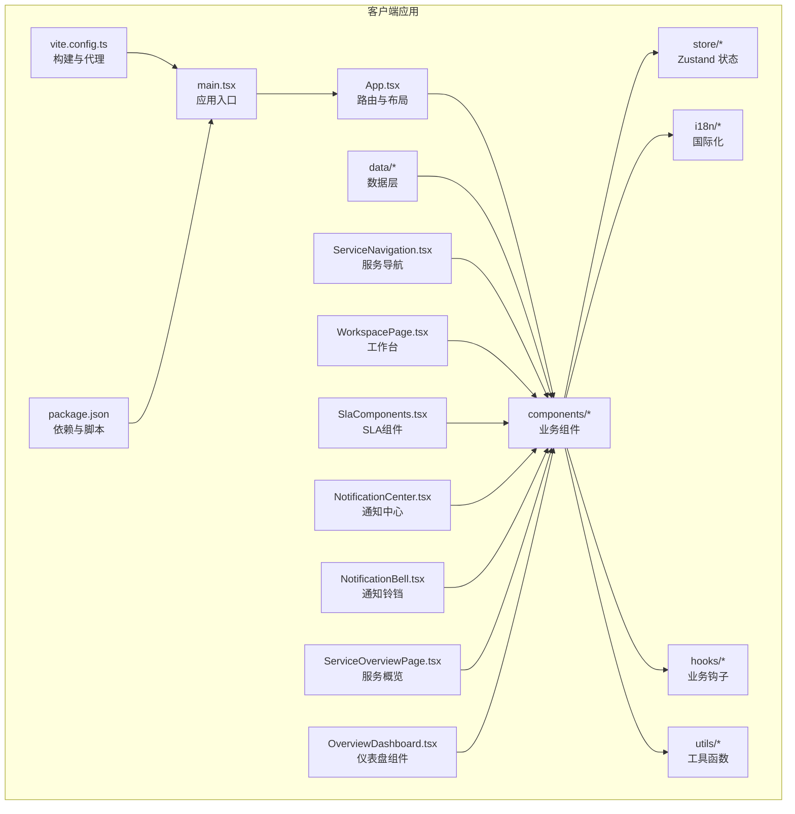
```mermaid
graph TB
subgraph "客户端应用"
A["main.tsx<br/>应用入口"]
B["App.tsx<br/>路由与布局"]
C["components/*<br/>业务组件"]
D["store/*<br/>Zustand 状态"]
E["i18n/*<br/>国际化"]
F["hooks/*<br/>业务钩子"]
G["utils/*<br/>工具函数"]
H["vite.config.ts<br/>构建与代理"]
I["package.json<br/>依赖与脚本"]
J["data/*<br/>数据层"]
K["ServiceNavigation.tsx<br/>服务导航"]
L["WorkspacePage.tsx<br/>工作台"]
M["SlaComponents.tsx<br/>SLA组件"]
N["NotificationCenter.tsx<br/>通知中心"]
O["NotificationBell.tsx<br/>通知铃铛"]
P["ServiceOverviewPage.tsx<br/>服务概览"]
Q["OverviewDashboard.tsx<br/>仪表盘组件"]
end
A --> B
B --> C
C --> D
C --> E
C --> F
C --> G
H --> A
I --> A
J --> C
K --> C
L --> C
M --> C
N --> C
O --> C
P --> C
Q --> C
```

**图表来源**
- [main.tsx](file://client/src/main.tsx#L1-L11)
- [App.tsx](file://client/src/App.tsx#L1-L1502)
- [vite.config.ts](file://client/vite.config.ts#L1-L94)
- [package.json](file://client/package.json#L1-L63)
- [ServiceNavigation.tsx](file://client/src/components/Service/ServiceNavigation.tsx#L1-L347)
- [WorkspacePage.tsx](file://client/src/components/Service/WorkspacePage.tsx#L1-L471)
- [SlaComponents.tsx](file://client/src/components/Tickets/SlaComponents.tsx#L1-L335)
- [NotificationCenter.tsx](file://client/src/components/Notifications/NotificationCenter.tsx#L1-L437)
- [NotificationBell.tsx](file://client/src/components/Notifications/NotificationBell.tsx#L1-L93)
- [ServiceOverviewPage.tsx](file://client/src/components/Service/ServiceOverviewPage.tsx#L1-L477)
- [OverviewDashboard.tsx](file://client/src/components/Workspace/OverviewDashboard.tsx#L1-L501)

**章节来源**
- [main.tsx](file://client/src/main.tsx#L1-L11)
- [index.html](file://client/index.html#L1-L16)
- [vite.config.ts](file://client/vite.config.ts#L1-L94)
- [package.json](file://client/package.json#L1-L63)
- [tsconfig.json](file://client/tsconfig.json#L1-L8)
- [eslint.config.js](file://client/eslint.config.js#L1-L24)

## 核心组件
- 路由与布局：App.tsx 定义公共路由、受保护路由与主布局 MainLayout/Sidebar/TopBar，实现角色驱动的菜单与权限控制。
- **现代化服务导航**：ServiceNavigation 提供统一的服务模块导航架构，支持折叠分组、活跃状态高亮、徽章计数和本地状态持久化。
- **通知中心系统**：NotificationCenter 提供 macOS 风格的通知面板，支持点击外部关闭、标记已读、批量操作和类型化通知。
- **SLA可视化组件**：SlaComponents 提供优先级标签、SLA状态标签、实时倒计时和状态芯片，支持完整的 SLA 生命周期管理。
- **工作台执行台**：WorkspacePage 提供个人执行台功能，支持工单聚合、筛选排序、SLA预警和交互式工单卡片。
- **服务概览仪表盘**：ServiceOverviewPage 提供管理仪表盘，支持团队负载分析、风险工单监控和 SLA 健康度指标。
- **通知铃铛集成**：NotificationBell 集成到顶部栏，提供服务模块专用的通知入口，支持未读计数轮询和动画效果。
- **现代化布局组件**：AppRail 提供横向应用栏，支持服务模块和文件模块的快速切换，替代传统垂直侧边栏。
- **AI智能工单助手**：TicketAiWizard 提供AI驱动的工单信息提取和表单填充功能，支持从邮件/聊天记录自动解析工单信息。
- **工单创建系统**：TicketCreationModal 提供统一的工单创建界面，支持咨询工单、RMA工单和经销商维修单三种类型。
- **附件上传组件**：AttachmentZone 提供拖拽式文件上传，支持图片、视频、PDF等多种格式，具备预览和删除功能。
- **导航状态管理**：useNavigationState 管理模块切换和路径记忆，支持服务模块和文件模块的智能导航。
- **认证与会话**：useAuthStore 提供用户信息与令牌的持久化存储与登出流程。
- **国际化**：useLanguage 提供语言切换、事件通知与翻译函数；translations.ts 提供多语言字典。
- **通知与确认**：useToast 与 useConfirm 提供轻量级全局提示与确认对话框。
- **文件浏览与缓存**：FileBrowser 使用 useCachedFiles 基于 SWR 实现目录列表缓存、去重与预取。
- **工单缓存架构**：useCachedTickets 基于 SWR 实现工单列表的高效缓存、去重与预取。
- **登录页**：Login 组件负责认证请求与错误展示。
- **每日一词组件**：DailyWordBadge 和 DailyWordModal 提供词汇学习功能，支持多语言、多级别、语音播放等特性。
- **服务记录模块**：ServiceRecordListPage、ServiceRecordCreatePage、ServiceRecordDetailPage 提供客户服务记录管理功能。
- **工单模块**：IssueListPage、IssueCreatePage、IssueDetailPage 提供工单管理系统，支持评论、附件和状态管理。
- **上下文查询**：ContextPanel 提供基于客户或产品序列号的综合查询功能。
- **管理设置**：AdminSettings 提供AI配置和系统管理功能，统一使用 Kine Green 颜色标识。

**章节来源**
- [App.tsx](file://client/src/App.tsx#L151-L200)
- [ServiceNavigation.tsx](file://client/src/components/Service/ServiceNavigation.tsx#L1-L347)
- [NotificationCenter.tsx](file://client/src/components/Notifications/NotificationCenter.tsx#L1-L437)
- [SlaComponents.tsx](file://client/src/components/Tickets/SlaComponents.tsx#L1-L335)
- [WorkspacePage.tsx](file://client/src/components/Service/WorkspacePage.tsx#L1-L471)
- [ServiceOverviewPage.tsx](file://client/src/components/Service/ServiceOverviewPage.tsx#L1-L477)
- [NotificationBell.tsx](file://client/src/components/Notifications/NotificationBell.tsx#L1-L93)

## 架构总览
前端采用"单页应用 + 现代构建工具"的架构：
- 技术栈：React 19（函数组件 + Hooks）、TypeScript、Vite（开发服务器、代理与构建）
- 状态管理：Zustand（轻量、易用、可序列化），用于认证、通知、确认对话框、每日一词状态、工单草稿状态、通知状态管理
- 数据获取：SWR（缓存、去重、刷新、预取），结合 axios 进行 API 请求
- 国际化：自研 useLanguage + translations 字典，支持 zh/en/de/ja
- 路由：react-router-dom 7（嵌套路由、Outlet、受保护路由）
- 样式与主题：CSS 变量与 Tailwind 相关类名（通过样式变量实现暗色主题），统一的颜色标准化系统

**更新** 新增服务导航架构、通知中心系统、SLA可视化组件和工作台功能，形成完整的服务模块生态系统。客户端版本已升级至 12.3.109。

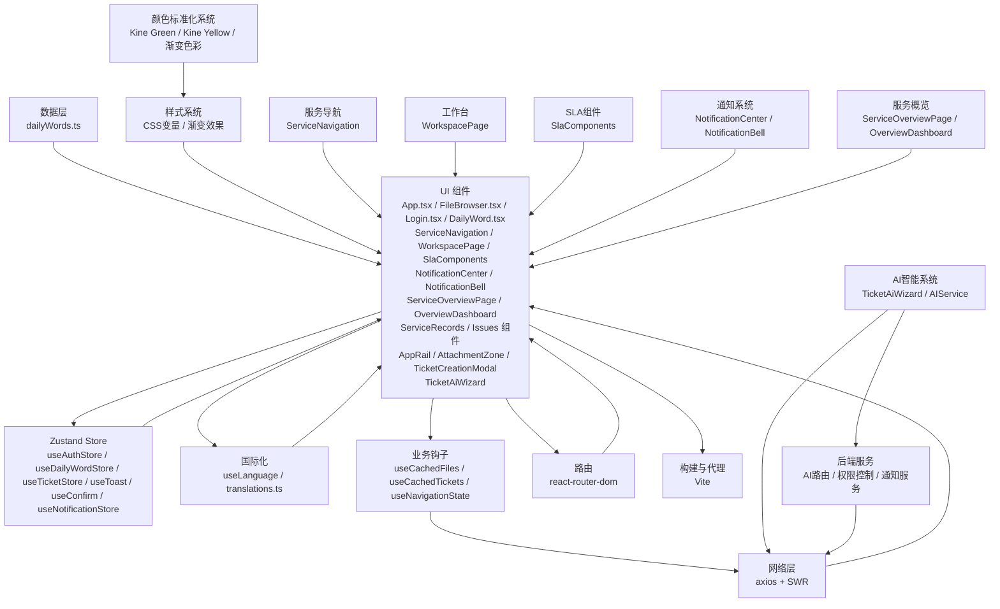
```mermaid
graph TB
UI["UI 组件<br/>App.tsx / FileBrowser.tsx / Login.tsx / DailyWord.tsx<br/>ServiceNavigation / WorkspacePage / SlaComponents<br/>NotificationCenter / NotificationBell<br/>ServiceOverviewPage / OverviewDashboard<br/>ServiceRecords / Issues 组件<br/>AppRail / AttachmentZone / TicketCreationModal<br/>TicketAiWizard"]
Store["Zustand Store<br/>useAuthStore / useDailyWordStore / useTicketStore / useToast / useConfirm / useNotificationStore"]
I18N["国际化<br/>useLanguage / translations.ts"]
Hook["业务钩子<br/>useCachedFiles / useCachedTickets / useNavigationState"]
Net["网络层<br/>axios + SWR"]
Router["路由<br/>react-router-dom"]
Build["构建与代理<br/>Vite"]
Data["数据层<br/>dailyWords.ts"]
AI["AI智能系统<br/>TicketAiWizard / AIService"]
Backend["后端服务<br/>AI路由 / 权限控制 / 通知服务"]
Colors["颜色标准化系统<br/>Kine Green / Kine Yellow / 渐变色彩"]
Styles["样式系统<br/>CSS变量 / 渐变效果"]
ServiceNav["服务导航<br/>ServiceNavigation"]
Workspace["工作台<br/>WorkspacePage"]
SLA["SLA组件<br/>SlaComponents"]
Notification["通知系统<br/>NotificationCenter / NotificationBell"]
Overview["服务概览<br/>ServiceOverviewPage / OverviewDashboard"]
UI --> Store
UI --> I18N
UI --> Hook
Hook --> Net
UI --> Router
UI --> Build
Store --> UI
I18N --> UI
Net --> UI
Router --> UI
Data --> UI
AI --> Net
AI --> Backend
Backend --> Net
Colors --> Styles
Styles --> UI
ServiceNav --> UI
Workspace --> UI
SLA --> UI
Notification --> UI
Overview --> UI
```

**图表来源**
- [App.tsx](file://client/src/App.tsx#L1-L1502)
- [ServiceNavigation.tsx](file://client/src/components/Service/ServiceNavigation.tsx#L1-L347)
- [WorkspacePage.tsx](file://client/src/components/Service/WorkspacePage.tsx#L1-L471)
- [SlaComponents.tsx](file://client/src/components/Tickets/SlaComponents.tsx#L1-L335)
- [NotificationCenter.tsx](file://client/src/components/Notifications/NotificationCenter.tsx#L1-L437)
- [NotificationBell.tsx](file://client/src/components/Notifications/NotificationBell.tsx#L1-L93)
- [ServiceOverviewPage.tsx](file://client/src/components/Service/ServiceOverviewPage.tsx#L1-L477)
- [OverviewDashboard.tsx](file://client/src/components/Workspace/OverviewDashboard.tsx#L1-L501)
- [TicketAiWizard.tsx](file://client/src/components/TicketAiWizard.tsx#L1-L268)
- [ai_service.js](file://server/service/ai_service.js#L1-L140)
- [auth.js](file://server/service/routes/auth.js#L269-L270)
- [index.css](file://client/src/index.css#L3-L49)

## 详细组件分析

### 服务导航组件（ServiceNavigation）
**新增** 统一的服务模块导航架构，支持折叠分组、活跃状态高亮、徽章计数

- **设计理念**：基于 macOS26 风格的玻璃拟态设计，提供清晰的模块分组和视觉层次
- **核心功能**：
  - 折叠分组：支持工作台、档案和基础信息、技术中心、管理等分组
  - 活跃状态：根据当前路径自动高亮对应导航项
  - 徽章计数：支持未读数量显示，使用红色圆形徽章
  - 本地状态：使用 localStorage 持久化展开状态
  - 特殊处理：wiki 和 bokeh 路径的特殊匹配逻辑
- **交互设计**：悬停效果、激活状态、平滑过渡动画，提供丰富的视觉反馈
- **图标系统**：使用 lucide-react 图标库，统一的图标风格和尺寸

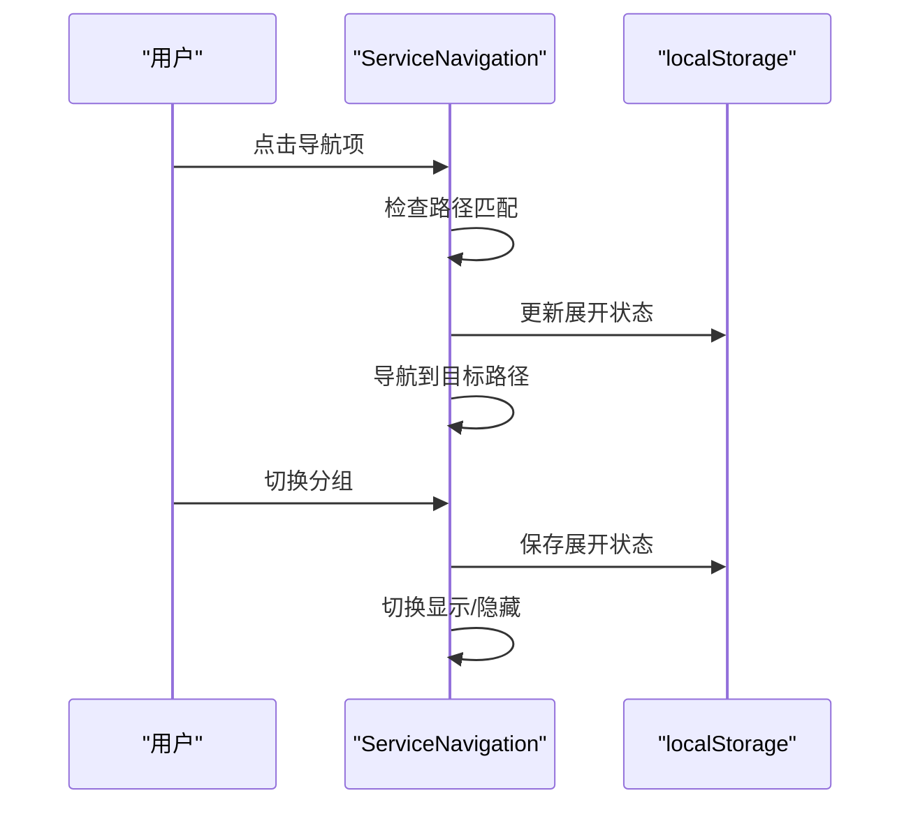
```mermaid
sequenceDiagram
participant U as "用户"
participant SN as "ServiceNavigation"
participant LS as "localStorage"
U->>SN : 点击导航项
SN->>SN : 检查路径匹配
SN->>LS : 更新展开状态
SN->>SN : 导航到目标路径
U->>SN : 切换分组
SN->>LS : 保存展开状态
SN->>SN : 切换显示/隐藏
```

**图表来源**
- [ServiceNavigation.tsx](file://client/src/components/Service/ServiceNavigation.tsx#L117-L142)
- [ServiceNavigation.tsx](file://client/src/components/Service/ServiceNavigation.tsx#L118-L124)
- [ServiceNavigation.tsx](file://client/src/components/Service/ServiceNavigation.tsx#L136-L142)

**章节来源**
- [ServiceNavigation.tsx](file://client/src/components/Service/ServiceNavigation.tsx#L1-L347)

### 通知中心组件（NotificationCenter）
**新增** macOS 风格的通知面板，提供完整的通知管理功能

- **设计理念**：macOS 风格的玻璃拟态设计，提供沉浸式的通知体验
- **核心功能**：
  - 类型化通知：支持 mention、assignment、status_change、sla_warning、sla_breach 等类型
  - 点击外部关闭：点击面板外区域自动关闭
  - 标记已读：单击通知自动标记为已读
  - 批量操作：支持全部标记已读功能
  - 动画效果：平滑的展开和关闭动画
- **交互设计**：悬停效果、渐变色彩、阴影效果，提供丰富的视觉反馈
- **图标映射**：根据通知类型自动选择对应的 lucide-react 图标

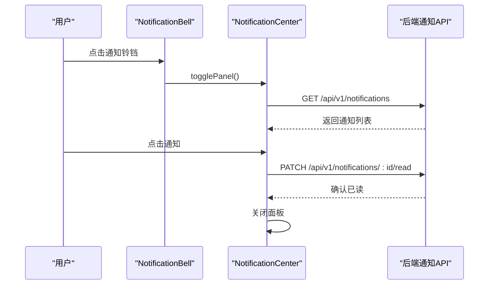
```mermaid
sequenceDiagram
participant U as "用户"
participant NB as "NotificationBell"
participant NC as "NotificationCenter"
participant API as "后端通知API"
U->>NB : 点击通知铃铛
NB->>NC : togglePanel()
NC->>API : GET /api/v1/notifications
API-->>NC : 返回通知列表
U->>NC : 点击通知
NC->>API : PATCH /api/v1/notifications/ : id/read
API-->>NC : 确认已读
NC->>NC : 关闭面板
```

**图表来源**
- [NotificationBell.tsx](file://client/src/components/Notifications/NotificationBell.tsx#L23-L29)
- [NotificationCenter.tsx](file://client/src/components/Notifications/NotificationCenter.tsx#L204-L234)
- [useNotificationStore.ts](file://client/src/store/useNotificationStore.ts#L107-L141)

**章节来源**
- [NotificationCenter.tsx](file://client/src/components/Notifications/NotificationCenter.tsx#L1-L437)
- [NotificationBell.tsx](file://client/src/components/Notifications/NotificationBell.tsx#L1-L93)
- [useNotificationStore.ts](file://client/src/store/useNotificationStore.ts#L1-L143)

### SLA可视化组件（SlaComponents）
**新增** 完整的 SLA 生命周期管理组件系统

- **优先级标签**：PriorityBadge 组件，支持 P0/P1/P2 三种优先级，使用品牌色彩标识
- **SLA状态标签**：SlaStatusBadge 组件，支持 normal/warning/breached 三种状态，可选显示剩余时间
- **实时倒计时**：SlaTimer 组件，提供精确的 SLA 剩余时间显示和进度条
- **状态芯片**：TicketStatusChip 组件，支持工单节点状态的可视化展示
- **色彩系统**：统一的 Kine Green/Yellow/Red 色彩体系，清晰的状态区分

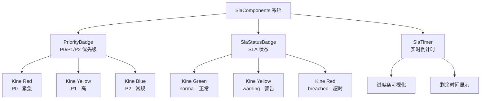
```mermaid
flowchart TD
A["SlaComponents 系统"] --> B["PriorityBadge<br/>P0/P1/P2 优先级"]
B --> C["Kine Red<br/>P0 - 紧急"]
B --> D["Kine Yellow<br/>P1 - 高"]
B --> E["Kine Blue<br/>P2 - 常规"]
A --> F["SlaStatusBadge<br/>SLA 状态"]
F --> G["Kine Green<br/>normal - 正常"]
F --> H["Kine Yellow<br/>warning - 警告"]
F --> I["Kine Red<br/>breached - 超时"]
A --> J["SlaTimer<br/>实时倒计时"]
J --> K["进度条可视化"]
J --> L["剩余时间显示"]
```

**图表来源**
- [SlaComponents.tsx](file://client/src/components/Tickets/SlaComponents.tsx#L14-L18)
- [SlaComponents.tsx](file://client/src/components/Tickets/SlaComponents.tsx#L21-L37)
- [SlaComponents.tsx](file://client/src/components/Tickets/SlaComponents.tsx#L157-L198)

**章节来源**
- [SlaComponents.tsx](file://client/src/components/Tickets/SlaComponents.tsx#L1-L335)

### 工作台执行台（WorkspacePage）
**新增** 个人执行台功能，提供工单聚合和管理能力

- **设计理念**：macOS 风格的玻璃拟态设计，提供沉浸式的工单管理体验
- **核心功能**：
  - 工单聚合：从多个来源（咨询工单、RMA工单）聚合显示
  - 视图切换：支持收件箱、指派给我、SLA告警、全部四种视图
  - 筛选排序：支持搜索、优先级、状态等多维度筛选，混合排序算法
  - SLA预警：实时显示 SLA 剩余时间和状态
  - 交互功能：收藏、静音、状态切换等操作
- **状态管理**：使用本地状态管理收藏和静音状态，支持跨会话持久化
- **颜色系统**：统一的品牌色彩体系，清晰的状态区分

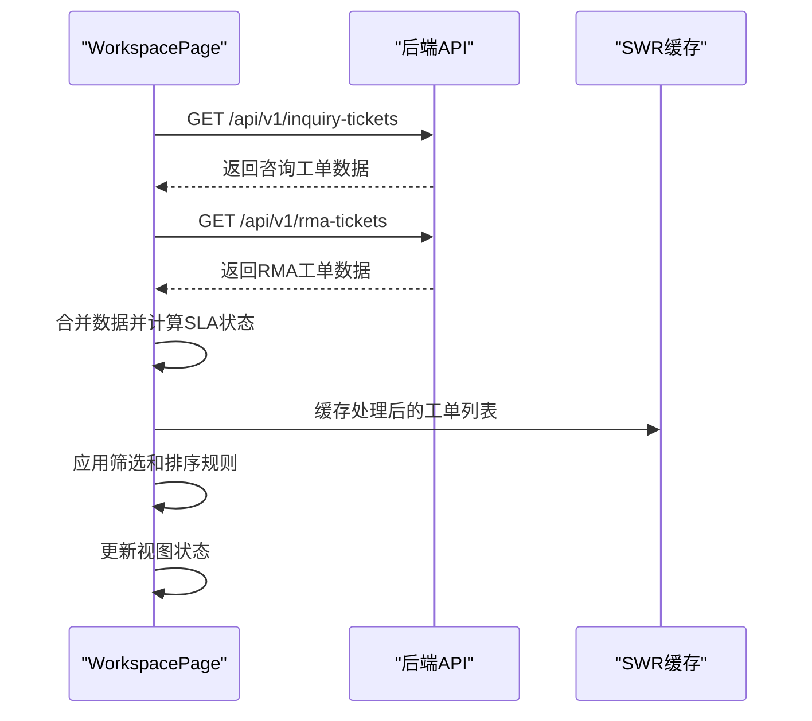
```mermaid
sequenceDiagram
participant WP as "WorkspacePage"
participant API as "后端API"
participant SWR as "SWR缓存"
WP->>API : GET /api/v1/inquiry-tickets
API-->>WP : 返回咨询工单数据
WP->>API : GET /api/v1/rma-tickets
API-->>WP : 返回RMA工单数据
WP->>WP : 合并数据并计算SLA状态
WP->>SWR : 缓存处理后的工单列表
WP->>WP : 应用筛选和排序规则
WP->>WP : 更新视图状态
```

**图表来源**
- [WorkspacePage.tsx](file://client/src/components/Service/WorkspacePage.tsx#L50-L89)
- [WorkspacePage.tsx](file://client/src/components/Service/WorkspacePage.tsx#L105-L148)
- [WorkspacePage.tsx](file://client/src/components/Service/WorkspacePage.tsx#L157-L168)

**章节来源**
- [WorkspacePage.tsx](file://client/src/components/Service/WorkspacePage.tsx#L1-L471)

### 服务概览仪表盘（ServiceOverviewPage）
**新增** 管理仪表盘，提供团队管理和 SLA 监控能力

- **设计理念**：macOS 风格的仪表盘设计，提供关键指标的可视化展示
- **核心功能**：
  - 关键指标：待处理工单、今日完成、平均响应时间、P0紧急工单
  - 风险工单：SLA 超时风险工单监控和提醒
  - 团队负载：团队成员工单负载分析和可视化
  - SLA健康度：整体 SLA 健康度指标和趋势分析
  - 快速操作：支持直接跳转到相关页面和操作
- **数据可视化**：使用 conic-gradient 圆环图、柱状图、卡片式指标等可视化组件
- **交互设计**：支持手动刷新、点击跳转、状态切换等交互

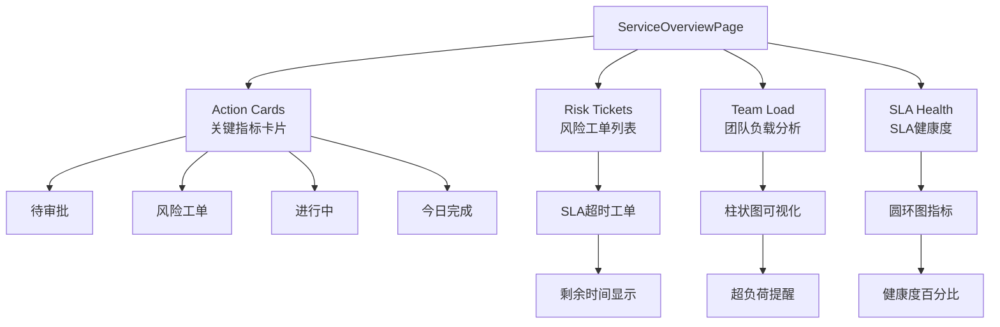
```mermaid
flowchart TD
A["ServiceOverviewPage"] --> B["Action Cards<br/>关键指标卡片"]
B --> C["待审批"]
B --> D["风险工单"]
B --> E["进行中"]
B --> F["今日完成"]
A --> G["Risk Tickets<br/>风险工单列表"]
G --> H["SLA超时工单"]
H --> I["剩余时间显示"]
A --> J["Team Load<br/>团队负载分析"]
J --> K["柱状图可视化"]
K --> L["超负荷提醒"]
A --> M["SLA Health<br/>SLA健康度"]
M --> N["圆环图指标"]
N --> O["健康度百分比"]
```

**图表来源**
- [ServiceOverviewPage.tsx](file://client/src/components/Service/ServiceOverviewPage.tsx#L174-L215)
- [ServiceOverviewPage.tsx](file://client/src/components/Service/ServiceOverviewPage.tsx#L248-L270)
- [ServiceOverviewPage.tsx](file://client/src/components/Service/ServiceOverviewPage.tsx#L272-L298)

**章节来源**
- [ServiceOverviewPage.tsx](file://client/src/components/Service/ServiceOverviewPage.tsx#L1-L477)

### 通知铃铛集成（NotificationBell）
**更新** 集成到顶部栏，提供服务模块专用的通知入口

- **设计理念**：macOS 风格的通知入口，简洁而功能完整
- **核心功能**：
  - 未读计数：实时显示未读通知数量，支持动画效果
  - 轮询机制：每30秒自动轮询未读计数
  - 点击行为：点击时切换通知面板显示状态
  - 品牌色彩：使用 Kine Red 作为未读计数的强调色
- **集成方式**：仅在服务模块显示，避免与其他模块的干扰
- **动画效果**：未读计数使用脉冲动画，吸引用户注意

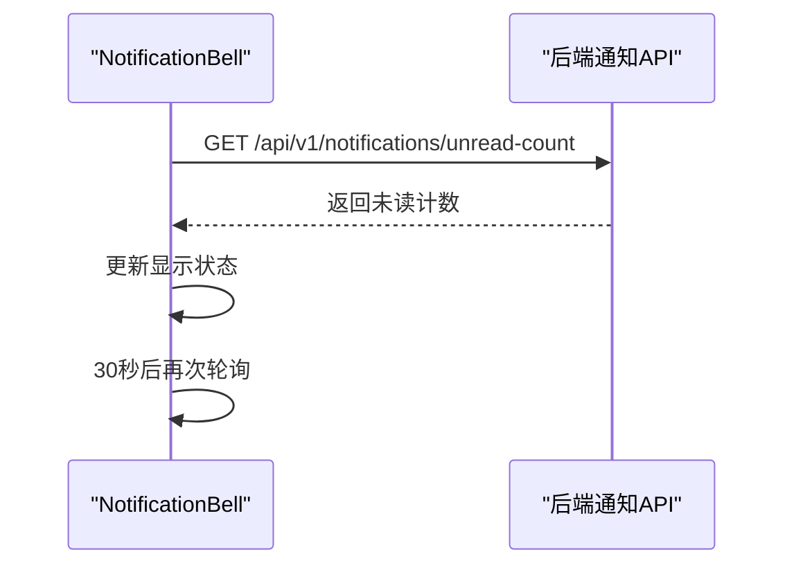
```mermaid
sequenceDiagram
participant NB as "NotificationBell"
participant API as "后端通知API"
NB->>API : GET /api/v1/notifications/unread-count
API-->>NB : 返回未读计数
NB->>NB : 更新显示状态
NB->>NB : 30秒后再次轮询
```

**图表来源**
- [NotificationBell.tsx](file://client/src/components/Notifications/NotificationBell.tsx#L16-L21)
- [NotificationBell.tsx](file://client/src/components/Notifications/NotificationBell.tsx#L23-L29)

**章节来源**
- [NotificationBell.tsx](file://client/src/components/Notifications/NotificationBell.tsx#L1-L93)
- [App.tsx](file://client/src/App.tsx#L904-L905)

### 路由与布局（App.tsx）
- 公共路由：分享集合页（/share-collection/:token）
- 登录路由：/login（未登录时可见，已登录跳转首页）
- 主布局：MainLayout 包含 AppRail 应用栏、侧边栏 Sidebar 与顶部 TopBar，Outlet 渲染子路由
- 权限路由：根据用户角色（Admin/Lead/Member）渲染不同菜单与页面
- 重定向：旧路由映射到新路由，根路径根据角色重定向至 /admin 或部门路径
- **模块化导航**：重构后的服务模块路由结构，包括服务记录、工单管理和上下文查询
- **全局模态框**：TicketCreationModal 作为全局组件始终渲染，支持快捷创建工单
- **颜色系统集成**：状态统计卡片统一使用 Kine Green (#10B981) 作为成功状态标识
- **服务模块路由**：新增服务概览、工作台、SLA组件等完整路由配置
- **版本信息显示**：顶部栏用户菜单中显示 Longhorn 版本信息，当前版本为 12.3.109

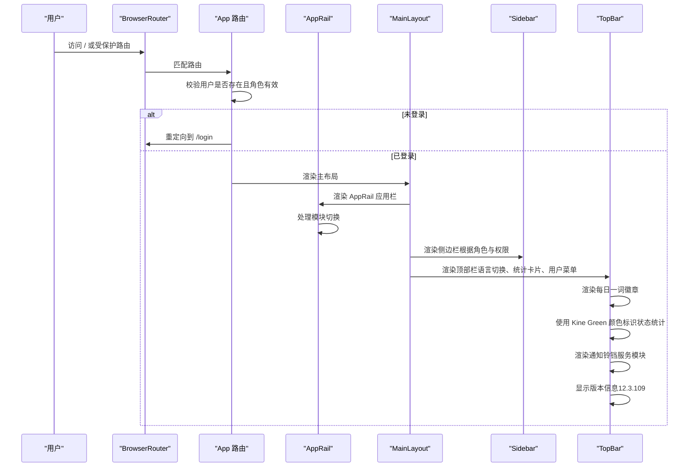
```mermaid
sequenceDiagram
participant U as "用户"
participant R as "BrowserRouter"
participant A as "App 路由"
participant AR as "AppRail"
participant L as "MainLayout"
participant S as "Sidebar"
participant T as "TopBar"
U->>R : 访问 / 或受保护路由
R->>A : 匹配路由
A->>A : 校验用户是否存在且角色有效
alt 未登录
A->>R : 重定向到 /login
else 已登录
A->>L : 渲染主布局
L->>AR : 渲染 AppRail 应用栏
AR->>AR : 处理模块切换
L->>S : 渲染侧边栏根据角色与权限
L->>T : 渲染顶部栏语言切换、统计卡片、用户菜单
T->>T : 渲染每日一词徽章
T->>T : 使用 Kine Green 颜色标识状态统计
T->>T : 渲染通知铃铛服务模块
T->>T : 显示版本信息12.3.109
end
```

**图表来源**
- [App.tsx](file://client/src/App.tsx#L132-L148)
- [App.tsx](file://client/src/App.tsx#L151-L200)
- [App.tsx](file://client/src/App.tsx#L843-L905)
- [App.tsx](file://client/src/App.tsx#L1456-L1475)

**章节来源**
- [App.tsx](file://client/src/App.tsx#L132-L148)
- [App.tsx](file://client/src/App.tsx#L151-L200)
- [App.tsx](file://client/src/App.tsx#L843-L905)
- [App.tsx](file://client/src/App.tsx#L1456-L1475)

### TicketAiWizard AI工单助手组件
**更新** 新增系统性颜色标准化，采用 Kine Green (#10B981) 作为确认按钮颜色，Kine Yellow (#FFD700) 作为高亮色

- **设计理念**：采用双栏布局设计，左侧输入区域支持粘贴邮件/聊天内容，右侧输出区域自动填充工单表单
- **核心功能**：
  - AI文本解析：支持从原始文本中提取客户信息、产品型号、问题描述等关键字段
  - 实时预览：解析完成后自动填充右侧表单，支持手动编辑修正
  - 多格式支持：支持邮件内容、微信聊天记录、问题描述等多种输入格式
  - 错误处理：完善的错误提示和重试机制
- **颜色系统集成**：
  - 渐变标题：使用 Kine Yellow (#FFD700) 到 Kine Green (#10B981) 的渐变效果
  - 分析按钮：使用 Kine Yellow (#FFD700) 作为主要动作按钮
  - 成功确认：使用 Kine Green (#10B981) 作为确认创建按钮
  - 悬停效果：统一的渐变色彩过渡效果
- **交互设计**：毛玻璃效果、渐变色彩、流畅动画，提供现代化的AI体验
- **技术实现**：基于OpenAI兼容的API，支持多模型配置和令牌管理

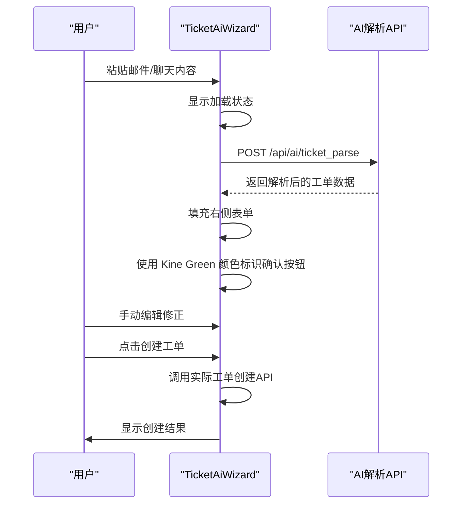
```mermaid
sequenceDiagram
participant U as "用户"
participant W as "TicketAiWizard"
participant API as "AI解析API"
U->>W : 粘贴邮件/聊天内容
W->>W : 显示加载状态
W->>API : POST /api/ai/ticket_parse
API-->>W : 返回解析后的工单数据
W->>W : 填充右侧表单
W->>W : 使用 Kine Green 颜色标识确认按钮
U->>W : 手动编辑修正
U->>W : 点击创建工单
W->>W : 调用实际工单创建API
W->>U : 显示创建结果
```

**图表来源**
- [TicketAiWizard.tsx](file://client/src/components/TicketAiWizard.tsx#L22-L50)
- [TicketAiWizard.tsx](file://client/src/components/TicketAiWizard.tsx#L110-L136)
- [TicketAiWizard.tsx](file://client/src/components/TicketAiWizard.tsx#L233-L248)

**章节来源**
- [TicketAiWizard.tsx](file://client/src/components/TicketAiWizard.tsx#L1-L268)

### AppRail 应用栏组件
**新增** 现代化的横向应用栏组件，替代传统的垂直侧边栏

- **设计理念**：采用 macOS 风格的横向应用栏，提供更直观的模块切换体验
- **功能特性**：
  - 品牌区域：显示公司 Logo，使用 Kine Yellow (#FFD700) 作为品牌标识色
  - 主导航：服务模块、文件模块（根据权限显示）、管理员模块（Admin 角色）
  - 底部操作：登出按钮
  - 活跃状态指示：当前模块高亮显示，使用 Kine Yellow (#FFD700) 色彩
- **交互设计**：悬停效果、激活状态、阴影效果，提供丰富的视觉反馈
- **响应式适配**：桌面端始终显示，移动端通过 AppRail 替代侧边栏

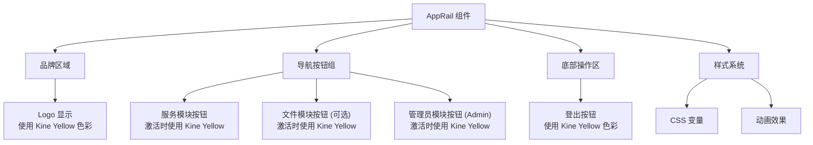
```mermaid
flowchart TD
A["AppRail 组件"] --> B["品牌区域"]
B --> C["Logo 显示<br/>使用 Kine Yellow 色彩"]
A --> D["导航按钮组"]
D --> E["服务模块按钮<br/>激活时使用 Kine Yellow"]
D --> F["文件模块按钮 (可选)<br/>激活时使用 Kine Yellow"]
D --> G["管理员模块按钮 (Admin)<br/>激活时使用 Kine Yellow"]
A --> H["底部操作区"]
H --> I["登出按钮<br/>使用 Kine Yellow 色彩"]
A --> J["样式系统"]
J --> K["CSS 变量"]
J --> L["动画效果"]
```

**图表来源**
- [AppRail.tsx](file://client/src/components/AppRail.tsx#L24-L81)
- [AppRail.tsx](file://client/src/components/AppRail.tsx#L134-L138)
- [AppRail.tsx](file://client/src/components/AppRail.tsx#L123-L127)

**章节来源**
- [AppRail.tsx](file://client/src/components/AppRail.tsx#L1-L152)
- [useNavigationState.ts](file://client/src/hooks/useNavigationState.ts#L1-L175)

### TicketCreationModal 工单创建模态框
**新增** 统一的工单创建界面，支持三种工单类型的创建

- **模态框设计**：采用 macOS 风格的 Sheet 设计，半透明背景和毛玻璃效果
- **三合一工单类型**：
  - 咨询工单（Inquiry）：蓝色主题
  - RMA工单（RMA）：橙色主题  
  - 经销商维修单（DealerRepair）：绿色主题
- **双列布局**：左侧客户信息和产品信息，右侧问题详情和附件
- **草稿保存**：自动保存到本地存储，支持断点续传
- **附件上传**：支持拖拽上传，实时预览和删除

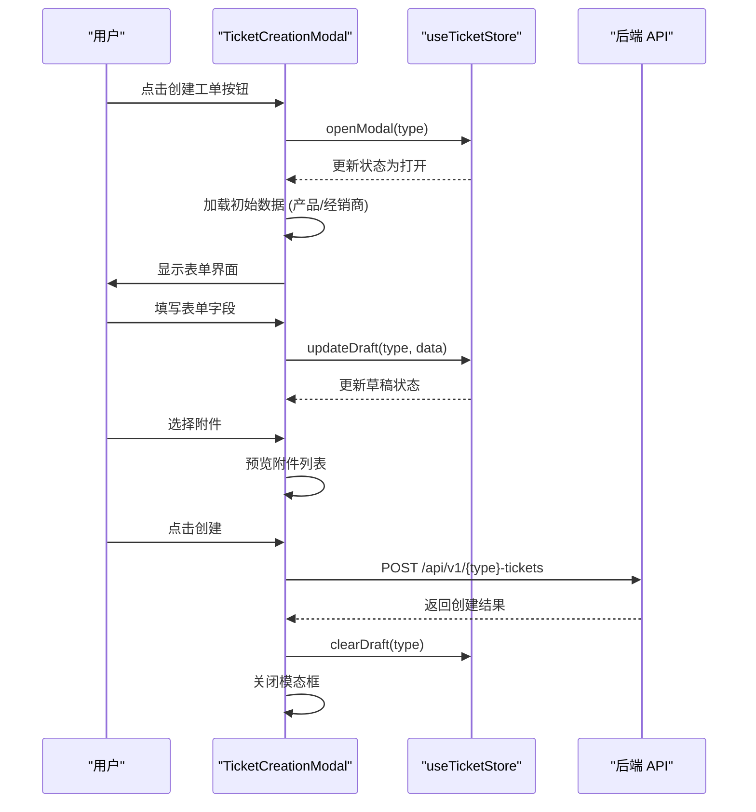
```mermaid
sequenceDiagram
participant U as "用户"
participant M as "TicketCreationModal"
participant TS as "useTicketStore"
participant API as "后端 API"
U->>M : 点击创建工单按钮
M->>TS : openModal(type)
TS-->>M : 更新状态为打开
M->>M : 加载初始数据 (产品/经销商)
M->>U : 显示表单界面
U->>M : 填写表单字段
M->>TS : updateDraft(type, data)
TS-->>M : 更新草稿状态
U->>M : 选择附件
M->>M : 预览附件列表
U->>M : 点击创建
M->>API : POST /api/v1/{type}-tickets
API-->>M : 返回创建结果
M->>TS : clearDraft(type)
M->>M : 关闭模态框
```

**图表来源**
- [TicketCreationModal.tsx](file://client/src/components/Service/TicketCreationModal.tsx#L8-L37)
- [TicketCreationModal.tsx](file://client/src/components/Service/TicketCreationModal.tsx#L60-L99)
- [useTicketStore.ts](file://client/src/store/useTicketStore.ts#L40-L67)

**章节来源**
- [TicketCreationModal.tsx](file://client/src/components/Service/TicketCreationModal.tsx#L1-L345)
- [useTicketStore.ts](file://client/src/store/useTicketStore.ts#L1-L68)

### AttachmentZone 附件上传组件
**新增** 拖拽式文件上传组件，提供直观的文件管理体验

- **拖拽上传**：支持拖拽文件到指定区域，提供视觉反馈
- **文件类型支持**：图片、视频、PDF、纯文本等
- **文件预览**：图片显示缩略图，视频显示播放图标，其他文件显示对应图标
- **交互功能**：悬停显示删除按钮，支持批量删除
- **尺寸适配**：响应式网格布局，支持不同屏幕尺寸

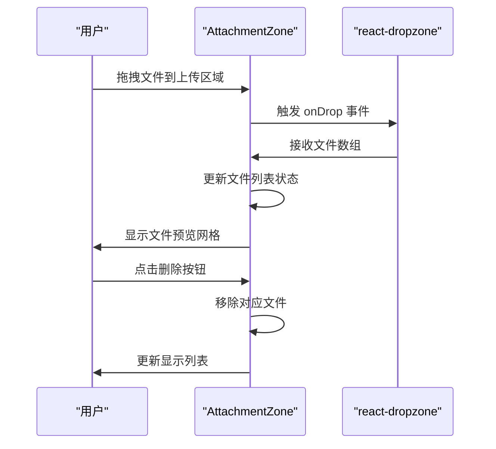
```mermaid
sequenceDiagram
participant U as "用户"
participant AZ as "AttachmentZone"
participant DZ as "react-dropzone"
U->>AZ : 拖拽文件到上传区域
AZ->>DZ : 触发 onDrop 事件
DZ->>AZ : 接收文件数组
AZ->>AZ : 更新文件列表状态
AZ->>U : 显示文件预览网格
U->>AZ : 点击删除按钮
AZ->>AZ : 移除对应文件
AZ->>U : 更新显示列表
```

**图表来源**
- [AttachmentZone.tsx](file://client/src/components/Service/AttachmentZone.tsx#L24-L32)
- [AttachmentZone.tsx](file://client/src/components/Service/AttachmentZone.tsx#L18-L22)

**章节来源**
- [AttachmentZone.tsx](file://client/src/components/Service/AttachmentZone.tsx#L1-L108)

### useCachedTickets 工单缓存钩子
**新增** 基于 SWR 的工单列表缓存架构，支持高效的工单数据管理

- **缓存策略**：基于 token+URL 的键值，启用 keepPreviousData、dedupingInterval、refreshInterval
- **预取机制**：prefetchTickets 函数支持预热缓存，提升导航体验
- **失效管理**：invalidateTicketCache 支持特定类型工单的缓存失效
- **类型安全**：支持三种工单类型（inquiry、rma、dealer）的类型定义
- **查询参数**：动态构建查询字符串，支持分页和过滤参数

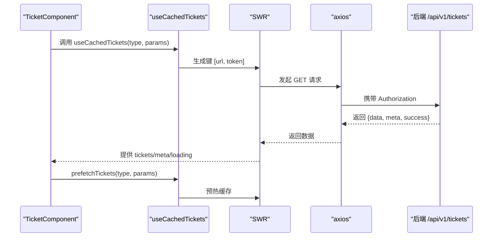
```mermaid
sequenceDiagram
participant TC as "TicketComponent"
participant UCT as "useCachedTickets"
participant SWR as "SWR"
participant AX as "axios"
participant API as "后端 /api/v1/tickets"
TC->>UCT : 调用 useCachedTickets(type, params)
UCT->>SWR : 生成键 [url, token]
SWR->>AX : 发起 GET 请求
AX->>API : 携带 Authorization
API-->>AX : 返回 {data, meta, success}
AX-->>SWR : 返回数据
SWR-->>TC : 提供 tickets/meta/loading
TC->>UCT : prefetchTickets(type, params)
UCT->>SWR : 预热缓存
```

**图表来源**
- [useCachedTickets.ts](file://client/src/hooks/useCachedTickets.ts#L73-L84)
- [useCachedTickets.ts](file://client/src/hooks/useCachedTickets.ts#L101-L121)

**章节来源**
- [useCachedTickets.ts](file://client/src/hooks/useCachedTickets.ts#L1-L136)

### useNavigationState 导航状态管理
**更新** 扩展导航状态管理，支持服务模块和文件模块的智能切换

- **模块类型**：'service' | 'files'，支持两个主要模块的切换
- **路径记忆**：localStorage 持久化存储每个模块的最后访问路径
- **智能切换**：switchModule 方法根据当前模块和目标模块进行导航
- **默认路径**：getDefaultPath 根据用户权限和当前模块返回合适的默认路径
- **路径检测**：getModuleFromPath 根据 URL 自动识别模块类型

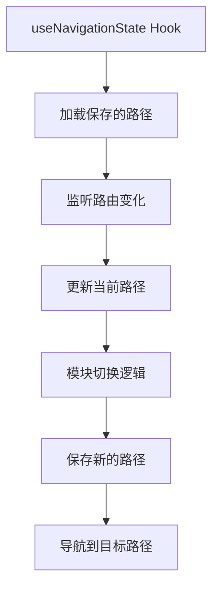
```mermaid
flowchart TD
A["useNavigationState Hook"] --> B["加载保存的路径"]
B --> C["监听路由变化"]
C --> D["更新当前路径"]
D --> E["模块切换逻辑"]
E --> F["保存新的路径"]
F --> G["导航到目标路径"]
```

**图表来源**
- [useNavigationState.ts](file://client/src/hooks/useNavigationState.ts#L97-L165)

**章节来源**
- [useNavigationState.ts](file://client/src/hooks/useNavigationState.ts#L1-L175)

### 认证与会话（useAuthStore）
- 状态：user、token
- 行为：setAuth（写入 localStorage 并更新 store）、logout（清理 localStorage 并重置 store）
- 依赖：localStorage 持久化、严格模式下的初始化从 localStorage 读取

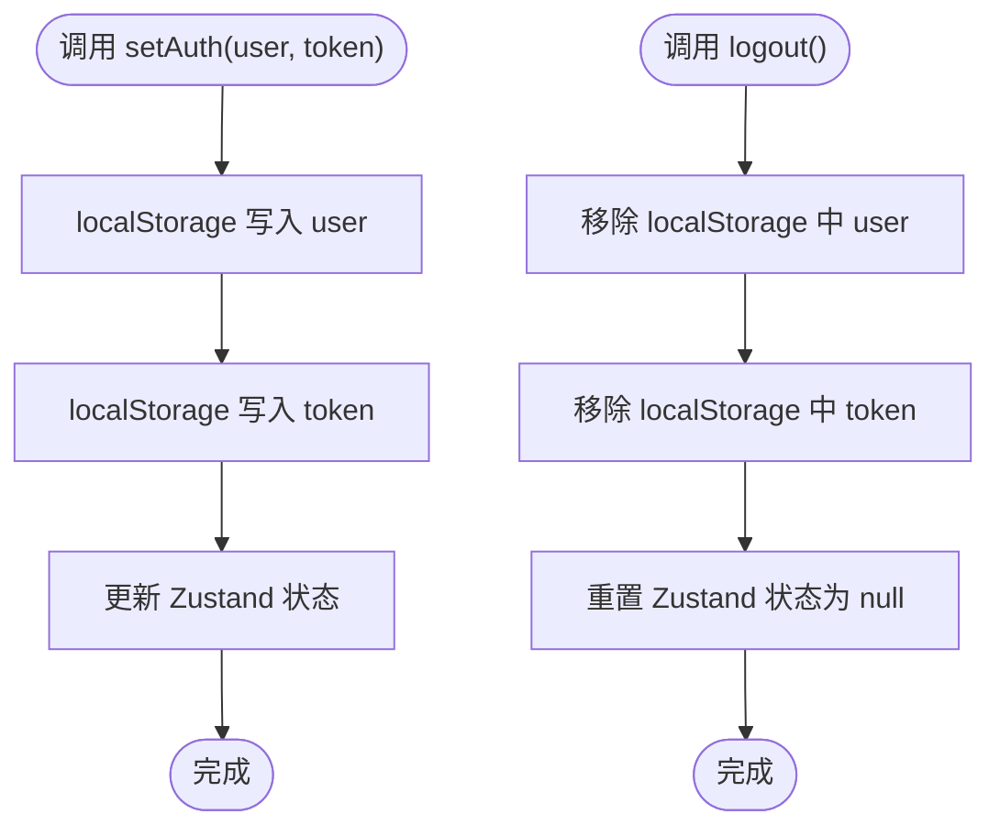
```mermaid
flowchart TD
Start(["调用 setAuth(user, token)"]) --> SaveUser["localStorage 写入 user"]
SaveUser --> SaveToken["localStorage 写入 token"]
SaveToken --> UpdateStore["更新 Zustand 状态"]
UpdateStore --> End(["完成"])
LogoutStart(["调用 logout()"]) --> RemoveUser["移除 localStorage 中 user"]
RemoveUser --> RemoveToken["移除 localStorage 中 token"]
RemoveToken --> ResetStore["重置 Zustand 状态为 null"]
ResetStore --> LogoutEnd(["完成"])
```

**图表来源**
- [useAuthStore.ts](file://client/src/store/useAuthStore.ts#L17-L30)

**章节来源**
- [useAuthStore.ts](file://client/src/store/useAuthStore.ts#L1-L31)

### 国际化（useLanguage 与 translations）
- 语言存储：localStorage 中的 longhorn_language，默认 zh
- 事件机制：简单的监听器集合，语言变更时通知订阅组件
- 翻译函数：t(key, params?)，支持占位符替换
- 日期本地化：dateLocale 工具根据语言返回 date-fns 本地化对象
- **每日一词翻译**：包含标题、听发音、释义、例句等专用翻译键
- **服务模块翻译**：新增服务记录、工单管理、上下文查询的完整翻译键
- **工单创建翻译**：新增 TicketCreationModal 的完整翻译键，包括工单类型、字段说明等
- **AI助手翻译**：新增 TicketAiWizard 的完整翻译键，包括AI解析、表单填充等功能
- **通知系统翻译**：新增 NotificationCenter 和 NotificationBell 的完整翻译键

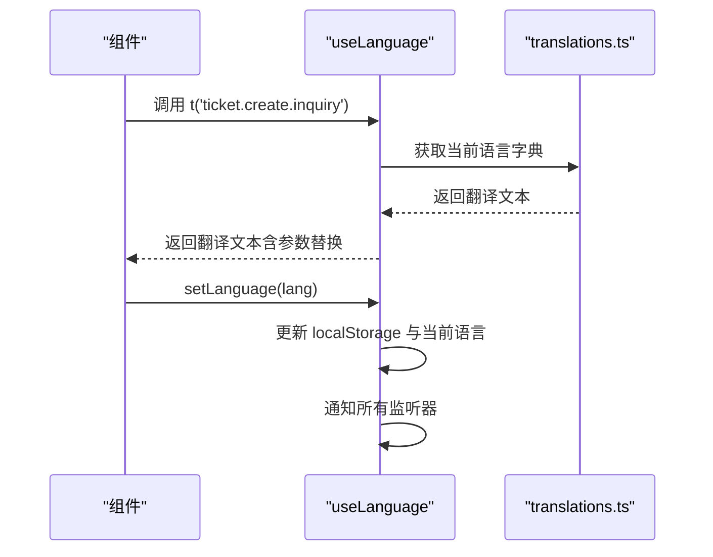
```mermaid
sequenceDiagram
participant C as "组件"
participant L as "useLanguage"
participant T as "translations.ts"
C->>L : 调用 t('ticket.create.inquiry')
L->>T : 获取当前语言字典
T-->>L : 返回翻译文本
L-->>C : 返回翻译文本含参数替换
C->>L : setLanguage(lang)
L->>L : 更新 localStorage 与当前语言
L->>L : 通知所有监听器
```

**图表来源**
- [useLanguage.ts](file://client/src/i18n/useLanguage.ts#L30-L58)
- [translations.ts](file://client/src/i18n/translations.ts#L1241-L1243)
- [dateLocale.ts](file://client/src/utils/dateLocale.ts#L1-L20)

**章节来源**
- [useLanguage.ts](file://client/src/i18n/useLanguage.ts#L1-L59)
- [translations.ts](file://client/src/i18n/translations.ts#L1-L3587)
- [dateLocale.ts](file://client/src/utils/dateLocale.ts#L1-L20)

### 文件浏览与缓存（useCachedFiles 与 FileBrowser）
- 缓存策略：SWR 基于 token+URL 的键，启用 keepPreviousData、dedupingInterval、refreshInterval
- 预取：prefetchDirectories 与组件内预取，提升导航体验
- 错误处理：isLoading、isError、error 对象，配合 Toast 展示
- 交互：FileBrowser 使用 SWR 返回的数据进行渲染，并封装上传、分享、移动、删除等操作

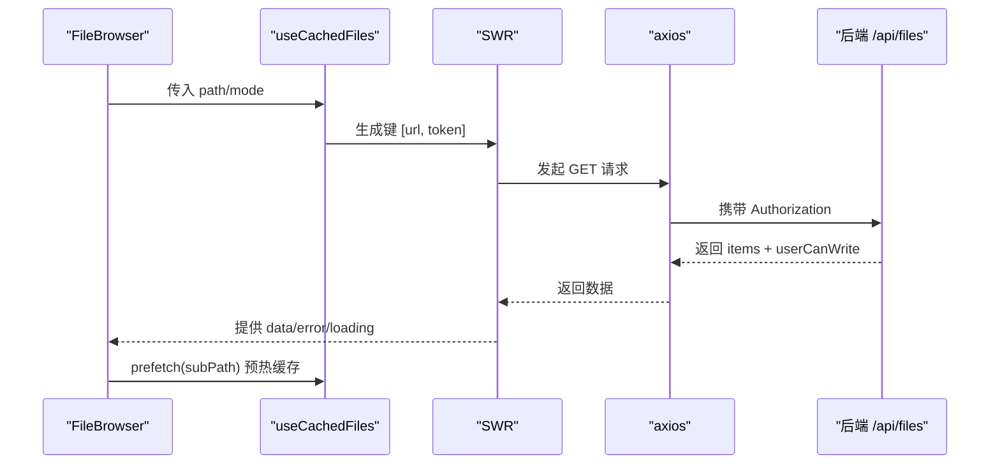
```mermaid
sequenceDiagram
participant FB as "FileBrowser"
participant Hook as "useCachedFiles"
participant SWR as "SWR"
participant AX as "axios"
participant API as "后端 /api/files"
FB->>Hook : 传入 path/mode
Hook->>SWR : 生成键 [url, token]
SWR->>AX : 发起 GET 请求
AX->>API : 携带 Authorization
API-->>AX : 返回 items + userCanWrite
AX-->>SWR : 返回数据
SWR-->>FB : 提供 data/error/loading
FB->>Hook : prefetch(subPath) 预热缓存
```

**图表来源**
- [useCachedFiles.ts](file://client/src/hooks/useCachedFiles.ts#L40-L86)
- [FileBrowser.tsx](file://client/src/components/FileBrowser.tsx#L96-L102)

**章节来源**
- [useCachedFiles.ts](file://client/src/hooks/useCachedFiles.ts#L1-L102)
- [FileBrowser.tsx](file://client/src/components/FileBrowser.tsx#L1-L200)

### 登录流程（Login）
- 表单提交：POST /api/login，成功后调用 useAuthStore.setAuth 写入用户与令牌
- 错误处理：捕获响应错误并展示本地化提示
- 视觉设计：暗色主题、毛玻璃效果、动画入场

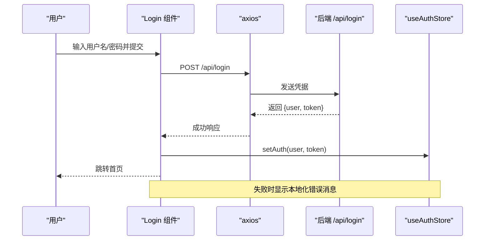
```mermaid
sequenceDiagram
participant U as "用户"
participant LG as "Login 组件"
participant AX as "axios"
participant API as "后端 /api/login"
participant AS as "useAuthStore"
U->>LG : 输入用户名/密码并提交
LG->>AX : POST /api/login
AX->>API : 发送凭据
API-->>AX : 返回 {user, token}
AX-->>LG : 成功响应
LG->>AS : setAuth(user, token)
LG-->>U : 跳转首页
Note over LG,AS : 失败时显示本地化错误消息
```

**图表来源**
- [Login.tsx](file://client/src/components/Login.tsx#L15-L27)
- [useAuthStore.ts](file://client/src/store/useAuthStore.ts#L17-L29)

**章节来源**
- [Login.tsx](file://client/src/components/Login.tsx#L1-L161)
- [useAuthStore.ts](file://client/src/store/useAuthStore.ts#L1-L31)

### 侧边栏与路径翻译（Sidebar 与 pathTranslator）
- 侧边栏：根据用户角色渲染菜单；从 /api/user/accessible-departments 获取可访问部门；支持语言切换与版本信息展示
- 路径翻译：translatePathSegment/translateFullPath 将部门代码转换为本地化显示名称

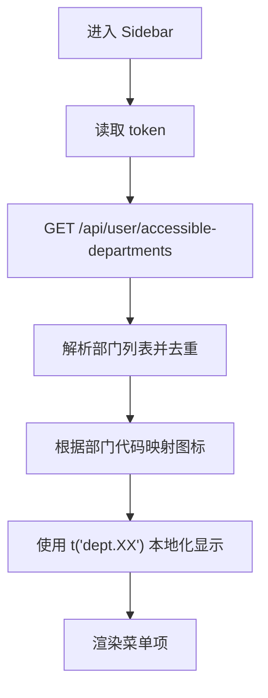
```mermaid
flowchart TD
A["进入 Sidebar"] --> B["读取 token"]
B --> C["GET /api/user/accessible-departments"]
C --> D["解析部门列表并去重"]
D --> E["根据部门代码映射图标"]
E --> F["使用 t('dept.XX') 本地化显示"]
F --> G["渲染菜单项"]
```

**图表来源**
- [App.tsx](file://client/src/App.tsx#L128-L268)
- [pathTranslator.ts](file://client/src/utils/pathTranslator.ts#L14-L52)

**章节来源**
- [App.tsx](file://client/src/App.tsx#L128-L268)
- [pathTranslator.ts](file://client/src/utils/pathTranslator.ts#L1-L53)

### 每日一词组件（DailyWord）
**更新** 新增每日一词组件的详细分析，包含徽章组件和模态框组件的完整功能

- **DailyWordBadge**：显示在顶部栏的徽章组件，包含词汇计数、语言标识、悬停效果
- **DailyWordModal**：完整的词汇学习模态框，支持多语言、多级别、语音播放、下拉菜单
- **状态管理**：useDailyWordStore 管理词汇列表、当前索引、加载状态、目标语言和级别
- **数据层**：dailyWords.ts 提供多语言词汇库，支持德语、日语、英语、中文成语
- **交互设计**：下拉菜单、语音合成、语言切换、级别选择、导航控制
- **增强功能**：新增缓存重置功能、自动清理数字后缀和括号标注

```mermaid
sequenceDiagram
participant DWB as "DailyWordBadge"
participant DWM as "DailyWordModal"
participant Store as "useDailyWordStore"
participant Data as "dailyWords.ts"
DWB->>Store : 初始化检查
Store->>Data : 获取词汇数据
Data-->>Store : 返回词汇列表
Store-->>DWB : 更新状态
DWB->>DWM : 打开模态框
DWM->>Store : 用户操作语言切换/级别选择
Store->>Data : 重新获取词汇
Data-->>Store : 返回新词汇
Store-->>DWM : 更新显示
DWM->>DWM : 语音播放/导航/缓存重置
```

**图表来源**
- [DailyWord.tsx](file://client/src/components/DailyWord.tsx#L10-L96)
- [DailyWord.tsx](file://client/src/components/DailyWord.tsx#L103-L472)
- [useDailyWordStore.ts](file://client/src/store/useDailyWordStore.ts#L41-L136)
- [dailyWords.ts](file://client/src/data/dailyWords.ts#L1085-L1133)

**章节来源**
- [DailyWord.tsx](file://client/src/components/DailyWord.tsx#L1-L472)
- [useDailyWordStore.ts](file://client/src/store/useDailyWordStore.ts#L1-L136)
- [dailyWords.ts](file://client/src/data/dailyWords.ts#L1-L1133)

### 服务记录模块（ServiceRecords）
**新增** 完整的服务记录管理模块，提供客户服务记录的完整生命周期管理

- **ServiceRecordListPage**：服务记录列表，支持搜索、筛选、分页和状态管理
- **ServiceRecordCreatePage**：服务记录创建表单，支持客户服务模式和快速查询模式
- **ServiceRecordDetailPage**：服务记录详情，展示完整信息和操作面板
- **ContextPanel**：上下文查询面板，支持按客户或序列号查询综合信息

```mermaid
sequenceDiagram
participant SRP as "ServiceRecordListPage"
participant API as "后端 API"
participant AX as "axios"
SRP->>AX : GET /api/v1/service-records?page&status&service_type&keyword
AX->>API : 发起请求
API-->>AX : 返回记录列表 + 分页信息
AX-->>SRP : 提供数据
SRP->>SRP : 渲染表格 + 状态标签 + 操作按钮
```

**图表来源**
- [ServiceRecordListPage.tsx](file://client/src/components/ServiceRecords/ServiceRecordListPage.tsx#L60-L87)
- [ServiceRecordCreatePage.tsx](file://client/src/components/ServiceRecords/ServiceRecordCreatePage.tsx#L34-L59)

**章节来源**
- [ServiceRecordListPage.tsx](file://client/src/components/ServiceRecords/ServiceRecordListPage.tsx#L1-L370)
- [ServiceRecordCreatePage.tsx](file://client/src/components/ServiceRecords/ServiceRecordCreatePage.tsx#L1-L333)

### 工单模块（Issues）
**新增** 完整的工单管理系统，支持工单的创建、管理、评论和附件处理

- **IssueListPage**：工单列表，支持状态筛选、分类筛选和搜索功能
- **IssueCreatePage**：工单创建表单，支持产品和客户选择、严重程度设置
- **IssueDetailPage**：工单详情，支持评论系统、附件管理和状态操作

```mermaid
sequenceDiagram
participant ILP as "IssueListPage"
participant IDP as "IssueDetailPage"
participant API as "后端 API"
participant AX as "axios"
ILP->>AX : GET /api/issues?page&limit&status&category&search
AX->>API : 发起请求
API-->>AX : 返回工单列表 + 总数
AX-->>ILP : 提供数据
ILP->>IDP : 点击工单查看详情
IDP->>AX : GET /api/issues/ : id
AX->>API : 获取工单详情
API-->>AX : 返回工单 + 评论 + 附件
AX-->>IDP : 提供详细数据
```

**图表来源**
- [IssueListPage.tsx](file://client/src/components/Issues/IssueListPage.tsx#L56-L81)
- [IssueDetailPage.tsx](file://client/src/components/Issues/IssueDetailPage.tsx#L94-L116)

**章节来源**
- [IssueListPage.tsx](file://client/src/components/Issues/IssueListPage.tsx#L1-L337)
- [IssueCreatePage.tsx](file://client/src/components/Issues/IssueCreatePage.tsx#L1-L441)
- [IssueDetailPage.tsx](file://client/src/components/Issues/IssueDetailPage.tsx#L1-L600)

### 上下文查询（ContextPanel）
**新增** 综合查询面板，支持按客户或产品序列号查询相关信息

- **搜索模式**：支持按客户姓名/电话/邮箱或产品序列号搜索
- **查询结果**：展示客户信息、产品信息、服务记录、工单记录和统计概览
- **导航功能**：支持直接跳转到相关详情页面

```mermaid
sequenceDiagram
participant CP as "ContextPanel"
participant API as "后端 API"
participant AX as "axios"
CP->>CP : 用户选择搜索模式
CP->>AX : GET /api/v1/context/{mode}/{query}
AX->>API : 发起查询请求
API-->>AX : 返回综合查询结果
AX-->>CP : 提供客户/产品/记录信息
CP->>CP : 渲染查询结果 + 统计卡片
```

**图表来源**
- [ContextPanel.tsx](file://client/src/components/ServiceRecords/ContextPanel.tsx#L99-L126)

**章节来源**
- [ContextPanel.tsx](file://client/src/components/ServiceRecords/ContextPanel.tsx#L1-L554)

## AI智能系统

### AIService AI服务架构
**新增** 后端AI服务架构，提供OpenAI兼容的AI推理引擎和多模型配置

- **核心功能**：
  - 多模型支持：支持chat和reasoner两种模型类型，可根据任务类型自动选择
  - 环境配置：支持通过环境变量配置API密钥、基础URL和模型名称
  - 使用统计：自动记录AI调用的令牌消耗，支持数据库持久化
  - 错误处理：完善的错误捕获和日志记录机制
- **令牌管理**：自动记录prompt_tokens、completion_tokens和total_tokens
- **权限控制**：通过权限系统控制AI功能的访问权限
- **JSON解析**：专门的ticket_parsing方法，支持从原始文本中提取工单信息

```mermaid
sequenceDiagram
participant Client as "前端客户端"
participant AIService as "AIService"
participant OpenAI as "OpenAI API"
participant DB as "数据库"
Client->>AIService : 调用 parseTicket(rawText)
AIService->>OpenAI : chat.completions.create
OpenAI-->>AIService : 返回JSON解析结果
AIService->>DB : _logUsage(model, taskType, usage)
DB-->>AIService : 确认记录
AIService-->>Client : 返回解析后的工单数据
```

**图表来源**
- [ai_service.js](file://server/service/ai_service.js#L99-L136)
- [ai_service.js](file://server/service/ai_service.js#L45-L57)

**章节来源**
- [ai_service.js](file://server/service/ai_service.js#L1-L140)

### AI权限控制系统
**新增** 基于角色的AI功能权限控制

- **权限定义**：
  - Admin：完全访问权限
  - Lead：部分访问权限，可使用AI功能
  - Member：基础权限，部分AI功能受限
- **部门特定权限**：
  - 市场/MS部门：可使用AI分析功能
  - 生产/RD部门：可使用AI修复功能
  - 研发部门：可使用高级AI分析功能
- **权限检查**：通过buildPermissions函数动态生成权限列表

**章节来源**
- [auth.js](file://server/service/routes/auth.js#L269-L270)

### AI使用统计与监控
**新增** AI服务的使用统计和监控功能

- **统计数据**：记录每次AI调用的模型名称、任务类型和令牌消耗
- **数据库持久化**：使用SQLite数据库存储AI使用历史
- **性能监控**：通过日志系统监控AI服务的性能和错误率
- **成本控制**：通过令牌消耗统计帮助控制AI服务成本

**章节来源**
- [ai_service.js](file://server/service/ai_service.js#L45-L57)

## 颜色标准化系统

### CSS 变量系统更新
**新增** 系统性颜色标准化，统一应用到整个应用程序

- **基础颜色变量**：
  - Kine Yellow (#FFD700)：主要高亮色，用于按钮、链接、强调元素
  - Kine Green (#10B981)：主要动作颜色，用于成功状态、确认按钮
  - Kine Red (#EF4444)：危险/警告色，用于错误状态、删除操作
- **渐变色彩系统**：
  - AI渐变：#00BFA5 → #8E24AA（青绿到薰衣草）
  - 标题渐变：#FFD700 → #FFA500（金黄到橙色）
- **玻璃效果色彩**：
  - --glass-border-accent: rgba(255, 210, 0, 0.3)（Kine Yellow 半透明白色）
  - --glass-shadow-accent: 0 8px 32px rgba(255, 210, 0, 0.15)

### TicketAiWizard 渐变色彩应用
**新增** 在 AI 工单助手组件中实现新的渐变色彩系统

- **标题渐变**：使用 Kine Yellow (#FFD700) 到 Kine Green (#10B981) 的渐变效果
- **分析按钮**：使用 Kine Yellow (#FFD700) 作为主要动作按钮，带阴影效果
- **确认按钮**：使用 Kine Green (#10B981) 作为确认创建按钮，体现成功状态
- **悬停效果**：统一的渐变色彩过渡效果，提升交互体验

### AdminSettings 颜色统一
**新增** 在管理设置界面中统一使用 Kine Green 颜色标识

- **成功状态标识**：使用 #10B981 作为开关控件的激活颜色
- **按钮样式**：统一使用 Kine Yellow (#FFD700) 作为高亮色
- **进度指示**：在 AI 配置界面中使用统一的颜色标识

### WikiEditorModal 渐变进度条
**新增** 在知识编辑器中应用 AI 渐变色彩系统

- **进度条渐变**：使用 #00BFA5 → #8E24AA 的渐变效果
- **AI处理状态**：通过渐变色彩指示 AI 内容分析和处理进度
- **用户体验**：提供直观的进度反馈和状态指示

### 通知系统颜色应用
**新增** 在通知系统中统一应用颜色标准化系统

- **NotificationBell**：使用 Kine Red (#EF4444) 作为未读计数的强调色
- **NotificationCenter**：使用 Kine Yellow (#FFD700) 作为主题色，Kine Green (#10B981) 作为成功状态
- **通知类型色彩**：不同类型的通知使用相应的品牌色彩标识

**章节来源**
- [index.css](file://client/src/index.css#L3-L49)
- [TicketAiWizard.tsx](file://client/src/components/TicketAiWizard.tsx#L56-L61)
- [TicketAiWizard.tsx](file://client/src/components/TicketAiWizard.tsx#L114-L127)
- [TicketAiWizard.tsx](file://client/src/components/TicketAiWizard.tsx#L233-L248)
- [AdminSettings.tsx](file://client/src/components/Admin/AdminSettings.tsx#L508-L509)
- [AdminSettings.tsx](file://client/src/components/Admin/AdminSettings.tsx#L587-L588)
- [AdminSettings.tsx](file://client/src/components/Admin/AdminSettings.tsx#L597-L597)
- [WikiEditorModal.tsx](file://client/src/components/Knowledge/WikiEditorModal.tsx#L1110-L1110)
- [NotificationBell.tsx](file://client/src/components/Notifications/NotificationBell.tsx#L72-L72)
- [NotificationCenter.tsx](file://client/src/components/Notifications/NotificationCenter.tsx#L6-L9)

## 依赖关系分析
- 构建与开发：Vite 提供开发服务器、热更新与代理；ESLint + TypeScript 提供静态检查与类型安全
- 运行时依赖：React 19、react-router-dom 7、axios、SWR、Zustand、i18n 生态、date-fns、Tailwind 相关工具、lucide-react 图标库
- 关键耦合点：组件通过 hooks 与 store 解耦；路由与布局通过 Outlet 组织；国际化通过共享 hook 注入
- **新增依赖**：react-dropzone 用于文件拖拽上传、speechSynthesis API 支持、macOS 风格 UI 组件
- **AI相关依赖**：OpenAI SDK、环境变量配置、JWT权限验证
- **颜色系统依赖**：CSS 变量系统、渐变色彩库、颜色标准化工具
- **通知系统依赖**：Zustand 状态管理、localStorage 持久化、定时轮询机制

```mermaid
graph LR
P["package.json 依赖"] --> R["React 19"]
P --> RR["react-router-dom 7"]
P --> AX["axios"]
P --> SW["swr"]
P --> ZS["zustand"]
P --> I18N["i18next + react-i18next"]
P --> DF["date-fns"]
P --> TM["tailwind-merge / clsx"]
P --> LC["lucide-react"]
P --> RDZ["react-dropzone"]
P --> OA["openai SDK"]
V["vite.config.ts"] --> Dev["开发服务器/代理"]
ESL["eslint.config.js"] --> TS["TypeScript 类型检查"]
CS["index.css 颜色系统"] --> UI["UI 组件"]
CS --> AI["AI 组件"]
CS --> ADMIN["管理组件"]
NS["通知系统"] --> ZS
NS --> LS["localStorage"]
NS --> API["后端通知API"]
```

**图表来源**
- [package.json](file://client/package.json#L12-L47)
- [vite.config.ts](file://client/vite.config.ts#L62-L93)
- [eslint.config.js](file://client/eslint.config.js#L1-L24)
- [index.css](file://client/src/index.css#L3-L49)
- [useNotificationStore.ts](file://client/src/store/useNotificationStore.ts#L46-L46)

**章节来源**
- [package.json](file://client/package.json#L1-L63)
- [vite.config.ts](file://client/vite.config.ts#L1-L94)
- [eslint.config.js](file://client/eslint.config.js#L1-L24)

## 性能考量
- 缓存与去重：SWR 的 dedupingInterval 与 keepPreviousData 提升导航流畅度；ETag 使轮询成本较低
- 预取策略：prefetchDirectories 与组件内预取减少二次打开延迟
- 状态管理：Zustand 无样板代码，避免不必要的重渲染；Toast/Confirm 采用最小必要状态
- **每日一词优化**：词汇批处理加载（100个词汇），本地存储配置，避免重复网络请求；新增缓存重置功能提升用户体验
- **服务模块优化**：服务记录和工单列表采用分页加载，支持搜索和筛选，减少一次性数据传输
- **上下文查询优化**：按需查询客户或产品信息，避免冗余数据传输
- **工单缓存优化**：useCachedTickets 通过 SWR 实现高效缓存，支持预取和失效管理
- **AppRail 优化**：横向布局减少垂直滚动，提高移动端可用性
- **附件上传优化**：AttachmentZone 支持拖拽上传，减少用户操作步骤
- **AI性能优化**：TicketAiWizard 支持输入防抖和错误重试，提升AI解析效率
- **颜色系统优化**：CSS 变量统一管理，减少重复计算，提升渲染性能
- **通知系统优化**：NotificationBell 使用 30 秒轮询间隔，避免频繁请求
- **工作台性能优化**：WorkspacePage 使用混合排序算法，支持本地状态管理
- **SLA组件优化**：SlaComponents 使用高效的计算和渲染策略
- **构建优化**：Vite 默认开启压缩与模块预构建；注入版本常量便于追踪
- 资源体积：按需引入图标与第三方库，避免全量打包

**章节来源**
- [useCachedFiles.ts](file://client/src/hooks/useCachedFiles.ts#L40-L86)
- [useDailyWordStore.ts](file://client/src/store/useDailyWordStore.ts#L62-L80)
- [useCachedTickets.ts](file://client/src/hooks/useCachedTickets.ts#L73-L84)
- [AppRail.tsx](file://client/src/components/AppRail.tsx#L134-L138)
- [AttachmentZone.tsx](file://client/src/components/Service/AttachmentZone.tsx#L24-L32)
- [TicketAiWizard.tsx](file://client/src/components/TicketAiWizard.tsx#L22-L50)
- [ServiceRecordListPage.tsx](file://client/src/components/ServiceRecords/ServiceRecordListPage.tsx#L60-L87)
- [IssueListPage.tsx](file://client/src/components/Issues/IssueListPage.tsx#L56-L81)
- [NotificationBell.tsx](file://client/src/components/Notifications/NotificationBell.tsx#L16-L21)
- [WorkspacePage.tsx](file://client/src/components/Service/WorkspacePage.tsx#L105-L148)
- [SlaComponents.tsx](file://client/src/components/Tickets/SlaComponents.tsx#L89-L118)
- [vite.config.ts](file://client/vite.config.ts#L62-L93)

## 故障排查指南
- 登录失败：检查 /api/login 是否可达、网络代理是否正确、后端返回的错误信息是否包含本地化键
- 无权限访问：确认 useAuthStore 中 token 是否存在、后端是否返回 401/403；检查路由守卫与角色判断
- 文件列表不更新：确认 SWR 键是否包含 token、是否触发 mutate；检查后端 ETag 与缓存头
- 国际化不生效：确认 localStorage 中 longhorn_language 是否为 zh/en/de/ja，useLanguage 是否正确通知组件
- **每日一词问题**：检查 /api/vocabulary/batch 接口是否正常，词汇数据格式是否正确，语音播放是否被浏览器阻止，缓存重置功能是否正常工作
- **服务模块问题**：检查 /api/v1/service-records 和 /api/issues 接口是否正常，查询参数是否正确传递
- **上下文查询问题**：检查 /api/v1/context/customer/{name} 和 /api/v1/context/serial/{sn} 接口是否正常
- **AppRail 问题**：检查模块切换逻辑、权限判断、样式是否正确加载，Kine Yellow 色彩是否正常显示
- **TicketCreationModal 问题**：检查工单类型判断、草稿保存、附件上传、API 调用
- **AttachmentZone 问题**：检查拖拽事件、文件类型验证、预览显示、删除功能
- **useCachedTickets 问题**：检查缓存键生成、预取函数、失效函数、错误处理
- **导航状态问题**：检查模块识别、路径保存、模块切换逻辑
- **TicketAiWizard 问题**：检查AI解析API连通性、输入格式、错误处理、颜色系统应用
- **AI服务问题**：检查环境变量配置、API密钥有效性、模型可用性
- **权限问题**：检查用户角色和权限列表，确认AI功能权限是否正确分配
- **颜色系统问题**：检查 CSS 变量是否正确加载，渐变色彩是否正常显示
- **AdminSettings 问题**：检查 Kine Green 颜色标识是否正确应用，AI配置界面颜色是否统一
- **WikiEditorModal 问题**：检查 AI 渐变进度条是否正常显示，颜色过渡效果是否正确
- **服务导航问题**：检查 ServiceNavigation 的展开状态持久化、路径匹配逻辑、图标显示
- **通知系统问题**：检查 NotificationBell 的轮询机制、NotificationCenter 的点击外部关闭、通知类型映射
- **SLA组件问题**：检查 SlaComponents 的色彩计算、时间计算、状态判断
- **工作台问题**：检查 WorkspacePage 的数据聚合、筛选排序、状态管理
- **服务概览问题**：检查 ServiceOverviewPage 的数据计算、图表渲染、交互逻辑
- **版本信息异常**：确认 Vite define 常量注入是否生效，构建脚本是否执行 git 命令，当前版本显示为 12.3.109

**章节来源**
- [Login.tsx](file://client/src/components/Login.tsx#L15-L27)
- [useAuthStore.ts](file://client/src/store/useAuthStore.ts#L17-L30)
- [useCachedFiles.ts](file://client/src/hooks/useCachedFiles.ts#L58-L68)
- [useLanguage.ts](file://client/src/i18n/useLanguage.ts#L22-L26)
- [useDailyWordStore.ts](file://client/src/store/useDailyWordStore.ts#L62-L80)
- [AppRail.tsx](file://client/src/components/AppRail.tsx#L134-L138)
- [TicketCreationModal.tsx](file://client/src/components/Service/TicketCreationModal.tsx#L60-L99)
- [AttachmentZone.tsx](file://client/src/components/Service/AttachmentZone.tsx#L18-L22)
- [useCachedTickets.ts](file://client/src/hooks/useCachedTickets.ts#L101-L135)
- [useNavigationState.ts](file://client/src/hooks/useNavigationState.ts#L135-L146)
- [TicketAiWizard.tsx](file://client/src/components/TicketAiWizard.tsx#L22-L50)
- [ai_service.js](file://server/service/ai_service.js#L8-L26)
- [auth.js](file://server/service/routes/auth.js#L269-L270)
- [ServiceRecordListPage.tsx](file://client/src/components/ServiceRecords/ServiceRecordListPage.tsx#L60-L87)
- [IssueListPage.tsx](file://client/src/components/Issues/IssueListPage.tsx#L56-L81)
- [AdminSettings.tsx](file://client/src/components/Admin/AdminSettings.tsx#L508-L509)
- [WikiEditorModal.tsx](file://client/src/components/Knowledge/WikiEditorModal.tsx#L1110-L1110)
- [ServiceNavigation.tsx](file://client/src/components/Service/ServiceNavigation.tsx#L117-L142)
- [NotificationCenter.tsx](file://client/src/components/Notifications/NotificationCenter.tsx#L204-L234)
- [NotificationBell.tsx](file://client/src/components/Notifications/NotificationBell.tsx#L16-L21)
- [SlaComponents.tsx](file://client/src/components/Tickets/SlaComponents.tsx#L89-L118)
- [WorkspacePage.tsx](file://client/src/components/Service/WorkspacePage.tsx#L50-L89)
- [ServiceOverviewPage.tsx](file://client/src/components/Service/ServiceOverviewPage.tsx#L58-L136)
- [vite.config.ts](file://client/vite.config.ts#L64-L71)
- [App.tsx](file://client/src/App.tsx#L1456-L1475)

## 结论
Longhorn 前端以 React 19 + TypeScript + Vite 为基础，结合 Zustand、SWR、react-router-dom 与自研国际化方案，实现了清晰的职责分离与良好的用户体验。通过 SWR 缓存与预取策略、Zustand 状态管理与严格的类型约束，系统在可维护性与性能之间取得平衡。

**版本更新** 客户端版本已从 12.3.107 升级到 12.3.109，反映了本次更新中的版本号变更。

**新增功能总结**：
- **统一服务导航架构**：ServiceNavigation 提供完整的服务模块导航，支持折叠分组、活跃状态高亮、徽章计数
- **完整通知系统**：NotificationCenter 和 NotificationBell 提供 macOS 风格的通知管理，支持类型化通知和批量操作
- **SLA可视化组件**：SlaComponents 提供完整的 SLA 生命周期管理，支持优先级、状态、倒计时和状态芯片
- **工作台执行台**：WorkspacePage 提供个人执行台功能，支持工单聚合、筛选排序和 SLA 预警
- **服务概览仪表盘**：ServiceOverviewPage 提供管理仪表盘，支持团队负载分析和 SLA 健康度监控
- **现代化布局架构**：AppRail 应用栏提供更直观的模块切换体验，替代传统侧边栏
- **统一工单创建系统**：TicketCreationModal 支持三种工单类型的统一创建界面
- **增强的文件管理**：AttachmentZone 提供拖拽式文件上传，提升用户体验
- **高效的数据缓存**：useCachedTickets 基于 SWR 实现工单列表的高效缓存管理
- **智能导航系统**：useNavigationState 支持服务模块和文件模块的智能切换
- **服务记录模块**：提供完整的客户服务记录管理功能，包括列表、创建、详情和上下文查询
- **工单模块**：实现工单的全生命周期管理，支持评论、附件和状态操作
- **macOS 风格UI**：采用毛玻璃效果、圆角设计和深色主题，提升视觉体验
- **国际化扩展**：新增服务记录、工单管理和上下文查询的完整翻译支持
- **AI智能系统**：集成TicketAiWizard AI工单助手，支持从邮件/聊天记录自动解析工单信息
- **AI服务架构**：后端提供OpenAI兼容的AI推理引擎，支持多模型配置和使用统计
- **权限控制系统**：基于角色的AI功能权限控制，支持精细化权限管理
- **系统性颜色标准化**：引入 Kine Green (#10B981) 作为主要动作颜色，Kine Yellow (#FFD700) 作为高亮色
- **AI渐变色彩系统**：正式化青绿色到薰衣草色 (#00BFA5 → #8E24AA) 的渐变色彩体系
- **统一颜色应用**：在所有组件中统一应用颜色标准化系统，提升品牌一致性

**AI系统优势**：
- **提升效率**：AI自动解析工单信息，减少人工录入时间
- **降低错误**：标准化的数据提取和验证，减少人为错误
- **增强体验**：智能化的表单填充和预览功能
- **成本控制**：详细的使用统计帮助控制AI服务成本
- **安全保障**：完善的权限控制和错误处理机制
- **品牌一致性**：统一的颜色系统提升整体视觉体验

**颜色系统优势**：
- **品牌统一**：Kine Green 和 Kine Yellow 的标准化应用提升品牌识别度
- **用户体验**：渐变色彩系统提供更丰富的视觉层次和交互反馈
- **可维护性**：CSS 变量系统简化颜色管理，便于维护和更新
- **无障碍设计**：合理的色彩对比度确保良好的可访问性

**通知系统优势**：
- **及时性**：30秒轮询机制确保未读通知的及时更新
- **沉浸式体验**：macOS 风格的通知面板提供沉浸式通知体验
- **操作便捷**：支持点击外部关闭、标记已读、批量操作等便捷功能
- **类型化管理**：支持多种通知类型的分类和管理

**SLA系统优势**：
- **可视化监控**：实时显示 SLA 剩余时间和状态，支持可视化监控
- **预警机制**：自动识别 SLA 超时风险，提供及时预警
- **决策支持**：提供详细的 SLA 健康度指标，支持管理决策
- **品牌一致性**：统一的颜色系统提升 SLA 管理的专业性

建议持续完善AI功能的准确性和稳定性，增强错误边界与埋点上报，并在生产环境强化安全与监控。同时，继续完善颜色系统的应用范围，确保所有组件都遵循统一的设计规范。

## 附录

### 开发与构建配置
- 开发服务器：端口 3001，代理 /api 与 /preview 到后端
- 版本注入：构建时注入版本号、提交哈希、提交时间、构建时间，当前版本为 12.3.109
- 脚本：dev/build/lint/preview

**章节来源**
- [vite.config.ts](file://client/vite.config.ts#L72-L93)
- [package.json](file://client/package.json#L6-L11)

### 跨平台与移动端适配
- 视口设置：index.html 设置 viewport-fit=cover，适配刘海屏
- 响应式设计：组件中使用隐藏/显示逻辑与弹性布局，保证桌面与移动端体验
- 交互细节：触摸友好的按钮尺寸与反馈，侧边栏移动端遮罩与手势关闭
- **AppRail 适配**：横向应用栏在移动端提供更好的可用性，替代传统侧边栏
- **macOS 风格UI**：采用毛玻璃效果、圆角设计、深色主题，提供现代化视觉体验
- **每日一词适配**：模态框在移动端自动调整尺寸，下拉菜单支持触摸设备，缓存重置功能在移动端同样适用
- **工单创建适配**：双列布局在移动端自动调整为单列，确保表单可读性
- **AI助手适配**：TicketAiWizard 在移动端提供优化的双栏布局和输入体验
- **通知系统适配**：NotificationCenter 在移动端提供优化的显示和交互体验
- **SLA组件适配**：SlaComponents 在移动端提供响应式的显示和交互
- **工作台适配**：WorkspacePage 在移动端提供优化的视图切换和交互体验
- **颜色系统适配**：渐变色彩在不同设备上保持一致的视觉效果

**章节来源**
- [index.html](file://client/index.html#L7-L8)
- [App.tsx](file://client/src/App.tsx#L39-L64)
- [AppRail.tsx](file://client/src/components/AppRail.tsx#L24-L81)
- [DailyWord.tsx](file://client/src/components/DailyWord.tsx#L170-L185)
- [TicketCreationModal.tsx](file://client/src/components/Service/TicketCreationModal.tsx#L153-L296)
- [TicketAiWizard.tsx](file://client/src/components/TicketAiWizard.tsx#L71-L152)
- [NotificationCenter.tsx](file://client/src/components/Notifications/NotificationCenter.tsx#L298-L325)
- [SlaComponents.tsx](file://client/src/components/Tickets/SlaComponents.tsx#L219-L261)
- [WorkspacePage.tsx](file://client/src/components/Service/WorkspacePage.tsx#L186-L311)

### 每日一词功能配置
- **支持语言**：德语(de)、日语(ja)、英语(en)、中文(zh)
- **词汇级别**：
  - 德语：A1、A2、B1、B2、C1（从原来的A1-B1扩展）
  - 日语：N5、N4、N3、N2（从原来的N5-N3扩展）
  - 英语：Advanced、Elementary、Intermediate、Common Phrases（新增基础-常用短语级别）
  - 中文：Idioms、Poetry、Classical（新增诗歌-古典级别）
- **数据来源**：/api/vocabulary/batch 接口，每次获取100个词汇
- **本地存储**：仅存储语言和级别配置，不存储词汇数据以保证新鲜度
- **增强功能**：
  - 缓存重置：通过下拉菜单的"Reset Cache"选项一键清除所有词汇缓存
  - 自动清理：显示词汇时自动清除数字后缀和括号标注（如"(1)"、"[名词]"）
  - 语音播放：支持多语言发音，使用 Web Speech API

**章节来源**
- [dailyWords.ts](file://client/src/data/dailyWords.ts#L1085-L1133)
- [useDailyWordStore.ts](file://client/src/store/useDailyWordStore.ts#L41-L136)
- [DailyWord.tsx](file://client/src/components/DailyWord.tsx#L409-L415)

### 服务模块功能配置
- **服务记录模块**：
  - 支持客户服务模式和快速查询模式
  - 支持多种服务类型：咨询、技术支持、保修查询、维修申请、投诉、其他
  - 支持多种渠道：电话、邮件、微信、在线客服、上门
  - 支持多种状态：已创建、处理中、待客户反馈、已解决、自动关闭、已转工单
- **工单模块**：
  - 支持多种分类：硬件、软件、咨询、退货、投诉
  - 支持多种来源：在线反馈、线下退货、经销商反馈、内部测试
  - 支持四种严重程度：低、中、高、严重
  - 支持多种状态：待处理、已分配、处理中、等待验证、已关闭、已拒绝
- **上下文查询**：
  - 支持按客户查询和按序列号查询两种模式
  - 提供综合统计概览和相关记录展示
  - 支持快速跳转到详情页面
- **工单创建系统**：
  - 支持三种工单类型：Inquiry、RMA、DealerRepair
  - 统一的创建界面，支持草稿保存和附件上传
  - 自动加载产品和经销商数据
- **服务导航系统**：
  - 支持工作台、档案和基础信息、技术中心、管理等分组
  - 支持折叠展开和活跃状态高亮
  - 支持徽章计数显示
- **通知系统**：
  - 支持多种通知类型：mention、assignment、status_change、sla_warning、sla_breach等
  - 支持未读计数轮询和批量操作
  - 支持点击外部关闭和标记已读
- **SLA组件系统**：
  - 支持优先级标签、SLA状态标签、实时倒计时
  - 支持状态芯片和可视化进度条
  - 支持完整的 SLA 生命周期管理
- **工作台系统**：
  - 支持工单聚合和筛选排序
  - 支持视图切换和交互操作
  - 支持 SLA 预警和状态管理
- **服务概览系统**：
  - 支持关键指标展示和趋势分析
  - 支持风险工单监控和团队负载分析
  - 支持 SLA 健康度指标和可视化

**章节来源**
- [ServiceRecordListPage.tsx](file://client/src/components/ServiceRecords/ServiceRecordListPage.tsx#L8-L41)
- [IssueListPage.tsx](file://client/src/components/Issues/IssueListPage.tsx#L8-L21)
- [ContextPanel.tsx](file://client/src/components/ServiceRecords/ContextPanel.tsx#L8-L84)
- [TicketCreationModal.tsx](file://client/src/components/Service/TicketCreationModal.tsx#L103-L117)
- [useTicketStore.ts](file://client/src/store/useTicketStore.ts#L4-L20)
- [ServiceNavigation.tsx](file://client/src/components/Service/ServiceNavigation.tsx#L67-L115)
- [NotificationCenter.tsx](file://client/src/components/Notifications/NotificationCenter.tsx#L22-L34)
- [NotificationBell.tsx](file://client/src/components/Notifications/NotificationBell.tsx#L16-L21)
- [SlaComponents.tsx](file://client/src/components/Tickets/SlaComponents.tsx#L47-L144)
- [WorkspacePage.tsx](file://client/src/components/Service/WorkspacePage.tsx#L35-L177)
- [ServiceOverviewPage.tsx](file://client/src/components/Service/ServiceOverviewPage.tsx#L44-L136)

### AppRail 组件配置
- **模块类型**：'service' | 'files'，支持两个主要模块的切换
- **权限控制**：根据用户角色显示相应模块
- **活跃状态**：当前模块按钮高亮显示，带有阴影效果
- **交互反馈**：悬停时有颜色变化和背景效果
- **样式系统**：使用 CSS 变量和内联样式，支持主题切换
- **颜色应用**：统一使用 Kine Yellow (#FFD700) 作为激活状态颜色

**章节来源**
- [AppRail.tsx](file://client/src/components/AppRail.tsx#L7-L19)
- [AppRail.tsx](file://client/src/components/AppRail.tsx#L134-L138)
- [useNavigationState.ts](file://client/src/hooks/useNavigationState.ts#L172-L174)

### AttachmentZone 组件配置
- **文件类型**：支持 image/*、video/*、application/pdf、text/plain
- **拖拽行为**：拖拽进入时改变样式，提供视觉反馈
- **预览功能**：图片显示缩略图，视频显示播放图标，其他文件显示对应图标
- **删除功能**：悬停显示删除按钮，支持批量删除
- **尺寸适配**：响应式网格布局，支持不同屏幕尺寸

**章节来源**
- [AttachmentZone.tsx](file://client/src/components/Service/AttachmentZone.tsx#L6-L9)
- [AttachmentZone.tsx](file://client/src/components/Service/AttachmentZone.tsx#L24-L32)
- [AttachmentZone.tsx](file://client/src/components/Service/AttachmentZone.tsx#L61-L102)

### useCachedTickets Hook 配置
- **缓存策略**：基于 token+URL 的键值，启用 keepPreviousData、dedupingInterval、refreshInterval
- **预取机制**：prefetchTickets 支持预热缓存，提升导航体验
- **失效管理**：invalidateTicketCache 支持特定类型工单的缓存失效
- **类型安全**：支持三种工单类型（inquiry、rma、dealer）的类型定义
- **查询参数**：动态构建查询字符串，支持分页和过滤参数

**章节来源**
- [useCachedTickets.ts](file://client/src/hooks/useCachedTickets.ts#L5-L24)
- [useCachedTickets.ts](file://client/src/hooks/useCachedTickets.ts#L73-L84)
- [useCachedTickets.ts](file://client/src/hooks/useCachedTickets.ts#L101-L135)

### AI智能系统配置
- **模型配置**：支持chat和reasoner两种模型类型，可通过环境变量配置
- **API配置**：支持通过环境变量配置AI_API_KEY、AI_BASE_URL、AI_MODEL_CHAT、AI_MODEL_REASONER
- **权限配置**：通过权限系统控制AI功能的访问权限
- **使用统计**：自动记录AI调用的令牌消耗，支持数据库持久化
- **错误处理**：完善的错误捕获和日志记录机制

**章节来源**
- [ai_service.js](file://server/service/ai_service.js#L8-L26)
- [ai_service.js](file://server/service/ai_service.js#L45-L57)
- [auth.js](file://server/service/routes/auth.js#L269-L270)

### 颜色系统配置
- **基础颜色**：Kine Yellow (#FFD700)、Kine Green (#10B981)、Kine Red (#EF4444)
- **渐变色彩**：AI渐变(#00BFA5 → #8E24AA)、标题渐变(#FFD700 → #FFA500)
- **玻璃效果**：--glass-border-accent、--glass-shadow-accent
- **应用范围**：所有组件的颜色标准化应用
- **维护策略**：通过 CSS 变量统一管理，便于更新和维护

**章节来源**
- [index.css](file://client/src/index.css#L3-L49)
- [TicketAiWizard.tsx](file://client/src/components/TicketAiWizard.tsx#L56-L61)
- [TicketAiWizard.tsx](file://client/src/components/TicketAiWizard.tsx#L114-L127)
- [AdminSettings.tsx](file://client/src/components/Admin/AdminSettings.tsx#L508-L509)
- [WikiEditorModal.tsx](file://client/src/components/Knowledge/WikiEditorModal.tsx#L1110-L1110)
- [NotificationBell.tsx](file://client/src/components/Notifications/NotificationBell.tsx#L72-L72)
- [NotificationCenter.tsx](file://client/src/components/Notifications/NotificationCenter.tsx#L6-L9)

### 通知系统配置
- **通知类型**：mention、assignment、status_change、sla_warning、sla_breach、new_comment、participant_added、snooze_expired、system_announce
- **轮询机制**：NotificationBell 每30秒轮询一次未读计数
- **面板配置**：NotificationCenter 支持点击外部关闭、标记已读、批量操作
- **图标映射**：根据通知类型自动选择对应的 lucide-react 图标
- **状态管理**：useNotificationStore 管理通知列表、未读计数、面板状态

**章节来源**
- [NotificationCenter.tsx](file://client/src/components/Notifications/NotificationCenter.tsx#L22-L34)
- [NotificationBell.tsx](file://client/src/components/Notifications/NotificationBell.tsx#L16-L21)
- [useNotificationStore.ts](file://client/src/store/useNotificationStore.ts#L46-L142)

### SLA组件配置
- **优先级配置**：P0使用Kine Red，P1使用Kine Yellow，P2使用Kine Blue
- **SLA状态配置**：normal使用Kine Green，warning使用Kine Yellow，breached使用Kine Red
- **状态芯片配置**：根据工单节点自动选择相应的色彩和标签
- **倒计时配置**：基于优先级估算总时间，提供精确的剩余时间显示
- **可视化配置**：支持进度条和圆环图等多种可视化形式

**章节来源**
- [SlaComponents.tsx](file://client/src/components/Tickets/SlaComponents.tsx#L14-L18)
- [SlaComponents.tsx](file://client/src/components/Tickets/SlaComponents.tsx#L21-L37)
- [SlaComponents.tsx](file://client/src/components/Tickets/SlaComponents.tsx#L294-L308)

### 工作台配置
- **视图配置**：inbox、assigned、sla_warning、all四种视图
- **筛选配置**：支持搜索、优先级、状态等多维度筛选
- **排序配置**：混合排序算法，支持紧急/超时优先、收藏次之、剩余时间升序
- **状态配置**：支持收藏、静音、状态切换等操作
- **数据配置**：从多个工单来源聚合数据，提供统一的视图

**章节来源**
- [WorkspacePage.tsx](file://client/src/components/Service/WorkspacePage.tsx#L33-L44)
- [WorkspacePage.tsx](file://client/src/components/Service/WorkspacePage.tsx#L105-L148)
- [WorkspacePage.tsx](file://client/src/components/Service/WorkspacePage.tsx#L157-L168)

### 服务概览配置
- **指标配置**：待处理工单、今日完成、平均响应时间、P0紧急工单
- **风险配置**：SLA超时风险工单监控和提醒
- **团队配置**：团队成员工单负载分析和可视化
- **健康度配置**：整体SLA健康度指标和趋势分析
- **可视化配置**：使用多种图表类型提供直观的数据展示

**章节来源**
- [ServiceOverviewPage.tsx](file://client/src/components/Service/ServiceOverviewPage.tsx#L17-L24)
- [ServiceOverviewPage.tsx](file://client/src/components/Service/ServiceOverviewPage.tsx#L248-L270)
- [ServiceOverviewPage.tsx](file://client/src/components/Service/ServiceOverviewPage.tsx#L272-L298)

### 版本信息显示配置
- **版本显示位置**：顶部栏用户菜单中显示 Longhorn 版本信息
- **版本信息内容**：
  - Longhorn 12.3.109 (提交哈希)
  - Code: 提交时间
  - v12.3.109（当前版本）
- **版本信息来源**：通过 Vite define 常量注入，构建时自动获取版本信息
- **版本更新机制**：客户端版本从 12.3.107 升级到 12.3.109

**章节来源**
- [vite.config.ts](file://client/vite.config.ts#L68-L75)
- [App.tsx](file://client/src/App.tsx#L1456-L1475)
- [package.json](file://client/package.json#L4-L4)