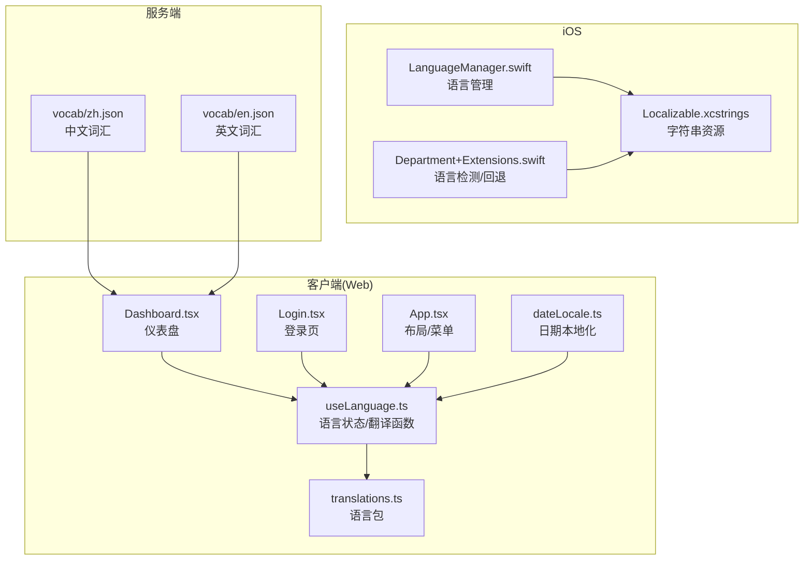
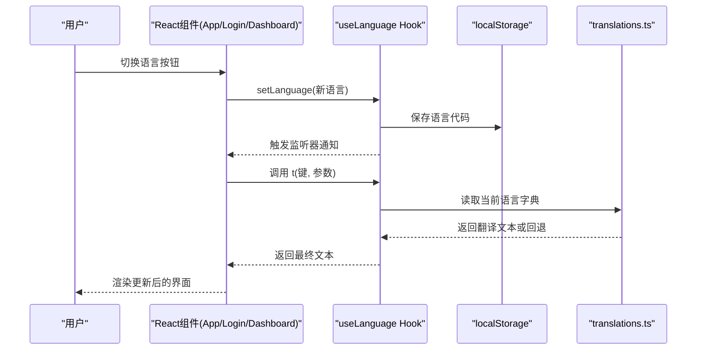
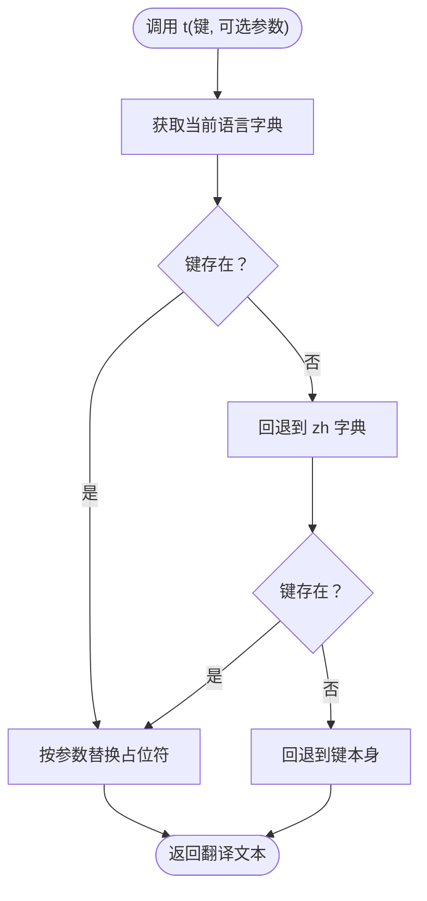
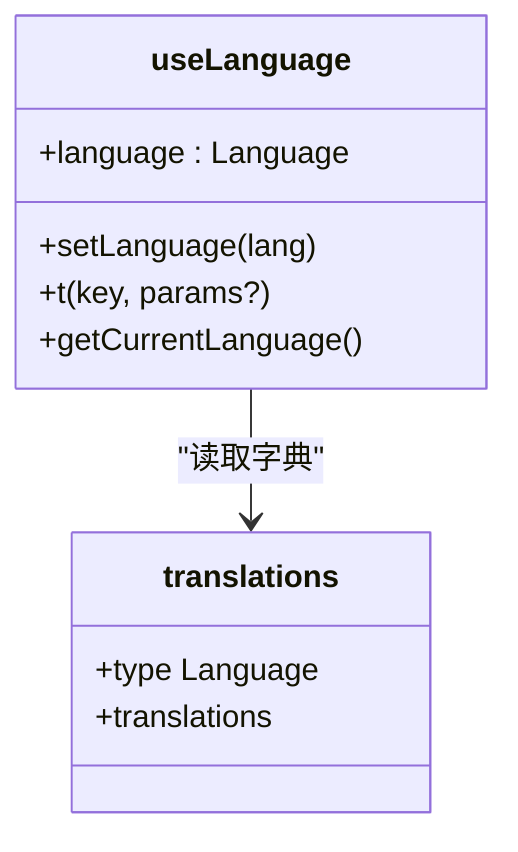
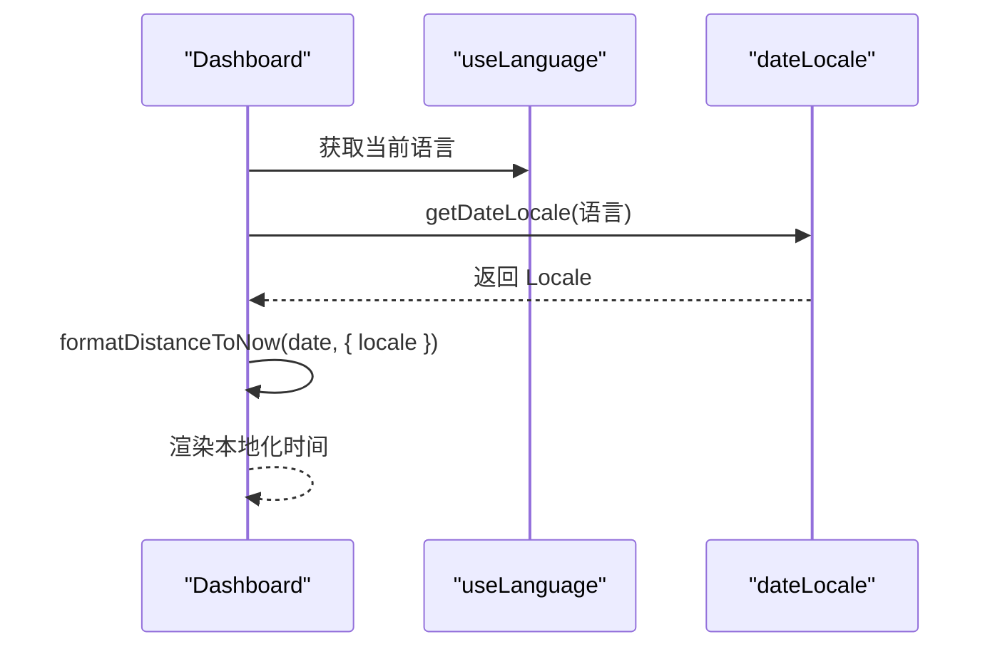
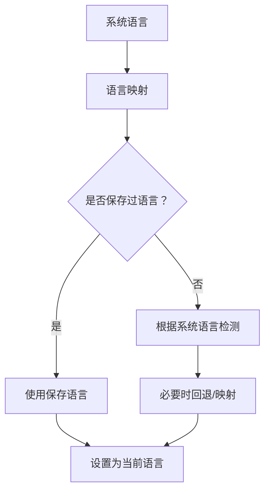
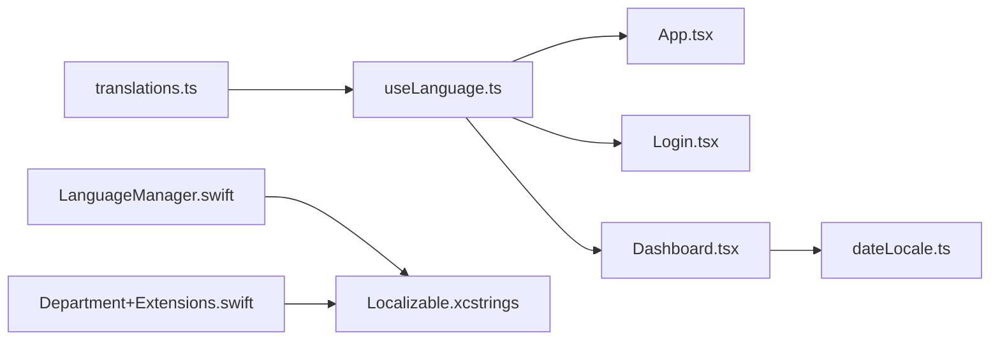

# 国际化系统

<cite>
**本文档引用的文件**
- [client/src/i18n/translations.ts](file://client/src/i18n/translations.ts)
- [client/src/i18n/useLanguage.ts](file://client/src/i18n/useLanguage.ts)
- [client/src/utils/dateLocale.ts](file://client/src/utils/dateLocale.ts)
- [client/src/App.tsx](file://client/src/App.tsx)
- [client/src/components/Login.tsx](file://client/src/components/Login.tsx)
- [client/src/components/Dashboard.tsx](file://client/src/components/Dashboard.tsx)
- [ios/LonghornApp/Services/LanguageManager.swift](file://ios/LonghornApp/Services/LanguageManager.swift)
- [ios/LonghornApp/Models/Department+Extensions.swift](file://ios/LonghornApp/Models/Department+Extensions.swift)
- [ios/LonghornApp/Resources/Localizable.xcstrings](file://ios/LonghornApp/Resources/Localizable.xcstrings)
- [server/data/vocab/zh.json](file://server/data/vocab/zh.json)
- [server/data/vocab/en.json](file://server/data/vocab/en.json)
</cite>

## 目录
1. [引言](#引言)
2. [项目结构](#项目结构)
3. [核心组件](#核心组件)
4. [架构总览](#架构总览)
5. [详细组件分析](#详细组件分析)
6. [依赖关系分析](#依赖关系分析)
7. [性能考虑](#性能考虑)
8. [故障排除指南](#故障排除指南)
9. [结论](#结论)
10. [附录](#附录)

## 引言
本文件面向 Longhorn 前端国际化系统，系统性梳理多语言支持架构、语言包组织、动态语言切换与文本翻译机制。重点覆盖以下方面：
- 语言资源管理：translations.ts 的语言包组织与键值规范
- 语言状态管理：useLanguage.ts 的状态存储、事件通知与翻译函数实现
- 本地化字符串处理：参数化占位符替换与回退策略
- 日期格式化：基于 date-fns 的本地化日期处理
- iOS 侧本地化：Swift 层语言检测与 xcstrings 资源映射
- 语言检测策略、回退机制与性能优化
- 新增语言支持方法、翻译维护流程与本地化测试策略

## 项目结构
Longhorn 前端国际化由三层构成：
- 客户端（Web）：React + TypeScript，通过 translations.ts 管理语言包，useLanguage.ts 提供语言状态与翻译函数，dateLocale.ts 提供日期本地化
- iOS：SwiftUI + Swift，通过 LanguageManager.swift 管理语言状态，Department+Extensions.swift 实现语言检测与回退，Localizable.xcstrings 提供多语言字符串资源
- 服务端：词汇表等数据资源按语言分发（如 zh.json、en.json）

图表来源
- [client/src/i18n/translations.ts](file://client/src/i18n/translations.ts#L1-L2483)
- [client/src/i18n/useLanguage.ts](file://client/src/i18n/useLanguage.ts#L1-L59)
- [client/src/utils/dateLocale.ts](file://client/src/utils/dateLocale.ts#L1-L20)
- [client/src/App.tsx](file://client/src/App.tsx#L1-L635)
- [client/src/components/Login.tsx](file://client/src/components/Login.tsx#L1-L161)
- [client/src/components/Dashboard.tsx](file://client/src/components/Dashboard.tsx#L1-L378)
- [ios/LonghornApp/Services/LanguageManager.swift](file://ios/LonghornApp/Services/LanguageManager.swift#L1-L57)
- [ios/LonghornApp/Models/Department+Extensions.swift](file://ios/LonghornApp/Models/Department+Extensions.swift#L46-L81)
- [ios/LonghornApp/Resources/Localizable.xcstrings](file://ios/LonghornApp/Resources/Localizable.xcstrings#L1-L800)
- [server/data/vocab/zh.json](file://server/data/vocab/zh.json#L1-L77)
- [server/data/vocab/en.json](file://server/data/vocab/en.json#L1-L227)

章节来源
- [client/src/i18n/translations.ts](file://client/src/i18n/translations.ts#L1-L2483)
- [client/src/i18n/useLanguage.ts](file://client/src/i18n/useLanguage.ts#L1-L59)
- [client/src/utils/dateLocale.ts](file://client/src/utils/dateLocale.ts#L1-L20)
- [client/src/App.tsx](file://client/src/App.tsx#L1-L635)
- [client/src/components/Login.tsx](file://client/src/components/Login.tsx#L1-L161)
- [client/src/components/Dashboard.tsx](file://client/src/components/Dashboard.tsx#L1-L378)
- [ios/LonghornApp/Services/LanguageManager.swift](file://ios/LonghornApp/Services/LanguageManager.swift#L1-L57)
- [ios/LonghornApp/Models/Department+Extensions.swift](file://ios/LonghornApp/Models/Department+Extensions.swift#L46-L81)
- [ios/LonghornApp/Resources/Localizable.xcstrings](file://ios/LonghornApp/Resources/Localizable.xcstrings#L1-L800)
- [server/data/vocab/zh.json](file://server/data/vocab/zh.json#L1-L77)
- [server/data/vocab/en.json](file://server/data/vocab/en.json#L1-L227)

## 核心组件
- 语言包 translations.ts：集中管理各语言的键值对，包含应用标题、通用动作、业务模块文案、错误提示等，覆盖 zh、en、de、ja 四种语言
- 语言状态 useLanguage.ts：提供 useLanguage Hook，负责语言状态存储（localStorage）、事件通知（监听器集合）、翻译函数 t 与语言切换 setLanguage
- 日期本地化 dateLocale.ts：根据当前语言返回 date-fns 的 Locale 对象，用于日期格式化
- 组件集成：App.tsx、Login.tsx、Dashboard.tsx 等组件通过 useLanguage 获取 t 函数进行渲染

章节来源
- [client/src/i18n/translations.ts](file://client/src/i18n/translations.ts#L1-L2483)
- [client/src/i18n/useLanguage.ts](file://client/src/i18n/useLanguage.ts#L1-L59)
- [client/src/utils/dateLocale.ts](file://client/src/utils/dateLocale.ts#L1-L20)
- [client/src/App.tsx](file://client/src/App.tsx#L1-L635)
- [client/src/components/Login.tsx](file://client/src/components/Login.tsx#L1-L161)
- [client/src/components/Dashboard.tsx](file://client/src/components/Dashboard.tsx#L1-L378)

## 架构总览
Longhorn 国际化采用“前端状态 + 本地资源 + 日期库”的组合方案：
- 前端状态：useLanguage.ts 使用 localStorage 存储用户语言偏好，通过简单事件总线实现跨组件通知
- 本地资源：translations.ts 内置语言包，t 函数按当前语言查找，缺失键回退到 zh，最终回退到键本身
- 日期处理：dateLocale.ts 将语言映射到 date-fns Locale，Dashboard.tsx 在展示时间时结合语言环境进行格式化
- iOS 对齐：LanguageManager.swift 与 Department+Extensions.swift 实现系统语言检测与回退，Localizable.xcstrings 提供字符串资源

图表来源
- [client/src/i18n/useLanguage.ts](file://client/src/i18n/useLanguage.ts#L1-L59)
- [client/src/i18n/translations.ts](file://client/src/i18n/translations.ts#L1-L2483)
- [client/src/App.tsx](file://client/src/App.tsx#L476-L507)

## 详细组件分析

### translations.ts：语言资源管理
- 语言枚举：支持 zh、en、de、ja
- 键值组织：按模块划分（通用、认证、仪表盘、文件浏览器、搜索、分享、管理等），便于维护与定位
- 回退策略：t 函数优先使用当前语言字典，不存在则回退到 zh，仍不存在则回退到键本身
- 参数化：支持 {{变量}} 与 {变量} 两种占位符，均会被替换

图表来源
- [client/src/i18n/useLanguage.ts](file://client/src/i18n/useLanguage.ts#L44-L55)
- [client/src/i18n/translations.ts](file://client/src/i18n/translations.ts#L1-L2483)

章节来源
- [client/src/i18n/translations.ts](file://client/src/i18n/translations.ts#L1-L2483)
- [client/src/i18n/useLanguage.ts](file://client/src/i18n/useLanguage.ts#L44-L55)

### useLanguage.ts：语言状态管理与翻译函数
- 状态存储：使用 localStorage 保存语言代码，启动时从本地读取，未设置或非法时回退到 zh
- 事件通知：内部维护监听器集合，setLanguage 后触发通知，订阅组件自动更新
- 翻译函数 t：实现三段式回退（当前语言 → zh → 键本身），并支持参数替换
- 导出接口：language（当前语言）、setLanguage（切换语言）、t（翻译函数）

图表来源
- [client/src/i18n/useLanguage.ts](file://client/src/i18n/useLanguage.ts#L1-L59)
- [client/src/i18n/translations.ts](file://client/src/i18n/translations.ts#L1-L2483)

章节来源
- [client/src/i18n/useLanguage.ts](file://client/src/i18n/useLanguage.ts#L1-L59)

### 日期格式化与本地化
- dateLocale.ts：将语言映射到 date-fns Locale，默认回退到 enUS
- Dashboard.tsx：在展示时间时，结合当前语言环境进行相对时间格式化；同时保留本地化日期字符串

图表来源
- [client/src/utils/dateLocale.ts](file://client/src/utils/dateLocale.ts#L1-L20)
- [client/src/components/Dashboard.tsx](file://client/src/components/Dashboard.tsx#L289-L313)

章节来源
- [client/src/utils/dateLocale.ts](file://client/src/utils/dateLocale.ts#L1-L20)
- [client/src/components/Dashboard.tsx](file://client/src/components/Dashboard.tsx#L1-L378)

### iOS 侧本地化
- LanguageManager.swift：根据系统语言映射到应用语言代码（zh → zh-Hans，de/ja/en 直接使用），提供 @AppStorage 的语言状态与切换逻辑
- Department+Extensions.swift：语言检测与回退逻辑，优先使用保存的语言，否则根据系统语言推断，必要时映射 zh
- Localizable.xcstrings：提供各语言字符串资源，支持参数化占位符

图表来源
- [ios/LonghornApp/Services/LanguageManager.swift](file://ios/LonghornApp/Services/LanguageManager.swift#L6-L15)
- [ios/LonghornApp/Models/Department+Extensions.swift](file://ios/LonghornApp/Models/Department+Extensions.swift#L63-L77)
- [ios/LonghornApp/Resources/Localizable.xcstrings](file://ios/LonghornApp/Resources/Localizable.xcstrings#L1-L800)

章节来源
- [ios/LonghornApp/Services/LanguageManager.swift](file://ios/LonghornApp/Services/LanguageManager.swift#L1-L57)
- [ios/LonghornApp/Models/Department+Extensions.swift](file://ios/LonghornApp/Models/Department+Extensions.swift#L46-L81)
- [ios/LonghornApp/Resources/Localizable.xcstrings](file://ios/LonghornApp/Resources/Localizable.xcstrings#L1-L800)

### 组件中的国际化使用
- App.tsx：侧边栏、顶部栏、语言切换按钮均通过 t 函数渲染，TopBar 中提供语言切换按钮组
- Login.tsx：登录页标题、占位符、按钮文案均使用 t 函数
- Dashboard.tsx：统计卡片、时间展示、错误文案均使用 t 函数，并结合 dateLocale 进行本地化时间格式化

章节来源
- [client/src/App.tsx](file://client/src/App.tsx#L128-L268)
- [client/src/App.tsx](file://client/src/App.tsx#L349-L616)
- [client/src/components/Login.tsx](file://client/src/components/Login.tsx#L1-L161)
- [client/src/components/Dashboard.tsx](file://client/src/components/Dashboard.tsx#L1-L378)

## 依赖关系分析
- translations.ts 作为唯一语言资源入口，被 useLanguage.ts 依赖
- useLanguage.ts 被各业务组件依赖（App.tsx、Login.tsx、Dashboard.tsx）
- dateLocale.ts 依赖 translations.ts 的 Language 类型，被 Dashboard.tsx 依赖
- iOS 侧 LanguageManager.swift 与 Department+Extensions.swift 依赖 Localizable.xcstrings

图表来源
- [client/src/i18n/translations.ts](file://client/src/i18n/translations.ts#L1-L2483)
- [client/src/i18n/useLanguage.ts](file://client/src/i18n/useLanguage.ts#L1-L59)
- [client/src/utils/dateLocale.ts](file://client/src/utils/dateLocale.ts#L1-L20)
- [client/src/App.tsx](file://client/src/App.tsx#L1-L635)
- [client/src/components/Login.tsx](file://client/src/components/Login.tsx#L1-L161)
- [client/src/components/Dashboard.tsx](file://client/src/components/Dashboard.tsx#L1-L378)
- [ios/LonghornApp/Services/LanguageManager.swift](file://ios/LonghornApp/Services/LanguageManager.swift#L1-L57)
- [ios/LonghornApp/Models/Department+Extensions.swift](file://ios/LonghornApp/Models/Department+Extensions.swift#L46-L81)
- [ios/LonghornApp/Resources/Localizable.xcstrings](file://ios/LonghornApp/Resources/Localizable.xcstrings#L1-L800)

章节来源
- [client/src/i18n/translations.ts](file://client/src/i18n/translations.ts#L1-L2483)
- [client/src/i18n/useLanguage.ts](file://client/src/i18n/useLanguage.ts#L1-L59)
- [client/src/utils/dateLocale.ts](file://client/src/utils/dateLocale.ts#L1-L20)
- [client/src/App.tsx](file://client/src/App.tsx#L1-L635)
- [client/src/components/Login.tsx](file://client/src/components/Login.tsx#L1-L161)
- [client/src/components/Dashboard.tsx](file://client/src/components/Dashboard.tsx#L1-L378)
- [ios/LonghornApp/Services/LanguageManager.swift](file://ios/LonghornApp/Services/LanguageManager.swift#L1-L57)
- [ios/LonghornApp/Models/Department+Extensions.swift](file://ios/LonghornApp/Models/Department+Extensions.swift#L46-L81)
- [ios/LonghornApp/Resources/Localizable.xcstrings](file://ios/LonghornApp/Resources/Localizable.xcstrings#L1-L800)

## 性能考虑
- 语言包体积：translations.ts 包含大量键值，建议按模块拆分或按需加载（当前为一次性加载）
- 事件通知：useLanguage.ts 使用 Set 维护监听器，组件卸载时应移除监听器，避免内存泄漏
- 参数替换：t 函数对每个参数执行一次正则替换，参数较多时可考虑缓存替换结果
- 日期格式化：dateLocale.ts 仅做映射，开销极小；Dashboard.tsx 的 formatDistanceToNow 会创建 Locale 对象，建议复用当前语言状态
- iOS 侧：LanguageManager.swift 使用 @AppStorage，读写成本低；Department+Extensions.swift 的语言检测逻辑简单高效

[本节为通用指导，不直接分析具体文件]

## 故障排除指南
- 语言切换无效：检查 localStorage 中 longhorn_language 是否正确写入，useLanguage.ts 的监听器是否正常触发
- 文案未翻译：确认键是否存在，是否属于当前语言字典；若缺失，t 函数会回退到 zh 或键本身
- 日期格式异常：确认当前语言映射到正确的 date-fns Locale，Dashboard.tsx 的 locale 传参是否正确
- iOS 语言不生效：检查 LanguageManager.swift 的系统语言映射逻辑，Localizable.xcstrings 是否包含对应语言条目

章节来源
- [client/src/i18n/useLanguage.ts](file://client/src/i18n/useLanguage.ts#L1-L59)
- [client/src/utils/dateLocale.ts](file://client/src/utils/dateLocale.ts#L1-L20)
- [client/src/components/Dashboard.tsx](file://client/src/components/Dashboard.tsx#L289-L313)
- [ios/LonghornApp/Services/LanguageManager.swift](file://ios/LonghornApp/Services/LanguageManager.swift#L6-L15)
- [ios/LonghornApp/Models/Department+Extensions.swift](file://ios/LonghornApp/Models/Department+Extensions.swift#L63-L77)

## 结论
Longhorn 前端国际化系统以简洁的状态管理与本地资源为核心，实现了多语言支持与动态切换。通过明确的回退策略与参数化处理，保证了在不同语言下的稳定体验。iOS 侧通过 LanguageManager.swift 与 Localizable.xcstrings 实现语言检测与资源映射，形成前后端一致的本地化方案。后续可在语言包拆分、按需加载与参数缓存等方面进一步优化。

[本节为总结性内容，不直接分析具体文件]

## 附录

### 新增语言支持方法
- 在 translations.ts 中新增语言键值对，确保覆盖主要模块文案
- 在 useLanguage.ts 中扩展受支持语言集合（当前限制为 zh、en、de、ja）
- iOS 侧：在 LanguageManager.swift 中添加 AppLanguage 成员，在 Localizable.xcstrings 中补充对应语言条目
- 服务端词汇资源：如需新增语言词汇，参考现有 vocab/*.json 结构创建新文件

章节来源
- [client/src/i18n/translations.ts](file://client/src/i18n/translations.ts#L1-L2483)
- [client/src/i18n/useLanguage.ts](file://client/src/i18n/useLanguage.ts#L12-L18)
- [ios/LonghornApp/Services/LanguageManager.swift](file://ios/LonghornApp/Services/LanguageManager.swift#L33-L56)
- [ios/LonghornApp/Resources/Localizable.xcstrings](file://ios/LonghornApp/Resources/Localizable.xcstrings#L1-L800)
- [server/data/vocab/zh.json](file://server/data/vocab/zh.json#L1-L77)
- [server/data/vocab/en.json](file://server/data/vocab/en.json#L1-L227)

### 翻译维护流程
- 统一在 translations.ts 中维护键值，避免分散在组件中
- 为每个新增键提供 zh、en、de、ja 四种语言翻译
- 使用参数化占位符统一风格，避免硬编码拼接
- 定期校验缺失键，确保 t 函数回退链路有效

章节来源
- [client/src/i18n/translations.ts](file://client/src/i18n/translations.ts#L1-L2483)
- [client/src/i18n/useLanguage.ts](file://client/src/i18n/useLanguage.ts#L44-L55)

### 本地化测试策略
- 功能测试：在 App.tsx 的语言切换按钮中逐一切换语言，验证界面文案变化
- 边界测试：故意删除某语言键，验证回退到 zh 或键本身的正确性
- 参数测试：构造包含占位符的键，验证参数替换逻辑
- iOS 测试：在 iOS 设备上切换系统语言，验证 LanguageManager.swift 的映射与回退逻辑

章节来源
- [client/src/App.tsx](file://client/src/App.tsx#L476-L507)
- [client/src/i18n/useLanguage.ts](file://client/src/i18n/useLanguage.ts#L44-L55)
- [ios/LonghornApp/Services/LanguageManager.swift](file://ios/LonghornApp/Services/LanguageManager.swift#L6-L15)