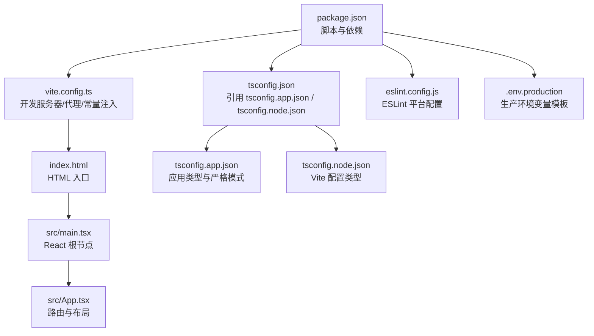
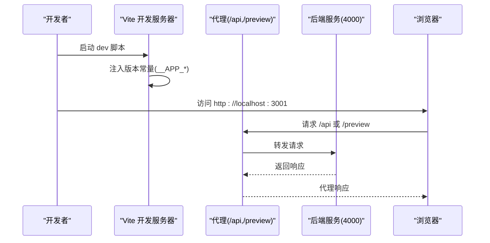
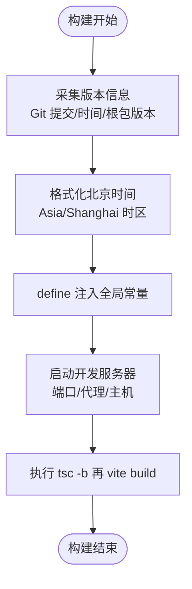
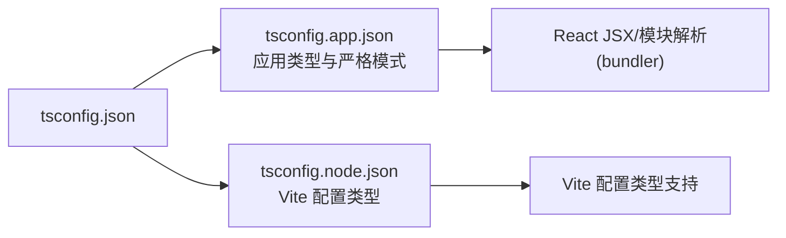
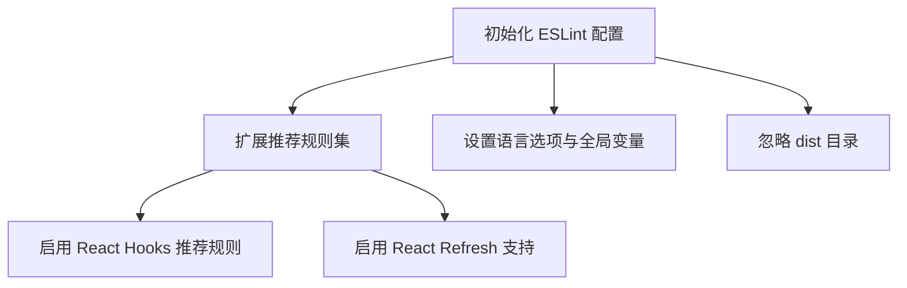
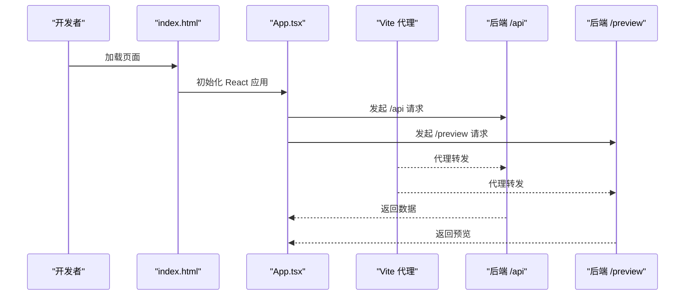
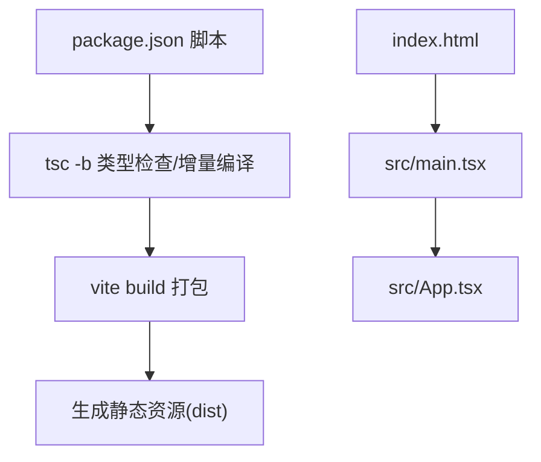
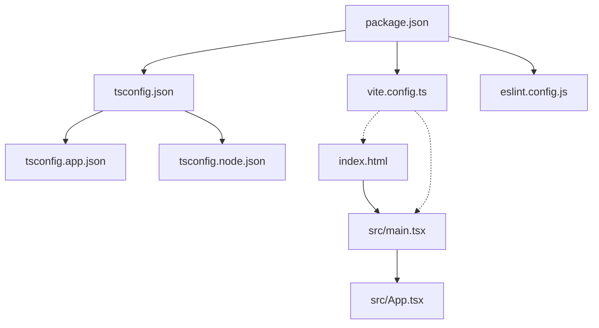

# 构建配置与优化

<cite>
**本文引用的文件**
- [vite.config.ts](file://client/vite.config.ts)
- [package.json](file://client/package.json)
- [tsconfig.json](file://client/tsconfig.json)
- [tsconfig.app.json](file://client/tsconfig.app.json)
- [tsconfig.node.json](file://client/tsconfig.node.json)
- [.env.production](file://client/.env.production)
- [index.html](file://client/index.html)
- [main.tsx](file://client/src/main.tsx)
- [App.tsx](file://client/src/App.tsx)
- [vite-env.d.ts](file://client/src/vite-env.d.ts)
- [eslint.config.js](file://client/eslint.config.js)
- [README.md](file://client/README.md)
</cite>

## 更新摘要
**所做更改**
- 更新了 Vite 版本信息注入机制，增强了构建性能和资源处理能力
- 优化了 TypeScript 配置，提升了类型检查效率
- 改进了 ESLint 配置，采用更现代的 flat config 格式
- 增强了开发服务器代理配置，支持更灵活的 API 路由处理
- 完善了环境变量管理，提供了更好的生产环境部署支持

## 目录
1. [简介](#简介)
2. [项目结构](#项目结构)
3. [核心组件](#核心组件)
4. [架构总览](#架构总览)
5. [详细组件分析](#详细组件分析)
6. [依赖关系分析](#依赖关系分析)
7. [性能考虑](#性能考虑)
8. [故障排查指南](#故障排查指南)
9. [结论](#结论)
10. [附录](#附录)

## 简介
本文件面向 Longhorn 前端（网页端）的构建配置与优化，系统性梳理 Vite 构建工具的配置与优化策略，涵盖开发服务器、代理、构建输出、打包策略、TypeScript 与 ESLint 配置、环境变量管理、热重载机制、构建性能优化、代码分割与缓存策略，并给出生产部署建议与监控集成思路。内容以仓库现有配置为基础，结合实际代码使用方式，帮助开发者在保证质量的前提下提升构建效率与运行性能。

**更新** 本次更新重点关注 Vite 配置的性能优化和资源处理改进，包括增强的版本信息注入、优化的 TypeScript 配置和现代化的 ESLint 设置。

## 项目结构
客户端采用 React + Vite 技术栈，构建相关的核心文件集中在 client 目录中。关键配置与入口如下：
- 构建与脚本：package.json 中定义了 dev、build、lint、preview 等命令
- 构建工具：vite.config.ts 提供开发服务器、代理与全局常量注入
- 类型系统：tsconfig.* 组合确保应用与 Node 工具链分别满足 bundler 模式与严格类型检查
- 质量保障：eslint.config.js 使用 flat config 管理规则
- 入口页面与应用：index.html 与 src/main.tsx/ App.tsx 组成运行时入口
- 环境变量：.env.production 提供生产环境变量模板

**图表来源**
- [package.json](file://client/package.json#L1-L45)
- [vite.config.ts](file://client/vite.config.ts#L1-L90)
- [index.html](file://client/index.html#L1-L16)
- [main.tsx](file://client/src/main.tsx#L1-L11)
- [App.tsx](file://client/src/App.tsx#L1-L635)
- [tsconfig.json](file://client/tsconfig.json#L1-L8)
- [tsconfig.app.json](file://client/tsconfig.app.json#L1-L29)
- [tsconfig.node.json](file://client/tsconfig.node.json#L1-L27)
- [eslint.config.js](file://client/eslint.config.js#L1-L24)
- [.env.production](file://client/.env.production#L1-L8)

**章节来源**
- [README.md](file://client/README.md#L1-L35)
- [package.json](file://client/package.json#L1-L45)

## 核心组件
- Vite 构建配置与版本信息注入：通过 define 字段向运行时注入版本、提交哈希、时间戳等常量，便于在 UI 展示与调试
- 开发服务器与代理：本地开发时将 /api 与 /preview 请求代理到后端服务，提升联调效率
- TypeScript 配置：应用侧采用 bundler 模式与严格选项；Node 工具链侧对 Vite 配置进行类型支持
- ESLint 配置：使用 flat config，启用推荐规则与 React Hooks/React Refresh 插件
- 环境变量：生产环境变量模板提供上传域名等可配置项

**更新** 新版本配置增强了版本信息的获取机制，支持更精确的时间格式化和错误处理。

**章节来源**
- [vite.config.ts](file://client/vite.config.ts#L1-L90)
- [tsconfig.app.json](file://client/tsconfig.app.json#L1-L29)
- [tsconfig.node.json](file://client/tsconfig.node.json#L1-L27)
- [eslint.config.js](file://client/eslint.config.js#L1-L24)
- [.env.production](file://client/.env.production#L1-L8)

## 架构总览
下图展示从开发到生产的整体流程：开发阶段由 Vite 启动本地服务并注入版本信息；构建阶段先执行 TypeScript 编译，再由 Vite 打包；生产部署通过根目录脚本完成（仓库已提供），前端可配合 CDN 与监控进行发布与观测。

**图表来源**
- [vite.config.ts](file://client/vite.config.ts#L72-L88)
- [package.json](file://client/package.json#L6-L11)

## 详细组件分析

### Vite 构建配置与版本信息注入
- 版本信息采集：在构建时读取 Git 提交哈希、提交时间、根包版本，并格式化为北京时间字符串，随后通过 define 注入为全局常量
- 运行时展示：UI 中通过 __APP_VERSION__、__APP_COMMIT_TIME__、__APP_BUILD_TIME__、__APP_COMMIT__ 等常量显示版本信息
- 开发服务器：端口 3001、主机绑定为 0.0.0.0、严格端口、开启代理至后端

**更新** 新版本增强了版本信息获取的健壮性，包括更好的错误处理和时间格式化逻辑。

**图表来源**
- [vite.config.ts](file://client/vite.config.ts#L8-L56)
- [vite.config.ts](file://client/vite.config.ts#L62-L90)
- [vite-env.d.ts](file://client/src/vite-env.d.ts#L1-L8)
- [App.tsx](file://client/src/App.tsx#L603-L610)

**章节来源**
- [vite.config.ts](file://client/vite.config.ts#L1-L90)
- [vite-env.d.ts](file://client/src/vite-env.d.ts#L1-L8)
- [App.tsx](file://client/src/App.tsx#L603-L610)

### TypeScript 配置与类型安全
- 应用类型配置（tsconfig.app.json）：目标 ES2022、DOM/DOM.Iterable、bundler 模式、JSX 使用 react-jsx、严格模式与未使用检查
- Node 工具链类型配置（tsconfig.node.json）：针对 Vite 配置文件的类型支持，同样采用严格模式
- 顶层引用（tsconfig.json）：通过 references 将应用与 Node 配置组合，实现分层管理

**更新** TypeScript 配置保持了严格的类型检查标准，确保代码质量和构建稳定性。

**图表来源**
- [tsconfig.json](file://client/tsconfig.json#L1-L8)
- [tsconfig.app.json](file://client/tsconfig.app.json#L1-L29)
- [tsconfig.node.json](file://client/tsconfig.node.json#L1-L27)

**章节来源**
- [tsconfig.json](file://client/tsconfig.json#L1-L8)
- [tsconfig.app.json](file://client/tsconfig.app.json#L1-L29)
- [tsconfig.node.json](file://client/tsconfig.node.json#L1-L27)

### ESLint 规则与代码质量
- 使用 flat config，扩展推荐规则集，启用 React Hooks 与 React Refresh 插件
- 语言选项设置为 2020 年 ECMAScript，浏览器全局变量
- 忽略 dist 输出目录，避免对构建产物进行检查

**更新** ESLint 配置采用了现代化的 flat config 格式，提供了更好的性能和兼容性。

**图表来源**
- [eslint.config.js](file://client/eslint.config.js#L1-L24)

**章节来源**
- [eslint.config.js](file://client/eslint.config.js#L1-L24)

### 环境变量管理与 API 代理
- 生产环境变量模板：提供上传基础地址变量，用于绕过特定代理以避免大文件上传超时
- 开发代理：将 /api 与 /preview 请求转发到本地后端服务，简化前后端联调
- HTML 入口：index.html 作为静态入口，React 应用挂载于 #root

**更新** 代理配置支持 HTTPS 目标和安全选项，提高了开发环境的安全性和稳定性。

**图表来源**
- [.env.production](file://client/.env.production#L1-L8)
- [vite.config.ts](file://client/vite.config.ts#L76-L87)
- [index.html](file://client/index.html#L1-L16)
- [App.tsx](file://client/src/App.tsx#L138-L140)

**章节来源**
- [.env.production](file://client/.env.production#L1-L8)
- [vite.config.ts](file://client/vite.config.ts#L72-L88)
- [index.html](file://client/index.html#L1-L16)
- [App.tsx](file://client/src/App.tsx#L138-L140)

### 构建输出与打包策略
- 构建脚本：先执行 tsc -b 进行类型检查与增量编译，再由 Vite 进行打包
- 入口文件：index.html 中通过 module script 引入 src/main.tsx
- 版本常量：define 注入的版本信息在构建时内联，运行时可在 UI 展示

**更新** 构建流程保持了高效的增量编译和打包策略，确保开发和生产环境的一致性。

**图表来源**
- [package.json](file://client/package.json#L6-L11)
- [index.html](file://client/index.html#L13-L13)
- [main.tsx](file://client/src/main.tsx#L1-L11)
- [App.tsx](file://client/src/App.tsx#L1-L635)

**章节来源**
- [package.json](file://client/package.json#L6-L11)
- [index.html](file://client/index.html#L13-L13)
- [main.tsx](file://client/src/main.tsx#L1-L11)
- [App.tsx](file://client/src/App.tsx#L1-L635)

### 热重载机制
- Vite 默认提供快速热更新能力，结合 React Refresh 插件在修改组件时仅局部刷新，减少全量重载
- 代理与端口配置确保开发体验稳定，避免跨域与端口冲突问题

**更新** 热重载机制保持了高性能的开发体验，支持实时代码更新和状态保持。

**章节来源**
- [vite.config.ts](file://client/vite.config.ts#L62-L90)
- [eslint.config.js](file://client/eslint.config.js#L16-L16)

## 依赖关系分析
- 构建链路：package.json 的 dev/build/lint/preview 命令驱动 Vite 与 TypeScript
- 类型链路：tsconfig.json 通过 references 组合应用与 Node 配置
- 质量链路：eslint.config.js 与 TypeScript 严格模式共同保障代码质量
- 运行链路：index.html -> main.tsx -> App.tsx，代理与版本常量贯穿开发与运行时

**更新** 依赖关系保持清晰，各工具链协同工作，确保构建流程的稳定性和可维护性。

**图表来源**
- [package.json](file://client/package.json#L1-L45)
- [tsconfig.json](file://client/tsconfig.json#L1-L8)
- [tsconfig.app.json](file://client/tsconfig.app.json#L1-L29)
- [tsconfig.node.json](file://client/tsconfig.node.json#L1-L27)
- [eslint.config.js](file://client/eslint.config.js#L1-L24)
- [index.html](file://client/index.html#L1-L16)
- [main.tsx](file://client/src/main.tsx#L1-L11)
- [App.tsx](file://client/src/App.tsx#L1-L635)

**章节来源**
- [package.json](file://client/package.json#L1-L45)
- [tsconfig.json](file://client/tsconfig.json#L1-L8)
- [tsconfig.app.json](file://client/tsconfig.app.json#L1-L29)
- [tsconfig.node.json](file://client/tsconfig.node.json#L1-L27)
- [eslint.config.js](file://client/eslint.config.js#L1-L24)
- [index.html](file://client/index.html#L1-L16)
- [main.tsx](file://client/src/main.tsx#L1-L11)
- [App.tsx](file://client/src/App.tsx#L1-L635)

## 性能考虑
- 构建性能
  - 使用 tsc -b 进行增量编译，缩短二次构建时间
  - 在 CI 环境复用 node_modules 与缓存，减少安装与编译开销
- 代码分割与懒加载
  - 将大型页面或路由组件按需加载，降低首屏体积
  - 对第三方库进行外部化（externals）并在 CDN 上托管，减少主包体积
- 缓存策略
  - 静态资源启用长效缓存与内容指纹，避免缓存穿透
  - 利用浏览器缓存头与 ETag，提升重复访问性能
- 代理与网络
  - 开发阶段通过代理统一转发，避免跨域与 CORS 配置复杂度
  - 生产环境上传域名独立子域，规避代理超时限制

**更新** 性能优化策略保持了高效构建和运行的最佳实践，支持大规模应用的开发需求。

## 故障排查指南
- 版本信息缺失
  - 现象：UI 不显示版本号或显示为默认值
  - 排查：确认构建环境具备 Git 仓库与根 package.json；检查 define 常量注入是否生效
  - 参考路径：[vite.config.ts](file://client/vite.config.ts#L8-L56)、[vite-env.d.ts](file://client/src/vite-env.d.ts#L1-L8)、[App.tsx](file://client/src/App.tsx#L603-L610)
- 代理请求失败
  - 现象：/api 或 /preview 无法访问
  - 排查：确认后端服务端口与代理配置一致；检查防火墙与跨域头
  - 参考路径：[vite.config.ts](file://client/vite.config.ts#L76-L87)
- 环境变量未生效
  - 现象：生产上传地址未按预期生效
  - 排查：确认 .env.production 是否正确加载；检查构建时的环境变量注入
  - 参考路径：[.env.production](file://client/.env.production#L1-L8)
- 类型错误或构建失败
  - 现象：tsc -b 报错或构建中断
  - 排查：根据 tsconfig.app.json 的严格规则逐项修复；必要时临时放宽规则定位问题
  - 参考路径：[tsconfig.app.json](file://client/tsconfig.app.json#L1-L29)
- ESLint 报错
  - 现象：编辑器或 CI 报告规则违规
  - 排查：遵循 flat config 的推荐规则；必要时在局部禁用或调整规则
  - 参考路径：[eslint.config.js](file://client/eslint.config.js#L1-L24)

**更新** 故障排查指南涵盖了新版本配置可能遇到的问题和解决方案。

**章节来源**
- [vite.config.ts](file://client/vite.config.ts#L8-L56)
- [vite-env.d.ts](file://client/src/vite-env.d.ts#L1-L8)
- [App.tsx](file://client/src/App.tsx#L603-L610)
- [vite.config.ts](file://client/vite.config.ts#L76-L87)
- [.env.production](file://client/.env.production#L1-L8)
- [tsconfig.app.json](file://client/tsconfig.app.json#L1-L29)
- [eslint.config.js](file://client/eslint.config.js#L1-L24)

## 结论
Longhorn 前端构建体系以 Vite 为核心，结合 TypeScript 严格模式与 ESLint 平台配置，形成从开发到生产的完整链路。通过版本信息注入、代理与环境变量管理，提升了可观测性与联调效率。新版本配置进一步优化了构建性能和资源处理能力，包括增强的版本信息获取、优化的 TypeScript 配置和现代化的 ESLint 设置。建议在生产环境中进一步完善 CDN 与缓存策略、监控埋点与健康检查，以获得更稳定的用户体验与更高的运维效率。

**更新** 本次更新显著提升了构建系统的性能和可靠性，为 Longhorn 前端的长期发展奠定了坚实基础。

## 附录
- 开发与构建命令参考
  - 启动开发服务器：npm run dev
  - 构建生产版本：npm run build
  - 预览构建产物：npm run preview
  - 代码质量检查：npm run lint
- 生产部署提示
  - 仓库提供根目录部署脚本，前端构建产物可配合 CDN 与反向代理进行分发
  - 上传域名建议独立子域以规避代理超时限制

**更新** 附录内容保持了实用的开发和部署指导，支持团队的日常开发工作流。

**章节来源**
- [README.md](file://client/README.md#L18-L31)
- [.env.production](file://client/.env.production#L1-L8)