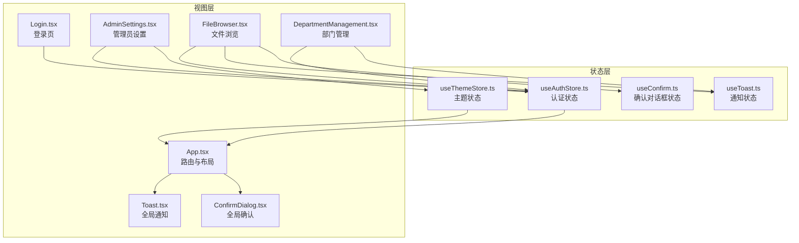
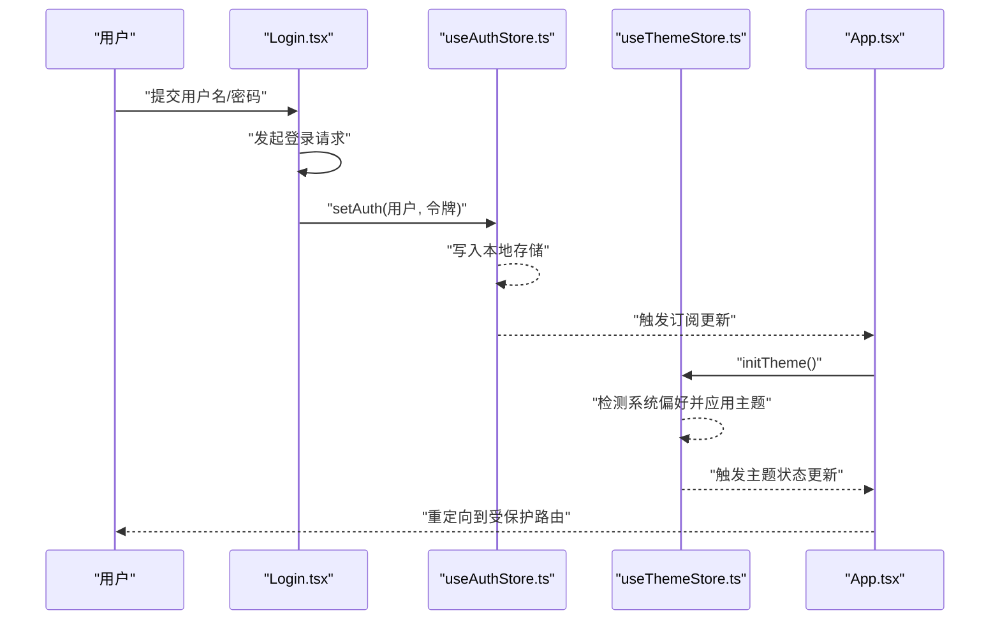
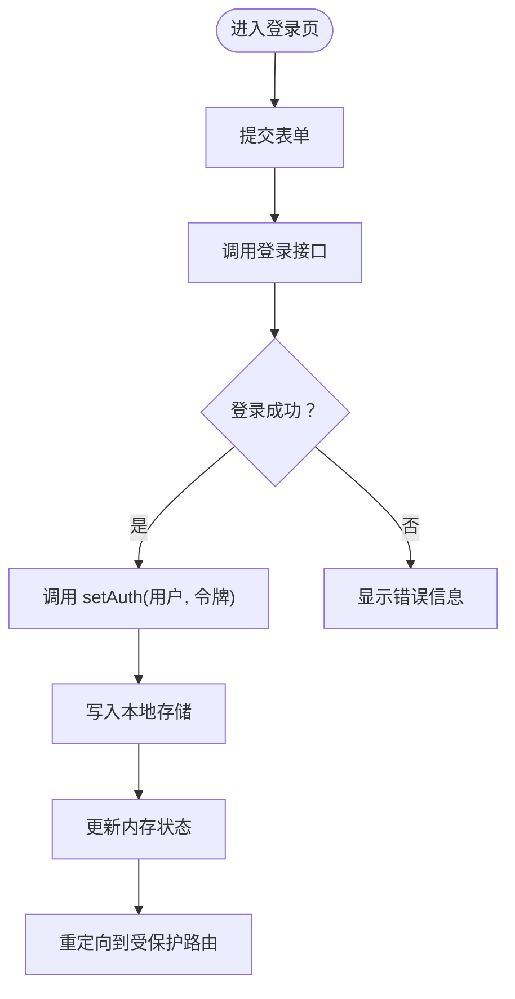
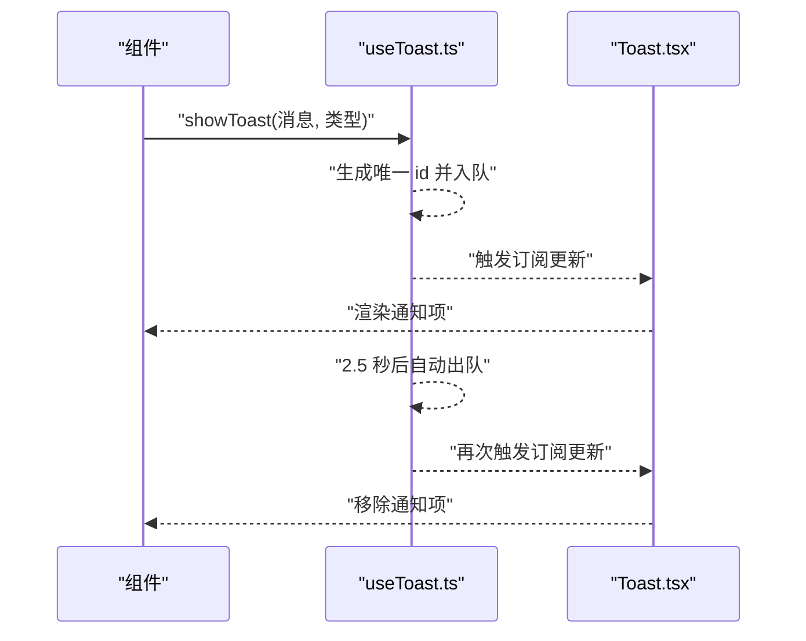
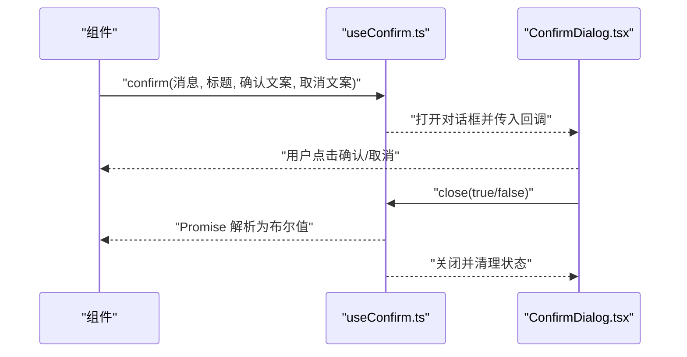
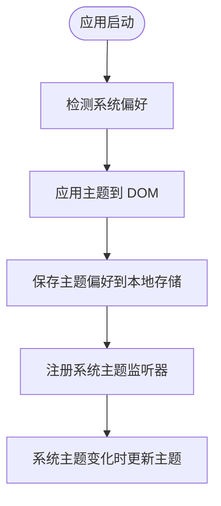
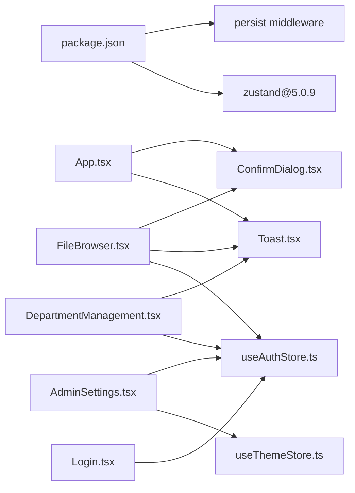

# 状态管理架构

<cite>
**本文引用的文件**
- [useAuthStore.ts](file://client/src/store/useAuthStore.ts)
- [useToast.ts](file://client/src/store/useToast.ts)
- [useConfirm.ts](file://client/src/store/useConfirm.ts)
- [useThemeStore.ts](file://client/src/store/useThemeStore.ts)
- [Login.tsx](file://client/src/components/Login.tsx)
- [Toast.tsx](file://client/src/components/Toast.tsx)
- [ConfirmDialog.tsx](file://client/src/components/ConfirmDialog.tsx)
- [AdminSettings.tsx](file://client/src/components/Admin/AdminSettings.tsx)
- [FileBrowser.tsx](file://client/src/components/FileBrowser.tsx)
- [DepartmentManagement.tsx](file://client/src/components/DepartmentManagement.tsx)
- [App.tsx](file://client/src/App.tsx)
- [package.json](file://client/package.json)
</cite>

## 更新摘要
**变更内容**
- 新增主题存储系统：完整集成 useThemeStore.ts 提供的主题管理功能
- 更新架构总览：添加主题系统在应用启动时的初始化流程
- 扩展状态模块分析：详细描述主题状态的设计原理和实现细节
- 更新依赖关系：添加主题系统与系统偏好的集成关系
- 增强持久化策略：说明主题状态的本地存储机制

## 目录
1. [简介](#简介)
2. [项目结构](#项目结构)
3. [核心组件](#核心组件)
4. [架构总览](#架构总览)
5. [详细组件分析](#详细组件分析)
6. [依赖关系分析](#依赖关系分析)
7. [性能考量](#性能考量)
8. [故障排查指南](#故障排查指南)
9. [结论](#结论)
10. [附录](#附录)

## 简介
本文件系统性梳理 Longhorn 前端基于 Zustand 的状态管理架构与实现模式，重点覆盖以下方面：
- 全局状态设计：用户认证、通知提示、确认对话框、主题管理四类核心状态模块
- 状态更新机制与订阅模式：如何通过 Zustand 的选择器订阅与状态派发实现高效渲染
- 持久化策略与同步机制：本地存储与后端会话令牌的协同
- 并发控制与错误处理：Promise 化确认流程与自动过期通知的并发安全
- 主题系统集成：完整的深浅色主题切换与系统偏好检测机制
- 调试工具与性能优化：开发体验与运行时性能建议
- 最佳实践与常见问题：迁移策略、边界条件与排障清单

## 项目结构
前端采用按功能域划分的状态模块与组件目录组织方式，核心状态位于 client/src/store，UI 组件位于 client/src/components，入口在 App.tsx 中挂载全局提示与确认对话框。

**图表来源**
- [App.tsx](file://client/src/App.tsx#L122-L124)
- [Login.tsx](file://client/src/components/Login.tsx#L1-L161)
- [Toast.tsx](file://client/src/components/Toast.tsx#L1-L45)
- [ConfirmDialog.tsx](file://client/src/components/ConfirmDialog.tsx#L1-L126)
- [AdminSettings.tsx](file://client/src/components/Admin/AdminSettings.tsx#L111-L112)
- [FileBrowser.tsx](file://client/src/components/FileBrowser.tsx#L1-L200)
- [DepartmentManagement.tsx](file://client/src/components/DepartmentManagement.tsx#L1-L200)

**章节来源**
- [App.tsx](file://client/src/App.tsx#L122-L124)
- [package.json](file://client/package.json#L12-L28)

## 核心组件
本节聚焦四大 Zustand 状态模块的设计与职责：
- 认证状态（useAuthStore）
  - 存储用户信息与访问令牌，并提供登录设置与登出清理逻辑
  - 初始值从本地存储读取，确保刷新后状态不丢失
- 通知状态（useToast）
  - 维护消息队列，支持自动过期与手动关闭
  - 使用时间戳+随机数生成唯一标识，避免重复与竞态
- 确认对话框状态（useConfirm）
  - 将模态交互封装为 Promise，便于在业务流程中等待用户决策
  - 提供键盘事件绑定，增强可访问性与易用性
- 主题状态（useThemeStore）
  - 管理深浅色主题与系统偏好检测，支持主题切换与持久化
  - 自动监听系统主题变化，实现实时响应

**章节来源**
- [useAuthStore.ts](file://client/src/store/useAuthStore.ts#L1-L31)
- [useToast.ts](file://client/src/store/useToast.ts#L1-L41)
- [useConfirm.ts](file://client/src/store/useConfirm.ts#L1-L37)
- [useThemeStore.ts](file://client/src/store/useThemeStore.ts#L1-L86)

## 架构总览
Zustand 在 Longhorn 中承担"轻量、直观、可组合"的状态中心角色。认证状态贯穿所有受保护页面；通知、确认和主题状态作为横切关注点由根组件统一挂载，供任意子组件调用。

**图表来源**
- [Login.tsx](file://client/src/components/Login.tsx#L15-L27)
- [useAuthStore.ts](file://client/src/store/useAuthStore.ts#L17-L30)
- [useThemeStore.ts](file://client/src/store/useThemeStore.ts#L39-L67)
- [App.tsx](file://client/src/App.tsx#L66-L84)

## 详细组件分析

### 认证状态模块（useAuthStore）
- 设计要点
  - 数据模型：用户对象与令牌字段
  - 初始化：从本地存储恢复初始状态
  - 更新：setAuth 写入本地存储并更新内存状态；logout 清理本地存储并清空内存
  - 订阅：组件通过选择器订阅 user/token，仅在对应字段变化时重渲染
- 并发与一致性
  - 本地存储与内存状态同步，避免多实例间状态漂移
  - 登录成功后立即写入，保证后续请求携带有效令牌
- 使用场景
  - 登录页：提交凭据后调用 setAuth
  - 受保护路由：根据 user 是否存在决定是否渲染登录页
  - 请求拦截：在需要鉴权的接口中读取 token

**图表来源**
- [Login.tsx](file://client/src/components/Login.tsx#L15-L27)
- [useAuthStore.ts](file://client/src/store/useAuthStore.ts#L17-L30)

**章节来源**
- [useAuthStore.ts](file://client/src/store/useAuthStore.ts#L1-L31)
- [Login.tsx](file://client/src/components/Login.tsx#L1-L161)
- [App.tsx](file://client/src/App.tsx#L66-L84)

### 通知状态模块（useToast）
- 设计要点
  - 消息类型：success/error/info/warning
  - 队列管理：数组维护多条消息，支持自动过期与手动关闭
  - 去重与并发：以时间戳+随机数生成唯一 id，避免竞态与重复
  - 自动过期：默认 2.5 秒后自动移除
- 使用场景
  - 文件操作反馈：上传、移动、分享、删除等
  - 系统提示：权限不足、网络异常等
- 性能与可用性
  - 仅在 toasts 非空时渲染容器，减少 DOM 开销
  - 支持手动关闭，提升用户控制感

**图表来源**
- [useToast.ts](file://client/src/store/useToast.ts#L17-L40)
- [Toast.tsx](file://client/src/components/Toast.tsx#L20-L41)

**章节来源**
- [useToast.ts](file://client/src/store/useToast.ts#L1-L41)
- [Toast.tsx](file://client/src/components/Toast.tsx#L1-L45)

### 确认对话框状态模块（useConfirm）
- 设计要点
  - Promise 化交互：confirm 返回 Promise，close 解析结果
  - 键盘支持：Esc 关闭取消，Enter 确认
  - 状态收敛：内部保存 resolve 函数，close 时调用并清理
- 使用场景
  - 删除、批量操作、危险动作前的二次确认
  - 与文件浏览器、分享功能等强交互模块配合

**图表来源**
- [useConfirm.ts](file://client/src/store/useConfirm.ts#L14-L36)
- [ConfirmDialog.tsx](file://client/src/components/ConfirmDialog.tsx#L6-L18)

**章节来源**
- [useConfirm.ts](file://client/src/store/useConfirm.ts#L1-L37)
- [ConfirmDialog.tsx](file://client/src/components/ConfirmDialog.tsx#L1-L126)

### 主题状态模块（useThemeStore）
- 设计要点
  - 主题类型：light/dark/system 三种模式
  - 系统偏好检测：通过 CSS 媒体查询检测系统深色模式偏好
  - DOM 应用：通过设置 HTML 元素的 data-theme 属性应用主题
  - 持久化：仅保存用户偏好的主题模式，不保存实际应用的主题
  - 监听机制：在系统模式下自动监听系统主题变化
- 初始化流程
  - 应用启动时调用 initTheme 设置初始主题状态
  - 根据当前模式应用相应的主题到 DOM
  - 注册系统主题变化监听器（仅在系统模式下）
- 使用场景
  - 管理员设置界面：提供主题切换按钮
  - 登录页面：应用系统偏好主题
  - 全局主题切换：支持用户自定义主题偏好

**图表来源**
- [useThemeStore.ts](file://client/src/store/useThemeStore.ts#L39-L67)
- [AdminSettings.tsx](file://client/src/components/Admin/AdminSettings.tsx#L1190-L1212)

**章节来源**
- [useThemeStore.ts](file://client/src/store/useThemeStore.ts#L1-L86)
- [AdminSettings.tsx](file://client/src/components/Admin/AdminSettings.tsx#L118-L1212)

### 状态订阅与更新机制
- 选择器订阅
  - 组件通过选择器函数订阅所需字段，避免无关更新导致的重渲染
  - 示例：登录页仅订阅 setAuth，文件浏览器订阅 user/token/toasts/confirm/theme
- 状态派发
  - 同步派发：直接 set(newState)
  - 函数式派发：set(prev => updater(prev))，保证并发安全与最终一致性
- 订阅生命周期
  - 组件卸载时自动取消订阅，避免内存泄漏

**章节来源**
- [Login.tsx](file://client/src/components/Login.tsx#L13)
- [FileBrowser.tsx](file://client/src/components/FileBrowser.tsx#L74-L75)
- [useToast.ts](file://client/src/store/useToast.ts#L23-L32)
- [useConfirm.ts](file://client/src/store/useConfirm.ts#L20-L34)
- [useThemeStore.ts](file://client/src/store/useThemeStore.ts#L33-L37)

### 状态持久化策略与同步机制
- 认证持久化
  - 用户信息与令牌写入本地存储，刷新后自动恢复
  - 登出时同时清理本地存储与内存状态
- 通知与确认状态
  - 仅内存状态，无需持久化；自动过期与手动关闭确保无残留
- 主题持久化
  - 仅保存用户偏好的主题模式（light/dark/system），不保存实际应用的主题
  - 应用启动时根据持久化的偏好和系统偏好重新应用主题
  - 系统主题变化时自动更新实际应用的主题
- 同步机制
  - 登录成功后立即写入本地存储，随后通过 set 触发订阅，保证 UI 与数据一致
  - 主题初始化时立即应用到 DOM，确保首次渲染正确
  - 文件浏览器等组件在路径切换或操作完成后主动刷新缓存

**章节来源**
- [useAuthStore.ts](file://client/src/store/useAuthStore.ts#L18-L29)
- [useToast.ts](file://client/src/store/useToast.ts#L20-L32)
- [useConfirm.ts](file://client/src/store/useConfirm.ts#L14-L35)
- [useThemeStore.ts](file://client/src/store/useThemeStore.ts#L69-L83)

### 并发控制
- 通知去重
  - 唯一 id 生成策略避免并发场景下的重复与竞态
- 确认流程
  - Promise 保证同一时刻仅有一个活跃确认对话框，close 时解析并清理 resolve
- 主题切换
  - 主题状态更新时自动应用到 DOM，避免主题不一致
  - 系统主题监听器使用防抖机制，避免频繁更新
- 文件操作
  - 文件浏览器使用 AbortController 与 SWR 缓存，避免重复请求与竞态

**章节来源**
- [useToast.ts](file://client/src/store/useToast.ts#L20-L32)
- [useConfirm.ts](file://client/src/store/useConfirm.ts#L19-L35)
- [useThemeStore.ts](file://client/src/store/useThemeStore.ts#L46-L66)
- [FileBrowser.tsx](file://client/src/components/FileBrowser.tsx#L156)

## 依赖关系分析
- Zustand 版本与依赖
  - 项目使用 zustand@^5.0.9，具备更小体积与更好的 TypeScript 支持
  - 主题系统额外使用 persist 中间件实现状态持久化
- 组件与状态模块的耦合
  - App.tsx 作为根组件挂载全局通知与确认对话框，降低各页面重复引入成本
  - 多个业务组件共享认证状态，形成统一的鉴权入口
  - 管理员设置组件集成主题切换功能，提供用户友好的主题配置界面

**图表来源**
- [package.json](file://client/package.json#L28)
- [App.tsx](file://client/src/App.tsx#L122-L124)
- [Login.tsx](file://client/src/components/Login.tsx#L3)
- [AdminSettings.tsx](file://client/src/components/Admin/AdminSettings.tsx#L7-L112)
- [FileBrowser.tsx](file://client/src/components/FileBrowser.tsx#L6-L8)
- [DepartmentManagement.tsx](file://client/src/components/DepartmentManagement.tsx#L3-L4)

**章节来源**
- [package.json](file://client/package.json#L12-L28)
- [App.tsx](file://client/src/App.tsx#L122-L124)

## 性能考量
- 渲染优化
  - 使用选择器订阅，仅在必要字段变化时重渲染
  - 通知容器按需渲染，避免不必要的 DOM 结构
  - 主题切换仅影响 DOM 属性，开销极小
- 状态粒度
  - 将大对象拆分为细粒度字段，减少无关更新
  - 主题状态分离用户偏好和实际应用主题，避免不必要的重渲染
- 异步与缓存
  - 文件列表使用 SWR 缓存与预取，降低请求频率
  - 通知与确认为纯内存状态，避免序列化开销
  - 主题状态使用持久化中间件，避免每次刷新重新计算

## 故障排查指南
- 登录后仍跳转至登录页
  - 检查本地存储是否正确写入用户信息与令牌
  - 确认路由守卫逻辑是否读取到有效的 user 对象
- 通知不消失或重复出现
  - 检查唯一 id 生成逻辑是否被覆写
  - 确认自动过期定时器是否被提前清理
- 确认对话框无法关闭
  - 检查 close 是否被调用且 resolve 是否存在
  - 确认键盘事件监听是否在 isOpen 变化时正确绑定/解绑
- 主题切换无效
  - 检查 HTML 元素是否正确设置了 data-theme 属性
  - 确认 CSS 变量是否正确定义和应用
  - 验证系统主题监听器是否正常工作
- 令牌失效导致接口失败
  - 在请求拦截器中读取最新 token
  - 登录成功后立即更新认证状态并写入本地存储

**章节来源**
- [useAuthStore.ts](file://client/src/store/useAuthStore.ts#L18-L29)
- [useToast.ts](file://client/src/store/useToast.ts#L20-L32)
- [useConfirm.ts](file://client/src/store/useConfirm.ts#L31-L35)
- [useThemeStore.ts](file://client/src/store/useThemeStore.ts#L13-L25)
- [App.tsx](file://client/src/App.tsx#L66-L84)

## 结论
Longhorn 的 Zustand 状态管理以简洁、可组合为核心理念，将认证、通知、确认和主题四大横切关注点抽象为独立模块，并通过根组件统一挂载，实现了高内聚、低耦合的状态体系。配合选择器订阅与函数式派发，既保证了开发效率，也兼顾了运行时性能。新增的主题管理系统进一步完善了用户体验，提供了灵活的主题切换和系统偏好检测功能。未来可在以下方向演进：
- 引入中间件记录状态变更轨迹，辅助调试
- 对高频更新的状态进行分片与去抖
- 增加状态快照与回滚能力，用于复杂业务流程的撤销/重做
- 扩展主题系统，支持更多自定义主题选项和动态主题生成

## 附录
- 状态调试建议
  - 在开发环境打印关键状态变更日志
  - 使用 React DevTools Profiler 观察重渲染热点
  - 监控主题切换时的 DOM 属性变化
- 迁移策略
  - 从旧版本 Zustand 迁移时，优先保证选择器订阅语义不变
  - 对需要持久化的状态，明确区分本地存储与内存状态边界
  - 主题系统迁移时注意 CSS 变量的兼容性
- 最佳实践清单
  - 优先使用函数式 set，避免外部状态污染
  - 为异步交互提供 Loading/Success/Error 三态提示
  - 对可能产生竞态的操作（如删除）使用确认对话框
  - 主题切换时确保 DOM 属性正确更新，避免视觉不一致
  - 系统主题监听器应正确处理浏览器兼容性和内存泄漏