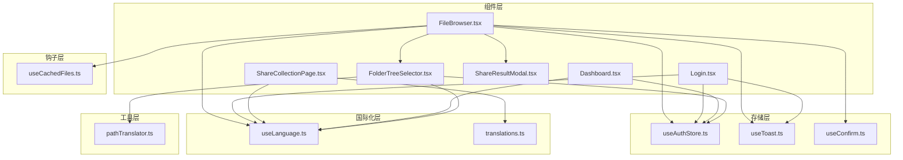
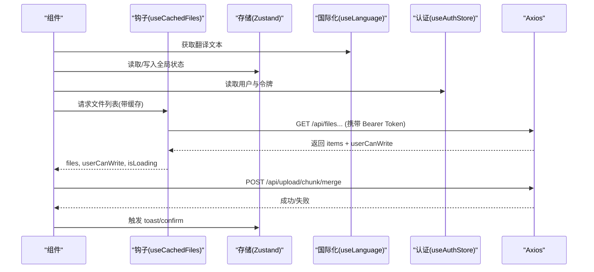
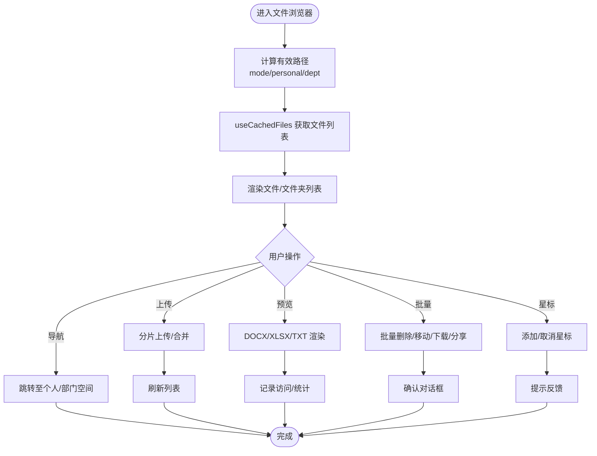
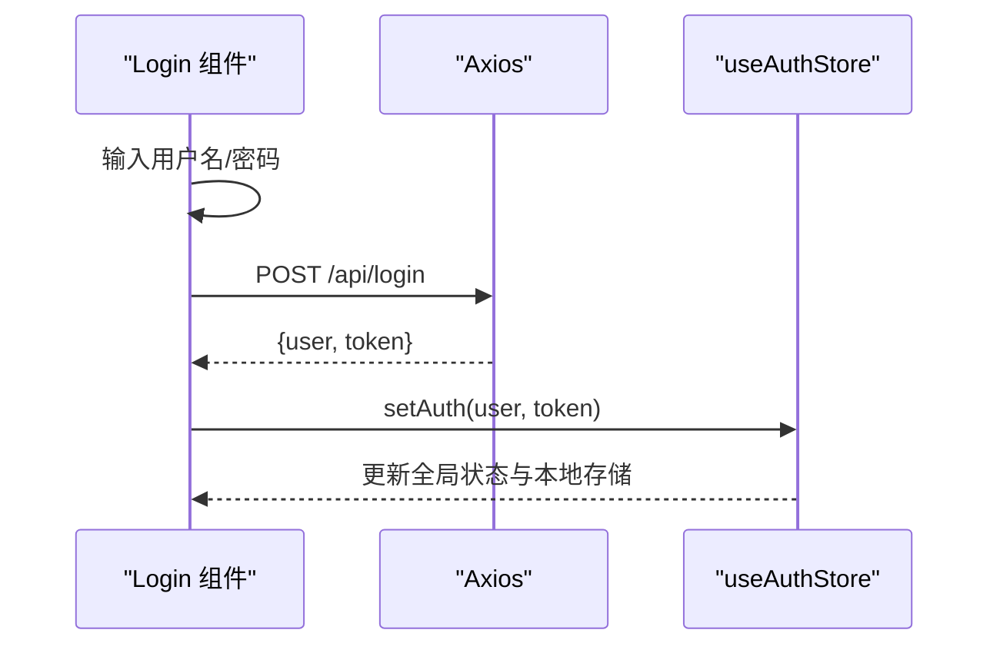
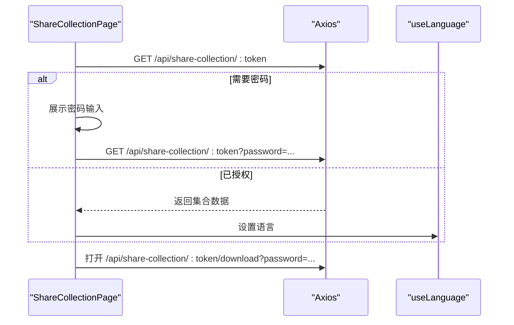
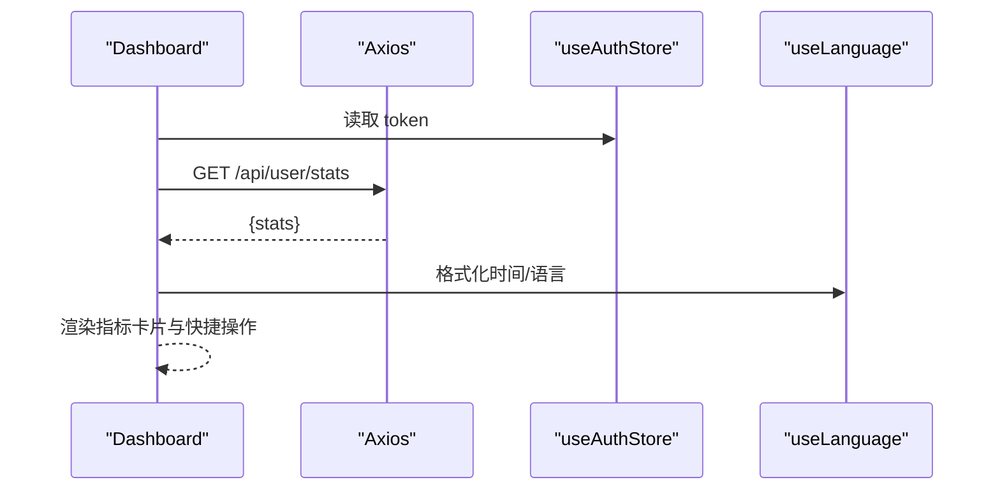
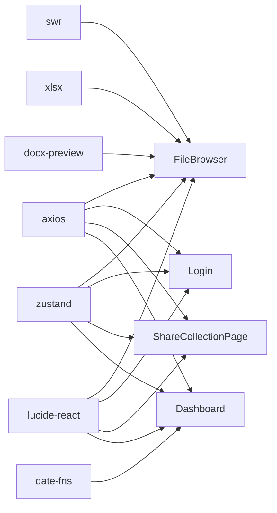

# 业务组件设计

<cite>
**本文引用的文件**
- [client/src/components/FileBrowser.tsx](file://client/src/components/FileBrowser.tsx)
- [client/src/components/Login.tsx](file://client/src/components/Login.tsx)
- [client/src/components/ShareCollectionPage.tsx](file://client/src/components/ShareCollectionPage.tsx)
- [client/src/components/Dashboard.tsx](file://client/src/components/Dashboard.tsx)
- [client/src/hooks/useCachedFiles.ts](file://client/src/hooks/useCachedFiles.ts)
- [client/src/store/useAuthStore.ts](file://client/src/store/useAuthStore.ts)
- [client/src/store/useToast.ts](file://client/src/store/useToast.ts)
- [client/src/store/useConfirm.ts](file://client/src/store/useConfirm.ts)
- [client/src/i18n/useLanguage.ts](file://client/src/i18n/useLanguage.ts)
- [client/src/i18n/translations.ts](file://client/src/i18n/translations.ts)
- [client/src/utils/pathTranslator.ts](file://client/src/utils/pathTranslator.ts)
- [client/src/components/ShareResultModal.tsx](file://client/src/components/ShareResultModal.tsx)
- [client/src/components/FolderTreeSelector.tsx](file://client/src/components/FolderTreeSelector.tsx)
- [client/package.json](file://client/package.json)
</cite>

## 目录
1. [引言](#引言)
2. [项目结构](#项目结构)
3. [核心组件](#核心组件)
4. [架构总览](#架构总览)
5. [详细组件分析](#详细组件分析)
6. [依赖关系分析](#依赖关系分析)
7. [性能考量](#性能考量)
8. [故障排查指南](#故障排查指南)
9. [结论](#结论)
10. [附录](#附录)

## 引言
本文件面向 Longhorn 前端业务组件，围绕 FileBrowser、Login、ShareCollectionPage、Dashboard 四大核心组件进行系统化技术文档梳理。重点覆盖以下方面：
- 组件职责与状态管理策略
- 数据获取与处理流程（含缓存与预取）
- 用户交互逻辑与业务规则校验
- 可扩展性、插件化与模块化设计
- 错误处理、数据验证与安全防护
- 单元测试方案、集成测试策略与性能监控方法

## 项目结构
前端采用 React + TypeScript 技术栈，结合 Zustand 状态管理、SWR 缓存、Axios 请求、国际化与路由等能力，形成清晰的分层与模块化组织：
- 组件层：按功能域划分（文件浏览、登录、分享、仪表盘等）
- 钩子层：useCachedFiles 提供统一的文件列表缓存与预取
- 存储层：useAuthStore、useToast、useConfirm 等集中管理认证、提示与确认对话框
- 国际化层：useLanguage 与 translations 提供多语言支持
- 工具层：pathTranslator 负责路径段本地化翻译

图表来源
- [client/src/components/FileBrowser.tsx](file://client/src/components/FileBrowser.tsx#L1-L2012)
- [client/src/components/Login.tsx](file://client/src/components/Login.tsx#L1-L161)
- [client/src/components/ShareCollectionPage.tsx](file://client/src/components/ShareCollectionPage.tsx#L1-L324)
- [client/src/components/Dashboard.tsx](file://client/src/components/Dashboard.tsx#L1-L378)
- [client/src/hooks/useCachedFiles.ts](file://client/src/hooks/useCachedFiles.ts#L1-L102)
- [client/src/store/useAuthStore.ts](file://client/src/store/useAuthStore.ts#L1-L31)
- [client/src/store/useToast.ts](file://client/src/store/useToast.ts#L1-L41)
- [client/src/store/useConfirm.ts](file://client/src/store/useConfirm.ts#L1-L37)
- [client/src/i18n/useLanguage.ts](file://client/src/i18n/useLanguage.ts#L1-L59)
- [client/src/i18n/translations.ts](file://client/src/i18n/translations.ts#L1-L800)
- [client/src/utils/pathTranslator.ts](file://client/src/utils/pathTranslator.ts#L1-L53)

章节来源
- [client/src/components/FileBrowser.tsx](file://client/src/components/FileBrowser.tsx#L1-L2012)
- [client/src/components/Login.tsx](file://client/src/components/Login.tsx#L1-L161)
- [client/src/components/ShareCollectionPage.tsx](file://client/src/components/ShareCollectionPage.tsx#L1-L324)
- [client/src/components/Dashboard.tsx](file://client/src/components/Dashboard.tsx#L1-L378)
- [client/src/hooks/useCachedFiles.ts](file://client/src/hooks/useCachedFiles.ts#L1-L102)
- [client/src/store/useAuthStore.ts](file://client/src/store/useAuthStore.ts#L1-L31)
- [client/src/store/useToast.ts](file://client/src/store/useToast.ts#L1-L41)
- [client/src/store/useConfirm.ts](file://client/src/store/useConfirm.ts#L1-L37)
- [client/src/i18n/useLanguage.ts](file://client/src/i18n/useLanguage.ts#L1-L59)
- [client/src/i18n/translations.ts](file://client/src/i18n/translations.ts#L1-L800)
- [client/src/utils/pathTranslator.ts](file://client/src/utils/pathTranslator.ts#L1-L53)

## 核心组件
本节对四大业务组件进行要点提炼与关联分析。

- FileBrowser：文件浏览、上传、预览、批量操作、分享、统计与权限控制的核心容器
- Login：认证入口，负责登录态写入与错误提示
- ShareCollectionPage：公开分享集合页，支持密码访问与批量下载
- Dashboard：用户个人空间概览，聚合上传、存储、星标、分享等关键指标

章节来源
- [client/src/components/FileBrowser.tsx](file://client/src/components/FileBrowser.tsx#L72-L2012)
- [client/src/components/Login.tsx](file://client/src/components/Login.tsx#L7-L161)
- [client/src/components/ShareCollectionPage.tsx](file://client/src/components/ShareCollectionPage.tsx#L31-L324)
- [client/src/components/Dashboard.tsx](file://client/src/components/Dashboard.tsx#L29-L378)

## 架构总览
组件间通过状态管理与钩子解耦，形成“组件-钩子-存储-国际化-工具”的协作链路。请求层统一由 Axios 发起，缓存层由 SWR 提供，UI 层通过 Zustand 的 toast/confirm 实现一致的交互反馈。

图表来源
- [client/src/hooks/useCachedFiles.ts](file://client/src/hooks/useCachedFiles.ts#L27-L85)
- [client/src/store/useAuthStore.ts](file://client/src/store/useAuthStore.ts#L17-L30)
- [client/src/store/useToast.ts](file://client/src/store/useToast.ts#L17-L40)
- [client/src/store/useConfirm.ts](file://client/src/store/useConfirm.ts#L14-L36)
- [client/src/i18n/useLanguage.ts](file://client/src/i18n/useLanguage.ts#L30-L58)

## 详细组件分析

### FileBrowser 组件分析
- 职责边界
  - 文件/文件夹展示、排序、筛选与视图切换
  - 上传（分片上传、进度、速率、取消）、预览（DOCX/XLSX/TXT/媒体等）
  - 批量操作（删除、移动、下载、分享）
  - 星标管理、访问统计、权限控制
  - 个人空间与部门空间导航差异处理
- 状态管理策略
  - 本地 UI 状态：视图模式、排序键序、预览状态、菜单与模态、上传进度与速度、批量选择集
  - 全局状态：认证信息、语言、提示与确认对话框
  - 缓存状态：通过 useCachedFiles 提供的 SWR 缓存与预取
- 数据流与处理
  - 使用 SWR 获取文件列表，支持去重、轮询与前台刷新
  - 预取前 N 个子目录，提升导航体验
  - 上传采用分片策略，合并阶段触发刷新
  - 分享支持单文件与批量集合，集合分享返回可复制链接与有效期
- 交互与业务规则
  - 右键菜单与上下文菜单，权限驱动的操作可见性
  - 个人空间路径规范化，避免重复前缀
  - 批量操作前弹出确认对话框，失败项单独提示
- 安全与健壮性
  - 上传中可通过 AbortController 取消
  - 访问统计与预览命中计数，防止越权
  - 密码保护分享需正确凭据

图表来源
- [client/src/components/FileBrowser.tsx](file://client/src/components/FileBrowser.tsx#L80-L102)
- [client/src/hooks/useCachedFiles.ts](file://client/src/hooks/useCachedFiles.ts#L40-L85)
- [client/src/store/useToast.ts](file://client/src/store/useToast.ts#L17-L40)
- [client/src/store/useConfirm.ts](file://client/src/store/useConfirm.ts#L14-L36)

章节来源
- [client/src/components/FileBrowser.tsx](file://client/src/components/FileBrowser.tsx#L72-L2012)
- [client/src/hooks/useCachedFiles.ts](file://client/src/hooks/useCachedFiles.ts#L1-L102)
- [client/src/store/useAuthStore.ts](file://client/src/store/useAuthStore.ts#L1-L31)
- [client/src/store/useToast.ts](file://client/src/store/useToast.ts#L1-L41)
- [client/src/store/useConfirm.ts](file://client/src/store/useConfirm.ts#L1-L37)

### Login 组件分析
- 职责边界
  - 用户名/密码表单校验与提交
  - 登录成功后写入认证状态与本地存储
  - 失败时展示国际化错误文案
- 状态管理策略
  - 本地表单状态：用户名、密码、错误消息、加载态
  - 全局认证状态：通过 useAuthStore.setAuth 写入用户与令牌
- 数据流与处理
  - Axios POST /api/login，成功后调用 setAuth 写入本地存储并更新全局状态
- 交互与业务规则
  - 表单必填校验，提交按钮禁用期间阻止重复提交
- 安全与健壮性
  - 错误统一从响应体提取，兜底使用国际化默认文案

图表来源
- [client/src/components/Login.tsx](file://client/src/components/Login.tsx#L15-L27)
- [client/src/store/useAuthStore.ts](file://client/src/store/useAuthStore.ts#L17-L29)

章节来源
- [client/src/components/Login.tsx](file://client/src/components/Login.tsx#L1-L161)
- [client/src/store/useAuthStore.ts](file://client/src/store/useAuthStore.ts#L1-L31)

### ShareCollectionPage 组件分析
- 职责边界
  - 公开分享集合页，支持密码访问与批量下载
  - 从路由参数解析 token，按需展示密码输入
- 状态管理策略
  - 本地状态：加载、错误、是否需要密码、密码输入、数据装载
  - 全局状态：语言切换（useLanguage）
- 数据流与处理
  - Axios GET /api/share-collection/:token，带 password 查询参数
  - 成功后设置分享集合数据，并根据服务端语言初始化界面语言
  - 支持一键打开下载链接（整包下载）
- 交互与业务规则
  - 密码输入后重新请求；错误时区分“需要密码”与“访问失败”
  - 语言切换器支持 zh/en/de/ja
- 安全与健壮性
  - 对 401 且 needsPassword 场景进行专门处理
  - 错误文案统一走国际化

图表来源
- [client/src/components/ShareCollectionPage.tsx](file://client/src/components/ShareCollectionPage.tsx#L42-L87)
- [client/src/i18n/useLanguage.ts](file://client/src/i18n/useLanguage.ts#L30-L58)

章节来源
- [client/src/components/ShareCollectionPage.tsx](file://client/src/components/ShareCollectionPage.tsx#L1-L324)
- [client/src/i18n/useLanguage.ts](file://client/src/i18n/useLanguage.ts#L1-L59)

### Dashboard 组件分析
- 职责边界
  - 展示用户个人空间关键指标：上传数量、存储使用、星标数量、分享数量、最近登录与账户创建时间
  - 提供快捷跳转（个人空间、星标、搜索）
- 状态管理策略
  - 本地状态：加载、错误、统计数据
  - 全局状态：认证令牌（用于请求）
  - 国际化：useLanguage
- 数据流与处理
  - Axios GET /api/user/stats，携带 Bearer Token
  - 格式化字节数值与配额百分比
  - 点击卡片跳转对应页面
- 交互与业务规则
  - 加载失败时提供重试按钮
  - 时间格式化基于当前语言环境
- 安全与健壮性
  - 错误兜底文案统一走国际化

图表来源
- [client/src/components/Dashboard.tsx](file://client/src/components/Dashboard.tsx#L41-L55)
- [client/src/store/useAuthStore.ts](file://client/src/store/useAuthStore.ts#L17-L30)
- [client/src/i18n/useLanguage.ts](file://client/src/i18n/useLanguage.ts#L30-L58)

章节来源
- [client/src/components/Dashboard.tsx](file://client/src/components/Dashboard.tsx#L1-L378)
- [client/src/store/useAuthStore.ts](file://client/src/store/useAuthStore.ts#L1-L31)

### 组件间协作与扩展点
- FileBrowser 与 useCachedFiles：通过 SWR 提供稳定缓存与预取，降低网络抖动影响
- FileBrowser 与 useAuthStore：统一鉴权与导航策略（个人/部门）
- FileBrowser 与 useToast/useConfirm：一致的用户反馈与二次确认
- ShareCollectionPage 与 useLanguage：分享页语言随数据初始化
- FolderTreeSelector 与 pathTranslator：树形目录展示时的本地化路径段翻译

章节来源
- [client/src/components/FileBrowser.tsx](file://client/src/components/FileBrowser.tsx#L1-L2012)
- [client/src/hooks/useCachedFiles.ts](file://client/src/hooks/useCachedFiles.ts#L1-L102)
- [client/src/store/useAuthStore.ts](file://client/src/store/useAuthStore.ts#L1-L31)
- [client/src/store/useToast.ts](file://client/src/store/useToast.ts#L1-L41)
- [client/src/store/useConfirm.ts](file://client/src/store/useConfirm.ts#L1-L37)
- [client/src/i18n/useLanguage.ts](file://client/src/i18n/useLanguage.ts#L1-L59)
- [client/src/utils/pathTranslator.ts](file://client/src/utils/pathTranslator.ts#L1-L53)
- [client/src/components/FolderTreeSelector.tsx](file://client/src/components/FolderTreeSelector.tsx#L1-L348)

## 依赖关系分析
- 第三方依赖
  - axios：统一请求封装
  - swr：文件列表缓存与轮询
  - zustand：轻量状态管理
  - lucide-react：图标库
  - date-fns：时间格式化
  - xlsx/docx-preview：文档预览
- 组件内聚与耦合
  - FileBrowser 作为“数据中枢”，耦合 useCachedFiles、useAuthStore、useToast、useConfirm、useLanguage
  - Login 与 useAuthStore 强耦合，职责单一
  - ShareCollectionPage 与国际化强耦合
  - Dashboard 与 useAuthStore、国际化弱耦合，职责清晰

图表来源
- [client/package.json](file://client/package.json#L12-L28)

章节来源
- [client/package.json](file://client/package.json#L1-L45)

## 性能考量
- 列表渲染与滚动
  - 使用 SWR 的 keepPreviousData 与去重间隔，保证导航即时感
  - 预取前 N 个子目录，减少首次进入慢
- 上传性能
  - 分片上传（默认 5MB），合并阶段触发一次刷新，避免频繁重绘
  - 进度与速率实时更新，取消上传使用 AbortController
- 预览性能
  - DOCX 使用 docx-preview 渲染，XLSX 使用 xlsx 转 HTML，TXT 直接文本渲染
  - 图片缩略图懒加载与错误回退
- 国际化与主题
  - 语言切换事件总线，避免深层传递与重复渲染
- 建议优化
  - 列表虚拟化（针对超大目录）
  - 预取策略可按用户行为动态调整（如最近访问、鼠标悬停）
  - 上传并发限制与断点续传（扩展）

[本节为通用指导，无需特定文件来源]

## 故障排查指南
- 登录失败
  - 检查 /api/login 响应体错误字段，确保 useAuthStore.setAuth 正常写入本地存储
- 文件列表异常
  - 确认 SWR 缓存键包含 token，检查去重与轮询间隔配置
  - 若出现 401/403，检查 useAuthStore.token 是否存在
- 上传中断
  - 确认 AbortController 是否被复用，onUploadProgress 是否正确累计
  - 检查分片合并接口是否成功
- 分享链接无效
  - 确认密码参数是否随请求传递
  - 集合分享需复制链接后在新窗口打开，避免同源限制
- 预览失败
  - DOCX/XLSX/TXT 分支分别处理，检查对应依赖是否正确引入
- 语言切换无效
  - 确认 useLanguage 的事件通知是否触发，localStorage 是否持久化

章节来源
- [client/src/components/Login.tsx](file://client/src/components/Login.tsx#L15-L27)
- [client/src/hooks/useCachedFiles.ts](file://client/src/hooks/useCachedFiles.ts#L27-L85)
- [client/src/store/useAuthStore.ts](file://client/src/store/useAuthStore.ts#L17-L30)
- [client/src/components/FileBrowser.tsx](file://client/src/components/FileBrowser.tsx#L340-L449)
- [client/src/components/ShareCollectionPage.tsx](file://client/src/components/ShareCollectionPage.tsx#L42-L87)
- [client/src/i18n/useLanguage.ts](file://client/src/i18n/useLanguage.ts#L20-L26)

## 结论
FileBrowser、Login、ShareCollectionPage、Dashboard 四个组件在 Longhorn 前端中承担核心职责，采用 SWR 缓存、Zustand 状态管理与国际化体系，实现了良好的用户体验与可维护性。通过明确的职责边界、清晰的数据流与完善的错误处理，系统具备较强的扩展性与稳定性。后续可在虚拟化渲染、动态预取与上传优化等方面进一步增强性能与可扩展性。

[本节为总结，无需特定文件来源]

## 附录

### 单元测试方案
- 组件快照与交互
  - 使用 React Testing Library 或类似框架，对 FileBrowser、Login、ShareCollectionPage、Dashboard 进行快照与交互测试
  - 覆盖：表单提交、上传流程、分片合并、分享生成、语言切换、错误提示
- 钩子与存储
  - mock Axios 与 SWR，验证 useCachedFiles 在不同 mode/path 下的行为
  - 测试 useAuthStore 的 setAuth/logout 与本地存储一致性
  - 测试 useToast/useConfirm 的消息队列与自动隐藏
- 国际化
  - 验证 useLanguage 在不同语言下的文案替换与事件通知

[本节为通用指导，无需特定文件来源]

### 集成测试策略
- 端到端场景
  - 登录 → 个人空间/部门空间 → 上传/下载/分享 → 查看统计 → 退出登录
  - 分享集合页：密码输入 → 下载整包 → 语言切换
- 网络与缓存
  - 断网/401/403/500 场景下的降级与重试
  - SWR 缓存命中率与去重效果验证
- 性能回归
  - 大列表渲染时间、首屏加载时间、上传吞吐与内存占用

[本节为通用指导，无需特定文件来源]

### 性能监控方法
- 关键指标
  - 首屏时间、路由切换时间、列表渲染时间、上传速率、预览首帧时间
- 工具与埋点
  - 使用浏览器性能面板与 Web Vitals
  - 在关键路径埋点（请求开始/结束、分片完成、合并完成、toast 展示）
- 建议
  - 将监控数据接入日志平台，建立告警阈值

[本节为通用指导，无需特定文件来源]