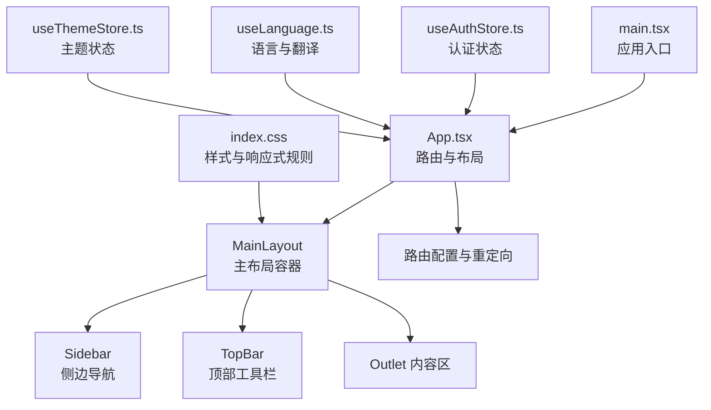
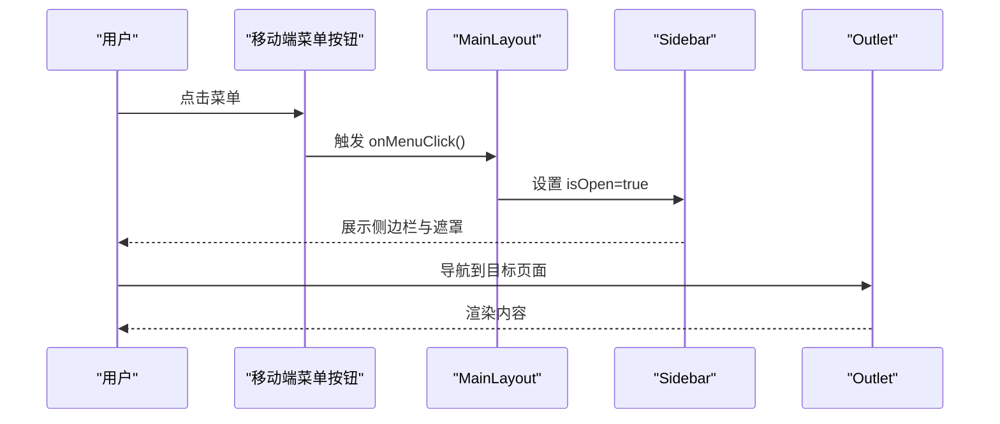
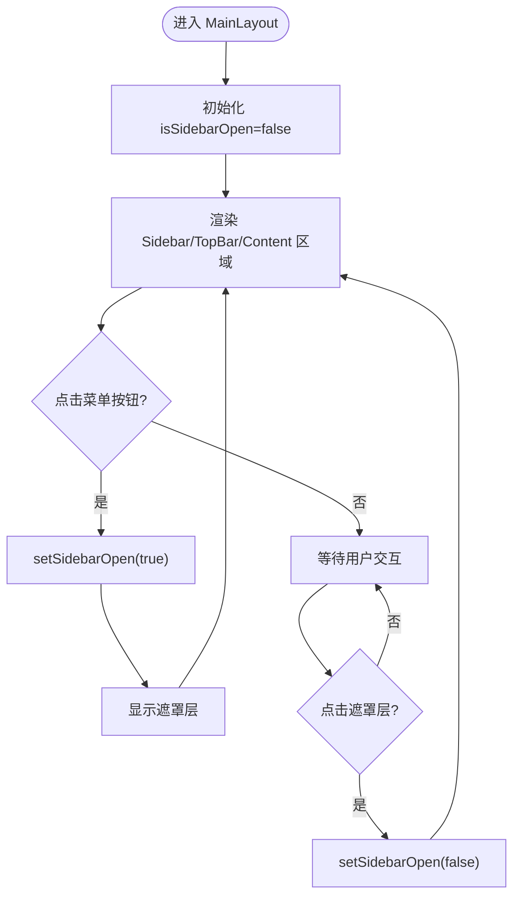
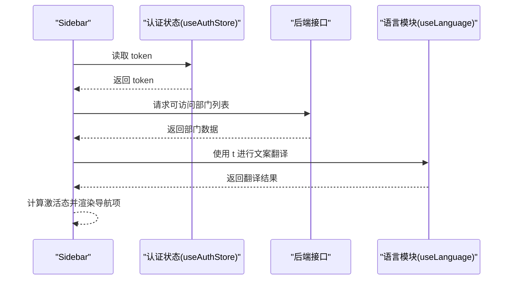
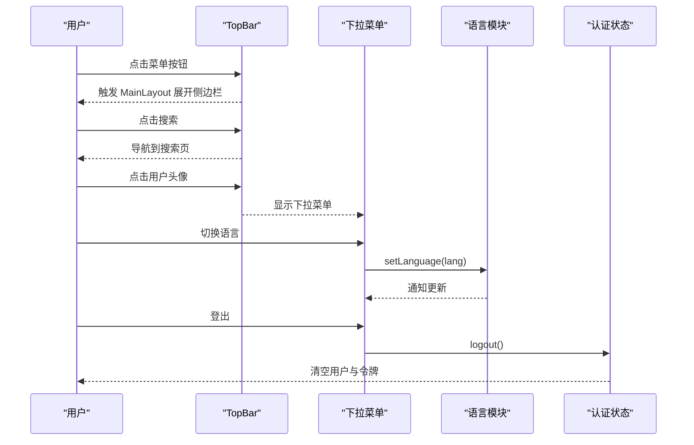
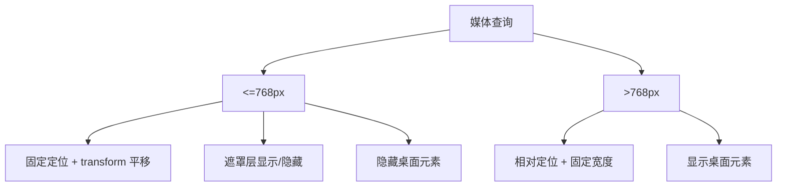
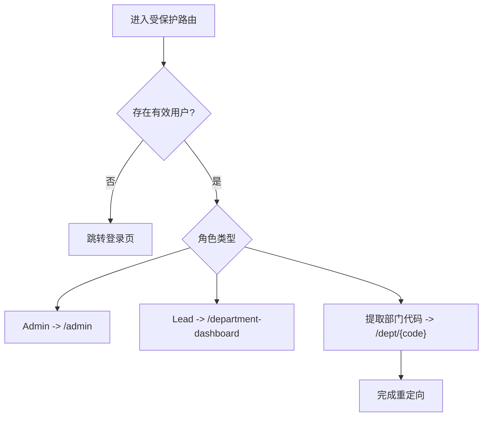
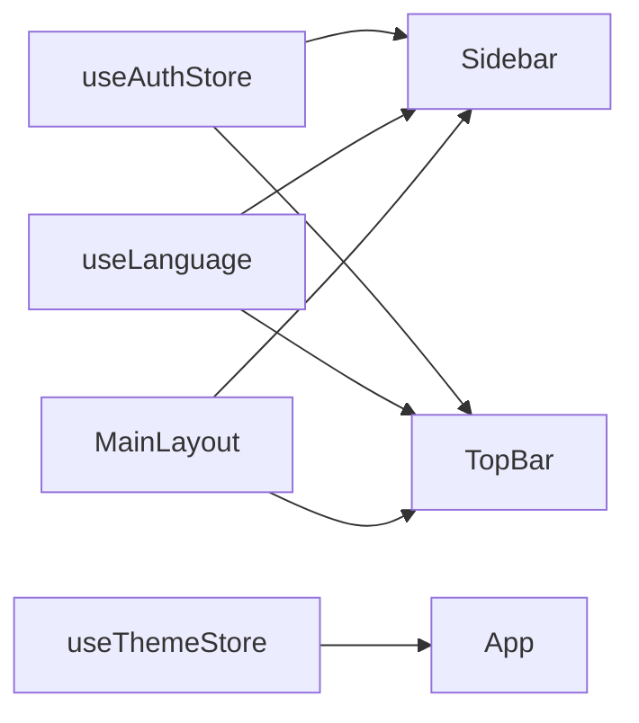
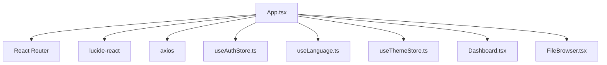

# 布局组件设计

<cite>
**本文引用的文件**
- [App.tsx](file://client/src/App.tsx)
- [main.tsx](file://client/src/main.tsx)
- [index.css](file://client/src/index.css)
- [useLanguage.ts](file://client/src/i18n/useLanguage.ts)
- [useThemeStore.ts](file://client/src/store/useThemeStore.ts)
- [useAuthStore.ts](file://client/src/store/useAuthStore.ts)
- [Dashboard.tsx](file://client/src/components/Dashboard.tsx)
- [FileBrowser.tsx](file://client/src/components/FileBrowser.tsx)
- [AdminSettings.tsx](file://client/src/components/Admin/AdminSettings.tsx)
</cite>

## 目录
1. [引言](#引言)
2. [项目结构](#项目结构)
3. [核心组件](#核心组件)
4. [架构总览](#架构总览)
5. [组件详解](#组件详解)
6. [依赖关系分析](#依赖关系分析)
7. [性能考量](#性能考量)
8. [故障排查指南](#故障排查指南)
9. [结论](#结论)
10. [附录](#附录)

## 引言
本文件聚焦 Longhorn 前端的主布局组件体系，系统性解析主布局容器、侧边栏与顶部栏的设计模式与实现原理；深入阐述响应式布局（移动端适配、侧边栏折叠机制、导航状态管理）、组件间通信与状态共享策略、事件传递流程；并覆盖主题切换与国际化适配、可复用性设计以及性能优化与内存管理建议。目标是帮助开发者快速理解并高效扩展布局层能力。

## 项目结构
Longhorn 前端采用 React + Vite 架构，主入口负责路由与全局布局，样式通过 CSS 变量与媒体查询实现深色主题与响应式行为。布局组件位于客户端源码目录，配合状态管理与国际化模块协同工作。

图表来源
- [main.tsx](file://client/src/main.tsx#L1-L12)
- [App.tsx](file://client/src/App.tsx#L124-L270)
- [index.css](file://client/src/index.css#L1-L200)
- [useThemeStore.ts](file://client/src/store/useThemeStore.ts#L27-L85)

章节来源
- [main.tsx](file://client/src/main.tsx#L1-L12)
- [App.tsx](file://client/src/App.tsx#L124-L270)
- [index.css](file://client/src/index.css#L1-L200)
- [useThemeStore.ts](file://client/src/store/useThemeStore.ts#L27-L85)

## 核心组件
- 主布局容器 MainLayout：统一承载侧边栏、顶部栏与内容区域，处理移动端侧边栏开关与遮罩层交互。
- 侧边栏 Sidebar：根据用户角色与可访问部门动态生成导航项，支持激活态高亮与国际化标题展示。
- 顶部栏 TopBar：提供菜单按钮、搜索入口、用户资料下拉、语言切换与登出等操作。
- 路由与重定向：基于 React Router 的受保护路由与首页跳转逻辑。
- 状态与国际化：使用 Zustand 管理认证状态，自研轻量事件总线驱动语言切换。
- 主题管理：使用 Zustand 管理主题状态，通过 CSS 变量实现主题切换。

章节来源
- [App.tsx](file://client/src/App.tsx#L74-L122)
- [useAuthStore.ts](file://client/src/store/useAuthStore.ts#L1-L31)
- [useLanguage.ts](file://client/src/i18n/useLanguage.ts#L1-L59)
- [useThemeStore.ts](file://client/src/store/useThemeStore.ts#L27-L85)

## 架构总览
整体采用"容器-组件"分层：App 负责路由与顶层布局，MainLayout 作为页面骨架，Sidebar/TopBar 作为可插拔子组件，内容区由 Outlet 承载各业务页面。样式通过 CSS 变量与媒体查询实现主题与响应式。

图表来源
- [App.tsx](file://client/src/App.tsx#L74-L122)
- [index.css](file://client/src/index.css#L691-L709)

## 组件详解

### 主布局容器 MainLayout
- 职责
  - 统一布局骨架：侧边栏、遮罩层、内容区。
  - 状态管理：维护侧边栏展开/收起状态，处理移动端点击遮罩关闭侧边栏。
  - 与子组件协作：向 Sidebar 传递 isOpen/onClose，向 TopBar 传递 onMenuClick。
- 关键点
  - 使用 CSS 类名控制侧边栏 transform 与遮罩显示。
  - 通过 Outlet 渲染当前路由对应页面。
- 设计模式
  - 容器组件模式：集中处理布局状态与事件，子组件专注各自功能。

图表来源
- [App.tsx](file://client/src/App.tsx#L74-L122)
- [index.css](file://client/src/index.css#L691-L709)

章节来源
- [App.tsx](file://client/src/App.tsx#L74-L122)

### 侧边栏 Sidebar
- 职责
  - 动态生成导航项：收藏、我的分享、个人空间、部门空间、管理员入口、部门管理入口、回收站。
  - 激活态管理：根据当前路径高亮对应导航项。
  - 国际化标题：优先使用翻译键，否则回退至数据库名称。
  - 部门图标映射：按部门代码映射不同图标。
- 数据流
  - 从认证状态获取 token，请求后端接口获取可访问部门列表。
  - 使用 useLanguage 提供的 t 函数进行文案翻译。
- 交互
  - 点击任一导航项时调用 onClose 关闭侧边栏，保证移动端体验一致。

图表来源
- [App.tsx](file://client/src/App.tsx#L278-L496)
- [useAuthStore.ts](file://client/src/store/useAuthStore.ts#L1-L31)
- [useLanguage.ts](file://client/src/i18n/useLanguage.ts#L1-L59)

章节来源
- [App.tsx](file://client/src/App.tsx#L278-L496)

### 顶部栏 TopBar
- 职责
  - 左侧：菜单按钮（移动端触发侧边栏），隐藏移动端统计卡片。
  - 中部：每日一句徽章（始终居中可见）。
  - 右侧：搜索入口、用户资料下拉菜单（含语言切换、个人空间、仪表盘、登出）。
- 交互
  - 用户资料下拉菜单支持点击外部关闭，登出触发认证状态清理。
  - 语言切换通过事件总线通知全局更新。
- 移动端适配
  - 在小屏设备隐藏桌面专用元素，仅保留必要控件。

图表来源
- [App.tsx](file://client/src/App.tsx#L814-L1128)
- [useLanguage.ts](file://client/src/i18n/useLanguage.ts#L1-L59)
- [useAuthStore.ts](file://client/src/store/useAuthStore.ts#L1-L31)

章节来源
- [App.tsx](file://client/src/App.tsx#L814-L1128)

### 响应式布局系统
- 主题与变量
  - CSS 变量定义背景、文字、强调色、阴影与侧边栏宽度，便于主题切换。
- 移动端适配
  - 侧边栏在小屏固定定位，通过 transform 控制显隐与阴影。
  - 遮罩层用于点击关闭与防止背景滚动。
  - 隐藏桌面专用元素，仅在大屏显示。
- 方向与高度适配
  - 横屏短高场景下缩短顶部栏高度，优化移动端体验。
- 交互细节
  - 顶部栏在小屏隐藏统计卡片，节省空间。

图表来源
- [index.css](file://client/src/index.css#L691-L709)
- [index.css](file://client/src/index.css#L719-L727)
- [index.css](file://client/src/index.css#L729-L752)

章节来源
- [index.css](file://client/src/index.css#L1-L800)

### 导航状态管理
- 激活态判定
  - 侧边栏根据当前路径精确匹配或编码匹配判断激活态。
- 首页重定向
  - 根据用户角色与部门信息重定向到管理员页或默认部门空间。
- 路由守卫
  - 未登录或无效用户信息时自动跳转登录页。

图表来源
- [App.tsx](file://client/src/App.tsx#L124-L142)
- [App.tsx](file://client/src/App.tsx#L1130-L1145)

章节来源
- [App.tsx](file://client/src/App.tsx#L124-L142)
- [App.tsx](file://client/src/App.tsx#L1130-L1145)

### 组件间通信与状态共享
- 认证状态
  - 全局 Zustand 存储用户与令牌，Sidebar/TopBar/页面组件通过 hooks 读取与写入。
- 国际化
  - 自研轻量事件总线，语言切换通过 setLanguage 更新当前语言并广播给监听者。
- 侧边栏与布局
  - MainLayout 通过 props 向 Sidebar 传递 isOpen/onClose，实现单向数据流与可控状态。
- 主题管理
  - useThemeStore 管理主题状态，通过 CSS 变量实现主题切换。

图表来源
- [useAuthStore.ts](file://client/src/store/useAuthStore.ts#L1-L31)
- [useLanguage.ts](file://client/src/i18n/useLanguage.ts#L1-L59)
- [useThemeStore.ts](file://client/src/store/useThemeStore.ts#L27-L85)
- [App.tsx](file://client/src/App.tsx#L124-L270)

章节来源
- [useAuthStore.ts](file://client/src/store/useAuthStore.ts#L1-L31)
- [useLanguage.ts](file://client/src/i18n/useLanguage.ts#L1-L59)
- [useThemeStore.ts](file://client/src/store/useThemeStore.ts#L27-L85)
- [App.tsx](file://client/src/App.tsx#L124-L270)

### 主题切换与国际化适配
- 主题切换
  - 通过 CSS 变量集中管理颜色与阴影，可在运行时替换变量值实现主题切换。
  - useThemeStore 提供主题状态管理，支持 light/dark/system 三种模式。
  - 通过 data-theme 属性应用主题到 HTML 元素。
- 国际化
  - 支持 zh/en/de/ja，语言存储于本地，切换即刻生效并通知所有监听组件。
  - Sidebar 使用翻译键生成部门标题，若无翻译则回退原始名称。
  - TopBar 中的语言切换按钮支持四种语言切换。

**更新** 新增主题切换与国际化适配的详细说明

章节来源
- [index.css](file://client/src/index.css#L4-L101)
- [useThemeStore.ts](file://client/src/store/useThemeStore.ts#L27-L85)
- [useLanguage.ts](file://client/src/i18n/useLanguage.ts#L1-L59)
- [App.tsx](file://client/src/App.tsx#L814-L1128)

### 可复用性设计
- 容器-子组件分离：MainLayout/Sidebar/TopBar 各司其职，易于替换与扩展。
- Props 驱动：通过 isOpen/onClose、onMenuClick 等回调实现解耦。
- 样式抽象：CSS 变量与类名命名规范，便于统一风格与主题扩展。
- 路由集成：与 React Router 无缝集成，支持多级嵌套路由与 Outlet 插槽。

章节来源
- [App.tsx](file://client/src/App.tsx#L74-L122)
- [index.css](file://client/src/index.css#L131-L164)

## 依赖关系分析
- 外部依赖
  - React Router：路由与导航。
  - lucide-react：图标库。
  - axios：HTTP 请求（Sidebar 获取部门列表、TopBar 用户统计）。
  - date-fns：时间格式化（Dashboard）。
- 内部依赖
  - useAuthStore：认证状态。
  - useLanguage：国际化。
  - useThemeStore：主题管理。
  - Dashboard/FileBrowser：业务页面组件，作为 Outlet 内容区渲染。

图表来源
- [App.tsx](file://client/src/App.tsx#L1-L71)
- [Dashboard.tsx](file://client/src/components/Dashboard.tsx#L1-L200)
- [FileBrowser.tsx](file://client/src/components/FileBrowser.tsx#L1-L200)
- [useThemeStore.ts](file://client/src/store/useThemeStore.ts#L1-L86)

章节来源
- [App.tsx](file://client/src/App.tsx#L1-L71)
- [Dashboard.tsx](file://client/src/components/Dashboard.tsx#L1-L200)
- [FileBrowser.tsx](file://client/src/components/FileBrowser.tsx#L1-L200)
- [useThemeStore.ts](file://client/src/store/useThemeStore.ts#L1-L86)

## 性能考量
- 渲染优化
  - 使用 CSS transform 控制侧边栏显隐，避免频繁 DOM 重排。
  - 顶部栏在小屏隐藏统计卡片，减少布局计算。
- 状态管理
  - 认证状态与语言切换采用轻量存储与事件通知，避免深层上下文传播。
  - 主题状态使用 Zustand 管理，支持持久化存储。
- 网络请求
  - Sidebar 仅在有 token 时发起部门列表请求，减少无效调用。
- 图标与样式
  - lucide-react 图标按需引入，减少打包体积。
- 内存管理
  - 下拉菜单使用点击外部关闭，避免泄漏事件监听器。
  - 组件卸载时清理副作用（如监听器），保持内存稳定。

## 故障排查指南
- 侧边栏无法关闭
  - 检查遮罩层是否正确绑定点击事件，确认 isSidebarOpen 状态同步。
- 导航激活态不准确
  - 核对路径匹配逻辑，注意编码后的路径与前缀匹配。
- 语言切换无效
  - 确认 setLanguage 是否被调用，事件监听是否注册成功。
- 登录后仍跳转登录页
  - 检查认证状态初始化与路由守卫条件，确保用户对象完整。
- 移动端交互异常
  - 确认媒体查询与类名切换逻辑，检查 transform 与遮罩层层级。
- 主题切换不生效
  - 检查 data-theme 属性是否正确设置，CSS 变量是否正确应用。

章节来源
- [App.tsx](file://client/src/App.tsx#L74-L122)
- [useLanguage.ts](file://client/src/i18n/useLanguage.ts#L1-L59)
- [useAuthStore.ts](file://client/src/store/useAuthStore.ts#L1-L31)
- [useThemeStore.ts](file://client/src/store/useThemeStore.ts#L27-L85)

## 结论
Longhorn 前端布局组件以清晰的容器-子组件分层、稳定的 props 与事件流、完善的响应式与国际化支持为基础，实现了良好的可维护性与可扩展性。通过 CSS 变量与媒体查询，主题与移动端适配得以低成本实现；通过轻量状态与事件机制，组件间通信简洁高效。新增的主题切换与国际化适配进一步增强了系统的灵活性与用户体验。建议在后续迭代中持续关注渲染性能与内存占用，保持组件职责单一与样式命名一致性。

## 附录
- 相关页面组件
  - 仪表盘：用于展示用户统计与配额进度。
  - 文件浏览：作为内容区示例，展示复杂业务页面如何嵌入布局。

章节来源
- [Dashboard.tsx](file://client/src/components/Dashboard.tsx#L1-L200)
- [FileBrowser.tsx](file://client/src/components/FileBrowser.tsx#L1-L200)