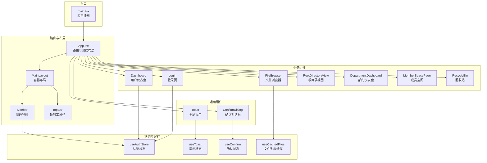
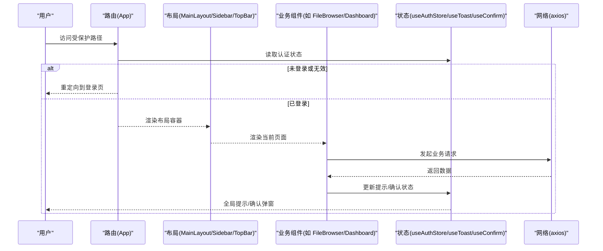
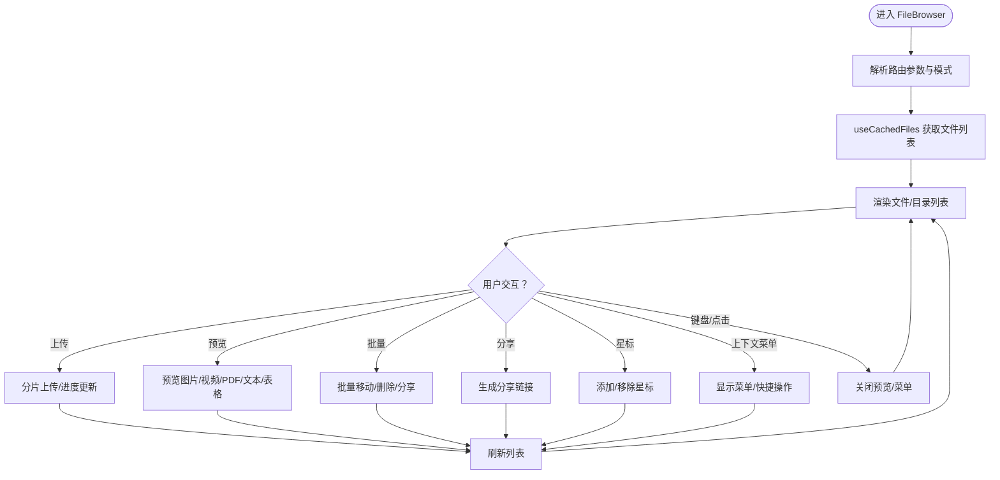
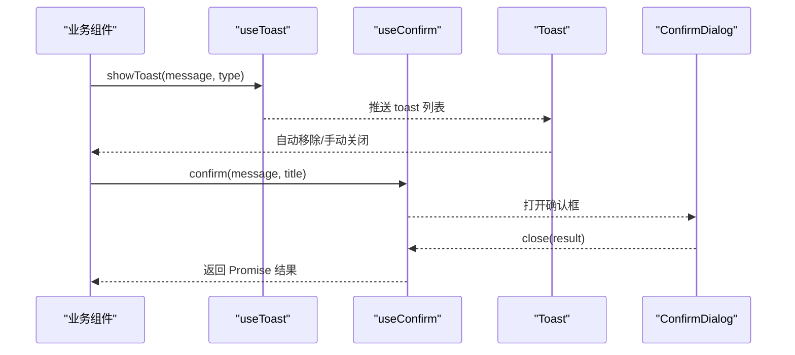
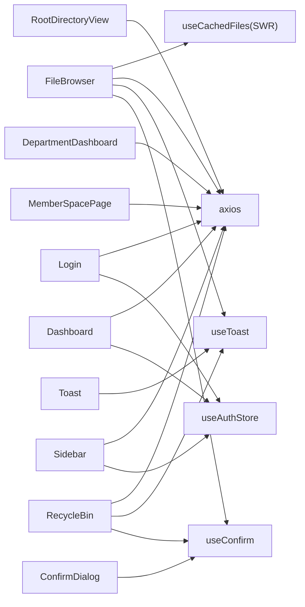

# 组件架构设计

<cite>
**本文引用的文件**
- [App.tsx](file://client/src/App.tsx)
- [main.tsx](file://client/src/main.tsx)
- [FileBrowser.tsx](file://client/src/components/FileBrowser.tsx)
- [Dashboard.tsx](file://client/src/components/Dashboard.tsx)
- [Login.tsx](file://client/src/components/Login.tsx)
- [Toast.tsx](file://client/src/components/Toast.tsx)
- [ConfirmDialog.tsx](file://client/src/components/ConfirmDialog.tsx)
- [useAuthStore.ts](file://client/src/store/useAuthStore.ts)
- [useToast.ts](file://client/src/store/useToast.ts)
- [useConfirm.ts](file://client/src/store/useConfirm.ts)
- [useCachedFiles.ts](file://client/src/hooks/useCachedFiles.ts)
- [RootDirectoryView.tsx](file://client/src/components/RootDirectoryView.tsx)
- [DepartmentDashboard.tsx](file://client/src/components/DepartmentDashboard.tsx)
- [MemberSpacePage.tsx](file://client/src/components/MemberSpacePage.tsx)
- [RecycleBin.tsx](file://client/src/components/RecycleBin.tsx)
</cite>

## 目录
1. [简介](#简介)
2. [项目结构](#项目结构)
3. [核心组件](#核心组件)
4. [架构总览](#架构总览)
5. [详细组件分析](#详细组件分析)
6. [依赖关系分析](#依赖关系分析)
7. [性能考量](#性能考量)
8. [故障排查指南](#故障排查指南)
9. [结论](#结论)
10. [附录](#附录)

## 简介
本文件面向 Longhorn 前端组件架构，聚焦 React 组件层次与交互模式，系统梳理布局组件（MainLayout、Sidebar、TopBar）、业务组件（FileBrowser、Dashboard、Login）与通用组件（Toast、ConfirmDialog）的职责划分、通信机制、状态管理与可复用性设计。文档同时覆盖路由保护、权限控制、条件渲染、动态加载优化、测试策略与性能监控建议，帮助开发者快速理解并高效扩展系统。

## 项目结构
前端采用基于路由的页面级组件组织方式，核心入口在 main.tsx 中挂载 App，App 负责路由与顶层布局；业务组件按功能域拆分，通用提示与确认对话框通过全局状态管理实现跨组件共享。

图表来源
- [main.tsx](file://client/src/main.tsx#L1-L11)
- [App.tsx](file://client/src/App.tsx#L66-L126)
- [FileBrowser.tsx](file://client/src/components/FileBrowser.tsx#L1-L120)
- [Dashboard.tsx](file://client/src/components/Dashboard.tsx#L29-L55)
- [Login.tsx](file://client/src/components/Login.tsx#L7-L27)
- [RootDirectoryView.tsx](file://client/src/components/RootDirectoryView.tsx#L7-L25)
- [DepartmentDashboard.tsx](file://client/src/components/DepartmentDashboard.tsx#L50-L72)
- [MemberSpacePage.tsx](file://client/src/components/MemberSpacePage.tsx#L28-L51)
- [RecycleBin.tsx](file://client/src/components/RecycleBin.tsx#L26-L75)
- [Toast.tsx](file://client/src/components/Toast.tsx#L20-L42)
- [ConfirmDialog.tsx](file://client/src/components/ConfirmDialog.tsx#L6-L20)
- [useAuthStore.ts](file://client/src/store/useAuthStore.ts#L17-L30)
- [useToast.ts](file://client/src/store/useToast.ts#L17-L40)
- [useConfirm.ts](file://client/src/store/useConfirm.ts#L14-L36)
- [useCachedFiles.ts](file://client/src/hooks/useCachedFiles.ts#L40-L85)

章节来源
- [main.tsx](file://client/src/main.tsx#L1-L11)
- [App.tsx](file://client/src/App.tsx#L66-L126)

## 核心组件
- 布局组件
  - MainLayout：提供移动端遮罩层、侧边栏开关与 Outlet 内容区，作为受保护路由的容器。
  - Sidebar：根据用户角色与可访问部门动态生成导航项，支持移动端抽屉式交互。
  - TopBar：提供菜单切换、搜索入口、用户信息下拉与语言切换等。
- 业务组件
  - FileBrowser：文件浏览、上传、预览、批量操作、分享、星标等核心功能。
  - Dashboard：用户统计卡片、配额进度、快捷入口与账户信息展示。
  - Login：表单校验、错误提示、提交状态与动画样式。
  - RootDirectoryView：管理员可见的根目录视图，列出部门与成员空间入口。
  - DepartmentDashboard：部门维度的概览、成员与权限统计。
  - MemberSpacePage：管理员查看与跳转成员个人空间。
  - RecycleBin：回收站列表、网格/列表视图、批量恢复/删除与预览。
- 通用组件
  - Toast：全局提示气泡，支持类型化图标与自动消失。
  - ConfirmDialog：全局确认对话框，支持键盘快捷键与 Promise 化调用。

章节来源
- [App.tsx](file://client/src/App.tsx#L38-L64)
- [App.tsx](file://client/src/App.tsx#L128-L268)
- [App.tsx](file://client/src/App.tsx#L349-L616)
- [FileBrowser.tsx](file://client/src/components/FileBrowser.tsx#L72-L150)
- [Dashboard.tsx](file://client/src/components/Dashboard.tsx#L29-L55)
- [Login.tsx](file://client/src/components/Login.tsx#L7-L27)
- [RootDirectoryView.tsx](file://client/src/components/RootDirectoryView.tsx#L7-L25)
- [DepartmentDashboard.tsx](file://client/src/components/DepartmentDashboard.tsx#L50-L72)
- [MemberSpacePage.tsx](file://client/src/components/MemberSpacePage.tsx#L28-L51)
- [RecycleBin.tsx](file://client/src/components/RecycleBin.tsx#L26-L75)
- [Toast.tsx](file://client/src/components/Toast.tsx#L20-L42)
- [ConfirmDialog.tsx](file://client/src/components/ConfirmDialog.tsx#L6-L20)

## 架构总览
Longhorn 前端采用“路由 + 布局 + 业务组件”的分层架构。路由负责页面级切换与权限拦截，布局组件负责 UI 结构与交互，业务组件承载具体功能逻辑，通用组件通过全局状态实现跨组件通信。数据流以“请求 → 缓存/状态 → 渲染”为主，结合本地存储持久化认证信息。

图表来源
- [App.tsx](file://client/src/App.tsx#L78-L84)
- [useAuthStore.ts](file://client/src/store/useAuthStore.ts#L17-L30)
- [useToast.ts](file://client/src/store/useToast.ts#L17-L40)
- [useConfirm.ts](file://client/src/store/useConfirm.ts#L14-L36)

## 详细组件分析

### 布局组件：MainLayout、Sidebar、TopBar
- 职责划分
  - MainLayout：统一容器、移动端遮罩、侧边栏开合控制、Outlet 内容区。
  - Sidebar：根据用户角色与可访问部门动态渲染导航项，支持点击关闭、高亮当前路径。
  - TopBar：菜单按钮、用户统计卡片、搜索入口、用户下拉菜单（语言切换、个人空间、仪表盘、登出）。
- 通信与事件
  - 通过 props 向子组件传递用户信息、是否打开侧边栏与回调函数。
  - 使用 useLocation/useNavigate 实现导航高亮与跳转。
  - 用户下拉菜单通过事件监听器处理点击外部关闭。
- 权限与条件渲染
  - 管理员与部门负责人可见特定入口（系统管理、部门管理）。
  - 当前路径高亮通过 location 判断实现。
- 可复用性
  - 将用户信息与权限判断抽象为 props，便于在不同页面复用。

章节来源
- [App.tsx](file://client/src/App.tsx#L38-L64)
- [App.tsx](file://client/src/App.tsx#L128-L268)
- [App.tsx](file://client/src/App.tsx#L349-L616)

### 业务组件：FileBrowser
- 功能要点
  - 路由参数解析与有效路径计算（个人空间、部门路径、模式区分）。
  - 使用 useCachedFiles 提供 SWR 缓存、去重与轮询刷新，支持预取子目录。
  - 支持上传（分片上传、进度、速率、取消）、下载、批量操作、分享、星标、预览（图片/视频/PDF/文本/表格）。
  - 上下文菜单、快捷键（ESC 关闭）、键盘事件与点击外部关闭。
- 数据流与状态
  - 通过 useAuthStore 获取 token 与用户信息，axios 携带 Bearer Token。
  - 通过 useToast/useConfirm 进行提示与确认。
  - 通过 useCachedFiles 的 refresh 主动刷新列表。
- 性能优化
  - SWR keepPreviousData 保证导航即时反馈。
  - 预取最近子目录，减少二次进入延迟。
  - 图片缩略图懒加载与错误回退至全量预览。
- 可复用性
  - 通过 mode 参数支持“个人/最近/收藏/全部”模式，路径计算逻辑可复用。

图表来源
- [FileBrowser.tsx](file://client/src/components/FileBrowser.tsx#L72-L150)
- [FileBrowser.tsx](file://client/src/components/FileBrowser.tsx#L158-L162)
- [FileBrowser.tsx](file://client/src/components/FileBrowser.tsx#L184-L190)
- [useCachedFiles.ts](file://client/src/hooks/useCachedFiles.ts#L40-L85)

章节来源
- [FileBrowser.tsx](file://client/src/components/FileBrowser.tsx#L72-L150)
- [useCachedFiles.ts](file://client/src/hooks/useCachedFiles.ts#L40-L85)

### 业务组件：Dashboard
- 功能要点
  - 加载用户统计（上传数、存储使用、星标数、分享数、最近登录、账户创建时间）。
  - 展示配额进度条与快捷入口（个人空间、收藏、搜索）。
  - 错误处理与重试机制。
- 数据流
  - 通过 useAuthStore 获取 token，axios 请求后端接口。
  - 国际化与日期格式化集成。

章节来源
- [Dashboard.tsx](file://client/src/components/Dashboard.tsx#L29-L55)

### 业务组件：Login
- 功能要点
  - 表单输入（用户名/密码），防重复提交，错误提示，成功后写入本地存储并设置认证状态。
- 数据流
  - axios 提交登录，成功后通过 useAuthStore.setAuth 设置用户与 token。

章节来源
- [Login.tsx](file://client/src/components/Login.tsx#L7-L27)
- [useAuthStore.ts](file://client/src/store/useAuthStore.ts#L17-L30)

### 业务组件：RootDirectoryView
- 功能要点
  - 管理员可见的根目录视图，列出部门与成员空间入口，点击跳转对应页面。

章节来源
- [RootDirectoryView.tsx](file://client/src/components/RootDirectoryView.tsx#L7-L25)

### 业务组件：DepartmentDashboard
- 功能要点
  - 部门维度的概览、成员与权限统计，支持标签页切换与数据懒加载。

章节来源
- [DepartmentDashboard.tsx](file://client/src/components/DepartmentDashboard.tsx#L50-L72)

### 业务组件：MemberSpacePage
- 功能要点
  - 管理员查看所有成员，支持搜索过滤，点击跳转成员个人空间。

章节来源
- [MemberSpacePage.tsx](file://client/src/components/MemberSpacePage.tsx#L28-L51)

### 业务组件：RecycleBin
- 功能要点
  - 回收站列表（网格/列表），批量恢复/删除，预览图片/视频，清空回收站。
- 数据流
  - 通过 useConfirm/useToast 提示与确认，axios 请求后端接口。

章节来源
- [RecycleBin.tsx](file://client/src/components/RecycleBin.tsx#L26-L75)

### 通用组件：Toast 与 ConfirmDialog
- 设计要点
  - Toast：全局提示容器，按类型映射图标与边框色，自动定时隐藏。
  - ConfirmDialog：全局确认框，Promise 化调用，支持 ESC/Enter 快捷键。
- 状态管理
  - useToast/useConfirm 提供集中状态与方法，组件仅负责渲染与交互。

图表来源
- [Toast.tsx](file://client/src/components/Toast.tsx#L20-L42)
- [ConfirmDialog.tsx](file://client/src/components/ConfirmDialog.tsx#L6-L20)
- [useToast.ts](file://client/src/store/useToast.ts#L17-L40)
- [useConfirm.ts](file://client/src/store/useConfirm.ts#L14-L36)

章节来源
- [Toast.tsx](file://client/src/components/Toast.tsx#L20-L42)
- [ConfirmDialog.tsx](file://client/src/components/ConfirmDialog.tsx#L6-L20)
- [useToast.ts](file://client/src/store/useToast.ts#L17-L40)
- [useConfirm.ts](file://client/src/store/useConfirm.ts#L14-L36)

## 依赖关系分析
- 组件耦合
  - 布局组件与业务组件通过路由解耦，通过 props 传入用户信息与回调。
  - 业务组件之间低耦合，通过公共状态与工具函数（axios、国际化、日期库）协作。
- 外部依赖
  - axios：统一发起 HTTP 请求，携带 Bearer Token。
  - SWR：文件列表缓存与刷新。
  - lucide-react：图标库。
  - date-fns：日期格式化与相对时间。
- 状态依赖
  - useAuthStore：认证状态与本地存储。
  - useToast/useConfirm：全局提示与确认。

图表来源
- [FileBrowser.tsx](file://client/src/components/FileBrowser.tsx#L1-L120)
- [Login.tsx](file://client/src/components/Login.tsx#L1-L27)
- [Dashboard.tsx](file://client/src/components/Dashboard.tsx#L1-L55)
- [RootDirectoryView.tsx](file://client/src/components/RootDirectoryView.tsx#L1-L25)
- [DepartmentDashboard.tsx](file://client/src/components/DepartmentDashboard.tsx#L1-L58)
- [MemberSpacePage.tsx](file://client/src/components/MemberSpacePage.tsx#L1-L35)
- [RecycleBin.tsx](file://client/src/components/RecycleBin.tsx#L1-L37)
- [useCachedFiles.ts](file://client/src/hooks/useCachedFiles.ts#L1-L85)
- [useAuthStore.ts](file://client/src/store/useAuthStore.ts#L1-L31)
- [useToast.ts](file://client/src/store/useToast.ts#L1-L41)
- [useConfirm.ts](file://client/src/store/useConfirm.ts#L1-L37)

章节来源
- [useCachedFiles.ts](file://client/src/hooks/useCachedFiles.ts#L1-L85)
- [useAuthStore.ts](file://client/src/store/useAuthStore.ts#L1-L31)

## 性能考量
- 列表渲染与缓存
  - 使用 SWR 的 keepPreviousData 与 dedupingInterval，减少闪烁与重复请求。
  - 预取子目录，降低首次进入深层目录的等待时间。
- 上传与预览
  - 分片上传避免大文件阻塞，实时进度与速率反馈。
  - 图片缩略图懒加载与错误回退，提升首屏速度。
- 交互与渲染
  - 通过 useMemo 与条件渲染减少不必要的重算与重绘。
  - 移动端交互（抽屉、遮罩）通过状态切换实现，避免复杂 DOM 变更。

[本节为通用指导，不直接分析具体文件]

## 故障排查指南
- 登录失败
  - 检查 Login 表单输入与错误提示，确认 axios 请求返回与 useAuthStore.setAuth 是否执行。
- 文件列表异常
  - 检查 useCachedFiles 的缓存键与 token，确认 SWR 是否正确去重与刷新。
- 上传中断
  - 检查 AbortController 是否被正确调用，分片大小与合并请求是否成功。
- 全局提示/确认无响应
  - 检查 useToast/useConfirm 的状态推送与组件渲染，确认自动移除定时器是否触发。

章节来源
- [Login.tsx](file://client/src/components/Login.tsx#L15-L27)
- [useCachedFiles.ts](file://client/src/hooks/useCachedFiles.ts#L58-L85)
- [FileBrowser.tsx](file://client/src/components/FileBrowser.tsx#L340-L449)
- [useToast.ts](file://client/src/store/useToast.ts#L17-L40)
- [useConfirm.ts](file://client/src/store/useConfirm.ts#L14-L36)

## 结论
Longhorn 前端通过清晰的布局-业务-通用三层结构，配合路由保护与全局状态管理，实现了高内聚、低耦合的组件体系。文件浏览器采用 SWR 缓存与分片上传等策略显著提升了用户体验；Toast 与 ConfirmDialog 通过集中状态管理实现了跨组件一致的交互体验。建议在后续迭代中进一步完善组件测试与性能监控，持续优化首屏与深层目录的加载体验。

[本节为总结性内容，不直接分析具体文件]

## 附录
- 组件测试策略建议
  - 单元测试：针对纯函数与 Hook（如 useCachedFiles 的缓存键构造）进行断言。
  - 集成测试：模拟 axios 请求与路由环境，验证布局与业务组件的组合行为。
  - UI 测试：使用端到端框架验证关键流程（登录、文件上传/下载、分享、回收站操作）。
- 调试技巧
  - 在关键节点打印日志（如 useCachedFiles 的请求与缓存命中）。
  - 使用 React DevTools Profiler 观察渲染热点。
- 性能监控
  - 使用浏览器性能面板记录关键交互的首屏与交互延迟。
  - 对 SWR 缓存命中率与请求耗时进行埋点统计。

[本节为通用指导，不直接分析具体文件]