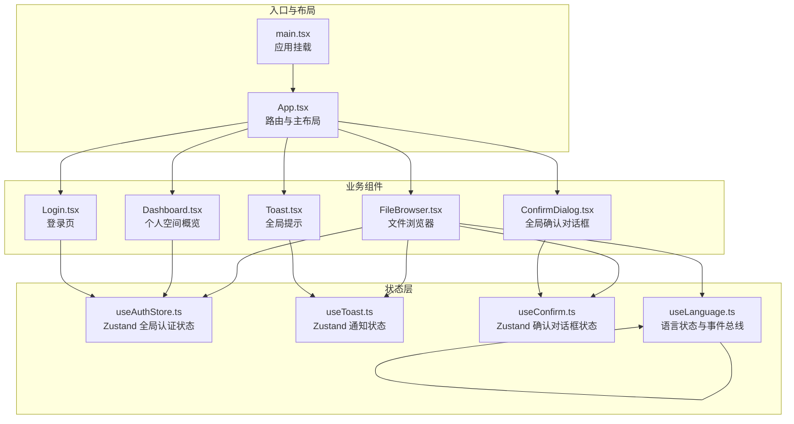
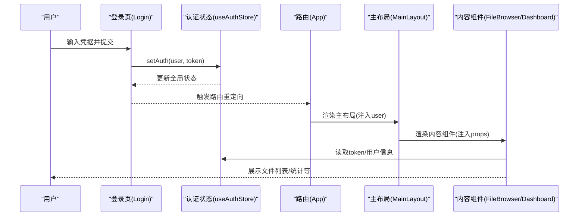
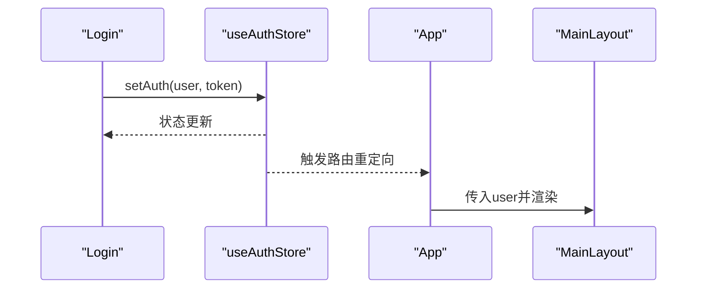
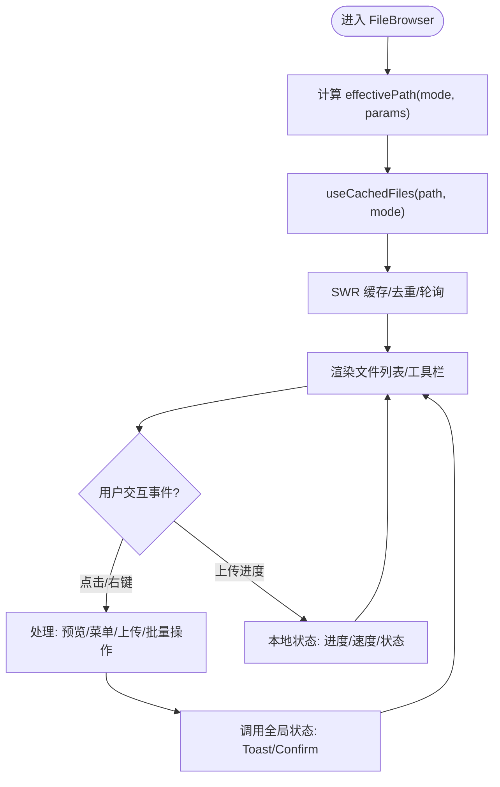
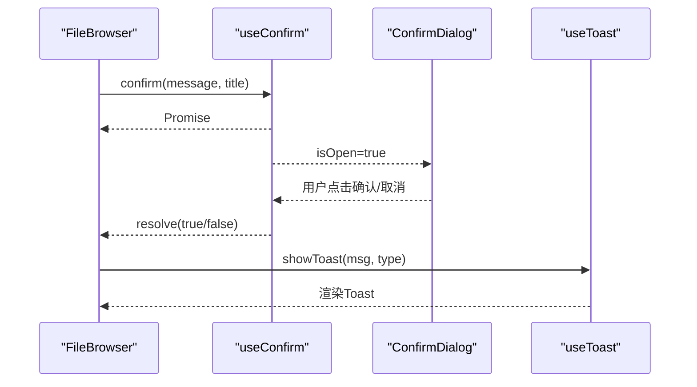
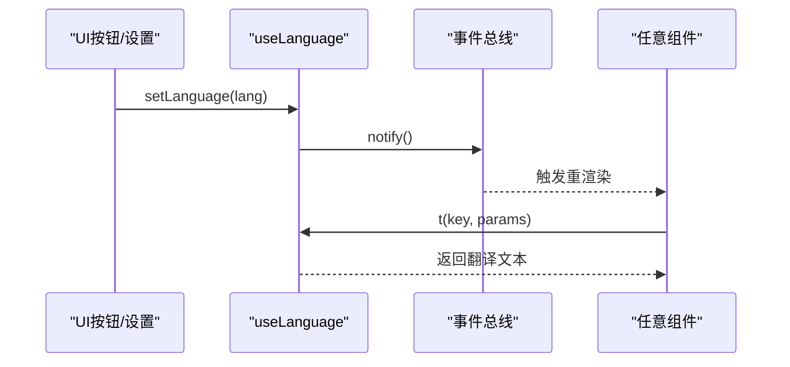
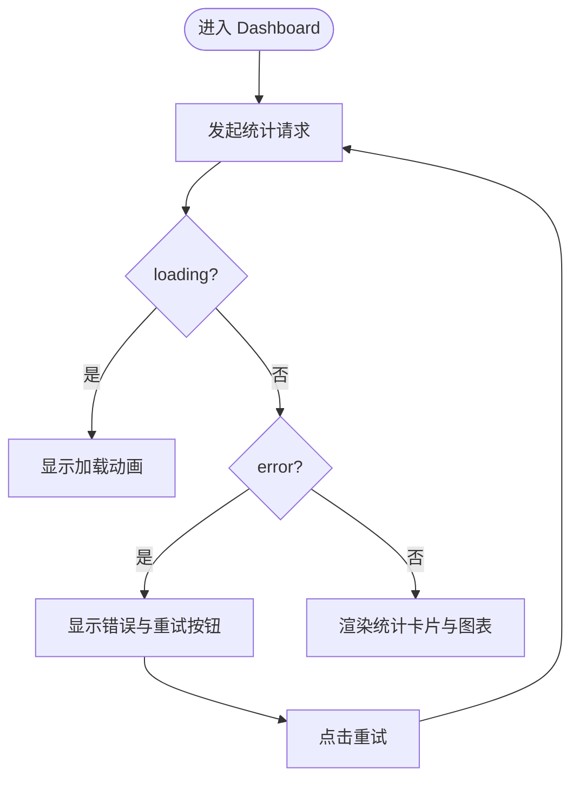
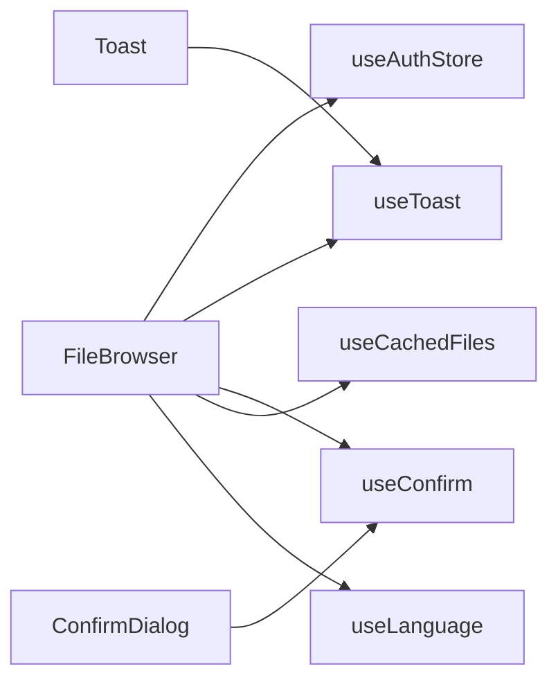

# 组件通信机制

<cite>
**本文档引用的文件**
- [client/src/App.tsx](file://client/src/App.tsx)
- [client/src/main.tsx](file://client/src/main.tsx)
- [client/src/store/useAuthStore.ts](file://client/src/store/useAuthStore.ts)
- [client/src/store/useToast.ts](file://client/src/store/useToast.ts)
- [client/src/store/useConfirm.ts](file://client/src/store/useConfirm.ts)
- [client/src/components/FileBrowser.tsx](file://client/src/components/FileBrowser.tsx)
- [client/src/components/Toast.tsx](file://client/src/components/Toast.tsx)
- [client/src/components/ConfirmDialog.tsx](file://client/src/components/ConfirmDialog.tsx)
- [client/src/hooks/useCachedFiles.ts](file://client/src/hooks/useCachedFiles.ts)
- [client/src/i18n/useLanguage.ts](file://client/src/i18n/useLanguage.ts)
- [client/src/components/Dashboard.tsx](file://client/src/components/Dashboard.tsx)
- [client/src/components/Login.tsx](file://client/src/components/Login.tsx)
- [client/src/i18n/translations.ts](file://client/src/i18n/translations.ts)
</cite>

## 目录
1. [引言](#引言)
2. [项目结构](#项目结构)
3. [核心组件](#核心组件)
4. [架构总览](#架构总览)
5. [详细组件分析](#详细组件分析)
6. [依赖关系分析](#依赖关系分析)
7. [性能考量](#性能考量)
8. [故障排除指南](#故障排除指南)
9. [结论](#结论)
10. [附录](#附录)

## 引言
本文件系统性梳理 Longhorn 前端组件间的通信机制与状态管理模式，覆盖 props 传递、事件冒泡、状态提升与上下文共享；并深入解析全局状态（Zustand Store）、局部状态与持久化状态的协同策略。同时总结组件生命周期管理、条件渲染与动态加载优化方法，给出最佳实践、性能优化技巧与调试方法，并提供测试策略与故障排除指南。

## 项目结构
前端采用 React + TypeScript 构建，路由由 react-router-dom 提供，状态管理以 Zustand 为主，配合 SWR 实现缓存与并发请求去重，国际化通过本地事件总线实现跨组件通知。

图表来源
- [client/src/main.tsx](file://client/src/main.tsx#L1-L11)
- [client/src/App.tsx](file://client/src/App.tsx#L66-L126)
- [client/src/store/useAuthStore.ts](file://client/src/store/useAuthStore.ts#L1-L31)
- [client/src/store/useToast.ts](file://client/src/store/useToast.ts#L1-L41)
- [client/src/store/useConfirm.ts](file://client/src/store/useConfirm.ts#L1-L37)
- [client/src/components/FileBrowser.tsx](file://client/src/components/FileBrowser.tsx#L1-L120)
- [client/src/components/Toast.tsx](file://client/src/components/Toast.tsx#L1-L45)
- [client/src/components/ConfirmDialog.tsx](file://client/src/components/ConfirmDialog.tsx#L1-L126)
- [client/src/i18n/useLanguage.ts](file://client/src/i18n/useLanguage.ts#L1-L59)

章节来源
- [client/src/main.tsx](file://client/src/main.tsx#L1-L11)
- [client/src/App.tsx](file://client/src/App.tsx#L66-L126)

## 核心组件
- 路由与主布局：负责根据用户身份与角色渲染不同侧边栏与内容区域，统一注入全局状态与国际化能力。
- 文件浏览器：核心业务组件，负责文件列表展示、上传、预览、分享、批量操作等，广泛使用全局状态与本地状态。
- 登录页：通过全局认证状态完成登录与登出，驱动路由跳转。
- 通知与确认：全局弹窗组件，通过 Zustand 状态驱动显示/隐藏与交互。
- 国际化：语言切换通过本地事件总线广播，避免深层 props 传递。

章节来源
- [client/src/App.tsx](file://client/src/App.tsx#L38-L126)
- [client/src/components/FileBrowser.tsx](file://client/src/components/FileBrowser.tsx#L68-L120)
- [client/src/components/Login.tsx](file://client/src/components/Login.tsx#L1-L161)
- [client/src/components/Toast.tsx](file://client/src/components/Toast.tsx#L1-L45)
- [client/src/components/ConfirmDialog.tsx](file://client/src/components/ConfirmDialog.tsx#L1-L126)
- [client/src/i18n/useLanguage.ts](file://client/src/i18n/useLanguage.ts#L1-L59)

## 架构总览
Longhorn 前端采用“路由分层 + 组件分层”的结构：
- 路由层：根据用户角色与权限决定渲染哪些页面与侧边栏项。
- 主布局层：提供顶部栏、侧边栏、内容区出口，贯穿全局状态与国际化。
- 业务组件层：围绕文件浏览、分享、统计等场景，组合使用全局状态、本地状态与缓存钩子。
- 全局弹窗层：Toast 与 Confirm 对话框独立于业务组件，通过 Zustand 状态驱动。

图表来源
- [client/src/components/Login.tsx](file://client/src/components/Login.tsx#L13-L27)
- [client/src/store/useAuthStore.ts](file://client/src/store/useAuthStore.ts#L17-L30)
- [client/src/App.tsx](file://client/src/App.tsx#L66-L126)

## 详细组件分析

### 认证与路由通信（props 传递、状态提升）
- props 传递：App 将 user 注入到 MainLayout，MainLayout 再向侧边栏与内容区传递。
- 状态提升：useAuthStore 在登录成功后写入 localStorage 并更新全局状态，后续组件通过读取 store 获取用户信息。
- 生命周期：App 在首次渲染时读取 localStorage 初始化状态；组件卸载不影响全局状态。

图表来源
- [client/src/components/Login.tsx](file://client/src/components/Login.tsx#L13-L27)
- [client/src/store/useAuthStore.ts](file://client/src/store/useAuthStore.ts#L17-L30)
- [client/src/App.tsx](file://client/src/App.tsx#L66-L84)

章节来源
- [client/src/components/Login.tsx](file://client/src/components/Login.tsx#L1-L161)
- [client/src/store/useAuthStore.ts](file://client/src/store/useAuthStore.ts#L1-L31)
- [client/src/App.tsx](file://client/src/App.tsx#L66-L126)

### 文件浏览器（props、事件冒泡、状态提升、上下文共享）
- props 传递：FileBrowser 接收 mode 等参数，计算 effectivePath 并驱动数据请求。
- 事件冒泡：菜单、预览、上传等 UI 行为通过事件冒泡与回调处理，避免深层传递。
- 状态提升：上传进度、选择项、预览项等本地状态在组件内集中管理；全局状态用于 token、通知、确认。
- 上下文共享：useCachedFiles 作为数据层上下文，提供 files、canWrite、isLoading、refresh 等能力。

图表来源
- [client/src/components/FileBrowser.tsx](file://client/src/components/FileBrowser.tsx#L72-L120)
- [client/src/hooks/useCachedFiles.ts](file://client/src/hooks/useCachedFiles.ts#L40-L86)

章节来源
- [client/src/components/FileBrowser.tsx](file://client/src/components/FileBrowser.tsx#L1-L200)
- [client/src/hooks/useCachedFiles.ts](file://client/src/hooks/useCachedFiles.ts#L1-L102)

### 通知与确认（全局弹窗、Promise 化交互）
- Toast：Zustand 存储数组，组件订阅渲染；自动定时移除。
- Confirm：提供 confirm(message, title) 返回 Promise，内部通过 resolve/close 控制结果与关闭时机。
- 事件冒泡：ConfirmDialog 监听键盘 Esc/Enter，点击遮罩关闭，避免深层传递。

图表来源
- [client/src/store/useConfirm.ts](file://client/src/store/useConfirm.ts#L14-L36)
- [client/src/components/ConfirmDialog.tsx](file://client/src/components/ConfirmDialog.tsx#L6-L20)
- [client/src/store/useToast.ts](file://client/src/store/useToast.ts#L17-L40)
- [client/src/components/Toast.tsx](file://client/src/components/Toast.tsx#L20-L42)

章节来源
- [client/src/store/useConfirm.ts](file://client/src/store/useConfirm.ts#L1-L37)
- [client/src/components/ConfirmDialog.tsx](file://client/src/components/ConfirmDialog.tsx#L1-L126)
- [client/src/store/useToast.ts](file://client/src/store/useToast.ts#L1-L41)
- [client/src/components/Toast.tsx](file://client/src/components/Toast.tsx#L1-L45)

### 国际化（事件总线与状态）
- 语言状态：useLanguage 维护当前语言与翻译函数，提供 setLanguage。
- 事件总线：内部使用监听集合，setLanguage 调用 notify 广播给所有订阅者。
- 使用方式：组件通过 t(key) 获取翻译文本，支持参数替换。

图表来源
- [client/src/i18n/useLanguage.ts](file://client/src/i18n/useLanguage.ts#L22-L58)
- [client/src/i18n/translations.ts](file://client/src/i18n/translations.ts#L1-L120)

章节来源
- [client/src/i18n/useLanguage.ts](file://client/src/i18n/useLanguage.ts#L1-L59)
- [client/src/i18n/translations.ts](file://client/src/i18n/translations.ts#L1-L200)

### 仪表盘（条件渲染与数据加载）
- 条件渲染：根据 loading/error 状态渲染加载、错误或成功界面。
- 数据加载：通过 axios 请求用户统计，格式化字节与百分比。
- 交互：点击卡片跳转至个人空间/星标/分享等页面。

图表来源
- [client/src/components/Dashboard.tsx](file://client/src/components/Dashboard.tsx#L29-L97)

章节来源
- [client/src/components/Dashboard.tsx](file://client/src/components/Dashboard.tsx#L1-L200)

## 依赖关系分析
- 组件耦合：FileBrowser 依赖 useAuthStore、useToast、useConfirm、useCachedFiles、useLanguage；其他组件按需依赖。
- 状态解耦：Toast/Confirm 独立于业务组件，通过 Zustand 管理状态，降低耦合。
- 数据缓存：useCachedFiles 基于 SWR，提供去重、轮询与保持旧数据体验。

图表来源
- [client/src/components/FileBrowser.tsx](file://client/src/components/FileBrowser.tsx#L6-L10)
- [client/src/store/useToast.ts](file://client/src/store/useToast.ts#L1-L41)
- [client/src/store/useConfirm.ts](file://client/src/store/useConfirm.ts#L1-L37)
- [client/src/hooks/useCachedFiles.ts](file://client/src/hooks/useCachedFiles.ts#L1-L102)
- [client/src/i18n/useLanguage.ts](file://client/src/i18n/useLanguage.ts#L1-L59)
- [client/src/components/Toast.tsx](file://client/src/components/Toast.tsx#L1-L45)
- [client/src/components/ConfirmDialog.tsx](file://client/src/components/ConfirmDialog.tsx#L1-L126)

章节来源
- [client/src/components/FileBrowser.tsx](file://client/src/components/FileBrowser.tsx#L1-L120)
- [client/src/hooks/useCachedFiles.ts](file://client/src/hooks/useCachedFiles.ts#L1-L102)

## 性能考量
- 请求去重与缓存：SWR 默认去重间隔与轮询，keepPreviousData 提升导航即时感。
- 预取目录：prefetchDirectories 预热缓存，减少用户点击延迟。
- 上传分片与进度：5MB 分片 + 上传进度回调，结合 AbortController 支持取消。
- 本地状态最小化：将高频 UI 状态（如预览、菜单锚点）保留在组件内，避免全局抖动。
- 语言切换：事件总线仅通知订阅者，避免不必要的重渲染。

章节来源
- [client/src/hooks/useCachedFiles.ts](file://client/src/hooks/useCachedFiles.ts#L40-L86)
- [client/src/components/FileBrowser.tsx](file://client/src/components/FileBrowser.tsx#L340-L450)
- [client/src/i18n/useLanguage.ts](file://client/src/i18n/useLanguage.ts#L5-L26)

## 故障排除指南
- 登录失败：检查网络与服务端响应，登录组件会捕获错误并显示；确认 token 是否正确写入 localStorage。
- 文件列表不刷新：调用 useCachedFiles 的 refresh 或 mutate，或等待轮询自动刷新。
- 上传中断：确认 AbortController 是否被复用，确保每次上传创建新的控制器；检查分片合并接口是否成功。
- Toast/Confirm 不显示：确认全局组件已渲染且 Zustand 状态 isOpen=true；检查自动移除逻辑（2.5 秒）。
- 语言切换无效：确认 setLanguage 已写入 localStorage 并触发 notify；检查组件是否订阅 useLanguage。

章节来源
- [client/src/components/Login.tsx](file://client/src/components/Login.tsx#L15-L27)
- [client/src/hooks/useCachedFiles.ts](file://client/src/hooks/useCachedFiles.ts#L70-L86)
- [client/src/components/FileBrowser.tsx](file://client/src/components/FileBrowser.tsx#L328-L450)
- [client/src/store/useToast.ts](file://client/src/store/useToast.ts#L17-L40)
- [client/src/store/useConfirm.ts](file://client/src/store/useConfirm.ts#L14-L36)
- [client/src/i18n/useLanguage.ts](file://client/src/i18n/useLanguage.ts#L22-L58)

## 结论
Longhorn 前端通过明确的分层与状态分离，实现了清晰的组件通信与可维护的状态管理。Zustand 用于全局状态与弹窗，SWR 用于数据缓存与去重，本地状态聚焦 UI 体验，国际化通过事件总线实现低耦合传播。整体架构在性能与可扩展性之间取得平衡，适合持续演进。

## 附录

### 组件通信最佳实践
- Props 传递：尽量扁平化，避免多级 props 下钻；必要时使用上下文或状态库。
- 事件冒泡：在组件内处理事件，通过回调向上反馈，减少跨层级依赖。
- 状态提升：将跨组件共享的状态放入全局状态库，保持局部状态最小化。
- 上下文共享：对数据层（如缓存）使用专用 Hook/Context，避免重复请求。

### 测试策略
- 单元测试：针对 useCachedFiles 的缓存行为、分片上传流程进行模拟与断言。
- 集成测试：验证登录后路由跳转、侧边栏渲染、文件列表加载与 Toast/Confirm 显示。
- 回归测试：语言切换、上传取消、批量操作、分享链接生成等关键路径。

### 调试方法
- 开发工具：利用 React DevTools 查看组件树与状态变化；Zustand DevTools 可选。
- 日志：在关键流程（登录、上传、分享）打印状态与请求参数。
- 断点：在 confirm/prefetch/progress 等关键节点设置断点，观察状态流转。