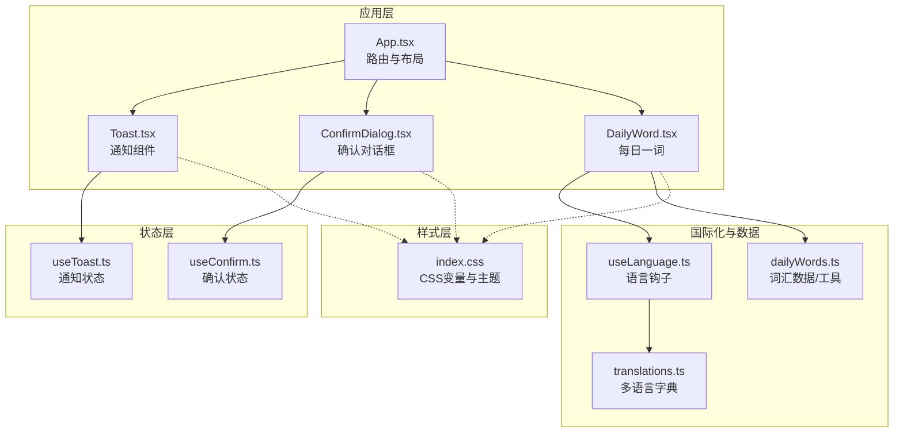
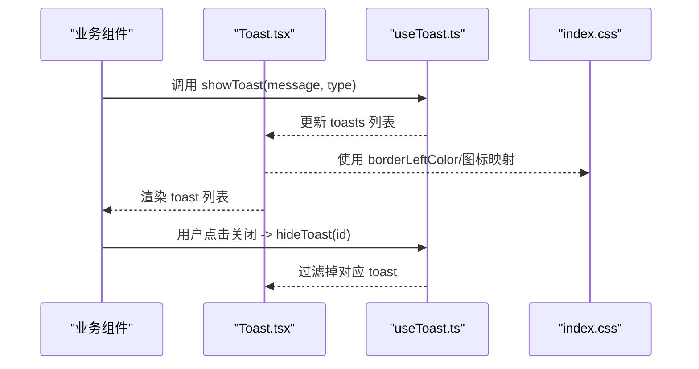
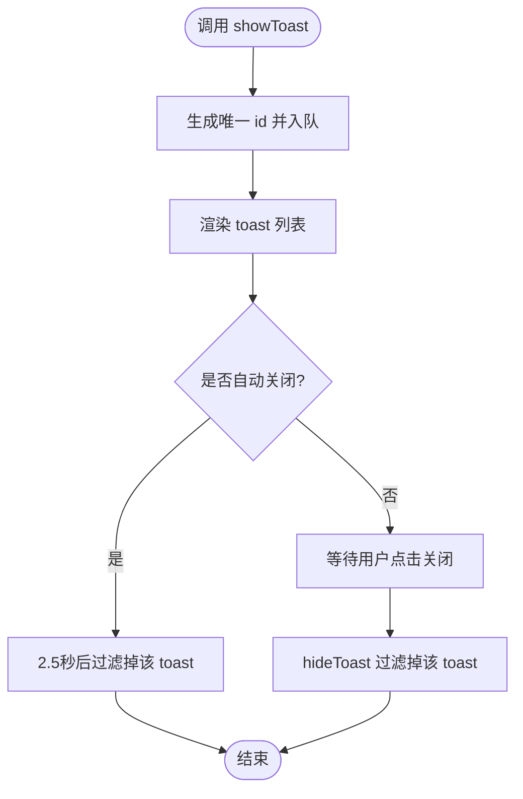
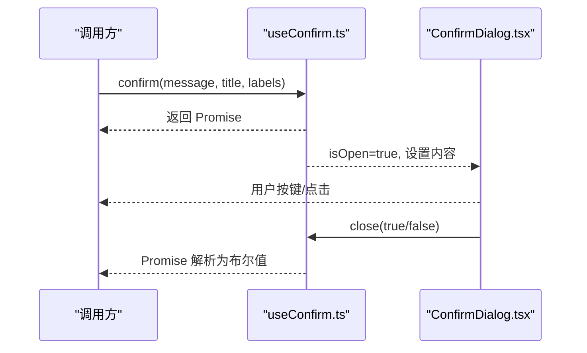
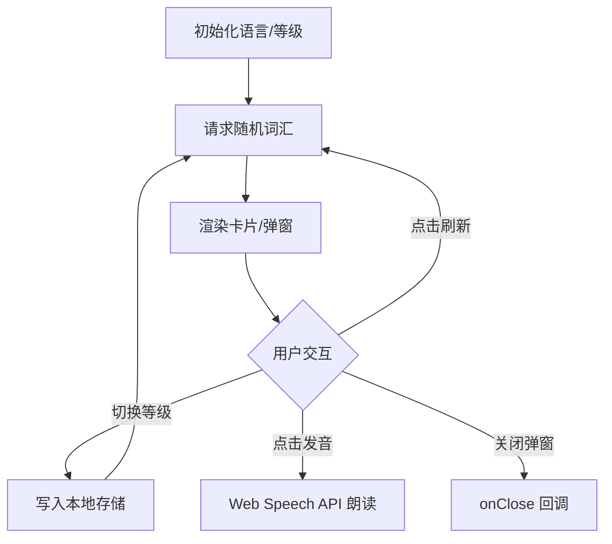
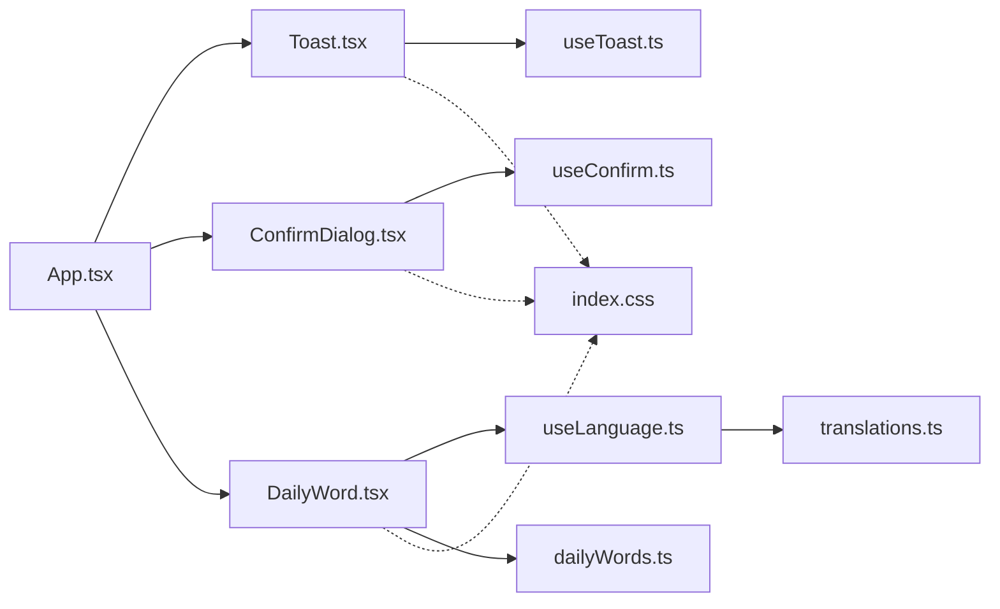

# 通用组件设计

<cite>
**本文引用的文件**
- [client/src/components/Toast.tsx](file://client/src/components/Toast.tsx)
- [client/src/components/ConfirmDialog.tsx](file://client/src/components/ConfirmDialog.tsx)
- [client/src/components/DailyWord.tsx](file://client/src/components/DailyWord.tsx)
- [client/src/store/useToast.ts](file://client/src/store/useToast.ts)
- [client/src/store/useConfirm.ts](file://client/src/store/useConfirm.ts)
- [client/src/data/dailyWords.ts](file://client/src/data/dailyWords.ts)
- [client/src/i18n/useLanguage.ts](file://client/src/i18n/useLanguage.ts)
- [client/src/i18n/translations.ts](file://client/src/i18n/translations.ts)
- [client/src/App.tsx](file://client/src/App.tsx)
- [client/src/index.css](file://client/src/index.css)
</cite>

## 目录
1. [引言](#引言)
2. [项目结构](#项目结构)
3. [核心组件](#核心组件)
4. [架构总览](#架构总览)
5. [详细组件分析](#详细组件分析)
6. [依赖分析](#依赖分析)
7. [性能考量](#性能考量)
8. [故障排查指南](#故障排查指南)
9. [结论](#结论)
10. [附录](#附录)

## 引言
本文件面向 Longhorn 前端通用组件，聚焦 Toast、ConfirmDialog、DailyWord 三大组件的设计与实现，系统阐述其可配置性、样式定制与主题适配、事件与回调机制、状态管理策略、可复用性与 API 规范，并给出无障碍、国际化与跨浏览器兼容性建议。文档同时提供可视化架构图与流程图，帮助开发者快速理解与高效复用。

## 项目结构
Longhorn 前端采用 React + TypeScript 架构，通用组件位于 client/src/components，状态管理基于 Zustand（useToast、useConfirm），国际化通过 useLanguage 与 translations 提供，主题与样式统一由 index.css 的 CSS 变量驱动。

图表来源
- [client/src/App.tsx](file://client/src/App.tsx#L66-L126)
- [client/src/components/Toast.tsx](file://client/src/components/Toast.tsx#L20-L42)
- [client/src/components/ConfirmDialog.tsx](file://client/src/components/ConfirmDialog.tsx#L6-L20)
- [client/src/components/DailyWord.tsx](file://client/src/components/DailyWord.tsx#L7-L53)
- [client/src/store/useToast.ts](file://client/src/store/useToast.ts#L17-L40)
- [client/src/store/useConfirm.ts](file://client/src/store/useConfirm.ts#L14-L36)
- [client/src/i18n/useLanguage.ts](file://client/src/i18n/useLanguage.ts#L30-L58)
- [client/src/i18n/translations.ts](file://client/src/i18n/translations.ts#L4-L745)
- [client/src/data/dailyWords.ts](file://client/src/data/dailyWords.ts#L1085-L1133)
- [client/src/index.css](file://client/src/index.css#L3-L16)

章节来源
- [client/src/App.tsx](file://client/src/App.tsx#L66-L126)
- [client/src/index.css](file://client/src/index.css#L3-L16)

## 核心组件
- Toast：轻量通知展示，支持多种类型（成功/错误/信息/警告），自动消失与手动关闭。
- ConfirmDialog：全局确认对话框，支持键盘快捷键（Esc/Enter），国际化标题与按钮文案。
- DailyWord：每日一词卡片与弹窗，支持多语言词汇库、发音、难度等级切换与本地持久化。

章节来源
- [client/src/components/Toast.tsx](file://client/src/components/Toast.tsx#L20-L42)
- [client/src/components/ConfirmDialog.tsx](file://client/src/components/ConfirmDialog.tsx#L6-L20)
- [client/src/components/DailyWord.tsx](file://client/src/components/DailyWord.tsx#L7-L53)

## 架构总览
通用组件通过 Zustand 状态管理实现解耦，UI 层仅负责渲染与交互；国际化通过 useLanguage 钩子集中管理；主题通过 CSS 变量统一风格。组件均挂载于 App 根节点，确保全局可用。

图表来源
- [client/src/components/Toast.tsx](file://client/src/components/Toast.tsx#L20-L42)
- [client/src/store/useToast.ts](file://client/src/store/useToast.ts#L17-L40)
- [client/src/index.css](file://client/src/index.css#L3-L16)

## 详细组件分析

### Toast 组件
- 设计原则
  - 无阻塞通知：自动定时消失，避免打断用户操作。
  - 类型化语义：通过颜色与图标区分成功/错误/信息/警告。
  - 最小侵入：全局容器，不影响页面布局。
- 实现要点
  - 状态：useToast 提供 toasts 数组、showToast、hideToast。
  - 渲染：遍历 toasts，按类型映射边框色与图标。
  - 关闭：点击“×”触发 hideToast，支持自动定时关闭。
- 可配置性
  - 类型：success/error/info/warning。
  - 消失时长：当前固定 2.5 秒，可通过 store 扩展参数。
- 样式与主题
  - 边框色与图标颜色来自类型映射，主题通过 CSS 变量可替换。
- 回调与事件
  - 无外部回调，关闭即销毁。
- 可复用性
  - 作为全局通知入口，业务组件仅需注入消息与类型即可。

图表来源
- [client/src/store/useToast.ts](file://client/src/store/useToast.ts#L17-L40)
- [client/src/components/Toast.tsx](file://client/src/components/Toast.tsx#L20-L42)

章节来源
- [client/src/components/Toast.tsx](file://client/src/components/Toast.tsx#L20-L42)
- [client/src/store/useToast.ts](file://client/src/store/useToast.ts#L17-L40)
- [client/src/index.css](file://client/src/index.css#L3-L16)

### ConfirmDialog 组件
- 设计原则
  - 全局确认：统一的确认/取消交互，减少重复实现。
  - 键盘友好：Esc 关闭取消，Enter 确认。
  - 国际化：标题、消息、按钮文本支持多语言。
- 实现要点
  - 状态：useConfirm 提供 isOpen、title、message、confirmLabel、cancelLabel、confirm/close。
  - 生命周期：监听键盘事件，打开/关闭时注册/移除。
  - 渲染：模态遮罩与内容区域，按钮绑定 close 回调。
- 可配置性
  - 支持传入标题、消息、按钮文案；默认回退至国际化键值。
- 样式与主题
  - 使用 CSS 变量实现主题一致性，背景模糊与动画增强体验。
- 回调与事件
  - close(value) 将 Promise 解析为布尔值，实现异步确认。
- 可复用性
  - 通过 confirm(message, title, confirmLabel, cancelLabel) 返回 Promise，简化调用方逻辑。

图表来源
- [client/src/store/useConfirm.ts](file://client/src/store/useConfirm.ts#L14-L36)
- [client/src/components/ConfirmDialog.tsx](file://client/src/components/ConfirmDialog.tsx#L6-L20)

章节来源
- [client/src/components/ConfirmDialog.tsx](file://client/src/components/ConfirmDialog.tsx#L6-L20)
- [client/src/store/useConfirm.ts](file://client/src/store/useConfirm.ts#L14-L36)
- [client/src/i18n/useLanguage.ts](file://client/src/i18n/useLanguage.ts#L30-L58)
- [client/src/i18n/translations.ts](file://client/src/i18n/translations.ts#L4-L745)

### DailyWord 组件
- 设计原则
  - 低耦合：卡片与弹窗分离，按需渲染。
  - 本地持久化：难度等级与语言联动存储。
  - 发音与多语言：基于 Web Speech API 与语言映射。
- 实现要点
  - 卡片 DailyWordBadge：展示单词、语言标识，点击弹窗。
  - 弹窗 DailyWordModal：展示释义、例句、难度切换、刷新。
  - 数据源：dailyWords.ts 提供词汇库、等级映射、发音语言。
  - 国际化：使用 useLanguage 与 translations。
- 可配置性
  - 语言：zh/en/de/ja。
  - 难度：根据语言映射不同等级（如德语 A1/A2/B1）。
  - 交互：刷新、发音、难度切换。
- 样式与主题
  - 使用 CSS 变量实现深色主题与玻璃拟态。
- 回调与事件
  - onRefresh/onLevelChange/onClose 用于与父级通信。
- 可复用性
  - 导出 DailyWordBadge 与 DailyWordModal，可在不同页面复用。

图表来源
- [client/src/components/DailyWord.tsx](file://client/src/components/DailyWord.tsx#L7-L53)
- [client/src/components/DailyWord.tsx](file://client/src/components/DailyWord.tsx#L130-L421)
- [client/src/data/dailyWords.ts](file://client/src/data/dailyWords.ts#L1085-L1133)
- [client/src/i18n/useLanguage.ts](file://client/src/i18n/useLanguage.ts#L30-L58)

章节来源
- [client/src/components/DailyWord.tsx](file://client/src/components/DailyWord.tsx#L7-L53)
- [client/src/components/DailyWord.tsx](file://client/src/components/DailyWord.tsx#L130-L421)
- [client/src/data/dailyWords.ts](file://client/src/data/dailyWords.ts#L1085-L1133)
- [client/src/i18n/useLanguage.ts](file://client/src/i18n/useLanguage.ts#L30-L58)
- [client/src/i18n/translations.ts](file://client/src/i18n/translations.ts#L452-L458)
- [client/src/index.css](file://client/src/index.css#L3-L16)

## 依赖分析
- 组件间依赖
  - App.tsx 将 Toast 与 ConfirmDialog 作为全局组件挂载。
  - DailyWordBadge 在顶部栏渲染，依赖 useLanguage 与 dailyWords 数据。
- 状态依赖
  - Toast 依赖 useToast，ConfirmDialog 依赖 useConfirm。
- 国际化依赖
  - ConfirmDialog 与 DailyWord 均依赖 useLanguage 与 translations。
- 主题依赖
  - 三组件均使用 index.css 的 CSS 变量实现主题一致。

图表来源
- [client/src/App.tsx](file://client/src/App.tsx#L66-L126)
- [client/src/components/Toast.tsx](file://client/src/components/Toast.tsx#L20-L42)
- [client/src/components/ConfirmDialog.tsx](file://client/src/components/ConfirmDialog.tsx#L6-L20)
- [client/src/components/DailyWord.tsx](file://client/src/components/DailyWord.tsx#L7-L53)
- [client/src/store/useToast.ts](file://client/src/store/useToast.ts#L17-L40)
- [client/src/store/useConfirm.ts](file://client/src/store/useConfirm.ts#L14-L36)
- [client/src/i18n/useLanguage.ts](file://client/src/i18n/useLanguage.ts#L30-L58)
- [client/src/i18n/translations.ts](file://client/src/i18n/translations.ts#L4-L745)
- [client/src/data/dailyWords.ts](file://client/src/data/dailyWords.ts#L1085-L1133)
- [client/src/index.css](file://client/src/index.css#L3-L16)

章节来源
- [client/src/App.tsx](file://client/src/App.tsx#L66-L126)
- [client/src/store/useToast.ts](file://client/src/store/useToast.ts#L17-L40)
- [client/src/store/useConfirm.ts](file://client/src/store/useConfirm.ts#L14-L36)
- [client/src/i18n/useLanguage.ts](file://client/src/i18n/useLanguage.ts#L30-L58)
- [client/src/i18n/translations.ts](file://client/src/i18n/translations.ts#L4-L745)
- [client/src/data/dailyWords.ts](file://client/src/data/dailyWords.ts#L1085-L1133)
- [client/src/index.css](file://client/src/index.css#L3-L16)

## 性能考量
- Toast
  - 列表渲染简单，单次入队/出队为 O(n) 过滤，n 通常很小，性能开销可忽略。
  - 自动消失使用 setTimeout，建议在组件卸载时清理，避免内存泄漏。
- ConfirmDialog
  - 键盘事件监听在打开时注册，关闭时移除，避免常驻监听。
  - 模态渲染为一次性挂载，不会频繁重建。
- DailyWord
  - 本地存储读写与网络请求需节流，避免频繁刷新。
  - 发音使用 Web Speech API，建议在移动端谨慎使用，避免阻塞主线程。

## 故障排查指南
- Toast 不显示
  - 检查 App 是否挂载了 Toast 组件。
  - 确认 useToast 的 toasts 是否正确入队。
- ConfirmDialog 不响应
  - 确认 isOpen 为 true 且键盘事件未被其他元素拦截。
  - 检查 confirm/close 的 Promise 流程是否被消费。
- DailyWord 无数据
  - 检查语言与等级映射是否正确。
  - 确认网络请求路径与返回格式符合预期。
- 国际化无效
  - 确认 useLanguage 的语言切换与 t 函数调用。
  - 检查 translations 中是否存在对应键值。

章节来源
- [client/src/App.tsx](file://client/src/App.tsx#L122-L124)
- [client/src/store/useToast.ts](file://client/src/store/useToast.ts#L17-L40)
- [client/src/store/useConfirm.ts](file://client/src/store/useConfirm.ts#L14-L36)
- [client/src/i18n/useLanguage.ts](file://client/src/i18n/useLanguage.ts#L30-L58)
- [client/src/i18n/translations.ts](file://client/src/i18n/translations.ts#L4-L745)

## 结论
Toast、ConfirmDialog、DailyWord 三组件通过清晰的职责划分与状态管理，实现了高内聚、低耦合的通用能力。借助 CSS 变量与国际化体系，组件具备良好的主题适配与多语言支持。建议后续扩展：
- Toast：支持自定义时长、位置与动画。
- ConfirmDialog：支持多语言按钮文案与图标。
- DailyWord：支持缓存与离线模式、发音失败降级。

## 附录

### API 接口规范（概要）
- Toast
  - 方法：showToast(message: string, type?: 'success' | 'error' | 'info' | 'warning')
  - 方法：hideToast(id: string)
- ConfirmDialog
  - 方法：confirm(message: string, title?: string, confirmLabel?: string, cancelLabel?: string) => Promise<boolean>
  - 方法：close(value: boolean) => void
- DailyWord
  - 组件：DailyWordBadge（渲染徽章）
  - 组件：DailyWordModal（渲染弹窗）
  - 工具：getAvailableLevels(language) => string[]
  - 工具：getRandomWord(language, level?) => WordEntry
  - 工具：getSpeechLang(language) => string

章节来源
- [client/src/store/useToast.ts](file://client/src/store/useToast.ts#L17-L40)
- [client/src/store/useConfirm.ts](file://client/src/store/useConfirm.ts#L14-L36)
- [client/src/data/dailyWords.ts](file://client/src/data/dailyWords.ts#L1085-L1133)