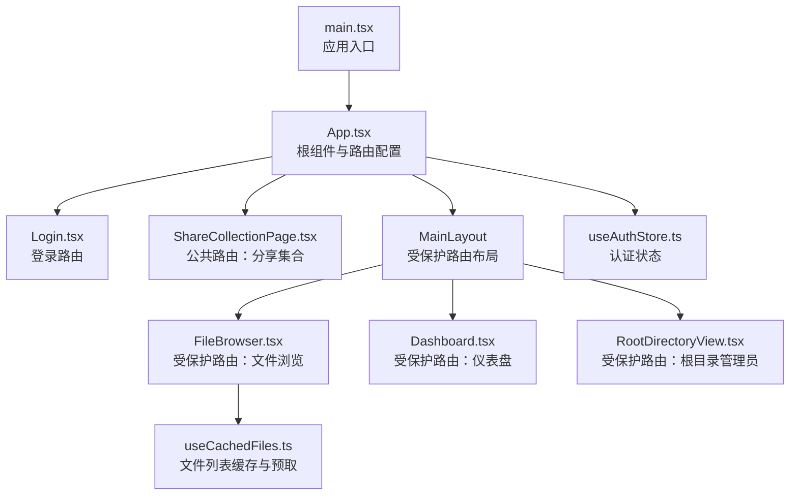
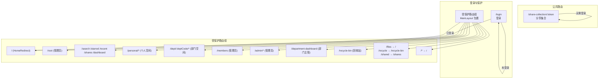
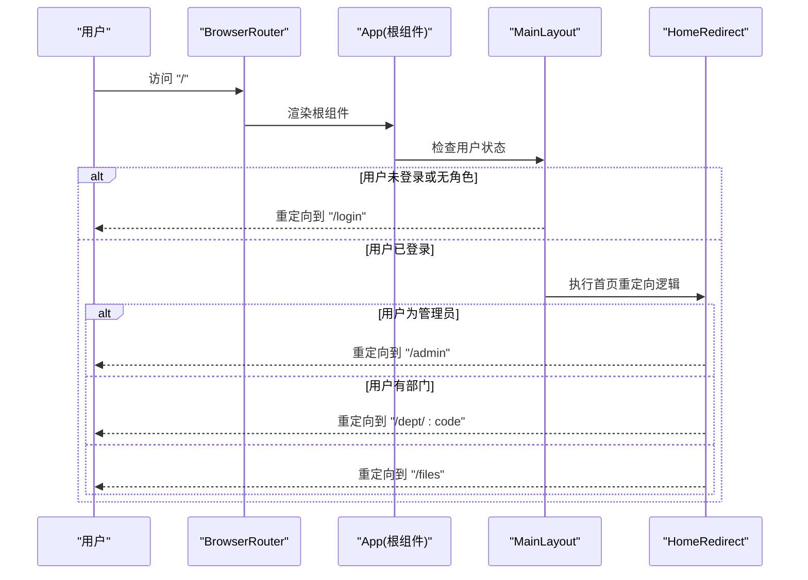
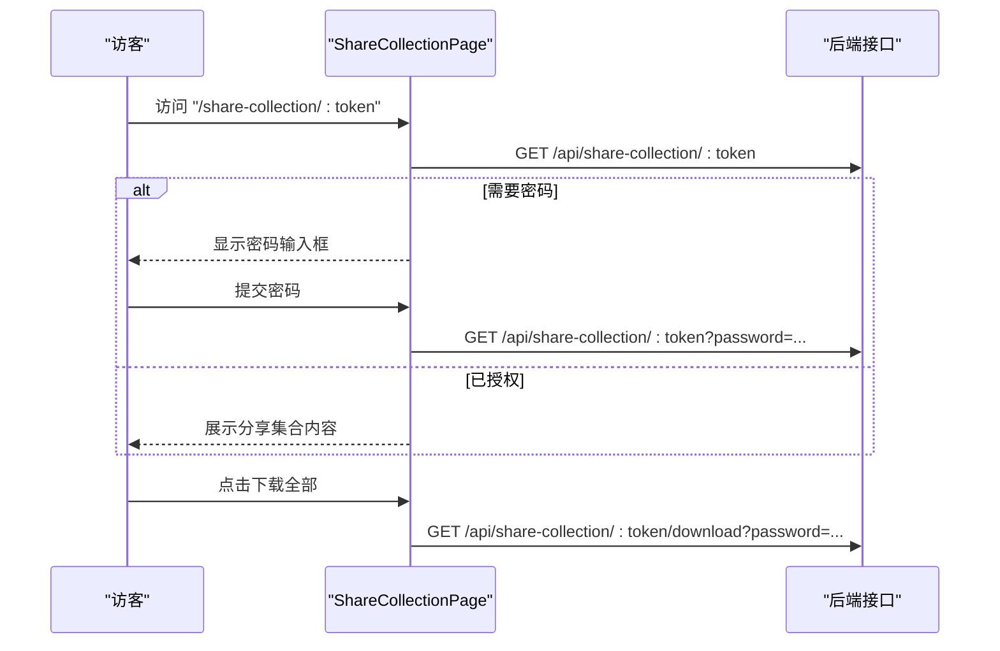
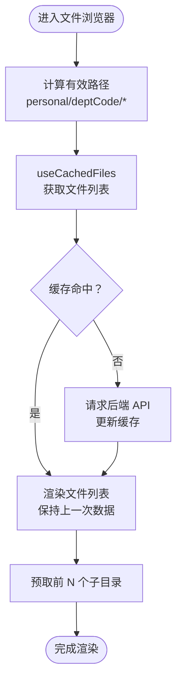
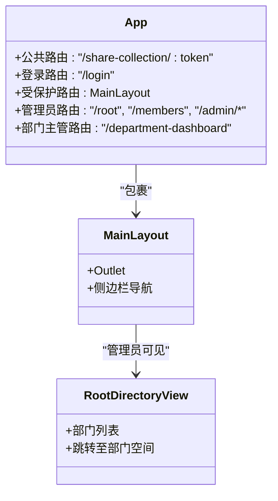
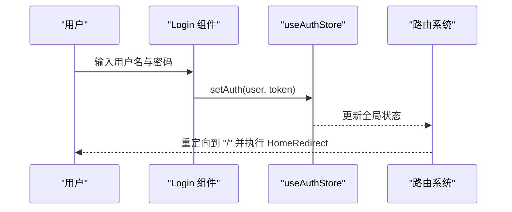
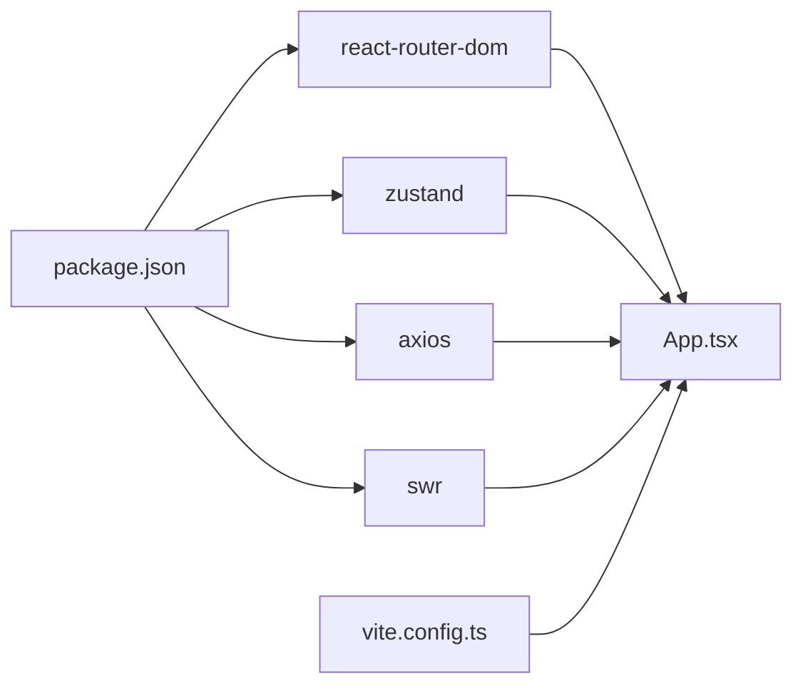

# 路由系统设计

<cite>
**本文档引用的文件**
- [App.tsx](file://client/src/App.tsx)
- [main.tsx](file://client/src/main.tsx)
- [useAuthStore.ts](file://client/src/store/useAuthStore.ts)
- [Login.tsx](file://client/src/components/Login.tsx)
- [ShareCollectionPage.tsx](file://client/src/components/ShareCollectionPage.tsx)
- [FileBrowser.tsx](file://client/src/components/FileBrowser.tsx)
- [useCachedFiles.ts](file://client/src/hooks/useCachedFiles.ts)
- [Dashboard.tsx](file://client/src/components/Dashboard.tsx)
- [RootDirectoryView.tsx](file://client/src/components/RootDirectoryView.tsx)
- [vite.config.ts](file://client/vite.config.ts)
- [package.json](file://client/package.json)
</cite>

## 目录
1. [简介](#简介)
2. [项目结构](#项目结构)
3. [核心组件](#核心组件)
4. [架构总览](#架构总览)
5. [详细组件分析](#详细组件分析)
6. [依赖关系分析](#依赖关系分析)
7. [性能考虑](#性能考虑)
8. [故障排除指南](#故障排除指南)
9. [结论](#结论)

## 简介
本文件针对 Longhorn 前端路由系统进行深入技术文档化，重点覆盖以下方面：
- React Router DOM 的配置与使用：路由层级设计、嵌套路由实现、路由守卫机制
- 公共路由（分享页面）、受保护路由（主应用）、权限路由（管理员、部门主管）的配置方式
- 路由参数传递、查询字符串处理、路由状态管理
- 路由懒加载、代码分割与性能优化策略
- 路由调试方法、错误处理机制与用户体验优化技巧

Longhorn 前端基于 React Router DOM v7 实现，采用 BrowserRouter 作为路由容器，在应用根组件中集中定义所有路由规则，并通过布局组件实现嵌套路由与权限控制。

## 项目结构
前端路由系统位于客户端源码目录中，核心入口为应用根组件，路由配置集中在该组件内完成。主要文件与职责如下：
- 应用入口：负责挂载根组件
- 根组件（App）：集中定义所有路由规则、权限守卫与嵌套路由
- 认证存储：提供用户状态与令牌的全局状态管理
- 登录组件：处理用户认证流程
- 分享集合页：公共路由，用于展示分享集合内容
- 文件浏览器：受保护路由的核心视图，支持个人空间与部门空间导航
- 缓存钩子：为文件列表提供 SWR 缓存与预取能力
- 仪表盘与根目录视图：受保护路由中的功能页面

**图表来源**
- [main.tsx](file://client/src/main.tsx#L1-L11)
- [App.tsx](file://client/src/App.tsx#L66-L126)
- [Login.tsx](file://client/src/components/Login.tsx#L1-L161)
- [ShareCollectionPage.tsx](file://client/src/components/ShareCollectionPage.tsx#L1-L324)
- [FileBrowser.tsx](file://client/src/components/FileBrowser.tsx#L1-L200)
- [useAuthStore.ts](file://client/src/store/useAuthStore.ts#L1-L31)
- [useCachedFiles.ts](file://client/src/hooks/useCachedFiles.ts#L1-L108)
- [Dashboard.tsx](file://client/src/components/Dashboard.tsx#L1-L200)
- [RootDirectoryView.tsx](file://client/src/components/RootDirectoryView.tsx#L1-L127)

**章节来源**
- [main.tsx](file://client/src/main.tsx#L1-L11)
- [App.tsx](file://client/src/App.tsx#L66-L126)

## 核心组件
本节从路由角度分析关键组件及其职责：
- 根组件与路由容器：在根组件中引入 BrowserRouter 并集中定义所有路由规则
- 主布局组件：提供受保护路由的统一布局与侧边栏导航
- 权限守卫：通过条件渲染与重定向实现角色级访问控制
- 公共路由：分享集合页面，无需登录即可访问
- 受保护路由：主应用内的所有页面均需登录后可见
- 路由参数与查询：通过 useParams 与查询字符串处理分享密码等参数

**章节来源**
- [App.tsx](file://client/src/App.tsx#L66-L126)
- [useAuthStore.ts](file://client/src/store/useAuthStore.ts#L1-L31)
- [ShareCollectionPage.tsx](file://client/src/components/ShareCollectionPage.tsx#L32-L69)

## 架构总览
Longhorn 的路由架构采用“公共路由 + 受保护路由 + 权限路由”的分层设计：
- 公共路由：分享集合页面，使用动态路由参数 token
- 登录路由：当用户未登录时显示登录页，已登录则重定向到首页
- 受保护路由：以 MainLayout 包裹的嵌套路由，根据用户角色显示不同菜单与页面
- 权限路由：管理员与部门主管专用页面，仅对应角色可访问
- 重定向与兜底：首页根据用户角色重定向至管理员或部门空间；未知路径重定向至首页

**图表来源**
- [App.tsx](file://client/src/App.tsx#L72-L120)

**章节来源**
- [App.tsx](file://client/src/App.tsx#L72-L120)

## 详细组件分析

### 路由配置与权限守卫
- 路由容器：BrowserRouter 提供路由上下文，所有路由规则在根组件中集中定义
- 权限守卫：MainLayout 通过 useAuthStore 获取用户状态，若用户不存在或角色缺失，则强制跳转到登录页
- 角色级路由：管理员与部门主管专用页面通过条件渲染实现访问控制
- 首页重定向：HomeRedirect 根据用户角色重定向至管理员面板或部门空间

**图表来源**
- [App.tsx](file://client/src/App.tsx#L66-L126)
- [useAuthStore.ts](file://client/src/store/useAuthStore.ts#L17-L30)

**章节来源**
- [App.tsx](file://client/src/App.tsx#L66-L126)
- [useAuthStore.ts](file://client/src/store/useAuthStore.ts#L1-L31)

### 公共路由：分享集合页面
- 动态路由参数：通过 useParams 获取 token，用于标识分享集合
- 查询参数处理：通过 axios 请求携带 password 参数，支持分享密码校验
- 语言切换：根据分享数据设置语言，提升国际化体验
- 下载功能：提供整包下载能力，支持密码授权

**图表来源**
- [ShareCollectionPage.tsx](file://client/src/components/ShareCollectionPage.tsx#L32-L87)

**章节来源**
- [ShareCollectionPage.tsx](file://client/src/components/ShareCollectionPage.tsx#L32-L87)

### 受保护路由：文件浏览器与个人/部门空间
- 路由参数传递：通过 useParams 获取部门代码与路径片段，支持深层目录浏览
- 嵌套路由：个人空间与部门空间均使用通配符路由，配合 Outlet 实现嵌套视图
- 文件列表缓存：useCachedFiles 提供 SWR 缓存、去重与智能轮询，提升导航性能
- 预取策略：根据当前目录可见子目录进行预取，减少用户点击延迟

**图表来源**
- [FileBrowser.tsx](file://client/src/components/FileBrowser.tsx#L72-L102)
- [useCachedFiles.ts](file://client/src/hooks/useCachedFiles.ts#L40-L91)

**章节来源**
- [FileBrowser.tsx](file://client/src/components/FileBrowser.tsx#L72-L102)
- [useCachedFiles.ts](file://client/src/hooks/useCachedFiles.ts#L40-L91)

### 权限路由：管理员与部门主管
- 管理员路由：/root、/members、/admin/* 仅管理员可访问
- 部门主管路由：/department-dashboard 仅部门主管可访问
- 根目录视图：管理员可查看所有部门并跳转至相应空间

**图表来源**
- [App.tsx](file://client/src/App.tsx#L78-L112)
- [RootDirectoryView.tsx](file://client/src/components/RootDirectoryView.tsx#L7-L126)

**章节来源**
- [App.tsx](file://client/src/App.tsx#L78-L112)
- [RootDirectoryView.tsx](file://client/src/components/RootDirectoryView.tsx#L7-L126)

### 登录与认证流程
- 登录组件：处理用户名与密码提交，成功后通过 useAuthStore 设置用户与令牌
- 认证状态：useAuthStore 将用户信息与令牌持久化到本地存储，并提供全局状态
- 路由守卫：未登录用户无法访问受保护路由，自动跳转到登录页

**图表来源**
- [Login.tsx](file://client/src/components/Login.tsx#L15-L27)
- [useAuthStore.ts](file://client/src/store/useAuthStore.ts#L17-L30)
- [App.tsx](file://client/src/App.tsx#L66-L86)

**章节来源**
- [Login.tsx](file://client/src/components/Login.tsx#L15-L27)
- [useAuthStore.ts](file://client/src/store/useAuthStore.ts#L17-L30)
- [App.tsx](file://client/src/App.tsx#L66-L86)

## 依赖关系分析
- 路由库：React Router DOM v7
- 状态管理：Zustand（认证状态）
- 数据获取：Axios（HTTP 请求）
- 缓存策略：SWR（useCachedFiles）
- 构建工具：Vite（版本信息注入）

**图表来源**
- [package.json](file://client/package.json#L12-L28)
- [vite.config.ts](file://client/vite.config.ts#L62-L71)
- [App.tsx](file://client/src/App.tsx#L1-L37)

**章节来源**
- [package.json](file://client/package.json#L12-L28)
- [vite.config.ts](file://client/vite.config.ts#L62-L71)

## 性能考虑
- SWR 缓存与去重：useCachedFiles 使用去重间隔与智能比较函数，避免重复请求与无效渲染
- 智能轮询：启用焦点与网络重连触发的重新验证，同时通过比较函数过滤无变化的数据
- 预取策略：根据当前目录的可见子目录进行预热，减少用户点击时的等待时间
- 版本信息注入：Vite 在构建时注入版本与提交信息，便于性能监控与问题定位

优化建议：
- 对深层目录浏览场景，可进一步限制预取数量或按需触发
- 结合浏览器缓存策略，对静态资源与图片进行 CDN 加速
- 使用 React.lazy 与 Suspense 实现路由级别的代码分割（当前未实现，可在大型页面模块中逐步引入）

**章节来源**
- [useCachedFiles.ts](file://client/src/hooks/useCachedFiles.ts#L40-L91)
- [vite.config.ts](file://client/vite.config.ts#L62-L71)

## 故障排除指南
- 登录失败：检查后端登录接口返回的错误信息，确认用户名与密码正确性
- 无权限访问：确认用户角色是否为管理员或部门主管，检查路由守卫逻辑
- 分享集合访问异常：确认 token 是否有效，密码是否正确传递到查询参数
- 文件列表加载缓慢：检查网络连接与后端 API 响应时间，观察 SWR 缓存命中情况
- 路由重定向循环：排查 HomeRedirect 逻辑与用户部门信息解析

调试技巧：
- 在浏览器开发者工具中查看网络请求与响应头，确认 Authorization 头是否正确
- 使用 React DevTools 检查路由组件的 props 与状态变化
- 在控制台输出关键变量（如 token、user、deptCode），辅助定位问题

**章节来源**
- [Login.tsx](file://client/src/components/Login.tsx#L15-L27)
- [ShareCollectionPage.tsx](file://client/src/components/ShareCollectionPage.tsx#L42-L65)
- [App.tsx](file://client/src/App.tsx#L66-L126)

## 结论
Longhorn 的前端路由系统通过清晰的分层设计与严格的权限控制，实现了公共访问、受保护访问与角色级访问的完整覆盖。结合 SWR 缓存与预取策略，显著提升了用户体验与性能表现。未来可在路由层面引入代码分割与更细粒度的懒加载策略，进一步优化首屏加载与深层导航体验。