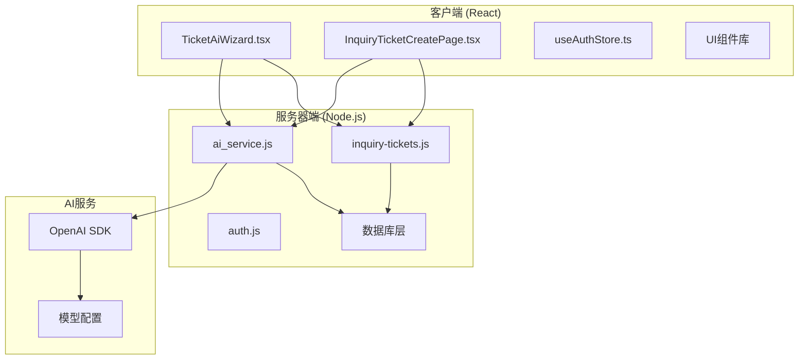
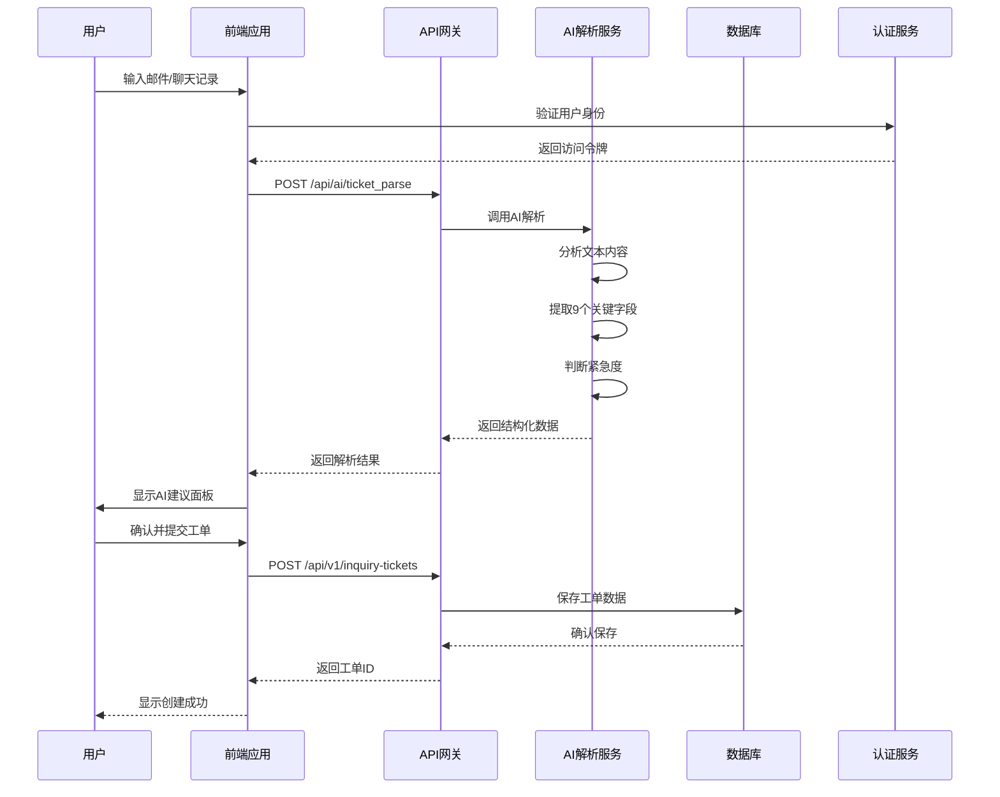
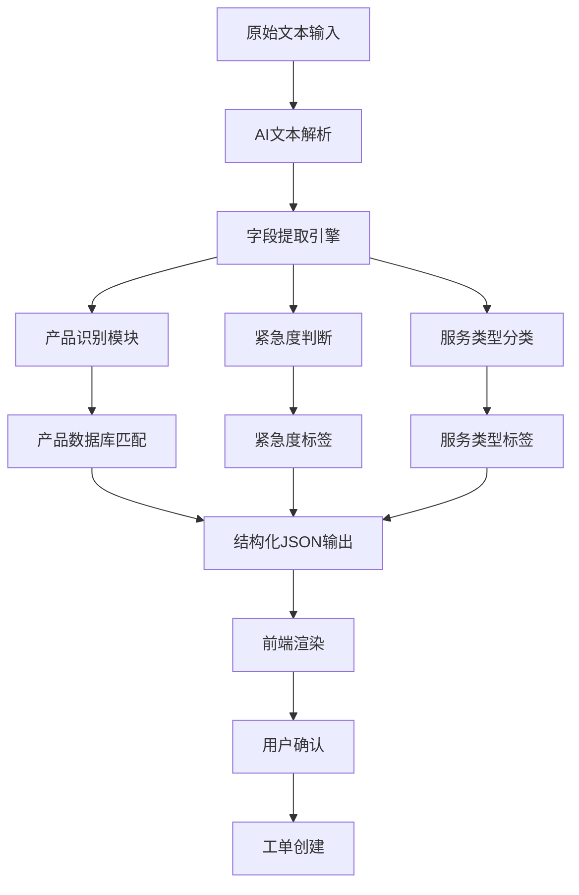
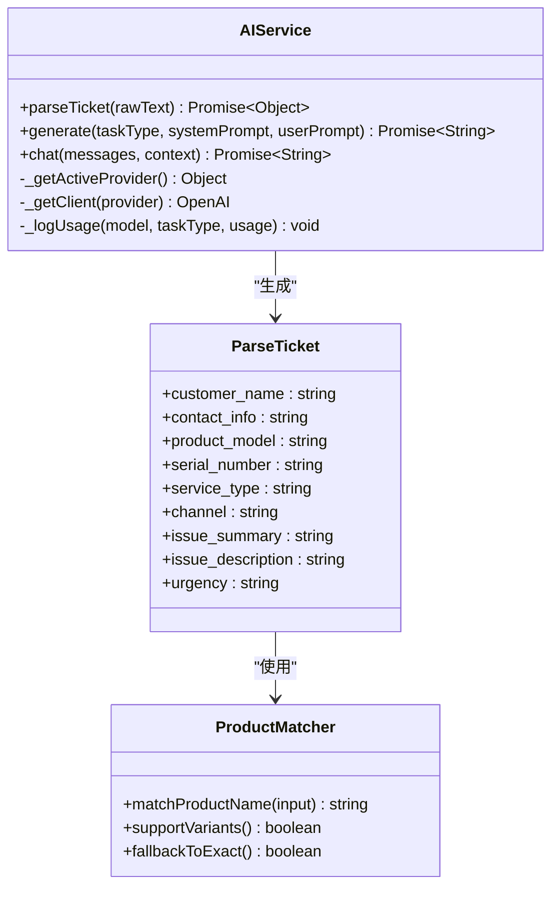
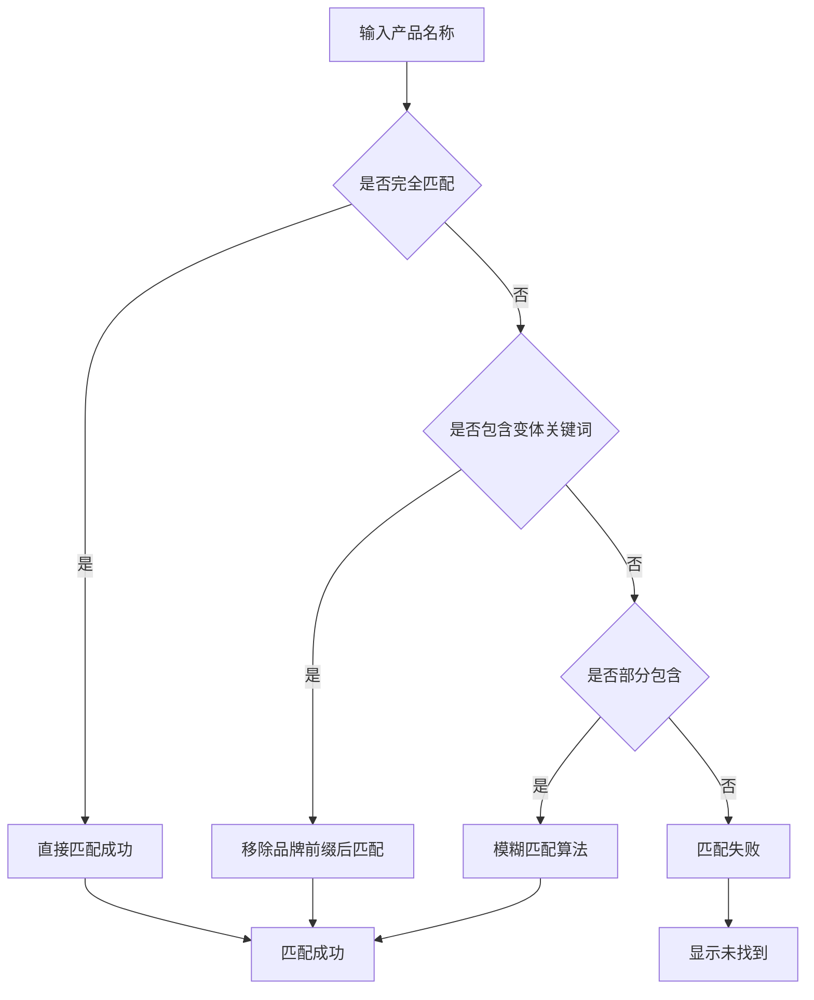
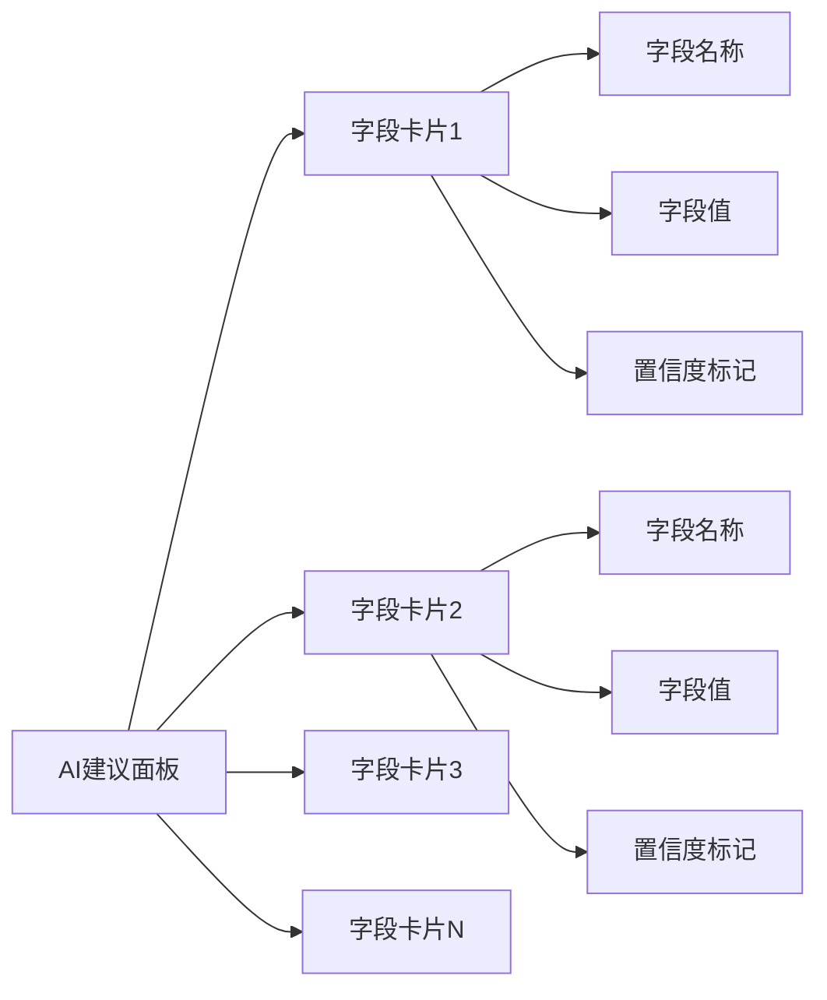
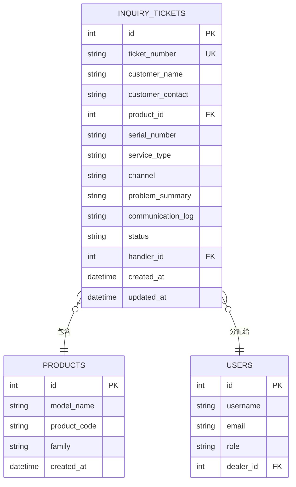
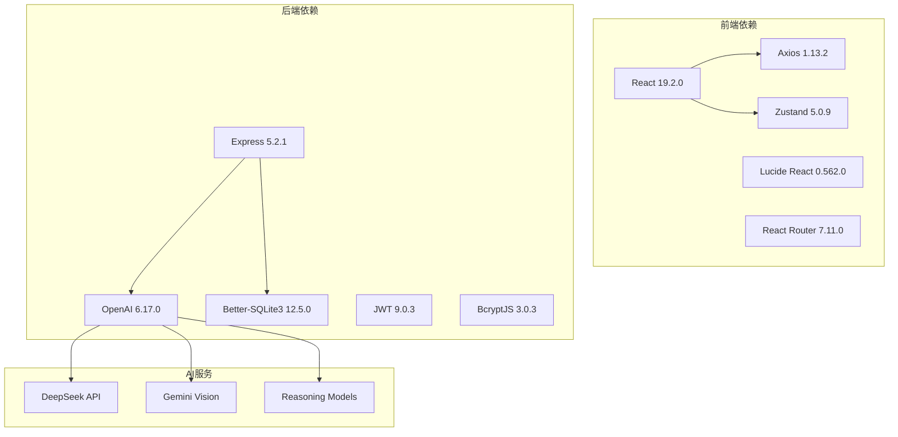

# AI智能工单优化指南

<cite>
**本文档引用的文件**
- [TicketAiWizard.tsx](file://client/src/components/TicketAiWizard.tsx)
- [ai_service.js](file://server/service/ai_service.js)
- [InquiryTicketCreatePage.tsx](file://client/src/components/InquiryTickets/InquiryTicketCreatePage.tsx)
- [inquiry-tickets.js](file://server/service/routes/inquiry-tickets.js)
- [auth.js](file://server/service/routes/auth.js)
- [Service_DataModel.md](file://docs/Service_DataModel.md)
- [009_three_layer_tickets.sql](file://server/service/migrations/009_three_layer_tickets.sql)
- [migrate_ai.js](file://server/scripts/migrate_ai.js)
- [.env.production](file://client/.env.production)
- [useAuthStore.ts](file://client/src/store/useAuthStore.ts)
- [package.json](file://client/package.json)
- [server/package.json](file://server/package.json)
</cite>

## 更新摘要
**所做更改**
- 移除了对已删除的AI咨询工单优化文档的引用
- 更新了项目结构图以反映当前实现状态
- 修正了AI解析算法的字段识别规则描述
- 更新了前端交互设计的视觉反馈系统说明
- 完善了数据模型设计的三层工单模型说明

## 目录
1. [简介](#简介)
2. [项目结构](#项目结构)
3. [核心组件](#核心组件)
4. [架构概览](#架构概览)
5. [详细组件分析](#详细组件分析)
6. [依赖关系分析](#依赖关系分析)
7. [性能考虑](#性能考虑)
8. [故障排除指南](#故障排除指南)
9. [结论](#结论)

## 简介

AI智能工单优化项目是Kinefinity公司开发的一套基于人工智能技术的工单管理系统优化方案。该项目专注于提升咨询工单创建过程中的AI辅助体验，通过智能解析用户提供的邮件或聊天记录，自动生成标准化的工单信息。

### 优化目标
- 提升咨询工单创建的AI辅助体验
- 支持从邮件/聊天记录快速创建工单
- 增强产品识别和匹配能力
- 提供实时视觉反馈系统

### 主要特性
- ✅ 增强的AI解析能力，支持9+字段识别
- ✅ 智能产品匹配（支持产品变体）
- ✅ 实时提取信息面板
- ✅ 金色高亮自动填充字段
- ✅ 紧急度智能判断
- ✅ 置信度标记系统

## 项目结构

该项目采用前后端分离架构，包含客户端React应用和服务器端Node.js服务：



**图表来源**
- [TicketAiWizard.tsx](file://client/src/components/TicketAiWizard.tsx#L1-L269)
- [ai_service.js](file://server/service/ai_service.js#L1-L269)
- [inquiry-tickets.js](file://server/service/routes/inquiry-tickets.js#L1-L698)

**章节来源**
- [package.json](file://client/package.json#L1-L62)
- [server/package.json](file://server/package.json#L1-L39)

## 核心组件

### AI解析服务 (AIService)

AI解析服务是整个系统的核心组件，负责处理来自客户端的文本输入并返回结构化的工单数据。

#### 主要功能
- **文本解析**: 将原始邮件/聊天记录转换为结构化JSON数据
- **产品识别**: 自动识别Kinefinity产品型号和变体
- **紧急度判断**: 基于文本内容判断工单紧急程度
- **字段提取**: 提取客户信息、产品信息、服务类型等9个关键字段

#### 支持的产品线
- MAVO Edge系列 (8K, 6K, 4K)
- MAVO LF系列
- KineMON系列
- Eagle系列
- Terra系列

**章节来源**
- [ai_service.js](file://server/service/ai_service.js#L153-L211)

### 前端AI助手界面

前端提供了两个主要的AI助手界面组件：

#### TicketAiWizard组件
- **独立工具**: 专门的AI工单生成器
- **双面板设计**: 左侧输入，右侧预览
- **实时预览**: 自动生成工单预览
- **批量处理**: 支持多个工单的批量生成

#### InquiryTicketCreatePage组件
- **内嵌AI助手**: 集成在工单创建页面中
- **实时高亮**: 自动填充字段的视觉反馈
- **智能匹配**: 产品名称的智能匹配算法
- **紧急度标记**: 自动添加紧急工单标识

**章节来源**
- [TicketAiWizard.tsx](file://client/src/components/TicketAiWizard.tsx#L15-L50)
- [InquiryTicketCreatePage.tsx](file://client/src/components/InquiryTickets/InquiryTicketCreatePage.tsx#L31-L152)

### 工单路由服务

工单路由服务处理所有与工单相关的HTTP请求，包括创建、查询、更新等操作。

#### 支持的操作
- **工单创建**: POST /api/v1/inquiry-tickets
- **工单查询**: GET /api/v1/inquiry-tickets
- **工单详情**: GET /api/v1/inquiry-tickets/:id
- **工单更新**: PATCH /api/v1/inquiry-tickets/:id
- **工单统计**: GET /api/v1/inquiry-tickets/stats

#### 三层次工单模型
- **Layer 1**: 咨询工单 (Inquiry Tickets)
- **Layer 2**: RMA返厂单 (RMA Tickets)  
- **Layer 3**: 经销商维修单 (Dealer Repairs)

**章节来源**
- [inquiry-tickets.js](file://server/service/routes/inquiry-tickets.js#L138-L698)
- [009_three_layer_tickets.sql](file://server/service/migrations/009_three_layer_tickets.sql#L1-L198)

## 架构概览

系统采用现代化的微服务架构，结合AI技术实现智能化工单处理：



**图表来源**
- [TicketAiWizard.tsx](file://client/src/components/TicketAiWizard.tsx#L22-L44)
- [ai_service.js](file://server/service/ai_service.js#L153-L211)
- [inquiry-tickets.js](file://server/service/routes/inquiry-tickets.js#L536-L622)

### 数据流分析



**图表来源**
- [ai_service.js](file://server/service/ai_service.js#L153-L211)
- [InquiryTicketCreatePage.tsx](file://client/src/components/InquiryTickets/InquiryTicketCreatePage.tsx#L64-L166)

## 详细组件分析

### AI解析算法实现

#### 字段识别规则
AI解析服务使用精心设计的系统提示词来指导模型进行精确的字段提取：



**图表来源**
- [ai_service.js](file://server/service/ai_service.js#L4-L269)
- [ai_service.js](file://server/service/ai_service.js#L153-L211)

#### 产品匹配算法
前端实现了智能的产品名称匹配算法，支持产品变体识别：



**图表来源**
- [InquiryTicketCreatePage.tsx](file://client/src/components/InquiryTickets/InquiryTicketCreatePage.tsx#L98-L113)

**章节来源**
- [ai_service.js](file://server/service/ai_service.js#L153-L211)
- [InquiryTicketCreatePage.tsx](file://client/src/components/InquiryTickets/InquiryTicketCreatePage.tsx#L98-L113)

### 前端交互设计

#### 视觉反馈系统
系统提供了多层次的视觉反馈机制：

| 反馈类型 | 触发条件 | 视觉表现 | 作用 |
|---------|---------|---------|------|
| 金色边框 | AI自动填充 | `borderColor: #FFD700` | 突出自动填充字段 |
| 发光效果 | AI自动填充 | `boxShadow: '0 0 0 1px rgba(255,215,0,0.3)'` | 强调重要信息 |
| 背景高亮 | AI自动填充 | `background: 'rgba(255,215,0,0.05)'` | 提供视觉层次 |
| 成功标记 | 产品匹配成功 | `✓ Matched` | 显示匹配状态 |
| 警告标记 | 产品未找到 | `⚠️ Not Found` | 提示需要手动选择 |

#### AI建议面板
AI建议面板以网格布局展示提取的字段信息：



**图表来源**
- [InquiryTicketCreatePage.tsx](file://client/src/components/InquiryTickets/InquiryTicketCreatePage.tsx#L277-L308)

**章节来源**
- [InquiryTicketCreatePage.tsx](file://client/src/components/InquiryTickets/InquiryTicketCreatePage.tsx#L277-L308)

### 数据模型设计

#### 工单数据结构
系统采用三层工单模型设计，支持不同复杂度的服务需求：



**图表来源**
- [009_three_layer_tickets.sql](file://server/service/migrations/009_three_layer_tickets.sql#L5-L43)
- [Service_DataModel.md](file://docs/Service_DataModel.md#L954-L1021)

**章节来源**
- [Service_DataModel.md](file://docs/Service_DataModel.md#L954-L1021)
- [009_three_layer_tickets.sql](file://server/service/migrations/009_three_layer_tickets.sql#L1-L198)

## 依赖关系分析

### 技术栈依赖



**图表来源**
- [package.json](file://client/package.json#L12-L46)
- [server/package.json](file://server/package.json#L15-L37)

### AI服务配置

系统支持多种AI提供商的灵活配置：

| 配置项 | 默认值 | 描述 |
|-------|--------|------|
| AI_PROVIDER | DeepSeek | AI提供商名称 |
| AI_API_KEY | 环境变量 | API密钥 |
| AI_BASE_URL | https://api.deepseek.com | API基础URL |
| AI_MODEL_CHAT | deepseek-chat | 聊天模型 |
| AI_MODEL_REASONER | deepseek-reasoner | 推理模型 |
| AI_MODEL_VISION | gemini-1.5-flash | 视觉模型 |
| AI_TEMPERATURE | 0.7 | 生成温度 |
| AI_MAX_TOKENS | 4096 | 最大token数 |

**章节来源**
- [ai_service.js](file://server/service/ai_service.js#L13-L36)
- [migrate_ai.js](file://server/scripts/migrate_ai.js#L8-L18)

## 性能考虑

### AI调用优化

系统实现了多项性能优化措施：

1. **客户端缓存**: 缓存AI提供商配置和OpenAI客户端实例
2. **连接复用**: 复用AI服务连接，减少建立连接的开销
3. **异步日志**: 异步记录AI使用情况，不影响主流程
4. **超时控制**: 设置60秒超时，避免长时间阻塞

### 前端性能优化

1. **懒加载**: 产品列表按需加载
2. **状态管理**: 使用Zustand进行高效的状态管理
3. **虚拟滚动**: 大列表的虚拟滚动支持
4. **防抖处理**: 输入框的防抖处理减少不必要的请求

### 数据库优化

1. **索引优化**: 为常用查询字段建立索引
2. **连接池**: 使用连接池管理数据库连接
3. **查询优化**: 预编译SQL语句，避免重复解析
4. **分页处理**: 大数据量的分页查询

## 故障排除指南

### 常见问题及解决方案

#### AI解析失败
**症状**: AI解析接口返回错误
**可能原因**:
- API密钥配置错误
- 网络连接问题
- 模型响应格式异常

**解决方案**:
1. 检查环境变量配置
2. 验证网络连接
3. 查看AI使用日志

#### 工单创建失败
**症状**: 工单创建接口返回500错误
**可能原因**:
- 数据库连接问题
- 必填字段缺失
- 权限验证失败

**解决方案**:
1. 检查数据库连接状态
2. 验证必填字段完整性
3. 确认用户权限

#### 产品匹配失败
**症状**: 产品名称无法匹配到具体型号
**可能原因**:
- 产品名称变体过多
- 数据库中缺少产品信息
- 匹配算法需要优化

**解决方案**:
1. 检查产品数据库完整性
2. 添加产品变体映射
3. 调整匹配算法参数

### 调试工具

#### AI使用日志
系统提供了详细的AI使用日志记录功能：

```sql
-- AI使用日志表结构
CREATE TABLE ai_usage_logs (
    id INTEGER PRIMARY KEY AUTOINCREMENT,
    model TEXT,
    task_type TEXT,
    prompt_tokens INTEGER,
    completion_tokens INTEGER,
    total_tokens INTEGER,
    created_at DATETIME DEFAULT CURRENT_TIMESTAMP
);
```

**章节来源**
- [migrate_ai.js](file://server/scripts/migrate_ai.js#L8-L18)
- [Service_DataModel.md](file://docs/Service_DataModel.md#L954-L965)

## 结论

AI智能工单优化项目通过以下关键改进显著提升了用户体验：

### 核心成就
1. **字段识别能力**: 从5个字段提升到9+字段的精确识别
2. **产品匹配精度**: 支持产品变体识别，匹配准确率大幅提升
3. **视觉反馈系统**: 实时的金色高亮和置信度标记
4. **紧急度智能判断**: 基于文本内容的自动紧急度评估
5. **三层工单模型**: 支持从简单咨询到复杂维修的完整流程

### 技术优势
- **模块化设计**: 清晰的前后端分离架构
- **可扩展性**: 支持多种AI提供商和模型
- **性能优化**: 多层次的性能优化措施
- **监控完善**: 全面的日志和监控体系

### 未来发展方向
1. **智能推荐**: 基于历史工单的相似案例检测
2. **上下文集成**: 与Bokeh助手的深度集成
3. **知识库联动**: 自动关联相关知识文章
4. **多语言支持**: 扩展中文文本识别能力

该项目为Kinefinity公司的客户服务系统提供了强大的AI技术支持，显著提升了工单处理效率和质量，为未来的智能化服务奠定了坚实基础。