# AI服务集成

<cite>
**本文档引用的文件**
- [server/service/ai_service.js](file://server/service/ai_service.js)
- [client/src/components/Admin/AdminSettings.tsx](file://client/src/components/Admin/AdminSettings.tsx)
- [server/service/routes/settings.js](file://server/service/routes/settings.js)
- [server/scripts/log_prompt.js](file://server/scripts/log_prompt.js)
- [server/migrations/add_wiki_formatting.sql](file://server/migrations/add_wiki_formatting.sql)
- [server/service/migrations/009_three_layer_tickets.sql](file://server/service/migrations/009_three_layer_tickets.sql)
- [server/service/migrations/010_pr_adjustments.sql](file://server/service/migrations/010_pr_adjustments.sql)
- [server/scripts/migrate_ai.js](file://server/scripts/migrate_ai.js)
- [server/scripts/ai_forge.js](file://server/scripts/ai_forge.js)
- [server/service/routes/knowledge.js](file://server/service/routes/knowledge.js)
- [server/service/routes/bokeh.js](file://server/service/routes/bokeh.js)
- [server/index.js](file://server/index.js)
- [server/package.json](file://server/package.json)
- [server/data/vocab/en.json](file://server/data/vocab/en.json)
- [server/data/vocab/zh.json](file://server/data/vocab/zh.json)
- [docs/Service_API.md](file://docs/Service_API.md)
- [server/docs/prompt_log.md](file://server/docs/prompt_log.md)
- [client/src/components/TicketAiWizard.tsx](file://client/src/components/TicketAiWizard.tsx)
- [client/src/components/Bokeh/BokehContainer.tsx](file://client/src/components/Bokeh/BokehContainer.tsx)
- [client/src/components/Bokeh/BokehEditorPanel.tsx](file://client/src/components/Bokeh/BokehEditorPanel.tsx)
</cite>

## 更新摘要
**变更内容**
- 新增动态提示系统支持，允许管理员通过数据库存储的提示自定义 AI 行为
- 改进提供程序管理，包括更好的缓存机制和错误处理
- 支持不同场景的提示配置（工单解析、内容优化、知识合成）
- 增强 AI 使用量统计和监控功能
- 完善多层工单系统支持（咨询工单、RMA工单、经销商维修单）
- 新增 Bokeh AI 搜索功能和知识库格式化功能
- 改进响应处理机制，支持 JSON 格式化和上下文增强
- 新增 Bokeh 编辑器面板，支持 Wiki 编辑器中的 AI 内容优化
- 新增提示管理系统，支持变量替换和版本追踪
- 改进 Bokeh 搜索流程，支持工单和知识库的智能检索

## 目录
1. [简介](#简介)
2. [项目结构](#项目结构)
3. [核心组件](#核心组件)
4. [架构概览](#架构概览)
5. [详细组件分析](#详细组件分析)
6. [依赖关系分析](#依赖关系分析)
7. [性能考虑](#性能考虑)
8. [故障排除指南](#故障排除指南)
9. [结论](#结论)

## 简介

Longhorn 项目中的 AI 服务集成为整个系统提供了智能化的核心能力。该项目实现了基于多 AI 提供商的 AI 服务集成，包括智能工单解析、词汇表生成和管理等功能。AI 服务采用模块化设计，通过专门的 AIService 类提供统一的 AI 接口，支持多种任务类型的智能处理。

**更新** 新增对 DeepSeek、OpenAI、Google Gemini 等多家 AI 提供商的支持，以及温度控制参数配置，大大增强了 AI 服务的灵活性和可控性。AI 智能助手 Bokeh 现已深度集成到工单创建流程中，提供从原始文本到结构化工单的完整自动化解决方案。

**新增** 系统现已实现 Bokeh AI 搜索功能，支持基于知识库文章和历史工单的智能检索，提供上下文感知的回答。同时，Bokeh 知识库格式化功能实现了文章的自动排版优化和摘要生成，显著提升了知识库内容的质量和可读性。

**新增** 动态提示系统管理是本次更新的核心亮点，支持自定义系统提示词（ai_system_prompt）和场景化提示词（ai_prompts）。系统提供了完整的提示词编辑器，支持变量替换（{{context}}、{{dataSources}}、{{path}}、{{title}}），并集成了提示词版本追踪功能，通过 log_prompt.js 脚本记录提示词变更历史。

系统的核心 AI 功能围绕"Bokeh"这一专业 AI 服务助手展开，能够从原始文本中提取咨询工单信息，实现自动化工单创建。同时，系统还具备词汇表管理能力，通过"饥饿指数监控"和"AI 锻造触发器"实现词汇表的自动维护和扩展。

**新增** 系统现已支持完整的多层工单处理流程，包括咨询工单（Inquiry Tickets）、RMA 工单（RMA Tickets）和经销商维修工单（Dealer Repairs），并与 AI 服务深度集成，实现从工单创建到升级处理的全流程自动化。

**新增** Bokeh 编辑器面板为 Wiki 编辑器提供了强大的 AI 辅助功能，支持正文内容的智能优化和格式化，包括图片大小调整、段落优化、格式检查和变更预览等功能。

## 项目结构

Longhorn 项目的 AI 服务集成主要分布在以下目录结构中：

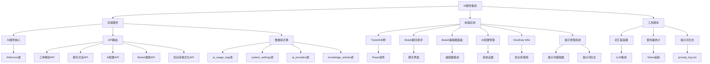

**图表来源**
- [server/service/ai_service.js](file://server/service/ai_service.js#L1-L672)
- [server/index.js](file://server/index.js#L61-L287)
- [client/src/components/Admin/AdminSettings.tsx](file://client/src/components/Admin/AdminSettings.tsx#L1610-L1867)

**章节来源**
- [server/service/ai_service.js](file://server/service/ai_service.js#L1-L672)
- [server/index.js](file://server/index.js#L1-L4566)

## 核心组件

### AIService 类

AIService 是 AI 服务的核心组件，提供了统一的 AI 接口管理和任务调度功能。该类具有以下关键特性：

- **多提供商支持**：支持 DeepSeek、OpenAI、Google Gemini 等多种 AI 提供商
- **配置灵活**：通过环境变量和系统设置配置 API 密钥、基础 URL 和模型参数
- **温度控制**：支持 AI 生成过程中的温度参数调节
- **使用量追踪**：自动记录 Token 使用情况到数据库
- **错误处理**：完善的异常处理和日志记录机制
- **多模型支持**：支持聊天模型、推理模型和视觉模型的切换
- **知识库集成**：支持知识库搜索和内容检索
- **工单搜索**：支持历史工单的智能检索和分析
- **提示词管理**：支持自定义系统提示词和场景化提示词
- **上下文增强**：支持知识库文章和历史工单的上下文增强

**更新** AIService 类现在支持动态提供商切换和温度控制，通过 `system_settings` 表管理全局配置。新增了完整的工单解析和聊天助手功能，以及知识库搜索和工单搜索能力。**新增** 提示词管理系统集成，支持 ai_system_prompt 和 ai_prompts 的动态加载和使用。

### 动态提示系统

**新增** 动态提示系统是本次更新的核心功能，提供了完整的提示词管理和版本追踪能力：

- **系统提示词管理**：支持通过数据库存储的 ai_system_prompt 字段管理全局提示词
- **场景化提示词配置**：支持 ai_prompts 字段存储不同场景的提示词配置
- **变量替换支持**：支持 {{context}}、{{dataSources}}、{{path}}、{{title}} 等变量替换
- **实时配置更新**：通过 AdminSettings 界面实现实时配置更新
- **版本追踪功能**：通过 log_prompt.js 脚本记录提示词变更历史

### AI 配置管理界面

**新增** 完整的 AI 服务配置管理界面，支持多提供商配置、温度控制、模型选择等功能。

**新增** 提示词编辑器界面，支持自定义系统提示词的编辑和管理，提供变量占位符提示和默认模板。

### Bokeh 聊天助手

**新增** Bokeh 是 Longhorn 项目中的 AI 智能助手，提供上下文感知的聊天对话功能，支持严格的工作模式和搜索功能。Bokeh 助手现在支持两种模式：

- **助手模式**：提供通用的问答和建议功能
- **编辑器模式**：在 Wiki 编辑器中提供内容优化和格式化功能

**新增** Bokeh 聊天助手现在集成了完整的提示词管理系统，支持自定义回答策略和数据引用规则。

### Bokeh 编辑器面板

**新增** Bokeh 编辑器面板是专为 Wiki 编辑器设计的 AI 辅助工具，支持：

- 正文内容的 AI 优化和格式化
- 图片大小调整和段落优化
- 格式检查和修复
- 变更预览和确认
- 与编辑器的实时同步

**章节来源**
- [server/service/ai_service.js](file://server/service/ai_service.js#L4-L672)
- [client/src/components/Admin/AdminSettings.tsx](file://client/src/components/Admin/AdminSettings.tsx#L1610-L1867)
- [server/service/routes/settings.js](file://server/service/routes/settings.js#L20-L182)
- [server/scripts/log_prompt.js](file://server/scripts/log_prompt.js#L1-L110)

## 架构概览

AI 服务集成采用了分层架构设计，确保了系统的可扩展性和可维护性：

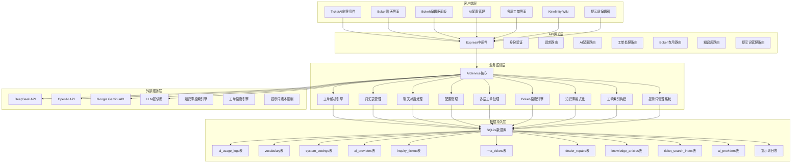

**图表来源**
- [server/index.js](file://server/index.js#L61-L287)
- [server/service/ai_service.js](file://server/service/ai_service.js#L1-L672)
- [server/package.json](file://server/package.json#L15-L31)

## 详细组件分析

### AIService 类详细分析

AIService 类实现了完整的 AI 服务管理功能，包括模型选择、请求处理和使用量追踪等核心功能。

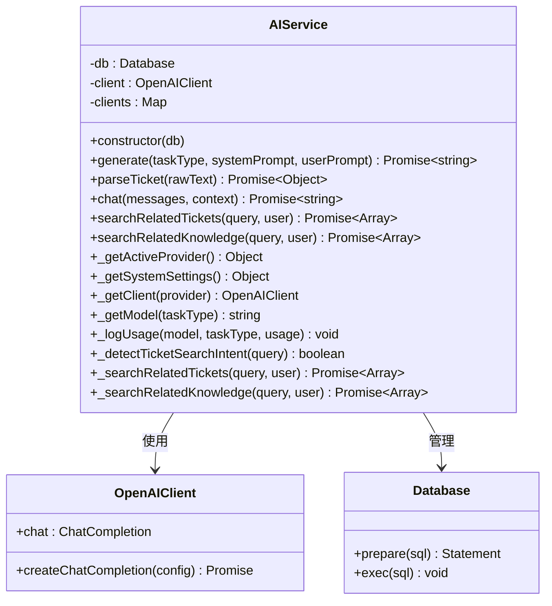

**图表来源**
- [server/service/ai_service.js](file://server/service/ai_service.js#L4-L672)

#### 核心方法分析

**generate 方法**：通用的 AI 生成接口，支持不同任务类型的智能处理，支持温度控制和多提供商切换。

**parseTicket 方法**：专门用于工单解析的智能提取功能，能够从原始文本中提取结构化的工单信息，使用 JSON 响应格式。

**chat 方法**：Bokeh 助手的聊天功能，支持上下文感知和工作模式控制，现在集成了知识库搜索和工单搜索功能。

**searchRelatedTickets 方法**：基于用户查询的历史工单搜索功能，支持权限过滤和智能排序。

**searchRelatedKnowledge 方法**：知识库文章的智能检索功能，支持全文搜索和权限控制。

**章节来源**
- [server/service/ai_service.js](file://server/service/ai_service.js#L114-L667)

### 动态提示系统管理

**新增** 动态提示系统管理是本次更新的核心功能，提供了完整的提示词管理和版本追踪能力：

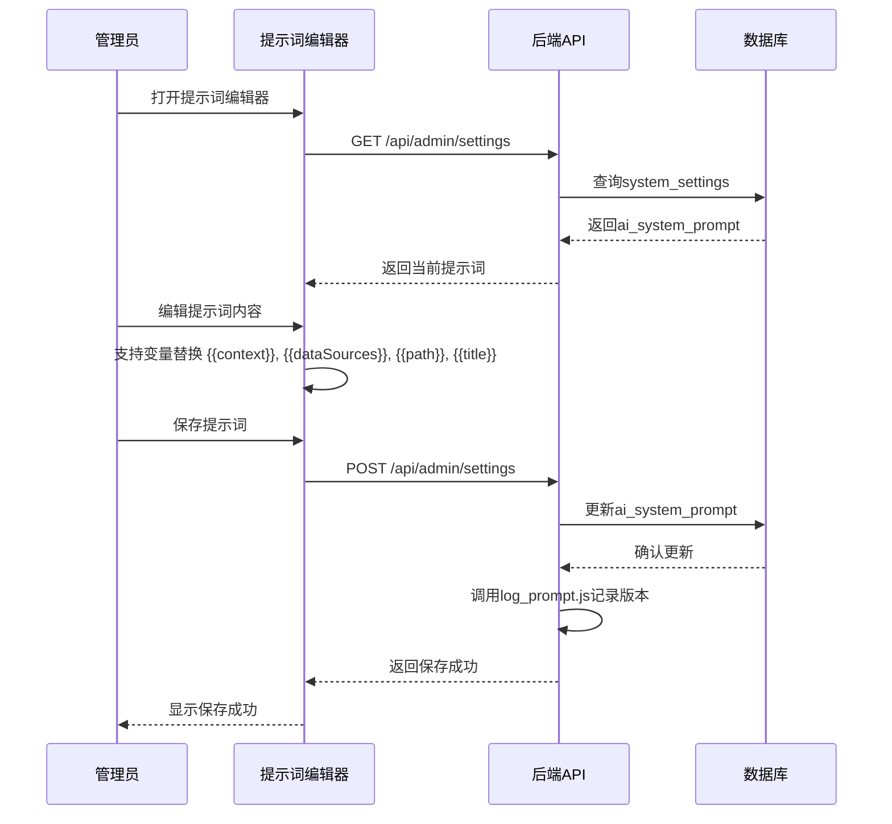

**图表来源**
- [client/src/components/Admin/AdminSettings.tsx](file://client/src/components/Admin/AdminSettings.tsx#L1610-L1867)
- [server/service/routes/settings.js](file://server/service/routes/settings.js#L20-L182)
- [server/scripts/log_prompt.js](file://server/scripts/log_prompt.js#L1-L110)

**章节来源**
- [client/src/components/Admin/AdminSettings.tsx](file://client/src/components/Admin/AdminSettings.tsx#L1610-L1867)
- [server/service/routes/settings.js](file://server/service/routes/settings.js#L20-L182)
- [server/scripts/log_prompt.js](file://server/scripts/log_prompt.js#L1-L110)

### Bokeh 搜索流程

**新增** Bokeh AI 搜索功能展示了从用户查询到智能回答的完整流程：

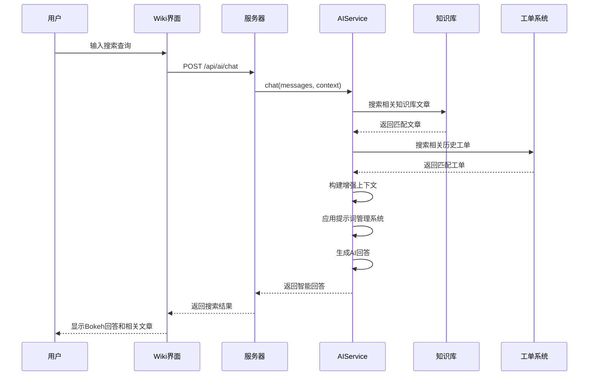

**图表来源**
- [server/service/ai_service.js](file://server/service/ai_service.js#L231-L360)

**章节来源**
- [server/service/ai_service.js](file://server/service/ai_service.js#L231-L360)

### 知识库格式化流程

**新增** Bokeh 知识库格式化功能展示了从原始内容到优化文章的完整流程：

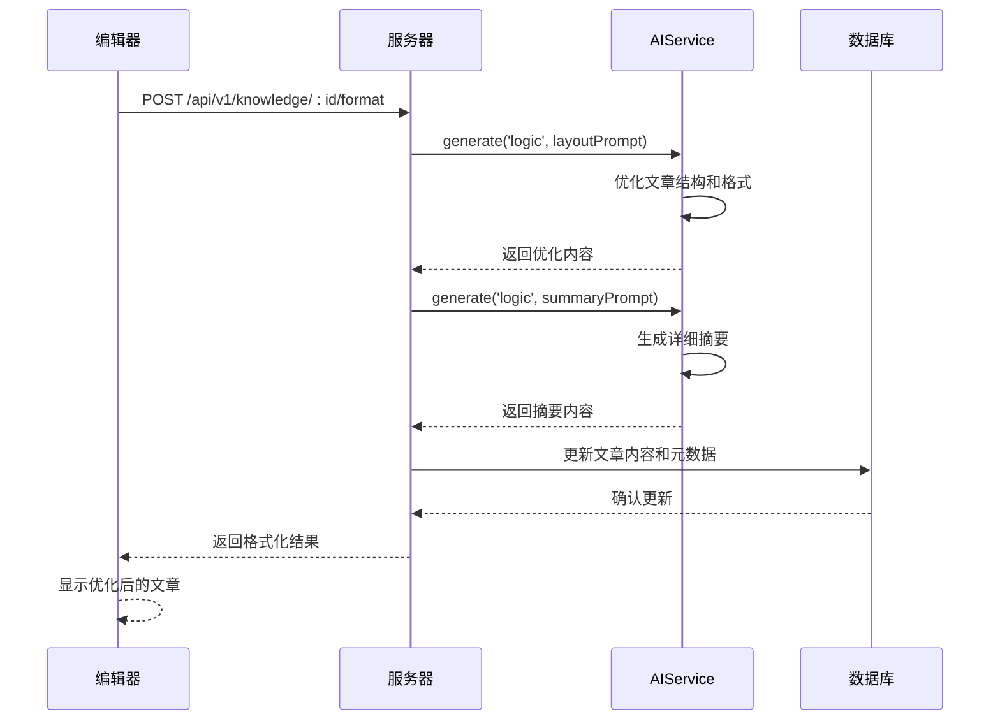

**图表来源**
- [server/service/routes/knowledge.js](file://server/service/routes/knowledge.js#L2350-L2487)
- [server/service/ai_service.js](file://server/service/ai_service.js#L114-L146)

**章节来源**
- [server/service/routes/knowledge.js](file://server/service/routes/knowledge.js#L2350-L2487)
- [server/service/ai_service.js](file://server/service/ai_service.js#L114-L146)

### Bokeh 编辑器集成流程

**新增** Bokeh 编辑器面板展示了 AI 内容优化的完整流程：

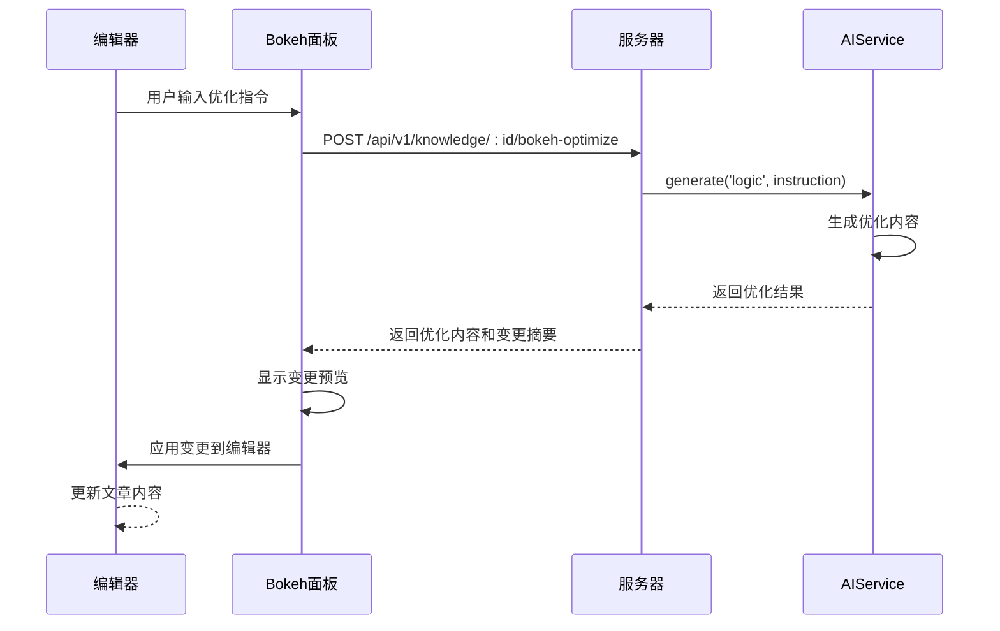

**图表来源**
- [client/src/components/Bokeh/BokehEditorPanel.tsx](file://client/src/components/Bokeh/BokehEditorPanel.tsx#L60-L182)
- [server/service/ai_service.js](file://server/service/ai_service.js#L114-L146)

**章节来源**
- [client/src/components/Bokeh/BokehEditorPanel.tsx](file://client/src/components/Bokeh/BokehEditorPanel.tsx#L60-L182)
- [server/service/ai_service.js](file://server/service/ai_service.js#L114-L146)

### AI 配置管理流程

**新增** AI 配置管理流程展示了系统设置的完整管理过程：

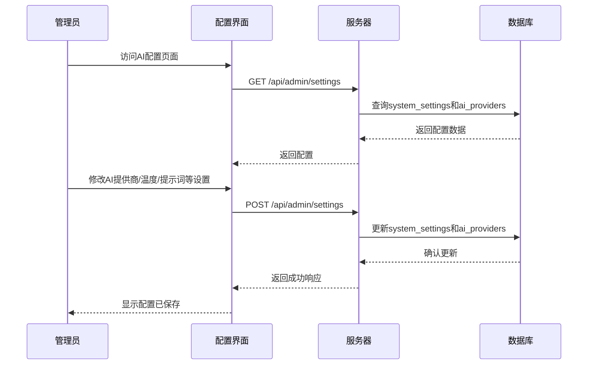

**图表来源**
- [server/service/routes/settings.js](file://server/service/routes/settings.js#L20-L182)
- [client/src/components/Admin/AdminSettings.tsx](file://client/src/components/Admin/AdminSettings.tsx#L1610-L1620)

**章节来源**
- [server/service/routes/settings.js](file://server/service/routes/settings.js#L20-L182)
- [client/src/components/Admin/AdminSettings.tsx](file://client/src/components/Admin/AdminSettings.tsx#L1610-L1620)

### 多层工单系统

**新增** 系统实现了完整的多层工单处理流程，支持咨询工单、RMA 工单和经销商维修工单的完整生命周期管理：

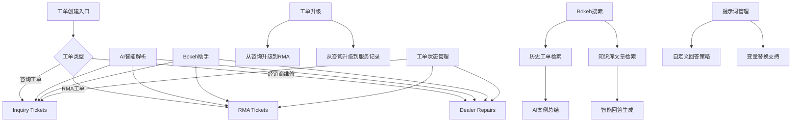

**图表来源**
- [server/service/migrations/009_three_layer_tickets.sql](file://server/service/migrations/009_three_layer_tickets.sql#L1-L198)
- [server/service/migrations/010_pr_adjustments.sql](file://server/service/migrations/010_pr_adjustments.sql#L1-L21)
- [server/service/routes/bokeh.js](file://server/service/routes/bokeh.js#L14-L145)

**章节来源**
- [server/service/migrations/009_three_layer_tickets.sql](file://server/service/migrations/009_three_layer_tickets.sql#L1-L198)
- [server/service/migrations/010_pr_adjustments.sql](file://server/service/migrations/010_pr_adjustments.sql#L1-L21)
- [server/service/routes/bokeh.js](file://server/service/routes/bokeh.js#L14-L145)

### 数据模型设计

AI 服务使用了专门的数据模型来追踪使用情况和管理词汇表：

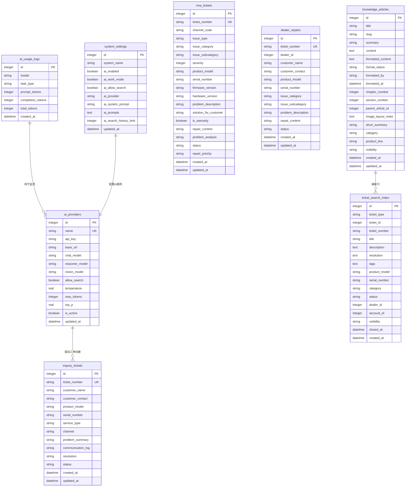

**图表来源**
- [server/scripts/migrate_ai.js](file://server/scripts/migrate_ai.js#L8-L18)
- [server/index.js](file://server/index.js#L61-L287)
- [server/migrations/add_wiki_formatting.sql](file://server/migrations/add_wiki_formatting.sql#L1-L50)

**章节来源**
- [server/scripts/migrate_ai.js](file://server/scripts/migrate_ai.js#L1-L20)
- [server/index.js](file://server/index.js#L61-L287)
- [server/migrations/add_wiki_formatting.sql](file://server/migrations/add_wiki_formatting.sql#L1-L50)

## 依赖关系分析

AI 服务集成涉及多个层面的依赖关系，形成了完整的生态系统：

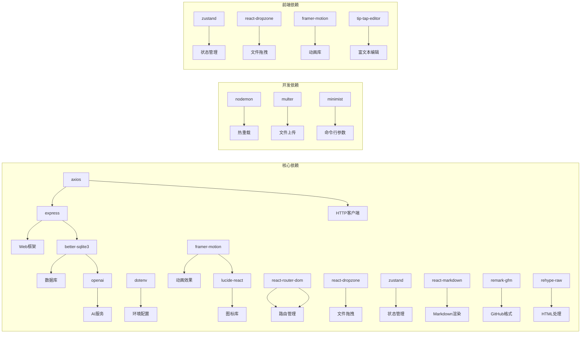

**图表来源**
- [server/package.json](file://server/package.json#L15-L31)

**章节来源**
- [server/package.json](file://server/package.json#L1-L32)

## 性能考虑

AI 服务集成在性能方面采用了多项优化策略：

### Token 使用优化
- 自动记录和追踪所有 AI 请求的 Token 使用情况
- 提供详细的使用量统计和成本控制
- 支持多模型的 Token 成本对比

### 异步处理
- 所有 AI 请求都采用异步处理模式
- 使用 Promise 和 async/await 确保非阻塞操作
- 错误处理不影响主流程执行

### 缓存策略
- 词汇表数据采用随机查询优化
- 文件上传使用流式处理减少内存占用
- 图片预览采用 CDN 缓存策略
- **新增** AI 客户端缓存，支持动态提供商切换
- **新增** 知识库搜索结果缓存，提升检索性能
- **新增** 提示词内容缓存，减少重复加载

### 温度控制优化
- 支持动态温度调节，平衡创造性与准确性
- 不同任务类型使用不同的温度参数
- 通过系统设置统一管理温度配置

**新增** 动态提示系统优化
- 实时配置更新，无需重启服务
- 配置验证和回滚机制
- 多用户并发配置管理
- **新增** 提示词版本追踪和历史记录
- **新增** 变量替换的性能优化

**新增** AI 配置管理优化
- 实时配置更新，无需重启服务
- 配置验证和回滚机制
- 多提供商配置管理功能

**新增** 多层工单系统优化
- 支持工单状态的高效查询和索引
- 工单升级流程的事务性保证
- 多表关联查询的性能优化
- **新增** 工单搜索索引的优化和批量构建

**新增** Bokeh 搜索功能优化
- 知识库文章的 FTS5 全文搜索优化
- 历史工单的权限过滤和快速检索
- AI 回答生成的上下文增强
- 搜索结果的相关性排序

**新增** 知识库格式化优化
- AI 内容优化的增量处理
- 图片布局元数据的智能分析
- 章节结构的自动识别和组织
- 内容摘要的快速生成

**新增** AI 使用统计和监控优化
- 实时系统健康监控（CPU、内存、磁盘）
- 历史使用量趋势分析
- 成本估算和预算控制
- 配置变更的实时生效
- **新增** 提示词使用统计和版本追踪

**新增** Bokeh 编辑器集成优化
- 编辑器上下文的智能识别
- AI 优化指令的精确匹配
- 变更预览的实时展示
- 编辑器同步的即时反馈

**新增** 提示词管理系统优化
- 提示词编辑器的响应式设计
- 变量替换的实时预览
- 提示词保存和加载的性能优化
- 提示词版本追踪的高效实现

## 故障排除指南

### 常见问题诊断

**AI 服务未配置**
- 检查环境变量是否正确设置（AI_API_KEY、AI_PROVIDER 等）
- 验证 API 密钥的有效性
- 确认网络连接正常
- 检查系统设置表中的配置
- **新增** 验证 ai_providers 表中的提供商配置
- **新增** 检查 ai_system_prompt 和 ai_prompts 字段

**工单解析失败**
- 检查输入文本格式
- 验证 AI 模型可用性
- 查看详细的错误日志
- 确认 JSON 响应格式正确
- **新增** 验证提示词格式和变量替换
- **新增** 检查 JSON 响应的格式化设置

**聊天功能异常**
- 检查消息数组格式
- 验证上下文参数
- 确认工作模式设置
- 查看 AI 提供商响应
- **新增** 验证提示词管理系统
- **新增** 检查知识库搜索和工单搜索功能

**词汇生成异常**
- 确认 LLM API 密钥配置
- 检查词汇表数据库连接
- 验证生成脚本权限
- 确认多提供商配置

**AI 配置管理问题**
- 检查管理员权限
- 验证配置参数格式
- 确认数据库连接正常
- 查看配置更新日志
- **新增** 验证提示词编辑器功能
- **新增** 检查提示词版本追踪功能

**多层工单系统问题**
- 检查工单表结构完整性
- 验证工单序列号生成
- 确认工单状态转换规则
- 查看工单升级流程的日志
- **新增** 验证工单搜索索引的完整性

**Bokeh 搜索功能问题**
- 检查知识库文章的 FTS5 索引
- 验证工单搜索索引的构建
- 确认权限过滤逻辑
- 查看 AI 搜索的上下文构建
- **新增** 验证提示词增强功能

**知识库格式化问题**
- 检查 AI 内容优化的可用性
- 验证数据库字段更新
- 确认格式化内容的存储
- 查看格式化过程的日志

**AI 使用统计问题**
- 检查 ai_usage_logs 表的完整性
- 验证统计数据的准确性
- 确认统计查询的性能
- 查看历史数据的备份情况

**Bokeh 编辑器集成问题**
- 检查编辑器上下文设置
- 验证 AI 优化指令的识别
- 确认变更预览功能
- 查看编辑器同步机制

**提示词管理系统问题**
- 检查提示词编辑器的可用性
- 验证变量替换功能
- 确认提示词保存和加载
- 查看提示词版本追踪日志

**Bokeh 编辑器面板问题**
- 检查编辑器上下文的识别
- 验证优化指令的匹配
- 确认变更预览的显示
- 查看编辑器同步的响应

### 调试建议

1. **启用详细日志**：检查服务器控制台输出
2. **验证 API 响应**：使用 curl 命令测试 AI 接口
3. **检查数据库状态**：确认 ai_usage_logs 和 system_settings 表正常
4. **监控 Token 使用**：定期检查使用量统计
5. **测试多提供商**：验证不同 AI 提供商的配置
6. **验证配置管理**：测试 AI 配置的实时更新功能
7. **验证工单流程**：测试从创建到升级的完整流程
8. **检查多层工单**：验证不同工单类型的处理逻辑
9. **验证使用统计**：测试 AI 使用量的实时监控功能
10. **测试 Bokeh 搜索**：验证知识库和工单的智能检索
11. **验证格式化功能**：测试文章的 AI 优化和摘要生成
12. **检查编辑器集成**：验证 Bokeh 面板与编辑器的协作
13. **测试提示词系统**：验证自定义提示词的加载和使用
14. **验证版本追踪**：测试提示词变更的历史记录功能
15. **测试编辑器面板**：验证 AI 内容优化的完整流程

**章节来源**
- [server/service/ai_service.js](file://server/service/ai_service.js#L11-L20)
- [server/index.js](file://server/index.js#L61-L287)

## 结论

Longhorn 项目的 AI 服务集成为企业级文件管理系统提供了强大的智能化能力。通过模块化的架构设计和完善的错误处理机制，系统实现了从原始文本到结构化数据的智能转换，大大提高了工单处理效率。

**更新** AI 服务现已实现重大增强，包括多提供商支持、温度控制、更好的错误处理等特性，为用户提供了更加灵活和可控的 AI 体验。AI 智能助手 Bokeh 的深度集成进一步提升了系统的智能化水平，实现了从工单创建到客户服务的全流程自动化。

**新增** 系统现已实现 Bokeh AI 搜索功能，支持基于知识库文章和历史工单的智能检索，提供上下文感知的回答。Bokeh 知识库格式化功能实现了文章的自动排版优化和摘要生成，显著提升了知识库内容的质量和可读性。Bokeh 编辑器面板为 Wiki 编辑器提供了强大的 AI 辅助功能，支持正文内容的智能优化和格式化。

**新增** 动态提示系统管理是本次更新的核心亮点，提供了完整的提示词管理和版本追踪能力。系统支持自定义系统提示词（ai_system_prompt）和场景化提示词（ai_prompts），并通过提示词编辑器提供直观的编辑界面。提示词版本追踪功能通过 log_prompt.js 脚本记录每次变更，便于审计和回滚。

AI 服务的核心优势包括：
- **多提供商支持**：支持 DeepSeek、OpenAI、Google Gemini 等多种 AI 提供商
- **温度控制**：可调节的 AI 生成温度，平衡创造性与准确性
- **灵活配置**：通过系统设置表统一管理 AI 配置
- **错误处理**：完善的异常处理和日志记录机制
- **模块化设计**：支持多种任务类型的智能处理
- **可观测性**：完整的使用量追踪和监控
- **用户体验**：直观的前端界面和智能表单
- **深度集成**：AI 智能助手与工单创建流程的无缝结合
- **配置管理**：完整的 AI 服务配置界面和管理功能
- **多层工单**：完整的工单处理流程和状态管理
- **数据完整性**：多表关联和事务性保证
- **实时监控**：系统健康状态和 AI 使用量的实时跟踪
- **智能搜索**：Bokeh 搜索功能支持知识库和工单的智能检索
- **内容优化**：知识库格式化功能实现文章的自动优化
- **编辑器集成**：Bokeh 面板与 Wiki 编辑器的深度集成
- **提示管理**：完整的提示词管理系统和版本追踪
- **响应处理**：改进的 JSON 格式化和上下文增强机制
- **编辑器优化**：Bokeh 编辑器面板提供智能内容优化
- **提示词追踪**：完整的提示词版本历史和变更记录

未来的发展方向包括：
- 扩展更多 AI 提供商和模型
- 增强自然语言处理能力
- 优化性能和成本控制
- 添加更多 AI 应用场景
- 改进温度控制算法
- 增强 AI 配置管理功能
- 扩展 Bokeh 助手的应用场景
- **新增** 支持更多工单类型的智能处理
- **新增** 增强工单升级和流转的智能化程度
- **新增** 实现更精细的 AI 使用成本分析和优化
- **新增** 扩展 Bokeh 搜索的覆盖范围和准确性
- **新增** 增强知识库格式化的智能化程度
- **新增** 改进 Bokeh 编辑器面板的交互体验
- **新增** 实现提示词的智能推荐和模板管理
- **新增** 增强提示词版本的对比和回滚功能
- **新增** 支持更多类型的编辑器内容优化
- **新增** 实现编辑器变更的实时预览和确认

通过持续的优化和扩展，AI 服务集成将成为 Longhorn 项目的重要竞争优势，为企业提供更加智能化的文件管理解决方案。