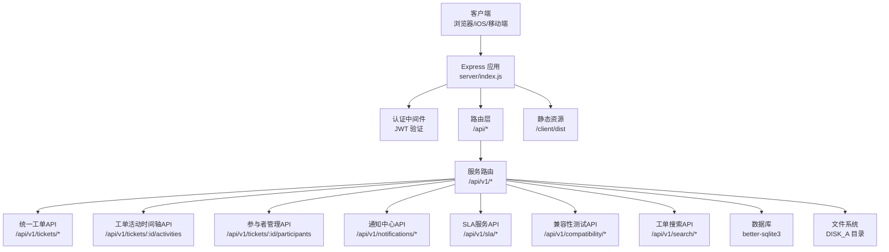
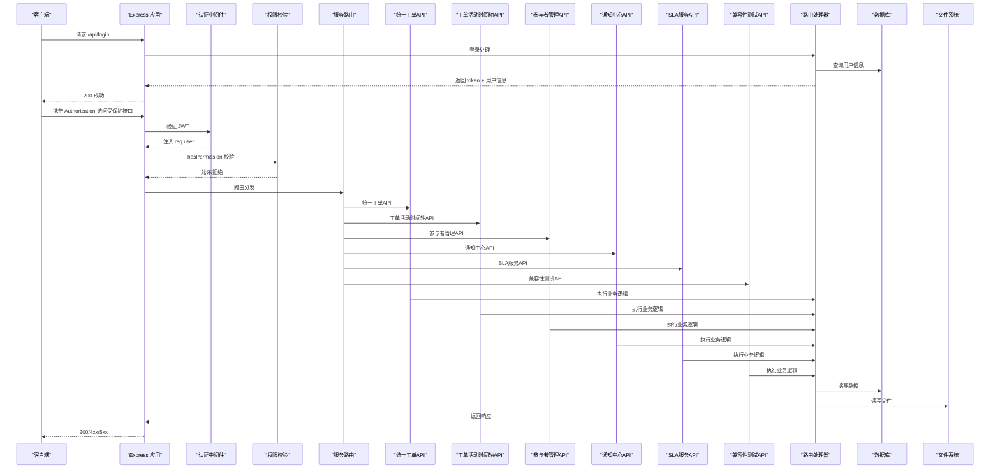
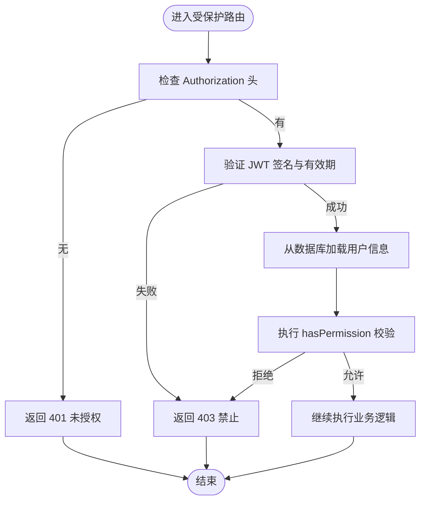
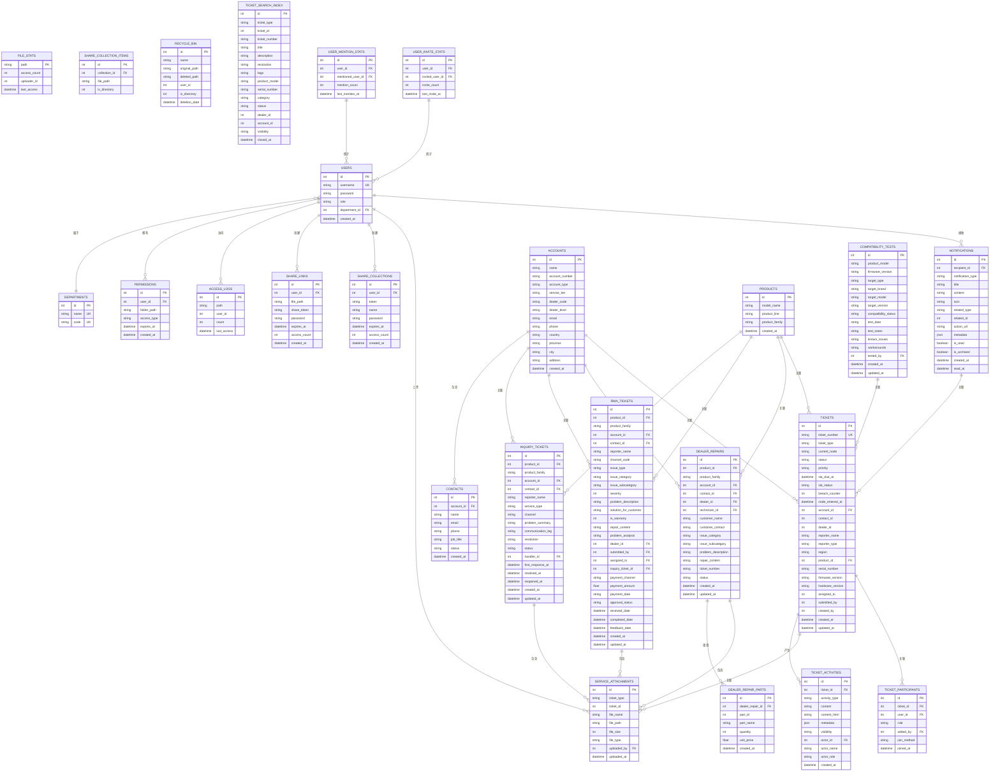

# RESTful API 设计

<cite>
**本文档引用的文件**
- [server/index.js](file://server/index.js)
- [server/package.json](file://server/package.json)
- [server/service/routes/tickets.js](file://server/service/routes/tickets.js)
- [server/service/routes/ticket-activities.js](file://server/service/routes/ticket-activities.js)
- [server/service/routes/notifications.js](file://server/service/routes/notifications.js)
- [server/service/sla_service.js](file://server/service/sla_service.js)
- [server/service/routes/compatibility.js](file://server/service/routes/compatibility.js)
- [server/service/migrations/020_p2_unified_tickets.sql](file://server/service/migrations/020_p2_unified_tickets.sql)
- [server/service/migrations/023_ticket_participants.sql](file://server/service/migrations/023_ticket_participants.sql)
- [server/service/migrations/005_knowledge_base.sql](file://server/service/migrations/005_knowledge_base.sql)
- [server/scripts/fix_ticket_data.js](file://server/scripts/fix_ticket_data.js)
- [server/scripts/fix_ticket_status.js](file://server/scripts/fix_ticket_status.js)
- [server/scripts/seed_complex_tickets.js](file://server/scripts/seed_complex_tickets.js)
- [server/scripts/index_all_tickets.js](file://server/scripts/index_all_tickets.js)
- [server/service/ai_service.js](file://server/service/ai_service.js)
- [client/src/hooks/useCachedTickets.ts](file://client/src/hooks/useCachedTickets.ts)
- [client/src/components/Notifications/NotificationCenter.tsx](file://client/src/components/Notifications/NotificationCenter.tsx)
- [client/src/store/useNotificationStore.ts](file://client/src/store/useNotificationStore.ts)
- [docs/Service_API.md](file://docs/Service_API.md)
- [docs/Service_DataModel.md](file://docs/Service_DataModel.md)
</cite>

## 更新摘要
**变更内容**
- 新增统一工单API，支持咨询工单、RMA返厂单、经销商维修单的统一管理
- 新增通知中心API，提供系统通知的完整生命周期管理
- 新增SLA服务API，实现服务等级协议的自动化计算与监控
- 新增兼容性测试API，支持固件版本兼容性验证
- 新增统一工单数据模型，支持多态工单类型和统一字段设计
- 新增工单活动时间轴API，支持工单协作追踪
- 新增参与者管理API，支持工单协作功能
- 新增用户协作统计API，支持频繁提及和邀请统计
- 新增工单搜索索引系统，支持全文检索和AI智能搜索

## 目录
1. [简介](#简介)
2. [项目结构](#项目结构)
3. [核心组件](#核心组件)
4. [架构总览](#架构总览)
5. [详细组件分析](#详细组件分析)
6. [依赖关系分析](#依赖关系分析)
7. [性能考虑](#性能考虑)
8. [故障排除指南](#故障排除指南)
9. [结论](#结论)

## 简介
本文件面向 Longhorn 项目的 RESTful API 设计，基于 Express.js 实现，覆盖认证与授权、文件操作、权限管理、分享系统、**统一工单管理**、**通知中心**、**SLA服务**、**兼容性测试**等模块。文档重点阐述：
- 基于 JWT 的认证中间件与权限校验逻辑
- 各类 API 端点的功能、参数规范与响应格式
- 错误处理策略、HTTP 状态码说明
- API 版本化思路、速率限制与安全防护建议
- **新增**：统一工单API，支持多类型工单的统一管理
- **新增**：通知中心API，提供完整的通知生命周期管理
- **新增**：SLA服务API，实现自动化服务等级协议管理
- **新增**：兼容性测试API，支持固件版本兼容性验证
- **新增**：统一工单数据模型，支持多态设计和统一字段规范
- **新增**：工单活动时间轴API，支持协作追踪和历史记录
- **新增**：参与者管理API，支持工单协作功能
- **新增**：用户协作统计API，支持频繁提及和邀请统计
- **新增**：工单搜索索引系统，支持全文检索和AI智能搜索

## 项目结构
后端采用单体服务（Express 应用），核心入口为 server/index.js，数据库使用 better-sqlite3，静态资源通过 express.static 提供。



**图表来源**
- [server/index.js](file://server/index.js#L16-L30)
- [server/package.json](file://server/package.json#L15-L28)

**章节来源**
- [server/index.js](file://server/index.js#L1-L120)
- [server/package.json](file://server/package.json#L1-L30)

## 核心组件
- 认证中间件：从 Authorization 头解析 Bearer Token，使用 JWT_SECRET 验证签发者与签名，加载用户信息并注入到 req.user。
- 权限校验：hasPermission 综合管理员、部门归属、个人空间、显式权限与过期控制进行判断。
- 路由分层：按功能划分为认证登录、文件操作、权限管理、分享系统、回收站、统计与搜索、**统一工单管理**、**通知中心**、**SLA服务**、**兼容性测试**、**工单活动时间轴**、**参与者管理**等。
- 数据访问：统一通过 better-sqlite3 执行 SQL，配合事务与参数化查询提升安全性与性能。
- 安全与防护：密码使用 bcrypt 加盐哈希；敏感路径与配置通过环境变量管理；对上传/下载/缩略图生成进行格式与范围校验。
- **新增**：统一工单API，支持咨询工单、RMA返厂单、经销商维修单的统一管理
- **新增**：通知中心API，提供通知的创建、查询、标记已读、归档、删除等完整功能
- **新增**：SLA服务API，实现服务等级协议的自动计算、状态监控和通知提醒
- **新增**：兼容性测试API，支持固件版本兼容性验证和矩阵查询
- **新增**：统一工单数据模型，支持多态设计和统一字段规范
- **新增**：工单活动时间轴API，支持协作追踪和历史记录
- **新增**：参与者管理API，支持工单协作功能
- **新增**：用户协作统计API，支持频繁提及和邀请统计
- **新增**：工单搜索索引系统，支持全文检索和AI智能搜索

**章节来源**
- [server/index.js](file://server/index.js#L267-L394)
- [server/index.js](file://server/index.js#L397-L427)
- [server/index.js](file://server/index.js#L430-L479)

## 架构总览
下图展示认证、权限与主要 API 的交互关系：



**图表来源**
- [server/index.js](file://server/index.js#L684-L713)
- [server/index.js](file://server/index.js#L267-L353)
- [server/index.js](file://server/index.js#L2269-L2440)

## 详细组件分析

### 认证与授权
- 认证中间件 authenticate
  - 从 Authorization: Bearer <token> 中提取 token
  - 使用 JWT_SECRET 验证签名与有效期
  - 重新从数据库加载用户角色与部门信息，注入 req.user
  - 未携带或无效 token 返回 401；用户不存在返回 401；签名错误返回 403
- 权限校验 hasPermission
  - 管理员拥有完全权限
  - 个人空间匹配：Members/{username}
  - 部门规则：Leader 对本部门路径可写；Member 在本部门路径下具备只读或贡献者权限
  - 显式权限：permissions 表中 folder_path 匹配或前缀匹配，且未过期
- 角色与部门映射
  - 支持中文部门名与代码互转（如"运营部"↔"OP"）
  - 路径解析 resolvePath 将前端传入路径规范化为 NFC 并转换为大写部门代码

**章节来源**
- [server/index.js](file://server/index.js#L267-L295)
- [server/index.js](file://server/index.js#L300-L353)
- [server/index.js](file://server/index.js#L233-L259)

#### 登录 API（/api/login）
- 方法与路径：POST /api/login
- 请求体
  - username: 字符串，必填
  - password: 字符串，必填
- 成功响应
  - token: 字符串，JWT
  - user: 对象，包含 id、username、role、department_name
- 失败响应
  - 401：凭据无效
- 安全要点
  - 密码使用 bcrypt.compare 进行比对
  - 登录成功后确保个人成员目录存在

**章节来源**
- [server/index.js](file://server/index.js#L684-L713)

#### 认证中间件与权限校验流程


**图表来源**
- [server/index.js](file://server/index.js#L267-L353)

### 文件操作 API（/api/files/*）
- 列出目录与文件（GET /api/files）
  - 查询参数
    - path: 字符串，目标路径（可省略，默认根目录）
    - download: 字符串，"true" 时直接触发下载
  - 权限：Read
  - 响应
    - items: 数组，包含 name、isDirectory、path、size、mtime、access_count、uploader、starred
    - userCanWrite: 布尔，当前用户是否具备写权限
  - 失败
    - 403：无读取权限
    - 404：下载时文件不存在
- 获取文件统计（GET /api/files/stats）
  - 查询参数
    - path: 字符串，必填
  - 权限：仅文件所有者或具备 Full 权限者
  - 响应
    - 数组，每项包含访问次数、最后访问时间与用户名
- 记录访问（POST /api/files/access）
  - 请求体
    - path: 字符串，必填
  - 响应
    - success: 布尔
- 创建文件夹（POST /api/folders）
  - 请求体
    - path: 字符串，父路径
    - name: 字符串，新文件夹名
  - 权限：Full 或 Contributor
  - 响应
    - success: 布尔
- 获取文件夹树（GET /api/folders/tree）
  - 权限：Read
  - 响应
    - 树形结构，仅包含用户具备 Full/Contributor 权限的节点
- 删除文件（DELETE /api/files）
  - 查询参数
    - path: 字符串，必填
  - 权限：Full
  - 响应
    - success: 布尔
- 批量删除（POST /api/files/bulk-delete）
  - 请求体
    - paths: 数组，必填
  - 权限：逐项检查 Full
  - 响应
    - deletedCount: 整数
    - failedItems: 数组，未删除项名称
- 批量下载（POST /api/download-batch）
  - 请求体
    - paths: 数组，必填
  - 权限：逐项检查 Read
  - 响应
    - 200 + ZIP 流
- 重命名（POST /api/files/rename）
  - 请求体
    - path: 字符串，必填
    - newName: 字符串，必填
  - 权限：Full；Contributor 仅能重命名自己上传的文件
  - 响应
    - success: 布尔，newPath: 新路径
- 复制（POST /api/files/copy）
  - 请求体
    - sourcePath: 字符串，必填
    - targetDir: 字符串，必填
  - 权限：源 Read，目标 Full/Contributor
  - 响应
    - success: 布尔，newPath: 新路径
- 批量移动（POST /api/files/bulk-move）
  - 请求体
    - paths: 数组，必填
    - targetDir: 字符串，必填
  - 权限：逐项检查 Full 或 Contributor（且为上传者）
  - 响应
    - movedCount: 整数
    - failedItems: 数组

**章节来源**
- [server/index.js](file://server/index.js#L2269-L2440)
- [server/index.js](file://server/index.js#L2242-L2267)
- [server/index.js](file://server/index.js#L2471-L2489)
- [server/index.js](file://server/index.js#L2492-L2550)
- [server/index.js](file://server/index.js#L2585-L2622)
- [server/index.js](file://server/index.js#L2624-L2677)
- [server/index.js](file://server/index.js#L2680-L2734)
- [server/index.js](file://server/index.js#L2737-L2795)
- [server/index.js](file://server/index.js#L2797-L2845)

### 权限管理 API（/api/permissions/*）
- 获取用户可访问的部门（GET /api/user/accessible-departments）
  - 权限：已认证
  - 响应
    - 部门数组（Admin 可见全部；Lead/Member 可见自身部门与显式授权的部门）
- 获取当前用户的特殊权限（GET /api/user/permissions）
  - 权限：已认证
  - 响应
    - 有效权限列表（过滤过期项）
- 管理员：列出/新增/删除权限
  - 列出某用户权限（GET /api/admin/users/:id/permissions）
  - 新增权限（POST /api/admin/users/:id/permissions）
    - 请求体：folder_path、access_type、expires_at
    - Lead 仅能授予本部门路径，且 access_type 不能高于 Full
  - 删除权限（DELETE /api/admin/permissions/:id）
    - Lead 仅能删除本部门用户的权限

**章节来源**
- [server/index.js](file://server/index.js#L716-L756)
- [server/index.js](file://server/index.js#L1147-L1169)
- [server/index.js](file://server/index.js#L1016-L1064)

### 分享系统 API（/api/share-collection/*）
- 创建分享集合（POST /api/share-collection）
  - 请求体
    - paths: 字符串数组，必填（或 items：兼容字段）
    - name: 字符串，可选
    - password: 字符串，可选（将被 bcrypt 哈希存储）
    - expiresIn: 数字（天），可选
  - 响应
    - success: 布尔
    - shareUrl: 字符串，公开访问地址
    - token: 字符串，用于后续管理
- 访问分享集合（GET /api/share-collection/:token）
  - 查询参数
    - password: 字符串，若集合设置了密码则必填
  - 响应
    - name: 字符串
    - items: 数组，包含 path、name、isDirectory、size
    - createdAt: 时间戳
    - accessCount: 访问次数
- 下载分享集合（GET /api/share-collection/:token/download）
  - 查询参数
    - password: 字符串，若集合设置了密码则必填
  - 响应
    - 200 + ZIP 流
- 我的分享集合（GET /api/my-share-collections）
  - 权限：已认证
  - 响应
    - 集合列表（含 item_count）
- 更新分享集合（PUT /api/share-collection/:id）
  - 请求体
    - password: 字符串，更新密码
    - removePassword: 布尔，移除密码
    - expiresInDays: 数字，设置过期天数或 -1 移除
  - 权限：仅集合创建者
- 删除分享集合（DELETE /api/share-collection/:id）
  - 权限：仅集合创建者

**章节来源**
- [server/index.js](file://server/index.js#L3131-L3165)
- [server/index.js](file://server/index.js#L3168-L3204)
- [server/index.js](file://server/index.js#L3207-L3240)
- [server/index.js](file://server/index.js#L3243-L3258)
- [server/index.js](file://server/index.js#L3273-L3314)
- [server/index.js](file://server/index.js#L3321-L3353)
- [server/index.js](file://server/index.js#L3356-L3392)
- [server/index.js](file://server/index.js#L3395-L3428)

### 公共分享 API（/api/shares/*）
- 创建分享链接（POST /api/shares）
  - 请求体
    - path: 字符串，必填
    - password: 字符串，可选
    - expiresIn: 数字（天），可选
    - language: 字符串，可选（默认 zh）
  - 响应
    - success: 布尔
    - id: 新建记录 ID
    - token: 分享令牌
    - shareUrl: 公开访问地址
- 获取我的分享（GET /api/shares）
  - 权限：已认证
  - 响应
    - 分享列表（含文件大小、上传者等）
- 更新分享（PUT /api/shares/:id）
  - 请求体
    - password: 字符串
    - removePassword: 布尔
    - expiresInDays: 数字
  - 权限：仅分享创建者
- 删除分享（DELETE /api/shares/:id）
  - 权限：仅分享创建者

**章节来源**
- [server/index.js](file://server/index.js#L1903-L1936)
- [server/index.js](file://server/index.js#L1708-L1755)
- [server/index.js](file://server/index.js#L1956-L2008)

### 公共分享页面（/s/:token 与 /share/:token）
- /s/:token
  - 支持语言切换（zh/en/de/ja），内置国际化文案
  - 若集合设置了密码，需先输入密码
  - 支持图片/视频预览与下载按钮
- /share/:token
  - 传统分享链接，支持密码验证与直接下载

**章节来源**
- [server/index.js](file://server/index.js#L2103-L2154)
- [server/index.js](file://server/index.js#L2011-L2100)

### 回收站 API（/api/recycle-bin/*）
- 列表（GET /api/recycle-bin）
  - 权限：已认证
  - 响应
    - 仅对用户具备 Read 权限的原始路径可见
- 恢复（POST /api/recycle-bin/restore/:id）
  - 权限：Admin 或原删除者
- 彻底删除（DELETE /api/recycle-bin/:id）
  - 权限：Admin 或原删除者
- 清空回收站（DELETE /api/recycle-bin-clear）
  - 权限：Admin 或仅清理自己的条目
- 回收站缩略图（GET /api/recycle-bin/thumbnail）
  - 查询参数
    - path: 字符串，必填
    - size: 数字，可选
  - 响应
    - 200 + WebP 图像流

**章节来源**
- [server/index.js](file://server/index.js#L2876-L2898)
- [server/index.js](file://server/index.js#L2900-L2937)
- [server/index.js](file://server/index.js#L2939-L2957)
- [server/index.js](file://server/index.js#L2960-L3049)

### 统计与搜索 API
- 词汇表（GET /api/vocabulary/random, GET /api/vocabulary/batch, GET /api/vocabulary/levels）
  - 支持按语言与级别筛选
- 搜索（GET /api/search）
  - 查询参数
    - q: 关键词，必填
    - type: 类型过滤（image/video/document）
    - dept: 部门代码过滤
  - 权限：根据用户角色与显式权限限定搜索范围
- 最近文件（GET /api/files/recent）
  - 响应
    - items: 最近访问的文件列表
- 用户统计（GET /api/user/stats）
  - 响应
    - 上传数量、存储用量、收藏数量、分享数量、最近登录等
- 系统统计（GET /api/admin/stats）
  - 权限：Admin
  - 响应
    - 今日/本周/本月上传统计、存储使用率、Top 上传者、总文件数

**章节来源**
- [server/index.js](file://server/index.js#L431-L475)
- [server/index.js](file://server/index.js#L1364-L1420)
- [server/index.js](file://server/index.js#L1424-L1521)
- [server/index.js](file://server/index.js#L1329-L1360)
- [server/index.js](file://server/index.js#L1632-L1698)
- [server/index.js](file://server/index.js#L1172-L1269)

### 统一工单 API（/api/v1/tickets/*）

#### 统一工单数据模型
**新增功能**：统一工单API采用单表多态设计，支持三种工单类型：
- **咨询工单（inquiry）**：客户服务咨询、技术支持请求
- **RMA返厂单（rma）**：产品维修、质量保证服务
- **经销商维修单（svc）**：经销商售后服务、设备维护

统一字段设计：
- **基础字段**：ticket_number、ticket_type、current_node、status、priority
- **SLA字段**：sla_due_at、sla_status、breach_counter、node_entered_at
- **账户字段**：account_id、contact_id、dealer_id、reporter_name、reporter_type
- **产品字段**：product_id、serial_number、firmware_version、hardware_version
- **时间字段**：created_at、updated_at、first_response_at、feedback_date
- **协作字段**：assigned_to、submitted_by、participants、snooze_until

#### 工单优先级与SLA矩阵
**新增功能**：统一的SLA管理机制，支持P0/P1/P2三个优先级：

| 优先级 | 首次响应(h) | 解决方案(h) | 报价(h) | 完结(h) |
|--------|-------------|-------------|---------|---------|
| P0     | 2           | 4           | 24      | 36      |
| P1     | 8           | 24          | 48      | 72      |
| P2     | 24          | 48          | 120     | 168     |

#### 工单状态机
**新增功能**：统一的状态流转管理：

**咨询工单状态机**：
- draft → in_progress → waiting_customer → resolved/auto_closed/converted

**RMA工单状态机**：
- submitted → ms_review → op_receiving → op_diagnosing → op_repairing → op_qa → ms_closing → closed

**经销商维修工单状态机**：
- ge_review → dl_receiving → dl_repairing → dl_qa → ge_closing → closed

#### 统一工单API端点

##### 工单列表查询（GET /api/v1/tickets）
- 查询参数
  - ticket_type: 字符串，工单类型过滤（inquiry/rma/svc）
  - priority: 字符串，优先级过滤（P0/P1/P2）
  - status: 字符串，状态过滤
  - account_id: 数字，账户ID过滤
  - dealer_id: 数字，经销商ID过滤
  - assigned_to: 数字，处理人ID过滤
  - created_from/created_to: 日期范围过滤
  - page/page_size: 分页参数
  - sort_by/sort_order: 排序参数
- 权限：已认证
- 响应
  - data: 工单数组，包含统一字段格式
  - pagination: 分页信息

##### 工单详情查询（GET /api/v1/tickets/:id）
- 权限：已认证
- 响应
  - 工单详情，包含完整字段信息
  - account: 账户上下文信息
  - product: 产品上下文信息
  - activities: 工单活动时间轴
  - participants: 参与者列表

##### 工单创建（POST /api/v1/tickets）
- 请求体
  - ticket_type: 必填，工单类型
  - priority: 可选，默认P2
  - account_id/contact_id/dealer_id: 账户相关信息
  - product_id/serial_number: 产品信息
  - reporter_name/reporter_type: 报告人信息
  - 其他类型特定字段
- 权限：已认证
- 响应
  - 新创建的工单ID和工单号

##### 工单更新（PATCH /api/v1/tickets/:id）
- 权限：已认证
- 响应
  - 更新后的工单信息

##### 工单状态变更（PATCH /api/v1/tickets/:id/status）
- 请求体
  - new_node: 新状态节点
  - comment: 状态变更备注
- 权限：已认证
- 响应
  - 状态变更后的工单信息

##### 工单转换（POST /api/v1/tickets/:id/convert）
- 请求体
  - target_type: 目标工单类型
  - metadata: 转换元数据
- 权限：已认证
- 响应
  - 转换后的工单信息

##### 工单统计（GET /api/v1/tickets/stats/summary）
- 查询参数
  - ticket_type: 工单类型过滤
  - created_from/created_to: 时间范围
- 权限：已认证
- 响应
  - 按状态、优先级、SLA状态、类型的统计分布

##### 参与者管理（POST /api/v1/tickets/:id/participants, DELETE /api/v1/tickets/:id/participants/:userId）
- 权限：已认证
- 响应
  - 参与者添加/移除结果

##### 提及统计（GET /api/v1/tickets/mention-stats, GET /api/v1/tickets/invite-stats）
- 权限：已认证
- 响应
  - 频繁提及/邀请的用户统计

**章节来源**
- [server/service/routes/tickets.js](file://server/service/routes/tickets.js#L1-L200)
- [server/service/routes/tickets.js](file://server/service/routes/tickets.js#L488-L811)
- [server/service/routes/tickets.js](file://server/service/routes/tickets.js#L804-L872)
- [server/service/routes/tickets.js](file://server/service/routes/tickets.js#L935-L999)
- [server/service/routes/tickets.js](file://server/service/routes/tickets.js#L1001-L1074)
- [server/service/routes/tickets.js](file://server/service/routes/tickets.js#L1076-L1143)

### 工单活动时间轴 API（/api/v1/tickets/:id/activities）

#### 活动时间轴数据模型
**新增功能**：完整的工单活动时间轴系统，支持多种活动类型：

**活动类型**：
- **status_change**：状态变更
- **comment**：评论/备注
- **internal_note**：内部备注
- **attachment**：附件上传
- **mention**：@提及
- **participant_added**：新增参与者
- **assignment_change**：指派变更
- **priority_change**：优先级变更
- **sla_breach**：SLA超时
- **field_update**：字段更新
- **ticket_linked**：工单关联
- **system_event**：系统事件

**可见性控制**：
- **all**：所有人可见（商业视图）
- **internal**：仅内部员工可见
- **technician**：技术员视图（仅OP/RD）

#### 活动时间轴API端点

##### 获取活动列表（GET /api/v1/tickets/:ticketId/activities）
- 查询参数
  - visibility: 可见性过滤（all/internal/technician）
  - activity_type: 活动类型过滤
  - page/page_size: 分页参数
- 权限：已认证
- 响应
  - 活动数组和分页信息

##### 添加活动（POST /api/v1/tickets/:ticketId/activities）
- 请求体
  - activity_type: 活动类型，默认comment
  - content: 活动内容
  - content_html: HTML格式内容
  - visibility: 可见性，默认all
  - metadata: 元数据JSON
  - mentions: 提及用户ID数组
- 权限：已认证
- 响应
  - 活动ID和创建时间

##### 编辑活动（PATCH /api/v1/tickets/:ticketId/activities/:activityId）
- 权限：仅活动作者或管理员
- 响应
  - 更新结果

##### 删除活动（DELETE /api/v1/tickets/:ticketId/activities/:activityId）
- 权限：仅活动作者或管理员
- 响应
  - 删除结果

**章节来源**
- [server/service/routes/ticket-activities.js](file://server/service/routes/ticket-activities.js#L1-L454)

### 通知中心API（/api/v1/notifications/*）

#### 通知数据模型
**新增功能**：统一的通知系统，支持多种通知类型：

**通知类型**：
- **sla_warning**：SLA即将超时提醒
- **sla_breach**：SLA已超时提醒
- **assignment**：工单指派通知
- **status_change**：工单状态变更通知
- **new_comment**：新评论通知
- **system_announce**：系统公告通知
- **mention**：@提及通知
- **participant_added**：被加入参与者通知
- **snooze_expired**：贪睡到期通知

**通知字段**：
- recipient_id：接收者ID
- notification_type：通知类型
- title/content：标题和内容
- icon：图标类型
- related_type/related_id：关联对象类型和ID
- action_url：动作URL
- metadata：元数据JSON
- is_read/is_archived：状态标志
- created_at/read_at：时间戳

#### 通知API端点

##### 获取通知列表（GET /api/v1/notifications）
- 查询参数
  - notification_type: 通知类型过滤
  - is_read: 是否已读过滤
  - is_archived: 是否归档过滤
  - page/page_size: 分页参数
- 权限：已认证
- 响应
  - 通知数组和分页信息

##### 未读通知统计（GET /api/v1/notifications/unread-count）
- 权限：已认证
- 响应
  - total：总未读数
  - by_type：按类型分组的未读数

##### 获取单个通知（GET /api/v1/notifications/:id）
- 权限：已认证
- 响应
  - 通知详情

##### 标记为已读（PATCH /api/v1/notifications/:id/read）
- 权限：已认证
- 响应
  - 操作结果

##### 全部标记已读（PATCH /api/v1/notifications/read-all）
- 请求体
  - notification_type: 通知类型（可选）
- 权限：已认证
- 响应
  - 操作结果

##### 归档通知（PATCH /api/v1/notifications/:id/archive）
- 权限：已认证
- 响应
  - 操作结果

##### 删除通知（DELETE /api/v1/notifications/:id）
- 权限：已认证
- 响应
  - 操作结果

##### 清空通知（DELETE /api/v1/notifications/clear-all）
- 查询参数
  - permanent: 是否永久删除（true/false）
- 权限：已认证
- 响应
  - 操作结果

#### 通知创建助手函数
**新增功能**：提供多种通知创建辅助函数：

- **createSlaWarningNotification**：创建SLA超时预警通知
- **createSlaBreachNotification**：创建SLA超时通知
- **createAssignmentNotification**：创建工单指派通知
- **createStatusChangeNotification**：创建状态变更通知
- **createNewCommentNotification**：创建新评论通知
- **createSystemAnnouncement**：创建系统公告

**章节来源**
- [server/service/routes/notifications.js](file://server/service/routes/notifications.js#L1-L467)

### SLA服务API（/api/v1/sla/*）

#### SLA计算引擎
**新增功能**：完整的SLA服务实现，包括计算、监控和通知：

**SLA矩阵**：
- **P0优先级**：最高优先级，2小时内首次响应
- **P1优先级**：中等优先级，8小时首次响应
- **P2优先级**：标准优先级，24小时首次响应

**SLA状态**：
- **normal**：正常状态
- **warning**：即将超时（剩余25%时间）
- **breached**：已超时

#### SLAAPI端点

##### SLA状态检查（GET /api/v1/sla/check-status）
- 查询参数
  - ticket_id: 工单ID
- 权限：已认证
- 响应
  - 当前SLA状态和剩余时间

##### 批量SLA检查（GET /api/v1/sla/batch-check）
- 权限：管理员
- 响应
  - 批量检查结果，包含超时和预警工单列表

##### SLA矩阵查询（GET /api/v1/sla/matrix）
- 权限：已认证
- 响应
  - SLA时长矩阵

##### 格式化剩余时间（GET /api/v1/sla/format-time）
- 查询参数
  - hours: 剩余小时数
- 权限：已认证
- 响应
  - 人类可读的时间格式

#### SLA服务核心功能

**计算截止时间**：
```javascript
function calculateSlaDue(priority, currentNode, nodeEnteredAt) {
  const slaType = NODE_SLA_TYPE_MAP[currentNode];
  if (!slaType) return null;
  
  const matrix = SLA_MATRIX[priority] || SLA_MATRIX.P2;
  const hours = matrix[slaType];
  if (!hours) return null;
  
  const enteredTime = new Date(nodeEnteredAt);
  const dueTime = new Date(enteredTime.getTime() + hours * 60 * 60 * 1000);
  
  return dueTime;
}
```

**检查SLA状态**：
```javascript
function checkSlaStatus(ticket) {
  const { priority, current_node, node_entered_at, sla_due_at } = ticket;
  
  const slaType = NODE_SLA_TYPE_MAP[currentNode];
  if (!slaType || !sla_due_at) {
    return { sla_status: 'normal', remaining_hours: null, remaining_percent: null };
  }
  
  const now = new Date();
  const dueTime = new Date(sla_due_at);
  const enteredTime = new Date(node_entered_at);
  
  const totalMs = dueTime.getTime() - enteredTime.getTime();
  const remainingMs = dueTime.getTime() - now.getTime();
  const remainingHours = remainingMs / (1000 * 60 * 60);
  const remainingPercent = remainingMs / totalMs;
  
  let sla_status = 'normal';
  
  if (remainingMs <= 0) {
    sla_status = 'breached';
  } else if (remainingPercent <= WARNING_THRESHOLD) {
    sla_status = 'warning';
  }
  
  return {
    sla_status,
    remaining_hours: Math.max(0, remainingHours),
    remaining_percent: Math.max(0, remainingPercent)
  };
}
```

**章节来源**
- [server/service/sla_service.js](file://server/service/sla_service.js#L1-L267)

### 兼容性测试API（/api/v1/compatibility/*）

#### 兼容性测试数据模型
**新增功能**：兼容性测试系统，支持固件版本兼容性验证：

**测试字段**：
- product_model：产品型号
- firmware_version：固件版本
- target_type：兼容目标类型（Lens/Monitor/Recorder/Media/Accessory/Software）
- target_brand：目标品牌
- target_model：目标型号
- target_version：目标版本
- compatibility_status：兼容性状态（Compatible/PartiallyCompatible/Incompatible/Untested）
- test_date：测试日期
- test_notes：测试备注
- known_issues：已知问题（JSON数组）
- workarounds：解决方案（JSON数组）
- related_article_id：关联知识文章ID
- tested_by：测试人员ID

#### 兼容性测试API端点

##### 兼容性测试查询（GET /api/v1/compatibility）
- 查询参数
  - product_model：产品型号
  - target_type：目标类型
  - target_brand：目标品牌
  - compatibility_status：兼容性状态
  - search：搜索关键词
  - page/page_size：分页参数
- 权限：已认证
- 响应
  - 兼容性测试结果数组和分页信息

##### 兼容性矩阵查询（GET /api/v1/compatibility/matrix/:productModel）
- 权限：已认证
- 响应
  - 产品兼容性矩阵，按目标类型分组

##### 兼容性测试创建（POST /api/v1/compatibility）
- 权限：管理员
- 响应
  - 创建的测试ID

##### 兼容性测试更新（PUT /api/v1/compatibility/:id）
- 权限：管理员
- 响应
  - 更新结果

##### 兼容性测试删除（DELETE /api/v1/compatibility/:id）
- 权限：管理员
- 响应
  - 删除结果

**章节来源**
- [server/service/routes/compatibility.js](file://server/service/routes/compatibility.js#L28-L339)
- [server/service/migrations/005_knowledge_base.sql](file://server/service/migrations/005_knowledge_base.sql#L136-L174)

### 工单搜索API（/api/v1/search/*）

#### 搜索数据模型
**新增功能**：完整的工单搜索系统，支持全文检索和AI智能搜索：

**搜索索引字段**：
- ticket_number：工单号
- ticket_type：工单类型
- title：标题
- description：描述
- resolution：解决方案
- tags：标签
- product_model：产品型号
- serial_number：序列号
- category：分类
- status：状态
- dealer_id：经销商ID
- account_id：账户ID
- visibility：可见性
- closed_at：关闭时间

#### 搜索API端点

##### 工单全文搜索（GET /api/v1/search/tickets）
- 查询参数
  - q: 搜索关键词
  - ticket_type: 工单类型过滤
  - status: 状态过滤
  - dealer_id: 经销商ID过滤
  - account_id: 账户ID过滤
  - created_from/created_to: 时间范围
  - page/page_size: 分页参数
- 权限：已认证
- 响应
  - 搜索结果数组和分页信息

##### AI智能搜索（GET /api/v1/search/ai)
- 查询参数
  - q: 自然语言查询
  - ticket_type: 工单类型过滤
  - page/page_size: 分页参数
- 权限：已认证
- 响应
  - AI生成的搜索结果

**章节来源**
- [server/service/ai_service.js](file://server/service/ai_service.js#L416-L445)
- [server/scripts/index_all_tickets.js](file://server/scripts/index_all_tickets.js#L63-L100)

### 数据迁移与兼容性

#### 统一工单数据迁移
**新增功能**：完整的数据迁移脚本，将旧表数据迁移到统一工单表：

**迁移流程**：
1. **咨询工单迁移**：从 inquiry_tickets 表迁移至 tickets 表
2. **RMA工单迁移**：从 rma_tickets 表迁移至 tickets 表
3. **经销商维修迁移**：从 dealer_repairs 表迁移至 tickets 表

**状态映射**：
- **咨询工单状态映射**：InProgress → in_progress，Resolved → resolved
- **RMA工单状态映射**：Pending → submitted，Closed → closed
- **经销商维修状态映射**：InProgress → dl_repairing，Completed → closed

**优先级映射**：
- **R1 → P0**，**R2 → P1**，**R3 → P2**

**章节来源**
- [server/service/migrations/021_migrate_tickets_data.js](file://server/service/migrations/021_migrate_tickets_data.js#L1-L337)

#### 工单数据修复工具
**新增功能**：提供多种数据修复工具：

**工单数据修复**（fix_ticket_data.js）：
- 自动生成工单编号
- 生成随机用户数据
- 添加活动时间和参与者
- 生成评论和状态变更记录

**工单状态修复**（fix_ticket_status.js）：
- 修复 current_node 字段
- 根据工单类型和状态设置合适的节点
- 更新状态映射关系

**复杂工单种子数据**（seed_complex_tickets.js）：
- 生成复杂工单数据
- 支持多种工单类型和状态
- 包含产品、账户、联系人关联

**章节来源**
- [server/scripts/fix_ticket_data.js](file://server/scripts/fix_ticket_data.js#L71-L467)
- [server/scripts/fix_ticket_status.js](file://server/scripts/fix_ticket_status.js#L114-L167)
- [server/scripts/seed_complex_tickets.js](file://server/scripts/seed_complex_tickets.js#L92-L113)

### 前端集成与使用

#### 通知中心前端集成
**新增功能**：前端通知中心组件集成：

**NotificationCenter组件**：
- 展示通知列表
- 支持标记已读、全部已读
- 支持点击跳转到相关页面
- 支持通知类型图标和样式

**useNotificationStore状态管理**：
- 管理通知列表和未读计数
- 提供API调用方法
- 支持本地存储持久化

**章节来源**
- [client/src/components/Notifications/NotificationCenter.tsx](file://client/src/components/Notifications/NotificationCenter.tsx#L1-L437)
- [client/src/components/Notifications/index.ts](file://client/src/components/Notifications/index.ts#L1-L6)
- [client/src/store/useNotificationStore.ts](file://client/src/store/useNotificationStore.ts#L1-L143)

#### 工单状态管理
**新增功能**：前端工单状态管理集成：

**useTicketStore状态管理**：
- 管理不同类型工单的草稿
- 支持工单类型切换
- 提供草稿持久化

**invalidateTicketCache缓存失效**：
- 工单创建/更新/删除后自动失效相关缓存
- 确保数据一致性

**章节来源**
- [client/src/hooks/useCachedTickets.ts](file://client/src/hooks/useCachedTickets.ts#L80-L122)

### 其他辅助 API
- 健康检查（GET /api/status）
  - 响应
    - name、status、version
- 缩略图（GET /api/thumbnail）
  - 查询参数
    - path: 字符串，必填
    - size: 数字，可选（默认 200）
    - preview: 字符串，"true" 时生成更大尺寸预览
  - 响应
    - 200 + WebP 图像流
- 部门统计（GET /api/department/my-stats）
  - 响应
    - 文件数量、存储用量、成员数量、部门名称
- 部门仪表盘（GET /api/department/stats, GET /api/department/members, GET /api/department/permissions）
  - 权限：Lead/Admin
- 无障碍调试（GET /api/debug/info）
  - 权限：已认证
  - 响应
    - 当前用户、用户表、部门表、路径解析结果、权限校验结果等

**章节来源**
- [server/index.js](file://server/index.js#L477-L479)
- [server/index.js](file://server/index.js#L483-L679)
- [server/index.js](file://server/index.js#L1082-L1142)
- [server/index.js](file://server/index.js#L1778-L1840)
- [server/index.js](file://server/index.js#L1843-L1875)
- [server/index.js](file://server/index.js#L1878-L1900)
- [server/index.js](file://server/index.js#L759-L790)

## 依赖关系分析
- Express 中间件链
  - compression、cors、express.json、静态资源、全局日志、路由
- 数据库表关系（简化）
  - users ←→ departments（外键）
  - users → permissions（外键）
  - file_stats、access_logs、stars、share_links、share_collections、share_collection_items、recycle_bin
  - **新增**：tickets 表支持统一工单管理，包含三种工单类型
  - **新增**：notifications 表支持通知中心功能
  - **新增**：ticket_sequences 表支持工单编号生成
  - **新增**：ticket_activities 表支持工单活动追踪
  - **新增**：ticket_search_index 表支持工单搜索功能
  - **新增**：accounts、contacts 表支持服务等级和联系人管理
  - **新增**：service_attachments 支持工单附件管理
  - **新增**：dealer_repair_parts 支持维修配件记录
  - **新增**：compatibility_tests 支持兼容性测试功能
  - **新增**：user_mention_stats、user_invite_stats 支持协作统计
  - **新增**：ticket_participants 支持工单参与者管理



**图表来源**
- [server/index.js](file://server/index.js#L34-L78)
- [server/index.js](file://server/index.js#L104-L118)
- [server/index.js](file://server/index.js#L139-L163)
- [server/service/migrations/020_p2_unified_tickets.sql](file://server/service/migrations/020_p2_unified_tickets.sql#L1-L271)
- [server/service/migrations/023_ticket_participants.sql](file://server/service/migrations/023_ticket_participants.sql#L60-L77)
- [server/service/migrations/005_knowledge_base.sql](file://server/service/migrations/005_knowledge_base.sql#L136-L174)

**章节来源**
- [server/index.js](file://server/index.js#L34-L78)

## 性能考虑
- 数据库优化
  - 使用 WAL 模式提升并发读写性能
  - 事务批量插入 file_stats，减少多次往返
  - 参数化查询防止 SQL 注入
  - **新增**：为统一工单表建立适当的索引，提升查询性能
  - **新增**：为通知表的 recipient_id、notification_type、is_read 建立复合索引
  - **新增**：为SLA相关字段建立索引，支持快速SLA状态查询
  - **新增**：为兼容性测试表建立索引，支持快速查询
  - **新增**：优化工单编号生成的序列查询，减少锁竞争
  - **新增**：为工单活动表建立索引，支持快速活动查询
  - **新增**：为搜索索引表建立FTS5虚拟表，支持全文检索
  - **新增**：为参与者表建立索引，支持快速协作查询
- 文件系统与缓存
  - 目录遍历与统计采用异步读取，异常时跳过不可访问项
  - 缩略图生成采用队列与并发限制，避免 CPU/IO 抖动
  - 回收站缩略图独立缓存目录，避免与主缓存冲突
  - **新增**：通知中心采用轮询机制，30秒间隔获取未读通知
  - **新增**：工单数据采用缓存失效机制，确保数据一致性
  - **新增**：兼容性测试结果采用缓存策略，减少重复查询
  - **新增**：搜索结果采用缓存策略，提升搜索性能
- 压缩与缓存
  - 开启 gzip 压缩
  - 静态资源与缩略图设置合理 Cache-Control
  - **新增**：通知列表采用分页加载，限制每次请求的数据量
  - **新增**：工单列表查询采用分页和索引优化
  - **新增**：搜索API支持分页和索引优化
- ETag 与条件请求
  - 目录列表使用 ETag，结合 If-None-Match 减少重复传输
- **新增**：统一工单API的性能优化
  - 工单列表查询采用分页和索引优化
  - 支持多字段组合查询，减少不必要的数据传输
  - 通知系统采用异步处理，避免阻塞主线程
  - 兼容性测试采用缓存和批量查询，提升响应速度
  - 搜索系统采用FTS5全文检索，支持AI智能搜索

**章节来源**
- [server/index.js](file://server/index.js#L29-L31)
- [server/index.js](file://server/index.js#L824-L830)
- [server/index.js](file://server/index.js#L556-L577)
- [server/index.js](file://server/index.js#L418-L427)
- [server/index.js](file://server/index.js#L2337-L2342)

## 故障排除指南
- 认证失败
  - 401：Authorization 头缺失或格式错误
  - 403：JWT 签名无效或用户不存在
- 权限不足
  - 403：无读/写权限或非文件所有者尝试重命名
- 路由不存在
  - 404：API 路由未找到（前端回退场景）
- 文件系统异常
  - 404：下载/访问文件不存在
  - 500：缩略图生成失败、复制/移动/重命名异常
- 分享相关
  - 401：密码保护但未提供或密码错误
  - 410：分享链接过期
- 回收站
  - 403：非管理员或非本人尝试恢复/删除
  - 500：缩略图生成失败
- **新增**：统一工单API故障排除
  - 400：工单数据格式错误或必填字段缺失
  - 404：指定ID的工单不存在
  - 500：工单状态变更失败或SLA计算异常
  - 403：无权访问或修改工单
- **新增**：工单活动时间轴API故障排除
  - 400：活动类型不支持或内容为空
  - 403：无权编辑或删除他人活动
  - 500：活动创建或更新失败
- **新增**：通知中心API故障排除
  - 401：未认证用户尝试访问通知
  - 403：非通知接收者尝试访问
  - 500：通知创建或更新失败
- **新增**：SLA服务API故障排除
  - 400：无效的工单ID或状态参数
  - 500：SLA计算引擎异常
- **新增**：兼容性测试API故障排除
  - 400：无效的查询参数
  - 500：兼容性测试数据查询异常
- **新增**：工单搜索API故障排除
  - 400：无效的搜索参数
  - 500：搜索索引查询异常
- **新增**：向后兼容适配器故障排除
  - 400：旧版API参数映射失败
  - 500：数据迁移或转换异常

**章节来源**
- [server/index.js](file://server/index.js#L477-L479)
- [server/index.js](file://server/index.js#L2290-L2292)
- [server/index.js](file://server/index.js#L2687-L2689)
- [server/index.js](file://server/index.js#L2017-L2024)
- [server/index.js](file://server/index.js#L2904-L2906)
- [server/index.js](file://server/index.js#L3046-L3048)

## 结论
Longhorn 的 RESTful API 以 Express 为基础，围绕 JWT 认证与细粒度权限校验构建，覆盖文件管理、权限治理、分享系统、统计分析与**统一工单管理、通知中心、SLA服务、兼容性测试、工单活动时间轴、参与者管理、工单搜索**等核心能力。通过 better-sqlite3 实现高性能数据持久化，配合缩略图与批量下载等优化手段，满足多端协同与规模化部署需求。

**最新增强功能**：
- **统一工单API**：支持咨询工单、RMA返厂单、经销商维修单的统一管理，采用单表多态设计
- **通知中心API**：提供完整的通知生命周期管理，支持多种通知类型和状态管理
- **SLA服务API**：实现自动化服务等级协议管理，包括计算、监控和通知提醒
- **兼容性测试API**：支持固件版本兼容性验证和矩阵查询
- **统一数据模型**：支持多态工单类型和统一字段规范
- **工单活动时间轴**：支持协作追踪和历史记录
- **参与者管理**：支持工单协作功能
- **用户协作统计**：支持频繁提及和邀请统计
- **工单搜索系统**：支持全文检索和AI智能搜索
- **前端集成**：完整的前端通知中心和工单状态管理集成

**架构演进**：
- 服务数据模型已更新至 v0.9.0，支持统一工单管理和通知中心功能
- 新增兼容性测试功能，支持固件版本兼容性验证
- 完善的联系人管理系统，支持B2B场景下的多联系人管理
- SLA服务的自动化实现，提升客户服务质量和运营效率
- 工单活动时间轴和参与者管理，增强协作功能
- 用户协作统计系统，提升团队协作效率
- 工单搜索索引系统，支持全文检索和AI智能搜索
- 提升了系统的可扩展性和维护性，支持复杂的售后服务场景

这些改进使得 Longhorn 系统能够更好地支持复杂的售后服务场景，为不同等级的客户提供差异化服务体验，同时确保系统的可扩展性和维护性。