# 后端架构设计

<cite>
**本文档引用的文件**
- [server/index.js](file://server/index.js)
- [server/service/index.js](file://server/service/index.js)
- [server/service/sla_service.js](file://server/service/sla_service.js)
- [server/service/middleware/permission.js](file://server/service/middleware/permission.js)
- [server/service/routes/tickets.js](file://server/service/routes/tickets.js)
- [server/service/routes/notifications.js](file://server/service/routes/notifications.js)
- [server/service/routes/ticket-activities.js](file://server/service/routes/ticket-activities.js)
- [server/service/migrations/020_p2_unified_tickets.sql](file://server/service/migrations/020_p2_unified_tickets.sql)
- [server/service/migrations/021_migrate_tickets_data.js](file://server/service/migrations/021_migrate_tickets_data.js)
- [server/package.json](file://server/package.json)
- [server/README.md](file://server/README.md)
- [scripts/ecosystem.config.js](file://scripts/ecosystem.config.js)
- [server/migrations/phase2.sql](file://server/migrations/phase2.sql)
- [server/migrations/add_share_collections.sql](file://server/migrations/add_share_collections.sql)
- [server/data/vocab/en.json](file://server/data/vocab/en.json)
- [server/seeds/vocabulary_seed.json](file://server/seeds/vocabulary_seed.json)
- [server/service/routes/inquiry-tickets.js](file://server/service/routes/inquiry-tickets.js)
- [server/service/routes/rma-tickets.js](file://server/service/routes/rma-tickets.js)
- [server/service/routes/dealer-repairs.js](file://server/service/routes/dealer-repairs.js)
- [server/service/routes/service-records.js](file://server/service/routes/service-records.js)
- [server/service/seeds/seed_tickets.sql](file://server/service/seeds/seed_tickets.sql)
- [client/src/hooks/useCachedTickets.ts](file://client/src/hooks/useCachedTickets.ts)
- [client/src/components/InquiryTickets/InquiryTicketListPage.tsx](file://client/src/components/InquiryTickets/InquiryTicketListPage.tsx)
- [client/src/components/ServiceRecords/ServiceRecordListPage.tsx](file://client/src/components/ServiceRecords/ServiceRecordListPage.tsx)
- [client/src/store/useTicketStore.ts](file://client/src/store/useTicketStore.ts)
- [server/migrations/update_product_families.js](file://server/migrations/update_product_families.js)
- [server/migrations/fix_product_family_names.js](file://server/migrations/fix_product_family_names.js)
- [server/scripts/migrate_ticket_product_family.js](file://server/scripts/migrate_ticket_product_family.js)
- [server/check_families.js](file://server/check_families.js)
- [client/src/components/DealerRepairs/DealerRepairListPage.tsx](file://client/src/components/DealerRepairs/DealerRepairListPage.tsx)
</cite>

## 更新摘要
**所做更改**
- 服务端版本从 1.7.88 升级到 1.7.90
- 新增统一工单系统架构，实现单表多态设计
- 集成 SLA 引擎服务，提供智能工单时效管理
- 实现通知中心系统，支持多类型通知和提醒
- 部署统一工单系统、通知服务、SLA 引擎、权限中间件等新服务模块
- 更新工单系统数据模型，支持更精细的工单分类和协作管理

## 目录
1. [简介](#简介)
2. [项目结构](#项目结构)
3. [核心组件](#核心组件)
4. [架构总览](#架构总览)
5. [详细组件分析](#详细组件分析)
6. [依赖关系分析](#依赖关系分析)
7. [性能考虑](#性能考虑)
8. [故障排查指南](#故障排查指南)
9. [结论](#结论)
10. [附录](#附录)

## 简介
Longhorn 是一个基于 Node.js + Express 的网络存储与文件管理系统，采用 SQLite 作为数据存储，提供文件浏览、上传下载、分片上传、批量操作、星标收藏、搜索、分享（单文件与集合）、回收站、缩略图生成等能力。后端通过 JWT 实现认证授权，并内置权限校验逻辑以保障多部门协作场景下的数据安全。

**更新** 服务端版本现已升级至 1.7.90，本次重大架构重构引入了统一工单系统、SLA 引擎、通知中心和权限中间件等核心服务模块。统一工单系统采用单表多态设计，支持咨询工单、RMA 返厂单和经销商维修单的统一管理；SLA 引擎提供智能时效计算和预警机制；通知中心实现多类型通知推送和管理；权限中间件提供细粒度的访问控制和视图切换功能。

## 项目结构
后端位于 server 目录，主要由以下部分组成：
- 入口文件：server/index.js，负责初始化 Express 应用、数据库、中间件、路由与静态资源服务
- 服务模块：server/service/index.js，集成统一工单系统、SLA 引擎、通知中心等新服务模块
- 数据库迁移：server/migrations/* 和 server/service/migrations/*，定义核心业务表结构（如分享链接、星标文件、回收站、统一工单系统等）
- 词库数据：server/data/vocab/* 与 server/seeds/vocabulary_seed.json，用于每日单词功能
- **新增** 统一工单系统：单表多态设计，支持三种工单类型的统一管理
- **新增** SLA 引擎：智能时效计算和预警机制
- **新增** 通知中心：多类型通知推送和管理
- **新增** 权限中间件：基于角色的细粒度权限控制
- 前端集成：client/src/components 下的工单组件和 hooks，实现完整的前后端交互
- 部署配置：scripts/ecosystem.config.js，使用 PM2 进行集群化部署与进程管理
- 包管理：server/package.json，声明依赖与脚本

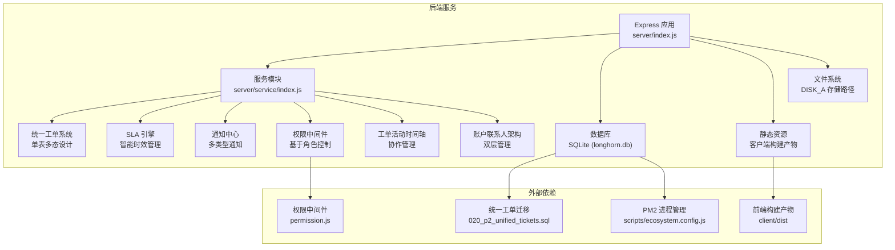

**图表来源**
- [server/index.js](file://server/index.js#L1-L50)
- [server/service/index.js](file://server/service/index.js#L1-L163)
- [server/service/migrations/020_p2_unified_tickets.sql](file://server/service/migrations/020_p2_unified_tickets.sql#L1-L271)
- [server/service/middleware/permission.js](file://server/service/middleware/permission.js#L1-L278)
- [scripts/ecosystem.config.js](file://scripts/ecosystem.config.js#L1-L41)

**章节来源**
- [server/README.md](file://server/README.md#L1-L32)
- [server/package.json](file://server/package.json#L1-L40)

## 核心组件
- 路由与控制器：集中于 server/index.js，覆盖认证、文件管理、分享、统计、回收站、批量下载等
- **新增** 服务模块入口：server/service/index.js，集成统一工单系统、SLA 引擎、通知中心等新服务
- **新增** 统一工单系统：单表多态设计，支持咨询工单、RMA 返厂单、经销商维修单的统一管理
- **新增** SLA 引擎：智能时效计算，支持 P0/P1/P2 优先级和多节点状态机
- **新增** 通知中心：多类型通知推送，支持 SLA 预警、工单指派、状态变更等通知
- **新增** 权限中间件：基于角色的细粒度权限控制，支持视图切换和部门权限管理
- **新增** 工单活动时间轴：完整的协作记录和可见性控制
- **新增** 账户联系人架构：双层管理模型，支持更精细的客户关系管理
- 数据访问层：基于 better-sqlite3 的原生 SQL 查询与事务封装
- 缓存与缩略图：基于文件系统的缩略图缓存（WebP），以及 ETag 机制
- 文件系统：通过 DISK_A 模拟分布式存储，支持中文路径规范化与权限校验
- 部署与运维：PM2 集群模式、日志与自动重启策略

**章节来源**
- [server/index.js](file://server/index.js#L1-L120)
- [server/service/index.js](file://server/service/index.js#L1-L316)
- [server/service/sla_service.js](file://server/service/sla_service.js#L1-L267)
- [server/service/middleware/permission.js](file://server/service/middleware/permission.js#L1-L278)
- [server/service/routes/tickets.js](file://server/service/routes/tickets.js#L1-L872)
- [server/service/routes/notifications.js](file://server/service/routes/notifications.js#L1-L467)
- [server/service/routes/ticket-activities.js](file://server/service/routes/ticket-activities.js#L1-L424)

## 架构总览
后端采用"单体 + 轻量 ORM"架构，结合服务模块化设计：
- Express 提供 RESTful API
- better-sqlite3 直接执行 SQL，配合事务提升性能
- 前端静态资源由 Express 提供，SPA 回退策略保证路由兼容
- PM2 集群模式提升并发与稳定性
- **新增** 服务模块化：统一工单系统、SLA 引擎、通知中心等模块化集成
- **新增** 单表多态设计：统一工单表支持三种工单类型的灵活管理
- **新增** 智能 SLA 管理：基于优先级和状态机的时效计算和预警
- **新增** 完整通知体系：多类型通知推送和生命周期管理
- **新增** 细粒度权限控制：基于角色和部门的访问控制机制

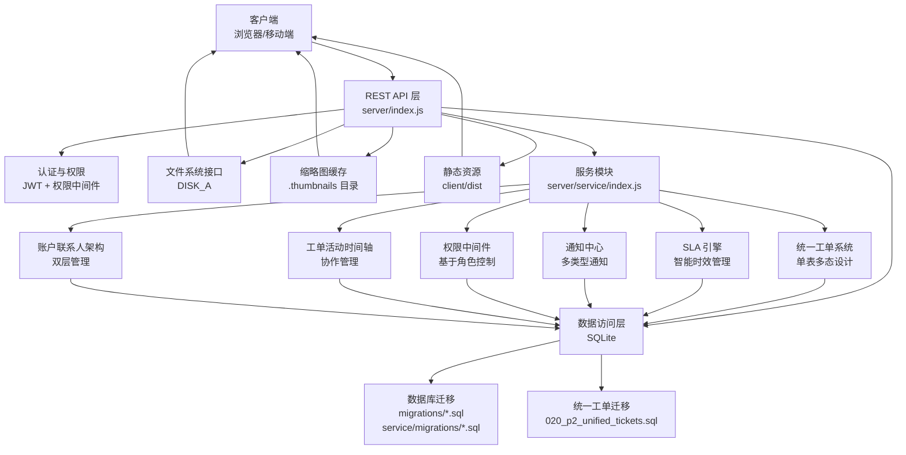

**图表来源**
- [server/index.js](file://server/index.js#L267-L394)
- [server/index.js](file://server/index.js#L481-L679)
- [server/index.js](file://server/index.js#L3120-L3125)
- [server/service/index.js](file://server/service/index.js#L1-L163)
- [server/service/migrations/020_p2_unified_tickets.sql](file://server/service/migrations/020_p2_unified_tickets.sql#L1-L271)
- [server/service/sla_service.js](file://server/service/sla_service.js#L1-L267)
- [server/service/middleware/permission.js](file://server/service/middleware/permission.js#L1-L278)

## 详细组件分析

### 认证与权限体系
- JWT 认证：登录成功后签发 token，后续请求通过 Authorization 头传递；中间件验证失败返回 403/401
- **新增** 权限中间件：基于角色的细粒度权限控制，支持 Admin、Employee、Market、Dealer 四种角色
- **新增** 视图切换：管理员可使用 X-View-As-User 头以其他用户身份查看
- **新增** 部门权限：支持 operation、marketing、rd 三个部门的差异化权限控制
- 用户信息：登录时从数据库加载用户角色与部门信息，确保权限判断实时性

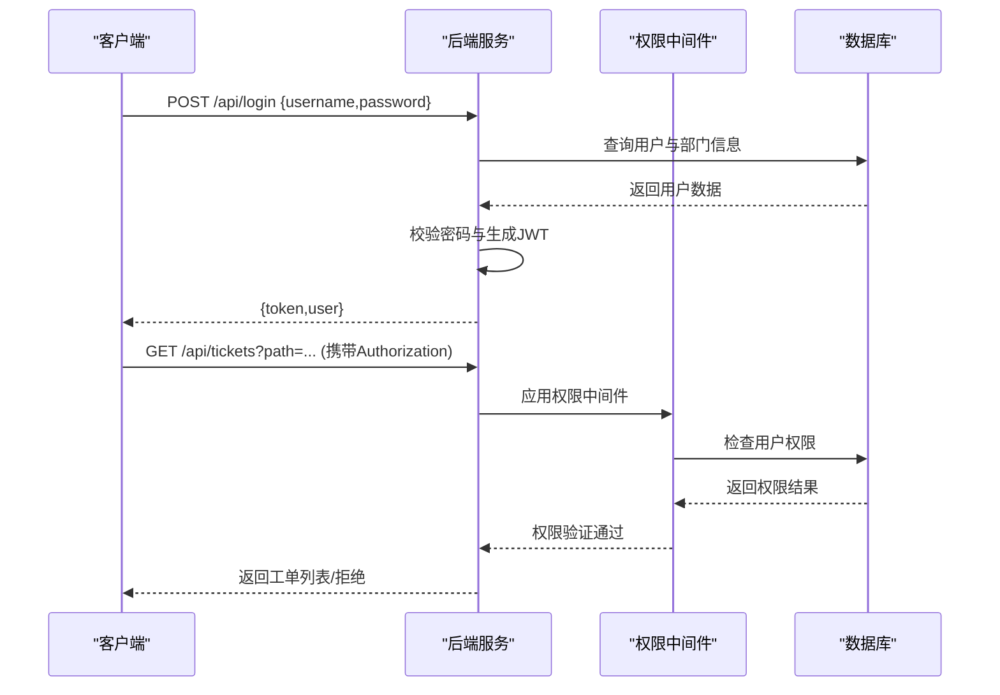

**图表来源**
- [server/index.js](file://server/index.js#L590-L622)
- [server/index.js](file://server/index.js#L627-L680)
- [server/service/middleware/permission.js](file://server/service/middleware/permission.js#L215-L220)

**章节来源**
- [server/index.js](file://server/index.js#L590-L622)
- [server/index.js](file://server/index.js#L627-L680)
- [server/service/middleware/permission.js](file://server/service/middleware/permission.js#L1-L278)

### 文件管理与批量操作
- 列表与权限：解析前端路径，规范化为部门代码或中文名称，校验读取权限
- 上传：支持普通上传与分片上传（chunk）合并；写入 file_stats 表记录元数据
- 批量下载：使用 archiver 将多个文件打包为 zip 输出
- 移动/复制/重命名：基于权限与所有权校验，更新数据库路径字段
- 删除：移至回收站，清理统计与访问日志

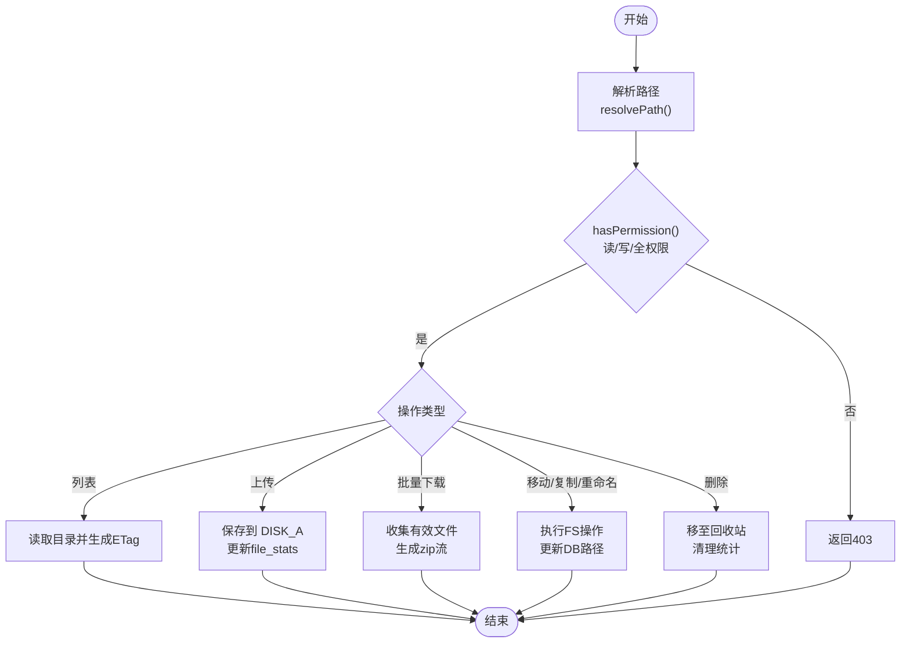

**图表来源**
- [server/index.js](file://server/index.js#L2269-L2440)
- [server/index.js](file://server/index.js#L843-L932)
- [server/index.js](file://server/index.js#L2624-L2677)
- [server/index.js](file://server/index.js#L2797-L2845)
- [server/index.js](file://server/index.js#L2585-L2622)

**章节来源**
- [server/index.js](file://server/index.js#L843-L932)
- [server/index.js](file://server/index.js#L2269-L2440)
- [server/index.js](file://server/index.js#L2624-L2677)
- [server/index.js](file://server/index.js#L2797-L2845)
- [server/index.js](file://server/index.js#L2585-L2622)

### 缩略图生成与缓存
- 支持图片与视频（含 HEIC/HEVC）缩略图生成，优先使用 sharp，必要时调用 ffmpeg 或 macOS sips
- 并发队列限制（默认最多 2 个并发），避免 CPU/IO 过载
- 缓存策略：按文件路径与尺寸生成缓存键，缓存目录为 .thumbnails，命中则直接返回
- 预览模式：针对分享页提供更高分辨率预览图

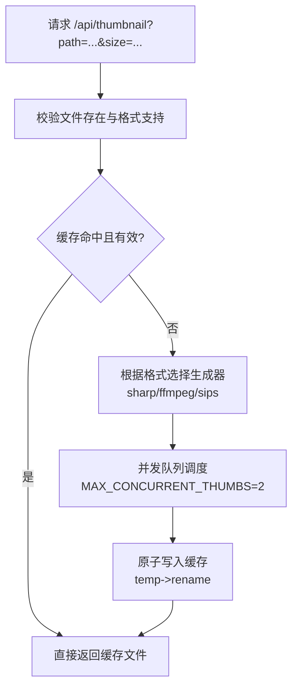

**图表来源**
- [server/index.js](file://server/index.js#L481-L679)
- [server/index.js](file://server/index.js#L2959-L3049)

**章节来源**
- [server/index.js](file://server/index.js#L481-L679)
- [server/index.js](file://server/index.js#L2959-L3049)

### 分享与集合分享
- 单文件分享：生成唯一 token，支持密码与过期时间，提供公开访问页面与下载接口
- 集合分享：批量包含多个文件/目录，支持密码与过期时间，提供集合详情与打包下载
- 权限与安全：访问时校验密码与过期，未登录访问需先输入密码

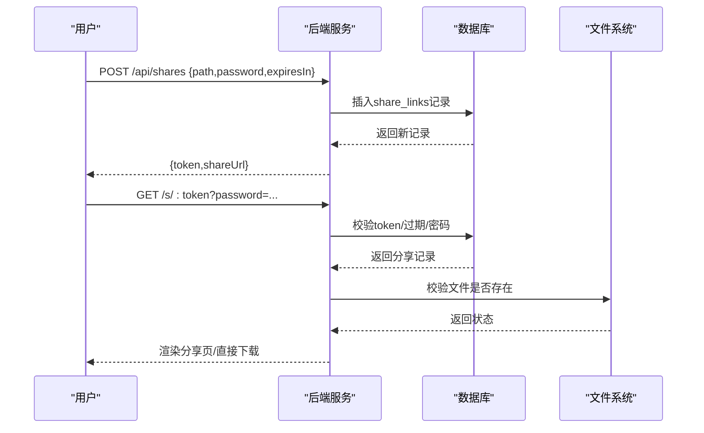

**图表来源**
- [server/index.js](file://server/index.js#L1903-L1953)
- [server/index.js](file://server/index.js#L2010-L2154)
- [server/index.js](file://server/index.js#L3130-L3204)

**章节来源**
- [server/index.js](file://server/index.js#L1903-L1953)
- [server/index.js](file://server/index.js#L2010-L2154)
- [server/index.js](file://server/index.js#L3130-L3204)

### 数据库设计与访问层
- 核心表：
  - departments、users、permissions、stars、vocabulary
  - 新增：starred_files、share_links、share_collections、share_collection_items、recycle_bin
  - **新增** 统一工单系统表：tickets、ticket_activities、notifications、ticket_sequences
  - **新增** 账户联系人架构：accounts、contacts 表
  - **新增** 服务记录表：service_records、service_record_comments、service_record_sequences
  - **新增** 产品家族管理表：products（含 product_family 字段）
- 访问层：
  - better-sqlite3 直接执行 SQL，使用事务提升批量写入性能
  - 自动种子：首次启动时检测词库为空则导入种子数据；**新增** 工单系统种子数据
  - 迁移：通过 migrations/*.sql 和 service/migrations/*.sql 管理表结构演进

```mermaid
erDiagram
USERS {
int id PK
text username UK
text password
text role
int department_id FK
text department_name
datetime created_at
}
DEPARTMENTS {
int id PK
text name UK
text code UK
}
PERMISSIONS {
int id PK
int user_id FK
text folder_path
text access_type
datetime expires_at
datetime created_at
}
STARRED_FILES {
int id PK
int user_id FK
text file_path
datetime starred_at
}
SHARE_LINKS {
int id PK
int user_id FK
text file_path
text share_token UK
text password
datetime expires_at
int access_count
datetime last_accessed
datetime created_at
}
SHARE_COLLECTIONS {
int id PK
int user_id FK
text token UK
text name
text password
datetime expires_at
int access_count
datetime last_accessed
datetime created_at
}
SHARE_COLLECTION_ITEMS {
int id PK
int collection_id FK
text file_path
boolean is_directory
datetime added_at
}
RECYCLE_BIN {
int id PK
text name
text original_path
text deleted_path
int user_id FK
boolean is_directory
datetime deletion_date
}
-- 新增统一工单系统表
TICKETS {
int id PK
text ticket_number UK
text ticket_type
text current_node
text status
text priority
text node_entered_at
text sla_due_at
text sla_status
int breach_counter
text participants
text snooze_until
int account_id
int contact_id
int dealer_id
text reporter_name
text reporter_type
text region
int product_id
text serial_number
text firmware_version
text hardware_version
text issue_type
text issue_category
text issue_subcategory
int severity
text service_type
text channel
text problem_summary
text communication_log
text problem_description
text solution_for_customer
int is_warranty
text repair_content
text problem_analysis
text resolution
int submitted_by
int assigned_to
int created_by
text payment_channel
real payment_amount
text payment_date
text feedback_date
text ship_date
text received_date
text completed_date
text first_response_at
int first_response_minutes
text waiting_customer_since
int parent_ticket_id
text external_link
text channel_code
text approval_status
int approved_by
text approved_at
text auto_close_reminder_sent
text auto_close_at
text created_at
text updated_at
}
TICKET_ACTIVITIES {
int id PK
int ticket_id FK
text activity_type
text content
text content_html
text metadata
text visibility
int actor_id
text actor_name
text actor_role
int is_edited
text edited_at
text created_at
}
NOTIFICATIONS {
int id PK
int recipient_id FK
text notification_type
text title
text content
text icon
text related_type
int related_id
text action_url
text metadata
int is_read
text read_at
int is_archived
text created_at
}
ACCOUNTS {
int id PK
text name UK
text type
text region
text address
text phone
text email
int dealer_id
int created_by
int updated_by
text created_at
text updated_at
}
CONTACTS {
int id PK
int account_id FK
text name
text position
text phone
text email
text is_primary
text created_at
text updated_at
}
-- 新增服务记录表
SERVICE_RECORDS {
int id PK
text record_number UK
text service_mode
text customer_name
text customer_contact
int customer_id
int dealer_id
int product_id
text product_name
text serial_number
text firmware_version
text hardware_version
text service_type
text channel
text problem_summary
text problem_category
text communication_log
text status
text resolution
text resolution_type
int handler_id
text department
text first_response_at
text resolved_at
text waiting_customer_since
int upgraded_to_issue_id
text upgrade_reason
int created_by
text created_at
text updated_at
}
-- 新增产品家族管理
PRODUCTS {
int id PK
text model_name
text product_family
text product_line
}
USERS }o--|| DEPARTMENTS : belongs_to
USERS ||--o{ PERMISSIONS : grants
USERS ||--o{ STARRED_FILES : starred
USERS ||--o{ SHARE_LINKS : creates
USERS ||--o{ SHARE_COLLECTIONS : creates
USERS ||--o{ TICKETS : handler/creator
USERS ||--o{ TICKET_ACTIVITIES : actor
USERS ||--o{ NOTIFICATIONS : recipient
USERS ||--o{ SERVICE_RECORDS : handler/creator
SHARE_COLLECTIONS ||--o{ SHARE_COLLECTION_ITEMS : contains
TICKETS ||--o{ TICKET_ACTIVITIES : has_activities
TICKETS ||--o{ NOTIFICATIONS : related_to
ACCOUNTS ||--o{ CONTACTS : has_contacts
ACCOUNTS ||--o{ TICKETS : associated
PRODUCTS ||--o{ TICKETS : related
```

**图表来源**
- [server/index.js](file://server/index.js#L33-L78)
- [server/migrations/phase2.sql](file://server/migrations/phase2.sql#L3-L31)
- [server/migrations/add_share_collections.sql](file://server/migrations/add_share_collections.sql#L4-L29)
- [server/service/migrations/020_p2_unified_tickets.sql](file://server/service/migrations/020_p2_unified_tickets.sql#L8-L122)
- [server/service/migrations/020_p2_unified_tickets.sql](file://server/service/migrations/020_p2_unified_tickets.sql#L145-L193)
- [server/service/migrations/020_p2_unified_tickets.sql](file://server/service/migrations/020_p2_unified_tickets.sql#L205-L247)
- [server/service/migrations/020_p2_unified_tickets.sql](file://server/service/migrations/020_p2_unified_tickets.sql#L259-L271)
- [server/service/migrations/021_migrate_tickets_data.js](file://server/service/migrations/021_migrate_tickets_data.js#L1-L337)

**章节来源**
- [server/index.js](file://server/index.js#L33-L78)
- [server/migrations/phase2.sql](file://server/migrations/phase2.sql#L1-L32)
- [server/migrations/add_share_collections.sql](file://server/migrations/add_share_collections.sql#L1-L32)
- [server/service/migrations/020_p2_unified_tickets.sql](file://server/service/migrations/020_p2_unified_tickets.sql#L1-L271)
- [server/service/migrations/021_migrate_tickets_data.js](file://server/service/migrations/021_migrate_tickets_data.js#L1-L337)

### 统一工单系统

#### 单表多态设计
**更新** 采用单表多态设计，统一管理三种工单类型：

- **统一表结构**：tickets 表支持 inquiry、rma、svc 三种工单类型
- **状态机管理**：每种工单类型都有独立的状态机节点
- **编号规则**：KYYMM-XXXX（咨询）、RMA-{C/D}-YYMM-XXXX（RMA）、SVC-D-YYMM-XXXX（维修）
- **序列管理**：独立的 ticket_sequences 表管理各类型和渠道的编号序列

#### 工单类型与状态机
- **咨询工单（inquiry）**：draft → in_progress → waiting_customer → resolved → auto_closed → converted
- **RMA 工单（rma）**：submitted → ms_review → op_receiving → op_diagnosing → op_repairing → op_qa → ms_closing → closed
- **经销商维修（svc）**：submitted → ge_review → dl_receiving → dl_repairing → dl_qa → ge_closing → closed

#### 核心功能特性
- **SLA 管理**：智能时效计算和预警机制
- **协作管理**：完整的活动时间轴和参与者管理
- **通知集成**：自动化的通知推送和提醒
- **权限控制**：基于角色和部门的访问控制

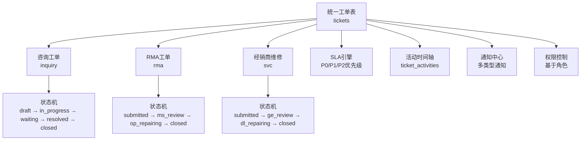

**图表来源**
- [server/service/migrations/020_p2_unified_tickets.sql](file://server/service/migrations/020_p2_unified_tickets.sql#L8-L122)
- [server/service/migrations/020_p2_unified_tickets.sql](file://server/service/migrations/020_p2_unified_tickets.sql#L125-L141)
- [server/service/routes/tickets.js](file://server/service/routes/tickets.js#L19-L66)

**章节来源**
- [server/service/migrations/020_p2_unified_tickets.sql](file://server/service/migrations/020_p2_unified_tickets.sql#L1-L271)
- [server/service/routes/tickets.js](file://server/service/routes/tickets.js#L1-L872)

### SLA 引擎服务

#### 智能时效管理
**更新** 实现智能 SLA 管理机制：

- **优先级矩阵**：P0（紧急）、P1（高）、P2（常规）三种优先级
- **节点映射**：不同节点对应不同的 SLA 类型（首次响应、方案输出、报价、完结）
- **时效计算**：基于优先级和节点的智能时效计算
- **预警机制**：剩余时间低于阈值时自动预警

#### SLA 矩阵配置
- **P0 优先级**：首次响应 2 小时，方案输出 4 小时，报价 24 小时，完结 36 小时
- **P1 优先级**：首次响应 8 小时，方案输出 24 小时，报价 48 小时，完结 3 工作日
- **P2 优先级**：首次响应 24 小时，方案输出 48 小时，报价 5 天，完结 7 工作日

#### 状态监控
- **批量检查**：定时任务批量检查所有工单的 SLA 状态
- **超时统计**：累计超时次数和超时工单统计
- **通知集成**：自动发送 SLA 预警和超时通知

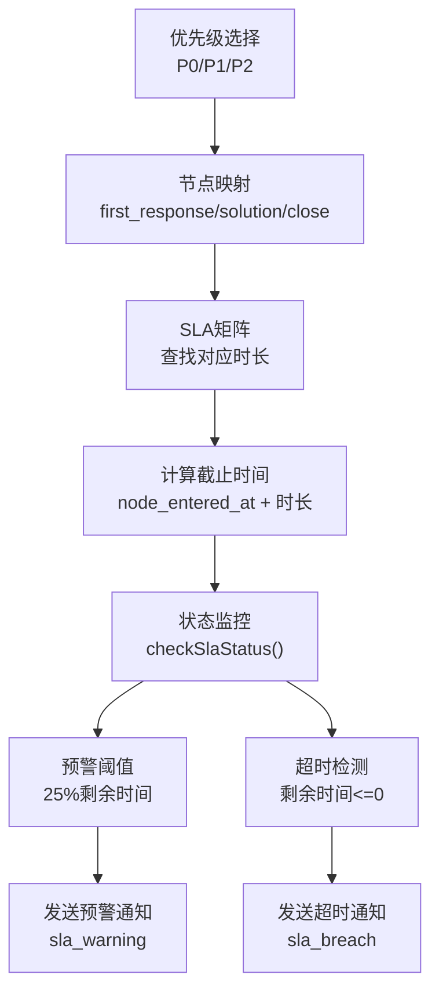

**图表来源**
- [server/service/sla_service.js](file://server/service/sla_service.js#L8-L28)
- [server/service/sla_service.js](file://server/service/sla_service.js#L71-L83)
- [server/service/sla_service.js](file://server/service/sla_service.js#L89-L122)

**章节来源**
- [server/service/sla_service.js](file://server/service/sla_service.js#L1-L267)

### 通知中心系统

#### 多类型通知管理
**更新** 实现完整的通知中心系统：

- **通知类型**：@提及、工单指派、状态变更、SLA 预警、SLA 超时、新评论、参与者添加、贪睡到期、系统公告
- **生命周期管理**：创建、标记已读、归档、删除、批量清理
- **关联管理**：与工单、系统事件的关联关系
- **元数据支持**：丰富的通知元数据和自定义信息

#### 通知创建与管理
- **创建接口**：统一的通知创建接口，支持多种通知类型
- **批量操作**：支持批量标记已读、批量归档、批量删除
- **统计查询**：未读通知统计和按类型分组统计
- **权限控制**：基于接收者的权限控制

#### 集成机制
- **自动创建**：工单状态变更、指派、评论等操作自动创建相应通知
- **SLA 集成**：SLA 预警和超时自动触发通知
- **@提及**：支持 @用户名的自动提及通知

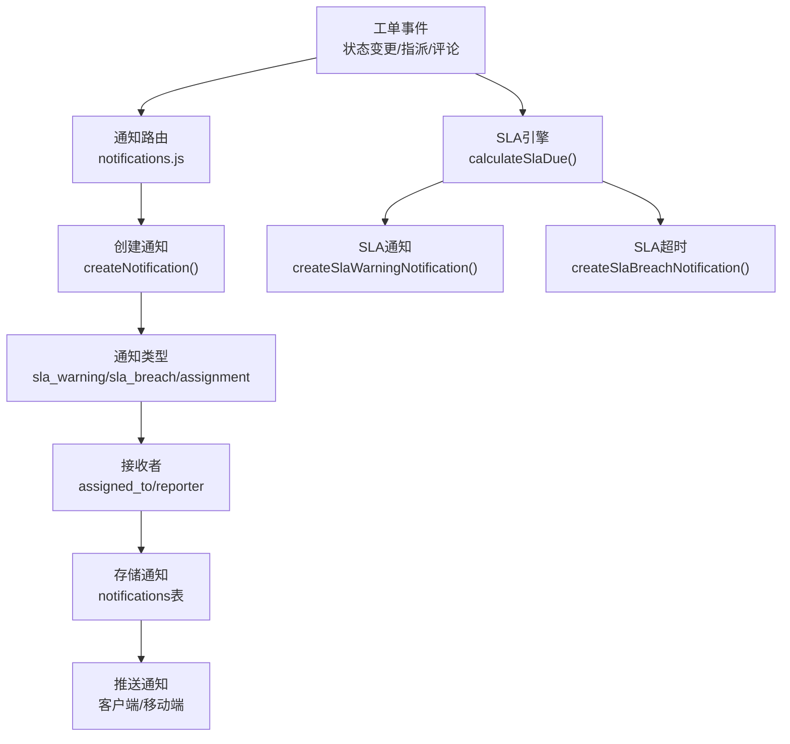

**图表来源**
- [server/service/routes/notifications.js](file://server/service/routes/notifications.js#L41-L75)
- [server/service/routes/notifications.js](file://server/service/routes/notifications.js#L366-L395)
- [server/service/sla_service.js](file://server/service/sla_service.js#L71-L83)

**章节来源**
- [server/service/routes/notifications.js](file://server/service/routes/notifications.js#L1-L467)

### 权限中间件系统

#### 基于角色的权限控制
**更新** 实现细粒度的权限控制机制：

- **角色定义**：Admin（管理员）、Employee（员工）、Market（市场）、Dealer（经销商）四种角色
- **部门权限**：operation（运营）、marketing（市场）、rd（研发）三个部门的差异化权限
- **访问控制**：支持查看、编辑、删除、指派等不同级别的权限
- **视图切换**：管理员可切换到其他用户视角进行操作

#### 权限矩阵
- **Admin 角色**：完全访问权限，可查看所有数据，可编辑所有内容，可删除任意项目
- **Employee 角色**：有限访问权限，可查看内部数据，可编辑自身创建的内容
- **Market 角色**：市场部门专用权限，可访问市场相关数据
- **Dealer 角色**：仅能访问自身经销商的数据

#### 部门权限映射
- **运营部门**：可访问运营相关数据，支持运营操作
- **市场部门**：可访问市场相关数据，支持市场操作
- **研发部门**：可访问所有数据，支持跨部门协作

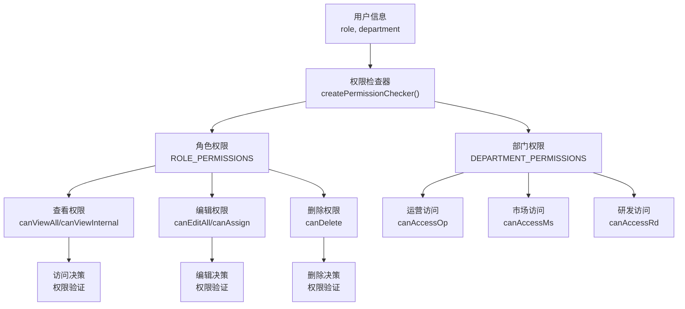

**图表来源**
- [server/service/middleware/permission.js](file://server/service/middleware/permission.js#L11-L52)
- [server/service/middleware/permission.js](file://server/service/middleware/permission.js#L57-L76)
- [server/service/middleware/permission.js](file://server/service/middleware/permission.js#L83-L210)

**章节来源**
- [server/service/middleware/permission.js](file://server/service/middleware/permission.js#L1-L278)

### 工单活动时间轴

#### 协作记录管理
**更新** 实现完整的工单协作记录系统：

- **活动类型**：状态变更、评论/备注、内部备注、附件上传、@提及、新增参与者、指派变更、优先级变更、SLA 超时、字段更新、工单关联、系统事件
- **可见性控制**：all（所有人可见）、internal（仅内部员工）、technician（仅技术员）三种可见性级别
- **参与者管理**：自动管理工单参与者，支持 @提及自动添加参与者
- **元数据支持**：丰富的活动元数据，支持状态变更、优先级变更等详细信息

#### @提及功能
- **自动解析**：支持 @用户名 和 @[显示名](用户ID) 两种 @提及格式
- **自动通知**：@提及自动发送通知给被提及用户
- **参与者添加**：@提及自动将用户添加到工单参与者列表
- **权限验证**：支持 @用户名 的模糊匹配查找用户

#### 首次响应跟踪
- **响应时间**：自动跟踪市场部门的首次响应时间和响应分钟数
- **时间计算**：从工单创建到第一次市场部门响应的时间差
- **数据更新**：首次响应后自动更新工单的 first_response_at 和 first_response_minutes 字段

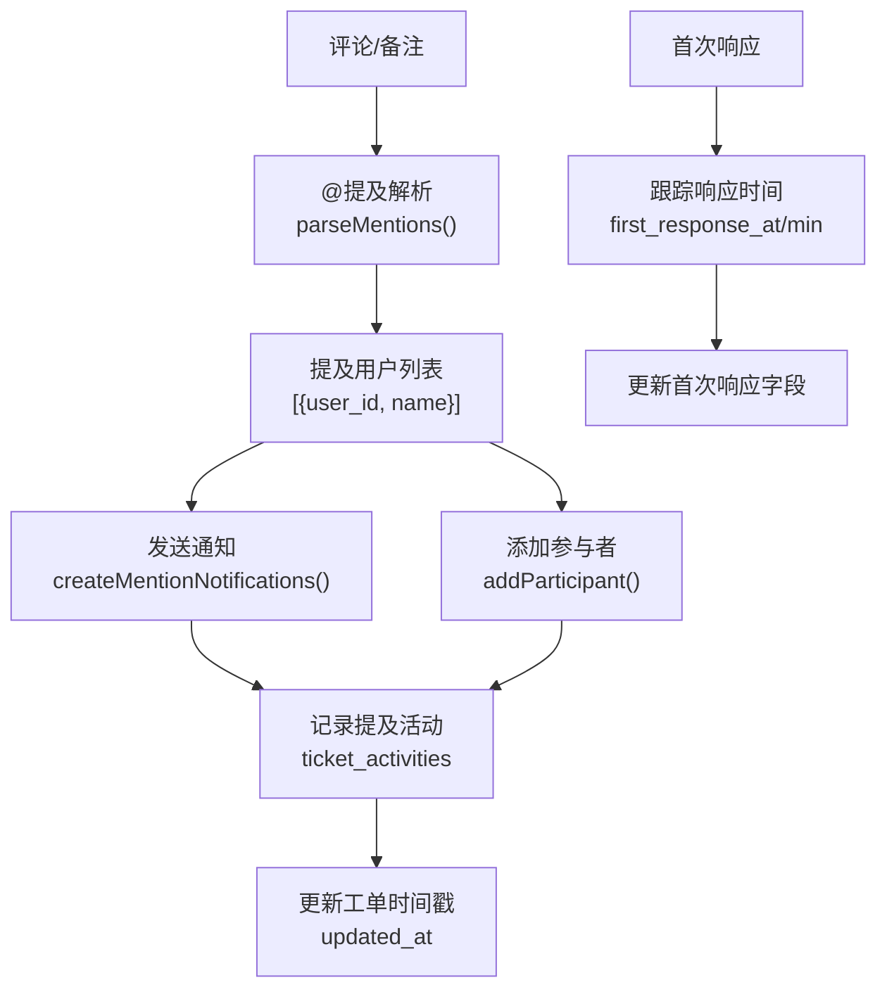

**图表来源**
- [server/service/routes/ticket-activities.js](file://server/service/routes/ticket-activities.js#L21-L43)
- [server/service/routes/ticket-activities.js](file://server/service/routes/ticket-activities.js#L48-L69)
- [server/service/routes/ticket-activities.js](file://server/service/routes/ticket-activities.js#L74-L100)
- [server/service/routes/ticket-activities.js](file://server/service/routes/ticket-activities.js#L318-L323)

**章节来源**
- [server/service/routes/ticket-activities.js](file://server/service/routes/ticket-activities.js#L1-L424)

### 账户联系人架构

#### 双层管理模型
**更新** 实现账户联系人双层管理架构：

- **账户管理**：accounts 表管理客户账户信息，支持组织类型和联系方式
- **联系人管理**：contacts 表管理账户下的具体联系人，支持职位和联系方式
- **关联关系**：一对一、一对多的灵活关联关系
- **权限控制**：基于账户的权限控制和数据隔离

#### 核心功能特性
- **账户类型**：支持不同类型的客户账户（如经销商、最终用户等）
- **联系人管理**：支持主联系人和多个次要联系人的管理
- **地址管理**：支持详细的地址信息和联系方式
- **经销商关联**：支持与经销商系统的关联

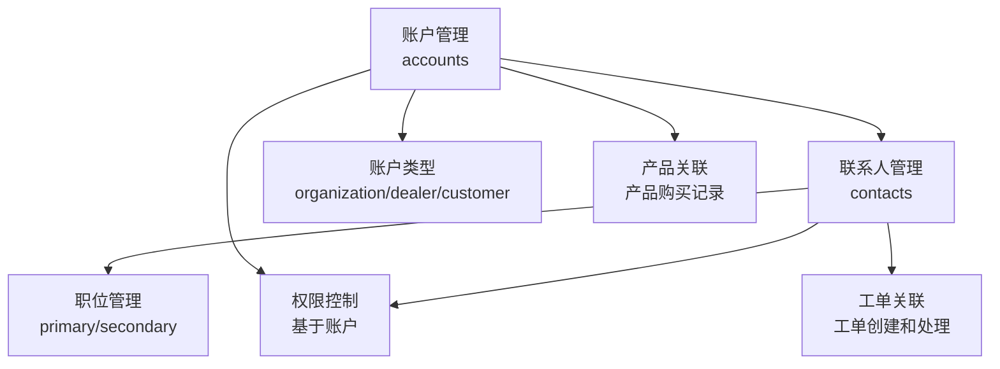

**图表来源**
- [server/service/migrations/020_p2_unified_tickets.sql](file://server/service/migrations/020_p2_unified_tickets.sql#L36-L42)
- [server/service/migrations/020_p2_unified_tickets.sql](file://server/service/migrations/020_p2_unified_tickets.sql#L112-L121)

**章节来源**
- [server/service/migrations/020_p2_unified_tickets.sql](file://server/service/migrations/020_p2_unified_tickets.sql#L1-L271)

### 产品家族过滤优化

#### 产品家族标准化
**更新** 新增产品家族字段标准化功能，实现统一的产品分类管理：

- **产品家族字段**：在 inquiry_tickets、rma_tickets、dealer_repairs 和 products 表中新增 product_family 字段
- **标准化映射**：将产品型号映射到标准产品家族，支持多种产品分类规则
- **迁移脚本**：提供完整的数据迁移和验证工具

#### 标准化规则
- **当前电影相机**：包含 MAVO Edge 8K、MAVO Edge 6K、MAVO mark2 LF 等
- **已归档电影相机**：包含 MAVO LF、TERRA 4K 等
- **Eagle 电子取景器**：包含 Eagle SDI、Eagle HDMI 等
- **通用配件**：包含 MC Board、KineBAT 等

#### 迁移实现
- **update_product_families.js**：添加 product_family 字段到工单表，基于产品型号进行智能分类
- **fix_product_family_names.js**：修复产品家族名称，确保分类准确性
- **migrate_ticket_product_family.js**：同步产品家族信息到现有工单记录

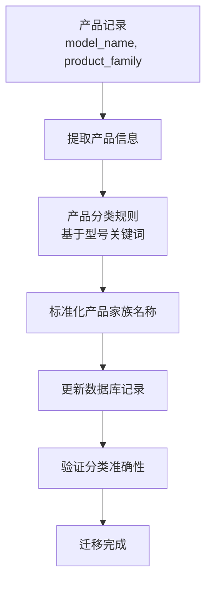

**图表来源**
- [server/migrations/update_product_families.js](file://server/migrations/update_product_families.js#L24-L45)
- [server/migrations/fix_product_family_names.js](file://server/migrations/fix_product_family_names.js#L15-L36)
- [server/scripts/migrate_ticket_product_family.js](file://server/scripts/migrate_ticket_product_family.js#L34-L58)

**章节来源**
- [server/migrations/update_product_families.js](file://server/migrations/update_product_families.js#L1-L121)
- [server/migrations/fix_product_family_names.js](file://server/migrations/fix_product_family_names.js#L1-L70)
- [server/scripts/migrate_ticket_product_family.js](file://server/scripts/migrate_ticket_product_family.js#L1-L206)
- [server/check_families.js](file://server/check_families.js#L1-L17)

### 服务等级过滤功能

#### 服务等级定义
**更新** 在经销商维修工单中新增服务等级过滤功能：

- **服务等级枚举**：VIP、VVIP、STANDARD、BLACKLIST
- **等级影响**：影响工单优先级、响应时间和服务质量
- **过滤实现**：支持按服务等级筛选经销商维修工单

#### 前端实现
- **DealerRepairListPage.tsx**：新增服务等级下拉筛选器
- **过滤逻辑**：支持多等级同时筛选和等级统计
- **UI 显示**：在工单列表中显示对应的服务等级标识

#### 后端支持
- **查询条件**：支持 service_tier 参数进行工单筛选
- **权限控制**：根据用户角色限制服务等级访问范围
- **统计功能**：提供按服务等级的工单统计和分析

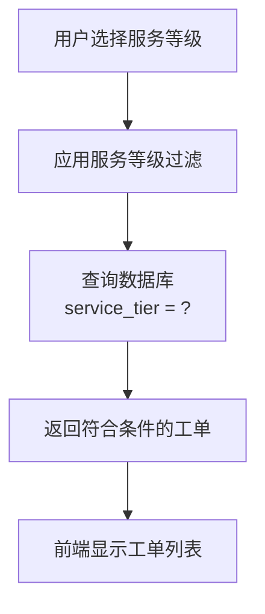

**图表来源**
- [client/src/components/DealerRepairs/DealerRepairListPage.tsx](file://client/src/components/DealerRepairs/DealerRepairListPage.tsx#L637-L650)
- [server/service/routes/dealer-repairs.js](file://server/service/routes/dealer-repairs.js#L1-L472)

**章节来源**
- [client/src/components/DealerRepairs/DealerRepairListPage.tsx](file://client/src/components/DealerRepairs/DealerRepairListPage.tsx#L637-L650)
- [server/service/routes/dealer-repairs.js](file://server/service/routes/dealer-repairs.js#L1-L472)

### 技师信息统一处理

#### 统一人员信息管理
**更新** 优化工单系统中的技师信息处理机制：

- **统一字段命名**：统一使用 handler_id、assigned_to 等标准字段
- **信息关联**：通过 users 表统一管理技师、负责人等角色信息
- **权限验证**：确保技师信息的准确性和权限控制

#### 工单路由优化
- **格式化函数**：统一处理工单详情和列表中的技师信息
- **权限检查**：在工单操作中验证技师权限
- **历史记录**：记录技师变更历史和操作日志

#### 前端展示优化
- **统一显示格式**：在工单列表和详情中统一显示技师信息
- **权限控制**：根据用户角色显示相应的技师信息
- **交互优化**：提供技师信息的搜索和筛选功能

**章节来源**
- [server/service/routes/inquiry-tickets.js](file://server/service/routes/inquiry-tickets.js#L65-L105)
- [server/service/routes/rma-tickets.js](file://server/service/routes/rma-tickets.js#L57-L95)
- [server/service/routes/dealer-repairs.js](file://server/service/routes/dealer-repairs.js#L1-L472)

### 三层次工单系统

#### 咨询工单（Layer 1）
- **ID 格式**：KYYMM-XXXX（例如 K2602-0001）
- **功能特性**：
  - 支持多种服务类型：咨询、故障排除、远程协助、投诉
  - 支持多种渠道：电话、邮件、微信、企业微信、在线客服
  - 状态管理：进行中、等待反馈、已解决、自动关闭、已升级
  - 升级机制：可升级为 RMA 或经销商维修单
  - **新增** 产品家族过滤：支持按产品家族筛选咨询工单
- **序列管理**：按年月维度维护独立序号

#### RMA 工单（Layer 2）
- **ID 格式**：RMA-{C}-YYMM-XXXX（例如 RMA-D-2602-0001）
- **功能特性**：
  - 多渠道支持：D=经销商、C=客户、I=内部
  - 问题分类：生产问题、运输问题、客户退回、内部样品
  - 严重程度：1/2/3 级别
  - 支持批量创建（购物车模式）
  - 支持分配技师、审批流程
  - **新增** 产品家族过滤：支持按产品家族筛选 RMA 工单
- **序列管理**：按渠道和年月维度维护独立序号

#### 经销商维修单（Layer 3）
- **ID 格式**：SVC-D-YYMM-XXXX（例如 SVC-D-2602-0001）
- **功能特性**：
  - 专门针对经销商的现场维修服务
  - 支持配件消耗记录
  - 状态管理：进行中、已完成
  - **新增** 服务等级过滤：支持按客户服务等级筛选
  - **新增** 产品家族过滤：支持按产品家族筛选维修工单
- **序列管理**：按年月维度维护独立序号

#### 工单系统 API 设计
- **咨询工单 API**：/api/v1/inquiry-tickets（列表、详情、创建、更新、升级、重新打开、删除）
- **RMA 工单 API**：/api/v1/rma-tickets（列表、详情、创建、批量创建、更新、分配、审批、删除）
- **经销商维修 API**：/api/v1/dealer-repairs（列表、详情、创建、更新、删除）
- **服务记录 API**：/api/v1/service-records（列表、详情、创建、更新、评论、升级、删除）

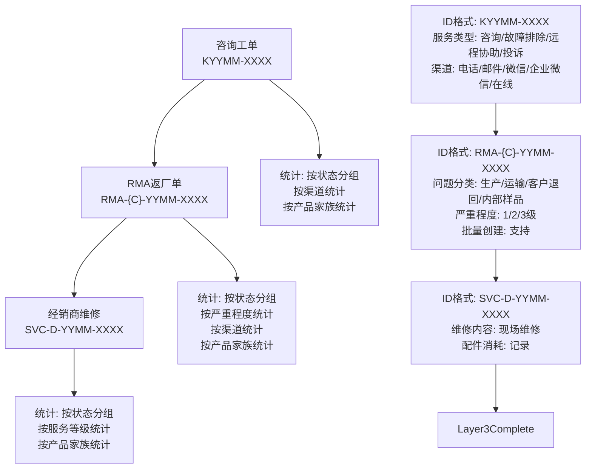

**图表来源**
- [server/service/migrations/009_three_layer_tickets.sql](file://server/service/migrations/009_three_layer_tickets.sql#L5-L198)
- [server/service/routes/inquiry-tickets.js](file://server/service/routes/inquiry-tickets.js#L16-L47)
- [server/service/routes/rma-tickets.js](file://server/service/routes/rma-tickets.js#L22-L55)
- [server/service/routes/dealer-repairs.js](file://server/service/routes/dealer-repairs.js#L20-L47)

**章节来源**
- [server/service/migrations/009_three_layer_tickets.sql](file://server/service/migrations/009_three_layer_tickets.sql#L1-L198)
- [server/service/routes/inquiry-tickets.js](file://server/service/routes/inquiry-tickets.js#L1-L707)
- [server/service/routes/rma-tickets.js](file://server/service/routes/rma-tickets.js#L1-L653)
- [server/service/routes/dealer-repairs.js](file://server/service/routes/dealer-repairs.js#L1-L472)

### 服务记录系统

#### 功能特性
- **ID 格式**：SR-YYYY-XXXX（例如 SR-2026-0001）
- **服务模式**：快速查询（不创建记录）或客户服务（创建记录）
- **服务类型**：咨询、技术支持、保修查询、维修申请、投诉、其他
- **渠道**：电话、邮件、微信、在线客服、上门
- **状态管理**：已创建、处理中、待客户反馈、已解决、自动关闭、已转工单
- **升级机制**：可升级为工作订单（Issue）

#### API 设计
- **服务记录 API**：/api/v1/service-records（列表、详情、创建、更新、删除）
- **评论功能**：支持员工、客户、系统评论，可设置内部可见性
- **状态历史**：完整记录状态变更历史
- **权限控制**：基于用户角色的读写权限管理

**章节来源**
- [server/service/migrations/002_service_records.sql](file://server/service/migrations/002_service_records.sql#L1-L174)
- [server/service/routes/service-records.js](file://server/service/routes/service-records.js#L1-L798)

### 前端集成与缓存机制

#### 工单缓存系统
- **SWR 集成**：useCachedTickets hook 提供智能缓存和自动刷新
- **缓存策略**：支持重新验证、去重间隔、刷新间隔配置
- **预取功能**：prefetchTickets 支持导航前预热缓存
- **类型安全**：泛型支持不同工单类型的强类型数据

#### 前端组件集成
- **咨询工单列表**：InquiryTicketListPage 支持智能分组（紧急、关注、活跃、已完成）
- **服务记录列表**：ServiceRecordListPage 提供完整的服务记录管理界面
- **工单模态框**：useTicketStore 管理工单创建草稿和弹窗状态
- **服务等级筛选**：新增服务等级过滤功能，支持多等级同时筛选

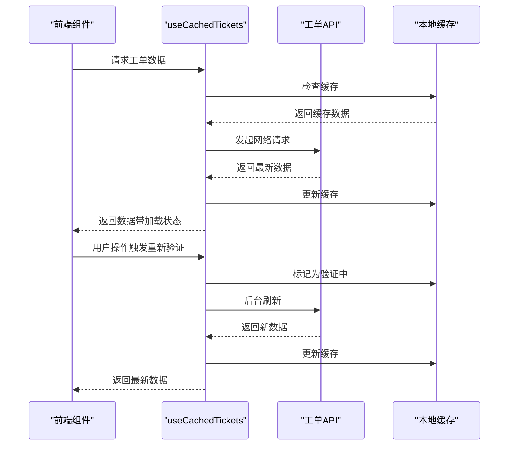

**图表来源**
- [client/src/hooks/useCachedTickets.ts](file://client/src/hooks/useCachedTickets.ts#L1-L118)
- [client/src/components/InquiryTickets/InquiryTicketListPage.tsx](file://client/src/components/InquiryTickets/InquiryTicketListPage.tsx#L89-L91)
- [client/src/store/useTicketStore.ts](file://client/src/store/useTicketStore.ts#L22-L68)

**章节来源**
- [client/src/hooks/useCachedTickets.ts](file://client/src/hooks/useCachedTickets.ts#L1-L118)
- [client/src/components/InquiryTickets/InquiryTicketListPage.tsx](file://client/src/components/InquiryTickets/InquiryTicketListPage.tsx#L1-L491)
- [client/src/components/ServiceRecords/ServiceRecordListPage.tsx](file://client/src/components/ServiceRecords/ServiceRecordListPage.tsx#L1-L395)
- [client/src/store/useTicketStore.ts](file://client/src/store/useTicketStore.ts#L1-L68)

### 词库与每日单词
- 词库数据：多语言 JSON 文件，包含单词、音标、释义、例句、难度等级等
- 后端集成：启动时若词库为空则自动导入种子数据；提供随机与批量查询接口

**章节来源**
- [server/data/vocab/en.json](file://server/data/vocab/en.json#L1-L227)
- [server/seeds/vocabulary_seed.json](file://server/seeds/vocabulary_seed.json#L1-L800)
- [server/index.js](file://server/index.js#L80-L111)
- [server/index.js](file://server/index.js#L1362-L1420)

### 部署与运维
- PM2 集群：使用 ecosystem.config.js 启动，实例数设为 max，自动重启与内存限制
- 日志：统一输出到 logs/ 目录，合并日志便于排查
- 前端静态资源：生产环境下由 Express 提供 client/dist

**章节来源**
- [scripts/ecosystem.config.js](file://scripts/ecosystem.config.js#L1-L41)
- [server/index.js](file://server/index.js#L3120-L3125)

## 依赖关系分析

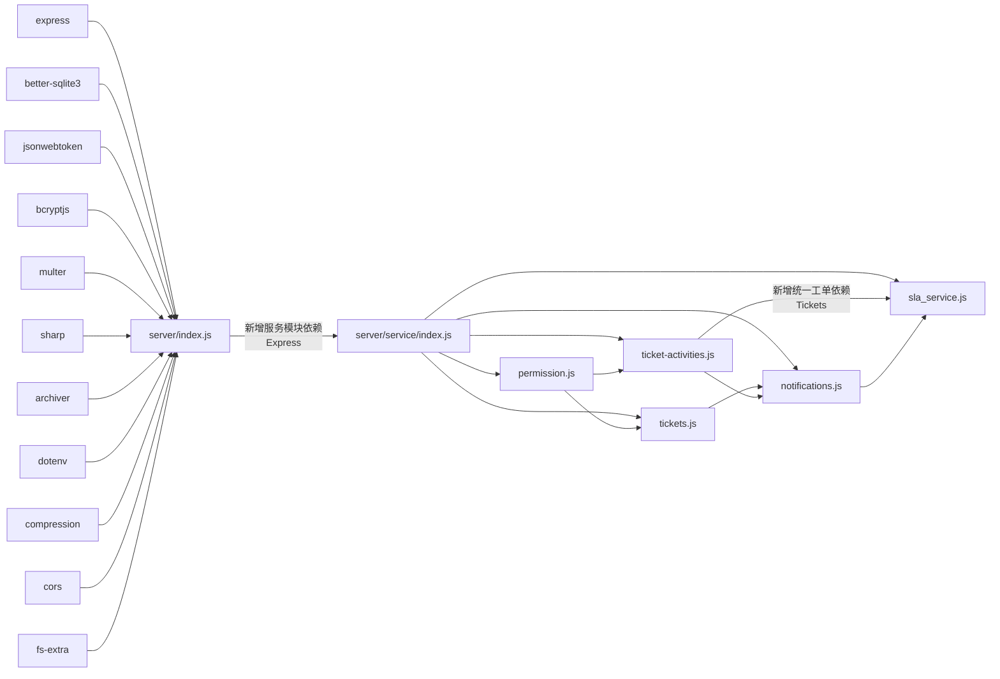

**图表来源**
- [server/package.json](file://server/package.json#L15-L39)

**章节来源**
- [server/package.json](file://server/package.json#L15-L39)

## 性能考虑
- 数据库优化
  - WAL 模式开启，提升并发读写性能
  - 事务批量写入（如上传、合并分片），减少提交开销
  - 为高频查询建立索引（如 starred_files、share_links、统一工单相关索引）
  - **新增** 统一工单系统索引优化：按状态、处理人、产品、序列号、SLA 状态等字段建立索引
  - **新增** SLA 引擎索引：为 sla_due_at、sla_status 字段建立索引，提升时效查询性能
  - **新增** 通知系统索引：为 notifications 表的 recipient_id、notification_type、is_read 等字段建立索引
- 缓存策略
  - 缩略图缓存（WebP），命中即返回，降低 CPU 使用
  - ETag 机制，浏览器/CDN 可缓存目录列表
  - **新增** 前端工单数据缓存：SWR 提供智能缓存和自动刷新
  - **新增** 统一工单缓存：缓存工单状态和 SLA 信息，减少重复计算
  - **新增** 权限缓存：缓存用户权限信息，减少权限检查开销
- 并发控制
  - 缩略图生成队列限制并发数，避免资源争用
  - PM2 集群模式利用多核提升吞吐
  - **新增** 统一工单并发控制：合理设置 API 并发限制
  - **新增** SLA 批量检查并发控制：限制定时任务的并发度
  - **新增** 通知推送并发控制：限制大量通知的推送频率
- I/O 优化
  - 大文件下载使用流式传输，避免一次性加载
  - 批量下载使用 archiver 流式压缩
  - **新增** 统一工单附件流式处理，支持大文件上传
  - **新增** SLA 数据迁移优化，支持断点续传
  - **新增** 通知批量处理优化，支持异步处理大量通知

## 故障排查指南
- 认证失败
  - 检查 Authorization 头是否正确传递，确认 JWT 是否过期
  - 登录后重新获取 token，确认用户存在且密码正确
- 权限不足
  - 使用 /api/user/permissions 获取当前有效权限
  - 确认目标路径是否在允许范围内，或是否需要扩展权限
  - **新增** 检查权限中间件是否正确应用
  - **新增** 验证用户角色和部门权限配置
- 缩略图生成失败
  - 检查 ffmpeg/sips 是否可用，确认源文件格式受支持
  - 清理 .thumbnails 中异常缓存文件后重试
- 文件不存在或路径错误
  - 使用 resolvePath 规范化路径，确认中文路径的 NFC/NFD 正常
  - 检查 DISK_A 对应目录是否存在
- 分享链接失效
  - 校验过期时间与密码，确认文件未被移动或删除
- 回收站清理
  - 系统会定期清理 30 天前的过期项，确认清理任务正常运行
- **新增** 统一工单系统问题
  - 工单编号生成异常：检查 ticket_sequences 表的 last_sequence 字段
  - 工单状态机异常：确认 current_node 和 status 字段的一致性
  - SLA 计算异常：检查 SLA 引擎的优先级和节点映射配置
  - 通知发送异常：确认通知类型和接收者权限
  - 权限控制异常：检查权限中间件的用户角色和部门配置
  - 活动时间轴异常：确认活动类型和可见性控制
  - 账户联系人异常：检查 accounts 和 contacts 表的关联关系
- **新增** SLA 引擎问题
  - SLA 截止时间计算错误：检查优先级矩阵和节点映射
  - SLA 预警通知异常：确认批量检查任务的执行情况
  - SLA 超时统计异常：检查 breach_counter 字段的更新逻辑
- **新增** 通知中心问题
  - 通知类型识别异常：确认 notification_type 枚举值
  - 通知权限控制异常：检查接收者的权限配置
  - 通知批量操作异常：确认批量清理和归档功能
- **新增** 权限中间件问题
  - 角色权限配置异常：检查 ROLE_PERMISSIONS 配置
  - 部门权限映射异常：确认 DEPARTMENT_PERMISSIONS 配置
  - 视图切换功能异常：检查 X-View-As-User 头的处理

**章节来源**
- [server/index.js](file://server/index.js#L590-L622)
- [server/index.js](file://server/index.js#L627-L680)
- [server/service/index.js](file://server/service/index.js#L1-L163)
- [server/service/sla_service.js](file://server/service/sla_service.js#L179-L225)
- [server/service/routes/notifications.js](file://server/service/routes/notifications.js#L85-L151)
- [server/service/middleware/permission.js](file://server/service/middleware/permission.js#L215-L246)

## 结论
Longhorn 后端以 Express + SQLite 为核心，结合 JWT 权限与路径解析，实现了多部门协作场景下的文件管理与分享能力。通过缩略图缓存、并发队列与 PM2 集群，兼顾了性能与稳定性。

**更新** 服务端版本现已升级至 1.7.90，本次重大架构重构引入了统一工单系统、SLA 引擎、通知中心和权限中间件等核心服务模块，形成了完整的客户服务管理平台。统一工单系统采用单表多态设计，支持三种工单类型的统一管理；SLA 引擎提供智能时效计算和预警机制；通知中心实现多类型通知推送和管理；权限中间件提供细粒度的访问控制和视图切换功能。

**新增功能总结**
- **统一工单系统**：单表多态设计，支持咨询、RMA、维修三种工单类型的统一管理
- **智能 SLA 引擎**：基于优先级和状态机的时效计算和预警机制
- **完整通知中心**：多类型通知推送、生命周期管理和关联管理
- **细粒度权限控制**：基于角色和部门的访问控制和视图切换功能
- **协作活动时间轴**：完整的工单协作记录和可见性控制
- **账户联系人架构**：双层管理模型，支持更精细的客户关系管理
- **产品家族过滤优化**：实现了统一的产品分类标准，支持精细化产品管理
- **服务等级过滤**：在经销商维修工单中实现了基于客户等级的筛选功能

建议在生产环境中进一步完善监控指标、日志分级与告警策略，持续优化数据库索引与缓存命中率，特别是统一工单系统的查询性能和并发处理能力。同时建议加强 SLA 引擎的实时性和通知中心的可靠性，确保关键业务流程的稳定运行。

## 附录

### API 版本管理
- 当前路由均以 /api/ 开头，未见明确版本号（如 v1、v2）
- 建议在新增不兼容变更时引入版本前缀，确保向后兼容
- **新增** 工单系统 API 已采用 /api/v1/ 前缀，符合版本管理规范
- **新增** 服务模块 API 已采用 /api/v1/ 前缀，统一版本管理

### 性能监控与日志
- 建议接入性能监控（如慢查询、响应时间、并发数）
- 日志按模块拆分（访问日志、业务日志、错误日志），并设置轮转策略
- **新增** 统一工单系统建议监控：工单创建/升级成功率、平均处理时间、并发工单数量
- **新增** SLA 引擎建议监控：SLA 计算准确性、预警通知成功率、超时工单统计
- **新增** 通知中心建议监控：通知发送成功率、用户阅读率、通知分类统计
- **新增** 权限中间件建议监控：权限检查耗时、权限缓存命中率、异常权限访问

### 安全加固
- 强制 HTTPS 传输，严格校验 JWT 密钥
- 输入参数白名单与长度限制，防止注入与滥用
- 定期审计权限与分享链接，清理过期与异常项
- **新增** 统一工单系统安全：敏感数据脱敏、操作日志记录、批量操作安全检查
- **新增** SLA 引擎安全：时效数据验证、超时计算审计、预警通知验证
- **新增** 通知中心安全：通知内容过滤、接收者权限验证、批量操作安全检查
- **新增** 权限中间件安全：角色权限验证、视图切换审计、部门权限隔离

### 统一工单系统扩展建议
- **新增** 工单优先级算法：基于严重程度、客户等级、SLA 等因素动态计算
- **新增** 工单自动化：基于规则的自动分配和状态流转
- **新增** 工单报表：多维度统计分析和趋势预测
- **新增** 工单移动端：支持离线编辑和同步
- **新增** SLA 智能优化：基于历史数据的 SLA 时间调整
- **新增** 通知智能推荐：基于用户偏好的通知个性化推送
- **新增** 权限智能分配：基于用户能力和工单复杂度的智能权限分配

### 版本信息
**更新** 服务端版本从 1.7.88 升级到 1.7.90，主要变更包括：
- 服务器版本号更新至 1.7.90
- 统一工单系统、SLA 引擎、通知中心等核心服务模块的稳定性和性能优化
- 前端工单缓存系统的改进和性能提升
- 数据库索引和查询优化，特别是统一工单系统的查询性能

**章节来源**
- [server/package.json](file://server/package.json#L3-L3)