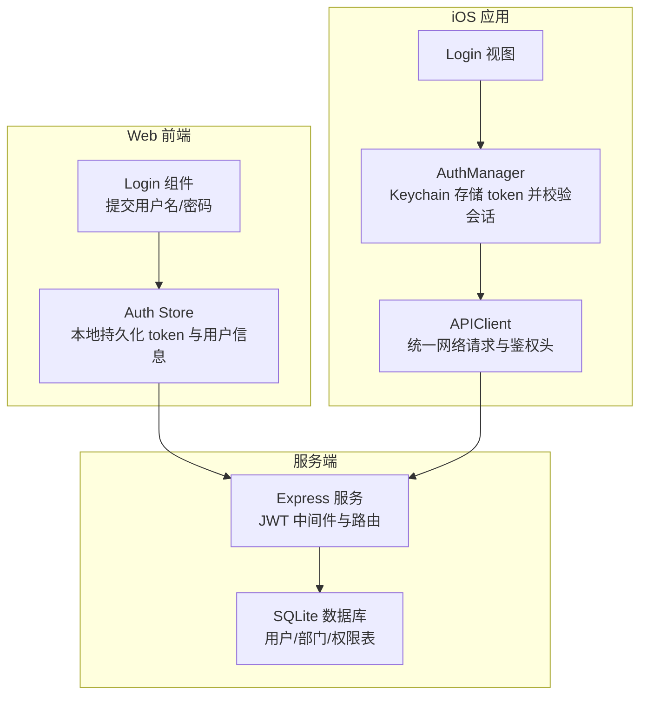
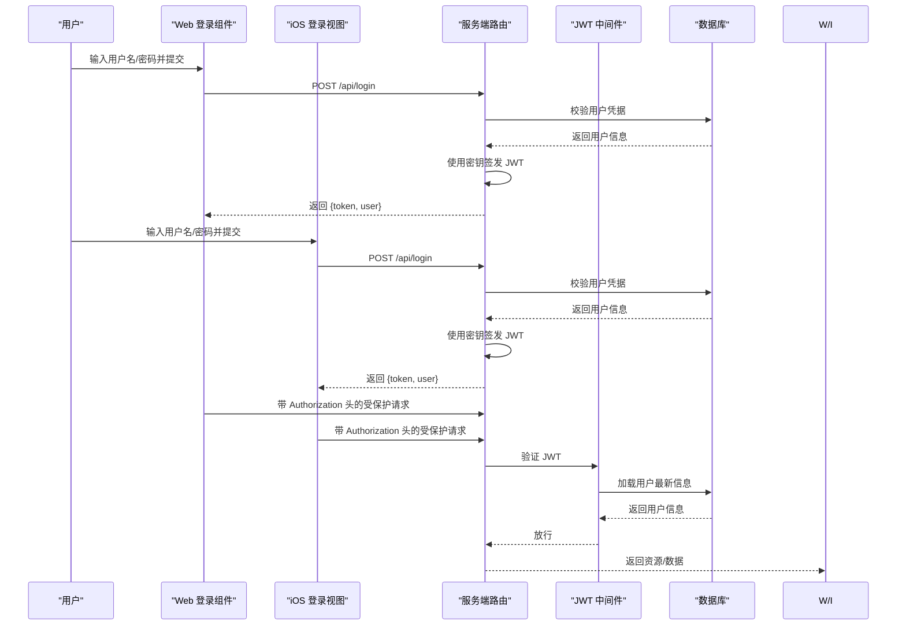
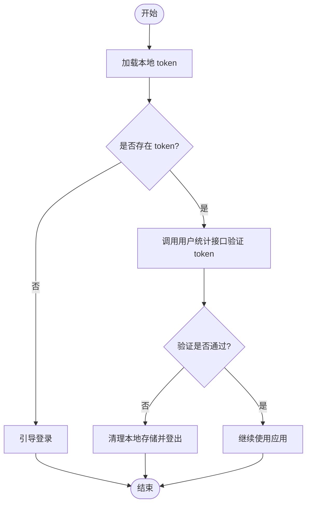
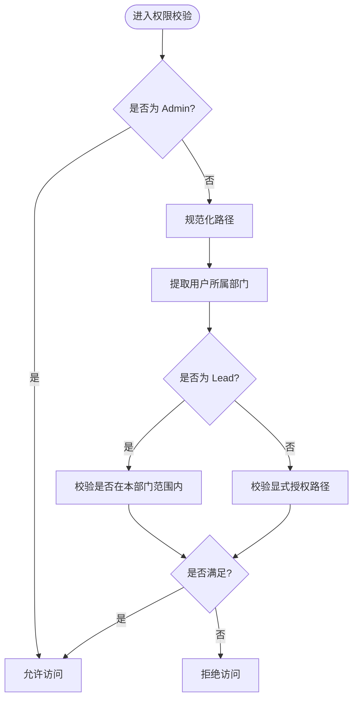
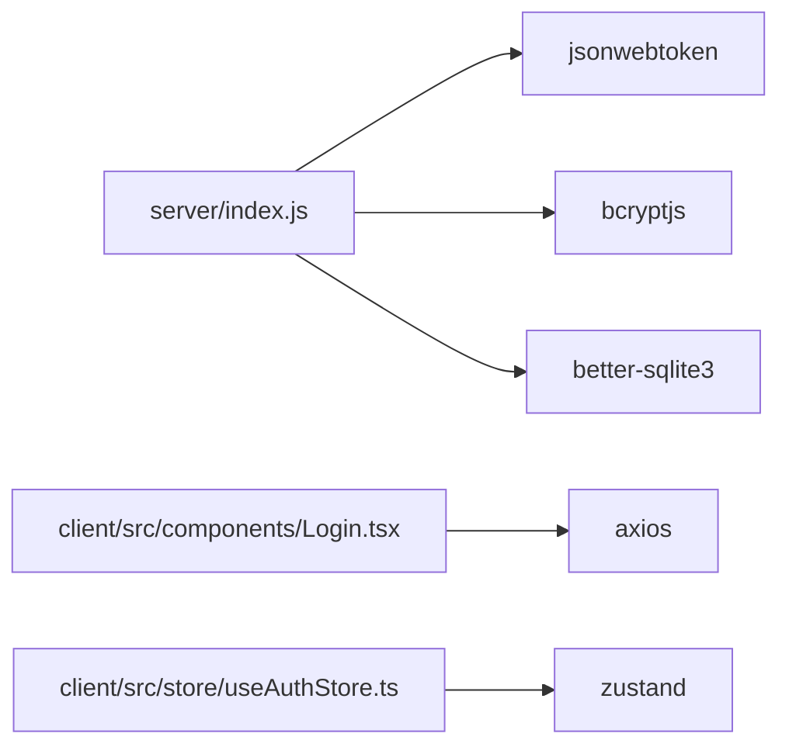

# 安全认证机制

<cite>
**本文引用的文件**
- [server/index.js](file://server/index.js)
- [client/src/store/useAuthStore.ts](file://client/src/store/useAuthStore.ts)
- [ios/LonghornApp/Services/AuthManager.swift](file://ios/LonghornApp/Services/AuthManager.swift)
- [ios/LonghornApp/Services/APIClient.swift](file://ios/LonghornApp/Services/APIClient.swift)
- [ios/LonghornApp/Models/User.swift](file://ios/LonghornApp/Models/User.swift)
- [client/src/components/Login.tsx](file://client/src/components/Login.tsx)
- [client/src/utils/pathTranslator.ts](file://client/src/utils/pathTranslator.ts)
- [server/package-lock.json](file://server/package-lock.json)
- [client/package-lock.json](file://client/package-lock.json)
</cite>

## 目录
1. [简介](#简介)
2. [项目结构](#项目结构)
3. [核心组件](#核心组件)
4. [架构总览](#架构总览)
5. [详细组件分析](#详细组件分析)
6. [依赖关系分析](#依赖关系分析)
7. [性能考虑](#性能考虑)
8. [故障排查指南](#故障排查指南)
9. [结论](#结论)
10. [附录](#附录)

## 简介
本文件系统化梳理 Longhorn 的安全认证与权限控制机制，覆盖以下主题：
- 基于 JWT 的认证流程：令牌签发、验证与失效处理
- RBAC 权限控制：角色定义、权限矩阵与动态授权
- 密码加密策略、会话管理与安全响应头
- 路径权限验证算法、部门权限控制与访问日志
- CORS、CSRF 与 XSS 防护现状与建议
- 安全审计日志、异常检测与入侵防护策略
- API 安全最佳实践与合规性要求

## 项目结构
Longhorn 采用前后端分离架构，服务端使用 Node.js + Express，客户端包含 Web 前端（React + TypeScript）与 iOS 原生应用（Swift）。认证与权限控制的关键实现分布在服务端路由与中间件、前端状态存储与登录组件、iOS 网络层与认证管理器。

图表来源
- [server/index.js](file://server/index.js#L267-L295)
- [client/src/components/Login.tsx](file://client/src/components/Login.tsx#L15-L27)
- [client/src/store/useAuthStore.ts](file://client/src/store/useAuthStore.ts#L17-L30)
- [ios/LonghornApp/Services/AuthManager.swift](file://ios/LonghornApp/Services/AuthManager.swift#L44-L69)
- [ios/LonghornApp/Services/APIClient.swift](file://ios/LonghornApp/Services/APIClient.swift#L247-L269)

章节来源
- [server/index.js](file://server/index.js#L1-L200)
- [client/src/store/useAuthStore.ts](file://client/src/store/useAuthStore.ts#L1-L31)
- [ios/LonghornApp/Services/AuthManager.swift](file://ios/LonghornApp/Services/AuthManager.swift#L1-L195)
- [ios/LonghornApp/Services/APIClient.swift](file://ios/LonghornApp/Services/APIClient.swift#L1-L326)

## 核心组件
- 服务端认证中间件与路由
  - JWT 中间件负责从 Authorization 头解析并验证令牌，加载最新用户信息
  - 登录路由对凭据进行校验，签发 JWT，并返回用户信息与令牌
- 前端认证状态管理
  - Web 端使用 zustand 在 localStorage 中持久化 token 与用户信息
  - iOS 端使用 Keychain 存储 token，UserDefaults 存储用户信息
- 网络层与会话校验
  - iOS 端在启动时尝试恢复会话并异步调用用户统计接口验证令牌有效性
  - Web 端在登录成功后将 token 写入 localStorage
- 权限控制
  - hasPermission 实现路径权限判断，结合用户角色与部门信息
  - 部门级权限通过 permissions 表与 departments 表关联查询

章节来源
- [server/index.js](file://server/index.js#L267-L295)
- [server/index.js](file://server/index.js#L684-L713)
- [client/src/store/useAuthStore.ts](file://client/src/store/useAuthStore.ts#L17-L30)
- [ios/LonghornApp/Services/AuthManager.swift](file://ios/LonghornApp/Services/AuthManager.swift#L94-L123)
- [ios/LonghornApp/Services/APIClient.swift](file://ios/LonghornApp/Services/APIClient.swift#L287-L301)

## 架构总览
下图展示从用户登录到资源访问的完整认证与授权链路，以及关键的安全控制点。

图表来源
- [server/index.js](file://server/index.js#L267-L295)
- [server/index.js](file://server/index.js#L684-L713)
- [client/src/components/Login.tsx](file://client/src/components/Login.tsx#L15-L27)
- [ios/LonghornApp/Services/AuthManager.swift](file://ios/LonghornApp/Services/AuthManager.swift#L44-L69)

## 详细组件分析

### JWT 认证流程
- 令牌签发
  - 登录成功后，服务端使用密钥对用户标识与角色等声明进行签名，生成 JWT
- 令牌验证
  - 中间件从 Authorization 头读取 Bearer 令牌，使用密钥验证其完整性
  - 验证通过后，从数据库加载用户的最新角色与部门信息注入到请求上下文
- 会话恢复与失效处理
  - iOS 端启动时尝试从 Keychain 恢复 token 并从 UserDefaults 恢复用户信息
  - 异步调用用户统计接口验证令牌有效性；若失败则自动登出
  - Web 端在登录成功后写入 localStorage；若服务端返回 401，则由网络层触发登出逻辑

图表来源
- [ios/LonghornApp/Services/AuthManager.swift](file://ios/LonghornApp/Services/AuthManager.swift#L94-L123)
- [ios/LonghornApp/Services/APIClient.swift](file://ios/LonghornApp/Services/APIClient.swift#L287-L301)
- [client/src/store/useAuthStore.ts](file://client/src/store/useAuthStore.ts#L17-L30)

章节来源
- [server/index.js](file://server/index.js#L267-L295)
- [server/index.js](file://server/index.js#L684-L713)
- [ios/LonghornApp/Services/AuthManager.swift](file://ios/LonghornApp/Services/AuthManager.swift#L44-L123)
- [ios/LonghornApp/Services/APIClient.swift](file://ios/LonghornApp/Services/APIClient.swift#L247-L301)
- [client/src/store/useAuthStore.ts](file://client/src/store/useAuthStore.ts#L17-L30)

### RBAC 权限控制系统
- 角色定义
  - Admin：超级管理员，拥有最高权限
  - Lead：部门负责人，可管理本部门成员与权限
  - Member：普通成员，仅能访问自身与授权范围内的资源
- 权限矩阵
  - Admin 可见全部部门并进行全量管理
  - Lead 仅能查看与管理本部门成员与其授权范围
  - Member 仅能访问其个人空间与显式授权的部门路径
- 动态授权
  - 通过 permissions 表与 departments 表关联，支持按部门或子路径授予 Read/Contribute/Full 权限
  - 授权可设置过期时间，过期后自动失效
- 路径权限验证算法
  - 对传入路径进行规范化处理，支持“运营部/OP”等多语言与代码混用场景
  - 结合用户角色与部门信息，判断是否具备访问权限

图表来源
- [server/index.js](file://server/index.js#L300-L350)
- [server/index.js](file://server/index.js#L716-L756)
- [server/index.js](file://server/index.js#L1031-L1051)

章节来源
- [server/index.js](file://server/index.js#L300-L350)
- [server/index.js](file://server/index.js#L716-L756)
- [server/index.js](file://server/index.js#L1031-L1051)
- [ios/LonghornApp/Models/User.swift](file://ios/LonghornApp/Models/User.swift#L10-L50)

### 密码加密策略、会话管理与安全头
- 密码加密
  - 登录时使用哈希算法对明文密码进行比对，确保不以明文形式存储
- 会话管理
  - Web 端：localStorage 存储 token 与用户信息
  - iOS 端：Keychain 存储 token，UserDefaults 存储用户信息
- 安全响应头
  - 服务端在部分响应中设置缓存控制头，但未全局启用严格安全头（如 Content-Security-Policy、X-Frame-Options 等）

章节来源
- [server/index.js](file://server/index.js#L684-L713)
- [client/src/store/useAuthStore.ts](file://client/src/store/useAuthStore.ts#L17-L30)
- [ios/LonghornApp/Services/AuthManager.swift](file://ios/LonghornApp/Services/AuthManager.swift#L134-L180)
- [server/index.js](file://server/index.js#L671-L673)

### 路径权限验证算法、部门权限控制与访问日志
- 路径解析与翻译
  - 服务端提供路径解析函数，支持将“运营部/OP”等多语言与代码混用路径标准化
  - Web 前端提供路径段翻译工具，将部门代码映射为本地化显示名称
- 部门权限控制
  - 用户可访问的部门列表由管理员与显式授权共同决定
  - Lead 仅能授予本部门范围内的授权
- 访问日志
  - 服务端在关键节点输出调试日志，便于诊断远程状态与权限逻辑

章节来源
- [server/index.js](file://server/index.js#L759-L790)
- [client/src/utils/pathTranslator.ts](file://client/src/utils/pathTranslator.ts#L14-L52)
- [server/index.js](file://server/index.js#L716-L756)

### CORS、CSRF 与 XSS 防护
- CORS
  - 服务端引入了 cors 库，但未看到具体配置项，需确认白名单与凭证策略
- CSRF
  - 未发现专门的 CSRF 防护实现（如 SameSite Cookie、CSRF Token）
- XSS
  - 服务端在分享页面存在直接拼接 HTML 的场景，存在潜在 XSS 风险，建议改为模板渲染或严格转义

章节来源
- [server/index.js](file://server/index.js#L1-L200)
- [server/index.js](file://server/index.js#L2069-L2132)

## 依赖关系分析
- 服务端依赖
  - jsonwebtoken：用于 JWT 签发与验证
  - bcryptjs：用于密码哈希与比对
  - better-sqlite3：用于 SQLite 数据库访问
- 前端依赖
  - axios：用于 Web 端发起 HTTP 请求
  - zustand：用于状态管理

图表来源
- [server/package-lock.json](file://server/package-lock.json#L2012-L2033)
- [server/package-lock.json](file://server/package-lock.json#L1180-L1196)
- [client/package-lock.json](file://client/package-lock.json#L2021-L2036)

章节来源
- [server/package-lock.json](file://server/package-lock.json#L1089-L1215)
- [client/package-lock.json](file://client/package-lock.json#L2021-L2036)

## 性能考虑
- JWT 验证成本低，适合高并发场景
- 会话恢复采用异步验证，避免阻塞主线程
- 数据库查询使用事务与索引优化（如 permissions 表），减少写入延迟
- 图片缩略图与缓存控制提升静态资源访问效率

## 故障排查指南
- 登录失败
  - 检查用户名/密码是否正确，确认服务端哈希比对逻辑
  - 查看服务端日志中的错误信息与数据库连接状态
- 令牌无效或频繁失效
  - 确认 JWT 密钥一致且未被更改
  - 检查客户端是否正确携带 Authorization 头
  - iOS 端验证逻辑会在 401 时自动登出，需检查网络层错误处理
- 权限不足
  - 确认用户角色与部门信息是否正确
  - 检查 permissions 表中是否存在有效的授权记录及过期时间
- 分享链接访问异常
  - 若设置了密码，需确认密码哈希与比对逻辑
  - 检查文件路径是否存在与访问计数更新

章节来源
- [server/index.js](file://server/index.js#L267-L295)
- [ios/LonghornApp/Services/APIClient.swift](file://ios/LonghornApp/Services/APIClient.swift#L287-L301)
- [server/index.js](file://server/index.js#L2069-L2132)

## 结论
Longhorn 已实现基于 JWT 的认证与 RBAC 权限控制，具备基本的会话恢复与失效处理能力。建议进一步完善：
- 引入严格的 CSP、X-Frame-Options、X-Content-Type-Options 等安全头
- 部署 CSRF 防护与同源策略强化
- 对分享页面的动态 HTML 拼接进行转义或模板化
- 增强审计日志与异常监控，建立入侵检测与告警机制

## 附录
- API 安全最佳实践
  - 强制 HTTPS 传输
  - 限制请求频率与并发
  - 对敏感字段进行脱敏与最小化暴露
- 合规性要求
  - 数据最小化与保留策略
  - 用户知情同意与隐私政策
  - 定期安全评估与渗透测试