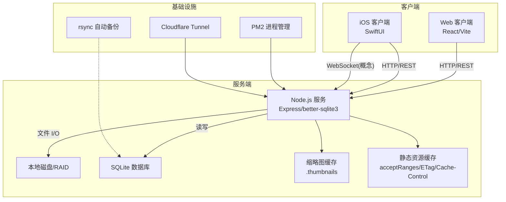
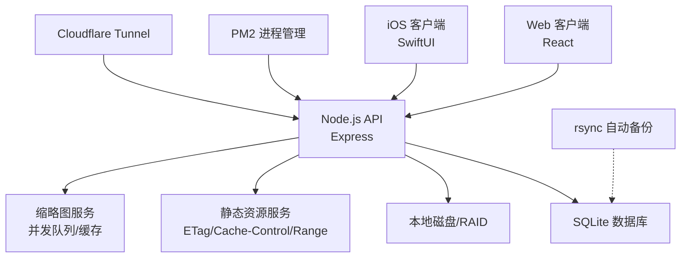
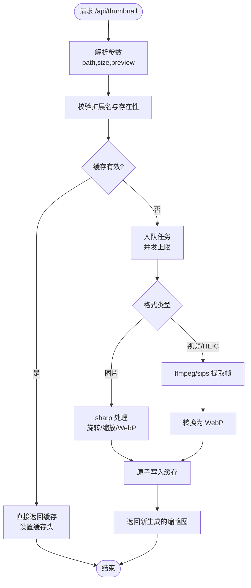
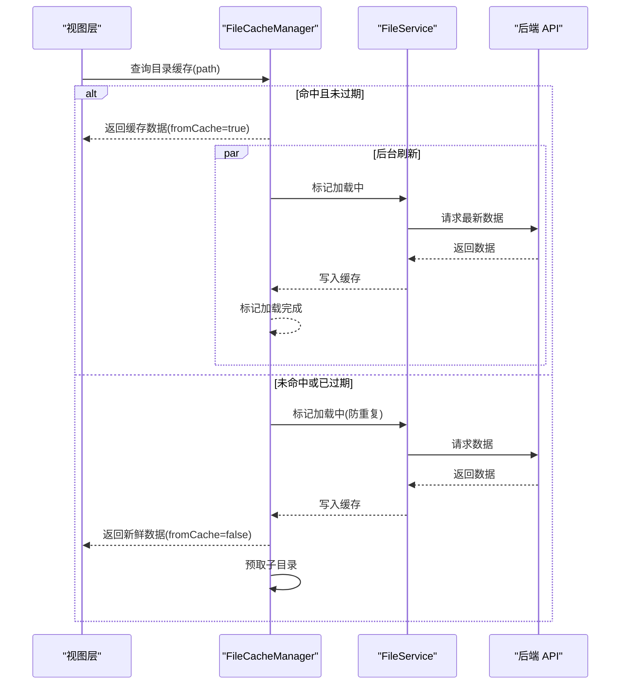
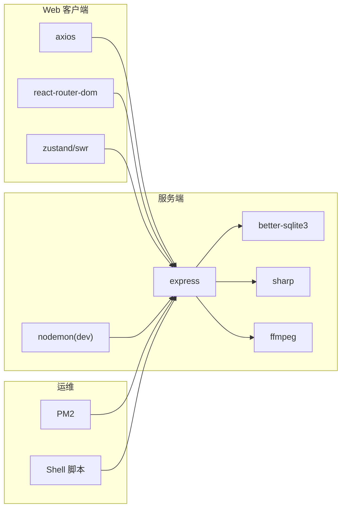
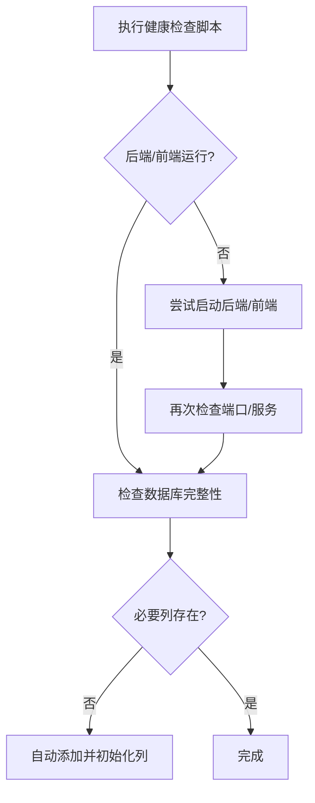

# 性能监控

<cite>
**本文引用的文件**   
- [Longhorn.md](file://Longhorn.md)
- [server/index.js](file://server/index.js)
- [client/package.json](file://client/package.json)
- [server/package.json](file://server/package.json)
- [scripts/diagnose-performance.sh](file://scripts/diagnose-performance.sh)
- [scripts/health-check.sh](file://scripts/health-check.sh)
- [scripts/ecosystem.config.js](file://scripts/ecosystem.config.js)
- [docs/OPS.md](file://docs/OPS.md)
- [client/src/App.tsx](file://client/src/App.tsx)
- [ios/LonghornApp/Services/FileCacheManager.swift](file://ios/LonghornApp/Services/FileCacheManager.swift)
- [ios/LonghornApp/Services/ImageCacheService.swift](file://ios/LonghornApp/Services/ImageCacheService.swift)
- [scripts/db-validate.sh](file://scripts/db-validate.sh)
</cite>

## 目录
1. [简介](#简介)
2. [项目结构](#项目结构)
3. [核心组件](#核心组件)
4. [架构总览](#架构总览)
5. [详细组件分析](#详细组件分析)
6. [依赖关系分析](#依赖关系分析)
7. [性能考量](#性能考量)
8. [故障排查指南](#故障排查指南)
9. [结论](#结论)
10. [附录](#附录)

## 简介
本文件为 Longhorn 性能监控系统的技术文档，聚焦于应用性能监控指标（响应时间、吞吐量、资源利用率）、日志与错误追踪、性能分析工具、缓存优化、数据库查询优化、静态资源优化、负载均衡与集群部署、高可用设计、性能基准与压力测试、容量规划、监控告警机制、故障诊断与调优指南，以及生产环境最佳实践与运维自动化。

Longhorn 由三部分组成：Web 客户端（React）、iOS 客户端（SwiftUI）与 Node.js + SQLite 服务端。系统通过 HTTP/REST 与 WebSocket 提供统一 API，并结合本地磁盘存储与缩略图缓存、静态资源缓存等手段提升性能与用户体验。

章节来源
- file://Longhorn.md#L1-L71

## 项目结构
- 服务端（Node.js + better-sqlite3 + Express）负责认证、权限控制、文件浏览、上传下载、缩略图生成与缓存、静态资源服务、健康检查与状态接口。
- Web 客户端（React + Vite）负责路由、国际化、状态管理、组件化界面与 API 调用。
- iOS 客户端（SwiftUI）负责目录缓存（stale-while-revalidate）、图片内存缓存、预取与并发控制。
- 运维脚本（Shell + PM2）负责健康检查、性能诊断、数据库校验、进程管理与日志聚合。

图表来源
- [Longhorn.md](file://Longhorn.md#L47-L66)
- [server/index.js](file://server/index.js#L1-L800)
- [scripts/ecosystem.config.js](file://scripts/ecosystem.config.js#L1-L41)

章节来源
- file://Longhorn.md#L1-L71
- file://server/index.js#L1-L800
- file://scripts/ecosystem.config.js#L1-L41

## 核心组件
- 服务端中间件与全局日志：启用压缩、CORS、JSON 解析与全局 HTTP 请求日志，便于性能观测与排障。
- 缩略图服务：支持图片与视频（含 HEIC/HEIF）缩略图生成，内置并发队列与缓存，降低 CPU/IO 压力。
- 静态资源服务：针对预览路径设置缓存头、ETag、Last-Modified 与 Range 支持，优化首屏与拖拽体验。
- 权限与路径解析：对中文部门名与编码进行规范化处理，减少路径解析错误导致的额外 IO。
- 健康检查与状态接口：提供 /api/status 与 /api/debug/info，便于自动化巡检与远程诊断。
- 进程管理与日志：PM2 配置支持集群模式、优雅重启、内存限制、合并日志与忽略目录，保障稳定性与可观测性。

章节来源
- file://server/index.js#L418-L479
- file://server/index.js#L481-L679
- file://server/index.js#L417-L427
- file://server/index.js#L758-L790
- file://scripts/ecosystem.config.js#L1-L41

## 架构总览
下图展示客户端、服务端与基础设施之间的交互关系，以及关键性能优化点（缓存、压缩、范围请求、集群与隧道）。

图表来源
- [Longhorn.md](file://Longhorn.md#L47-L66)
- [server/index.js](file://server/index.js#L417-L427)
- [server/index.js](file://server/index.js#L481-L679)
- [scripts/ecosystem.config.js](file://scripts/ecosystem.config.js#L1-L41)

## 详细组件分析

### 服务端性能组件：缩略图与静态资源
- 缩略图服务
  - 并发队列：限制同时生成的缩略图数量，避免 CPU/IO 过载。
  - 缓存策略：命中缓存直接返回；缓存校验基于 mtime 与大小；原子写入缓存文件。
  - 多格式支持：图片使用 sharp，视频/HEIC 使用 ffmpeg 或 macOS sips。
  - 错误日志：生成失败写入专用日志文件，便于定位。
- 静态资源服务
  - 预览路径设置明确 Content-Type，启用 ETag、Last-Modified、Cache-Control 与 Range 请求，提升浏览器缓存命中率与拖拽体验。

图表来源
- [server/index.js](file://server/index.js#L481-L679)

章节来源
- file://server/index.js#L481-L679

### 客户端缓存组件：iOS 目录与图片缓存
- 目录缓存（stale-while-revalidate）
  - 缓存结构包含时间戳与路径，区分“过期”（30 分钟）与“陈旧”（5 分钟）。
  - 需要刷新时后台异步刷新，前台仍可返回陈旧数据，保证流畅体验。
  - 预取策略：对前若干子目录进行预取，降低后续访问延迟。
- 图片内存缓存
  - 基于 NSCache，限制对象数量与总成本，避免内存峰值。

图表来源
- [ios/LonghornApp/Services/FileCacheManager.swift](file://ios/LonghornApp/Services/FileCacheManager.swift#L1-L185)

章节来源
- file://ios/LonghornApp/Services/FileCacheManager.swift#L1-L185
- file://ios/LonghornApp/Services/ImageCacheService.swift#L1-L37

### Web 客户端性能与监控入口
- 路由与国际化：通过 React Router 管理页面跳转，减少不必要的重渲染。
- 全局日志中间件：服务端记录每次请求方法、URL 与客户端 IP，便于审计与性能分析。
- 健康检查与调试接口：/api/status 与 /api/debug/info 便于自动化巡检与远程诊断。

章节来源
- file://client/src/App.tsx#L1-L635
- file://server/index.js#L418-L479
- file://server/index.js#L758-L790

## 依赖关系分析
- 服务端依赖
  - Express：HTTP 服务与中间件栈（压缩、CORS、JSON、静态资源）。
  - better-sqlite3：高性能 SQLite 访问，WAL 模式提升并发。
  - sharp/ffmpeg：图像与视频处理。
  - nodemon（开发）：热重载。
- 客户端依赖
  - axios：HTTP 客户端。
  - react-router-dom：路由。
  - zustand/swr：状态管理与数据缓存策略。
- 运维依赖
  - PM2：进程管理、集群、日志与自动重启。
  - Shell 脚本：健康检查、性能诊断、数据库校验。

图表来源
- [client/package.json](file://client/package.json#L1-L45)
- [server/package.json](file://server/package.json#L1-L30)
- [scripts/ecosystem.config.js](file://scripts/ecosystem.config.js#L1-L41)

章节来源
- file://client/package.json#L1-L45
- file://server/package.json#L1-L30
- file://scripts/ecosystem.config.js#L1-L41

## 性能考量
- 响应时间
  - 缩略图缓存与并发队列显著降低首次生成延迟；静态资源 Range 支持提升拖拽与分段加载体验。
  - 全局日志中间件可辅助识别慢请求与异常路径。
- 吞吐量
  - PM2 集群模式按 CPU 核心数扩展实例，提升并发处理能力；优雅重启与超时配置避免抖动。
  - 压缩中间件减少传输体积。
- 资源利用率
  - 服务端 WAL 模式与并发队列控制 CPU/IO；客户端目录缓存与图片内存缓存降低网络与解码开销。
  - 进程内存上限与自动重启避免内存泄漏导致的资源耗尽。

章节来源
- file://server/index.js#L418-L479
- file://server/index.js#L481-L679
- file://scripts/ecosystem.config.js#L1-L41

## 故障排查指南
- 健康检查
  - 检查端口占用、数据库完整性、必要列是否存在；缺失列自动补全并初始化。
- 性能诊断
  - 收集 PM2 状态、本地 API 响应时间、数据库大小与统计、图片文件分布、Cloudflare Tunnel 状态与日志、系统资源使用、Node/npm 版本。
- 数据库校验
  - 自动验证表结构与列，缺失列自动修复并初始化默认值。
- 日志与监控
  - PM2 日志文件分离输出与错误日志；服务端全局 HTTP 日志；缩略图生成错误日志。

图表来源
- [scripts/health-check.sh](file://scripts/health-check.sh#L1-L115)
- [scripts/db-validate.sh](file://scripts/db-validate.sh#L1-L52)

章节来源
- file://scripts/health-check.sh#L1-L115
- file://scripts/diagnose-performance.sh#L1-L122
- file://scripts/db-validate.sh#L1-L52

## 结论
Longhorn 在服务端通过缓存、并发控制、静态资源优化与进程管理实现稳定高效的性能表现；在客户端通过目录缓存与图片内存缓存提升交互流畅度。运维脚本与 PM2 配置提供了完善的健康检查、自动修复与日志聚合能力。建议在生产环境中结合监控告警、容量规划与定期压测持续优化。

## 附录

### 监控与告警机制建议
- 指标采集
  - 服务端：/api/status 健康状态、缩略图生成耗时、静态资源命中率、数据库查询耗时、进程内存/CPU 使用率。
  - 客户端：页面首屏时间、目录加载时间、图片缓存命中率、预取命中率。
- 告警阈值
  - 响应时间：/api/status 超过阈值；缩略图生成失败率上升。
  - 资源：进程内存超过上限触发重启；磁盘空间低于阈值告警。
- 工具链
  - 服务端：PM2 日志 + 自定义健康检查接口；Prometheus/Grafana（建议）。
  - 客户端：埋点上报（建议）。

### 负载均衡与高可用
- 集群部署
  - PM2 cluster 模式按 CPU 核心数扩展实例，结合优雅重启与超时配置。
- 高可用
  - Cloudflare Tunnel 提供公网访问与 TLS 终结；断电自动开机与 PM2 自启动保障服务恢复。
- 数据备份
  - rsync 自动备份策略与数据库文件备份。

章节来源
- file://scripts/ecosystem.config.js#L1-L41
- file://docs/OPS.md#L100-L171

### 性能基准与压力测试
- 基准测试
  - 使用 curl 对 /api/status 进行本地响应时间测试；对比不同缓存命中场景。
- 压力测试
  - 并发缩略图生成（多格式）与静态资源 Range 请求；观察 CPU/IO 与内存变化。
- 容量规划
  - 基于缩略图缓存大小、静态资源缓存与数据库增长趋势评估磁盘与内存需求。

章节来源
- file://scripts/diagnose-performance.sh#L25-L30
- file://server/index.js#L481-L679

### 生产环境最佳实践与运维自动化
- 自动化
  - 哨兵脚本定时拉取代码、自动构建与重启；PM2 自启动与日志轮转。
- 安全与合规
  - JWT 认证与权限控制；最小权限原则；定期审计日志。
- 可观测性
  - 全局 HTTP 日志、缩略图错误日志、PM2 日志与健康检查接口。

章节来源
- file://docs/OPS.md#L1-L171
- file://server/index.js#L418-L479
- file://scripts/ecosystem.config.js#L1-L41