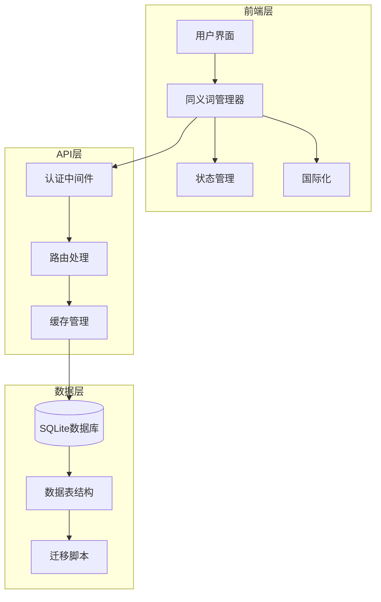
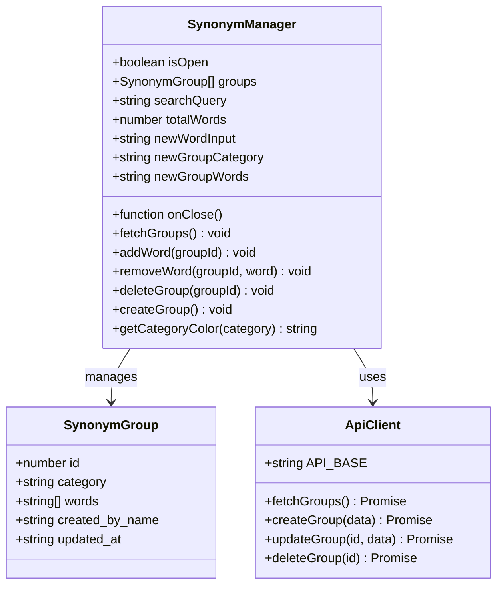
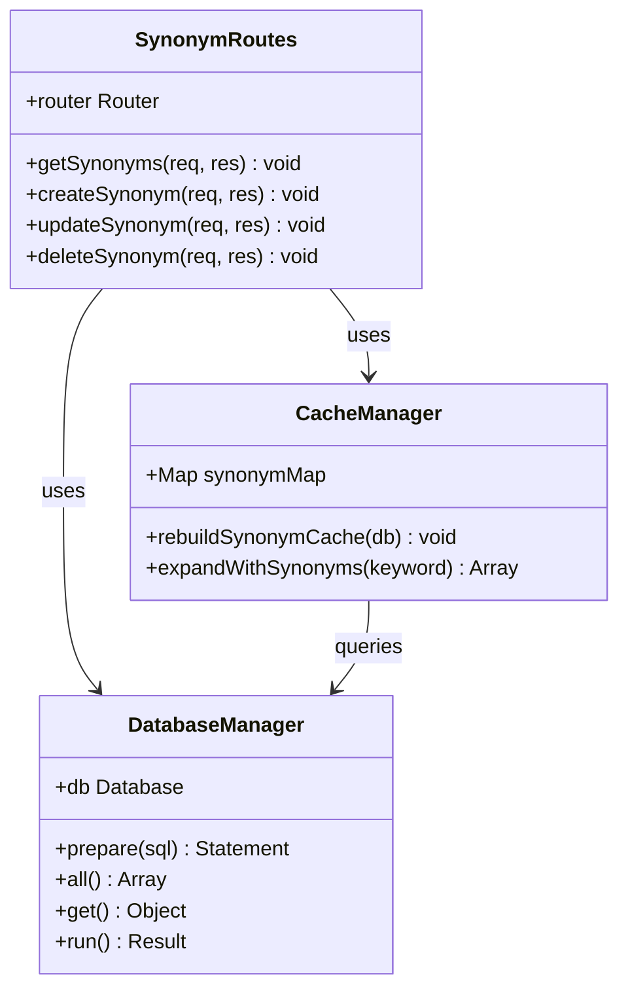
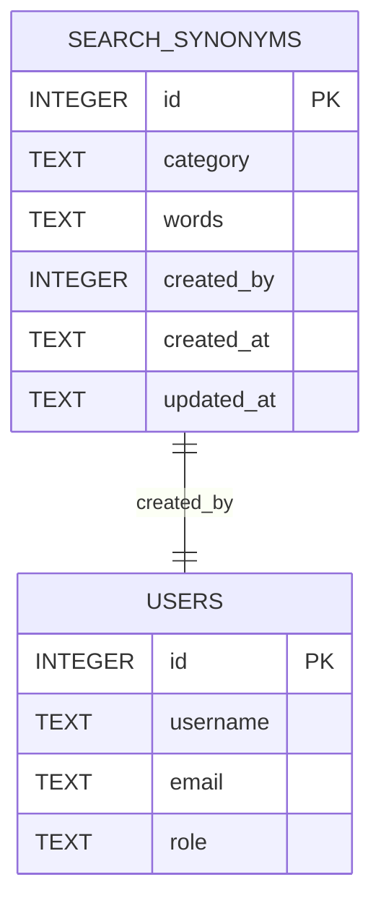
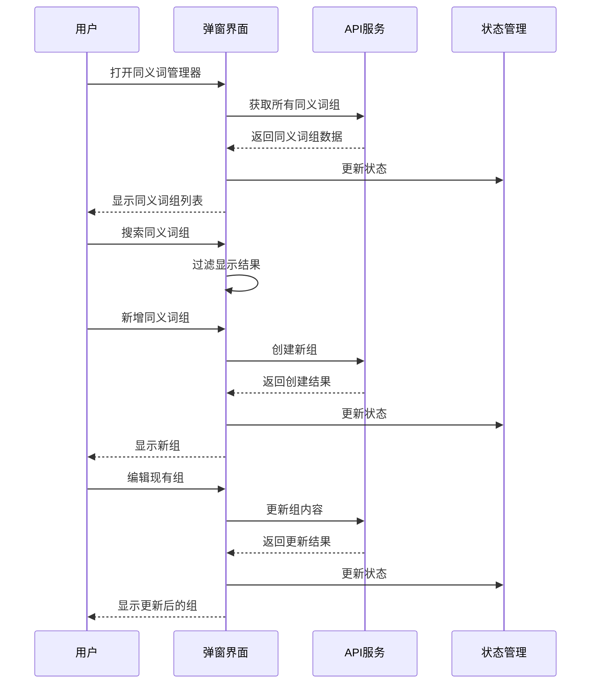
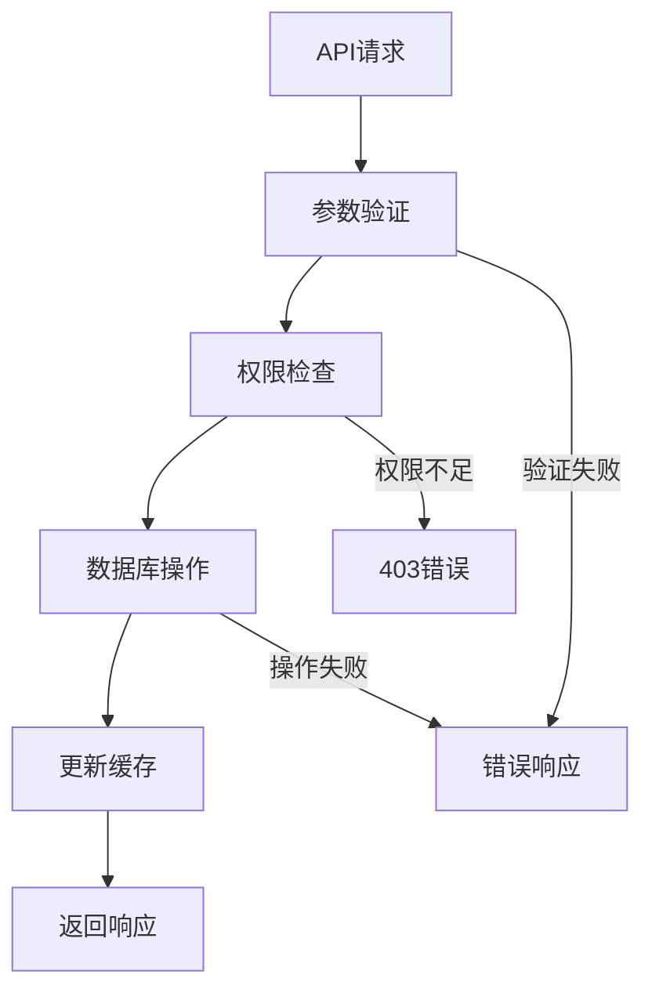
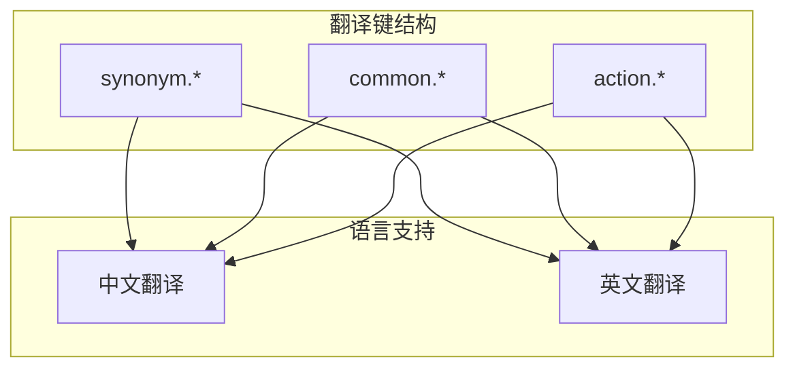

# 同义词管理系统

<cite>
**本文档引用的文件**
- [SynonymManager.tsx](file://client/src/components/Knowledge/SynonymManager.tsx)
- [synonyms.js](file://server/service/routes/synonyms.js)
- [018_search_synonyms.sql](file://server/service/migrations/018_search_synonyms.sql)
- [translations.ts](file://client/src/i18n/translations.ts)
- [useWikiStore.ts](file://client/src/store/useWikiStore.ts)
- [zh.json](file://server/data/vocab/zh.json)
</cite>

## 目录
1. [项目概述](#项目概述)
2. [系统架构](#系统架构)
3. [核心组件分析](#核心组件分析)
4. [数据库设计](#数据库设计)
5. [前端界面实现](#前端界面实现)
6. [后端API设计](#后端api设计)
7. [缓存机制](#缓存机制)
8. [国际化支持](#国际化支持)
9. [性能优化](#性能优化)
10. [故障排除指南](#故障排除指南)
11. [总结](#总结)

## 项目概述

同义词管理系统是一个基于React和Node.js构建的知识库增强工具，旨在提升Longhorn文件管理系统的搜索体验。该系统通过维护同义词词典，为知识库搜索提供智能扩展功能，使用户能够通过不同的表达方式找到相关内容。

系统采用前后端分离架构，前端使用TypeScript和React构建现代化的用户界面，后端基于Express.js提供RESTful API服务。核心功能包括同义词组的创建、编辑、删除和搜索，以及实时的缓存同步机制。

## 系统架构



**图表来源**
- [SynonymManager.tsx](file://client/src/components/Knowledge/SynonymManager.tsx#L1-L505)
- [synonyms.js](file://server/service/routes/synonyms.js#L1-L234)
- [018_search_synonyms.sql](file://server/service/migrations/018_search_synonyms.sql#L1-L66)

## 核心组件分析

### 前端组件架构



**图表来源**
- [SynonymManager.tsx](file://client/src/components/Knowledge/SynonymManager.tsx#L6-L17)
- [SynonymManager.tsx](file://client/src/components/Knowledge/SynonymManager.tsx#L39-L505)

### 后端服务架构



**图表来源**
- [synonyms.js](file://server/service/routes/synonyms.js#L8-L192)
- [synonyms.js](file://server/service/routes/synonyms.js#L198-L233)

**章节来源**
- [SynonymManager.tsx](file://client/src/components/Knowledge/SynonymManager.tsx#L1-L505)
- [synonyms.js](file://server/service/routes/synonyms.js#L1-L234)

## 数据库设计

### 数据表结构

同义词系统的核心数据表为`search_synonyms`，采用JSON格式存储同义词数组，提供了灵活的数据结构和高效的查询能力。



**图表来源**
- [018_search_synonyms.sql](file://server/service/migrations/018_search_synonyms.sql#L5-L12)

### 种子数据

系统包含50组电影摄影机行业的专业术语作为种子数据，覆盖音频、色彩、接口、存储、镜头等多个技术领域：

- **音频相关**: 音频、声音、音量、音效、音声
- **色彩处理**: 色偏、白平衡、LUT、色彩查找表、调色
- **存储介质**: 存储、存储卡、CFast、SSD、硬盘
- **连接接口**: 连接、接口、端口、插口、HDMI、SDI
- **镜头系统**: 镜头、光学、卡口、镜组、对焦、聚焦
- **电源管理**: 电池、供电、电源、充电、电量
- **固件更新**: 固件、系统、软件、升级、更新

**章节来源**
- [018_search_synonyms.sql](file://server/service/migrations/018_search_synonyms.sql#L1-L66)

## 前端界面实现

### 用户交互流程



**图表来源**
- [SynonymManager.tsx](file://client/src/components/Knowledge/SynonymManager.tsx#L56-L185)

### 界面特色功能

1. **分类颜色系统**: 不同分类使用不同颜色标识，便于快速识别
2. **实时搜索**: 支持按分类名和词条内容的即时搜索
3. **批量操作**: 支持同义词组的创建、编辑、删除
4. **响应式设计**: 适配不同屏幕尺寸的设备
5. **国际化支持**: 支持中英文双语界面

**章节来源**
- [SynonymManager.tsx](file://client/src/components/Knowledge/SynonymManager.tsx#L19-L505)

## 后端API设计

### RESTful API规范

系统提供完整的CRUD操作接口，支持管理员和主管级别的权限控制：

| 方法 | 路径 | 权限要求 | 功能描述 |
|------|------|----------|----------|
| GET | `/api/v1/synonyms` | 已认证用户 | 获取所有同义词组 |
| POST | `/api/v1/synonyms` | Admin/Lead | 创建新的同义词组 |
| PUT | `/api/v1/synonyms/:id` | Admin/Lead | 更新指定同义词组 |
| DELETE | `/api/v1/synonyms/:id` | Admin/Lead | 删除指定同义词组 |

### API响应格式



**图表来源**
- [synonyms.js](file://server/service/routes/synonyms.js#L55-L92)
- [synonyms.js](file://server/service/routes/synonyms.js#L98-L152)

**章节来源**
- [synonyms.js](file://server/service/routes/synonyms.js#L11-L192)

## 缓存机制

### 内存缓存设计

系统采用内存Map结构存储同义词缓存，确保查询性能和实时性：

```mermaid
graph LR
subgraph "数据库层"
DB[(SQLite)]
end
subgraph "缓存层"
Cache[Map缓存]
Key[word.toLowerCase()]
Value[Set<words>]
end
subgraph "查询层"
Query[expandWithSynonyms]
Result[Array<synonyms>]
end
DB --> Cache
Cache --> Query
Query --> Result
Key --> Value
Value --> Result
```

**图表来源**
- [synonyms.js](file://server/service/routes/synonyms.js#L198-L233)

### 缓存重建策略

每次数据库操作后自动重建缓存，确保数据一致性：

1. **触发时机**: 创建、更新、删除操作完成后
2. **重建过程**: 从数据库读取所有同义词组，重新构建Map结构
3. **性能考虑**: 使用Set去重，避免重复词条
4. **内存管理**: 及时更新全局synonymMap变量

**章节来源**
- [synonyms.js](file://server/service/routes/synonyms.js#L200-L218)

## 国际化支持

### 多语言翻译键

系统提供中英文双语支持，翻译键采用模块化组织：



**图表来源**
- [translations.ts](file://client/src/i18n/translations.ts#L1575-L1587)
- [translations.ts](file://client/src/i18n/translations.ts#L3023-L3034)

### 翻译键定义

| 翻译键 | 中文含义 | 英文含义 |
|--------|----------|----------|
| `synonym.title` | 同义词字典 | Synonym Dictionary |
| `synonym.stats` | 共 {groups} 组 · {words} 个词条 | {groups} groups · {words} words |
| `synonym.search_placeholder` | 搜索词条... | Search words... |
| `synonym.add_group` | 新增同义词组 | Add Synonym Group |
| `synonym.confirm_delete` | 确定删除「{category}」同义词组？ | Delete synonym group "{category}"? |

**章节来源**
- [translations.ts](file://client/src/i18n/translations.ts#L1575-L1587)
- [translations.ts](file://client/src/i18n/translations.ts#L3023-L3034)

## 性能优化

### 查询优化策略

1. **索引设计**: 在`category`字段上建立索引，提升搜索性能
2. **缓存命中**: 内存Map缓存确保O(1)查询复杂度
3. **批量操作**: 支持批量创建和更新，减少API调用次数
4. **懒加载**: 仅在需要时加载同义词数据

### 内存管理

- **缓存清理**: 定期重建缓存，避免内存泄漏
- **数据压缩**: JSON序列化存储，节省磁盘空间
- **增量更新**: 仅在数据变更时更新缓存

## 故障排除指南

### 常见问题及解决方案

| 问题类型 | 症状描述 | 解决方案 |
|----------|----------|----------|
| 权限错误 | 403 Forbidden错误 | 确认用户角色为Admin或Lead |
| 数据验证 | 400 Bad Request错误 | 检查分类名和同义词数量（至少2个） |
| 缓存失效 | 查询结果不准确 | 重启服务或手动触发缓存重建 |
| 网络错误 | API请求超时 | 检查网络连接和服务器状态 |

### 调试方法

1. **前端调试**: 使用浏览器开发者工具检查API响应
2. **后端日志**: 查看服务器控制台输出的错误信息
3. **数据库检查**: 直接查询`search_synonyms`表验证数据完整性
4. **缓存验证**: 检查`synonymMap`变量的内容和大小

**章节来源**
- [synonyms.js](file://server/service/routes/synonyms.js#L57-L62)
- [synonyms.js](file://server/service/routes/synonyms.js#L118-L123)

## 总结

同义词管理系统通过精心设计的架构和实现，为Longhorn文件管理系统的知识库搜索提供了强大的智能扩展功能。系统的主要优势包括：

1. **完整的功能覆盖**: 支持同义词组的全生命周期管理
2. **高性能设计**: 内存缓存机制确保快速查询响应
3. **用户体验优秀**: 直观的界面设计和流畅的操作体验
4. **可扩展性强**: 模块化的架构便于功能扩展和维护
5. **国际化支持**: 完善的多语言支持满足全球化需求

该系统不仅提升了搜索准确性，还为未来的AI增强功能奠定了坚实基础，是Longhorn生态系统中不可或缺的重要组成部分。