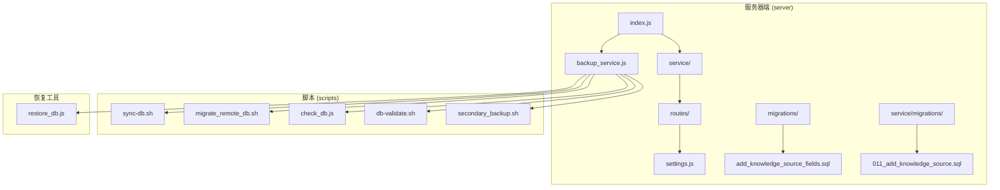
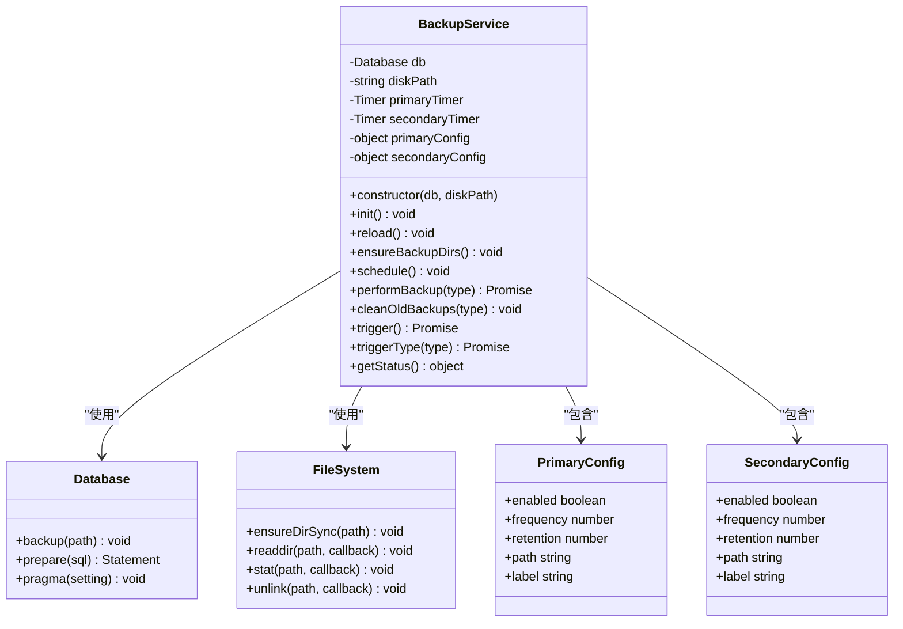
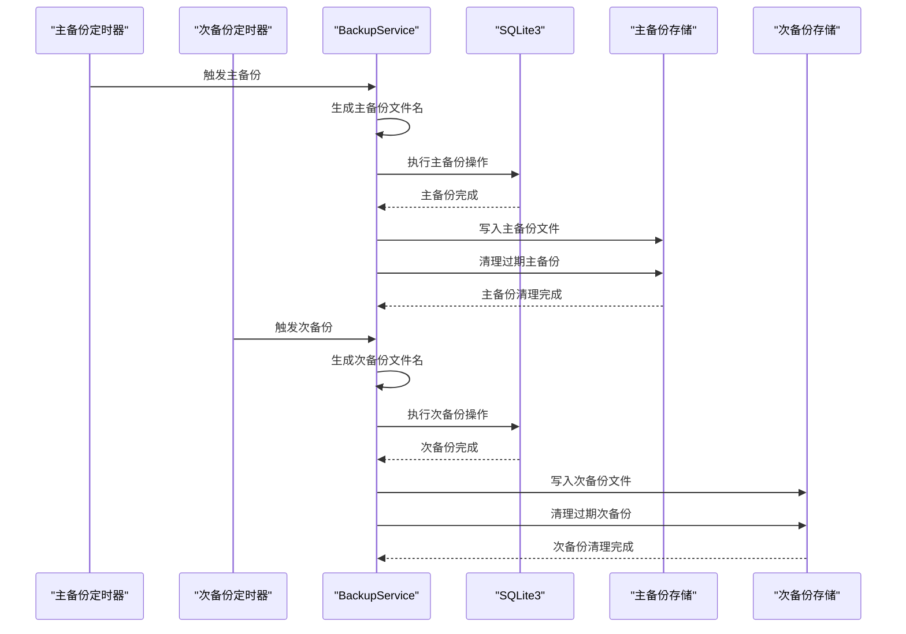
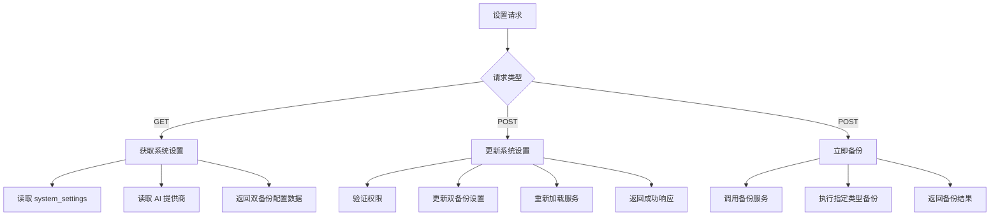
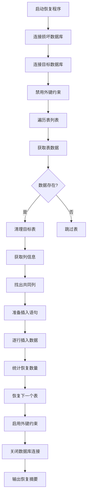
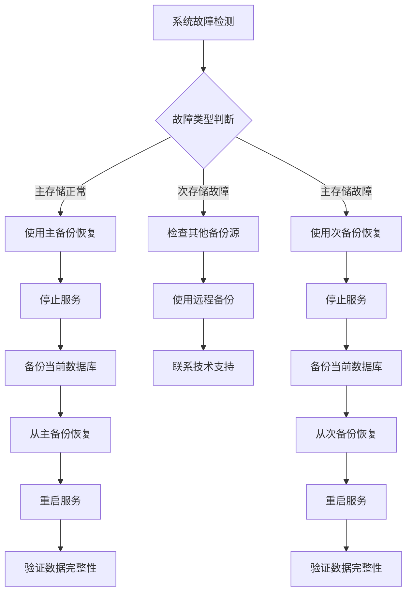
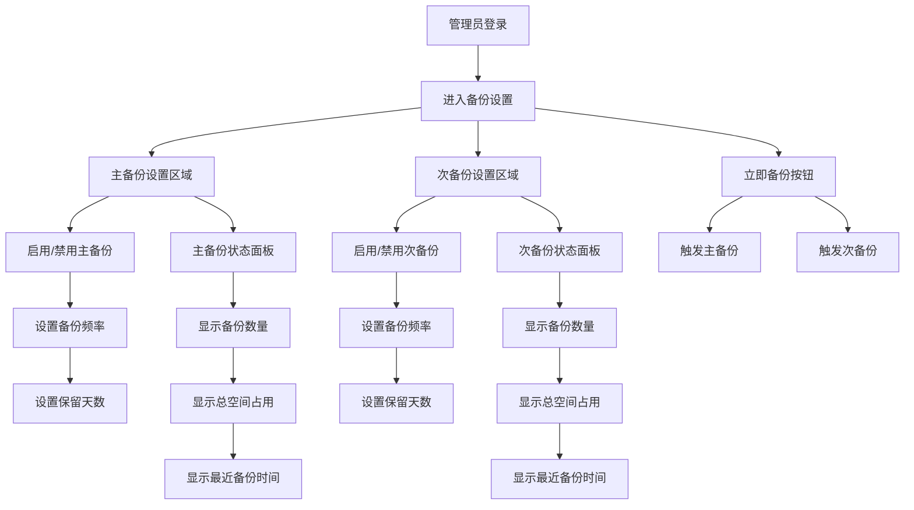
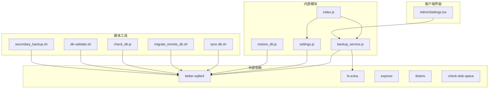

# 数据库备份系统

<cite>
**本文档中引用的文件**
- [backup_service.js](file://server/service/backup_service.js)
- [index.js](file://server/index.js)
- [settings.js](file://server/service/routes/settings.js)
- [sync-db.sh](file://scripts/sync-db.sh)
- [migrate_remote_db.sh](file://scripts/migrate_remote_db.sh)
- [check_db.js](file://scripts/check_db.js)
- [restore_db.js](file://server/restore_db.js)
- [package.json](file://server/package.json)
- [server README.md](file://server/README.md)
- [scripts README.md](file://scripts/README.md)
- [add_knowledge_source_fields.sql](file://server/migrations/add_knowledge_source_fields.sql)
- [011_add_knowledge_source.sql](file://server/service/migrations/011_add_knowledge_source.sql)
- [secondary_backup.sh](file://scripts/secondary_backup.sh)
- [AdminSettings.tsx](file://client/src/components/Admin/AdminSettings.tsx)
- [OPS.md](file://docs/OPS.md)
</cite>

## 更新摘要
**所做更改**
- 更新了备份架构以反映双备份系统升级
- 新增了主备份和次备份的详细配置说明
- 更新了备份策略和存储位置信息
- 增加了双备份系统的灾难恢复能力说明
- 更新了相关的API接口和配置参数

## 目录
1. [简介](#简介)
2. [项目结构](#项目结构)
3. [核心组件](#核心组件)
4. [架构概览](#架构概览)
5. [详细组件分析](#详细组件分析)
6. [双备份系统详解](#双备份系统详解)
7. [依赖关系分析](#依赖关系分析)
8. [性能考虑](#性能考虑)
9. [故障排除指南](#故障排除指南)
10. [结论](#结论)

## 简介

Longhorn 数据库备份系统是一个基于 Node.js 和 SQLite3 的自动化数据库备份解决方案。该系统现已升级为双备份架构，提供主备份（文件服务器SSD）和次备份（本地存储）的双重备份策略，显著增强了灾难恢复能力和数据安全保障。

系统采用模块化设计，包含独立的备份服务类、配置管理、调度机制和恢复工具。通过集成的设置界面，管理员可以轻松配置双备份参数并监控备份状态。新的双备份架构确保了即使在主存储设备故障的情况下，数据仍然可以通过次备份进行恢复。

## 项目结构

Longhorn 项目的数据库备份系统主要分布在以下目录结构中：



**图表来源**
- [index.js](file://server/index.js#L1-L80)
- [backup_service.js](file://server/service/backup_service.js#L1-L126)

**章节来源**
- [server README.md](file://server/README.md#L1-L32)
- [scripts README.md](file://scripts/README.md#L1-L32)

## 核心组件

数据库备份系统由以下核心组件构成：

### BackupService 类
主备份服务类，负责数据库备份的完整生命周期管理。现已升级为支持双备份架构，包含主备份和次备份的独立配置和调度。

### 配置管理
通过 system_settings 表管理双备份配置参数，包括主备份和次备份的启用状态、频率和保留策略。

### 调度器
基于 Node.js setInterval 实现的双备份调度，分别管理主备份和次备份的定时执行。

### 恢复工具
提供数据库恢复和验证功能，支持从主备份和次备份进行数据恢复。

**章节来源**
- [backup_service.js](file://server/service/backup_service.js#L4-L126)
- [index.js](file://server/index.js#L29-L63)

## 架构概览

系统采用分层架构设计，实现了清晰的关注点分离，并支持双备份策略：

```mermaid
graph TB
subgraph "应用层"
A[Express 应用]
B[设置路由]
C[备份状态接口]
end
subgraph "服务层"
D[BackupService]
E[AI 服务]
F[文件服务]
end
subgraph "数据层"
G[SQLite3 数据库]
H[文件系统]
I[主备份存储 (fileserver SSD)]
J[次备份存储 (本地系统盘)]
end
subgraph "工具层"
K[备份脚本]
L[恢复工具]
M[验证脚本]
N[次级备份脚本]
end
A --> B
A --> C
A --> D
B --> D
C --> D
D --> G
D --> I
D --> J
D --> K
D --> N
L --> G
M --> G
H --> I
H --> J
```

**图表来源**
- [index.js](file://server/index.js#L1-L80)
- [backup_service.js](file://server/service/backup_service.js#L1-L126)

## 详细组件分析

### BackupService 类分析

BackupService 是整个备份系统的核心组件，采用了面向对象的设计模式，并已升级为支持双备份架构：



**图表来源**
- [backup_service.js](file://server/service/backup_service.js#L4-L126)

#### 双备份配置管理机制

备份服务支持动态双备份配置管理，配置参数存储在 system_settings 表中：

| 配置参数 | 默认值 | 描述 | 备注 |
|---------|--------|------|------|
| backup_enabled | true | 是否启用主备份功能 | 主备份（fileserver SSD） |
| backup_frequency | 1440 | 主备份频率（分钟），默认24小时 | SSD存储，频繁备份 |
| backup_retention_days | 7 | 主备份保留天数，默认7天 | 快速恢复需求 |
| secondary_backup_enabled | true | 是否启用次备份功能 | 次备份（本地系统盘） |
| secondary_backup_frequency | 4320 | 次备份频率（分钟），默认72小时 | 本地存储，低频备份 |
| secondary_backup_retention_days | 30 | 次备份保留天数，默认30天 | 长期安全保障 |

#### 备份执行流程



**图表来源**
- [backup_service.js](file://server/service/backup_service.js#L81-L103)

**章节来源**
- [backup_service.js](file://server/service/backup_service.js#L1-L126)

### 设置管理路由分析

设置路由提供了完整的双备份配置管理接口：



**图表来源**
- [settings.js](file://server/service/routes/settings.js#L20-L160)

**章节来源**
- [settings.js](file://server/service/routes/settings.js#L1-L200)

### 数据库恢复工具分析

恢复工具提供了完整的数据库恢复功能，支持从主备份和次备份进行恢复：



**图表来源**
- [restore_db.js](file://server/restore_db.js#L48-L96)

**章节来源**
- [restore_db.js](file://server/restore_db.js#L1-L105)

## 双备份系统详解

### 双备份架构升级

Longhorn 系统已从单一备份机制升级为双备份系统架构，提供主备份和次备份的双重保障：

#### 主备份（Primary Backup）
- **存储位置**: `/Volumes/fileserver/System/Backups/db/`
- **存储介质**: 文件服务器SSD
- **备份频率**: 每24小时（1440分钟）
- **保留策略**: 7天
- **用途**: 日常快速恢复，数据最新
- **特点**: 高频备份，快速恢复，但容量有限

#### 次备份（Secondary Backup）
- **存储位置**: `~/Documents/server/Longhorn/server/backups/secondary/`
- **存储介质**: 本地系统盘
- **备份频率**: 每72小时（4320分钟）
- **保留策略**: 30天
- **用途**: 灾难恢复，长期安全保障
- **特点**: 低频备份，长期保存，容量充足

### 备份策略对比

| 特性 | 主备份 | 次备份 |
|------|--------|--------|
| 存储位置 | 文件服务器SSD | 本地系统盘 |
| 频率 | 每24小时 | 每72小时 |
| 保留期 | 7天 | 30天 |
| 最新性 | 最新数据 | 相对较旧 |
| 恢复速度 | 快速 | 较慢 |
| 容量需求 | 中等 | 较大 |
| 成本 | 较高 | 较低 |

### 灾难恢复流程

双备份系统提供了完整的灾难恢复能力：



**图表来源**
- [OPS.md](file://docs/OPS.md#L365-L395)

### 双备份配置管理

双备份系统通过系统设置界面进行统一管理：



**图表来源**
- [AdminSettings.tsx](file://client/src/components/Admin/AdminSettings.tsx#L694-L1050)

**章节来源**
- [backup_service.js](file://server/service/backup_service.js#L11-L27)
- [settings.js](file://server/service/routes/settings.js#L87-L108)
- [AdminSettings.tsx](file://client/src/components/Admin/AdminSettings.tsx#L694-L1050)
- [OPS.md](file://docs/OPS.md#L249-L327)

## 依赖关系分析

系统依赖关系图展示了各组件之间的交互关系，包括双备份系统的新增组件：



**图表来源**
- [package.json](file://server/package.json#L15-L38)
- [index.js](file://server/index.js#L1-L15)

**章节来源**
- [package.json](file://server/package.json#L1-L40)

## 性能考虑

### 双备份性能优化

1. **差异化备份策略**: 主备份高频但小量，次备份低频但大量，平衡性能和容量
2. **异步操作**: 备份操作采用异步执行，不影响主应用性能
3. **内存管理**: 使用流式处理避免大文件内存占用
4. **存储分离**: 主备份和次备份使用不同存储介质，避免I/O竞争

### 存储优化

1. **智能清理策略**: 主备份7天，次备份30天，控制存储空间
2. **路径安全**: 限制备份路径到指定磁盘分区，防止路径遍历攻击
3. **存储监控**: 实时监控两个存储位置的空间使用情况
4. **压缩存储**: 备份文件直接存储为 SQLite3 数据库文件

### 并发处理

1. **双定时器管理**: 主备份和次备份分别独立调度，互不干扰
2. **互斥锁**: 备份过程中自动避免并发备份操作
3. **资源清理**: 及时释放数据库连接和文件句柄
4. **错误恢复**: 失败时自动清理临时文件，支持断点续传

## 故障排除指南

### 双备份系统故障排除

#### 主备份失败
**症状**: 主备份任务执行失败
**原因分析**:
- 文件服务器SSD空间不足
- 权限不足
- 数据库锁定
- 网络连接中断

**解决步骤**:
1. 检查文件服务器空间: `df -h /Volumes/fileserver`
2. 验证目录权限: `ls -la /Volumes/fileserver/System/Backups/db/`
3. 检查数据库状态: `.status` in sqlite3
4. 监控网络连接: `ping fileserver.local`

#### 次备份失败
**症状**: 次备份任务执行失败
**原因分析**:
- 本地系统盘空间不足
- 权限不足
- 数据库锁定
- 系统资源不足

**解决步骤**:
1. 检查本地磁盘空间: `df -h ~`
2. 验证目录权限: `ls -la ~/Documents/server/Longhorn/server/backups/secondary/`
3. 检查系统负载: `top` 或 `htop`
4. 清理临时文件: `rm -rf ~/Documents/server/Longhorn/server/backups/secondary/*.tmp`

#### 备份配置问题
**症状**: 双备份未按预期执行
**排查步骤**:
1. 检查配置表: `SELECT * FROM system_settings`
2. 验证定时器状态: 查看应用日志
3. 测试手动备份: `POST /api/admin/backup/now` 和 `POST /api/admin/backup/now/secondary`
4. 检查双备份状态: `GET /api/admin/backup/status`

#### 恢复失败
**症状**: 数据库恢复过程中出现错误
**解决方法**:
1. 检查源数据库完整性: `sqlite3 broken.db "PRAGMA integrity_check"`
2. 验证目标数据库权限
3. 清理损坏的恢复文件
4. 优先尝试主备份恢复，失败后再尝试次备份

### 监控和诊断

系统提供了多种监控和诊断工具，支持双备份系统的全面监控：

1. **健康检查**: `scripts/health-check.sh`
2. **性能诊断**: `scripts/diagnose-performance.sh`
3. **数据库验证**: `scripts/db-validate.sh`
4. **实时监控**: 应用日志输出
5. **双备份状态**: `GET /api/admin/backup/status`
6. **存储监控**: 实时监控两个存储位置的空间使用

**章节来源**
- [check_db.js](file://scripts/check_db.js#L1-L20)
- [db-validate.sh](file://scripts/db-validate.sh#L1-L52)
- [settings.js](file://server/service/routes/settings.js#L157-L167)

## 结论

Longhorn 数据库备份系统已成功升级为双备份架构，提供了一个更加完善、可靠的数据保护解决方案。系统的主要优势包括：

1. **双重安全保障**: 主备份和次备份提供两层数据保护
2. **差异化策略**: 主备份注重速度和最新性，次备份注重容量和长期性
3. **灾难恢复能力**: 即使主存储设备故障，仍可通过次备份进行恢复
4. **自动化程度高**: 支持定时备份和手动触发，配置灵活
5. **监控完善**: 提供双备份状态监控和存储使用情况跟踪
6. **易用性强**: 提供完整的恢复工具和验证脚本
7. **性能优秀**: 使用 SQLite3 原生备份功能，高效可靠

该双备份系统特别适合需要高可用性和数据安全保障的企业环境。通过合理的配置和定期维护，可以为企业提供可靠的数据库安全保障，确保在各种意外情况下都能快速恢复业务数据。

新的双备份架构显著提升了系统的容灾能力，为主备份和次备份的独立管理和监控提供了更好的用户体验，是Longhorn系统在数据保护方面的重要里程碑。