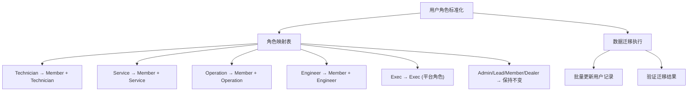
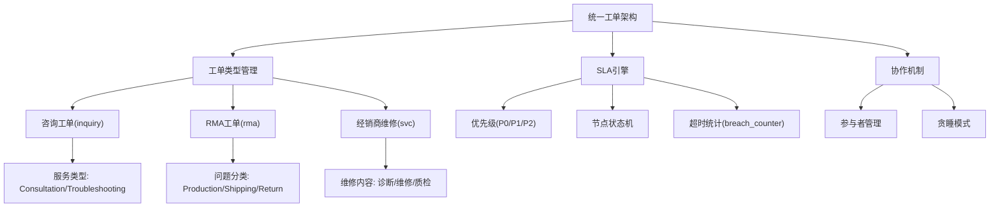
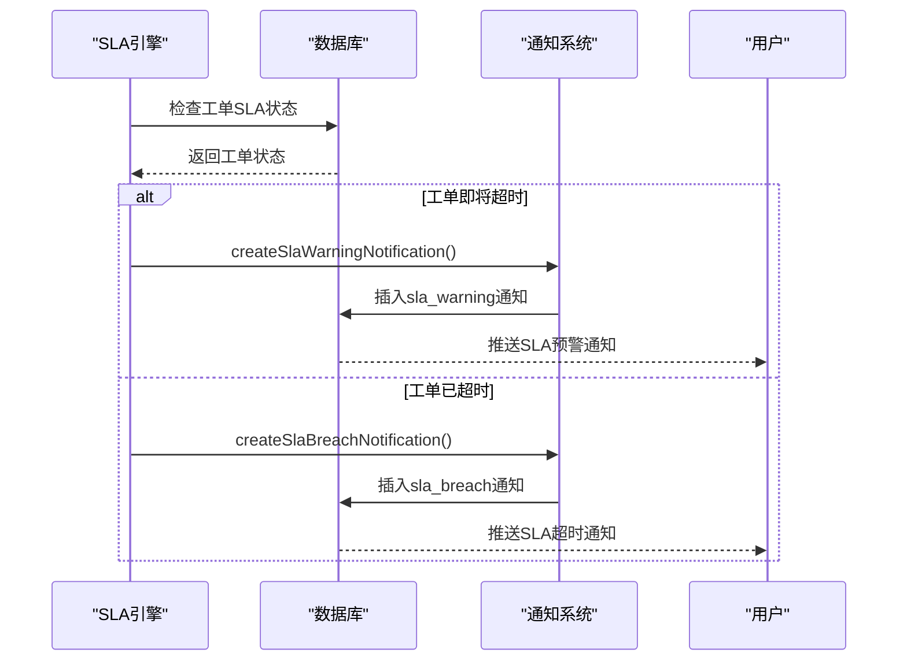
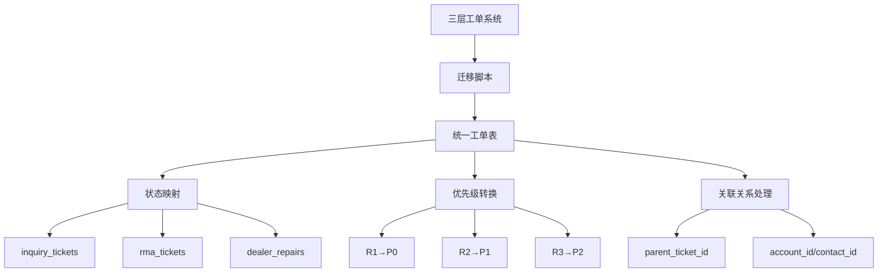
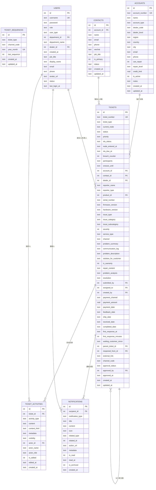
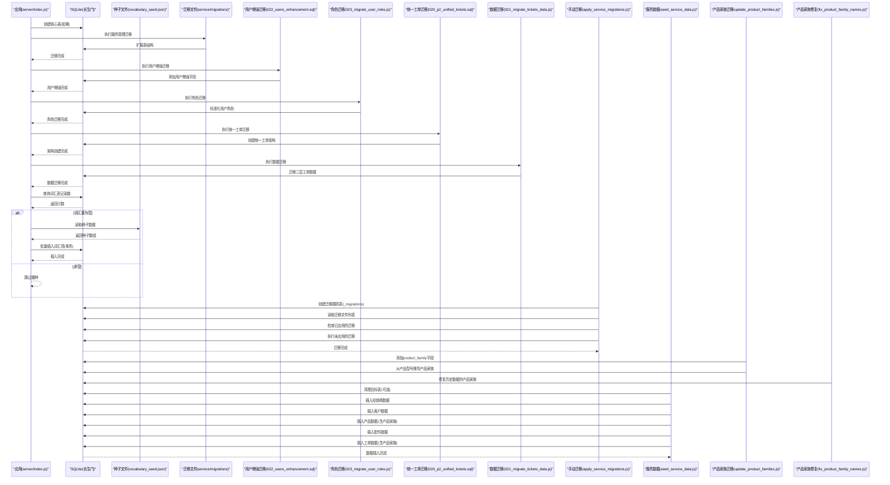
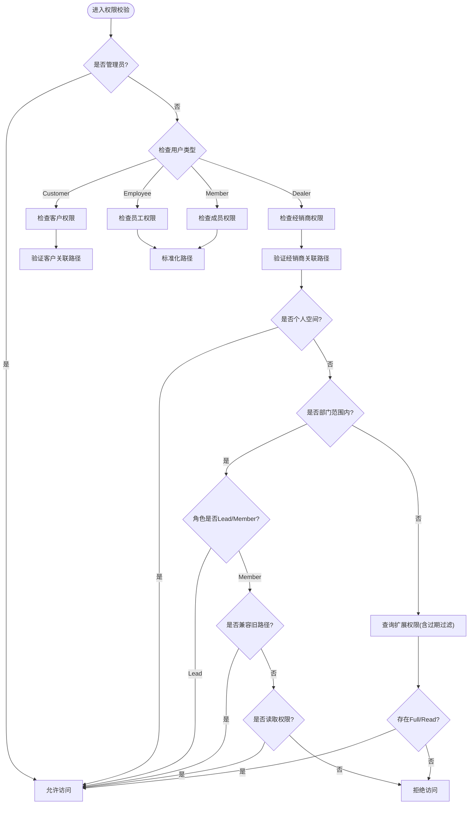
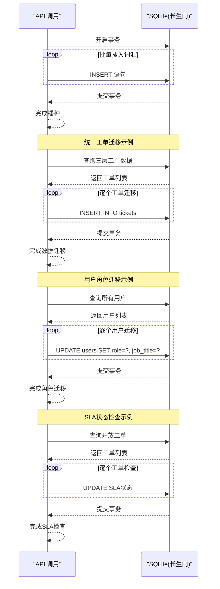
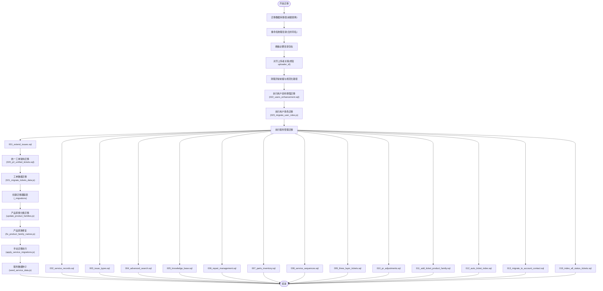
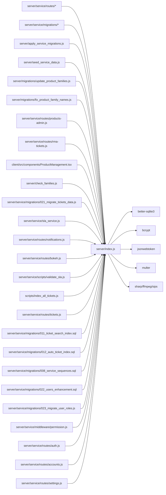

# 数据库管理

<cite>
**本文引用的文件**
- [server/index.js](file://server/index.js)
- [server/apply_service_migrations.js](file://server/apply_service_migrations.js)
- [server/seed_service_data.js](file://server/seed_service_data.js)
- [server/migrations/update_product_families.js](file://server/migrations/update_product_families.js)
- [server/migrations/fix_product_family_names.js](file://server/migrations/fix_product_family_names.js)
- [server/service/migrations/001_extend_issues.sql](file://server/service/migrations/001_extend_issues.sql)
- [server/service/migrations/002_service_records.sql](file://server/service/migrations/002_service_records.sql)
- [server/service/migrations/005_knowledge_base.sql](file://server/service/migrations/005_knowledge_base.sql)
- [server/service/migrations/006_repair_management.sql](file://server/service/migrations/006_repair_management.sql)
- [server/service/migrations/007_parts_inventory.sql](file://server/service/migrations/007_parts_inventory.sql)
- [server/service/migrations/009_three_layer_tickets.sql](file://server/service/migrations/009_three_layer_tickets.sql)
- [server/service/migrations/010_pr_adjustments.sql](file://server/service/migrations/010_pr_adjustments.sql)
- [server/service/migrations/011_add_ticket_product_family.sql](file://server/service/migrations/011_add_ticket_product_family.sql)
- [server/service/migrations/011_ticket_search_index.sql](file://server/service/migrations/011_ticket_search_index.sql)
- [server/service/migrations/012_auto_ticket_index.sql](file://server/service/migrations/012_auto_ticket_index.sql)
- [server/service/migrations/013_migrate_to_account_contact.sql](file://server/service/migrations/013_migrate_to_account_contact.sql)
- [server/service/migrations/019_index_all_status_tickets.sql](file://server/service/migrations/019_index_all_status_tickets.sql)
- [server/service/migrations/020_p2_unified_tickets.sql](file://server/service/migrations/020_p2_unified_tickets.sql)
- [server/service/migrations/021_migrate_tickets_data.js](file://server/service/migrations/021_migrate_tickets_data.js)
- [server/service/migrations/022_users_enhancement.sql](file://server/service/migrations/022_users_enhancement.sql)
- [server/service/migrations/023_migrate_user_roles.js](file://server/service/migrations/023_migrate_user_roles.js)
- [server/service/migrations/008_service_sequences.sql](file://server/service/migrations/008_service_sequences.sql)
- [server/service/routes/inquiry-tickets.js](file://server/service/routes/inquiry-tickets.js)
- [server/service/routes/service-records.js](file://server/service/routes/service-records.js)
- [server/service/routes/products-admin.js](file://server/service/routes/products-admin.js)
- [server/service/routes/rma-tickets.js](file://server/service/routes/rma-tickets.js)
- [server/service/routes/notifications.js](file://server/service/routes/notifications.js)
- [server/service/routes/bokeh.js](file://server/service/routes/bokeh.js)
- [server/service/routes/tickets.js](file://server/service/routes/tickets.js)
- [server/service/sla_service.js](file://server/service/sla_service.js)
- [server/service/scripts/validate_sla.js](file://server/service/scripts/validate_sla.js)
- [client/src/components/ProductManagement.tsx](file://client/src/components/ProductManagement.tsx)
- [server/check_families.js](file://server/check_families.js)
- [server/service/routes/dealers.js](file://server/service/routes/dealers.js)
- [server/service/seeds/seed_tickets.sql](file://server/service/seeds/seed_tickets.sql)
- [server/service/seeds/seed_eagle_parts.sql](file://server/service/seeds/seed_eagle_parts.sql)
- [scripts/db-validate.sh](file://scripts/db-validate.sh)
- [scripts/check_db.js](file://scripts/check_db.js)
- [scripts/diagnose-performance.sh](file://scripts/diagnose-performance.sh)
- [scripts/index_all_tickets.js](file://scripts/index_all_tickets.js)
- [server/sync_metadata.js](file://server/sync_metadata.js)
- [server/migrate_dept_paths.js](file://server/migrate_dept_paths.js)
- [server/fix_missing_files.js](file://server/fix_missing_files.js)
- [server/service/middleware/permission.js](file://server/service/middleware/permission.js)
- [server/service/routes/auth.js](file://server/service/routes/auth.js)
- [server/service/routes/accounts.js](file://server/service/routes/accounts.js)
- [server/service/routes/settings.js](file://server/service/routes/settings.js)
</cite>

## 更新摘要
**所做更改**
- 新增用户资料增强迁移，包含 job_title、display_name、email、phone、avatar_url、status、last_login_at 等字段
- 新增用户角色标准化迁移，将 Technician、Service、Operation、Engineer 等角色映射为 Member + job_title 格式
- 集成统一工单数据库架构，包含统一工单表、活动时间轴和通知系统
- 集成 SLA 跟踪数据库，支持优先级驱动的 SLA 计算和管理
- 扩展通知系统数据库设计，支持多种通知类型和状态管理
- 完善工单数据迁移策略，支持从三层工单系统迁移到统一工单架构
- 增强搜索索引系统，支持工单全文检索和实时索引更新
- 新增工单序列号管理机制，支持统一的工单编号生成
- 新增产品家族分类系统，支持智能产品分类和过滤

## 目录
1. [简介](#简介)
2. [项目结构](#项目结构)
3. [核心组件](#核心组件)
4. [架构总览](#架构总览)
5. [详细组件分析](#详细组件分析)
6. [依赖分析](#依赖分析)
7. [性能考虑](#性能考虑)
8. [故障排查指南](#故障排查指南)
9. [结论](#结论)
10. [附录](#附录)

## 简介
本文件面向 Longhorn 数据库管理系统，聚焦基于 SQLite 的数据库架构设计与实现细节。内容涵盖表结构定义、关系模型与约束规则；重点解析核心数据表 users、departments、permissions、stars 与 vocabulary 的字段、索引与数据类型；阐述数据库初始化流程、自动播种机制与数据迁移策略；总结数据访问层实现、事务处理与并发控制；并提供性能优化建议、备份恢复策略与维护最佳实践。

**更新** 本次更新重点关注新增的用户资料增强、角色标准化迁移，以及统一工单数据库架构、通知系统数据库设计、SLA 跟踪数据库等新增数据模型。系统现已支持统一的工单管理架构，包含统一工单表、活动时间轴、通知系统和 SLA 跟踪机制，为完整的售后服务生态系统奠定数据库基础。

## 项目结构
Longhorn 后端以 Node.js + better-sqlite3 实现，数据库文件位于 server/longhorn.db。核心逻辑集中在 server/index.js 中，包含数据库初始化、权限校验、文件访问统计、缩略图生成、分享与收藏等能力。迁移脚本位于 server/migrations 和 server/service/migrations，种子数据位于 server/seeds 和 server/service/seeds，运维脚本位于 scripts。


**图表来源**
- [server/index.js](file://server/index.js#L1-L120)
- [server/apply_service_migrations.js](file://server/apply_service_migrations.js#L1-L64)
- [server/seed_service_data.js](file://server/seed_service_data.js#L1-L377)
- [server/migrations/update_product_families.js](file://server/migrations/update_product_families.js#L1-L121)
- [server/migrations/fix_product_family_names.js](file://server/migrations/fix_product_family_names.js#L1-L70)
- [server/service/migrations/001_extend_issues.sql](file://server/service/migrations/001_extend_issues.sql#L1-L196)
- [server/service/migrations/002_service_records.sql](file://server/service/migrations/002_service_records.sql#L1-L174)
- [server/service/migrations/020_p2_unified_tickets.sql](file://server/service/migrations/020_p2_unified_tickets.sql#L1-L271)
- [server/service/migrations/021_migrate_tickets_data.js](file://server/service/migrations/021_migrate_tickets_data.js#L1-L337)
- [server/service/migrations/022_users_enhancement.sql](file://server/service/migrations/022_users_enhancement.sql#L1-L13)
- [server/service/migrations/023_migrate_user_roles.js](file://server/service/migrations/023_migrate_user_roles.js#L1-L95)
- [server/service/sla_service.js](file://server/service/sla_service.js#L1-L267)
- [server/service/routes/notifications.js](file://server/service/routes/notifications.js#L1-L467)
- [server/service/routes/bokeh.js](file://server/service/routes/bokeh.js#L1-L529)
- [server/service/routes/tickets.js](file://server/service/routes/tickets.js#L1-L872)
- [server/service/migrations/011_ticket_search_index.sql](file://server/service/migrations/011_ticket_search_index.sql#L1-L159)
- [server/service/migrations/012_auto_ticket_index.sql](file://server/service/migrations/012_auto_ticket_index.sql#L1-L179)
- [server/service/migrations/008_service_sequences.sql](file://server/service/migrations/008_service_sequences.sql#L1-L48)
- [server/service/middleware/permission.js](file://server/service/middleware/permission.js#L1-L278)
- [server/service/routes/auth.js](file://server/service/routes/auth.js#L1-L282)
- [server/service/routes/accounts.js](file://server/service/routes/accounts.js#L1-L1161)
- [server/service/routes/settings.js](file://server/service/routes/settings.js#L1-L316)

**章节来源**
- [server/index.js](file://server/index.js#L1-L120)
- [scripts/README.md](file://scripts/README.md#L1-L32)

## 核心组件
- 数据库初始化与表结构
  - departments、users、permissions、stars、vocabulary 等核心表在启动时通过单次执行创建。
  - 采用 WAL 模式提升并发读写性能。
- 服务管理扩展
  - 新增 issues、service_records、dealers 等核心业务表支持完整的工单管理生命周期。
  - 扩展 users 表支持用户类型区分（Employee/Dealer/Customer）。
  - 新增 system_dictionaries 支持统一的数据字典管理。
- 用户资料增强
  - **新增用户表增强迁移 022_users_enhancement.sql**，添加 job_title、display_name、email、phone、avatar_url、status、last_login_at 等字段。
  - 支持更完整的用户信息展示和管理。
  - **新增用户角色标准化迁移 023_migrate_user_roles.js**，将 Technician、Service、Operation、Engineer 等角色映射为 Member + job_title 格式。
  - 标准化 platform_role：Admin、Exec、Lead、Member、Dealer。
- 统一工单数据库架构
  - **新增统一工单表 tickets**，支持统一的工单管理架构，包含三种工单类型：inquiry、rma、svc。
  - **新增工单活动时间轴表 ticket_activities**，支持详细的工单协作和审计功能。
  - **新增通知系统表 notifications**，支持多种通知类型和状态管理。
  - **新增 SLA 跟踪机制**，支持基于优先级的 SLA 计算和管理。
  - **新增工单编号序列表 ticket_sequences**，支持统一的工单编号生成机制。
- 产品家族分类系统
  - 新增 product_family 字段支持产品智能分类：Current Cine Cameras、Archived Cine Cameras、Eagle e-Viewfinder、Universal Accessories。
  - 新增 update_product_families.js 迁移脚本，支持从产品型号推导产品家族。
  - 新增 fix_product_family_names.js 修复脚本，修正历史数据的产品家族分类。
  - **新增产品家族过滤机制，支持高效的子查询优化**。
- 工单数据迁移
  - **新增 021_migrate_tickets_data.js 脚本**，支持从三层工单系统迁移到统一工单架构。
  - 支持从 inquiry_tickets、rma_tickets、dealer_repairs 表迁移数据。
  - 自动处理状态映射和优先级转换。
- 手动迁移执行
  - 新增 `apply_service_migrations.js` 脚本，提供独立的手动迁移执行能力。
  - 使用 `_migrations` 表跟踪已应用的迁移文件，避免重复执行。
- 服务数据种子生成
  - 新增 `seed_service_data.js` 脚本，用于生成完整的演示数据集。
  - 包含经销商、客户、产品、配件和工单的完整数据，支持产品家族分类。
- 自动播种
  - 若 vocabulary 表为空，则从 seeds/vocabulary_seed.json 加载并批量插入。
- 权限与路径解析
  - hasPermission 结合部门映射、角色与扩展权限进行访问控制。
- 文件访问统计与缓存
  - 访问日志与文件统计表配合，提供访问计数与上传者识别。
- 分享与收藏
  - 通过 share_links 与 starred_files 提供分享与收藏能力，并配套索引优化查询。

**章节来源**
- [server/index.js](file://server/index.js#L28-L111)
- [server/index.js](file://server/index.js#L297-L353)
- [server/index.js](file://server/index.js#L1218-L1269)
- [server/index.js](file://server/index.js#L2010-L2024)
- [server/apply_service_migrations.js](file://server/apply_service_migrations.js#L1-L64)
- [server/seed_service_data.js](file://server/seed_service_data.js#L1-L377)
- [server/migrations/update_product_families.js](file://server/migrations/update_product_families.js#L1-L121)
- [server/migrations/fix_product_family_names.js](file://server/migrations/fix_product_family_names.js#L1-L70)
- [server/service/migrations/001_extend_issues.sql](file://server/service/migrations/001_extend_issues.sql#L1-L196)
- [server/service/migrations/002_service_records.sql](file://server/service/migrations/002_service_records.sql#L1-L174)
- [server/service/migrations/020_p2_unified_tickets.sql](file://server/service/migrations/020_p2_unified_tickets.sql#L1-L271)
- [server/service/migrations/021_migrate_tickets_data.js](file://server/service/migrations/021_migrate_tickets_data.js#L1-L337)
- [server/service/migrations/022_users_enhancement.sql](file://server/service/migrations/022_users_enhancement.sql#L1-L13)
- [server/service/migrations/023_migrate_user_roles.js](file://server/service/migrations/023_migrate_user_roles.js#L1-L95)

## 架构总览
下图展示数据库相关模块之间的交互关系与职责边界，包括新增的用户资料增强、统一工单架构、通知系统和 SLA 跟踪机制。

```mermaid
graph TB
subgraph "应用层"
IDX["server/index.js"]
MIG["server/migrations/*"]
SER_MIG["server/service/migrations/*"]
SER_ROUTES["server/service/routes/*"]
SEED["server/seeds/*"]
OPS["scripts/*"]
MAN_MIG["server/apply_service_migrations.js"]
SEED_DATA["server/seed_service_data.js"]
PROD_MIG["server/migrations/update_product_families.js"]
FIX_MIG["server/migrations/fix_product_family_names.js"]
PROD_ROUTE["server/service/routes/products-admin.js"]
RMA_ROUTE["server/service/routes/rma-tickets.js"]
CLIENT["client/src/components/ProductManagement.tsx"]
CHECK["server/check_families.js"]
UNIFIED_MIG["server/service/migrations/021_migrate_tickets_data.js"]
SLA_SERVICE["server/service/sla_service.js"]
NOTIF_ROUTE["server/service/routes/notifications.js"]
BOKEH_ROUTE["server/service/routes/bokeh.js"]
VALIDATE_SLA["server/service/scripts/validate_sla.js"]
INDEX_SCRIPT["scripts/index_all_tickets.js"]
TICKETS_ROUTE["server/service/routes/tickets.js"]
SEARCH_MIG1["server/service/migrations/011_ticket_search_index.sql"]
SEARCH_MIG2["server/service/migrations/012_auto_ticket_index.sql"]
SEQ_MIG["server/service/migrations/008_service_sequences.sql"]
PERMISSION_MW["server/service/middleware/permission.js"]
AUTH_ROUTE["server/service/routes/auth.js"]
ACCOUNTS_ROUTE["server/service/routes/accounts.js"]
SETTINGS_ROUTE["server/service/routes/settings.js"]
USER_ENHANCE["server/service/migrations/022_users_enhancement.sql"]
ROLE_MIG["server/service/migrations/023_migrate_user_roles.js"]
END
subgraph "数据层"
DB["server/longhorn.db"]
TBL_USERS["表 users"]
TBL_DEPTS["表 departments"]
TBL_PERM["表 permissions"]
TBL_STARS["表 stars"]
TBL_VOCAB["表 vocabulary"]
TBL_PRODUCTS["表 products"]
TBL_CUSTOMERS["表 customers"]
TBL_ISSUES["表 issues"]
TBL_SERVICE_RECORDS["表 service_records"]
TBL_DEALERS["表 dealers"]
TBL_KNOWLEDGE["表 knowledge_articles"]
TBL_PARTS["表 parts_catalog"]
TBL_REPAIR["表 repair_quotations"]
TBL_LOGISTICS["表 logistics_tracking"]
TBL_DICTIONARIES["表 system_dictionaries"]
TBL_MIGRATIONS["表 _migrations"]
TBL_INQUIRY_TICKETS["表 inquiry_tickets"]
TBL_RMA_TICKETS["表 rma_tickets"]
TBL_DEALER_REPAIRS["表 dealer_repairs"]
TBL_INQUIRY_SEQ["表 inquiry_ticket_sequences"]
TBL_RMA_SEQ["表 rma_ticket_sequences"]
TBL_DEALER_SEQ["表 dealer_repair_sequences"]
TBL_PRODUCTION_FEEDBACKS["表 production_feedbacks"]
TBL_RESTOCK_ORDERS["表 restock_orders"]
TBL_PROFORMA_INVOICES["表 proforma_invoices"]
TBL_MONTHLY_SETTLEMENTS["表 monthly_settlements"]
TBL_ACCOUNTS["表 accounts"]
TBL_CONTACTS["表 contacts"]
TBL_TICKETS["表 tickets"]
TBL_TICKET_ACTIVITIES["表 ticket_activities"]
TBL_NOTIFICATIONS["表 notifications"]
TBL_TICKET_SEQUENCES["表 ticket_sequences"]
TBL_TICKET_SEARCH_INDEX["表 ticket_search_index"]
TBL_TICKET_SEARCH_FTS["表 ticket_search_fts"]
TBL_SERVICE_SEQUENCES["表 service_sequences"]
END
IDX --> DB
MIG --> DB
SER_MIG --> DB
SER_ROUTES --> DB
SEED --> DB
OPS --> DB
MAN_MIG --> DB
SEED_DATA --> DB
PROD_MIG --> DB
FIX_MIG --> DB
PROD_ROUTE --> DB
RMA_ROUTE --> DB
CLIENT --> DB
CHECK --> DB
UNIFIED_MIG --> DB
SLA_SERVICE --> DB
NOTIF_ROUTE --> DB
BOKEH_ROUTE --> DB
VALIDATE_SLA --> DB
INDEX_SCRIPT --> DB
TICKETS_ROUTE --> DB
SEARCH_MIG1 --> DB
SEARCH_MIG2 --> DB
SEQ_MIG --> DB
PERMISSION_MW --> DB
AUTH_ROUTE --> DB
ACCOUNTS_ROUTE --> DB
SETTINGS_ROUTE --> DB
USER_ENHANCE --> DB
ROLE_MIG --> DB
DB --> TBL_USERS
DB --> TBL_DEPTS
DB --> TBL_PERM
DB --> TBL_STARS
DB --> TBL_VOCAB
DB --> TBL_PRODUCTS
DB --> TBL_CUSTOMERS
DB --> TBL_ISSUES
DB --> TBL_SERVICE_RECORDS
DB --> TBL_DEALERS
DB --> TBL_KNOWLEDGE
DB --> TBL_PARTS
DB --> TBL_REPAIR
DB --> TBL_LOGISTICS
DB --> TBL_DICTIONARIES
DB --> TBL_MIGRATIONS
DB --> TBL_INQUIRY_TICKETS
DB --> TBL_RMA_TICKETS
DB --> TBL_DEALER_REPAIRS
DB --> TBL_INQUIRY_SEQ
DB --> TBL_RMA_SEQ
DB --> TBL_DEALER_SEQ
DB --> TBL_PRODUCTION_FEEDBACKS
DB --> TBL_RESTOCK_ORDERS
DB --> TBL_PROFORMA_INVOICES
DB --> TBL_MONTHLY_SETTLEMENTS
DB --> TBL_ACCOUNTS
DB --> TBL_CONTACTS
DB --> TBL_TICKETS
DB --> TBL_TICKET_ACTIVITIES
DB --> TBL_NOTIFICATIONS
DB --> TBL_TICKET_SEQUENCES
DB --> TBL_TICKET_SEARCH_INDEX
DB --> TBL_TICKET_SEARCH_FTS
DB --> TBL_SERVICE_SEQUENCES
```

**图表来源**
- [server/index.js](file://server/index.js#L28-L111)
- [server/apply_service_migrations.js](file://server/apply_service_migrations.js#L18-L25)
- [server/seed_service_data.js](file://server/seed_service_data.js#L15-L30)
- [server/migrations/update_product_families.js](file://server/migrations/update_product_families.js#L9-L22)
- [server/migrations/fix_product_family_names.js](file://server/migrations/fix_product_family_names.js#L38-L66)
- [server/service/migrations/001_extend_issues.sql](file://server/service/migrations/001_extend_issues.sql#L56-L73)
- [server/service/migrations/002_service_records.sql](file://server/service/migrations/002_service_records.sql#L10-L66)
- [server/service/migrations/005_knowledge_base.sql](file://server/service/migrations/005_knowledge_base.sql#L10-L50)
- [server/service/migrations/020_p2_unified_tickets.sql](file://server/service/migrations/020_p2_unified_tickets.sql#L8-L122)
- [server/service/migrations/021_migrate_tickets_data.js](file://server/service/migrations/021_migrate_tickets_data.js#L51-L337)
- [server/service/migrations/022_users_enhancement.sql](file://server/service/migrations/022_users_enhancement.sql#L5-L12)
- [server/service/migrations/023_migrate_user_roles.js](file://server/service/migrations/023_migrate_user_roles.js#L22-L30)
- [server/service/sla_service.js](file://server/service/sla_service.js#L1-L267)
- [server/service/routes/notifications.js](file://server/service/routes/notifications.js#L1-L467)
- [server/service/routes/bokeh.js](file://server/service/routes/bokeh.js#L75-L529)
- [server/service/routes/tickets.js](file://server/service/routes/tickets.js#L37-L66)
- [server/service/migrations/011_ticket_search_index.sql](file://server/service/migrations/011_ticket_search_index.sql#L8-L45)
- [server/service/migrations/012_auto_ticket_index.sql](file://server/service/migrations/012_auto_ticket_index.sql#L8-L173)
- [server/service/migrations/008_service_sequences.sql](file://server/service/migrations/008_service_sequences.sql#L18-L27)

## 详细组件分析

### 用户资料增强与角色标准化

#### 用户表增强 (users)
- **核心设计**
  - **新增用户资料增强迁移 022_users_enhancement.sql**，添加 job_title、display_name、email、phone、avatar_url、status、last_login_at 等字段。
  - 支持更完整的用户信息展示和管理，提升用户体验。
  - **新增状态管理字段**，支持用户激活、停用状态控制。
  - **新增最后登录时间字段**，支持用户活跃度分析。

- **角色标准化**
  - **新增用户角色标准化迁移 023_migrate_user_roles.js**，将 Technician、Service、Operation、Engineer 等角色映射为 Member + job_title 格式。
  - 标准化 platform_role：Admin、Exec、Lead、Member、Dealer。
  - 支持角色与职位的分离，提升权限管理的灵活性。

- **迁移映射规则**
  - Technician → role=Member, job_title=Technician
  - Service → role=Member, job_title=Service
  - Operation → role=Member, job_title=Operation
  - Engineer → role=Member, job_title=Engineer
  - Exec → role=Exec, job_title=null（Exec 是平台角色）
  - Admin/Lead/Member/Dealer → 保持不变



**图表来源**
- [server/service/migrations/023_migrate_user_roles.js](file://server/service/migrations/023_migrate_user_roles.js#L22-L30)
- [server/service/migrations/023_migrate_user_roles.js](file://server/service/migrations/023_migrate_user_roles.js#L64-L76)

**章节来源**
- [server/service/migrations/022_users_enhancement.sql](file://server/service/migrations/022_users_enhancement.sql#L1-L13)
- [server/service/migrations/023_migrate_user_roles.js](file://server/service/migrations/023_migrate_user_roles.js#L1-L95)

### 统一工单数据库架构

#### 统一工单表 (tickets)
- **核心设计**
  - 单表多态设计，支持三种工单类型：inquiry（咨询）、rma（返厂）、svc（经销商维修）。
  - 统一的状态机管理，包含 draft、in_progress、waiting_customer、resolved、auto_closed、converted 等节点。
  - **新增 SLA 引擎字段**，支持基于优先级的 SLA 计算和管理。
  - **新增协作机制**，支持参与者管理和贪睡模式。

- **优先级与 SLA 管理**
  - P0（紧急）：首次响应2小时，方案4小时，报价24小时，完结<36小时
  - P1（高）：首次响应8小时，方案24小时，报价48小时，完结3工作日
  - P2（常规）：首次响应24小时，方案48小时，报价5天，完结7工作日
  - **新增 breach_counter 累计超时次数**，支持 SLA 超时统计。

- **工单类型特性**
  - **咨询工单（inquiry）**：支持 service_type、channel、problem_summary 等咨询特性。
  - **RMA工单（rma）**：支持 issue_type、issue_category、repair_content 等返厂特性。
  - **经销商维修（svc）**：支持 issue_category、issue_subcategory 等维修特性。



**图表来源**
- [server/service/migrations/020_p2_unified_tickets.sql](file://server/service/migrations/020_p2_unified_tickets.sql#L8-L122)
- [server/service/sla_service.js](file://server/service/sla_service.js#L9-L28)

**章节来源**
- [server/service/migrations/020_p2_unified_tickets.sql](file://server/service/migrations/020_p2_unified_tickets.sql#L1-L271)
- [server/service/sla_service.js](file://server/service/sla_service.js#L1-L267)

#### 工单活动时间轴 (ticket_activities)
- **活动类型管理**
  - 支持多种活动类型：status_change、comment、internal_note、attachment、mention、participant_added、assignment_change、priority_change、sla_breach、field_update、ticket_linked、system_event。
  - **新增可见性控制**，支持 all、internal、technician 三种可见性级别。

- **元数据管理**
  - 支持丰富的元数据格式，如 mention、priority_change、assignment_change 等。
  - **新增 actor_id、actor_name、actor_role**，支持操作人追踪。

- **审计功能**
  - 完整的工单协作审计，支持评论、附件、状态变更等详细记录。
  - **支持编辑标记（is_edited）和编辑时间（edited_at）**。

**章节来源**
- [server/service/migrations/020_p2_unified_tickets.sql](file://server/service/migrations/020_p2_unified_tickets.sql#L145-L200)

#### 通知系统数据库设计
- **通知类型管理**
  - 支持多种通知类型：mention、assignment、status_change、sla_warning、sla_breach、new_comment、participant_added、snooze_expired、system_announce。
  - **新增 related_type 和 related_id**，支持通知与实体的关联。

- **状态管理**
  - 支持 is_read、read_at、is_archived 等状态字段。
  - **新增 metadata 字段**，支持 JSON 格式的额外信息存储。

- **API 集成**
  - **新增 createSlaWarningNotification 和 createSlaBreachNotification 方法**，支持 SLA 相关通知的自动创建。
  - 支持批量操作：获取未读数量、批量标记已读、批量归档等。



**图表来源**
- [server/service/sla_service.js](file://server/service/sla_service.js#L179-L225)
- [server/service/routes/notifications.js](file://server/service/routes/notifications.js#L366-L395)

**章节来源**
- [server/service/migrations/020_p2_unified_tickets.sql](file://server/service/migrations/020_p2_unified_tickets.sql#L205-L254)
- [server/service/routes/notifications.js](file://server/service/routes/notifications.js#L1-L467)

### SLA 跟踪数据库

#### SLA 计算引擎
- **优先级矩阵**
  - P0（紧急）：严格的时间要求，适合关键业务场景。
  - P1（高）：标准的企业级 SLA，平衡效率和质量。
  - P2（常规）：日常运营的标准 SLA，注重成本效益。

- **节点映射**
  - **咨询流程**：draft → in_progress → waiting_customer → resolved → auto_closed → converted
  - **RMA流程**：submitted → ms_review → op_receiving → op_diagnosing → op_repairing → op_qa → ms_closing → closed
  - **SVC流程**：ge_review → dl_receiving → dl_repairing → dl_qa → ge_closing → closed

- **状态监控**
  - **新增 batchCheckSlaStatus 函数**，支持批量检查所有工单的 SLA 状态。
  - **新增 formatRemainingTime 函数**，支持人性化的时间格式化显示。

#### SLA 数据验证
- **数据完整性检查**
  - 验证开放工单的优先级有效性。
  - 检查 SLA 字段的完整性（node_entered_at、sla_status）。
  - 验证 SLA 状态的有效性。

- **计算准确性验证**
  - 验证 SLA 截止时间的计算逻辑。
  - 检查剩余时间百分比的计算准确性。

**章节来源**
- [server/service/sla_service.js](file://server/service/sla_service.js#L1-L267)
- [server/service/scripts/validate_sla.js](file://server/service/scripts/validate_sla.js#L16-L64)

### 工单数据迁移策略

#### 三层工单系统迁移
- **迁移脚本设计**
  - **新增 021_migrate_tickets_data.js 脚本**，支持从三层工单系统迁移到统一工单架构。
  - 支持从 inquiry_tickets、rma_tickets、dealer_repairs 表迁移数据。
  - **自动处理状态映射和优先级转换**。

- **状态映射规则**
  - **咨询工单状态映射**：InProgress→in_progress，AwaitingFeedback→waiting_customer，Resolved→resolved，AutoClosed→auto_closed，Upgraded→converted。
  - **RMA工单状态映射**：Pending→submitted，MSReview→ms_review，Receiving→op_receiving，Diagnosing→op_diagnosing，Repairing→op_repairing，QA→op_qa，MSClosing→ms_closing，Closed→closed，Cancelled→cancelled。
  - **SVC工单状态映射**：InProgress→dl_repairing，Completed→closed。

- **优先级转换**
  - **R1→P0（紧急）**，R2→P1（高），R3→P2（常规）。



**图表来源**
- [server/service/migrations/021_migrate_tickets_data.js](file://server/service/migrations/021_migrate_tickets_data.js#L18-L49)

**章节来源**
- [server/service/migrations/021_migrate_tickets_data.js](file://server/service/migrations/021_migrate_tickets_data.js#L1-L337)

### 工单序列号管理

#### 统一工单编号生成
- **编号格式规范**
  - **咨询工单（inquiry）**：KYYMM-XXXX，如 K2602-0001
  - **RMA工单（rma）**：RMA-{C/D}-YYMM-XXXX，如 RMA-D-2602-0001
  - **经销商维修（svc）**：SVC-D-YYMM-XXXX，如 SVC-D-2602-0001

- **序列号生成机制**
  - **新增 ticket_sequences 表**，支持按类型和渠道的编号管理。
  - **支持年月维度的序列号管理**，确保编号唯一性。
  - **支持十六进制序列号格式**，当序列号超过9999时自动切换。

- **编号生成算法**
  - **自动获取当前年月**，如 2602（2026年2月）
  - **查询现有序列号**，如不存在则初始化为1
  - **支持通道代码**，如 D（经销商）、C（客户）
  - **生成最终编号**，如 K2602-0001

**章节来源**
- [server/service/migrations/020_p2_unified_tickets.sql](file://server/service/migrations/020_p2_unified_tickets.sql#L259-L271)
- [server/service/routes/tickets.js](file://server/service/routes/tickets.js#L25-L66)

### 扩展的表结构与关系模型

#### 统一工单系统表结构
- **tickets 表**
  - 主键自增 id，ticket_number 唯一；支持 K2602-0001、RMA-D-2602-0001、SVC-D-2602-0001 等格式。
  - **新增 ticket_type 字段**，支持统一的工单类型管理。
  - **新增 current_node 和 status 字段**，支持统一的状态机管理。
  - **新增 priority、sla_due_at、sla_status、breach_counter**，支持 SLA 管理。
  - **新增 participants 和 snooze_until**，支持协作机制。

- **ticket_activities 表**
  - 主键自增 id，支持详细的工单活动记录。
  - **新增 activity_type 和 metadata 字段**，支持丰富的活动类型和元数据。
  - **新增 visibility 控制**，支持不同级别的可见性管理。

- **notifications 表**
  - 主键自增 id，支持多种通知类型。
  - **新增 notification_type 和 metadata 字段**，支持通知内容和元数据管理。
  - **新增 related_type 和 related_id**，支持通知与实体的关联。

- **ticket_sequences 表**
  - 主键自增 id，支持统一的工单编号生成。
  - **新增 ticket_type、channel_code、year_month 字段**，支持按类型和渠道的编号管理。

- **users 表增强**
  - **新增 job_title、display_name、email、phone、avatar_url、status、last_login_at 字段**。
  - 支持更完整的用户信息展示和管理。
  - **新增状态管理字段**，支持用户激活、停用状态控制。



**图表来源**
- [server/service/migrations/020_p2_unified_tickets.sql](file://server/service/migrations/020_p2_unified_tickets.sql#L8-L122)
- [server/service/migrations/020_p2_unified_tickets.sql](file://server/service/migrations/020_p2_unified_tickets.sql#L145-L200)
- [server/service/migrations/020_p2_unified_tickets.sql](file://server/service/migrations/020_p2_unified_tickets.sql#L205-L254)
- [server/service/migrations/020_p2_unified_tickets.sql](file://server/service/migrations/020_p2_unified_tickets.sql#L259-L271)
- [server/service/migrations/013_migrate_to_account_contact.sql](file://server/service/migrations/013_migrate_to_account_contact.sql#L8-L150)
- [server/service/migrations/022_users_enhancement.sql](file://server/service/migrations/022_users_enhancement.sql#L5-L12)

**章节来源**
- [server/service/migrations/020_p2_unified_tickets.sql](file://server/service/migrations/020_p2_unified_tickets.sql#L1-L271)
- [server/service/migrations/013_migrate_to_account_contact.sql](file://server/service/migrations/013_migrate_to_account_contact.sql#L1-L284)
- [server/service/migrations/022_users_enhancement.sql](file://server/service/migrations/022_users_enhancement.sql#L1-L13)

### 数据库初始化与自动播种
- 初始化流程
  - 应用启动时创建核心表（如 departments、users、permissions、stars、vocabulary）。
  - 设置 journal_mode=WAL 提升并发性能。
- 服务管理迁移
  - 通过 server/service/migrations 目录下的多个 SQL 文件逐步扩展数据库架构。
  - 支持按阶段增量迁移，确保向后兼容性。
  - 新增迁移跟踪机制，使用 `_migrations` 表记录已应用的迁移文件。
- 用户资料增强迁移
  - **新增 022_users_enhancement.sql 迁移文件**，添加用户表的增强字段。
  - 支持用户信息的完整化展示和管理。
  - **新增 023_migrate_user_roles.js 脚本**，标准化用户角色映射。
  - 支持角色与职位的分离，提升权限管理灵活性。
- 统一工单架构迁移
  - **新增 020_p2_unified_tickets.sql 迁移文件**，创建统一工单架构所需的所有表。
  - **新增 021_migrate_tickets_data.js 迁移脚本**，支持从三层工单系统迁移到统一架构。
  - 支持自动播种统一工单表的数据。
- 产品家族分类迁移
  - 新增 update_product_families.js 脚本，支持从产品型号推导产品家族。
  - 新增 fix_product_family_names.js 脚本，修复历史数据的产品家族分类。
  - 支持批量更新现有工单和产品的 product_family 字段。
- 手动迁移执行
  - 新增 `apply_service_migrations.js` 脚本，提供独立的手动迁移执行能力。
  - 支持按文件名排序执行迁移，避免重复执行。
  - 自动创建迁移跟踪表，记录迁移应用时间。
- 自动播种
  - 启动时检测 vocabulary 表是否为空，若为空则读取 seeds/vocabulary_seed.json 并批量插入。
  - 种子脚本亦可独立运行，确保开发/测试环境一致。
- 服务数据种子生成
  - 新增 `seed_service_data.js` 脚本，生成完整的演示数据集。
  - 包含经销商、客户、产品、配件和工单的完整数据，支持产品家族分类。
  - 支持清理现有数据或保持现有数据的选项。



**图表来源**
- [server/index.js](file://server/index.js#L28-L111)
- [server/apply_service_migrations.js](file://server/apply_service_migrations.js#L10-L60)
- [server/seed_service_data.js](file://server/seed_service_data.js#L10-L377)
- [server/migrations/update_product_families.js](file://server/migrations/update_product_families.js#L47-L117)
- [server/migrations/fix_product_family_names.js](file://server/migrations/fix_product_family_names.js#L41-L66)
- [server/service/migrations/001_extend_issues.sql](file://server/service/migrations/001_extend_issues.sql#L142-L195)
- [server/service/migrations/020_p2_unified_tickets.sql](file://server/service/migrations/020_p2_unified_tickets.sql#L1-L271)
- [server/service/migrations/021_migrate_tickets_data.js](file://server/service/migrations/021_migrate_tickets_data.js#L51-L337)
- [server/service/migrations/022_users_enhancement.sql](file://server/service/migrations/022_users_enhancement.sql#L5-L12)
- [server/service/migrations/023_migrate_user_roles.js](file://server/service/migrations/023_migrate_user_roles.js#L32-L76)

**章节来源**
- [server/index.js](file://server/index.js#L28-L111)
- [server/apply_service_migrations.js](file://server/apply_service_migrations.js#L1-L64)
- [server/seed_service_data.js](file://server/seed_service_data.js#L1-L377)
- [server/migrations/update_product_families.js](file://server/migrations/update_product_families.js#L1-L121)
- [server/migrations/fix_product_family_names.js](file://server/migrations/fix_product_family_names.js#L1-L70)
- [server/service/migrations/001_extend_issues.sql](file://server/service/migrations/001_extend_issues.sql#L1-L196)
- [server/service/migrations/020_p2_unified_tickets.sql](file://server/service/migrations/020_p2_unified_tickets.sql#L1-L271)
- [server/service/migrations/021_migrate_tickets_data.js](file://server/service/migrations/021_migrate_tickets_data.js#L1-L337)
- [server/service/migrations/022_users_enhancement.sql](file://server/service/migrations/022_users_enhancement.sql#L1-L13)
- [server/service/migrations/023_migrate_user_roles.js](file://server/service/migrations/023_migrate_user_roles.js#L1-L95)

### 权限模型与路径解析
- 路径解析
  - resolvePath 将中文部门名映射为大写代码（如"运营部"→"OP"），并统一规范化分隔符与大小写。
- 权限判定
  - hasPermission 综合管理员、部门主管、成员角色、个人空间、部门范围与扩展权限（permissions 表）进行判断。
  - 支持按前缀匹配 folder_path，结合过期时间过滤。
- 用户类型权限
  - 新增 user_type 字段支持 Employee/Dealer/Customer 三种用户类型。
  - 不同用户类型具有不同的数据访问权限和操作范围。
- 工单权限控制
  - 新增的统一工单系统支持按用户类型进行权限控制。
  - 经销商只能访问自己管理的工单。
  - 客户只能访问自己的工单。
  - 员工可以访问所有工单。
  - **新增 SLA 状态控制**，支持基于 SLA 状态的权限管理。
  - **新增通知系统权限控制**，支持基于通知类型的权限管理。
  - **新增用户角色权限控制**，支持基于标准化角色的权限管理。



**图表来源**
- [server/index.js](file://server/index.js#L233-L259)
- [server/index.js](file://server/index.js#L300-L353)
- [server/service/routes/inquiry-tickets.js](file://server/service/routes/inquiry-tickets.js#L162-L172)
- [server/service/middleware/permission.js](file://server/service/middleware/permission.js#L83-L210)

**章节来源**
- [server/index.js](file://server/index.js#L233-L259)
- [server/index.js](file://server/index.js#L300-L353)
- [server/service/routes/inquiry-tickets.js](file://server/service/routes/inquiry-tickets.js#L162-L172)
- [server/service/middleware/permission.js](file://server/service/middleware/permission.js#L1-L278)

### 数据访问层、事务与并发控制
- 事务
  - 自动播种使用 db.transaction 包裹批量插入，保证原子性。
  - 元数据对齐与路径迁移使用事务分步提交，避免部分更新。
  - 服务管理操作支持事务封装，确保数据一致性。
  - 服务数据种子脚本使用事务批量插入，保证数据完整性。
  - **统一工单数据迁移使用事务确保数据一致性**。
  - **SLA 状态批量检查使用事务保证数据一致性**。
  - **用户角色迁移使用事务确保数据一致性**。
- 并发控制
  - 启用 WAL 模式，提升并发读写吞吐。
  - 对热点表（如 file_stats、access_logs、service_records）通过索引与查询条件优化减少锁竞争。
  - 工单序列生成使用原子性操作，避免并发冲突。
  - **统一工单表使用多索引优化查询性能**。
  - **通知系统使用索引优化通知查询**。
  - **用户表使用新字段优化查询性能**。
- 访问统计
  - hit 接口使用 ON CONFLICT 更新访问计数与最后访问时间，避免重复写入。
  - per-user 访问日志同样使用冲突更新策略。
- 迁移跟踪
  - 新增 `_migrations` 表用于跟踪已应用的迁移文件。
  - 手动迁移执行脚本检查迁移文件是否已应用，避免重复执行。
  - 支持按文件名排序执行迁移，确保迁移顺序正确。



**图表来源**
- [server/index.js](file://server/index.js#L80-L111)
- [server/seed_service_data.js](file://server/seed_service_data.js#L15-L30)
- [server/apply_service_migrations.js](file://server/apply_service_migrations.js#L31-L59)
- [server/migrations/update_product_families.js](file://server/migrations/update_product_families.js#L54-L117)
- [server/service/migrations/021_migrate_tickets_data.js](file://server/service/migrations/021_migrate_tickets_data.js#L308-L329)
- [server/service/sla_service.js](file://server/service/sla_service.js#L179-L225)
- [server/service/migrations/023_migrate_user_roles.js](file://server/service/migrations/023_migrate_user_roles.js#L64-L76)

**章节来源**
- [server/index.js](file://server/index.js#L28-L31)
- [server/index.js](file://server/index.js#L1271-L1279)
- [server/index.js](file://server/index.js#L2442-L2467)
- [server/sync_metadata.js](file://server/sync_metadata.js#L18-L22)
- [server/seed_service_data.js](file://server/seed_service_data.js#L15-L30)
- [server/apply_service_migrations.js](file://server/apply_service_migrations.js#L31-L59)
- [server/migrations/update_product_families.js](file://server/migrations/update_product_families.js#L54-L117)
- [server/service/migrations/021_migrate_tickets_data.js](file://server/service/migrations/021_migrate_tickets_data.js#L308-L329)
- [server/service/sla_service.js](file://server/service/sla_service.js#L179-L225)
- [server/service/migrations/023_migrate_user_roles.js](file://server/service/migrations/023_migrate_user_roles.js#L32-L76)

### 数据迁移策略
- 部门路径迁移
  - 将中文路径（如"运营部(OP)"）迁移为英文代码（如"OP"），同时重命名物理目录并合并同名目录。
- 元数据对齐
  - 修复 file_stats 中 uploader_id 关联不一致的问题，清理异常前缀，统一路径格式。
- 文件缺失修复
  - 遍历 DiskA 目录，将数据库中缺失的文件补齐，避免统计与展示不一致。
- 服务管理迁移
  - 通过 server/service/migrations 目录下的多个 SQL 文件逐步扩展数据库架构。
  - 支持按阶段增量迁移，确保向后兼容性。
  - 每个迁移文件都有明确的版本号和日期标识。
  - 新增迁移跟踪机制，使用 `_migrations` 表记录已应用的迁移文件。
- 用户资料增强迁移
  - **新增 022_users_enhancement.sql 迁移文件**，添加用户表的增强字段。
  - 支持用户信息的完整化展示和管理。
  - **新增 023_migrate_user_roles.js 脚本**，标准化用户角色映射。
  - 支持角色与职位的分离，提升权限管理灵活性。
- 统一工单架构迁移
  - **新增 020_p2_unified_tickets.sql 迁移文件**，创建统一工单架构所需的所有表。
  - **新增 021_migrate_tickets_data.js 迁移脚本**，支持从三层工单系统迁移到统一架构。
  - 支持自动播种统一工单表的数据。
  - **自动处理状态映射和优先级转换**。
- 产品家族分类迁移
  - 新增 update_product_families.js 脚本，支持从产品型号推导产品家族。
  - 新增 fix_product_family_names.js 脚本，修复历史数据的产品家族分类。
  - 支持批量更新现有工单和产品的 product_family 字段。
  - 使用事务确保数据一致性，避免部分更新。
- 手动迁移执行
  - 新增 `apply_service_migrations.js` 脚本，提供独立的手动迁移执行能力。
  - 支持按文件名排序执行迁移，避免重复执行。
  - 自动创建迁移跟踪表，记录迁移应用时间。
- 服务数据种子
  - 新增 `seed_service_data.js` 脚本，生成完整的演示数据集。
  - 包含经销商、客户、产品、配件和工单的完整数据，支持产品家族分类。
  - 支持清理现有数据或保持现有数据的选项。



**图表来源**
- [server/migrate_dept_paths.js](file://server/migrate_dept_paths.js#L25-L74)
- [server/sync_metadata.js](file://server/sync_metadata.js#L13-L37)
- [server/fix_missing_files.js](file://server/fix_missing_files.js#L35-L66)
- [server/migrations/update_product_families.js](file://server/migrations/update_product_families.js#L9-L22)
- [server/migrations/fix_product_family_names.js](file://server/migrations/fix_product_family_names.js#L41-L66)
- [server/service/migrations/001_extend_issues.sql](file://server/service/migrations/001_extend_issues.sql#L1-L196)
- [server/service/migrations/002_service_records.sql](file://server/service/migrations/002_service_records.sql#L1-L174)
- [server/service/migrations/020_p2_unified_tickets.sql](file://server/service/migrations/020_p2_unified_tickets.sql#L1-L271)
- [server/service/migrations/021_migrate_tickets_data.js](file://server/service/migrations/021_migrate_tickets_data.js#L51-L337)
- [server/service/migrations/022_users_enhancement.sql](file://server/service/migrations/022_users_enhancement.sql#L5-L12)
- [server/service/migrations/023_migrate_user_roles.js](file://server/service/migrations/023_migrate_user_roles.js#L32-L76)
- [server/apply_service_migrations.js](file://server/apply_service_migrations.js#L18-L25)
- [server/seed_service_data.js](file://server/seed_service_data.js#L10-L30)

**章节来源**
- [server/migrate_dept_paths.js](file://server/migrate_dept_paths.js#L1-L81)
- [server/sync_metadata.js](file://server/sync_metadata.js#L1-L37)
- [server/fix_missing_files.js](file://server/fix_missing_files.js#L1-L66)
- [server/migrations/update_product_families.js](file://server/migrations/update_product_families.js#L1-L121)
- [server/migrations/fix_product_family_names.js](file://server/migrations/fix_product_family_names.js#L1-L70)
- [server/service/migrations/001_extend_issues.sql](file://server/service/migrations/001_extend_issues.sql#L1-L196)
- [server/service/migrations/002_service_records.sql](file://server/service/migrations/002_service_records.sql#L1-L174)
- [server/service/migrations/020_p2_unified_tickets.sql](file://server/service/migrations/020_p2_unified_tickets.sql#L1-L271)
- [server/service/migrations/021_migrate_tickets_data.js](file://server/service/migrations/021_migrate_tickets_data.js#L1-L337)
- [server/service/migrations/022_users_enhancement.sql](file://server/service/migrations/022_users_enhancement.sql#L1-L13)
- [server/service/migrations/023_migrate_user_roles.js](file://server/service/migrations/023_migrate_user_roles.js#L1-L95)
- [server/apply_service_migrations.js](file://server/apply_service_migrations.js#L1-L64)
- [server/seed_service_data.js](file://server/seed_service_data.js#L1-L377)

### 搜索索引系统

#### 工单搜索索引架构
- **索引表设计**
  - **新增 ticket_search_index 表**，支持工单全文检索和权限隔离。
  - **支持三种工单类型**：inquiry、rma、dealer_repair。
  - **权限控制**：通过 dealer_id 和 visibility 字段实现权限隔离。

- **全文搜索支持**
  - **新增 ticket_search_fts 虚拟表**，使用 FTS5 全文搜索引擎。
  - **支持标题、描述、解决方案、标签的全文检索**。
  - **支持 LIKE 回退机制**，确保小字符查询的兼容性。

- **自动索引机制**
  - **新增触发器**，自动同步工单数据到索引表。
  - **支持工单创建、更新、删除的实时索引同步**。
  - **支持权限过滤的索引视图**。

**章节来源**
- [server/service/migrations/011_ticket_search_index.sql](file://server/service/migrations/011_ticket_search_index.sql#L1-L159)
- [server/service/migrations/012_auto_ticket_index.sql](file://server/service/migrations/012_auto_ticket_index.sql#L1-L179)
- [server/service/routes/bokeh.js](file://server/service/routes/bokeh.js#L75-L154)

### 产品家族分类系统

#### 智能产品分类
- **分类规则设计**
  - **Current Cine Cameras**：包含 MAVO Edge 系列、MAVO mark2 LF
  - **Archived Cine Cameras**：包含 MAVO LF、TERRA 系列
  - **Eagle e-Viewfinder**：包含 Eagle SDI、Eagle HDMI
  - **Universal Accessories**：包含 MC Board、KineBAT 等配件

- **自动分类算法**
  - **基于产品型号关键词匹配**，如 EDGE、MAVO、TERRA、EAGLE 等。
  - **基于产品线属性**，如 Accessory、EVF 等。
  - **支持历史数据修复**，修正错误的分类结果。

- **分类维护机制**
  - **新增 update_product_families.js 脚本**，自动推导产品家族。
  - **新增 fix_product_family_names.js 脚本**，修复历史数据分类。
  - **支持批量更新现有工单和产品的分类信息**。

**章节来源**
- [server/migrations/update_product_families.js](file://server/migrations/update_product_families.js#L1-L121)
- [server/migrations/fix_product_family_names.js](file://server/migrations/fix_product_family_names.js#L1-L70)
- [server/check_families.js](file://server/check_families.js#L1-L16)

## 依赖分析
- 组件耦合
  - server/index.js 是核心入口，直接依赖 better-sqlite3、bcrypt、jsonwebtoken、multer 等库。
  - 权限与路径解析函数被多路由复用，降低耦合度。
  - 服务管理路由模块独立于核心文件，通过数据库连接共享实现解耦。
  - 新增的迁移管理脚本与核心应用解耦，提供独立的迁移执行能力。
  - **统一工单架构与现有工单系统无缝集成，无需修改现有业务逻辑**。
  - **SLA 引擎服务与通知系统紧密集成，支持自动化的 SLA 管理**。
  - **搜索索引系统与工单系统深度集成，提供实时全文检索功能**。
  - **产品家族分类系统与工单系统集成，支持智能分类和过滤**。
  - **用户资料增强与角色标准化迁移与现有用户系统无缝集成**。
  - **权限中间件与新的用户字段兼容，支持完整的用户信息展示**。
- 外部依赖
  - better-sqlite3 提供高性能本地 SQLite 访问。
  - ffmpeg/sips 用于视频与 HEIC 缩略图生成。
  - sharp 用于图像处理。
- 潜在风险
  - 路径解析与中文映射依赖字符串规范化（NFC/NFD），需在客户端与服务端保持一致。
  - 扩展权限表 permissions 与部门表 departments 的关联需通过 folder_path 前缀匹配，查询时应配合索引。
  - 服务管理功能涉及多个表的复杂关联，需要严格的事务管理和数据一致性保证。
  - 迁移跟踪机制依赖 `_migrations` 表，需要确保表结构正确创建。
  - 统一工单系统涉及复杂的关联关系和状态机，需要严格的权限控制和数据一致性保证。
  - **SLA 引擎依赖准确的优先级和节点映射，需要确保数据质量**。
  - **通知系统依赖正确的通知类型和元数据格式，需要确保数据完整性**。
  - **工单数据迁移可能影响大量现有数据，需要在测试环境充分验证**。
  - **子查询优化可能影响查询计划，需要监控执行性能**。
  - **搜索索引的实时同步可能影响系统性能，需要监控索引更新延迟**.
  - **产品家族分类的自动推导可能存在误判，需要定期验证和修复**。
  - **用户资料增强迁移可能影响现有用户数据，需要确保数据迁移的安全性**。
  - **用户角色标准化迁移可能影响权限控制，需要确保迁移后的权限一致性**.



**图表来源**
- [server/index.js](file://server/index.js#L1-L14)
- [server/service/routes/inquiry-tickets.js](file://server/service/routes/inquiry-tickets.js#L1-L10)
- [server/service/migrations/001_extend_issues.sql](file://server/service/migrations/001_extend_issues.sql#L1-L10)
- [server/apply_service_migrations.js](file://server/apply_service_migrations.js#L1-L64)
- [server/seed_service_data.js](file://server/seed_service_data.js#L1-L377)
- [server/migrations/update_product_families.js](file://server/migrations/update_product_families.js#L1-L121)
- [server/migrations/fix_product_family_names.js](file://server/migrations/fix_product_family_names.js#L1-L70)
- [server/service/routes/products-admin.js](file://server/service/routes/products-admin.js#L1-L473)
- [server/service/routes/rma-tickets.js](file://server/service/routes/rma-tickets.js#L1-L793)
- [client/src/components/ProductManagement.tsx](file://client/src/components/ProductManagement.tsx#L1-L797)
- [server/service/migrations/020_p2_unified_tickets.sql](file://server/service/migrations/020_p2_unified_tickets.sql#L1-L271)
- [server/service/migrations/021_migrate_tickets_data.js](file://server/service/migrations/021_migrate_tickets_data.js#L1-L337)
- [server/service/migrations/022_users_enhancement.sql](file://server/service/migrations/022_users_enhancement.sql#L1-L13)
- [server/service/migrations/023_migrate_user_roles.js](file://server/service/migrations/023_migrate_user_roles.js#L1-L95)
- [server/service/sla_service.js](file://server/service/sla_service.js#L1-L267)
- [server/service/routes/notifications.js](file://server/service/routes/notifications.js#L1-L467)
- [server/service/routes/bokeh.js](file://server/service/routes/bokeh.js#L1-L529)
- [server/service/scripts/validate_sla.js](file://server/service/scripts/validate_sla.js#L1-L64)
- [scripts/index_all_tickets.js](file://scripts/index_all_tickets.js#L1-L126)
- [server/service/routes/tickets.js](file://server/service/routes/tickets.js#L1-L872)
- [server/service/migrations/011_ticket_search_index.sql](file://server/service/migrations/011_ticket_search_index.sql#L1-L159)
- [server/service/migrations/012_auto_ticket_index.sql](file://server/service/migrations/012_auto_ticket_index.sql#L1-L179)
- [server/service/migrations/008_service_sequences.sql](file://server/service/migrations/008_service_sequences.sql#L1-L48)
- [server/service/middleware/permission.js](file://server/service/middleware/permission.js#L1-L278)
- [server/service/routes/auth.js](file://server/service/routes/auth.js#L1-L282)
- [server/service/routes/accounts.js](file://server/service/routes/accounts.js#L1-L1161)
- [server/service/routes/settings.js](file://server/service/routes/settings.js#L1-L316)

**章节来源**
- [server/index.js](file://server/index.js#L1-L14)
- [server/service/routes/inquiry-tickets.js](file://server/service/routes/inquiry-tickets.js#L1-L10)
- [server/service/routes/products-admin.js](file://server/service/routes/products-admin.js#L1-L473)
- [server/service/routes/rma-tickets.js](file://server/service/routes/rma-tickets.js#L1-L793)
- [client/src/components/ProductManagement.tsx](file://client/src/components/ProductManagement.tsx#L1-L797)
- [server/service/migrations/020_p2_unified_tickets.sql](file://server/service/migrations/020_p2_unified_tickets.sql#L1-L271)
- [server/service/migrations/021_migrate_tickets_data.js](file://server/service/migrations/021_migrate_tickets_data.js#L1-L337)
- [server/service/migrations/022_users_enhancement.sql](file://server/service/migrations/022_users_enhancement.sql#L1-L13)
- [server/service/migrations/023_migrate_user_roles.js](file://server/service/migrations/023_migrate_user_roles.js#L1-L95)
- [server/service/sla_service.js](file://server/service/sla_service.js#L1-L267)
- [server/service/routes/notifications.js](file://server/service/routes/notifications.js#L1-L467)
- [server/service/routes/bokeh.js](file://server/service/routes/bokeh.js#L1-L529)
- [server/service/scripts/validate_sla.js](file://server/service/scripts/validate_sla.js#L1-L64)
- [scripts/index_all_tickets.js](file://scripts/index_all_tickets.js#L1-L126)
- [server/service/routes/tickets.js](file://server/service/routes/tickets.js#L1-L872)
- [server/service/migrations/011_ticket_search_index.sql](file://server/service/migrations/011_ticket_search_index.sql#L1-L159)
- [server/service/migrations/012_auto_ticket_index.sql](file://server/service/migrations/012_auto_ticket_index.sql#L1-L179)
- [server/service/migrations/008_service_sequences.sql](file://server/service/migrations/008_service_sequences.sql#L1-L48)
- [server/service/middleware/permission.js](file://server/service/middleware/permission.js#L1-L278)
- [server/service/routes/auth.js](file://server/service/routes/auth.js#L1-L282)
- [server/service/routes/accounts.js](file://server/service/routes/accounts.js#L1-L1161)
- [server/service/routes/settings.js](file://server/service/routes/settings.js#L1-L316)

## 性能考虑
- 索引与查询优化
  - 为 permissions.folder_path、stars.user_id/file_path、share_links.share_token/user_id、share_collections.token/user_id 等建立索引，加速权限与分享查询。
  - vocabulary 表按 language/level 随机取样，建议在高频查询字段上建立复合索引。
  - 新增服务管理表的关键字段建立索引：issues.rma_number、issues.ticket_type、service_records.record_number、dealers.code 等。
  - 新增统一工单系统的索引：tickets.ticket_number、tickets.ticket_type、tickets.current_node、tickets.status、tickets.priority、tickets.sla_status、tickets.sla_due_at 等。
  - **新增统一工单活动时间轴索引**：ticket_activities.ticket_id、ticket_activities.activity_type、ticket_activities.visibility、ticket_activities.actor_id、ticket_activities.created_at。
  - **新增通知系统索引**：notifications.recipient_id、notifications.notification_type、notifications.is_read、notifications.related_type、notifications.created_at。
  - **新增产品家族字段索引**：inquiry_tickets.product_family、rma_tickets.product_family、dealer_repairs.product_family、products.product_family。
  - **新增子查询优化索引**：products.id、products.product_family。
  - **新增搜索索引优化**：ticket_search_index 的多字段索引，ticket_search_fts 的全文搜索索引。
  - **新增序列号查询优化**：ticket_sequences 的联合索引，支持快速查找和更新。
  - **新增用户表字段索引**：users.job_title、users.display_name、users.status、users.last_login_at。
- 缓存与预计算
  - 缩略图缓存（WebP）与静态资源缓存（ETag/Last-Modified/Range）减少重复 IO。
  - 访问统计与文件大小通过 file_stats 与 access_logs 预计算，避免每次扫描目录。
  - 知识库系统使用 FTS5 全文搜索引擎，提升搜索性能。
  - 工单序列生成使用原子性操作，避免并发冲突。
  - **统一工单架构使用多索引优化查询性能**。
  - **SLA 状态检查使用批量查询优化性能**。
  - **通知系统使用索引优化通知查询**。
  - **搜索索引使用触发器实现实时同步**。
  - **产品家族分类使用批量更新优化性能**。
  - **用户资料增强使用新字段优化查询性能**。
- 并发与事务
  - WAL 模式提升并发读写；批量插入与修复任务使用事务，减少锁持有时间。
  - 服务序列生成使用原子性操作，避免并发冲突。
  - 服务管理操作支持事务封装，确保数据一致性。
  - 迁移执行使用事务包裹，确保迁移的原子性。
  - **统一工单数据迁移使用事务确保数据一致性**。
  - **SLA 状态批量检查使用事务保证数据一致性**。
  - **搜索索引的触发器确保数据一致性**。
  - **产品家族分类使用事务确保数据一致性**。
  - **用户角色迁移使用事务确保数据一致性**。
- I/O 限制
  - 缩略图生成队列限制并发数，防止 CPU/IO 过载。
  - 大文件上传使用分块上传，避免内存溢出。
  - 服务数据种子脚本使用批量插入，减少单次事务的持续时间。
  - **统一工单数据迁移支持批量更新，减少单次事务的持续时间**.
  - **SLA 状态检查支持批量处理，提升处理效率**.
  - **搜索索引的批量同步提升索引更新效率**.
  - **产品家族分类的批量更新提升分类效率**.
  - **用户资料增强的批量更新提升数据迁移效率**.

**章节来源**
- [server/service/migrations/001_extend_issues.sql](file://server/service/migrations/001_extend_issues.sql#L46-L50)
- [server/service/migrations/002_service_records.sql](file://server/service/migrations/002_service_records.sql#L68-L76)
- [server/service/migrations/005_knowledge_base.sql](file://server/service/migrations/005_knowledge_base.sql#L52-L75)
- [server/service/migrations/009_three_layer_tickets.sql](file://server/service/migrations/009_three_layer_tickets.sql#L54-L61)
- [server/service/migrations/020_p2_unified_tickets.sql](file://server/service/migrations/020_p2_unified_tickets.sql#L124-L141)
- [server/service/migrations/020_p2_unified_tickets.sql](file://server/service/migrations/020_p2_unified_tickets.sql#L195-L201)
- [server/service/migrations/020_p2_unified_tickets.sql](file://server/service/migrations/020_p2_unified_tickets.sql#L249-L254)
- [server/index.js](file://server/index.js#L481-L679)
- [server/index.js](file://server/index.js#L28-L31)
- [server/migrations/update_product_families.js](file://server/migrations/update_product_families.js#L54-L117)
- [server/service/migrations/021_migrate_tickets_data.js](file://server/service/migrations/021_migrate_tickets_data.js#L308-L329)
- [server/service/sla_service.js](file://server/service/sla_service.js#L179-L225)
- [server/service/migrations/011_ticket_search_index.sql](file://server/service/migrations/011_ticket_search_index.sql#L47-L55)
- [server/service/migrations/012_auto_ticket_index.sql](file://server/service/migrations/012_auto_ticket_index.sql#L70-L88)
- [server/service/migrations/008_service_sequences.sql](file://server/service/migrations/008_service_sequences.sql#L26-L27)
- [server/service/migrations/022_users_enhancement.sql](file://server/service/migrations/022_users_enhancement.sql#L5-L12)
- [server/service/migrations/023_migrate_user_roles.js](file://server/service/migrations/023_migrate_user_roles.js#L64-L76)

## 故障排查指南
- 数据库结构一致性
  - 使用 scripts/db-validate.sh 检查表结构并自动修复缺失列。
  - 检查服务管理迁移是否完整执行，特别是 system_dictionaries 的字典数据。
  - 检查 `_migrations` 表是否存在，确认迁移跟踪机制正常工作。
  - **检查统一工单架构迁移是否完整执行，特别是 tickets、ticket_activities、notifications 表**。
  - **检查 SLA 引擎相关字段是否存在，确认 SLA 功能正常**。
  - **检查通知系统相关字段是否存在，确认通知功能正常**.
  - **检查产品家族字段是否存在，确认迁移执行成功**.
  - **检查子查询优化索引是否正确创建**.
  - **检查搜索索引表是否存在，确认全文搜索功能正常**.
  - **检查工单序列号表是否存在，确认编号生成功能正常**.
  - **检查用户表增强字段是否存在，确认用户资料增强迁移成功**.
  - **检查用户角色标准化迁移是否正确执行，确认角色映射正确**.
- 基础连通性
  - 使用 scripts/check_db.js 打开数据库并输出 departments 与 admin 用户信息，快速确认 DB 可用。
- 性能诊断
  - 使用 scripts/diagnose-performance.sh 收集 PM2、API 响应、数据库规模、文件大小分布、网络状态等信息。
  - 监控服务管理相关表的查询性能，特别是知识库搜索和工单列表查询。
  - 监控统一工单系统的查询性能，特别是按状态、类型、优先级等条件的查询。
  - **监控 SLA 状态检查性能，确保批量处理效率**.
  - **监控通知系统查询性能，确保通知获取和状态更新效率**.
  - **监控产品家族过滤查询性能，确保子查询优化生效**.
  - **监控搜索索引查询性能，确保全文搜索效率**.
  - **监控工单序列号生成性能，确保编号生成效率**.
  - **监控用户表查询性能，确保新字段查询效率**.
  - **使用 server/check_families.js 验证产品家族数据的完整性**.
- 元数据与路径问题
  - 使用 server/sync_metadata.js 修复 uploader_id 关联与路径异常。
  - 使用 server/migrate_dept_paths.js 修复部门路径迁移遗留问题。
  - 使用 server/fix_missing_files.js 补齐数据库中缺失的文件记录。
- 服务管理功能问题
  - 检查 service_sequences 表的序列号生成是否正常工作。
  - 验证 system_dictionaries 中的字典数据是否完整加载。
  - 确认服务记录和工单的状态转换是否符合预期。
  - 检查统一工单系统的数据完整性，特别是状态机和活动时间轴。
  - **检查 SLA 引擎功能，确认 SLA 计算和状态管理正常**.
  - **检查通知系统功能，确认通知创建和状态管理正常**.
  - **检查工单数据迁移结果，确认数据完整性**.
  - **检查产品家族字段的数据完整性，确认分类正确性**.
  - **验证子查询优化是否正确执行**.
  - **检查搜索索引的同步是否正常，确认全文搜索功能**.
  - **检查工单序列号生成是否正常，确认编号唯一性**.
  - **检查用户资料增强功能，确认新字段数据正确**.
  - **检查用户角色标准化功能，确认角色映射正确**.
- 迁移管理问题
  - 检查 `_migrations` 表是否存在，确认迁移跟踪机制正常工作。
  - 使用 `server/apply_service_migrations.js` 手动执行迁移，排除迁移失败问题。
  - 检查迁移文件是否按正确的顺序执行。
  - **使用 `server/service/migrations/020_p2_unified_tickets.sql` 和 `server/service/migrations/021_migrate_tickets_data.js` 检查统一工单架构迁移**.
  - **使用 `server/migrations/fix_product_family_names.js` 修复产品家族分类问题**.
  - **使用 `server/service/migrations/011_ticket_search_index.sql` 和 `server/service/migrations/012_auto_ticket_index.sql` 检查搜索索引迁移**.
  - **使用 `server/service/migrations/022_users_enhancement.sql` 检查用户资料增强迁移**.
  - **使用 `server/service/migrations/023_migrate_user_roles.js` 检查用户角色迁移**.
- 服务数据种子问题
  - 检查 `server/seed_service_data.js` 脚本的执行结果，确认数据插入成功。
  - 验证生成的数据完整性，特别是外键关系。
  - 检查序列号生成是否正确，避免重复或冲突。
  - **验证统一工单架构下的数据完整性**.
  - **验证 SLA 引擎数据的正确性**.
  - **验证通知系统数据的完整性**.
  - **验证产品家族字段在种子数据中的正确性**.
  - **验证搜索索引数据的完整性**.
  - **验证工单序列号生成的正确性**.
  - **验证用户资料增强数据的完整性**.
  - **验证用户角色标准化数据的正确性**.
- 统一工单系统问题
  - **检查 tickets 表的完整性，确认工单数据正确迁移**.
  - **检查 ticket_activities 表的完整性，确认活动记录正确**.
  - **检查 notifications 表的完整性，确认通知数据正确**.
  - **验证工单状态机的正确性，确认状态转换逻辑**.
  - **验证 SLA 引擎的正确性，确认 SLA 计算逻辑**.
  - **验证通知系统的正确性，确认通知创建和管理逻辑**.
  - **验证工单序列号生成的正确性，确认编号格式和唯一性**.
- SLA 引擎问题
  - **使用 `server/service/scripts/validate_sla.js` 验证 SLA 数据完整性**.
  - **检查 SLA 状态计算的准确性，确认时间计算逻辑**.
  - **验证 SLA 警告和超时通知的正确性**.
  - **监控 SLA 状态批量检查的性能**.
- 通知系统问题
  - **检查通知类型的完整性，确认所有通知类型都正确创建**.
  - **验证通知元数据的正确性，确认元数据格式正确**.
  - **检查通知状态管理的正确性，确认已读、归档状态正常**.
  - **验证通知 API 的正确性，确认 CRUD 操作正常**.
- 产品家族过滤问题
  - **使用 `server/migrations/fix_product_family_names.js` 修复历史数据分类错误**.
  - **检查产品型号与产品家族的对应关系是否符合预期**.
  - **验证产品路由按产品家族分类的查询结果**.
  - **使用 server/check_families.js 检查产品家族数据的完整性**.
  - **监控子查询执行计划，确保索引被正确使用**.
- 搜索索引问题
  - **检查 ticket_search_index 表的完整性，确认索引数据正确**.
  - **检查 ticket_search_fts 虚拟表的完整性，确认全文搜索功能正常**.
  - **验证搜索触发器的正确性，确认数据同步正常**.
  - **检查搜索权限控制的正确性，确认权限隔离正常**.
  - **监控搜索性能，确保查询响应时间正常**.
- 工单序列号问题
  - **检查 ticket_sequences 表的完整性，确认序列号数据正确**.
  - **验证序列号生成算法的正确性，确认编号格式和唯一性**.
  - **检查序列号更新的原子性，确认并发安全**.
  - **监控序列号生成性能，确保编号生成效率**.
- 用户资料增强问题
  - **检查用户表的新字段是否存在，确认迁移执行成功**.
  - **验证用户资料的完整性，确认新字段数据正确**.
  - **检查用户查询性能，确认新字段索引有效**.
- 用户角色迁移问题
  - **使用 `server/service/migrations/023_migrate_user_roles.js` 验证角色迁移结果**.
  - **检查角色映射的正确性，确认 Technician→Member+Technician 等映射正确**.
  - **验证权限控制的正确性，确认迁移后的权限一致性**.
  - **监控用户权限查询性能，确保角色查询效率**.

**章节来源**
- [scripts/db-validate.sh](file://scripts/db-validate.sh#L1-L52)
- [scripts/check_db.js](file://scripts/check_db.js#L1-L20)
- [scripts/diagnose-performance.sh](file://scripts/diagnose-performance.sh#L1-L122)
- [server/sync_metadata.js](file://server/sync_metadata.js#L1-L37)
- [server/migrate_dept_paths.js](file://server/migrate_dept_paths.js#L1-L81)
- [server/fix_missing_files.js](file://server/fix_missing_files.js#L1-L66)
- [server/apply_service_migrations.js](file://server/apply_service_migrations.js#L1-L64)
- [server/seed_service_data.js](file://server/seed_service_data.js#L1-L377)
- [server/migrations/update_product_families.js](file://server/migrations/update_product_families.js#L1-L121)
- [server/migrations/fix_product_family_names.js](file://server/migrations/fix_product_family_names.js#L1-L70)
- [server/service/migrations/020_p2_unified_tickets.sql](file://server/service/migrations/020_p2_unified_tickets.sql#L1-L271)
- [server/service/migrations/021_migrate_tickets_data.js](file://server/service/migrations/021_migrate_tickets_data.js#L1-L337)
- [server/service/migrations/022_users_enhancement.sql](file://server/service/migrations/022_users_enhancement.sql#L1-L13)
- [server/service/migrations/023_migrate_user_roles.js](file://server/service/migrations/023_migrate_user_roles.js#L1-L95)
- [server/service/sla_service.js](file://server/service/sla_service.js#L1-L267)
- [server/service/scripts/validate_sla.js](file://server/service/scripts/validate_sla.js#L1-L64)
- [server/service/routes/notifications.js](file://server/service/routes/notifications.js#L1-L467)
- [server/service/routes/products-admin.js](file://server/service/routes/products-admin.js#L1-L473)
- [server/service/routes/rma-tickets.js](file://server/service/routes/rma-tickets.js#L336-L340)
- [client/src/components/ProductManagement.tsx](file://client/src/components/ProductManagement.tsx#L1-L797)
- [server/check_families.js](file://server/check_families.js#L1-L16)
- [server/service/migrations/011_ticket_search_index.sql](file://server/service/migrations/011_ticket_search_index.sql#L1-L159)
- [server/service/migrations/012_auto_ticket_index.sql](file://server/service/migrations/012_auto_ticket_index.sql#L1-L179)
- [server/service/routes/tickets.js](file://server/service/routes/tickets.js#L1-L872)
- [server/service/middleware/permission.js](file://server/service/middleware/permission.js#L1-L278)
- [server/service/routes/auth.js](file://server/service/routes/auth.js#L1-L282)
- [server/service/routes/accounts.js](file://server/service/routes/accounts.js#L1-L1161)
- [server/service/routes/settings.js](file://server/service/routes/settings.js#L1-L316)

## 结论
Longhorn 的数据库层以 SQLite 为核心，借助 better-sqlite3 实现高性能本地存储。通过 WAL 模式、事务与索引策略保障并发与一致性；通过自动播种与迁移脚本维持数据完整性与演进能力；通过权限模型与路径解析实现灵活的访问控制。

**更新** 本次架构扩展显著增强了服务管理能力，新增的用户资料增强、角色标准化迁移，以及统一工单数据库架构、通知系统数据库设计、SLA 跟踪数据库等新增数据模型形成了完整的售后服务生态系统。统一工单架构支持三种工单类型的统一管理，SLA 引擎提供基于优先级的 SLA 计算和管理，通知系统支持多种通知类型和状态管理，为 Longhorn 从文档管理系统扩展为综合的企业服务管理平台奠定了坚实的数据库基础。

**新增功能总结**
- 用户资料增强：通过用户表增强迁移添加了 job_title、display_name、email、phone、avatar_url、status、last_login_at 等字段，支持更完整的用户信息展示和管理。
- 用户角色标准化：通过角色迁移脚本将 Technician、Service、Operation、Engineer 等角色映射为 Member + job_title 格式，标准化 platform_role。
- 统一工单数据库架构：通过统一工单表、活动时间轴和通知系统实现了完整的工单管理生态。
- SLA 跟踪数据库：支持基于优先级的 SLA 计算、状态管理和自动化通知。
- 通知系统数据库设计：支持多种通知类型、状态管理和与工单系统的深度集成。
- 工单数据迁移策略：从三层工单系统平滑迁移到统一架构，确保数据完整性和业务连续性。
- 增强的搜索索引系统：支持工单全文检索和实时索引更新，提升搜索性能。
- 工单序列号管理：支持统一的工单编号生成机制，确保编号唯一性和格式规范。
- 产品家族分类系统：支持智能产品分类和过滤，提升数据分析和报表生成能力。
- 扩展的通知系统：支持 SLA 预警和超时通知的自动化创建和管理。
- 完善的权限控制：支持基于工单类型、SLA 状态、通知类型和用户角色的精细化权限管理。
- 实时搜索索引：支持工单的实时全文检索和权限隔离。
- 用户权限集成：权限中间件与新的用户字段兼容，支持完整的用户信息展示。
- 认证系统增强：认证路由支持用户资料的完整展示和管理。

这些新增功能为 Longhorn 从文档管理系统扩展为综合的企业服务管理平台奠定了坚实的数据库基础，提供了更强大的数据管理能力和业务支持能力。用户资料增强和角色标准化提升了用户管理和权限控制的灵活性，统一工单架构的引入使得工单管理更加规范和高效，SLA 引擎的集成提供了更好的服务质量保障，通知系统的完善提升了用户体验和工作效率。工单序列号管理的引入确保了编号的唯一性和规范性，产品家族过滤机制的引入使得数据分析和报表生成更加精准，为业务决策提供了更好的数据支撑。搜索索引系统的引入提升了全文检索性能，子查询优化策略确保了在大数据量场景下的查询性能，为系统的长期稳定运行提供了保障。权限中间件与新用户字段的集成确保了用户信息的完整展示和管理，认证系统的增强提升了用户登录体验。

## 附录
- 备份与恢复
  - 直接复制 server/longhorn.db 文件即可完成备份；恢复时停止服务后替换文件并重启。
  - 服务管理相关的迁移数据可通过重新执行迁移文件恢复。
  - 迁移跟踪数据可通过 `_migrations` 表恢复。
  - **统一工单架构数据可通过重新执行迁移脚本恢复**.
  - **SLA 引擎数据可通过重新执行 SLA 验证脚本恢复**.
  - **通知系统数据可通过重新执行通知 API 验证恢复**.
  - **产品家族过滤机制数据可通过重新执行迁移脚本恢复**.
  - **搜索索引数据可通过重新执行索引迁移脚本恢复**.
  - **工单序列号数据可通过重新执行序列号迁移脚本恢复**.
  - **用户资料增强数据可通过重新执行用户增强迁移脚本恢复**.
  - **用户角色标准化数据可通过重新执行角色迁移脚本恢复**.
- 最佳实践
  - 在生产环境启用 WAL 模式并定期归档日志。
  - 对高频查询字段建立索引，避免全表扫描。
  - 使用事务批处理大批量写入，减少锁竞争。
  - 定期运行 db-validate.sh 与 diagnose-performance.sh，保持数据库健康。
  - 服务管理功能的表需要定期维护索引和统计数据。
  - 知识库全文搜索需要定期重建 FTS 索引以保持搜索性能。
  - 使用 `server/apply_service_migrations.js` 进行迁移管理，确保迁移的正确性和可追溯性。
  - 使用 `server/seed_service_data.js` 生成演示数据，便于测试和开发环境准备。
  - 定期检查 `_migrations` 表，确保迁移跟踪机制正常工作。
  - **定期验证统一工单架构的准确性，确保数据质量**.
  - **使用 `server/service/migrations/021_migrate_tickets_data.js` 验证工单数据迁移的完整性**.
  - **定期检查 SLA 引擎数据的完整性，确保 SLA 功能正常**.
  - **使用 `server/service/scripts/validate_sla.js` 验证 SLA 数据的准确性**.
  - **定期检查通知系统数据的完整性，确保通知功能正常**.
  - **使用 `server/service/routes/notifications.js` 验证通知 API 的正确性**.
  - **定期验证产品家族过滤机制的准确性，确保数据质量**.
  - **使用 `server/migrations/fix_product_family_names.js` 定期修复产品家族分类问题**.
  - **监控统一工单架构查询性能，确保系统性能**.
  - **监控 SLA 状态批量检查性能，确保处理效率**.
  - **监控通知系统查询性能，确保用户体验**.
  - **监控产品家族过滤查询性能，确保子查询优化生效**.
  - **监控搜索索引查询性能，确保全文搜索效率**.
  - **监控工单序列号生成性能，确保编号生成效率**.
  - **使用 server/check_families.js 定期检查产品家族数据的完整性**.
  - **定期维护搜索索引，确保全文搜索功能正常**.
  - **定期检查工单序列号生成的并发安全性**.
  - **监控用户表查询性能，确保新字段查询效率**.
  - **定期验证用户资料增强功能的正确性**.
  - **使用 `server/service/migrations/023_migrate_user_roles.js` 定期验证角色迁移的正确性**.
  - **监控用户权限查询性能，确保角色查询效率**.
  - **定期维护权限中间件与用户字段的兼容性**.
  - **监控认证系统的用户资料展示性能**.
  - **定期验证认证路由与用户资料的集成正确性**.