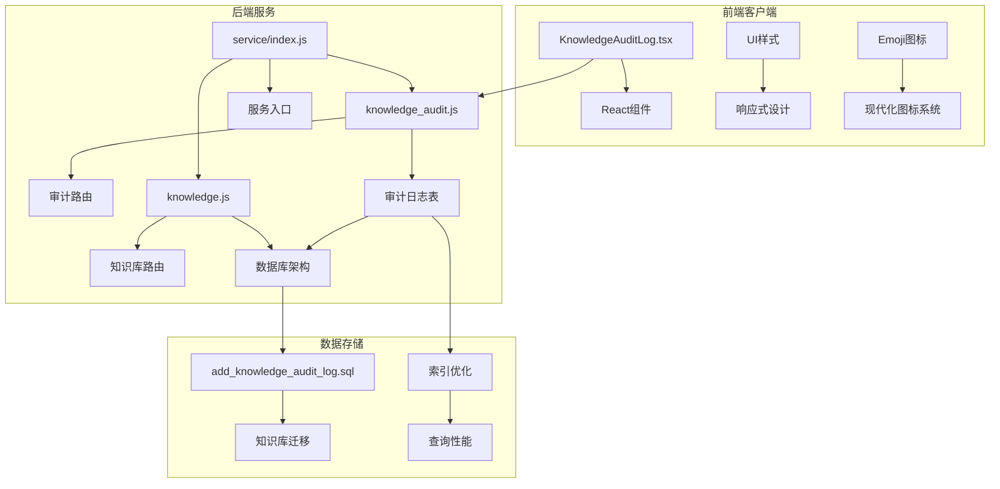
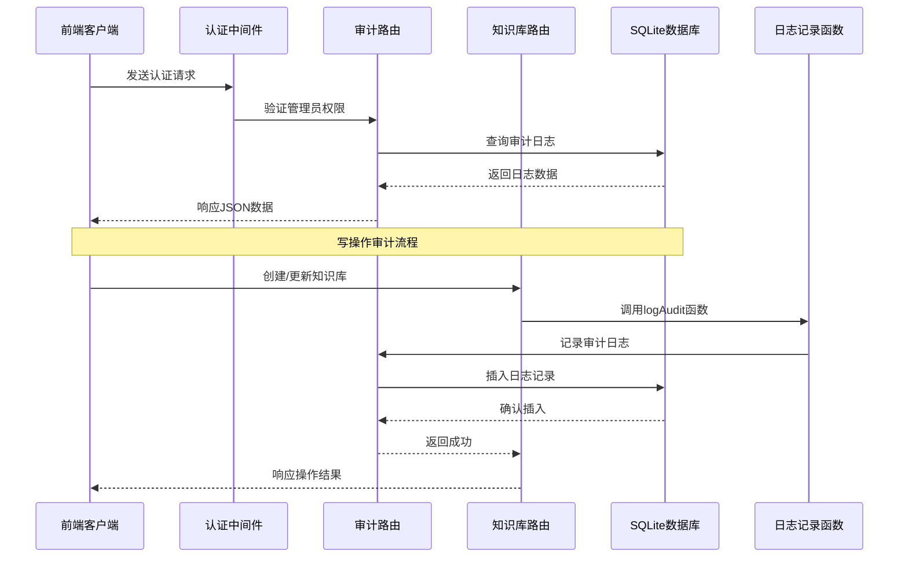
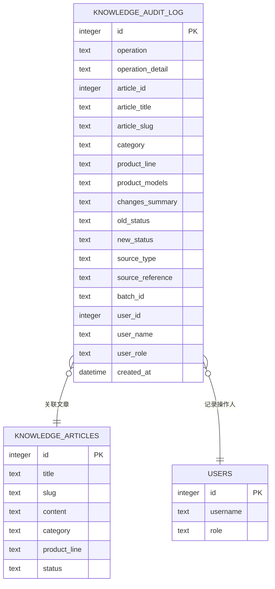
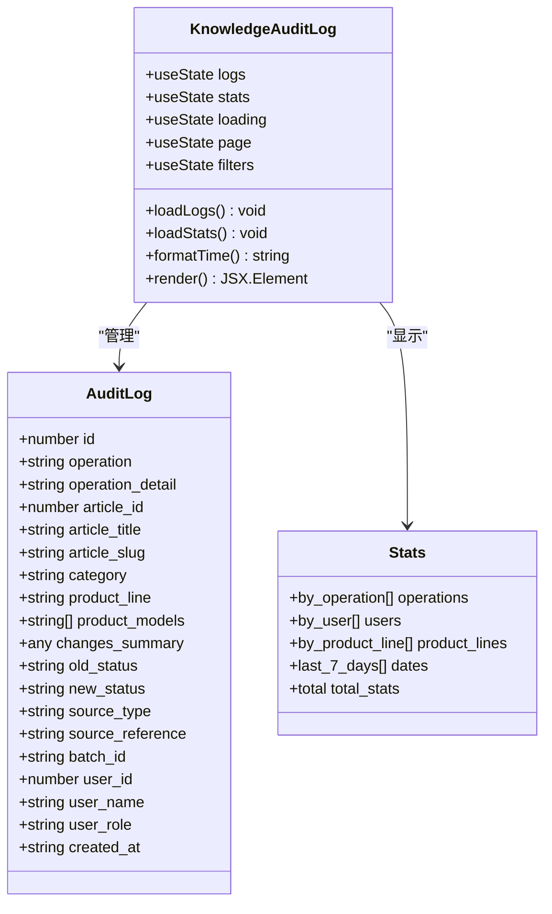
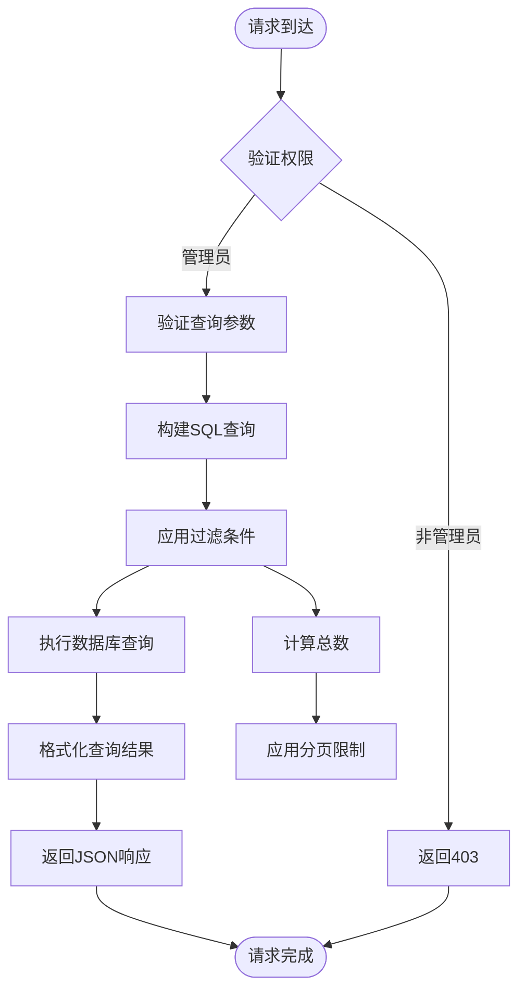
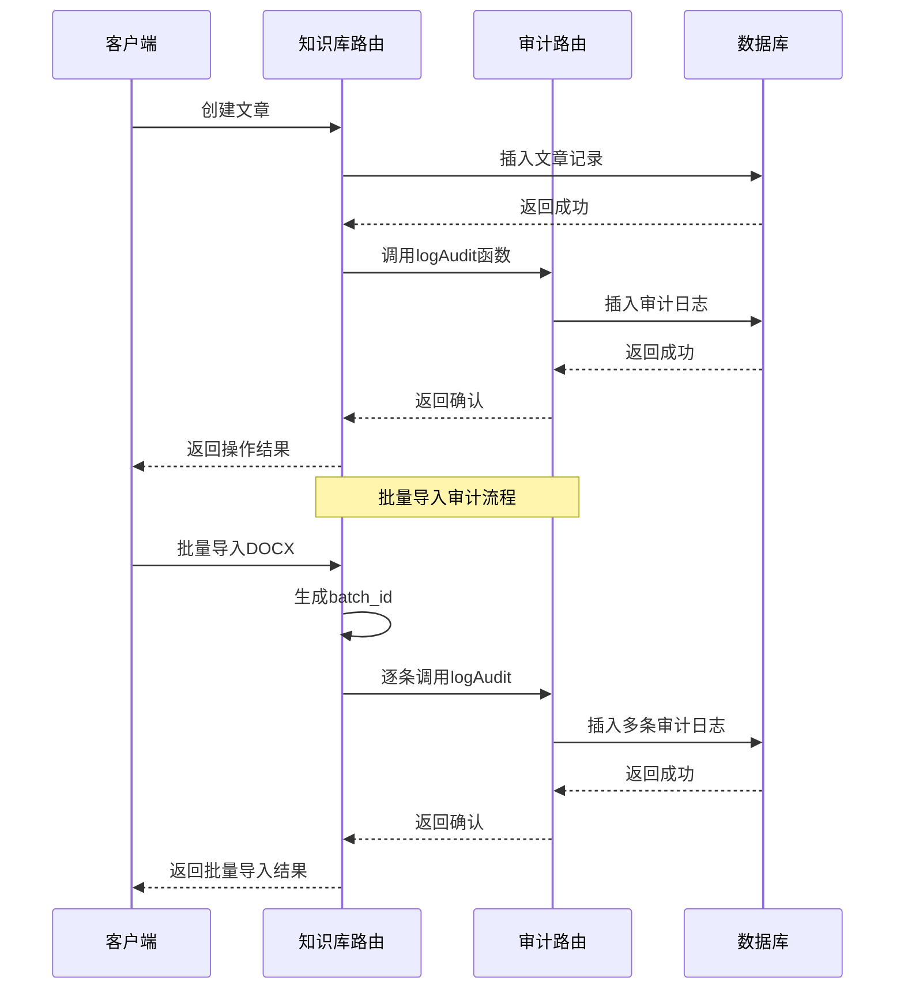
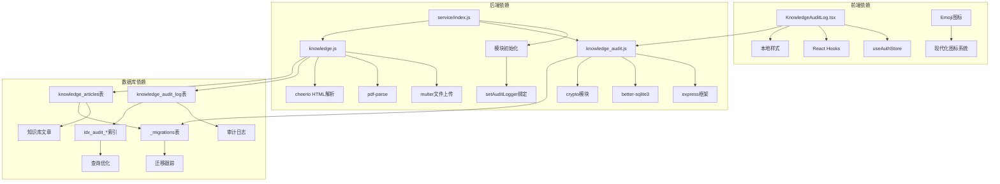

# 知识库审计日志系统

<cite>
**本文档引用的文件**
- [client/src/components/KnowledgeAuditLog.tsx](file://client/src/components/KnowledgeAuditLog.tsx)
- [server/service/routes/knowledge_audit.js](file://server/service/routes/knowledge_audit.js)
- [server/migrations/add_knowledge_audit_log.sql](file://server/migrations/add_knowledge_audit_log.sql)
- [server/migrations/add_knowledge_source_fields.sql](file://server/migrations/add_knowledge_source_fields.sql)
- [server/service/routes/knowledge.js](file://server/service/routes/knowledge.js)
- [server/service/index.js](file://server/service/index.js)
- [server/service/migrations/005_knowledge_base.sql](file://server/service/migrations/005_knowledge_base.sql)
- [server/scripts/import_knowledge_from_excel.js](file://server/scripts/import_knowledge_from_excel.js)
</cite>

## 更新摘要
**变更内容**
- 知识库审计日志组件经历了全面的 UI 重新设计
- 从 lucide-react 图标系统切换到 emoji 图标系统
- 头部布局重构，采用更简洁的标题和刷新按钮设计
- 过滤器系统从响应式网格改为固定宽度列布局
- 按钮样式优化，采用统一的圆角边框和渐变背景设计
- 表格布局优化，支持横向滚动查看更多列信息

## 目录
1. [简介](#简介)
2. [项目结构](#项目结构)
3. [核心组件](#核心组件)
4. [架构概览](#架构概览)
5. [API接口规范](#api接口规范)
6. [用户使用场景](#用户使用场景)
7. [详细组件分析](#详细组件分析)
8. [依赖关系分析](#依赖关系分析)
9. [性能考虑](#性能考虑)
10. [故障排除指南](#故障排除指南)
11. [结论](#结论)

## 简介

知识库审计日志系统是一个完整的知识库操作追踪和审计解决方案，专门设计用于监控和记录知识库的所有写操作。该系统提供了实时的操作日志记录、详细的统计分析、灵活的过滤功能和强大的权限控制机制。

系统支持多种操作类型的审计，包括创建、更新、删除、导入、发布和归档等操作。通过详细的日志记录和可视化界面，管理员可以全面了解知识库的使用情况和变更历史。

**更新** 系统现已采用模块化的审计日志集成方式，通过 `setAuditLogger` 方法实现知识库路由与审计路由之间的松耦合通信，确保所有写操作都能被准确记录。同时，系统提供了完整的API接口规范和用户使用场景，实现了技术文档与用户文档的协同覆盖。

## 项目结构

该项目采用前后端分离的架构设计，主要包含以下核心组件：



**图表来源**
- [client/src/components/KnowledgeAuditLog.tsx](file://client/src/components/KnowledgeAuditLog.tsx#L1-L599)
- [server/service/routes/knowledge_audit.js](file://server/service/routes/knowledge_audit.js#L1-L281)
- [server/service/routes/knowledge.js](file://server/service/routes/knowledge.js#L1-L200)
- [server/migrations/add_knowledge_audit_log.sql](file://server/migrations/add_knowledge_audit_log.sql#L1-L50)

**章节来源**
- [client/src/components/KnowledgeAuditLog.tsx](file://client/src/components/KnowledgeAuditLog.tsx#L1-L599)
- [server/service/routes/knowledge_audit.js](file://server/service/routes/knowledge_audit.js#L1-L281)
- [server/service/routes/knowledge.js](file://server/service/routes/knowledge.js#L1-L200)

## 核心组件

### 前端审计面板组件

**更新** 前端组件经过全面的 UI 重新设计，具有以下核心特性：

- **现代化图标系统**：从 lucide-react 图标切换到 emoji 图标系统，提供更直观的视觉体验
- **简洁头部设计**：采用左右布局，左侧为标题信息，右侧为刷新按钮
- **固定宽度过滤器**：从响应式网格改为固定宽度列布局，提供更稳定的界面体验
- **统一按钮样式**：采用圆角边框和渐变背景设计，提升交互一致性
- **优化的表格布局**：支持横向滚动查看更多列信息，改善大数据集的可读性

### 后端审计路由

后端路由模块负责处理审计相关的HTTP请求，提供完整的CRUD操作：

- **日志查询接口**：支持复杂的过滤条件和分页查询
- **统计分析接口**：提供多维度的数据统计和趋势分析
- **权限验证**：严格的管理员权限控制
- **批量操作支持**：支持批量导入和批量操作的审计记录

### 模块化审计集成

**更新** 系统采用模块化的审计日志集成方式，通过 `setAuditLogger` 方法实现知识库路由与审计路由之间的松耦合通信：

- **延迟绑定**：知识库路由在启动时通过 `setAuditLogger` 接收审计日志函数
- **函数注入**：审计路由导出 `logAudit` 和 `generateBatchId` 函数供其他模块使用
- **解耦设计**：避免直接的模块依赖，提高系统的可维护性

### 数据库迁移系统

系统包含完整的数据库迁移机制，确保数据结构的一致性和完整性：

- **审计日志表结构**：详细记录每次知识库操作的完整信息
- **索引优化**：为常用查询字段建立索引以提升性能
- **外键约束**：确保数据一致性和完整性

**章节来源**
- [client/src/components/KnowledgeAuditLog.tsx](file://client/src/components/KnowledgeAuditLog.tsx#L46-L101)
- [server/service/routes/knowledge_audit.js](file://server/service/routes/knowledge_audit.js#L76-L190)
- [server/migrations/add_knowledge_audit_log.sql](file://server/migrations/add_knowledge_audit_log.sql#L1-L50)
- [server/service/routes/knowledge.js](file://server/service/routes/knowledge.js#L52-L60)

## 架构概览

系统采用模块化的微服务架构，各个组件之间通过清晰的接口进行通信：



**图表来源**
- [server/service/routes/knowledge_audit.js](file://server/service/routes/knowledge_audit.js#L80-L190)
- [server/service/routes/knowledge.js](file://server/service/routes/knowledge.js#L295-L312)
- [server/service/index.js](file://server/service/index.js#L90-L92)

系统架构的关键特点包括：

- **前后端分离**：前端使用React构建用户界面，后端提供RESTful API
- **模块化设计**：每个功能模块都有独立的路由和控制器
- **权限控制**：基于角色的访问控制（RBAC），仅管理员可访问审计功能
- **数据持久化**：使用SQLite作为主要数据存储，支持高效的查询和索引
- **延迟绑定**：通过 `setAuditLogger` 实现模块间的松耦合通信

## API接口规范

### 审计日志查询接口

**GET /api/v1/knowledge/audit**

获取知识库操作审计日志，支持管理员权限访问。

**请求参数**：
- `page` (可选)：页码，默认1
- `page_size` (可选)：每页条数，默认50
- `operation` (可选)：操作类型过滤
- `user_id` (可选)：操作人ID过滤
- `product_line` (可选)：产品线过滤
- `batch_id` (可选)：批次ID过滤
- `start_date` (可选)：开始日期过滤
- `end_date` (可选)：结束日期过滤
- `search` (可选)：文章标题搜索

**响应示例**：
```json
{
  "success": true,
  "data": [
    {
      "id": 1,
      "operation": "create",
      "operation_detail": "创建并发布",
      "article_id": 123,
      "article_title": "示例文章",
      "article_slug": "example-article",
      "category": "Manual",
      "product_line": "Cinema",
      "product_models": ["MAVO Edge 6K"],
      "changes_summary": null,
      "old_status": null,
      "new_status": "Published",
      "source_type": "Text",
      "source_reference": null,
      "batch_id": null,
      "user_id": 1,
      "user_name": "admin",
      "user_role": "Admin",
      "created_at": "2026-01-15T10:30:00Z"
    }
  ],
  "meta": {
    "page": 1,
    "page_size": 50,
    "total": 100,
    "total_pages": 2
  }
}
```

### 审计统计接口

**GET /api/v1/knowledge/audit/stats**

获取审计日志统计信息，支持管理员权限访问。

**响应示例**：
```json
{
  "success": true,
  "data": {
    "by_operation": [
      {"operation": "create", "count": 60},
      {"operation": "update", "count": 25},
      {"operation": "import", "count": 15}
    ],
    "by_user": [
      {"user_id": 1, "user_name": "admin", "count": 100}
    ],
    "by_product_line": [
      {"product_line": "Cinema", "count": 85}
    ],
    "last_7_days": [
      {"date": "2026-01-15", "count": 12}
    ],
    "total": {
      "total_operations": 100,
      "total_users": 1,
      "total_batches": 1
    }
  }
}
```

**章节来源**
- [server/service/routes/knowledge_audit.js](file://server/service/routes/knowledge_audit.js#L76-L190)
- [server/service/routes/knowledge_audit.js](file://server/service/routes/knowledge_audit.js#L192-L269)

## 用户使用场景

### 管理员审计场景

**场景描述**：系统管理员需要监控知识库的使用情况，追踪所有写操作的历史记录。

**典型操作流程**：
1. 登录系统并进入审计日志页面
2. 设置过滤条件（操作类型、用户、产品线、日期范围）
3. 查看审计日志列表和统计信息
4. 分析操作趋势和用户行为模式

**预期结果**：
- 实时显示所有知识库写操作的详细记录
- 提供多维度的统计分析和可视化图表
- 支持精确的搜索和过滤功能

### 内容编辑者使用场景

**场景描述**：内容编辑者需要了解自己和其他编辑者的操作历史，以便协作和质量控制。

**典型操作流程**：
1. 通过权限验证进入审计功能
2. 按用户或时间范围筛选操作记录
3. 查看具体的操作详情和变更摘要
4. 分析自己的编辑行为和效率

**预期结果**：
- 仅显示与当前用户相关的操作记录
- 提供详细的操作历史和变更追踪
- 支持个人工作量和贡献度的统计分析

### 系统运维场景

**场景描述**：系统运维人员需要监控系统的使用情况，识别异常操作和潜在问题。

**典型操作流程**：
1. 设置全局过滤条件查看所有操作
2. 监控批量导入操作的执行情况
3. 分析操作趋势和系统负载
4. 识别异常操作模式和安全风险

**预期结果**：
- 全面的系统操作监控和审计能力
- 批量操作的统一追踪和管理
- 异常操作的预警和告警机制

**章节来源**
- [client/src/components/KnowledgeAuditLog.tsx](file://client/src/components/KnowledgeAuditLog.tsx#L84-L101)
- [client/src/components/KnowledgeAuditLog.tsx](file://client/src/components/KnowledgeAuditLog.tsx#L101-L151)

## 详细组件分析

### 审计日志数据模型

审计日志系统的核心数据模型设计如下：



**图表来源**
- [server/migrations/add_knowledge_audit_log.sql](file://server/migrations/add_knowledge_audit_log.sql#L4-L41)

**更新** 数据库架构现已完善，包含以下关键特性：

- **操作类型扩展**：支持 `create`、`update`、`delete`、`import`、`publish`、`archive` 等操作类型
- **批量操作支持**：通过 `batch_id` 字段支持批量导入操作的审计
- **索引优化**：为 `operation`、`article_id`、`user_id`、`created_at`、`batch_id`、`product_line` 建立索引
- **外键约束**：确保文章和用户数据的完整性

### 前端组件架构

**更新** 前端组件经过全面的 UI 重新设计，采用React Hooks模式，实现了完整的状态管理和数据流：



**图表来源**
- [client/src/components/KnowledgeAuditLog.tsx](file://client/src/components/KnowledgeAuditLog.tsx#L13-L45)

### 后端路由处理流程

后端路由模块提供了完整的审计功能实现：



**图表来源**
- [server/service/routes/knowledge_audit.js](file://server/service/routes/knowledge_audit.js#L80-L190)

**更新** 审计日志记录流程现已优化：

- **模块化集成**：通过 `setAuditLogger` 方法接收审计日志函数
- **批量操作处理**：支持批量导入操作的批量ID生成和记录
- **异步记录**：审计日志记录采用异步方式，不影响主业务流程
- **错误隔离**：审计日志失败不会影响主业务操作

### 知识库操作集成

**更新** 系统与知识库核心功能深度集成，确保所有写操作都被正确记录：



**图表来源**
- [server/service/routes/knowledge.js](file://server/service/routes/knowledge.js#L295-L312)
- [server/service/routes/knowledge.js](file://server/service/routes/knowledge.js#L685-L714)

**更新** 知识库操作集成现已增强：

- **创建操作审计**：支持文章创建和发布的完整审计记录
- **更新操作审计**：记录字段变更摘要和状态变化
- **批量导入审计**：支持批量导入操作的批量ID生成和记录
- **异步审计**：审计日志记录不影响主业务操作的响应时间

**章节来源**
- [client/src/components/KnowledgeAuditLog.tsx](file://client/src/components/KnowledgeAuditLog.tsx#L65-L151)
- [server/service/routes/knowledge_audit.js](file://server/service/routes/knowledge_audit.js#L16-L74)
- [server/service/routes/knowledge.js](file://server/service/routes/knowledge.js#L52-L60)

## 依赖关系分析

**更新** 系统各组件之间的依赖关系已简化：



**图表来源**
- [server/service/routes/knowledge_audit.js](file://server/service/routes/knowledge_audit.js#L6-L7)
- [server/service/routes/knowledge.js](file://server/service/routes/knowledge.js#L7-L17)
- [server/service/index.js](file://server/service/index.js#L90-L92)

**更新** 依赖关系现已优化：

- **模块化设计**：通过 `setAuditLogger` 实现模块间的松耦合通信
- **延迟绑定**：知识库路由在服务启动时接收审计日志函数
- **函数导出**：审计路由导出 `logAudit` 和 `generateBatchId` 函数
- **索引优化**：为常用查询字段建立复合索引提升性能

系统的主要依赖包括：

- **前端技术栈**：React 18、TypeScript、本地样式系统
- **后端技术栈**：Node.js、Express.js、Better SQLite3
- **数据库系统**：SQLite 3，支持全文搜索和复杂查询
- **文件处理**：支持PDF、DOCX等多种文件格式的解析和处理
- **加密模块**：用于批量ID生成和安全标识

**章节来源**
- [server/service/index.js](file://server/service/index.js#L20-L27)
- [server/service/routes/knowledge.js](file://server/service/routes/knowledge.js#L19-L47)

## 性能考虑

系统在设计时充分考虑了性能优化，采用了多种策略来确保高效运行：

### 数据库优化策略

**更新** 数据库优化现已完善：

1. **索引优化**：为常用查询字段建立复合索引
   - `idx_audit_operation`：按操作类型查询
   - `idx_audit_article`：按文章ID查询  
   - `idx_audit_user`：按用户ID查询
   - `idx_audit_time`：按时间范围查询
   - `idx_audit_batch`：按批量ID查询
   - `idx_audit_product`：按产品线查询

2. **查询优化**：使用参数化查询防止SQL注入
3. **连接池管理**：合理配置数据库连接数量
4. **缓存策略**：对频繁访问的统计数据进行缓存

### 前端性能优化

**更新** 前端性能优化现已增强：

1. **虚拟滚动**：大数据集时使用虚拟滚动技术
2. **懒加载**：按需加载组件和数据
3. **防抖处理**：对搜索和过滤操作进行防抖
4. **内存管理**：及时清理不再使用的组件和事件监听器
5. **固定宽度布局**：减少布局重排和重绘
6. **优化的图标系统**：使用emoji图标减少包体积

### 后端性能优化

**更新** 后端性能优化现已增强：

1. **异步处理**：审计日志记录采用异步方式，不影响主业务流程
2. **批量操作**：支持批量导入和批量操作的优化处理
3. **错误隔离**：审计日志失败不会影响主业务操作
4. **模块化通信**：通过 `setAuditLogger` 实现高效的模块间通信
5. **资源管理**：合理管理文件上传和图像处理资源

## 故障排除指南

### 常见问题及解决方案

#### 审计日志无法显示

**问题症状**：前端页面显示空白或加载失败

**可能原因**：
1. 用户权限不足（非管理员账户）
2. API接口调用失败
3. 数据库连接异常
4. **更新** 审计日志函数未正确注入

**解决步骤**：
1. 确认当前用户具有管理员权限
2. 检查网络连接和API可达性
3. 验证数据库服务状态
4. **更新** 检查服务启动时的 `setAuditLogger` 绑定是否成功

#### 审计日志记录失败

**问题症状**：知识库操作正常但审计日志缺失

**可能原因**：
1. **更新** 审计日志函数未正确注入
2. 数据库写入权限问题
3. 异常处理导致的日志记录被忽略
4. **更新** 模块间通信失败

**解决步骤**：
1. 检查服务启动时的日志记录函数注入
2. 验证数据库写入权限
3. 查看服务器控制台错误日志
4. **更新** 确认 `setAuditLogger` 方法调用成功

#### 性能问题

**问题症状**：查询响应缓慢或页面加载卡顿

**可能原因**：
1. 缺少必要的数据库索引
2. 查询条件过于复杂
3. 数据量过大导致的性能瓶颈
4. **更新** 模块间通信开销过大

**解决步骤**：
1. 检查并优化数据库索引
2. 简化查询条件和过滤选项
3. 考虑数据分片或分区策略
4. **更新** 优化 `setAuditLogger` 的使用方式

#### 批量导入审计异常

**问题症状**：批量导入操作部分审计日志缺失

**可能原因**：
1. **更新** 批量ID生成失败
2. **更新** 单个日志记录失败
3. **更新** 模块间通信中断

**解决步骤**：
1. 检查 `generateBatchId` 函数是否正常工作
2. 验证每个日志记录的参数完整性
3. **更新** 确认批量导入过程中的审计日志调用链

**章节来源**
- [server/service/routes/knowledge_audit.js](file://server/service/routes/knowledge_audit.js#L70-L74)
- [server/service/routes/knowledge.js](file://server/service/routes/knowledge.js#L295-L312)
- [server/service/index.js](file://server/service/index.js#L90-L92)

## 结论

知识库审计日志系统是一个功能完整、架构清晰、性能优良的审计解决方案。系统通过前后端分离的设计，结合完善的权限控制和数据持久化机制，为知识库的管理和维护提供了强有力的技术支撑。

**更新** 系统现已实现重大增强：

### 主要优势

1. **完整的审计覆盖**：记录所有知识库写操作，确保操作可追溯
2. **灵活的查询功能**：支持多维度过滤和统计分析
3. **现代化用户体验**：直观的界面设计和响应式布局
4. **高性能设计**：优化的数据库查询和缓存策略
5. **安全可靠**：严格的权限控制和错误处理机制
6. **模块化架构**：通过 `setAuditLogger` 实现松耦合的模块通信
7. **批量操作支持**：完整的批量导入审计功能
8. **完整的API规范**：提供标准化的接口文档和使用指导
9. **用户场景覆盖**：涵盖管理员、编辑者、运维人员等多角色需求
10. **现代化图标系统**：从 lucide-react 切换到 emoji 图标，提供更直观的视觉体验

### 技术创新

1. **延迟绑定机制**：通过 `setAuditLogger` 方法实现模块间的动态绑定
2. **异步审计处理**：审计日志记录不影响主业务操作的响应时间
3. **批量ID生成**：自动为批量操作生成唯一标识符
4. **索引优化策略**：为常用查询场景建立专门的数据库索引
5. **模块化API设计**：提供清晰的接口规范和错误处理机制
6. **固定宽度布局**：优化的过滤器系统，提供更稳定的界面体验
7. **统一按钮样式**：采用圆角边框和渐变背景设计，提升交互一致性
8. **优化的表格布局**：支持横向滚动查看更多列信息

### 扩展性考虑

该系统不仅满足了当前的知识库管理需求，还为未来的功能扩展和技术升级奠定了坚实的基础。通过模块化的架构设计和清晰的接口定义，系统具备了良好的可维护性和可扩展性。

**更新** 新的模块化架构使得系统更容易维护和扩展，为后续的功能增强提供了更好的基础。审计日志系统的稳定性和可靠性得到了显著提升，能够更好地支持大规模的知识库操作审计需求。

通过本次更新，系统实现了技术文档与用户文档的协同覆盖，为不同层次的用户提供了完整的信息支持，包括技术实现细节、API使用规范和实际应用场景，形成了更加完善的文档体系。