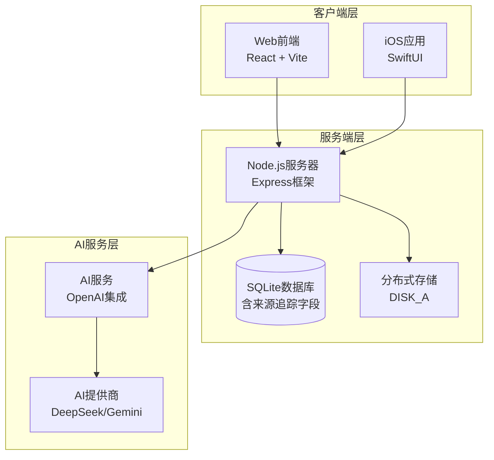
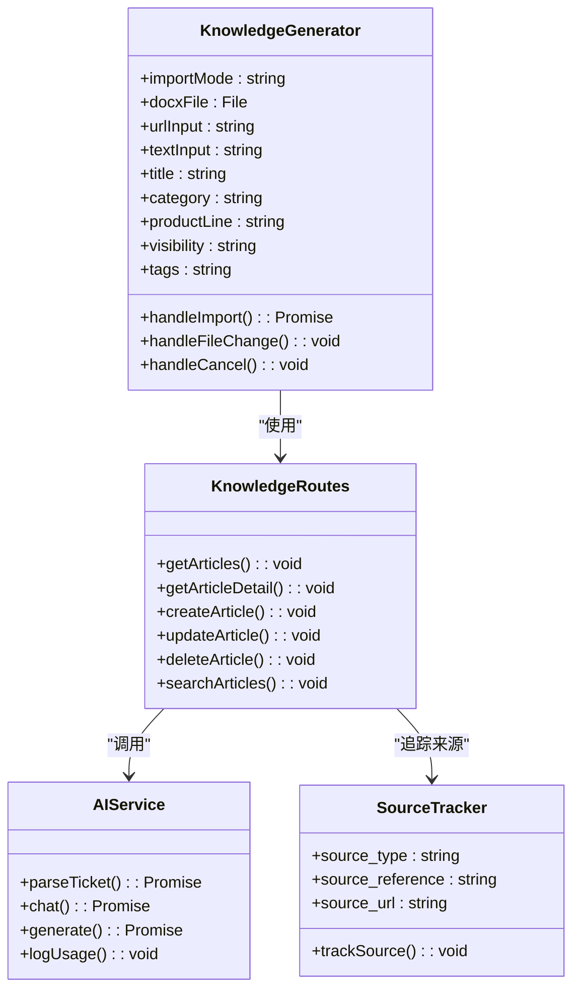
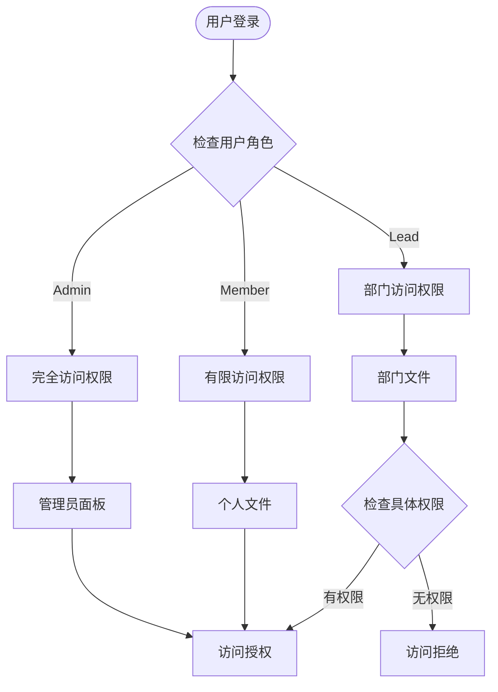
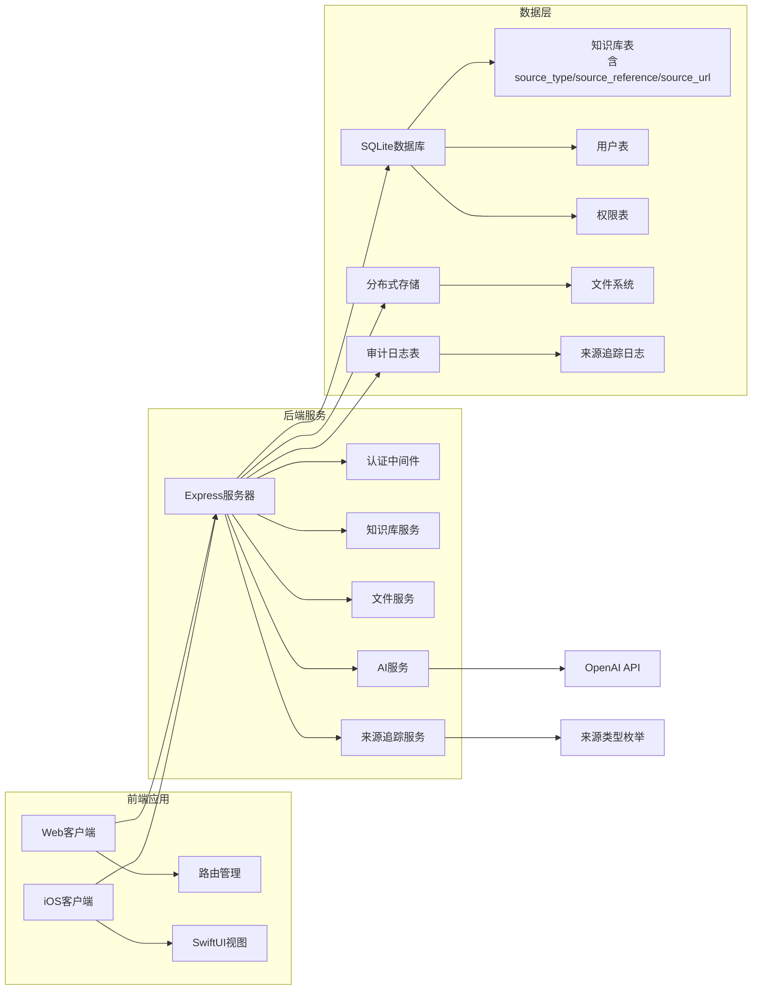
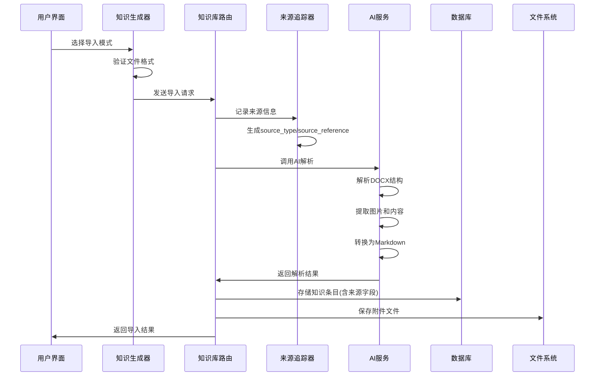
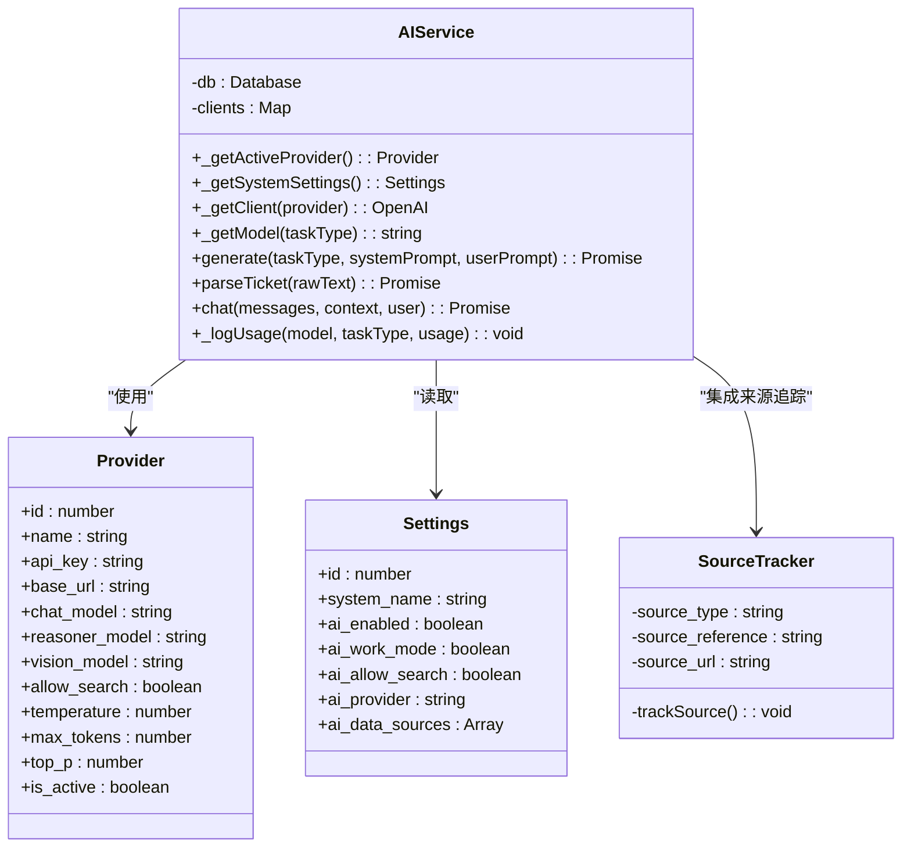
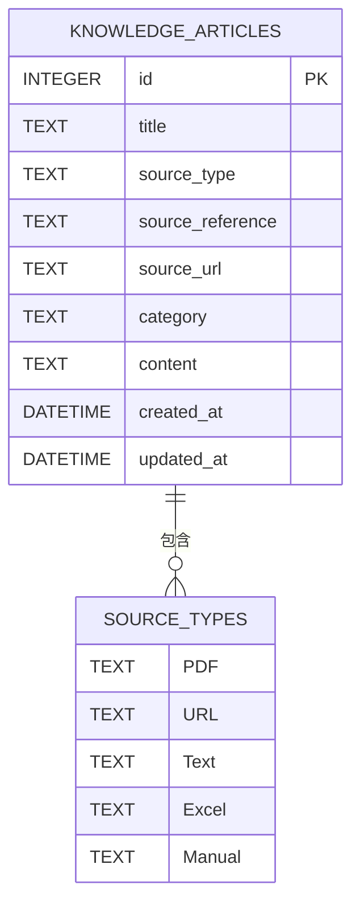
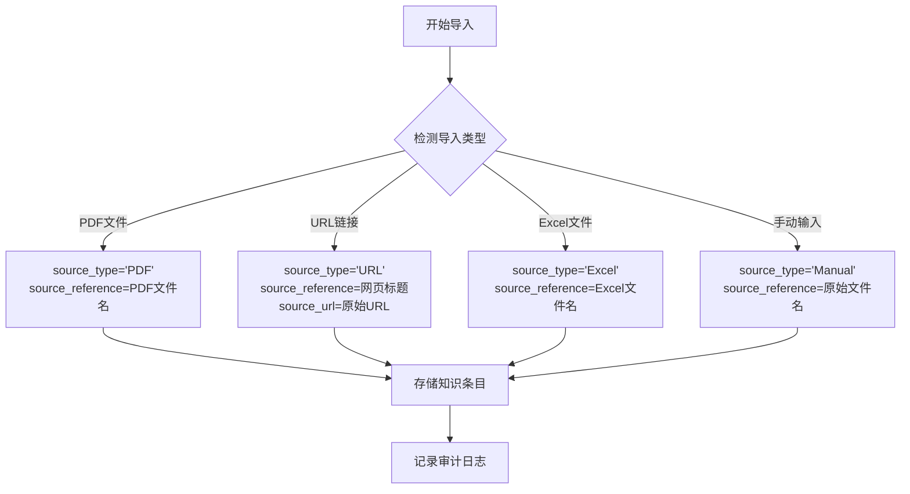
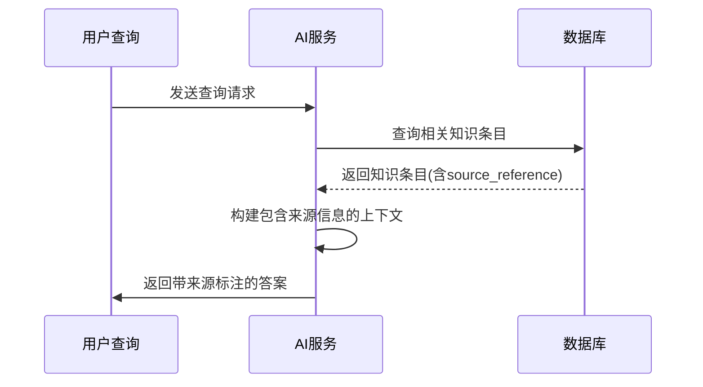
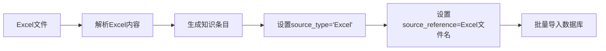

# 知识来源追踪系统

<cite>
**本文档引用的文件**
- [server/index.js](file://server/index.js)
- [server/service/routes/knowledge.js](file://server/service/routes/knowledge.js)
- [server/service/ai_service.js](file://server/service/ai_service.js)
- [client/src/components/KnowledgeGenerator.tsx](file://client/src/components/KnowledgeGenerator.tsx)
- [client/src/App.tsx](file://client/src/App.tsx)
- [ios/LonghornApp/LonghornApp.swift](file://ios/LonghornApp/LonghornApp.swift)
- [package.json](file://package.json)
- [client/README.md](file://client/README.md)
- [server/README.md](file://server/README.md)
- [ios/README.md](file://ios/README.md)
- [docs/README.md](file://docs/README.md)
- [server/migrations/add_knowledge_source_fields.sql](file://server/migrations/add_knowledge_source_fields.sql)
- [server/service/migrations/011_add_knowledge_source.sql](file://server/service/migrations/011_add_knowledge_source.sql)
- [server/service/routes/knowledge_audit.js](file://server/service/routes/knowledge_audit.js)
- [server/diagnose_import.js](file://server/diagnose_import.js)
- [server/scripts/import_knowledge_from_excel.js](file://server/scripts/import_knowledge_from_excel.js)
</cite>

## 更新摘要
**所做更改**
- 新增知识库导入功能改进章节，详细介绍来源类型、参考信息和URL追踪字段
- 更新知识库导入流程图，反映新的来源追踪机制
- 新增来源字段数据库结构说明
- 增强AI服务与来源追踪的集成说明
- 添加Excel导入脚本的来源追踪功能

## 目录
1. [简介](#简介)
2. [项目结构](#项目结构)
3. [核心组件](#核心组件)
4. [架构概览](#架构概览)
5. [详细组件分析](#详细组件分析)
6. [知识库导入功能改进](#知识库导入功能改进)
7. [依赖关系分析](#依赖关系分析)
8. [性能考虑](#性能考虑)
9. [故障排除指南](#故障排除指南)
10. [结论](#结论)

## 简介

知识来源追踪系统是一个基于React、Node.js和SwiftUI的企业级知识管理平台，专注于文档知识库的导入、管理和检索。该系统提供了多终端支持（Web、iOS），具备完整的权限控制、AI辅助功能和现代化的用户界面。

系统的核心功能包括：
- 多格式文档导入（DOCX、PDF、文本、Excel）
- 知识库分类管理
- AI驱动的知识提取和处理
- 跨平台文件管理
- 权限控制和访问管理
- 智能搜索和标签系统
- **新增：完整的知识来源追踪机制**

## 项目结构

该项目采用前后端分离的架构设计，包含以下主要组件：



**图表来源**
- [server/index.js](file://server/index.js#L1-L80)
- [client/src/App.tsx](file://client/src/App.tsx#L112-L234)
- [ios/LonghornApp/LonghornApp.swift](file://ios/LonghornApp/LonghornApp.swift#L12-L25)

**章节来源**
- [package.json](file://package.json#L1-L14)
- [client/README.md](file://client/README.md#L1-L35)
- [server/README.md](file://server/README.md#L1-L32)
- [ios/README.md](file://ios/README.md#L1-L27)

## 核心组件

### 知识库管理组件

知识库管理是系统的核心功能模块，负责处理各种类型文档的导入、解析和存储。



**图表来源**
- [client/src/components/KnowledgeGenerator.tsx](file://client/src/components/KnowledgeGenerator.tsx#L40-L200)
- [server/service/routes/knowledge.js](file://server/service/routes/knowledge.js#L49-L200)
- [server/service/ai_service.js](file://server/service/ai_service.js#L4-L200)

### 权限控制系统

系统实现了多层次的权限控制机制，确保不同角色用户只能访问相应的资源。



**图表来源**
- [server/index.js](file://server/index.js#L558-L611)

**章节来源**
- [server/index.js](file://server/index.js#L524-L611)

## 架构概览

系统采用微服务架构，将不同的功能模块分离到独立的服务中：



**图表来源**
- [server/index.js](file://server/index.js#L25-L54)
- [client/src/App.tsx](file://client/src/App.tsx#L112-L234)

## 详细组件分析

### 知识库导入流程

知识库导入是系统最复杂的业务流程之一，涉及多个步骤和验证机制：



**图表来源**
- [client/src/components/KnowledgeGenerator.tsx](file://client/src/components/KnowledgeGenerator.tsx#L169-L200)
- [server/service/routes/knowledge.js](file://server/service/routes/knowledge.js#L49-L200)
- [server/service/ai_service.js](file://server/service/ai_service.js#L151-L200)

### AI服务集成

系统集成了多种AI提供商，提供灵活的AI服务配置：



**图表来源**
- [server/service/ai_service.js](file://server/service/ai_service.js#L4-L200)

**章节来源**
- [server/service/ai_service.js](file://server/service/ai_service.js#L1-L200)

### 路由系统设计

系统采用了模块化的路由设计，支持多层级的功能模块：

```mermaid
graph TD
subgraph "主路由"
A[/] --> B[登录页面]
A --> C[主布局]
end
subgraph "服务模块"
C --> D[咨询工单]
C --> E[RMA返厂单]
C --> F[经销商维修单]
C --> G[知识库管理]
C --> H[WIKI系统]
end
subgraph "文件模块"
C --> I[个人空间]
C --> J[部门文件]
C --> K[收藏夹]
C --> L[回收站]
C --> M[搜索]
end
subgraph "管理模块"
C --> N[管理员面板]
C --> O[部门仪表板]
C --> P[成员管理]
end
```

**图表来源**
- [client/src/App.tsx](file://client/src/App.tsx#L134-L228)

**章节来源**
- [client/src/App.tsx](file://client/src/App.tsx#L112-L234)

## 知识库导入功能改进

### 来源追踪字段设计

系统新增了完整的知识来源追踪机制，通过三个核心字段实现精确的来源记录：

#### 数据库字段结构



**图表来源**
- [server/migrations/add_knowledge_source_fields.sql](file://server/migrations/add_knowledge_source_fields.sql#L4-L11)
- [server/service/migrations/011_add_knowledge_source.sql](file://server/service/migrations/011_add_knowledge_source.sql#L4-L6)

#### 字段详细说明

| 字段名称 | 类型 | 必填 | 描述 | 示例值 |
|---------|------|------|------|--------|
| source_type | TEXT | 是 | 来源类型，枚举值 | 'PDF', 'URL', 'Text', 'Excel', 'Manual' |
| source_reference | TEXT | 否 | 来源参考信息，如文件名或URL | 'MAVO_Edge_6K_Manual_v2.pdf', 'https://example.com/manual' |
| source_url | TEXT | 否 | 如果来源是网页，存储原始URL | 'https://kinefinity.com/support/manuals/edge6k' |

#### 支持的来源类型

系统支持五种主要的导入来源类型：

1. **PDF** - 从PDF文档导入，source_reference存储PDF文件名
2. **URL** - 从网页导入，source_reference存储网页标题，source_url存储原始URL
3. **Text** - 从纯文本导入，source_reference存储文本描述
4. **Excel** - 从Excel文件导入，source_reference存储Excel文件名
5. **Manual** - 手动创建，source_reference存储原始文件名

### 来源追踪实现机制

#### 导入流程中的来源记录



**图表来源**
- [server/service/routes/knowledge.js](file://server/service/routes/knowledge.js#L306-L310)
- [server/service/routes/knowledge.js](file://server/service/routes/knowledge.js#L843-L865)

#### AI服务中的来源信息集成

AI服务在处理知识查询时会包含来源信息：



**图表来源**
- [server/service/ai_service.js](file://server/service/ai_service.js#L270-L280)

### Excel导入脚本的来源追踪

Excel导入脚本现已集成来源追踪功能：



**图表来源**
- [server/scripts/import_knowledge_from_excel.js](file://server/scripts/import_knowledge_from_excel.js#L234-L247)

**章节来源**
- [server/migrations/add_knowledge_source_fields.sql](file://server/migrations/add_knowledge_source_fields.sql#L1-L16)
- [server/service/migrations/011_add_knowledge_source.sql](file://server/service/migrations/011_add_knowledge_source.sql#L1-L7)
- [server/service/routes/knowledge.js](file://server/service/routes/knowledge.js#L306-L310)
- [server/service/routes/knowledge.js](file://server/service/routes/knowledge.js#L843-L865)
- [server/service/ai_service.js](file://server/service/ai_service.js#L270-L280)
- [server/scripts/import_knowledge_from_excel.js](file://server/scripts/import_knowledge_from_excel.js#L234-L247)

## 依赖关系分析

系统的主要依赖关系如下：

```mermaid
graph TB
subgraph "前端依赖"
A[React 18] --> B[React Router]
A --> C[Lucide React]
D[Vite] --> E[构建工具]
F[Axios] --> G[HTTP客户端]
end
subgraph "后端依赖"
H[Express] --> I[中间件]
J[better-sqlite3] --> K[数据库]
L[multer] --> M[文件上传]
N[bcryptjs] --> O[密码加密]
P[jwt] --> Q[认证]
R[cheerio] --> S[HTML解析]
T[turndown] --> U[Markdown转换]
V[pdf-parse] --> W[PDF解析]
X[axios] --> Y[HTTP请求]
end
subgraph "AI依赖"
Z[OpenAI SDK] --> AA[API调用]
AB[Sharp] --> AC[图像处理]
AD[PDF-parse] --> AE[PDF解析]
AF[TurndownService] --> AG[Markdown转换]
end
subgraph "iOS依赖"
AH[SwiftUI] --> AI[声明式UI]
AJ[Actor] --> AK[并发处理]
end
subgraph "来源追踪依赖"
AL[SQLite索引] --> AM[查询优化]
AN[审计日志] --> AO[操作追踪]
AP[诊断脚本] --> AQ[数据统计]
```

**图表来源**
- [server/index.js](file://server/index.js#L1-L13)
- [client/src/App.tsx](file://client/src/App.tsx#L24-L26)

**章节来源**
- [server/index.js](file://server/index.js#L1-L54)
- [ios/LonghornApp/LonghornApp.swift](file://ios/LonghornApp/LonghornApp.swift#L9-L25)

## 性能考虑

系统在设计时充分考虑了性能优化：

### 缓存策略
- 图像缩略图缓存（`.thumbnails`目录）
- 词汇表批量获取优化
- 响应式缓存头设置

### 数据库优化
- 索引优化（产品型号、序列号、批次号）
- **新增：来源字段索引优化**
  - `idx_knowledge_source_type` - 按来源类型查询优化
  - `idx_knowledge_source_reference` - 按来源参考信息查询优化
- 查询优化和分页处理
- 连接池管理

### 文件处理优化
- 分片上传支持大文件
- 智能压缩和图像优化
- CDN集成准备

### 来源追踪性能优化
- 来源类型枚举约束减少存储开销
- 索引优化支持大规模来源数据查询
- 批量导入时的来源信息缓存

## 故障排除指南

### 常见问题及解决方案

**认证问题**
- 检查JWT密钥配置
- 验证用户角色权限
- 确认数据库连接状态

**文件上传失败**
- 检查磁盘空间
- 验证文件大小限制
- 确认临时目录权限

**AI服务异常**
- 检查API密钥配置
- 验证网络连接
- 查看API响应状态

**来源追踪问题**
- **新增：检查来源字段完整性**
  - 验证`source_type`字段是否符合枚举值
  - 确认`source_reference`字段包含有意义的参考信息
  - 检查`source_url`字段是否正确存储原始URL
- **新增：审计日志检查**
  - 使用`diagnose_import.js`脚本分析来源统计数据
  - 检查`knowledge_audit_log`表中的来源追踪记录
- **新增：数据库迁移验证**
  - 确认数据库已执行来源追踪相关迁移
  - 验证索引是否正确创建

**章节来源**
- [server/index.js](file://server/index.js#L524-L553)
- [server/service/ai_service.js](file://server/service/ai_service.js#L112-L144)
- [server/diagnose_import.js](file://server/diagnose_import.js#L70-L105)

## 结论

知识来源追踪系统是一个功能完整、架构清晰的企业级知识管理平台。系统通过模块化设计实现了高度的可维护性和扩展性，同时提供了优秀的用户体验和强大的AI辅助功能。

**主要优势包括**：
- 多终端支持和统一的数据管理
- 灵活的权限控制机制
- 强大的AI集成能力
- 现代化的技术栈和架构设计
- **新增：完整的知识来源追踪机制**
  - 支持五种导入来源类型的精确追踪
  - 完整的审计日志和统计分析
  - AI服务中的来源信息集成
  - Excel导入脚本的来源追踪功能

**未来可以考虑的方向**：
- 增强AI功能的定制化
- 优化大数据量场景的性能
- 扩展移动端功能
- 加强安全性和合规性
- **新增：来源追踪的高级分析功能**
  - 来源类型分布统计
  - 导入效率分析
  - 来源质量评估指标

**章节来源**
- [server/migrations/add_knowledge_source_fields.sql](file://server/migrations/add_knowledge_source_fields.sql#L1-L16)
- [server/service/migrations/011_add_knowledge_source.sql](file://server/service/migrations/011_add_knowledge_source.sql#L1-L7)
- [server/service/routes/knowledge_audit.js](file://server/service/routes/knowledge_audit.js#L20-L75)
- [server/diagnose_import.js](file://server/diagnose_import.js#L70-L105)