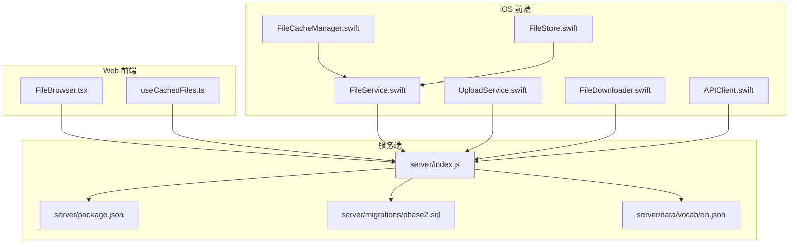
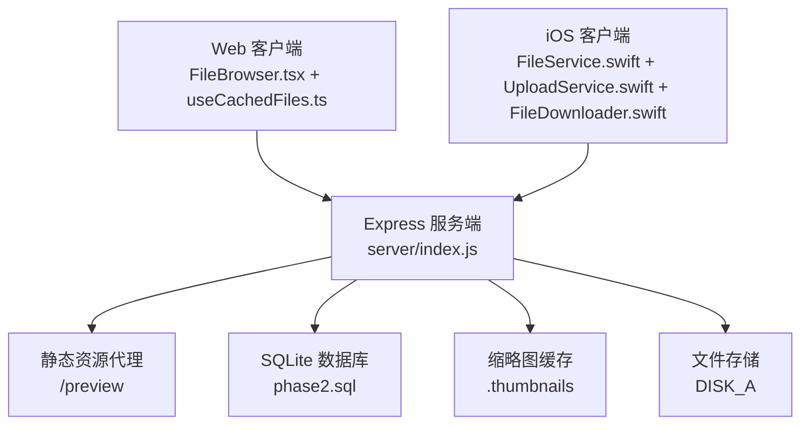
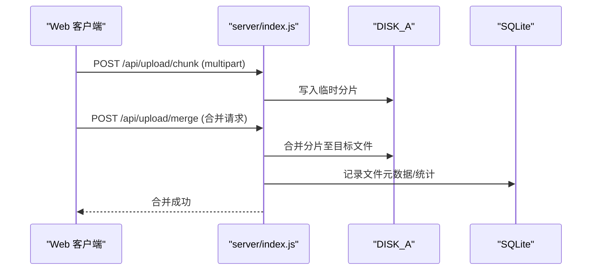
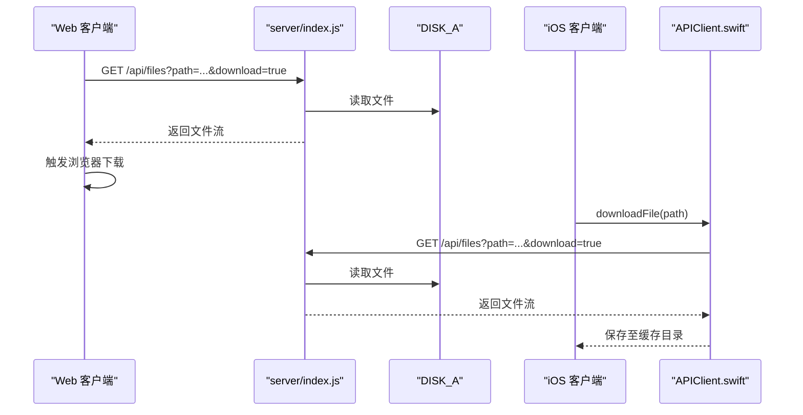
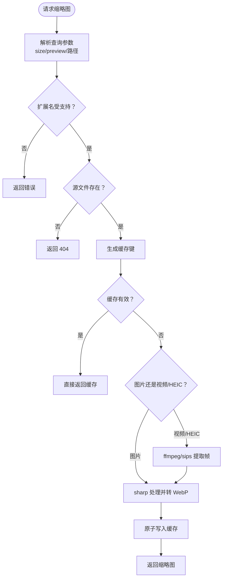
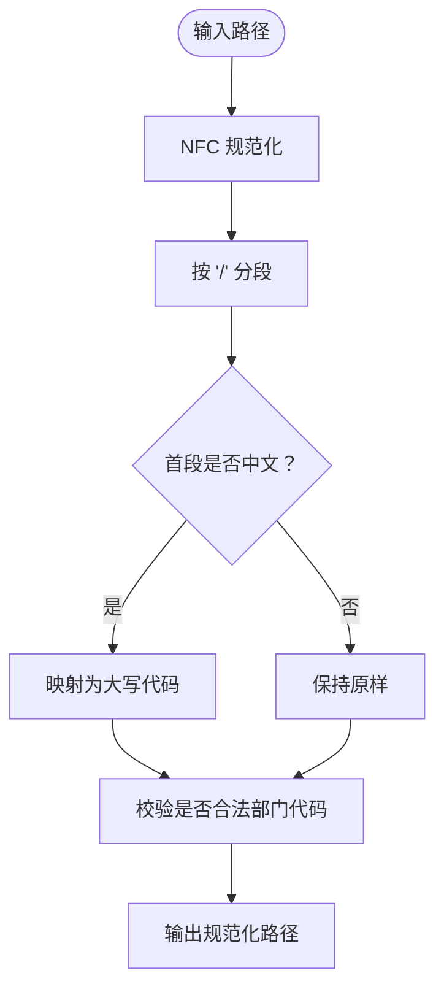
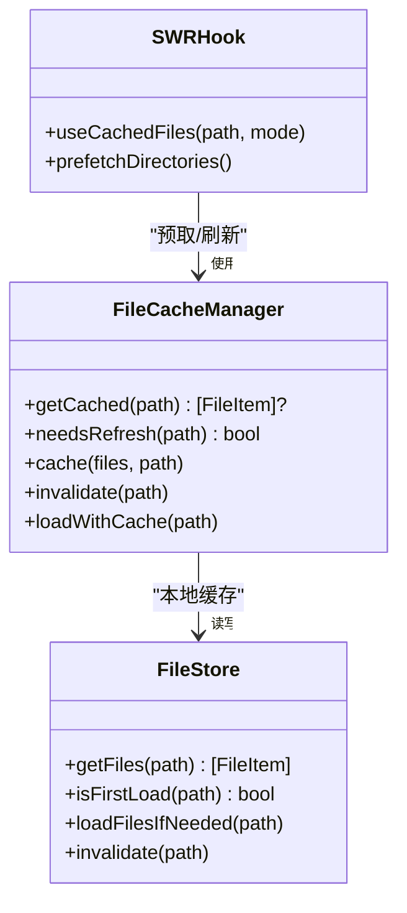
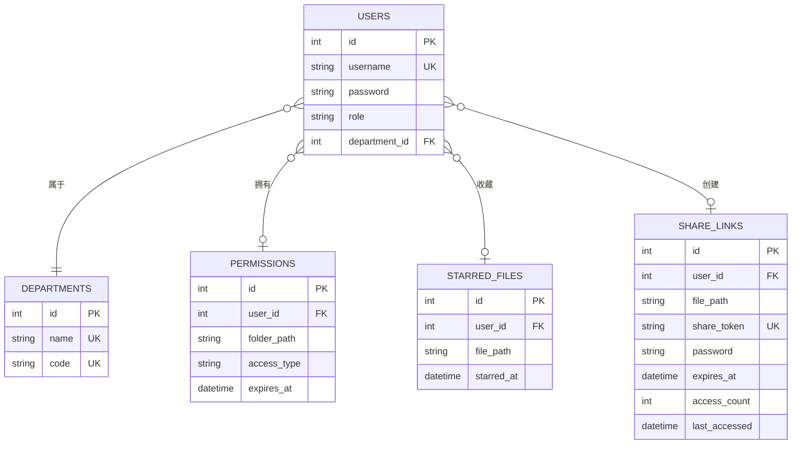
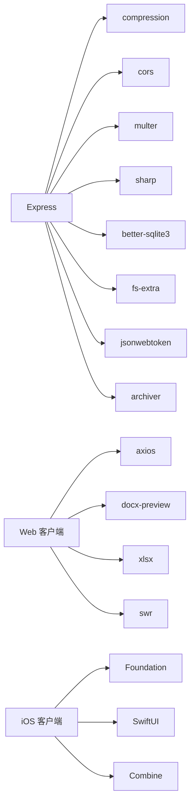

# 文件处理服务

<cite>
**本文引用的文件**
- [server/index.js](file://server/index.js)
- [server/package.json](file://server/package.json)
- [client/src/components/FileBrowser.tsx](file://client/src/components/FileBrowser.tsx)
- [client/src/hooks/useCachedFiles.ts](file://client/src/hooks/useCachedFiles.ts)
- [ios/LonghornApp/Services/FileService.swift](file://ios/LonghornApp/Services/FileService.swift)
- [ios/LonghornApp/Services/UploadService.swift](file://ios/LonghornApp/Services/UploadService.swift)
- [ios/LonghornApp/Services/FileDownloader.swift](file://ios/LonghornApp/Services/FileDownloader.swift)
- [ios/LonghornApp/Services/APIClient.swift](file://ios/LonghornApp/Services/APIClient.swift)
- [ios/LonghornApp/Services/FileCacheManager.swift](file://ios/LonghornApp/Services/FileCacheManager.swift)
- [ios/LonghornApp/Services/FileStore.swift](file://ios/LonghornApp/Services/FileStore.swift)
- [server/migrations/phase2.sql](file://server/migrations/phase2.sql)
- [server/data/vocab/en.json](file://server/data/vocab/en.json)
</cite>

## 目录
1. [简介](#简介)
2. [项目结构](#项目结构)
3. [核心组件](#核心组件)
4. [架构总览](#架构总览)
5. [详细组件分析](#详细组件分析)
6. [依赖关系分析](#依赖关系分析)
7. [性能考量](#性能考量)
8. [故障排查指南](#故障排查指南)
9. [结论](#结论)
10. [附录](#附录)

## 简介
本文件处理服务以“Longhorn”为核心，提供文件上传、下载、浏览、预览、缩略图生成、分片上传与断点续传、权限校验、回收站、分享与收藏等能力。后端基于 Node.js + Express，采用 SQLite 数据库存储用户、权限、星标与分享等元数据；前端包含 Web 客户端与 iOS 客户端，分别通过 REST API 进行文件操作与缓存策略协同。

## 项目结构
- 服务端（Node.js）位于 server/，负责文件存储、权限控制、缩略图生成、分片上传合并、静态资源代理与缓存。
- 客户端（React + TypeScript）位于 client/，提供文件浏览、批量操作、分片上传、缩略图预览与缓存。
- iOS 客户端位于 ios/LonghornApp/Services，提供文件操作、分片上传、下载、缓存与网络请求封装。
- 数据迁移与词库示例位于 server/migrations 与 server/data/vocab。

图表来源
- [server/index.js](file://server/index.js#L1-L120)
- [server/package.json](file://server/package.json#L1-L31)
- [client/src/components/FileBrowser.tsx](file://client/src/components/FileBrowser.tsx#L1-L120)
- [client/src/hooks/useCachedFiles.ts](file://client/src/hooks/useCachedFiles.ts#L1-L108)
- [ios/LonghornApp/Services/FileService.swift](file://ios/LonghornApp/Services/FileService.swift#L1-L120)
- [ios/LonghornApp/Services/UploadService.swift](file://ios/LonghornApp/Services/UploadService.swift#L1-L120)
- [ios/LonghornApp/Services/FileDownloader.swift](file://ios/LonghornApp/Services/FileDownloader.swift#L1-L60)
- [ios/LonghornApp/Services/APIClient.swift](file://ios/LonghornApp/Services/APIClient.swift#L1-L120)
- [ios/LonghornApp/Services/FileCacheManager.swift](file://ios/LonghornApp/Services/FileCacheManager.swift#L1-L80)
- [ios/LonghornApp/Services/FileStore.swift](file://ios/LonghornApp/Services/FileStore.swift#L1-L80)
- [server/migrations/phase2.sql](file://server/migrations/phase2.sql#L1-L32)
- [server/data/vocab/en.json](file://server/data/vocab/en.json#L1-L60)

章节来源
- [server/index.js](file://server/index.js#L1-L120)
- [server/package.json](file://server/package.json#L1-L31)

## 核心组件
- 服务端路由与中间件：认证、权限校验、静态资源代理、压缩、CORS、全局日志。
- 文件操作：列出、搜索、创建/删除/移动/重命名、批量操作、回收站、访问统计。
- 分片上传：分片接收、合并、进度与取消。
- 缩略图服务：基于 sharp 与 ffmpeg/sips 的图像/视频/HEIC/HEIF 缩略图生成与缓存。
- 路径解析与权限：中文部门名映射、路径规范化、权限判定（管理员、负责人、成员、扩展权限）。
- 客户端缓存：SWR（Web）、iOS FileCacheManager/FileStore（本地缓存/预取）。

章节来源
- [server/index.js](file://server/index.js#L283-L482)
- [server/index.js](file://server/index.js#L615-L804)
- [server/index.js](file://server/index.js#L926-L1018)
- [client/src/hooks/useCachedFiles.ts](file://client/src/hooks/useCachedFiles.ts#L1-L108)
- [ios/LonghornApp/Services/FileCacheManager.swift](file://ios/LonghornApp/Services/FileCacheManager.swift#L1-L80)
- [ios/LonghornApp/Services/FileStore.swift](file://ios/LonghornApp/Services/FileStore.swift#L1-L80)

## 架构总览
Longhorn 采用前后端分离架构：前端通过 REST API 与后端交互，后端负责文件系统与数据库操作、权限与安全控制、静态资源与缩略图服务。iOS 与 Web 前端各自实现缓存策略，提升导航与预览体验。

图表来源
- [server/index.js](file://server/index.js#L448-L471)
- [server/index.js](file://server/index.js#L482-L526)
- [server/migrations/phase2.sql](file://server/migrations/phase2.sql#L1-L32)

## 详细组件分析

### 文件上传与分片上传（Web 与 iOS）
- Web 端使用 5MB 分片进行上传，逐片上传后调用合并接口，支持进度与取消。
- iOS 端实现相同的分片上传与合并逻辑，支持实时速度计算与状态更新。
- 服务端提供分片接收与合并路由，确保并发与顺序一致性。

图表来源
- [client/src/components/FileBrowser.tsx](file://client/src/components/FileBrowser.tsx#L340-L449)
- [ios/LonghornApp/Services/UploadService.swift](file://ios/LonghornApp/Services/UploadService.swift#L59-L159)
- [server/index.js](file://server/index.js#L977-L1018)

章节来源
- [client/src/components/FileBrowser.tsx](file://client/src/components/FileBrowser.tsx#L340-L449)
- [ios/LonghornApp/Services/UploadService.swift](file://ios/LonghornApp/Services/UploadService.swift#L59-L159)
- [server/index.js](file://server/index.js#L977-L1018)

### 文件下载与批量下载（Web 与 iOS）
- Web 端支持单文件下载与批量打包下载（ZIP），并从服务端获取内容。
- iOS 端提供下载器，支持进度、速度与取消，下载完成后移动到缓存目录。

图表来源
- [client/src/components/FileBrowser.tsx](file://client/src/components/FileBrowser.tsx#L600-L641)
- [ios/LonghornApp/Services/APIClient.swift](file://ios/LonghornApp/Services/APIClient.swift#L112-L145)
- [ios/LonghornApp/Services/FileDownloader.swift](file://ios/LonghornApp/Services/FileDownloader.swift#L20-L42)

章节来源
- [client/src/components/FileBrowser.tsx](file://client/src/components/FileBrowser.tsx#L600-L641)
- [ios/LonghornApp/Services/APIClient.swift](file://ios/LonghornApp/Services/APIClient.swift#L112-L145)
- [ios/LonghornApp/Services/FileDownloader.swift](file://ios/LonghornApp/Services/FileDownloader.swift#L20-L42)

### 缩略图生成与缓存（图像/视频/HEIC/HEIF）
- 支持图片（jpg/png/gif/webp/bmp/tiff）与视频（mp4/mov/m4v/avi/mkv）、HEIC/HEIF。
- 使用 sharp 处理标准图片，使用 ffmpeg 或 macOS sips 处理视频与 HEIC。
- 生成的 WebP 缩略图缓存于 .thumbnails，按文件路径与尺寸生成键，支持缓存有效性检查与原子写入。

图表来源
- [server/index.js](file://server/index.js#L615-L804)
- [server/index.js](file://server/index.js#L3124-L3156)

章节来源
- [server/index.js](file://server/index.js#L615-L804)
- [server/index.js](file://server/index.js#L3124-L3156)

### 路径解析与权限控制
- 将前端传入路径规范化，支持中文部门名映射为大写代码（如“运营部”→“OP”），并校验合法部门代码。
- 权限判定包含管理员、个人空间、部门空间、角色（负责人/成员）、扩展权限（含过期判断）。

图表来源
- [server/index.js](file://server/index.js#L283-L310)

章节来源
- [server/index.js](file://server/index.js#L283-L310)
- [server/index.js](file://server/index.js#L351-L404)

### 客户端缓存策略（Web 与 iOS）
- Web：使用 SWR 在前端缓存目录列表，支持去重、前台/重连再验证、智能轮询与预取。
- iOS：FileCacheManager 与 FileStore 实现本地缓存、并发加载去重、预取子目录与过期控制。

图表来源
- [client/src/hooks/useCachedFiles.ts](file://client/src/hooks/useCachedFiles.ts#L1-L108)
- [ios/LonghornApp/Services/FileCacheManager.swift](file://ios/LonghornApp/Services/FileCacheManager.swift#L1-L184)
- [ios/LonghornApp/Services/FileStore.swift](file://ios/LonghornApp/Services/FileStore.swift#L1-L139)

章节来源
- [client/src/hooks/useCachedFiles.ts](file://client/src/hooks/useCachedFiles.ts#L1-L108)
- [ios/LonghornApp/Services/FileCacheManager.swift](file://ios/LonghornApp/Services/FileCacheManager.swift#L1-L184)
- [ios/LonghornApp/Services/FileStore.swift](file://ios/LonghornApp/Services/FileStore.swift#L1-L139)

### 数据模型与权限/分享/星标
- 用户、部门、权限、星标、分享链接等表结构由迁移脚本定义，包含索引优化。
- 词库示例展示高级词汇数据结构，供学习与 AI 集成使用。

图表来源
- [server/migrations/phase2.sql](file://server/migrations/phase2.sql#L1-L32)

章节来源
- [server/migrations/phase2.sql](file://server/migrations/phase2.sql#L1-L32)
- [server/data/vocab/en.json](file://server/data/vocab/en.json#L1-L60)

## 依赖关系分析
- 服务端依赖：Express、compression、cors、multer、sharp、better-sqlite3、fs-extra、bcryptjs、jsonwebtoken、archiver。
- 前端依赖：axios、docx-preview、xlsx、date-fns、lucide-react、SWR 等。
- iOS 依赖：Foundation、SwiftUI、Combine（缓存与状态管理）。

图表来源
- [server/package.json](file://server/package.json#L15-L29)
- [client/src/components/FileBrowser.tsx](file://client/src/components/FileBrowser.tsx#L1-L10)
- [ios/LonghornApp/Services/APIClient.swift](file://ios/LonghornApp/Services/APIClient.swift#L1-L20)

章节来源
- [server/package.json](file://server/package.json#L15-L29)

## 性能考量
- 缩略图并发控制：缩略图生成队列限制并发数，避免 CPU/IO 抖动。
- 静态资源：启用 gzip 压缩与 ETag/Last-Modified 缓存，/preview 路由开启 Range 请求与 HEIC/HEVC MIME 类型设置。
- 前端缓存：SWR 去重与智能轮询，iOS 本地缓存与预取，减少重复请求。
- 分片上传：固定分片大小（5MB），支持进度与取消，降低失败重传成本。
- 数据库：为星标与分享建立索引，提升查询效率。

章节来源
- [server/index.js](file://server/index.js#L689-L711)
- [server/index.js](file://server/index.js#L469-L471)
- [client/src/hooks/useCachedFiles.ts](file://client/src/hooks/useCachedFiles.ts#L40-L91)
- [ios/LonghornApp/Services/FileCacheManager.swift](file://ios/LonghornApp/Services/FileCacheManager.swift#L1-L80)
- [server/migrations/phase2.sql](file://server/migrations/phase2.sql#L27-L32)

## 故障排查指南
- 缩略图生成失败：检查 ffmpeg/sips 是否可用、源文件是否存在、缓存目录权限；查看 .thumbnails/ffmpeg_error.log。
- 权限拒绝：确认用户角色、部门代码映射、扩展权限是否过期；核对 hasPermission 判定逻辑。
- 分片上传异常：检查分片合并接口调用、磁盘空间、权限；确认分片序号与总数一致。
- 下载失败：确认路径正确、文件存在、Range 请求支持；iOS 下载器取消与错误处理。
- 前端缓存问题：SWR 去重间隔与轮询策略；iOS 缓存过期与预取队列。

章节来源
- [server/index.js](file://server/index.js#L713-L780)
- [server/index.js](file://server/index.js#L351-L404)
- [ios/LonghornApp/Services/FileDownloader.swift](file://ios/LonghornApp/Services/FileDownloader.swift#L74-L94)

## 结论
Longhorn 文件处理服务通过清晰的前后端职责划分、完善的权限与路径解析、高效的缩略图与缓存策略、以及可靠的分片上传与下载机制，提供了稳定、可扩展的企业级文件管理能力。建议持续关注缓存一致性、并发控制与错误恢复，以进一步提升用户体验与系统稳定性。

## 附录

### 文件格式支持与大小限制
- 缩略图支持：jpg/jpeg/png/gif/webp/bmp/tiff（图片），mp4/mov/m4v/avi/mkv/hevc/heic/heif（视频/HEIC），并自动识别 HEIC/HEIF。
- 大小限制：当前代码未显式设置上传大小上限，建议在生产环境通过中间件或网关层增加限制与速率控制。

章节来源
- [server/index.js](file://server/index.js#L634-L642)

### 安全扫描与病毒检测
- 仓库未包含安全扫描或病毒检测的具体实现。建议在上传路径引入第三方扫描服务或容器镜像扫描，结合访问日志与权限控制，形成多层防护。

[本节为通用建议，无需特定文件来源]

### CDN 集成与静态资源服务
- 服务端通过 /preview 路由代理 DISK_A 并设置缓存与 Range 请求，适合内网或边缘缓存场景。
- 建议在生产环境配合 CDN 缓存静态资源与缩略图，结合签名 URL 与过期策略，提升全球访问性能与安全性。

章节来源
- [server/index.js](file://server/index.js#L448-L471)