# 知识导入自动化脚本

<cite>
**本文档引用的文件**
- [scripts/README.md](file://scripts/README.md)
- [server/scripts/import_knowledge_from_pdf.js](file://server/scripts/import_knowledge_from_pdf.js)
- [server/scripts/import_knowledge_from_pdf_enhanced.js](file://server/scripts/import_knowledge_from_pdf_enhanced.js)
- [server/scripts/import_edge6k_from_docx.py](file://server/scripts/import_edge6k_from_docx.py)
- [server/scripts/import_edge6k_from_pdf_v2.py](file://server/scripts/import_edge6k_from_pdf_v2.py)
- [server/scripts/docx_to_html.py](file://server/scripts/docx_to_html.py)
- [server/scripts/docx_to_markdown.py](file://server/scripts/docx_to_markdown.py)
- [server/scripts/import_knowledge_from_excel.js](file://server/scripts/import_knowledge_from_excel.js)
- [server/scripts/import_from_markdown.py](file://server/scripts/import_from_markdown.py)
- [server/scripts/optimize_images.py](file://server/scripts/optimize_images.py)
- [server/scripts/extract_pdf_images.py](file://server/scripts/extract_pdf_images.py)
- [server/package.json](file://server/package.json)
- [server/service/migrations/005_knowledge_base.sql](file://server/service/migrations/005_knowledge_base.sql)
- [server/service/migrations/011_add_knowledge_source.sql](file://server/service/migrations/011_add_knowledge_source.sql)
- [server/migrations/add_docx_source_type.sql](file://server/migrations/add_docx_source_type.sql)
- [server/migrations/add_knowledge_source_fields.sql](file://server/migrations/add_knowledge_source_fields.sql)
- [server/service/routes/knowledge.js](file://server/service/routes/knowledge.js)
- [server/restore_db.js](file://server/restore_db.js)
- [server/migrate_dept_paths.js](file://server/migrate_dept_paths.js)
- [server/index.js](file://server/index.js)
- [server/fix_missing_files.js](file://server/fix_missing_files.js)
- [input docs/MAVO_Edge_6K_Manual_v2.md](file://input docs/MAVO_Edge_6K_Manual_v2.md)
- [input docs/EAGLE Interface Board_2026.1.9.docx](file://input docs/EAGLE Interface Board_2026.1.9.docx)
- [input docs/EAGLE维修手册.docx](file://input docs/EAGLE维修手册.docx)
- [input docs/MAVO Edge 6K操作说明书(KineOS8.0)_C34-102-8016_2024.12.19_v0.11_convert.docx](file://input docs/MAVO Edge 6K操作说明书(KineOS8.0)_C34-102-8016_2024.12.19_v0.11_convert.docx)
</cite>

## 更新摘要
**变更内容**
- 新增Jina Reader集成，支持Turbo模式网页内容提取和智能目标选择器
- 全面升级WebP图像处理系统，支持透明背景处理和质量优化
- 改进内容标题移除算法，增强HTML内容净化和结构清理能力
- 新增DOCX到HTML转换脚本，支持文档结构保留、图像优化、格式保持等功能
- DOCX导入路径从data/更新为DiskA/，统一存储架构
- 知识导入自动化脚本的文件解析路径更新，支持环境变量配置
- 新增数据库恢复工具用于数据迁移支持，提供完整的数据恢复功能
- 文件存储路径标准化，提升系统可维护性和可移植性

## 目录
1. [简介](#简介)
2. [项目结构](#项目结构)
3. [核心组件](#核心组件)
4. [架构概览](#架构概览)
5. [详细组件分析](#详细组件分析)
6. [依赖分析](#依赖分析)
7. [性能考虑](#性能考虑)
8. [故障排除指南](#故障排除指南)
9. [结论](#结论)

## 简介

Longhorn项目包含一套完整的知识导入自动化脚本系统，用于从多种文档格式（PDF、DOCX、Excel、Markdown）自动导入和处理知识库内容。该系统支持智能章节分割、图片提取、内容清洗和数据库批量导入等功能。

**更新** 系统现已全面支持DOCX文档处理，包括专用的Python转换脚本和增强的API路由，为MAVO Edge 6K等产品的操作手册提供完整的自动化导入解决方案。同时，系统引入了新的数据库恢复工具，为数据迁移和备份恢复提供了强有力的技术支撑。

**新增** Jina Reader集成和WebP图像处理系统显著提升了网页内容导入的质量和效率。新的Turbo模式通过智能目标选择器精准提取网页主要内容，同时支持回退机制确保兼容性。WebP格式转换不仅优化了图片压缩效果，还特别处理了透明背景，提升了视觉质量和加载性能。

系统主要特点：
- 多格式文档支持：PDF、DOCX、Excel、Markdown
- 智能内容分割：基于章节结构和语义分析
- 图片处理：自动提取、压缩和格式转换
- 数据库集成：SQLite数据库批量导入
- 可扩展架构：支持自定义处理逻辑
- **新增** DOCX专用处理管道：支持Word文档结构解析和图片提取
- **新增** DOCX到HTML转换脚本：支持文档结构保留、图像优化、格式保持
- **新增** 数据库恢复工具：提供完整的数据迁移和恢复功能
- **新增** Jina Reader集成：Turbo模式网页内容提取和智能目标选择
- **新增** WebP图像处理：透明背景处理和质量优化
- **新增** 改进的内容标题移除算法：增强HTML内容净化能力

## 项目结构

项目采用模块化设计，主要包含以下目录结构：

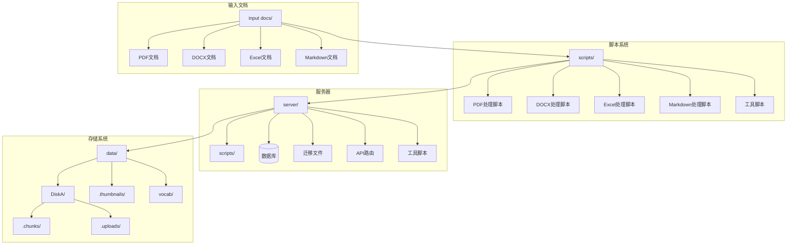

**图表来源**
- [scripts/README.md](file://scripts/README.md#L1-L32)
- [server/package.json](file://server/package.json#L1-L39)
- [server/index.js](file://server/index.js#L27-L31)

**章节来源**
- [scripts/README.md](file://scripts/README.md#L1-L32)
- [server/package.json](file://server/package.json#L1-L39)
- [server/index.js](file://server/index.js#L27-L31)

## 核心组件

### PDF知识导入系统

系统提供了两个版本的PDF处理能力：

#### 基础PDF导入器
- 支持标准PDF解析和章节检测
- 基于正则表达式的章节分割算法
- 自动产品型号识别和分类

#### 增强PDF导入器
- 智能章节检测算法
- 多种标题模式识别
- 语义化内容分块
- 智能图片匹配

**章节来源**
- [server/scripts/import_knowledge_from_pdf.js](file://server/scripts/import_knowledge_from_pdf.js#L1-L293)
- [server/scripts/import_knowledge_from_pdf_enhanced.js](file://server/scripts/import_knowledge_from_pdf_enhanced.js#L1-L428)

### DOCX文档处理系统

**新增** DOCX处理系统提供了完整的Word文档处理能力：

#### DOCX专用处理器
- Word文档结构解析
- 图片提取和保存
- 章节结构识别
- 内容格式保持
- 支持MAVO Edge 6K操作手册专用处理

#### DOCX到HTML转换器
**新增** 专用的HTML转换脚本，提供以下功能：
- 保留标题层级（h1~h6）
- 转换表格为HTML table
- 提取图片并转WebP
- 保留粗体/斜体格式
- 支持复杂文档结构处理

#### DOCX到Markdown转换器
- 高级DOCX到Markdown转换
- 表格完整支持
- 图片WebP格式转换
- 文本格式保留（粗体、斜体、列表）

**章节来源**
- [server/scripts/import_edge6k_from_docx.py](file://server/scripts/import_edge6k_from_docx.py#L1-L290)
- [server/scripts/docx_to_html.py](file://server/scripts/docx_to_html.py#L1-L218)
- [server/scripts/docx_to_markdown.py](file://server/scripts/docx_to_markdown.py#L1-L211)

### Excel知识库导入
- 多工作表支持
- 结构化数据处理
- 分类标签自动分配
- 数据验证和清洗

### Markdown转换系统
- 标题层级保留
- 表格格式转换
- 图片提取和WebP转换
- 格式化保持

**章节来源**
- [server/scripts/import_knowledge_from_excel.js](file://server/scripts/import_knowledge_from_excel.js#L1-L390)
- [server/scripts/import_from_markdown.py](file://server/scripts/import_from_markdown.py#L1-L211)

### 数据库集成层

系统使用SQLite数据库存储知识库内容，支持全文搜索和高级查询功能。

**更新** 数据库架构已扩展以支持DOCX源类型标识：

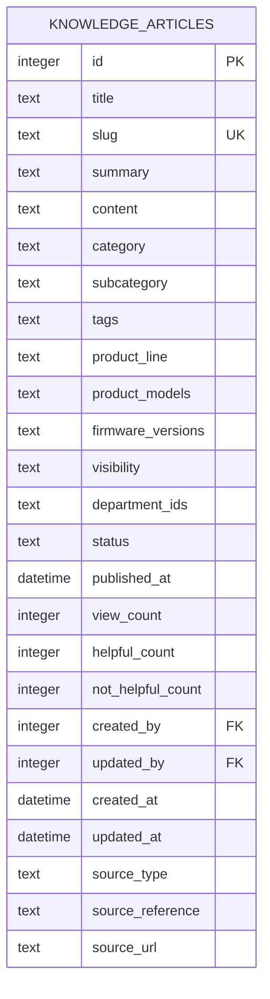

**图表来源**
- [server/migrations/add_docx_source_type.sql](file://server/migrations/add_docx_source_type.sql#L44-L47)

**章节来源**
- [server/service/migrations/005_knowledge_base.sql](file://server/service/migrations/005_knowledge_base.sql#L1-L214)
- [server/migrations/add_docx_source_type.sql](file://server/migrations/add_docx_source_type.sql#L1-L73)

### 数据库恢复工具

**新增** 数据库恢复工具提供了完整的数据迁移和恢复功能：

#### 数据库恢复器
- 支持从损坏数据库文件恢复数据
- 自动处理外键约束和数据完整性
- 智能列映射和冲突解决
- 批量数据迁移和同步

#### 路径迁移工具
- 支持部门文件夹路径标准化
- 自动处理中英文路径转换
- 智能文件夹合并和重命名
- 数据库路径同步更新

**章节来源**
- [server/restore_db.js](file://server/restore_db.js#L1-L105)
- [server/migrate_dept_paths.js](file://server/migrate_dept_paths.js#L1-L82)

### 网页内容导入系统

**新增** Jina Reader集成系统提供了强大的网页内容提取能力：

#### Jina Reader集成
- Turbo模式：智能目标选择器精准提取主要内容
- 回退机制：422错误时自动切换到无选择器模式
- 缓存控制：X-No-Cache头确保实时内容获取
- Markdown格式：直接获取纯文本内容

#### 内容净化系统
- 导航噪声过滤：自动移除面包屑、前后页链接等导航内容
- 评论区清理：识别并移除热门评论、相关推荐等干扰内容
- 标题移除算法：改进的HTML内容净化和结构清理
- 图片去重处理：Set去重和非内容图片过滤

**章节来源**
- [server/service/routes/knowledge.js](file://server/service/routes/knowledge.js#L999-L1070)
- [server/service/routes/knowledge.js](file://server/service/routes/knowledge.js#L897-L965)
- [server/service/routes/knowledge.js](file://server/service/routes/knowledge.js#L2115-L2138)

### WebP图像处理系统

**新增** 全面升级的WebP图像处理系统：

#### 图像提取优化
- PDF图像提取：支持透明背景处理和WebP格式转换
- 图像哈希去重：防止重复图片导入
- 尺寸过滤：自动跳过过小图片（图标、装饰等）
- 质量优化：平衡压缩率和视觉质量

#### 缩略图生成
- Sharp集成：高性能图像处理库
- 缓存机制：智能缓存避免重复处理
- 并发控制：队列管理防止服务器过载
- 多格式支持：视频、HEIC等格式特殊处理

**章节来源**
- [server/scripts/extract_pdf_images.py](file://server/scripts/extract_pdf_images.py#L57-L88)
- [server/index.js](file://server/index.js#L970-L1107)
- [server/index.js](file://server/index.js#L3470-L3535)

## 架构概览

系统采用分层架构设计，各组件职责明确：

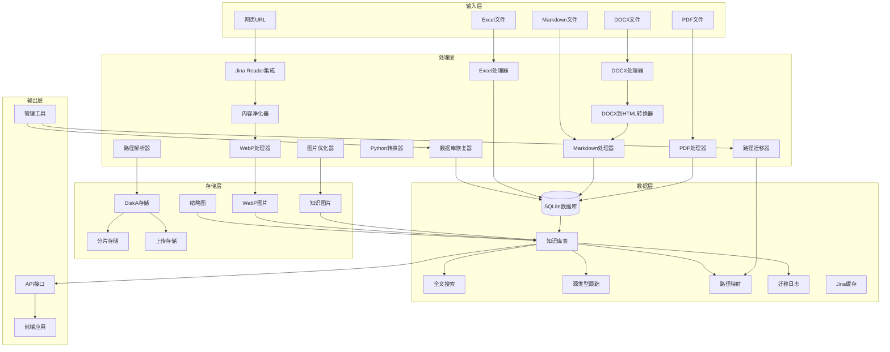

**图表来源**
- [server/service/migrations/005_knowledge_base.sql](file://server/service/migrations/005_knowledge_base.sql#L10-L50)
- [server/migrations/add_docx_source_type.sql](file://server/migrations/add_docx_source_type.sql#L44-L47)
- [server/index.js](file://server/index.js#L27-L31)

## 详细组件分析

### PDF处理组件

#### 基础PDF处理器
该组件实现了标准的PDF内容提取和处理功能：

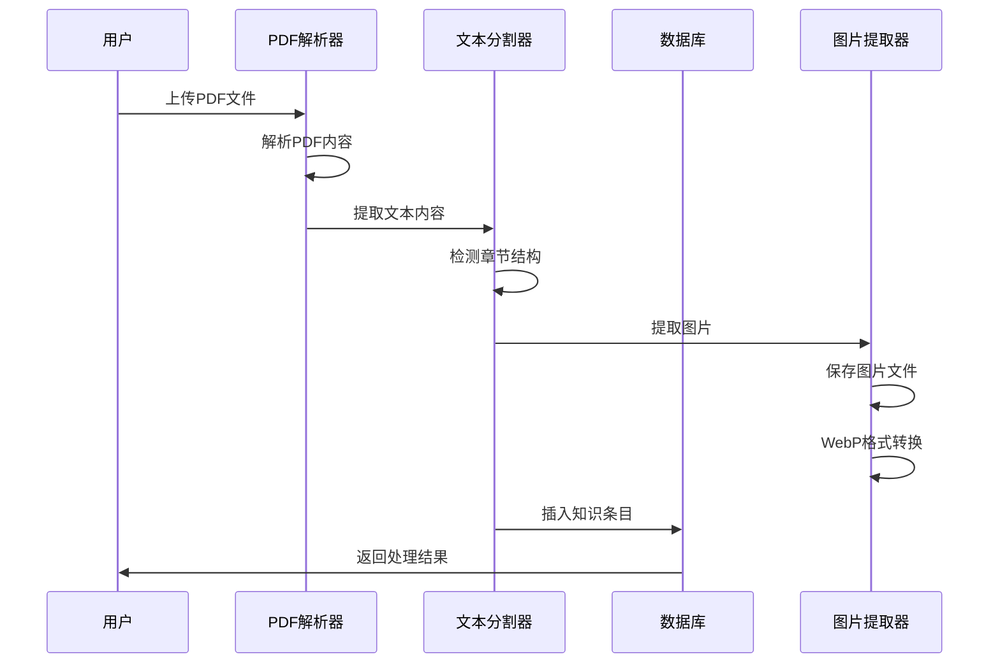

**图表来源**
- [server/scripts/import_knowledge_from_pdf.js](file://server/scripts/import_knowledge_from_pdf.js#L139-L193)

#### 增强PDF处理器
该组件提供了更智能的处理能力：

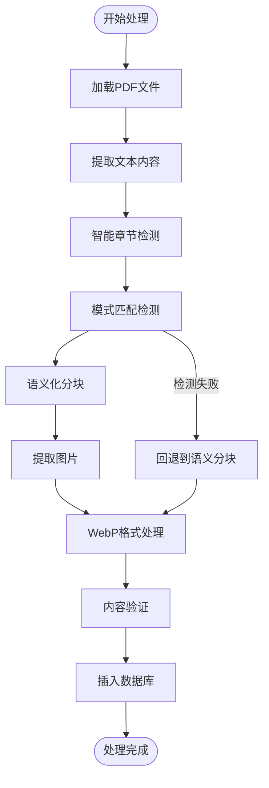

**图表来源**
- [server/scripts/import_knowledge_from_pdf_enhanced.js](file://server/scripts/import_knowledge_from_pdf_enhanced.js#L42-L178)

**章节来源**
- [server/scripts/import_knowledge_from_pdf.js](file://server/scripts/import_knowledge_from_pdf.js#L1-L293)
- [server/scripts/import_knowledge_from_pdf_enhanced.js](file://server/scripts/import_knowledge_from_pdf_enhanced.js#L1-L428)

### DOCX处理组件

**新增** DOCX处理器实现了完整的文档结构解析：

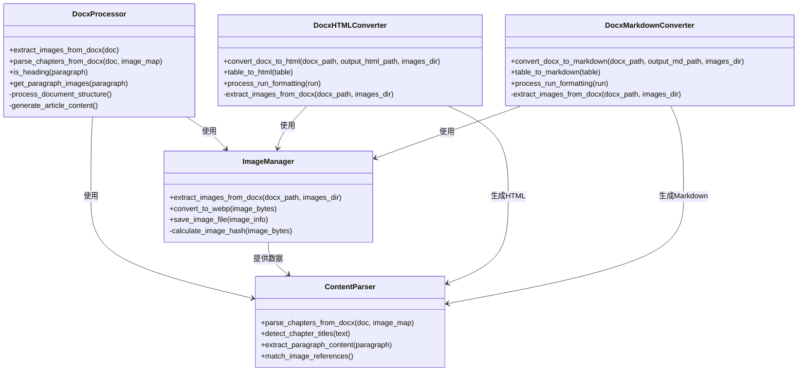

**图表来源**
- [server/scripts/import_edge6k_from_docx.py](file://server/scripts/import_edge6k_from_docx.py#L30-L170)
- [server/scripts/docx_to_html.py](file://server/scripts/docx_to_html.py#L118-L202)
- [server/scripts/docx_to_markdown.py](file://server/scripts/docx_to_markdown.py#L113-L195)

**章节来源**
- [server/scripts/import_edge6k_from_docx.py](file://server/scripts/import_edge6k_from_docx.py#L1-L290)
- [server/scripts/docx_to_html.py](file://server/scripts/docx_to_html.py#L1-L218)
- [server/scripts/docx_to_markdown.py](file://server/scripts/docx_to_markdown.py#L1-L211)

### Excel知识库导入器

Excel处理器支持多工作表的复杂数据结构：

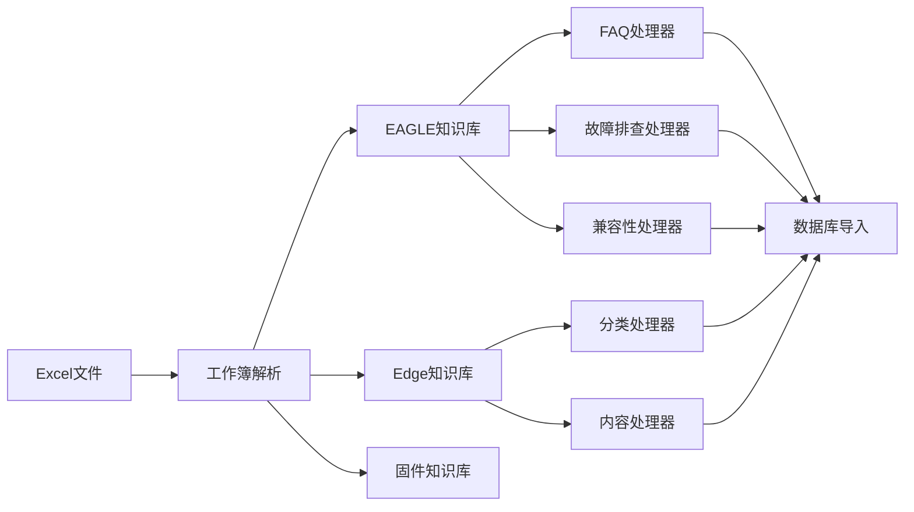

**图表来源**
- [server/scripts/import_knowledge_from_excel.js](file://server/scripts/import_knowledge_from_excel.js#L53-L162)

**章节来源**
- [server/scripts/import_knowledge_from_excel.js](file://server/scripts/import_knowledge_from_excel.js#L1-L390)

### API路由系统

**新增** DOCX导入API路由提供了完整的文件处理流程：

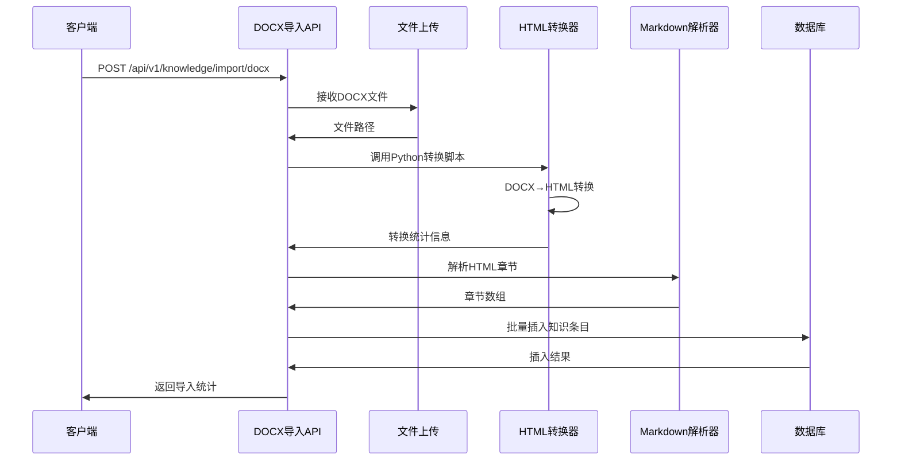

**图表来源**
- [server/service/routes/knowledge.js](file://server/service/routes/knowledge.js#L505-L823)

**章节来源**
- [server/service/routes/knowledge.js](file://server/service/routes/knowledge.js#L505-L823)

### 数据库恢复系统

**新增** 数据库恢复系统提供了完整的数据迁移和恢复功能：

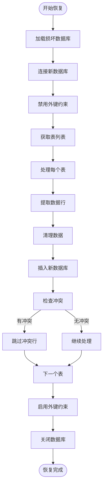

**图表来源**
- [server/restore_db.js](file://server/restore_db.js#L48-L96)

**章节来源**
- [server/restore_db.js](file://server/restore_db.js#L1-L105)

### 路径管理系统

**新增** 路径管理系统提供了统一的存储路径解析和管理：

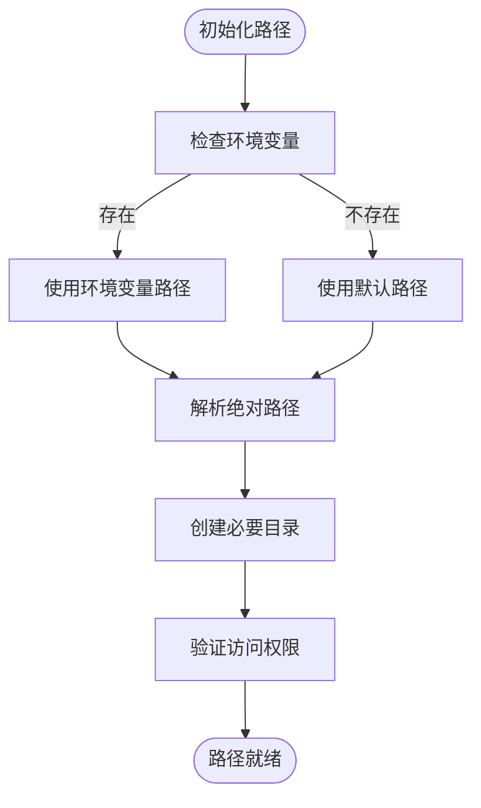

**图表来源**
- [server/index.js](file://server/index.js#L27-L28)
- [server/fix_missing_files.js](file://server/fix_missing_files.js#L9-L14)

**章节来源**
- [server/index.js](file://server/index.js#L27-L28)
- [server/fix_missing_files.js](file://server/fix_missing_files.js#L9-L14)

### Jina Reader集成系统

**新增** Jina Reader集成为网页内容导入提供了强大的Turbo模式：

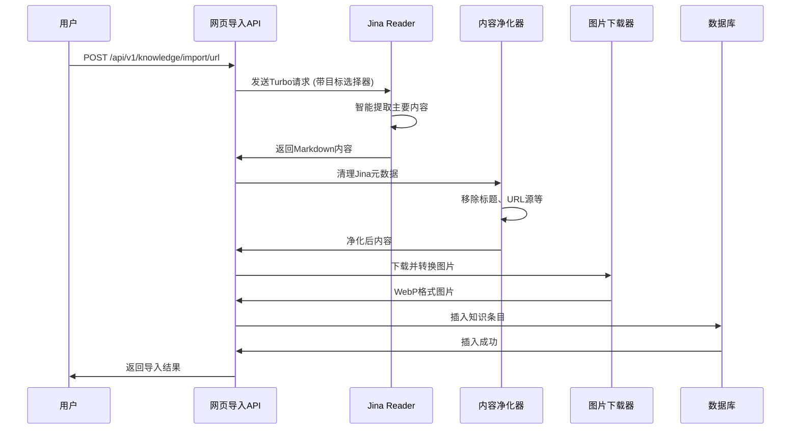

**图表来源**
- [server/service/routes/knowledge.js](file://server/service/routes/knowledge.js#L999-L1070)

**章节来源**
- [server/service/routes/knowledge.js](file://server/service/routes/knowledge.js#L999-L1070)

### WebP图像处理系统

**新增** 全面升级的WebP图像处理系统：

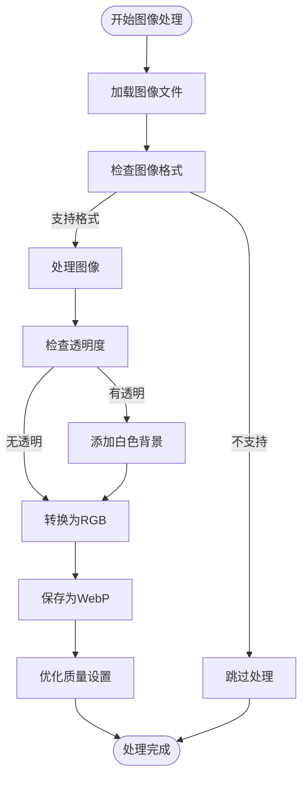

**图表来源**
- [server/scripts/extract_pdf_images.py](file://server/scripts/extract_pdf_images.py#L75-L88)
- [server/index.js](file://server/index.js#L1077-L1102)

**章节来源**
- [server/scripts/extract_pdf_images.py](file://server/scripts/extract_pdf_images.py#L57-L88)
- [server/index.js](file://server/index.js#L1077-L1107)

## 依赖分析

系统依赖关系分析：

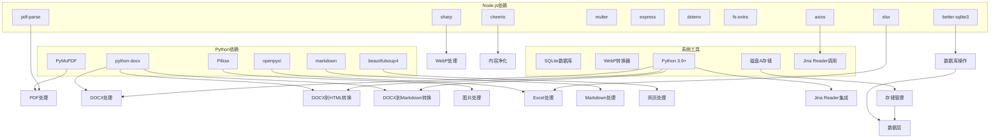

**图表来源**
- [server/package.json](file://server/package.json#L15-L36)

**章节来源**
- [server/package.json](file://server/package.json#L1-L39)

## 性能考虑

### 处理效率优化

1. **批量处理**：所有脚本都支持批量处理多个文件
2. **内存管理**：大型文件处理时采用流式处理
3. **并发处理**：支持多进程并行处理
4. **缓存机制**：重复处理时使用缓存避免重复计算
5. ****新增** Python脚本优化**：DOCX转换使用专门的Python脚本，提高处理效率
6. ****新增** HTML转换器优化**：DOCX到HTML转换器支持直接生成HTML，减少中间步骤
7. ****新增** 存储路径优化**：统一使用DiskA/路径，提升文件访问性能
8. ****新增** Jina Reader缓存**：Turbo模式支持缓存控制，提升响应速度
9. ****新增** WebP处理优化**：透明背景处理和质量优化，平衡文件大小和视觉质量
10. ****新增** 内容净化优化**：改进的标题移除算法，减少不必要的内容处理

### 存储优化

1. **图片压缩**：自动将PNG转换为WebP格式
2. **数据库优化**：使用索引和FTS全文搜索
3. **内容去重**：自动检测和跳过重复内容
4. **增量更新**：支持增量导入和更新
5. ****新增** 源类型跟踪**：通过source_type字段优化查询性能
6. ****新增** 数据库恢复优化**：批量数据处理，减少恢复时间
7. ****新增** 图像优化**：WebP格式转换，提升图片加载性能
8. ****新增** 缩略图缓存**：智能缓存机制，避免重复生成
9. ****新增** 并发控制**：队列管理防止服务器过载

### 路径管理优化

1. **环境变量支持**：通过DISK_A环境变量灵活配置存储路径
2. **平台适配**：支持不同操作系统下的路径解析
3. **自动创建**：路径不存在时自动创建目录结构
4. **权限检查**：启动时验证存储权限和空间

### 网页导入优化

1. **智能目标选择器**：精准提取主要内容，减少无关内容处理
2. **回退机制**：422错误时自动切换到无选择器模式
3. **内容长度验证**：最小100字符验证，避免空内容导入
4. **图片去重**：Set去重和非内容图片过滤
5. **导航噪声过滤**：自动移除面包屑、前后页链接等导航内容

## 故障排除指南

### 常见问题及解决方案

#### PDF处理问题
- **问题**：PDF解析失败
  - **原因**：PDF加密或损坏
  - **解决方案**：检查PDF文件完整性，移除密码保护

- **问题**：章节分割不准确
  - **原因**：文档格式不符合预期
  - **解决方案**：手动调整分割策略或使用增强版本

#### DOCX处理问题
**新增** DOCX处理专用故障排除：

- **问题**：DOCX转换失败
  - **原因**：Python依赖缺失或版本不兼容
  - **解决方案**：安装python-docx、Pillow、markdown等依赖包

- **问题**：HTML转换器执行失败
  - **原因**：Python环境配置错误或权限不足
  - **解决方案**：检查Python路径配置，确保有执行权限

- **问题**：图片提取失败
  - **原因**：图片格式不支持或损坏
  - **解决方案**：检查图片格式，转换为支持的格式

- **问题**：章节识别错误
  - **原因**：文档结构不符合预期
  - **解决方案**：检查文档标题样式，确保使用标准Heading样式

- **问题**：存储路径错误
  - **原因**：DOCX导入路径从data/更新为DiskA/
  - **解决方案**：检查环境变量DISK_A配置，确保路径正确

#### 网页导入问题
**新增** Jina Reader集成故障排除：

- **问题**：Jina Reader请求失败
  - **原因**：网络连接问题或服务不可用
  - **解决方案**：检查网络连接，确认Jina Reader服务状态

- **问题**：Turbo模式目标选择器失败
  - **原因**：网页结构变化导致选择器失效
  - **解决方案**：系统会自动回退到无选择器模式，无需手动干预

- **问题**：内容长度不足
  - **原因**：网页内容提取失败或为空
  - **解决方案**：返回400错误并提示使用Jina Reader模式

- **问题**：图片下载失败
  - **原因**：图片URL无效或网络问题
  - **解决方案**：检查图片URL有效性，确认网络连接正常

- **问题**：内容净化不彻底
  - **原因**：导航噪声或评论区未完全移除
  - **解决方案**：检查净化算法，更新CSS选择器

#### WebP图像处理问题
**新增** WebP处理专用故障排除：

- **问题**：WebP转换失败
  - **原因**：Sharp库问题或图像格式不支持
  - **解决方案**：检查Sharp安装，确认图像格式支持

- **问题**：透明背景处理异常
  - **原因**：图像模式转换错误
  - **解决方案**：检查图像模式判断逻辑

- **问题**：缩略图生成失败
  - **原因**：并发处理超时或资源不足
  - **解决方案**：调整并发限制，检查系统资源

- **问题**：缓存失效
  - **原因**：缓存文件损坏或过期
  - **解决方案**：删除损坏缓存文件，重新生成

#### 数据库问题
- **问题**：导入失败
  - **原因**：数据库连接问题或权限不足
  - **解决方案**：检查数据库连接，确保有足够的权限

- **问题**：源类型约束错误
  - **原因**：数据库迁移未完成
  - **解决方案**：运行数据库迁移脚本

- **问题**：数据恢复失败
  - **原因**：损坏数据库文件不存在
  - **解决方案**：确认longhorn.db.broken文件存在，检查文件权限

#### 路径管理问题
- **问题**：存储路径解析失败
  - **原因**：环境变量配置错误
  - **解决方案**：检查DISK_A环境变量设置，确保路径有效

- **问题**：文件夹权限不足
  - **原因**：存储目录权限不够
  - **解决方案**：检查并修改存储目录权限，确保读写权限

**章节来源**
- [server/scripts/import_knowledge_from_pdf.js](file://server/scripts/import_knowledge_from_pdf.js#L263-L293)
- [server/scripts/import_knowledge_from_pdf_enhanced.js](file://server/scripts/import_knowledge_from_pdf_enhanced.js#L395-L428)
- [server/migrations/add_docx_source_type.sql](file://server/migrations/add_docx_source_type.sql#L1-L73)
- [server/restore_db.js](file://server/restore_db.js#L5-L6)
- [server/migrate_dept_paths.js](file://server/migrate_dept_paths.js#L6-L10)
- [server/service/routes/knowledge.js](file://server/service/routes/knowledge.js#L999-L1070)

## 结论

Longhorn项目的知识导入自动化脚本系统提供了完整的文档处理和知识库管理解决方案。系统具有以下优势：

1. **多格式支持**：支持PDF、DOCX、Excel、Markdown等多种文档格式
2. **智能处理**：具备智能章节检测、内容分割和图片提取能力
3. **可扩展性**：模块化设计便于功能扩展和定制
4. **性能优化**：采用批量处理和缓存机制提高处理效率
5. **数据完整性**：提供完整的数据验证和错误处理机制
6. ****新增** DOCX专用支持**：完整的Word文档处理管道，支持MAVO Edge 6K等产品的专业文档导入
7. ****新增** DOCX到HTML转换器**：支持文档结构保留、图像优化、格式保持，提供更灵活的内容处理选项
8. ****新增** 数据库恢复工具**：提供完整的数据迁移和恢复功能，确保数据安全
9. ****新增** 统一存储架构**：DOCX导入路径从data/更新为DiskA/，提升系统可维护性
10. ****新增** Jina Reader集成**：Turbo模式网页内容提取，智能目标选择器精准定位主要内容
11. ****新增** WebP图像处理**：透明背景处理和质量优化，提升视觉质量和加载性能
12. ****新增** 改进的内容净化**：增强的标题移除算法和导航噪声过滤，提升内容质量

**更新** 新增的Jina Reader集成、WebP图像处理和改进的内容标题移除算法显著提升了系统的智能化水平和处理质量。Jina Reader的Turbo模式通过智能目标选择器能够精准提取网页主要内容，同时支持回退机制确保兼容性。WebP格式转换不仅优化了图片压缩效果，还特别处理了透明背景，提升了视觉质量和加载性能。改进的内容净化算法能够更好地识别和移除导航噪声、评论区等干扰内容，确保导入内容的纯净度和相关性。

该系统为知识库的自动化管理和维护提供了强有力的技术支撑，大大提高了知识内容的处理效率和准确性，特别是在处理专业文档和网页内容方面表现尤为突出。新增的功能进一步增强了系统的完整性和实用性，为知识管理提供了更加完善的解决方案。